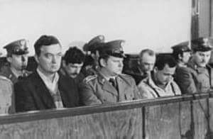
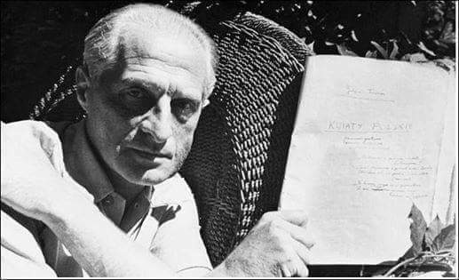
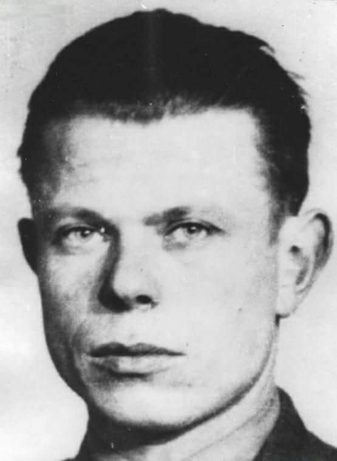
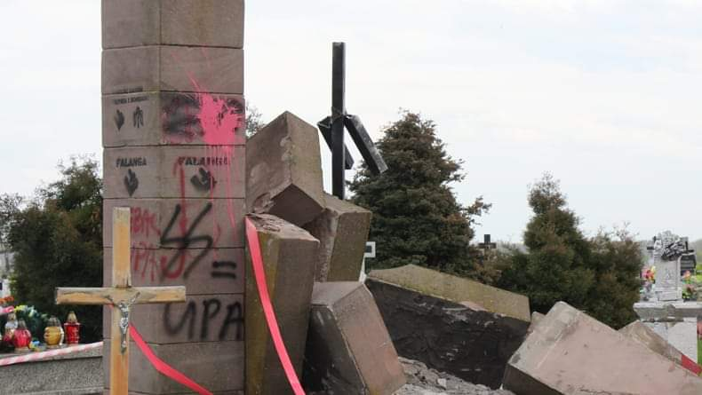
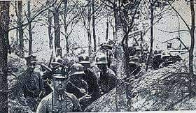
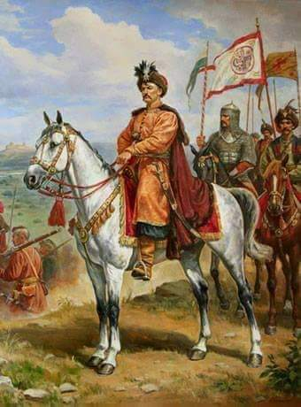
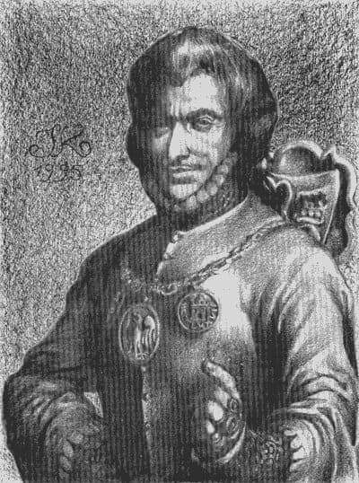

### 1981

Amerykański tygodnik "Time Magazine" przyznał przewodniczącemu NSZZ Solidarność tytuł "Człowieka Roku 1981". Był on pierwszym Polakiem, któremu przyznano ten tytuł.

### 1984

1984 roku przed Sądem Wojewódzkim w Toruniu rozpoczął się proces zabójców księdza Jerzego Popiełuszki. Na ławie oskarżonych znaleźli się kapitan Służby Bezpieczeństwa Grzegorz Piotrowski, porucznik Leszek Pękala, porucznik Waldemar Chmielewski i pułkownik Adam Pietruszka.
Według ocen historyków, proces ten, jedyny w historii Polski, w którym na ławie oskarżonych zasiedli funkcjonariusze SB był farsą, mającą na celu udowodnienie "dobrej woli" szefostwa MSW, które w ten sposób chciało pokazać, że sama bezpieka chce jak najszybciej ukarać wszystkich winnych tej zbrodni.
Procesowi towarzyszyły szczególne środki bezpieczeństwa. Wprowadzono specjalne przepustki by nie każdy chętny mógł go śledzić; selekcjonowano polskich dziennikarzy (ich teksty podlegały - jak zawsze - cenzurze), pozwolono na obecność tylko kilku reporterom zachodnim; wśród publiczności było wielu oficerów SB. Zrobiono wiele, by na procesie nie zostały ujawnione niewygodne dla władz fakty m.in. o inwigilacji Kościoła katolickiego - np. w relacjach z procesu w kontrolowanych przez państwo środkach przekazu nigdy nie podano, że departament IV zajmował się właśnie tym.
Główna uwaga sędziów i oskarżycieli skupiła się na bezpośrednich wykonawcach mordu. Nie zajęto się natomiast nigdy w większym stopniu osobami generałów Płatka i Ciastonia, na których mocodawstwo w tej zbrodni wskazywały niektóre okoliczności ujawnione podczas tego procesu. Płatek zeznawał jedynie jako świadek; Ciastoń w ogóle nie był wezwany do sądu. Obu odwołano wtedy jednak ze stanowisk i wysłano na podrzędne placówki zagraniczne. Po 1989 r. obaj zostali oskarżeni, głównie na podstawie nowych zeznań Pietruszki, o kierowanie zabójstwem księdza (byli wtedy nawet na dwa lata aresztowani). W 1994 r. zostali niejednomyślnie uniewinnieni, z braku dowodów winy, przez Sąd Wojewódzki w Warszawie.
Jak wielkie zakłamanie towarzyszyło tej sprawie świadczyć może fakt, że główny oskatżony Grzegorz Piotrowski w swoich zeznaniach stwierdzał, że chciał w ten sposób położyć kres "pozareligijnej działalności" księdza Jerzego Popiełuszki, a prokurator, który zażądał dla niego kary śmierci, w mowie końcowej zrównał księdza Jerzego z jego oprawcami, stwierdzając:
" Ekstremalna postawa księdza Jerzego Popiełuszki zrodziła nie mniej szkodliwą ekstremę, której produktem są odrażające zbrodnie będące przedmiotem osądu w niniejszej sprawie (...) W tym procesie spotkały się dwie postawy mające jednak jeden wspólny mianownik. Pierwsza charakteryzuje niektórych duchownych, którzy mieszając ambonę z mikrofonem "Wolnej Europy", lekceważą obowiązujące prawa (...) I druga, dotycząca tych, którzy uznali za możliwe zwrócenie się przeciwko polityce państwa poprzez postawienie się ponad prawem i popełnienie najcięższej zbrodni, zbrodni przeciw życiu ludzkiemu. Obie te postawy trzeba charakteryzować jako ekstremalne. Ksiądz Popiełuszko siał nienawiść, lżył, poniżał, szydził, wzywał do niepokojów społecznych".
Proces zakończył się 7 lutego 1985 roku. Grzegorza Piotrowskiego i Adama Pietruszkę skazano na 25 lat więzienia, Pękala i Chmielewski zostali skazani na 15 lat. Wszyscy zostali zwolnieni wcześniej.

 

### 1953

1953 roku w Zakopanem zmarł Julian Tuwim - polski poeta pochodzenia żydowskiego, którego poezję śpiewali Ewa Demarczyk, Hanka Ordonówna ''Miłość ci wszystko wybaczy'', Czesław Niemen "Wspomnienie" czy "Jeżeli", Marek Grechuta "Pomarańcze i mandarynki", "Zadymka". Ponadto tłumacz literatury rosyjskiej, współzałożyciel kabaretu literackiego „Pod Picadorem”, a także współtwórca grupy poetyckiej Skamander. Jedna z opowieści głosi, że w kieszeni zmarłego poety znaleziono kartkę, na której napisane było zdanie: „Dla oszczędności zgaście światło wiekuiste, gdyby miało mi kiedyś zaświecić”. Julian Tuwim był autorem zbiorów wierszy ''Czyhanie na Boga'', ''Sokrates tańczący'', ''Rzecz czarnoleska'', satyry ''Bal w operze'', poematu ''Kwiaty polskie'', wierszy i bajek dla dzieci ‘’Lokomotywa’’, ‘’Tańcowały dwa Michały’’, ‘’Murzynek Bambo’’, ''Słoń Trąbalski'', zbiorów osobliwości obyczajowo-literackiej ''Czary i czarty polskie'', ''Pegaz dęba''. W 1951 roku otrzymał Nagrodę państwową. Swoistą ciekawostką z życia Juliana Tuwima, o której niewiele się mówi jest fakt, że uratował on życie pięciu żołnierzy wyklętych: po wojnie Julian Tuwim interweniował u prezydenta Bolesława Bieruta i w Urzędzie Bezpieczeństwa, aby uratować życie pięciu partyzantów Narodowych Sił Zbrojnych. Wśród wspomnianej piątki partyzantów był m.in. porucznik Jerzy Kozarzewski ps. ,,Konrad'', który w czasie okupacji hitlerowskiej pomagał matce poety pani Adeli Tuwim. Tuwim pomógł również podpułkownikowi szefowi Biura Informacji w KG NSZ Mirosławowi Ostromęckiemu ps. ,,Orski'', wobec którego poeta nie miał żadnych zobowiązań. Ostatecznie Tuwimowi udało się nakłonić prezydenta Bieruta, by ten skorzystał z prawa łaski.

 

### 1947

W Warszawie zakończył się trwający trzy i pół tygodnia proces działaczy Komitetu Porozumiewawczego Organizacji Polski Podziemnej "Stocznia". Jednym z podsądnych był Stanisław Jerzy Sędziak (zdjęcie) uczestnik wojny obronnej, działacz antukomunistyczny, podpułkownik dyplomowany Piechoty Wojska Polskiego zastępca, a następnie szef sztabu Okręgu Białystok Obywatelskiej Armii Krajowej, Delegat Sił Zbrojnych na Okręg Białystok, w latach 1945-1947 zastępca prezesa Zarządu Obszaru Centralnego WiN, Cichociemny. Sędziakowi postawiono zarzut działania na szkodę Polski i próby zmiany ustroju. Śledztwo w jego sprawie prowadził cieszący się złą sławą oficer śledczy Wydziału Śledczego UB major Jerzy Kaskiewicz, ten sam, który prowadził brutalne śledztwo w sprawie dowódcy oddziałów partyzanckich Armii Krajowej Hieronima Dekutowskiego.
Stanisław Jerzy Sędziak skazany został początkowo na karę śmierci, którą, na mocy amnestii z 22 lutego 1947 roku zamieniono na dożywotnie więzienie. Wyrok odsiadywał w więzieniach we Wronkach, Rawiczu i Strzelcach Opolskich. Na mocy amnestii z 27 kwietnia 1956 roku Wojskowy Sąd Garnizonowy w Warszawie 7 maja 1956 roku złagodził mu karę do 12 lat więzienia. 24 kwietnia 1957 roku Rada Państwa, korzystając z prawa łaski, zawiesiła mu resztę kary na dwa lata. Wyszedł na wolność 29 kwietnia 1957 roku.
Zmarł 2 sierpnia 1978 roku w Toruniu. Jego oprawca zmarł 11 grudnia 1999 roku w Warszawie.

 

### 1945

Poniższy tekst to treść interpelacji poselskiej autorstwa posła Polskiego Stronnictwa Ludowego Michała Głowacza, zgłoszonej w imieniu klubu poselskiego tej partii do ministra bezpieczeństwa publicznego, opisująca sytuację ludności powiatu przemyskiego:

"Po dzień 27 grudnia 1945 r. bandy ukraińskie spaliły 70 gromad oraz 6 przysiółków i zostało zamordowanych 300 Polaków. Ludność ze spalonych gromad, ratując się ucieczką, schroniła się do miasta Przemyśla, nie mając odpowiedniego mieszkania ani środków żywności dla siebie i dla inwentarza żywego. Ludność polska pozostałej części powiatu przemyskiego żyje w ciągłym strachu przed bandami ukraińskimi, woła o pomoc i zabezpieczenie. Wobec powyższego stanu rzeczy podpisani zapytują ob. ob. Ministrów, co zamierzają zrobić, ażeby zabezpieczyć pozostałą część powiatu od palenia, rabunku i mordowania ludzi, a pozbawionym dachu nad głowami środki do życia".
Na zdjęciu zniszczony nielegalny pomnik UPA w Hruszowicach.

 

### 1918

Wybuchło powstanie wielkopolskie-zbrojny bunt ludności polskiej zamieszkującej Prowincję Poznańską przeciwko Rzeszy Niemieckiej.
Powstańcy domagali się powrotu ziem zaboru pruskiego do Polski.
Powstanie wielkopolskie było jednym z czterech zwycięskich powstań w naszej historii. Zakończyło się 16 lutego 1919 roku podpisaniem rozejmu w Trewirze.
Na zdjęciu powstańcy wielkopolscy w styczniu 1919 roku.

 

### 1595

W Czehryniu koło Kijowa urodził się Bohdan Chmielnicki (grafika)-hetman kozacki, przywódca antypolskiego powstania w 1648 roku, ukraiński bohater narodowy.
Wsławił się niezwykłym okrucieństwem,co doskonale opisuje kronikarz żydowski Natan Hannover. W swojej kronice opisującej bitwę pod Korsuniem 26 maja 1648 roku między wojskami Mikołaja Potockiego, a właśnie siłami Chmielnickiego pisze on: "Wojska Chmielnickiego obcinały swym ofiarom ręce i nogi, a kadłuby rzucano na drogę. Innych grzebano żywcem, kobietom ciężarnym rozpruwano brzuchy, wieszano niemowlęta na piersiach matek".
Henryk Sienkiewicz w "Trylogii" pisał o nim w następujący sposób:

>Głowę miał ogromną, cerę zwiędłą, bardzo ogorzałą, oczy czarne i nieco ukośne jak u Tatara, a nad wąskimi ustami zwieszał mu się cienki wąs, rozchodzący się dopiero przy końcach na dwie szerokie kiście. Twarz jego potężna zwiastowała odwagę i dumę. Było w niej coś pociągającego i odpychającego zarazem - powaga hetmańska ożeniona z tatarską chytrością, dobrotliwość i dzikość."

 

Chmielnicki zmarł 6 sierpnia 1657 roku.

### 1355

W Kaliszu książę mazowiecki Siemowit III (grafika) złożył hołd lenny królowi Kazimierzowi Wielkiemu. Tym samym mazowiecki władca zobowiązał się do nie zawiązywania antypolskich sojuszy, umorzenia długu i zwrotu Polsce ziemi płockiej.

 

---

<a href="https://github.com/TomaszWaszczyk/historia.waszczyk.com/edit/master/src/content/december-27.md" target="_blank">Edytuj tę stronę dzieląc się własnymi notatkami!</a>
