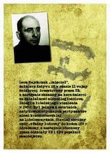
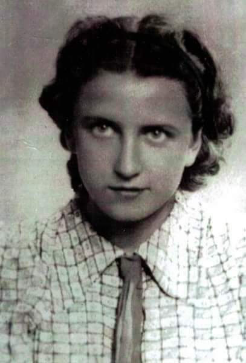
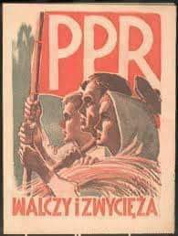
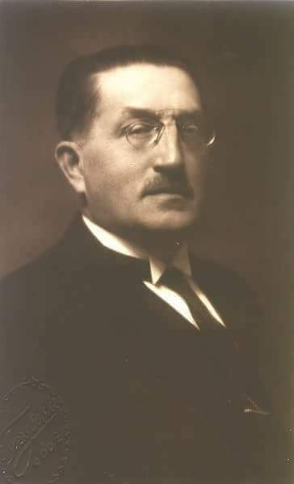
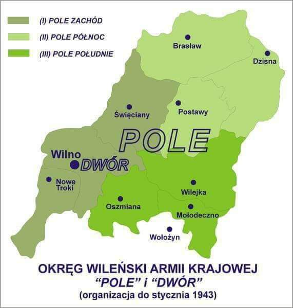
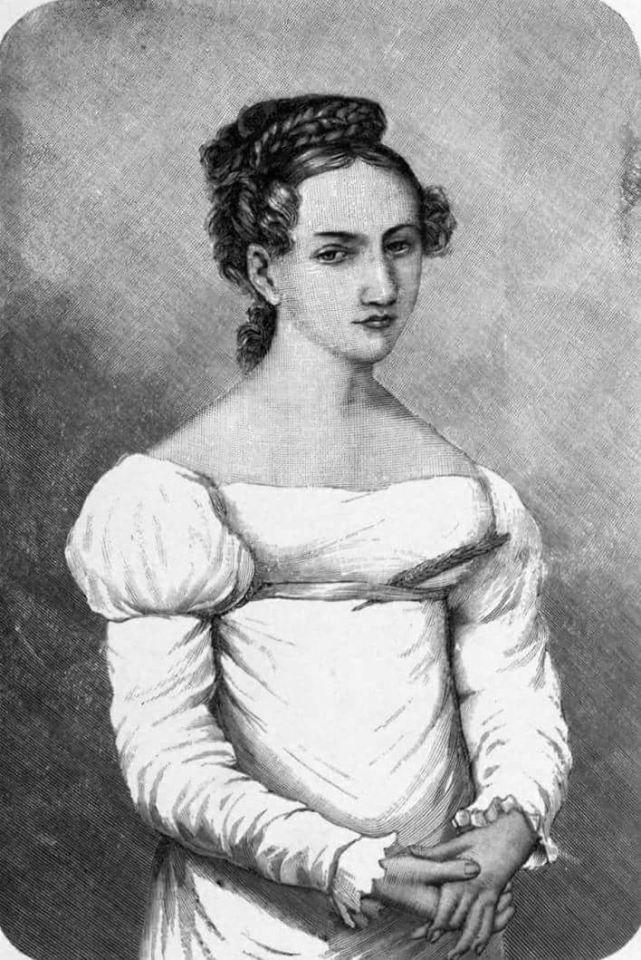
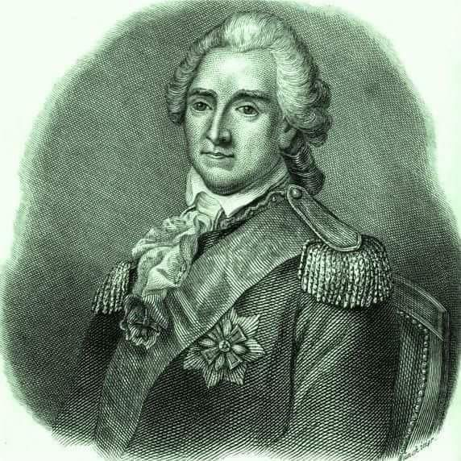

### 1989

Sejm przyjął ustawy składające się na tzw. plan Balcerowicza. Jego celem miała być budowa fundamentów gospodarki rynkowej. Przemiany te jednak niosły z sobą ogromne koszty społeczne. Założenia i efekty planu do dziś wzbudzają wiele dyskusji.

Przez niemal całą dekadę lat osiemdziesiątych – od wprowadzenia stanu wojennego po pierwsze miesiące roku 1989 – władze PRL podejmowały nieudane próby wyprowadzenia gospodarki z głębokiego kryzysu, w którym tkwiła od schyłku rządów Edwarda Gierka. W latach 1982–1987 realizowano tzw. pierwszy etap reformy. Zakładano m.in. nadanie przedsiębiorstwom państwowym większego zakresu niezależności i stopniową rezygnację z systemu centralnego planowania. Komuniści zamierzali również stworzyć nowy system podatkowy. Wiele nadziei pokładano w tworzeniu przedsiębiorstw z kapitałem zagranicznym, które miały stać się oazami innowacyjności oraz „oknami na świat”. Paradoksalnie, ale w zgodzie z interesami Kremla, w projektach reform zakładano zwiększanie wydatków zbrojeniowych. W 1983 r. szacowano je na ponad 8 proc. PKB.
W czasie wdrażania reform uchwalono 320 nowych ustaw oraz 12 tys. innych aktów prawnych. Tak wielka liczba uregulowań pogłębiła chaos i nie doprowadziła do choćby częściowego rozwiązania podstawowych problemów gospodarki, m.in. zaopatrzenia. Nieoczekiwanym rezultatem „pierwszego etapu reformy” był rozwój sektora prywatnego, głównie w sferze usług i handlu.

W drugim etapie reformy, realizowanym od 1987 r., wprowadzono m.in. zmiany w funkcjonowaniu systemu bankowego i zezwolono na swobodny obrót walutami. Symbolem działań rządów Zbigniewa Messnera i Mieczysława F. Rakowskiego była uchwalona w grudniu 1988 r. ustawa o swobodzie działalności gospodarczej. Niesławnym elementem reformy było utworzenie Funduszu Obsługi Zadłużenia Zagranicznego.
W całym okresie rządów ekipy Jaruzelskiego złotówka stopniowo traciła na wartości. Masowy druk pieniądza nie miał swego odzwierciedlenia w dostępności towarów i prowadził jedynie do napędzania inflacji. Topniały oszczędności, co powodowało dążenie do wymiany bezwartościowych złotówek na dolary lub cenne towary. Inflacja rozpędziła się latem 1989 r., gdy rząd Rakowskiego „urynkowił ceny żywności”, a jednocześnie zrealizował wysunięty przez „Solidarność” przy okrągłym stole postulat indeksacji płac, która miała rekompensować wzrost cen. Skumulowany poziom inflacji w okresie między sierpniem a październikiem wyniósł niemal 190 proc. W skali całego roku 1989 sięgnęła ona 600 proc. Było jasne, że jej stłumienie będzie jednym z pierwszych zadań powstającego rządu Tadeusza Mazowieckiego. „Nie ma w historii gospodarczej świata przykładu, aby zdławienie tak wysokiej inflacji było możliwe bez poważnych dolegliwości społecznych, także w postaci upadłości niektórych przedsiębiorstw i związanego z tym bezrobocia” – powiedział w exposé nowy premier. Autorem tej części przemówienia był minister finansów, wicepremier Leszek Balcerowicz.

W momencie powstania gabinetu Mazowieckiego zręby planu transformacji gospodarczej były już w dużej mierze gotowe. Już wiosną 1988 r. zachodnie kręgi finansowe zauważały, że komuniści są coraz bardziej otwarci na ich sugestie głębokich przemian gospodarczych. W maju 1988 r. amerykański miliarder George Soros za zgodą władz PRL stworzył w Warszawie Fundację Batorego, która miała stać się swoistym ośrodkiem wpływu i zapleczem eksperckim dla reform w Polsce i całym bloku wschodnim. Ambicją Sorosa było również zdobycie pełnomocnictw Rady Ministrów Rakowskiego do negocjacji z rządami krajów zachodnich na temat zadłużenia PRL. Jego pomysłem było ustanowienie zewnętrznego „zarządu powierniczego” administrującego majątkiem polskich przedsiębiorstw. Następnie dług miał być umarzany przez stopniowe przekazywanie zachodnim firmom i rządom akcjonariatu byłych przedsiębiorstw państwowych. Ideę tę Soros opisał w liście do prezydenta USA George’a Busha. W Białym Domu uznano ten plan za niewykonalny, ponieważ żaden rząd PRL nie mógłby zaakceptować tak daleko posuniętej utraty suwerenności gospodarczej.

Wysłannikiem i pełnomocnikiem Sorosa w kontaktach z władzami PRL był młody, związany z liberalną szkołą chicagowską ekonomista, Jeffrey Sachs. Latem 1989 r. na obradach senackiej Komisji Gospodarki przedstawił założenia reformy gospodarczej, w dużej części zgodne z późniejszymi o kilka tygodni tezami planu Balcerowicza. Dokładny opis obrad komisji zamieściła „Gazeta Wyborcza”. Założenia przedstawione przez Sachsa porównano z reformami Władysława Grabskiego. Wbrew cytowanym wyżej, późniejszym o kilkanaście dni słowom Tadeusza Mazowieckiego, stwierdzono, że w wyniku wprowadzenia reform „realny poziom życia prawdopodobnie pozostanie bez zmian albo wzrośnie już od początku realizowania programu”.

Pierwsze działania nowego rządu stały w sprzeczności z komentarzem gazety. W pierwszych tygodniach sprawowania urzędu Leszek Balcerowicz podjął decyzję o ograniczeniu deficytu budżetowego przez podniesienie cen prądu (o 150 proc.), gazu (o 100 proc.), benzyny (we wrześniu o 60 proc., w listopadzie o 50 proc.) oraz alkoholu (125 proc.). Zrezygnowano też z dotowania cen mięsa i chleba. Już po wprowadzeniu planu dodane zostały kolejne podwyżki cen: ceny węgla i gazu podwyższono o 400 proc., ceny elektryczności o 300 proc., taryfy kolejowe o 250 proc.

Jednocześnie zespół ekonomistów pod przewodnictwem Balcerowicza przygotowywał szczegółowe ustawy składające się na pakiet reform. Zasiadali w nim m.in. Jeffrey Sachs, Stanisław Gomułka, David Lipton i Stefan Kawalec. W pierwszym etapie transformacji przewidywano zreformowanie finansów państwa, zrównoważenie budżetu, wprowadzenie mechanizmów gospodarki rynkowej i rozpoczęcie działań na rzecz zmiany struktury własności przedsiębiorstw. Ważnym celem miało być także dalsze ograniczanie inflacji przez nałożenie podatku od ponadnormatywnych wypłat wynagrodzeń, zwanego „popiwkiem”. Gospodarka socjalistyczna miała stać się rynkowa m.in. dzięki uwolnieniu cen, pełnej wolności prowadzenia działalności gospodarczej, a w dłuższej perspektywie (około dwóch lat) prywatyzacji przedsiębiorstw państwowych.
Już pod koniec września 1989 r. Leszek Balcerowicz przedstawił założenia planu podczas waszyngtońskiego szczytu Międzynarodowego Funduszu Walutowego i Banku Światowego z udziałem ministrów finansów grupy G-7. Wsparcie kredytowe tych państw oraz MFW miały być czynnikiem stabilizującym sytuację gospodarczą Polski. Już kilka tygodni później do Warszawy przybyli eksperci MFW, których zadaniem miało być nadzorowanie realizacji planu. W tym samym czasie na łamach prasy zaczęły pojawiać się coraz bardziej realistyczne oceny skutków wdrożenia reform. „W pierwszym okresie po wprowadzeniu tych przedsięwzięć musi nastąpić przejściowy wzrost cen i zmniejszenie statystycznego wskaźnika płac realnych. Niektóre przedsiębiorstwa mogą być także zmuszone do ogłoszenia upadłości. Niewykluczony jest również przejściowy spadek produkcji w pewnych dziedzinach i bezrobocie, spowodowane zwolnieniami pracowników z likwidowanych zakładów. Następnie ceny i dochody zaczną się stabilizować” – pisała „Rzeczpospolita” z października 1989 r. W ocenach grupy ekonomistów skupionej wokół Balcerowicza poprawa sytuacji gospodarczej miała nastąpić po kilkunastu miesiącach obowiązywania planu. W rzeczywistości pierwsze oznaki wzrostu gospodarczego pojawiły się wiosną roku 1992.

Jesienią 1989 r. realizacja planu nie napotykała większych oporów w ramach rządu. Balcerowicza irytował jedynie styl pracy premiera Mazowieckiego, który lubował się w długich naradach i niespecjalnie rozumiał szczegóły planów ekonomicznych. Jednoznacznym zwolennikiem planu był także minister pracy i polityki społecznej Jacek Kuroń, który uważał go za jedyne wyjście. W tym czasie nikt nie wysunął alternatywnego projektu reform. Późniejszy krytyk planu, ówczesny szef sejmowej Komisji Polityki Gospodarczej, Ryszard Bugaj, w grudniu 1989 r. stwierdził: „Program stabilizacyjny rządu budzi moje wątpliwości, ale być może nie ma wyboru, w tym sensie, że wymagania MFW zmuszają do działania szokowego”. Za główne niebezpieczeństwo w jego realizacji uznawano opór związkowców, głównie z OPZZ, oraz brak zaufania ze strony MFW. „W mojej opinii, gdyby w grudniu 1989 r. doszło do obalenia planów reform Balcerowicza, hiperinflacyjna gangrena dalej toczyłaby gospodarkę. Dopiero później, po jeszcze silniejszym spustoszeniu gospodarki, przyszedłby ktoś inny i wprowadził podobny zestaw reform. Tak bowiem działo się w całej Europie Środkowej” – powiedział w rozmowie z PAP prof. Antoni Dudek.

Polem konfliktu między Balcerowiczem a Mazowieckim był termin wprowadzenia planu. Minister finansów od początku zakładał, że datą graniczną jest 1 stycznia 1990 r. Premier przeciwstawiał się tak wielkiemu pośpiechowi. Ostatecznie „przekonali go” eksperci MFW. Mazowiecki domagał się również przedstawienia szacunków dotyczących społecznych kosztów wdrożenia planu. Eksperci MFW podtrzymali prognozę, że jego negatywne skutki będą rozłożone na kilka miesięcy. Ostatecznie prezes Rady Ministrów zaakceptował wszystkie projekty ustaw. Ich uchwalanie odbywało się w nadzwyczajnych warunkach. Do prezentacji w Sejmie, 17 grudnia 1989 r., doszło w niedzielę. Tego dnia powołano też sejmową komisję nadzwyczajną pod kierownictwem posła OKP Andrzeja Zawiślaka. Pracowali w niej zgodnie przedstawiciele wszystkich klubów: OKP, PZPR, ZSL i SD. Równocześnie nieoficjalnie z projektami zapoznawali się senatorowie – chodziło bowiem o to, by Izba Wyższa zdążyła zająć się ustawami w ciągu kilku dni.

Z przebiegu dyskusji można dziś wysnuć wniosek, że wielu posłów nie zdawało sobie sprawy ze skali wprowadzanych zmian. W czasie rozmów wiele czasu poświęcono m.in. kwestii przedpłat na samochody osobowe. Na koszty społeczne przemian zwracał uwagę m.in. poseł, późniejszy marszałek Sejmu, Aleksander Małachowski; mówił również, że społeczeństwo musi być dokładniej informowane o projektowanych przemianach. Projekty krytykowali także posłowie PSL-Odrodzenie (ZSL). Program reform popierał z kolei przywódca „Solidarności”, ale coraz częściej krytykował rząd Mazowieckiego. Jednoznacznie plan poparł zaś prezydent PRL Wojciech Jaruzelski, który podczas spotkania z Balcerowiczem zachęcał go do przyspieszania prac, ponieważ „lepsze niedoskonałe rozwiązanie na czas niż doskonałe po czasie”.

Sejm uchwalił pakiet dziesięciu ustaw (o przeciwdziałaniu praktykom monopolistycznym weszła w życie w lutym 1990) w czwartek 28 grudnia, Senat nie wniósł żadnych poprawek, i 30 grudnia 1989 r. pakiet trafił do Wojciecha Jaruzelskiego. Ten spełnił obietnicę daną Balcerowiczowi i podpisał go od razu. Jeszcze tego samego dnia ustawy i rozporządzenia wykonawcze ukazały się w „Dzienniku Ustaw”. W czasie prac nad prawem zagwarantowane zostało wsparcie MFW, ale pełny fundusz stabilizacyjny MFW był przygotowany dopiero w styczniu.

Przez pierwsze tygodnie od wejścia w życie planu Balcerowicza okazało się jednak, że aż tak wielkie zabezpieczenie nie jest potrzebne. Jednocześnie z pierwszych danych wynikało, że ceny wzrosły nie o zakładane 45 proc., lecz o blisko 80 proc. Mimo to sklepy nadal były puste. Sytuację, przynajmniej na rynku żywności, ratował handel uliczny. To właśnie tam po kilku tygodniach obowiązywania planu pojawiły się pierwsze oznaki stabilizacji cen i działania mechanizmów rynkowych. Ważnym wsparciem była również pomoc żywnościowa państw EWG, głównie dotycząca zboża, którego sprzedaż wstrzymywali rolnicy zniechęceni niskimi cenami. Kolejną oznaką stabilizacji gospodarki były masowo powstające małe firmy. Do końca 1990 r. zarejestrowano ponad 300 tys. nowych przedsiębiorstw.

Koszty społeczne wprowadzenia planu pojawiły się już w połowie 1990 r. „W pierwszym kwartale 30 proc. rodzin pracowniczych oraz 39 proc. rodzin emerytów i rencistów nie osiągnęło dochodu na 1 osobę uznawanego za minimum socjalne” – pisano w raporcie Komitetu Ekonomicznego Rady Ministrów. Wielkim problemem było też nieodnajdywanie się wielkich przedsiębiorstw w warunkach gospodarki rynkowej. Dotychczas niedostępne towary przemysłowe zalegały w magazynach fabryk, coraz częściej zawieszano produkcję i zwalniano część pracowników. Szybciej od założeń planu spadały realne dochody – w trakcie roku 1990 o ponad 1/5. Dane te mogą być jednak poważnie zafałszowane z powodu ogromnej szarej strefy.

Wiosną 1990 r. wybuchły pierwsze poważne strajki, głównie rolników i kolejarzy. Kolejne kilkanaście miesięcy to okres pogłębiania się recesji, upadków wielu przedsiębiorstw i pogarszających się nastrojów społecznych. Na stosunek do reform gospodarczych wpływały także informacje o aferach gospodarczych i uwłaszczaniu się nomenklatury komunistycznej. Pierwsze symptomy trwałego wzrostu pojawiły się w roku 1992. Wcześniej, 22 marca 1991 r., otwarta została Giełda Papierów Wartościowych w Warszawie. Inauguracja notowań w dawnym gmachu KC PZPR stała się symbolem pierwszego etapu przemian.

<video width="640" height="480" controls>
  <source src="./img/december/prof_kieuntransformacja.mp4" type="video/mp4">
Your browser does not support the video tag.
</video>

### 1953

W okolicach wsi Kolonia Zakręcie w województwie lubelskim zmarł śmiercią samobójczą Leon Majchrzak "Dzięcioł" ( zdjęcie ) żołnierz Kedywu Armii Krajowej, działacz podziemia antykomunistycznego, organizator akcji dywersyjnych i sabotażowych, jeden z najdłużej ukrywających się ludzi poszukiwanych przez UB.
Obławę na Majchrzaka zorganizowała grupa operacyjna UB i MO w sile dwudziestu ludzi, wsparta przez żołnierzy 2. baonu operacyjnego 3. pułku KBW. Majchrzak próbował ucieczki, ostrzeliwując się. Nie widząc jednak już szans na ratunek oddał strzał w swoim kierunku. Miał 39 lat.

 

### 1944

Nocą z 28 na 29 grudnia 1944 roku we wsi Łozowa banderowcy z sotni „Burłaky” dowodzeni przez Iwana Semczyszyna "Czarnego" oraz chłopi ukraińscy z SKW obrabowali i spalili gospodarstwa polskie oraz zamordowali 92 Polaków, 13 Ukraińców i 1 Rosjanina.
Ofiarami tej strasznej zbrodni padły głównie kobiety i dzieci.
Po kilku godzinach napastnicy zostali zaskoczeni przez nadciągających żołnierzy radzieckich. W tej sytuacji banderowcy zostali zmuszeni do przerwania napaści i wycofania się do lasu.
W czasie ucieczki banderowcy porzucili część zrabowanego mienia.

### 1942

Policyjny Sąd Doraźny w Poznaniu wydał wyrok śmierci na 22 letnią Helenę Siekierską ps "Lusia" (zdjęcie) harcerkę, łączniczkę Związku Odwetu Związku Walki Zbrojnej Okręgu Armii Krajowej Poznań, a następnię członkinię zespołu laborantek Wielkopolskiej Komendy Związku Odwetu pod kierownictwem poznańskiego lekarza Franszka Witaszka.
Aresztowana przez gestapo 15 maja 1942 roku została osadzona i poddana serii tortur i przesłuchań w Domu Żołnierza, a następnie przewieziona do Fortu VII do celi numer 17 razem z matką i siostrami, które później wywieziono do Auschwitz.
Została stracona w zbiorowej egekucji przez powieszenie 8 stycznia 1943 roku po czym następnie zgilotynowana w więzieniu przy ulicy Młyńskiej.
Pośmiertnie odznaczona Krzyżem Orderu Virtuti Militari.

 

### 1941

W okolicach wsi Wiązowna koło Warszawy dokonano zrzutu sześciorga polskich komunistów, którzy 5 stycznia 1942 roku założyli Polską Partię Robotniczą. Byli to: Marceli Nowotko, Bolesław Mołojec, Paweł Finder, Czesław Skoniecki, Maria Rutkiewicz i działacz o nazwisku Kartin, którego imienia nie udało mi się ustalić.
Był to drugi z trzech zrzutów komunistycznych działaczy na terytorium Polski. Pierwszy miał miejsce 26 września 1941 roku i zakończył się katastrofą samolotową, trzeci odbył się w nocy z 19 na 20 maja 1942 roku.
Tak w styczniu 1940 roku komendant Służby Zwycięstwu Polsce generał Michał Karaszewicz Tokarzewski pisał o działalności polskich komunistów w liście do Paryża do generała Kazimierza Sosnkowskiego:
" Komuniści rozwijają nader słabą działalność. Partia jako całość jest nadal rozbita, działają poszczególne grupy nie mające żadnego mocniejszego oparcia wśród robotników.” Jednak o wiele bliższy prawdy był generał Stefan Rowecki, który już w lutym 1942 roku depeszował;
"Grupy komunistyczne w Warszawie i Zagłębiu „dążą do stworzenia grupy narodowych komunistów”. „ W GG pojawili się emisariusze komunistyczni przybyli z ZSRR z instrukcją wznowienia taktyki szerokiego „frontu ludowego”(…) Celem ma być odbudowa „suwerennego” państwa polskiego w sojuszu z ZSRR."

 

### 1940

1940 roku w Łodzi zmarł w wieku 68 lat Franciszek Glugla (zdjęcie), pochodzący z Warszawy polski przemysłowiec, handlowiec, hurtownik i założyciel oraz właściciel największej łódzkiej palarni kawy Tryumf, która powstała w 1899 roku.
Jego życie było pasmem życiowych sukcesów, których najwięcej przypadło na okres dynamicznego rozwoju przemysłowego Łodzi, co Glugla doskonale wykorzystał. Założona przez niego palarnia była jak na owe czasy przedsięwzięciem bardzo nowoczesnym i szybko zyskała dobrą markę, a on sam opinię człowieka dobrotliwego i uczciwego.
Jego życiowy dramat rozpoczął się we wrześniu 1939 roku, kiedy do Łodzi weszły oddziały niemieckie. Próbowano zmusić go do podpisania Volkslisty, czego nie zrobił, a co przyczyniło się bezpośrednio do utraty dorobku całego życia. Nie mógł tego znieść. Popadł w załamanie nerwowe, które zakończyło się samobójstwem. Jego grób znajduje się na warszawskich Powązkach.
Po II wojnie światowej mimo próśb spadkobierców, aby państwo przejęło maszyny w palarni i ją uruchomiły, najpierw palarnię zaplombowano, a później maszyny zdemontowano i wywieziono na złom.

 

### 1939

Powstał Wileński Okręg Służby Zwycięstwu Polski.
Na rozkaz generała Michała Tokarzewskiego Karaszewicza, misji jego założenia podjęli się wysłani z Warszawy do Wilna: podpułkownik dyplomowany Janusz Gaładyk, podpułkownik dyplomowany Nikodem Sulik oraz major Aleksander Krzyżanowski.
Wileński Okręg SZP, w swoich strukturach zrzeszył wszystkie do tego czasu w obrębie województwa wileńskiego i Litwy w granicach z 1939 roku polskie organizacje wojskowe.

 

### 1863

W wieku 64 lat zmarła Maryla Wereszczakówna (grafika) polska szlachcianka, córka marszałka Antoniego Wereszczaki, cioteczna siostra Ignacego Domeyki, ukochana Adama Mickiewicza.
Pochodziła z Tuchanowiczów (obecnie Białoruś), w których to właśnie w roku 1818 spotkała Adama Mickiewicza, który razem z Tomaszem Zanem przybył do tej miejscowości. Z uwagi na fakt, że w tym czasie była już narzeczoną hrabiego Warzyńca Puttkamera, okazała się niespełnioną miłością wieszcza, który później uwiecznił ją adresatkę wiersza "Do M" i w Balladach i romansach (w wierszu Do przyjaciół poprzedzającym balladę To lubię i tejże) i w IV części Dziadów.
Pochowana została 29 grudnia 1863 na cmentarzu donatorskim przy katolickim kościele św. Jana Chrzciciela w Bieniakoniach.

 

### 1793

Jakob Sievers (grafika) z pochodzenia bałtycki Niemiec, hrabia generał armii rosyjskiej przestał pełnić funkcję posła nadzwyczajnego i ministra pełnomocnego carycy Katarzyny II. Był nim od 16 lutego 1793 roku. 25 września 1793 roku podczas obrad Sejmu na zamku w Grodnie, w asyście rosyjskiej artylerii udało mu się skutecznie doprowadzić do przeprowadzenia cesji terytorium Rzeczypospolitej na rzecz Królewstwa Prus, co w praktyce było II rozbiorem Polski. O fakcie tym pisał w pamiętnikach zatytułowanych " Jak doprowadziłem II rozbioru Polski. Za swoje zasługi dwukrotnie został odznaczony Orderem Orła Białego i Orderem Świętego Stanisława.

 

---

<a href="https://github.com/TomaszWaszczyk/historia.waszczyk.com/edit/master/src/content/december-8.md" target="_blank">Edytuj tę stronę dzieląc się własnymi notatkami!</a>
