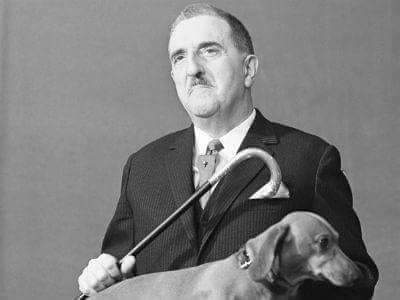
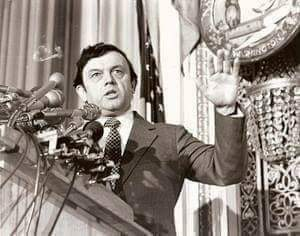
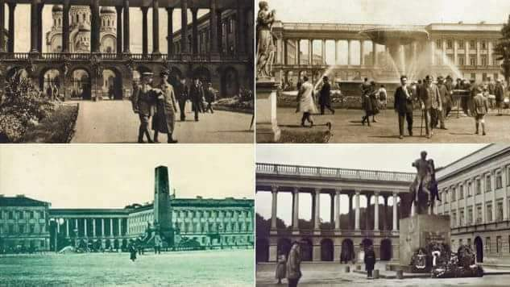
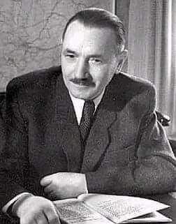
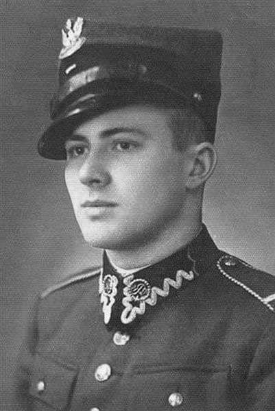
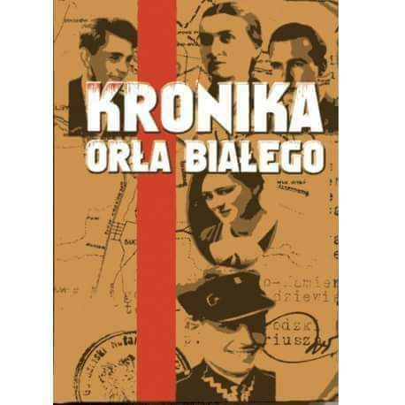
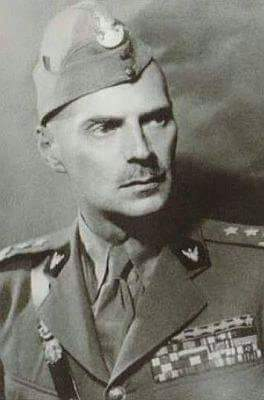
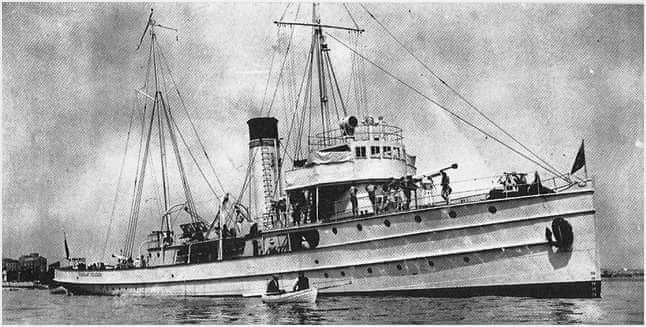
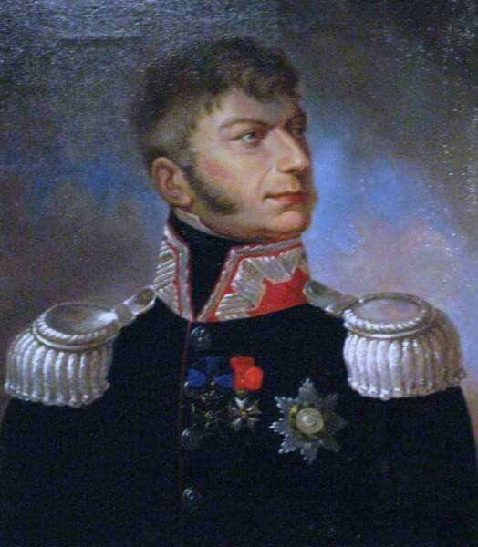
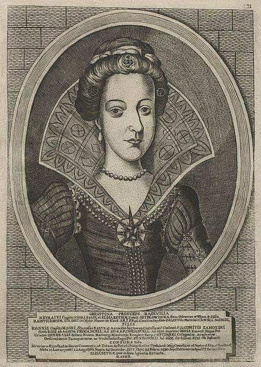

### 2020

> Analitycy: banki muszą się przyzywczaić do niskich stóp procentowych
> Większość analityków spodziewa się, że w 2022 roku wyniki banków będą zdecydowanie wyższe niż w 2020 roku. Głównie dzięki niższym rezerwom zysk giełdowych banków może wzrosnąć w tym okresie łącznie o około 22 proc.
>Optymistycznego scenariusza na następny rok nie przewiduje jednak NBP, który w grudniowym raporcie o stabilności systemu finansowego stwierdził, że w scenariuszu referencyjnym w 2021 roku sektor krajowych banków komercyjnych może odnotować 2,9 mld zł straty netto.

"Analitycy"..

### 2010

<a href="./books/Swieto_Arogancji_Wladzy.pdf" target="_blank">Święto Arogancji Władzy</a>

### 1999

W Warszawie zmarł z powodu zapalenia płuc Jerzy Waldorff - strażnik narodowej pamięci, publicysta, prawnik, pisarz, krytyk muzyczny, twórca audycji muzycznych w Polskim Radiu i Telewizji, felietonista w ,,Polityce''. W latach 30. był działaczem ruchu narodowo-demokratycznego. Przed wojną fascynował się przez krótki czas włoskim faszyzmem i tekstami antysemickimi. Owocem tej młodzieńczej fascynacji była książka Sztuka pod dyktaturą, w której opisywał on zasługi Benito Mussoliniego dla rozwoju Włoch. Owa książka po wojnie przysporzyła Waldorffowi wielu problemów. Sam Waldorff określił później tę młodzieńczą fascynację faszyzmem mianem głupiej, dodając, że ,,można się wstydzić, ale nie należy jej ukrywać. Trudno! Taka była...'' W czasie okupacji hitlerowskiej działał w Radzie Głównej Opiekuńczej oraz w podziemiu, gdzie przygotowywał komunikaty z podsłuchów. Po wojnie intensywnie działał na rzecz ochrony dziedzictwa narodowego. Był inicjatorem corocznej kwesty na rzecz ratowania niszczejących i zabytkowych nagrobków na Starych Powązkach i przewodniczącym Społecznego Komitetu Opieki nad Starymi Powązkami. Do przeprowadzenia pierwszej kwesty zainspirowała Waldorffa Lalka Bolesława Prusa, a dokładniej scena, gdy Wokulski udaje się do kościoła Św. Krzyża, aby na tacę kwestującej panny Izabeli Łęckiej rzucić przygarść złotych imperiałów. Kolejną zbiórką pieniędzy była nielegalna zbiórka na wykup willi ,,Atma'' w Zakopanem, w której powstało później Muzeum Karola Szymanowskiego, czyli jednego z najsłynnejszych po Fryderyku Chopinie polskiego kompozytora. Z inicjatywy Waldorffa powstało również Muzeum Teatralne w Warszawie. Za jego przyczyną odrestaurowano pałac książąt Radziwiłłów w Antoninie, sprowadzono do Polski szczątki króla Stanisława Augusta Poniatowskiego, wybudowano dwa pomniki Ignacego Paderewskiego i marszałka Józefa Piłsudskiego w Warszawie. Waldorff był autorem szkiców muzycznych Sekrety Poligymnii, Diabły i anioły, monografii Jana Kiepury, prozy wspomnieniowej Dolina szarej rzeku, Fidrek. Prywatnie był homoseksualistą. Jego życiowym partnerem był tancerz Mieczysław Jankowski, z którym Waldorff przeżył wspólnie 60 lat. Obaj panowie pochowani są w jednym grobie w Alei Katakumbowej na warszawskich Powązkach. Przy ich grobie znajduje się skarbonka do której można wrzucać datki na ratowanie starej części Powązek. Pogrzeb Waldorffa odbył się w gmachu Teatru Wielkiego, ponieważ Kuria Warszawska nie wyraziła zgody na odprawienie mszy w kościele. O młodzieńczym romansie z tajemniczym Isiem, ,,Najmądrzejszym psie na świecie'' - jamniku Puzonie, który był jego nieodłącznym towarzyszem podczas występów w telewizji, o przyjaźniach z Gałczyńskim, Kisielewskim, o 60 letnim związku z Jankowskim oraz o wielu innych ciekawych i nieznanych faktach z życia Waldorffa można przeczytać w książce Mariusza Urbaniaka pt. Waldorff. Ostatni baron Peerelu.

 

### 1989

1989 roku Sejm przyjął ustawę o zmianie obowiązującej od 22 lipca 1952 roku Konstytucji Polskiej Rzeczpospolitej Ludowej. Na jej mocy nazwę państwa zmieniono na Rzeczpospolita Polska, poprzez dodanie korony orłowi zmieniono godło oraz usunięto zapis mówiący o przewodniej roli Polskiej Zjednoczonej Partii Robotniczej.

### 1981

Ambasador PRL w Japonii Zdzisław Rurarz (zdjęcie) poprosił władze tego kraju o udzielenie azylu politycznego.
Wkrótce po ogłoszeniu stanu wojennego polski dyplomata ukrył się w ambasadzie amerykańskiej w Tokio. Wiadomość ta szybko dotarła do władz PRL, które wydały na niego wyrok śmierci.
W lutym 1990 r. odbyła się rozprawa rewizyjna w sprawie cofnięcia wyroku skazującego Zdzisława Rurarza na śmierć, wyrok zamieniono na 25 lat pozbawienia wolności. W maju doszło do kasacji wyroku, jednak nie postanowiono o zwrocie pozostawionego majątku. Z. Rurarz nigdy nie wrócił do Polski z obawy o własne życie – nie wierzył w prawdziwość deklaracji, z nieufnością podchodził do przemian w Polsce.
W oficjalnym liście do generała Wojciecha Jaruzelskiego Rurarz pisał:
" Panie Generale, wydając rozkaz użycia Wojska Polskiego przeciwko polskiemu narodowi, zapewnił Pan sobie miejsce w naszej krwawej historii jako oprawca tegoż narodu. [...] Czyżby Pan, Generale, był tak naiwny, że nie zdaje sobie sprawy z faktu, komu Pan służy?"

 

---

Podczas konferencji prasowej zorganizowanej dla dziennikarzy zagranicznych I zastępca zastępca szefa Głównego Zarządu Politycznego Wojska Polskiego generał dywizji Tadeusz Szaciło oświadczył:
"Dzisiaj mamy w Polsce pierwszy dzień spokoju, gdyż nie ma strajków i innych napięć społecznych”.
W rzeczywistości trwała w tym czasie operacja przeprowadzania czystek kadrowych skierowanych przeciwko członkom Solidarności.

### 1944

W Warszawie Niemcy zakończyli trwające od 27 grudnia wysadzanie Pałacu Saskiego.
Obiekt ten, istniejący od 1661 roku był jedną z największych atrakcji turystycznych przedwojennej Warszawy, a w czasie okupacji siedzibą sztabu dowództwa wojsk niemieckich. Dziś, fragmentem Pałacu jest Grób Nieznanego Żołnierza.

 

---

W Lublinie miała miejsce nieudana próba zamachu na działacza Polskiej Partii Robotniczej Bolesława Bieruta (zdjęcie). Zamach zorganizował oddział Armii Krajowej pod dowództwem podpułkownika Franciszka Żaka.
Zamierzano wrzucić granaty do lubelskiego mieszkania Bieruta. Zamach nie doszedł do skutku, ponieważ jeden z zamachowców, którego zadaniem było dostarczenie granatów z niewyjaśnionych powodów nie dotarł na miejsce

 

### 1943

1943 roku Szef Komitetu Połączonych Wywiadów Victor Cavedish Bentnik sporządził raport na temat holocaustu w okupowanej Polsce, który następnie przekazał podsekretarzowi stanu w Foreign Office Alexandrowi Codoganovi.
Powołał się w nim na informacje przekazane przez Jana Nowaka Jeziorańskiego (zdjęcie), który przybył do Londynu 9 grudnia 1943 roku po masakrze w warszawskim gettcie. Władze brytyjskie nigdy jednak nie skorzystały z tych informacji, a nawet uznały je za przesadzone. Jakby tego było mało, znany brytyjski specjalista do spraw polskich w Foreign Office Frank Roberts tak podsumował te doniesienia:
" Rząd polski zawsze chętnie korzysta z okazji [...], aby pokazać, że nie jest antysemicki. Prześladowania (Żydów) z pewnością mają miejsce, ale nie mamy na to wiarygodnych dowodów"

 

### 1940

W Krakowie Gestapo przypuściło atak na lokal przy ulicy Krowoderskiej 24, gdzie spotkali się konspiratorzy z Okręgu Śląskiego Organizacji Orła Białego. Na spotkaniu tym omawiano sytuację powstałą po aresztowaniu jej członków na Śląsku oraz bieżące sprawy tego okręgu.
Uczestników spotkania o zbliżających się gestapowcach poinformowała ochrona lokalu. Niemcom nie udało się nikogo złapać.

 

### 1941

1941 roku generał Władysław Anders (zdjęcie) w rozkazie oficerskim nr 1 pisał:
" I jeśli my żądamy i oczekujemy od
Sowietów lojalnego wykonania umowy,
to samo prawo przysługuje i Sowietom.
Kto myśli i działa inaczej – obojętnie czy
ze złej woli, czy z głupoty – działa na
naszą szkodę, musi być ukarany i nie
może mieć miejsca w naszej armii. W
związku z powyższym nakazuję Panom
Dowódcom: nastawić pełną propagandę
na konieczność bezapelacyjnej lojalności
dla polityki Naczelnego Wodza. [...]
Zdemaskować i wyłapać wszystkich
żołnierzy, bez względu na stopień,
którzy przez swoje głupie, nielojalne i
szkodliwe zachowanie się zdradzają
naszą sprawę, w stosunku do
zdemaskowanych szeregowych stosować
jak najsurowsze kary, włącznie z
oddaniem pod sąd, w stosunku do
oficerów – oddawać pod sąd – meldować
natychmiast do mnie."

 

### 1920

Podniesiono polską banderę na okręcie ORP "Komendant Piłsudski".
Była to pierwsza w historii polskiej marnarki jednostka wojenna zakupiona od Finlandii. 18 pazdziernika 1920 roku Minister Sprae Wojskowych wydał zarządzenie zmieniające jej nazwę z fińskiej "Turunmaa" na ORP "Komendant Piłsudski".
W pierwszy swój resjs kanonierka ta wypłynęła w marcu 1921 roku do Kłajpedy.
W czasie wojny obronnej "Piłsudski" wchodził w skład Dywizjonu Minowców". Zatopiony został 16 września 1943 roku w porcie Nantes we Francji.

 

### 1830

W czasie powstania listopadowego, z inicjatywy dyktatora powstania Józefa Chłopickiego (grafika) powołano do życia Komisję Rozpoznawczą -organ, którego zadaniem było rozpatrywanie spraw osób podejrzanych o szpiegostwo na rzecz Rosji. Na jej czele stanął hrabia Michał Aleksander Potocki.
W czasie swojej działalności aż do rozwiązania przez Rząd Narodowy Komisja rozpatrzyła 340 spraw.

 

### 1664

Sąd sejmowy skazał na karę śmierci, konfiskatę dóbr i utratę stanowisk hetmana i marszałka wielkiego koronnego Jerzego Sebastiana Lubomirskiego, oskarżonego o podburzanie szlachty przeciwko królowi Janowi Kazimierzowi, próbę przejęcia władzy, zdradę stanu i przekupstwa.

Jerzy Sebastian Lubomirski (1616 -1667) marszałek wielki i hetman polny koronny, był synem Stanisława, wojewody krakowskiego i Zofii Ostrogórskiej. Był niezwykle zdolny, od dziecka wykazywał się świetną pamięcią i różnymi uzdolnieniami. W wieku dziesięciu lat zaczął uczęszczać do Akademii Krakowskiej, a trzy lata później udał się w podróż do Niemiec, Niderlandów, a w następnie do Hiszpanii i Włoch. Karierę polityczną i wojskową rozpoczął w 1636 r. mając zaledwie dwadzieścia lat. Doświadczenie wojenne zdobywał pod nadzorem Stanisława Koniecpolskiego. Jego pierwszą małżonką została Konstancja Ligęzianka, córka Mikołaja Spytka Ligęzy kasztelana sandomierskiego. Angażował się w politykę, starał się zyskać poparcie i popularność w masach szlacheckich. Jako marszałek sejmu i poseł na sejm wygłaszał znakomite mowy, uznające wyższość dobra ojczyzny nad prywatą. Często przyjmował postawę opozycyjną wobec działań dworu zarówno Władysława IV jak i Jana Kazimierza. Podczas najazdu szwedzkiego początkowo przyjął postawę wyczekującą, prowadził nawet rokowania z Karolem Gustawem i Rakoczym, ale w grudniu 1655 zdecydowanie opowiedział się po stronie Jana Kazimierza i pociągnął za sobą szlachtę małopolską. Po połączeniu sił ze Stefanem Czarnieckim razem osaczyli wojsko szwedzkie w widłach Wisły i Sanu, następnie odnieśli zwycięstwo pod Warką i odbili Warszawę. Podczas tych działań Lubomirski wyróżniał się szybkimi i trafnymi decyzjami oraz świetnym obeznaniem ze sztuką wojenną. Brawurowo najechał także na terytorium siedmiogrodzkie, czym zmusił Rakoczego do wycofania się z terytorium Polski. Najświetniejsze zwycięstwo odniósł w 1660 r. pod Cudnowem, doprowadzając do kapitulacji znacznych sił rosyjsko-kozackich. Po zakończeniu wojen powrócił ponownie do polityki i opozycji w stosunku do króla oraz jego małżonki Ludwiki Marii. Krytykował królewski pomysł elekcji vivente rege, a w 1664 r. został oskarżony o próbę zamachu stanu i podżeganie wojska do buntu. Wyrokiem sądu senatorskiego skazany na „utratę czci, życia i wszystkich dóbr”. Lubomirski uszedł na Śląsk, najpierw do Nysy potem do Wrocławia aby przygotować rokosz. Prowadził rozmowy z cesarzem Leopoldem I, elektorem brandenburskim Fryderykiem Wilhelmem, królem Szwedzkim Karolem XI oraz próbował skłonić Moskwę do napadu na Polskę. Uzyskał od nich pomoc materialną na zaciąg wojska. Wydał także manifest w którym kreował się na obrońcę wolności wobec absolutyzmu dworu Jana Kazimierza. Wiosną 1665 r. przybył na Spisz gdzie rozpoczął werbunek wśród szlachty. We wrześniu pod Częstochową rozbił wojska litewskie wierne królowi. Następnie przybył do Małopolski i tam też prowadził agitację i poszerzał swoje oddziały wojskowe. Jednocześnie pertraktował z królem, łudząc go obietnicą porozumienia. W wyniku działań Lubomirskiego zerwany został sejm w 1666 r., a wojna domowa w kraju rozgorzała na dobre. Najbardziej znaną jej bitwą było starcie pod Mątwami 12 lipca 1666 r. Wojsko rokoszan składało się prawie z samej jazdy – chorągwie szlacheckie pospolitego ruszenia, oddziały konfederackie oraz zaciężni zwerbowani przez Lubomirskiego, w sumie 17 tys. ludzi i 10 działek. Dowództwo było niejednolite. Lubomirski był wodzem własnych i konfederackich oddziałów. Pospolitym ruszeniem z innych województw i z Wielkopolski dowodził kasztelan poznański Krzysztof Grzymułtowski. Armia królewska liczyła około 17-21 tys. żołnierzy, w tym prawie połowę stanowiła piechota wsparta 30 działami. Skład: oddziały polskie, cudzoziemskie zaciągi oraz korpus Litwinów dowodzony przez hetmana Michała Paca. Oficjalnie dowodził Jan Kazimierz, który wychowany na wzorach zachodnioeuropejskiej sztuki wojennej nie cenił znaczenia szybkości i elementów zaskoczenia charakterystycznych dla polskiej strategii. Król nie był także zdolny do podjęcia większego ryzyka i śmielszej inicjatywy. Po stronie króla znaleźli się także hetmani koronni – wielki 87 letni Potocki i polny Sobieski, który dzierżył buławę od niedawna (otrzymaną zresztą właśnie po Lubomirskim) i nie cieszył się jeszcze w tym czasie większym autorytetem wojskowym.

Jerzy Sebastian Lubomirski uważany był za jednego z najwybitniejszych wodzów swoich czasów. W mającej nastąpić bitwie pod Mątwami nie dowodził, rozplanował obóz w miejscu dobrze nadającym się do obrony. Dowodzili wywodzący się ze szkoły Lubomirskiego: porucznik roty husarskiej Aleksander Polanowski i Józef Borek. Ponieważ nie posiadali piechoty i właściwie artylerii Lubomirski nie zdecydował się na wydanie walnej bitwy. Do bezpośredniej konfrontacji doszło 12 lipca, Litwini w pobliżu brodu na Noteci koło wsi Tupadły starli się z oddziałami Polanowskiego. Następnego dnia nad ranem królewska armia ruszyła przez przeprawę. Jako pierwsi szli Litwini i szybko przeszli na drugi brzeg. Teren był niezwykle trudny i przeprawa rozciągnęła się na kilometr wśród błot i rozlewisk, gdzieniegdzie konie musiały przepływać, w innych miejscach mogło przeprawiać się jednocześnie obok siebie zaledwie kilku jeźdźców. Król zamierzał opanować przeciwległy brzeg i rozkazał sypać szańce. Jednak podczas przeprawy powstał wielki bałagan, z braku miejsca konnica stanęła przed liniami piechoty. Dostrzegł to Józef Borek i wydał sygnał do ataku dla rokoszan. Ponieważ mundury jednej i drugiej strony były podobne rokoszanie przewiązywali ramię białą chustą. Uderzenie ze wzgórza było tak silne, że oddziały królewskie nie były w stanie się bronić i rzuciły się do ucieczki, a cofając się tratowali własną piechotę. Tylko gwardia królewska zdążyła oddać salwę. Jan Sobieski nie panował nad oddziałami i pomimo prób przeciwstawienia się atakowi nie odnosił sukcesu. Jednak dzięki niemu część oddziałów królewskich mogła się wycofać. Straty armii królewskiej wynosiły około 3 tysięcy zabitych, rokoszanie zdobyli kilka działek i kilkadziesiąt chorągwi, a ich straty wynosiły około 150 zabitych. Po tej krwawej i bratobójczej bitwie rozpoczęły się rokowania. 31 lipca 1666 r. w Łęgonicach nad Pilicą została zawarta umowa: Lubomirski pomimo sukcesów militarnych zrzekł się wszystkich godności, lecz zachował dobra, król porzucił projekt elekcji vivente rege.

### 1577

1577 roku w Białej Podlaskiej hetman Jan Zamoyski ożenił się z 17 letnią córką marszałka wielkiego litewskiego Mikołaja Radziwiła i polskiej szlachcianki Elżbiety Szydłowieckiej-Krystyną (grafika).
Do ślubu tego doszło po trzech latach starań Zamoyskiego o jej rękę.
W posagu, Krystyna, dziedzicznych dóbr opatowskich po matce miała otrzymać 26 000 w gotówce i złocie od braci; również Zamoyski zapisał oprawę dla nowo poślubionej żony w wysokości 26 tys. zł. Księżniczka wniosła Zamoyskiemu przede wszystkim nazwisko oraz spowinowacenie z przemożną na Litwie rodziną.
Zamoyski i Radziwiłłówna byli małżeństwem zaledwie przez trzy lata, do śmierci Krystyny, która nastąpiła po poporodowych komplikacjach. Krystyna urodziła córkę, która zmarła zaraz po porodzie. Kilka dni później sama straciła życie.

 

---

<a href="https://github.com/TomaszWaszczyk/historia.waszczyk.com/edit/master/src/content/december-29.md" target="_blank">Edytuj tę stronę dzieląc się własnymi notatkami!</a>
