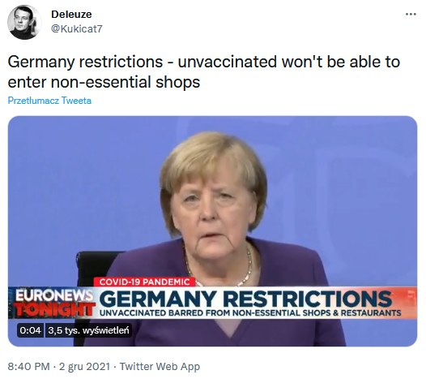
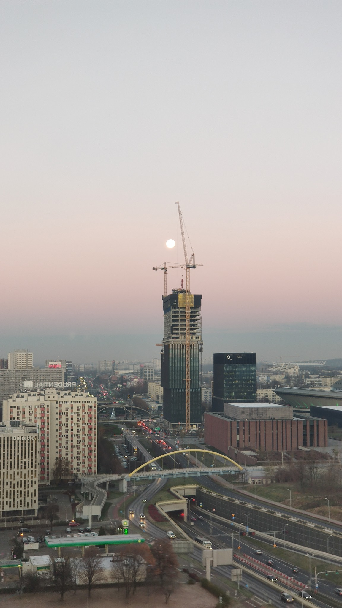

### 2021

Ma sens, w sumie to ma sens, ciekawe co dalej:

  

---

<video width="640" height="480" controls>
<source src="./movies/december/inflationlagarde.mp4" type="video/mp4">
Your browser does not support the video tag.
</video>

---

### 2020

  

---

Świat 2050.
Odcinek 9. „Giga-medycyna.”📱

Kobieta wraca do domu z pracy. Wtedy odzywa się jej wirtualny asystent w smartpaku:

- Analiza twoich parametrów zdrowotnych z ostatniego tygodnia wskazuje na 38-procentowe ryzyko zachorowania na miażdzycę w ciągu 5 lat i 40-procentowe ryzyko zawału serca w ciągu 10 lat. Zaleca się więcej wysiłku fizycznego i zmianę nawyku żywieniowego z 3 do 4 posiłków dziennie przy zachowaniu optymalnej dawki kalorii. Czy mam podać więcej szczegółów?

- Od jutra przypominaj o godzinie spożycia kolejnego posiłku – odpowiedziała użytkowniczka, po czym dodała – Kocham technologię. Kiedyś, żeby mieć zdiagnozowaną chorobę to trzeba było zapisać się na wizytę z wyprzedzeniem i jeszcze się rozebrać. A 30 lat temu to już w ogóle był cyrk – lekarze diagnozowali ludzi przez telefon, nawet ich nie widząc. Jak ja to przeżyłam?
- Zbyt mało danych, żeby określić szanse – odparł smartpak.

---

### 1961

W Sosnowcu 29 letni elektryk Stanisław Jaros (zdjęcie) próbował dokonać drugiego zamachu na życie Władysława Gomułki. Pierwszy zamach miał miejsce 15 lipca 1959 roku podczas wizyty radzieckiej delegacji na czele której stał sam Nikita Chruszczow. Drugi zamach,dokonany w 1961 roku także się nie udał. Jaros wykradł materiały wybuchowe z fabryki kotłów w której pracował. Popełnił jednak błąd techniczny, odpalając je zbyt późno. W wyniku wybuchu ranny został postronny mężczyzna,który zmarł w szpitalu i dziewczynka, która została sparaliżowana.
Milicja badająca resztki bomby zabezpieczone
na miejscu zdarzenia ustaliła, że bombę
przygotowała osoba, posiadająca wiedzę z
zakresu elektromechaniki, zamieszkała w
pobliżu miejsca zdarzenia. W ten sposób
wytypowano 50 osób i przeszukano ich
mieszkania. W domu Jarosa znaleziono sprzęt
i materiały, które użył do przygotowania
bomby. Na rozprawie sądowej w dniach 9-25
maja 1962 r. został skazany na śmierć, a 5
stycznia 1963 został powieszony.

### 1946

W Krakowie funkcjonariusze Urzędu Bezpieczeństwa Publicznego aresztowali Romana Nitarskiego-byłego żołnierza Oddziałów Obrony Lwowa, członka Obozu Narodowo- Radykalnego oraz Narodowej Organizacji Wojskowej. Postawiono mu zarzut "prowadzenia konspiracyjnej działalności zmierzającej do obalenia panującego w Polsce ustroju".
28 maja 1948 roku Wojskowy Sąd Rejonowy w Krakowie skazał go na karę 6 lat więzienia, którą zamieniono na 3 lata, które odsiedział w areszcie na Montelupich (zdjęcie).
Zmarł 8 kwietnia 2013 roku w wieku 90 lat.

### 1945

Powstało przedsiębiorstwo Centrala Produktów Przemysłowych, znane lepiej przez wiele lat jako Centrala Produktów Naftowych.

Historia tej firmy sięga roku 1944, kiedy w październiku 1944 roku utworzono organizację pod nazwą Polski Monopol Naftowy. Nazwa ta została jeszcze jednak w tym samym roku zmieniona na Państwowe Biuro Sprzedaży Produktów Naftowych. Kolejne przekształcenie firmy odbyło się pod nazwą Centralny Zarząd Obrotu Produktami Naftowymi „CPN”. Pod tym szyldem przedsiębiorstwo funkcjonowało do roku 1958, kiedy powróciło do wcześniejszej nazwy. W wyniku przemian zachodzących w latach 90-tych, w roku 1995 CPN przekształcono w koncern naftowy. Stało się to w wyniku połączenia Centrali Produktów Naftowych CPN SA oraz Petrochemii Płock SA. Działania dotyczące utworzenia nowego podmiotu zostały sformalizowane 7 września 1999 roku, kiedy to przyjął nazwę Polski Koncern Naftowy SA. 3 kwietnia 2000 roku Nadzwyczajne Walne Zgromadzenie Akcjonariuszy podjęło decyzję o nadaniu spółce nazwy handlowej Orlen.

### 1943

W wypalonych ruinach domu przy ulicy Puławskiej 21/23 w Warszawie Niemcy dokonali egzekucji na 112 więźniach aresztu na ulicy Pawiej.
Część opisu tej zbrodni można znaleźć w książce Władysława Bartoszewskiego "Warszawski pierścień śmierci"
" Na głowach mieli białe worki, opadające do połowy pasa, ręce w kostkach skrępowane sznurem na plecach, bose stopy. Popychani przez żandarmów przeszli parę metrów i ustawili się w rząd (...) Tworzyli jakby biały, krótki mur. Błysk i ogłuszający huk. Biały mur padł, jakby zdmuchnięty huraganem. Z budy wyskakiwało następnych pięciu, stając przed leżącymi. Znów błysk i huk (...)".
Grafika przedstawia reprodukcję niemieckiego obwieszczenia rozklejanego w ramach akcji Bekantmachung informującego o wykonaniu wyroków śmierci na 112 polskich "bandytach".

### 1941

Józef Stalin zapytany podczas wizyty w Moskwie generałów Władysława Andersa i Władysława Sikorskiego o losy zaginionych polskich oficerów oświadczył, że "W sowieckich obozach nie ma już żadnych polskich oficerów, a zaginieni zapewne uciekli do Mandżurii. "
W obliczu prawdy jaka wyszła na jaw w 1943 roku wiemy, że kłamał w żywe oczy.

### 1939

Do KL Sachenhausen wywieziono 13 lubelskich duchownych aresztowanych w listopadzie tego samego roku w ramach akcji Sonderaktion Lublin. Wśród nich byli ksiądz biskup Marian Fulman ( zdjęcie ) współzałożyciel Katolickiego Uniwersytetu Lubelskiego i ksiądz biskup Władysław Goral. Pierwszy, po 2,5 miesięcznym pobycie został zwolniony z obozu i osadzony w areszcie domowym w Nowym Sączu. Drugi został zamordowany w obozie na początku 1945 roku.

### 1918

W Poznaniu rozpoczęły się obrady Polskiego Sejmu Dzielnicowego. Było to zgromadzenie na którym dyskutowano na temat przyszłości kraju,jego ustroju i granicach. Jednym z postulatów wysuniętych przez obradujących 1200 posłów było żądanie utworzenia Polski z dostępem do morza. Sejm wystosował do Polaków odezwę następującej treści:
" "Polacy! Pękły okowy, krępujące wolność naszą.
Z całą ufnością odczekamy wyroku kongresu
pokojowego, który z naszym współudziałem
ustali zachodnie granice ojczyzny naszej: Polski.
(...) Lud Polski ma prawo już teraz do udziału
w rządach, których mu niesłusznie dotąd
odmawiano. (...) Interesy nasze domagają się
koniecznie jednolitego ośrodka kierowniczego
w ruchu polskim dzielnic naszych. Uznając tę
potrzebę, zleciły Koła Poselskie i wydział
Wykonawczy dotąd nie ujawnionego Centralnego Komitetu Obywatelskiego (...) utworzenie Naczelnej Rady Ludowej jako przedstawicielstwa wszystkich Polaków,
zamieszkałych na ziemiach, objętych dotąd
granicami państwa niemieckiego. (...)
Utworzenie Naczelnej Rady Ludowej dokona się na podstawie szczerze demokratycznej przez delegatów Narodu Polskiego wybranych głosami wszystkich mężczyzn i niewiast polskich, które skończyły 20. rok życia."

### 1786

Miało miejsce w Polsce jedno z sześciu do tej pory trzęsień ziemi przekraczających 6 stopni w skali Richtera. Epicentrum tych wstrząsów znajdowało się w Beskidach w okolicach Myślenic. Zjawisko to odczuwalne był od Wrocławia przez Czechy, Słowację aż do Lwowa. Od tej pory nie odnotowano w Polsce tak silnego trzęsienia ziemi.

---

<a href="https://github.com/TomaszWaszczyk/historia.waszczyk.com/edit/master/src/content/december-3.md" target="_blank">Edytuj tę stronę dzieląc się własnymi notatkami!</a>
