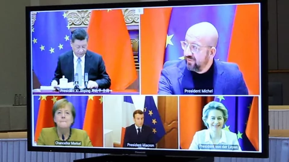

### 2020

Ostatnia sesja roku przyniosła wyraźne spadki notowań banków. To najprawdopodobniej efekt zapowiedzi przedstawicieli Rady Polityki Pieniężnej dotyczących stóp procentowych.

- W pierwszym kwartale 2021 r. możliwe jest dalsze obniżenie stóp procentowych - przekazał prezes NBP Adam Glapiński. - Obecnie nie ma potrzeby obniżek stóp procentowych, ale w przyszłości nie można wykluczyć takiego scenariusza - dodał z kolei członek RPP Rafał Sura. - Obniżenie referencyjnej stopy procentowej NBP do zera i utrzymanie jej na tym poziomie przez okres kryzysu byłoby raczej wskazane - powiedział z kolei członek RPP Jerzy Żyżyński.

Takie zapowiedzi niepokoją sektor bankowy. Przypomnijmy, tegoroczne obniżenie głównej stopy procentowej z 1,5 proc. do 0,1 proc. poważnie odbiło się na wynikach banków, a co za tym idzie i na ich notowaniach giełdowych. Na te ostatnie oczywiście wpływ miały też inne czynniki (odpisy pandemiczne i frankowe, zakaz wypłacania dywidend), jednak także i kwestia stóp dołożyła sporą cegiełkę do tego, że indeks WIG-Banki (-28,9 proc.) był zdecydowanie najgorszym sektorowym indeksem na GPW w tym roku.

---

Bitcoin price to grow 'ten times by end of 2022' as JP Morgan estimates value of $650,000
BITCOIN value will increase ten-fold a top US venture capital investor has claimed, as international investment bank JP Morgan estimates the price of each coin could soar to $650,000 (£485,763).

Source: https://www.express.co.uk/finance/city/1377180/bitcoin-price-latest-tim-draper-jp-morgan-estimate-max-keiser

---

Efekt wojny bez świadomości o tym fakcie pretendującej do bycia klasą średnią grupy społecznej (która w maksimum 10 lat zniknie)

**Polski kryzys demograficzny się pogłębia: Mamy najwięcej zgonów od II wojny światowej i najmniej urodzeń od 2005**

W ciągu ostatnich 12 miesięcy w Polsce zmarło w sumie 425 tys. osób, czyli najwięcej od czasu II wojny światowej, a urodziło się zaledwie 358,9 tys. osób – czyli najmniej od 2005 roku, wynika z danych GUS, które cytuje ekonomista Rafał Mundry.

„Mamy olbrzymi kryzys demograficzny” – tak dane te skomentował na swoim twitterowym koncie Mundry.

Jak można zakładać, istotny wpływ na rekordowe wyniki roczne zgonów miała pandemia koronawirusa – zarówno bezpośrednio powodowana przez niego, potencjalnie śmiertelna choroba COVID-19, jak również inne choroby, do leczenia których dostęp został ograniczony przez epidemiczne restrykcje lub których przebieg zaostrzyła infekcja koronawirusem.

Interesujące są jednak szczególnie dane dotyczące urodzeń. Dowodzą one bowiem, że rekordowo niski ich wskaźnik w tym roku nie jest jedynie jednoroczną anomalią, a raczej wpisuje się w trwający od IV kwartału 2017 roku wyraźny trend gwałtownego spadku nowych urodzeń.

To istotna statystyka w kontekście dyskusji o skuteczności działania polityki socjalnej państwa, w tym jej sztandarowego programu Rodzina 500+, wprowadzonego w pierwszej połowie 2016 roku – który w założeniu miał właśnie m. in. wspierać polepszenie sytuacji demograficznej.

Tymczasem o ile do drugiej połowy 2017 roku widać istotny wzrost urodzeń – niewykluczone, że w dużej mierze powiązany właśnie z wprowadzeniem projektu – o tyle od tej pory zauważalne jest całkowite odwrócenie tego trendu.

Dziś liczba urodzeń jest już nie tylko niższa niż w momencie uruchomienia Rodziny 500+, lecz także najniższa od połowy 2005 roku.

---

Mimo wielu wątpliwości, Niemcy doprowadzają do podpisania przez Unię Europejską umowy inwestycyjnej z Chinami.

Komisja Europejska i Rada Europejska napisały we wspólnym komunikacie opublikowanym dzisiaj, że po intensywnych negocjacjach prowadzonych przez KE w imieniu Unii, UE i Chiny "zasadniczo zakończyły negocjacje w sprawie kompleksowej umowy inwestycyjnej (CAI)".

"Uczestnicy z zadowoleniem przyjęli aktywną rolę niemieckiej prezydencji w Radzie i kanclerz Angeli Merkel w szczególności, która położyła szczególny nacisk na stosunki UE-Chiny i w pełni wspierała negocjacje UE z Chinami" - dodano w komunikacie.

Wielu komentatorów zastanawia się, dlaczego w takim pośpiechu i z takim uporem Niemcy forsowały podpisanie CAI w ostatnich dniach swojej prezydencji. Warto przypomnieć, że Niemcy doprowadziły do podpisania tej umowy mimo, wciąż nierozwiązanych, wielu wątpliwości, dotyczących między innymi praw człowieka i praw pracowniczych.

Przypomnijmy, że Polska na spotkaniu ambasadorów państw unijnych w Brukseli sprzeciwiła się znacznemu przyspieszeniu prac nad umową inwestycyjną UE-Chiny po tym, jak KE poinformowała, że umowa jest już gotowa.

  

---

### 1999

https://pl.wikipedia.org/wiki/Jaros%C5%82aw_Soko%C5%82owski_(gangster)

### 1988

Papież Jan Paweł II podpisał adhortację "Christifideles Laici".
Dokument ten kończył obrady VII Zwyczajnego Zgromadzenia Synodu Biskupów w Rzymie i dotyczył statusu i roli osób świeckich w strukturze Kościoła.
W adhortacji czytamy:
„Zaangażowanie polityczne dotyczy wszystkich i służy wszystkim: Aby ożywiać duchem chrześcijańskim doczesną rzeczywistość służąc — jak zostało powiedziane — osobie i społeczeństwu, świeccy nie mogą rezygnować z udziału w „polityce”, czyli w różnego rodzaju działalności gospodarczej, społecznej i prawodawczej, która w sposób organiczny służy wzrastaniu wspólnego dobra; Ojcowie synodalni stwierdzali wielokrotnie, że prawo i obowiązek uczestniczenia w polityce dotyczy wszystkich i każdego; formy tego udziału, płaszczyzny, na jakich on się dokonuje, zadania i odpowiedzialność mogą być bardzo różne i wzajemnie się uzupełniać. Ani oskarżenia o karierowiczostwo, o kult władzy, o egoizm i korupcję, które nierzadko są kierowane pod adresem ludzi wchodzących w skład rządu, parlamentu, klasy panującej czy partii politycznej, ani dość rozpowszechniony pogląd, że polityka musi być terenem moralnego zagrożenia, bynajmniej nie usprawiedliwiają sceptycyzmu i nieobecności chrześcijan w sprawach publicznych”

 

### 1956

Zmarła Maria Kotarba zwana ,,Mateczką z Oświęcimia''. Po napaści hitlerowskiej Rzeszy Niemieckiej na Polskę we wrześniu 1939 r. Maria zaczęła działać w szeregach polskiego ruchu oporu. Do zadań Marii należało dostarczanie meldunków i zapasów żywności lokalnym grupom partyzanckim. W wyniku donosu została aresztowana przez Niemców i przetransportowana 6 stycznia 1943 roku do niemieckiego obozu koncentracyjnego Auschwitz-Birkenau, gdzie otrzymała numer obozowy 27995. Miesiąc później do Auschwitz-Birkenau trafiła również Lena Bankier - Mańkowska, deportowana przez Niemców z getta w Białymstoku. Dzięki pomocy Marii Lena została zarejestrowana jako polska więźniarka polityczna. W czasie pobytu w obozie Maria wielokrotnie pomagała Lenie,a także innym Żydom, dostarczając im lekarstwa oraz przemycając dodatkowe porcje żywności. Podczas ewakuacji obozu w styczniu 1945 r. obie Panie widziały się po raz ostatni. Po wojnie Lena Bankier-Mańkowska zamieszkała w Wielkiej Brytanii. Swoją wybawczynię odnalazła dopiero w 1997 r. Dzięki staraniom Leny 18 września 2005 r. Maria Kotarba została pośmiertnie uhonorowana medalem ,,Sprawiedliwa wśród Narodów Świata'', w dowód uznania, że z narażeniem życia ratowała Żydów prześladowanych w latach okupacji hitlerowskiej.

 

### 1949

W Białymstoku wykonano wyrok śmierci na byłym dowódcy 1 Kompanii Szturmowej 3 Wileńskiej Brygady Armii Krajowej Romualdzie Rajsie ps "Bury" ( zdjęcie)-postaci tyle bohaterskiej, co dosyć kontrowersyjnej.
Rajs, jako podkomendny majora Zygmunta Szendzielarza był aktywnym uczestnikiem przeprowadzonej w 1944 roku operacji "Ostra Brama"i nawet jako dowódca jednego z oddziałów miał swoje sukcesy, ale miał też w swojej karierze kilka epizodów, które burzą obraz bohaterskiego żołnierza AK.
Jedno z tych wydarzeń miało miejsce już po wojnie 29 stycznia 1946 roku, kiedy to jako kapitan Narodowego Zjednoczenia Wojskowego wkroczył ze swoim oddziałem do wsi Zaleszany koło Bielska Podlaskiego. Żołnierze Rajsa zostali ostrzelani przez mieszkańców wsi, którzy sądzili, że są to żołnierze Korpusu Bezbieczeństwa Wewnętrznego. Oddziały Rajsa w odwecie zamordowały 16 osób wśród których były też dzieci. 31 stycznia 1946 również żołnierze Rajsa dokonali mordu na 30 mieszkańcach wsi Puchały Stare, a 1 lutego 1946 odbyła się odprawa dowódców plutonów. Kpt. Rajs przydzielił dowódcom zadania zniszczenia po jednej ze wsi: Zanie, Szpaki, Końcowizna. Wymienione wsie były w przeważającej części zamieszkałe przez ludność wyznania prawosławnego. W dniu 2 lutego 1946 roku plutony wyruszyły w kierunku poszczególnych wsi. Pierwszy pluton pod dowództwem „Wiarusa” wyruszył do wsi Szpaki, drugi pluton pod dowództwem „Bitnego” udał się do Zań, natomiast trzeci pluton pod dowództwem „Leszka” – do Końcowizny. Plutonowi „Leszka” towarzyszyło dowództwo.
W godzinach wieczornych do wsi Szpaki wkroczył pluton pod dowództwem „Wiarusa”. Żołnierze zaczęli podpalać zbudowania i strzelać do mieszkańców. Śmierć od kul lub w płomieniach oraz od odniesionych od tego ran poniosło 7 osób. Zostali zastrzeleni; Filipczuk Paweł (47 lat), Kłoczko Wasyl ( 58 lat), Szeszko Dionizy (50 lat), Szeszko Jan (45 lat), Szeszko Jan (21 lat). W jednym z domów dokonano gwałtu na kobiecie (zeznanie k. 1939 ). Wymieniona poddała się napastnikom, gdyż wcześniej Maria Pietruczuk (18 lat), która stawiała opór napastnikom została postrzelona w okolicy klatki piersiowej i pleców. Zmarła w wyniku odniesionych ran w dniu 6.02.1946 r. w szpitalu w Bielsku. Zostali też postrzeleni Teofil Bałło i Michał Rudczuk oraz Antonii Szeszko, który ranny w głowę zmarł w szpitalu Nadzwyczajna komisja powołana przez Powiatową Radę Narodową w Bielsku Podlaskim w dniu 3 lutego 1946 r. spisała straty materialne i odnalazła na miejscu ulotkę wzywająca ludność białoruską do opuszczenia wsi w ciągu 14 dni.
Drugi pluton, dowodzony przez „Bitnego” po przybyciu do Zań zajął następujące pozycje. Z jednej strony wieś została otoczona przez drużynę „Gołębia”, a z drugiej – przez drużynę „Szczygła”. Trzecia drużyna pod dowództwem „Ładunka” weszła do wsi, gdzie zaczęto podpalać poszczególne zabudowania. Nie podkładano ognia pod domy należące do osób wyznania katolickiego, jak też nie podpalano zabudowań tych prawosławnych, którzy zamieszkiwali w bezpośrednim pobliżu gospodarstw, należących do rodzin katolickich (według zeznań świadków wówczas w Zaniach mieszkały 4 rodziny katolickie). Mieszkańców, którzy usiłowali wydostać się z płonących domów zapędzano z powrotem lub strzelano do ludzi wybiegających z palących się budynków i próbujących uciec ze wsi. Przed oddaniem strzałów niektórych mieszkańców pytano o narodowość i wyznanie. W oparciu o dokumenty i zeznania świadków przesłuchanych w sprawie należy przyjąć, że podczas pacyfikacji wsi zginęły 24 osoby. Nadto rany postrzałowe odniosło 8 mieszkańców:
W protokole specjalnej komisji z Bielska Podlaskiego zapisano, że wśród zgliszczy znaleziono broń: jeden pistolet maszynowy oraz amunicję.
W dniu 2 lutego 1946r. została również zaatakowana wieś Końcowizna. Ataku dokonał trzeci pluton pod dowództwem „Leszka”. Świadkowie wydarzeń w Końcowiźnie podają, że wówczas zamieszkiwało wieś około 60 osób, wyznania prawosławnego. W tym dniu w około godziny 18.00 część oddziału przeszła do wsi przez lód na rzece Narwi i zaczęła podpalać strzechy domów, stodół oraz strzelać do ludności. Mieszkańcy wsi uciekli i nikt nie zginął (k. 1854). Władysław Z. dodał, iż mieszkańcy Końcowizna nie strzelali do partyzantów, gdyż nie mieli broni palnej. (cyt. za: Informacja o ustaleniach końcowych śledztwa S 28/02/Zi w sprawie pozbawienia życia 79 osób - mieszkańców powiatu Bielsk Podlaski w tym 30 osób tzw. furmanów w lesie koło Puchał Starych, dokonanych w okresie od dnia 29 stycznia 1946r. do dnia 2 lutego 1946)
Ostatecznie Rajsa aresztowano w 1948 roku, a 1 października 1949 roku skazano na karę śmierci. W 1995 roku Warszawski Sad Rejonowy zrehabilitowal kpt Rajsa i tym samym oczyścił z zarzutów.

 

### 1963

Papież Paweł VI nominował po śmierci metropolity Eugeniusza Baziaka na metropolitę krakowskiego Karola Wojtyłę (zdjęcie).
Ciekawostką jest fakt, że o swojej decyzji papież poinformował Wojtyłę telefonicznie.
Awansowanie Karola Wojtyły do godności
metropolity dało mu możliwość wzięcia udziału w zwołanym już wkrótce Soborze Watykańskim
II, gdzie dał się on poznać jako mądry i wybitny teolog.

 

### 1943

W ramach realizacji wydanego w lutym 1943 roku tzw "Rozkazu nr 1" nakazującego "masową likwidację ludności polskiej Polesia i Wołynia ,uznanych za tereny etnicznie ukraińskie" oddziały UPA zamordowały wszystkich mieszkańców kolonii Dąbrowa (powiat Tomaszów Lubelski).

 

### 1942

W swoim warszawskim mieszkaniu na ulicy Brackiej 13 aresztowana została Karolina Żurowska (zdjęcie) ziemianka, przedsiębiorca, właścicielka fabryki tkanin w Leszczkowie (obecnie Ukraina). Donos na nią złożył konfident gestapo, grekokatolicki ksiądz Josyp Kładoczny, który był również sekretarzem metropolity Lwowa biskupa Andrzeja Szeptyckiego.
Żurowską, jej córki i męża osadzono w areszcie na Pawiaku, a 17 stycznia 1943 roku tylko ją z córkami wywieziono do obozu w Majdanku. Mąż został na Pawiaku, gdzie zamordowano go podczas jednego z przesłuchań. Karolinę, po śmierci córek przewieziono do obozu w Ravensbrück, gdzie doczekała końca wojny.
Zmarła 5 czerwca 1980 roku w Lund w Szwecji.

 

### 1940

1940 roku grupa dywersyjna Związku Odwetu pod dowództwem inżyniera Franciszka Kwaśnickiego " Rawicza" przeprowadziła zamach bombowy na berlińskiej stacji kolejowej Anhalter. Wybuch ładunków podłożonych przez żołnierzy o nazwiskach Urbańczyk i Kupanik spowodował poważne zniszczenia pomieszczeń dworcowych. Kilka dni później szef Gestapo Heinrich Miller pisał w swoim raporcie:
" Zamach ten był aktem terroru dokonanym przez członków polskiego ruchu oporu. Z dochodzeń policyjnych wynika, że w przyszłości zamierzają oni dokonywać podobnych zamachów przy pomocy sic! bomb podkładanych w paczkach na innych dworcach".

 

### 1922

Powstał Związek Socjalistycznych Republik Radzieckich.
Państwo to powstało w wyniku połączenia Rosyjskiej Federacyjnej Socjalistycznej Republiki Radzieckiej, Białoruskiej Socjalistycznej Republiki Radzieckiej, Ukraińskiej Socjalistycznej Republiki Radzieckiej oraz Zakaukaskiej Socjalistycznej Republiki Radzieckiej.
I tu kolej na część naszej historii związanej z powstaniem ZSRR. Według szacunkowych danych, w granicach tego kraju według szacunków z roku 1943 na terenach polskich zagarniętych przez władze radzieckie znalazło się około 6 milionów Polaków. Zaś po uwzględnieniu przyrostu naturalnego, wysiedleń, oraz ewakuacji ludności z Armią Generała Władysława Andersa brakuje w bilansie ludności od 500 tysięcy do 1,5 mln Polaków. Jakaś ich część została zapewne zaliczona do innych nacji przez sowieckie organa państwowe.
Związek Socjalistycznych Republik Radzieckich upadł 26 grudnia 1991 roku.

 

---

Eligiusz Niewiadomski, zabójca prezydenta RP Gabriela Narutowicza, został skazany na karę śmierci przez rozstrzelanie.

16 grudnia 1922 w gmachu warszawskiej Zachęty, podczas zwiedzania nowo otwartej wystawy, został zastrzelony Gabriel Narutowicz, pierwszy prezydent odrodzonej Rzeczypospolitej, wybrany na urząd ledwie sześć dni wcześniej.

Prezydent, którego strzały zaskoczyły w trakcie podziwiania obrazu Szron Teodora Ziomka, zmarł na miejscu. Do dziś tak naprawdę nie wiemy, dlaczego Niewiadomski pociągnął za spust.

Po bezprecedensowo szybkim procesie zabójca został skazany na śmierć 30 grudnia i rozstrzelany już 31 stycznia 1923 roku przez kompanię szkolną 30. Pułku Strzelców Kaniowskich na stokach Cytadeli. Na okres między zamachem a śmiercią Niewiadomskiego przypadł szczyt zainteresowania społeczeństwa motywami jego czynu. Okazało się, że nie były one oczywiste.

Podczas procesu zabójca przekonywał, że od dawna planował zamach na… Józefa Piłsudskiego, a Narutowicz nic dla niego nie znaczył. Jednocześnie pozował na patriotę, który swym czynem uratował ojczyznę przed „żydowsko-socjalistycznym” spiskiem. Niektórzy Polacy, szczególnie ci sprzyjający endecji, uwierzyli mu: grób Niewiadomskiego stał się obiektem pielgrzymek z całej Polski, a w 1923 roku aż trzysta dzieci otrzymało na chrzcie rzadkie imię Eligiusz. Jednocześnie w Zachęcie inni palili obrazy artysty, środowiska lewicowe uznały zaś go za narzędzie „endecko-paskarskiego” spisku.

Z czasem spory przycichły, a dramat z końca 1922 roku został usunięty w cień przez przewrót majowy. Stopniowo utarło się przekonanie o szaleństwie Niewiadomskiego. Początkowo, w pierwszych dniach po zamachu, tezę tę promowali narodowcy, odcinający się od zabójstwa prezydenta. Było to o tyle łatwe, że fanatyczny Niewiadomski uznawał środowiska endeckie za zbyt mało „narodowe”. W miarę upływu lat teza, że był on rzeczywiście człowiekiem szalonym, stała się powszechna i pokutuje do dziś. Dlatego warto przyjrzeć jej się bliżej – zwłaszcza że nie do końca okazuje się trafna.

Arogancki radykał:

Nieliczni znajomi zamachowca zgodnie twierdzili, że Eligiusz Niewiadomski, urodzony w 1869 roku w Warszawie w zubożałej rodzinie szlacheckiej, był człowiekiem skrytym i niechętnie ujawniał swoje słabości wobec innych, nawet wobec najbliższych. Na przykład ukrył przed rodziną poważne poparzenia odniesione podczas studiów malarskich w Paryżu. Ponoć – utrzymywał tak literat Antoni Słonimski – nigdy się nie uśmiechał i nie miał poczucia humoru. Nawet szanujący Niewiadomskiego wydawca Władysław Trzaska przyznawał, że był on „bardzo drażliwy i łatwo się denerwował”. Stanisław Kijeński, ochotniczy obrońca w procesie zabójcy prezydenta, twierdził, że jego klient „stanowił typ samotnika”, „czuł się zdolnym głównie do rozkazywania”, a „na uchybienie przeciw honorowi swemu i innych reagował z nadzwyczajną gwałtownością. Wybujała jego indywidualność nie mogła się pomieścić w ramach programu żadnego stronnictwa i dyscypliny partyjnej”.

Późniejszy zamachowiec pobił podobno Przemysława Mączyńskiego, redaktora „Gazety Porannej”, organu endecji. Nawet malarz Jan Skotnicki, który Niewiadomskiego znał dobrze z pracy, dostrzegał w nim sprzeczne cechy. Zeznając w grudniowym procesie, przekonywał: „Z jednej strony robi wrażenie człowieka bardzo czułostkowego, a w pewnych chwilach sentymentalnego, w innych oschłego i sztywnego. Te sprzeczności starałem się wytłumaczyć w ten sposób, że pan Niewiadomski, jako artysta, chciał w sztuce być czułostkowy, jednakże wychowanie dało mu, poza sztuką, pewną prostolinijność, jaka w stosunku do ludzi nadawała mu pewną oschłość i ostrość, którą mu zarzucano”. Tłumacząc, dlaczego tuż po zabójstwie Narutowicza nazwał Niewiadomskiego „wariatem”, Skotnicki mówił: „To dotyczyło pewnej bezwzględności w stosunku do ludzi, co do których miał takie czy inne wątpliwości. To dotyczyło tej egzaltacji, przesady, nadczułości”. Nawet sprzymierzeńcy Eligiusza Niewiadomskiego przyznawali, że był on posądzany o „pewne narwanie” i „brak równowagi” w życiu codziennym.

Skotnicki zwrócił uwagę na jeszcze jedną ciekawą cechę osobowości Niewiadomskiego, być może jedną z najważniejszych dla badań motywów jego postępowania: „To był umysł, który […] ogarniał tylko pewne rzeczy, które starał się widzieć, nie widząc zupełnie z boku konsekwencji i niebezpieczeństw, jakimi mogło to grozić […]. To był człowiek nie zawsze o szerokich poglądach, ale ideowy bezwzględnie”.

Czy opinie Skotnickiego można uznać za wiarygodne? Na pewno miał on wiele okazji, by wyrobić sobie zdanie o koledze z pracy. We wspomnieniach pisał: „Moje stosunki osobiste z Niewiadomskim trwały parę lat […]. W Ministerstwie Sztuki i Kultury siedziałem z nim przy jednym podwójnym biurku, patrząc mu w oczy przez dwa lata, poznałem go więc dobrze”. Skotnicki zwrócił uwagę na pryncypialność kolegi, która „była głównym źródłem jego radykalizmu. Że znalazł się on w obozie narodowym, to przypadek. Chwilowe, taktyczne hasła tego obozu przyjmował jako istotne wyznanie wiary. Niewiadomski w każdej partii byłby krańcowym radykałem. Nie próbował zgłębiać programów, pociągała go raczej ich jaskrawość. Stąd wypływało jego oderwanie od rzeczywistości, a także pozerstwo i deklamatorstwo”. Rodzi się jednak wątpliwość: przecież tysiące młodych Polaków przeszło podobną formację i skłaniało się ku radykalizmowi – a jednak nie zostało mordercami.

„Jako zwierzchnik był surowy, często popędliwie złośliwy, jako człowiek – mściwy, bezwzględny, uparty – kontynuował Skotnicki. – Te cechy charakteru nie zjednywały mu sympatii między kolegami i interesantami. Trzeba przyznać, że był również surowy w stosunku do siebie, a w służbie niezwykle punktualny i pedantyczny oraz niebywale, choć nie zawsze celowo, pracowity. Służbowo ze mną nigdy nie miał najmniejszego zatargu, ale nad moim kolegą J. wprost się znęcał, czym uniemożliwiał mu zupełnie pracę”. Słowa te oddają aspołeczny charakter Niewiadomskiego, lekceważenie otoczenia, ale też niezwykle intensywne zmaganie się z samym sobą w imię wybujałych ambicji.

Ku autodestrukcji:

Być może najciekawszym wątkiem, który poruszył w swych wspomnieniach Skotnicki, jest autodestrukcyjna natura osobowości Niewiadomskiego. Miała się ona w pełni ujawnić w końcu 1921 roku, kiedy został wyrzucony z pracy w Ministerstwie Sztuki i Kultury z powodu kłótni z samym ministrem. Od tej chwili wszedł na drogę wiodącą ku przepaści. Według Skotnickiego rosnąca izolacja bezrobotnego Niewiadomskiego miała wyraźny wpływ na jego życie prywatne i stan psychiki: „Mam wrażenie, że stosunki osobiste i trudności życiowe po otrzymaniu dymisji zrodziły w jego głowie myśli samobójcze. Chciał jednak popełnić samobójstwo, wykorzystując je jednocześnie na wielki, efektowny, historyczny czyn. Tym czynem i jednocześnie samobójstwem stało się zabójstwo Narutowicza”.

Jest bardzo prawdopodobne, że to tendencje autodestrukcyjne leżały u podstaw pomysłów i posunięć zamachowca. Należy jednak podkreślić, że nawet jeśli tak było, sam przed sobą nigdy by się do tego nie przyznał. Był zbyt dumny, ambitny i przekonany do swoich racji, by po prostu popełnić samobójstwo. Morderstwo, którego konsekwencją byłaby kara śmierci – to co innego. Jest niezwykłe, jak desperacko Niewiadomski szukał ofiary: najpierw obierając sobie za cel Piłsudskiego, a potem od razu Narutowicza. Planując zamach, nawet w ogóle nie zastanawiał się nad tym, że tak naprawdę planuje również swoją śmierć. Morderstwo wydawało mu się rozwiązaniem idealnym: nie tylko prowadziło do autodestrukcji (co mogło być podświadomą motywacją jego działań), ale też w pełni realizowało jego poglądy polityczne i ideologiczne, a także czyniło go bohaterem i postacią, która chwalebnie zapisze się na kartach historii. To odpowiadało jego ambicjom i megalomanii.

„Kilkuletnia samohipnoza”

Narastające napięcie w psychice Niewiadomskiego wyczuwał również nieznający go osobiście Leo Belmont, lewicowy pisarz żydowskiego pochodzenia. Autor ten, choć nie miał wykształcenia medycznego, przekonywał, że w chwili popełnienia zbrodni Niewiadomski był „niepoczytalny – wbrew temu, co sam o sobie mówi i wbrew zdawkowym sądom mas, które mówią o nim na mocy złej obserwacji i mylnej informacji, bez zasięgnięcia opinii psychiatrów i psychologów”. Morderca posiadał jakoby duszę „czułą wewnętrznie, a oschłą z pozoru, nieskazitelnie prawą na każdym stanowisku, wybuchającą późno a jaskrawo po podrażnieniu. Wulkan pod korą lodową! [...] Sam podsądny – ciągnął Belmont – z uporem symulujący zdrową jaźń, wstydzący się cienia słabości, acz na zgubę sobie, z maniakalną uciechą samobójcy łudził sąd, salę, dzienniki, iż jest człowiekiem absolutnie normalnym, nie tylko o myśli logicznej, lecz i woli, podobnież zdrowej, co i twardej”.

Zauważane przez wielu wewnętrzne napięcie w osobowości Niewiadomskiego i skłonności samobójcze nie budzą chyba wątpliwości. Dalsze quasi-medyczne tezy Belmonta należy jednak traktować z przymrużeniem oka: Niewiadomski „nie pozwolił widzieć nikomu, że to była wola ślepa, działająca pod kilkuletnią samohipnozą, która nie wyczerpała się w akcie zbrodni, a przeszła za zabójcą na ławę podsądnych, aby bronić jego czynu przed sobą i światem! Ale czyż jest człowiekiem normalnym człowiek tak absolutnie pozbawiony instynktu samozachowawczego?” – pytał pisarz i odpowiadał, że zamachowiec to „człowiek chorej, samozahipnotyzowanej na zabójstwo woli”.

Katatonik?

Ciekawą, choć kontrowersyjną glosę do charakterystyki osobowości Niewiadomskiego sporządził lekarz psychiatra Maurycy Urstein, który w 1923 roku opublikował broszurę Eligiusz Niewiadomski w oświetleniu psychiatry. Urstein dowodził, że Niewiadomski cierpiał na katatonię, która wywoływała u niego napady szału i zamroczenia. Opierając się na analizie manifestów napisanych przez zamachowca już w więzieniu, lekarz stwierdzał: „Doznajemy wrażenia, jak gdybyśmy słyszeli orkiestrę bez kapelmistrza. W gruncie rzeczy to zbiór głośno brzmiących wyrazów bez wewnętrznego związku i logicznego powiązania, przy tym uporczywe zatrzymywanie się przy poszczególnych oderwanych wyobrażeniach, zamęt i chaos”.

„Całe życie jego – przekonywał Urstein – jest wyrazem owej ciężkiej choroby, która z żywiołową koniecznością musiała doprowadzić do owego tragicznego rezultatu. W każdym razie nie był on zdolny właściwie pokierować swoim życiem i zdobyć sobie należne stanowisko społeczne”. To prawda – Niewiadomski na żadnym etacie nie potrafił dłużej zagrzać miejsca, poczuć satysfakcji z pracy, jaką wykonywał. „Do tego się dołącza – ciągnął psychiatra – wielka nietrafność, raczej zupełny brak sądu, słaba wola, megalomania w ocenianiu własnej osoby, typowe idee reformatorskie, nieobliczalne postępki, dziwactwa w obejściu i inne cechy charakterystyczne dla katatonii” – wyliczał. Potwierdzał też słowa Skotnickiego, argumentując: „Niewiadomski był wielkim pedantem, pracował dużo, lecz praca jego nie była owocną. Umysł miał ciasny, jednostronny. Nie obchodziło go to, co się dokoła niego działo. Wspólnoty pracy nie uznawał i zdarzało się nieraz, że brał się do rzeczy, którą już dawno siedzący obok kolega wykonał. Zamiłowanie do pracy było u niego mało celowe i przesadne. Nie zapominał uraz. Jeśli go kto dotknął, na razie nie okazywał tego, lecz nie przebaczał i szukał sposobności, aby mu się odpłacić”. Dokonując spektakularnego zabójstwa, chciał się odpłacić rzeczywistości, której nie akceptował.

Obłęd posłannictwa?

W 2000 roku w programie telewizyjnym Rewizja nadzwyczajna przeprowadzono intrygujący eksperyment psychiatryczny: dwoje zaproszonych lekarzy przeanalizowało wszystkie zachowane wypowiedzi Niewiadomskiego, starając się opracować na ich podstawie diagnozę psychiatryczną. Ich zdaniem zabójca prezydenta cierpiał na paranoję, a ściślej – tzw. obłęd posłannictwa.

Osoba dotknięta tym schorzeniem ma poczucie misji, którą realizuje bez względu na konsekwencje. Czy jednak taki opis musi cechować wyłącznie ludzi szalonych? Jak napisano w jednej z definicji obłędu posłannictwa, niekiedy trudno odróżnić go od zwykłej głupoty ludzkiej.

Socjopata?

Z perspektywy dziewięćdziesięciu lat trudno jest wyrokować o stanie psychiki Eligiusza Niewiadomskiego. Urstein – nie mówiąc już o psychiatrach z Rewizji nadzwyczajnej – postawił swą diagnozę jedynie na podstawie zapisanych przez zamachowca słów. Mordercy nie zbadał fachowo żaden specjalista. Zgodnie ze sztuką lekarską nie jest więc możliwe wydanie wiarygodnego orzeczenia. Analizujący przypadek Niewiadomskiego komentatorzy kreślą obraz człowieka pełnego skrywanych kompleksów, gwałtownego, aspołecznego, rozchwianego emocjonalnie i charakterologicznie, słabego – ale nie klinicznie szalonego. Co znamienne, przecież sąd nie uznał go za niepoczytalnego i w ogóle nie badał jego psychiki – na co zwrócił uwagę chociażby Leo Belmont.

To, że sąd w ramach procesu nie zdecydował się na przeprowadzenie badań psychiatrycznych oskarżonego, bezwiednie wpisywało się w logikę mordercy, któremu zależało na budowaniu własnej legendy. Ewentualne uznanie go za niepoczytalnego byłoby ciosem w tę legendę. Uznanie Niewiadomskiego za osobę zdrową psychicznie ułatwiło propagowanie jego kultu w środowiskach narodowych.

Zabójca Narutowicza był fanatykiem targanym przez obsesje i uprzedzenia, osobą skłonną do wybuchów i okrucieństwa, pozbawioną empatii, o ciasnej umysłowości i silnym poczuciu misji – ale to jeszcze nie wystarcza, by określić go jako katatonika czy paranoika. Z pewnością był socjopatą. Czy socjopatię można jednak utożsamiać z chorobą?

Czynu Niewiadomskiego na pewno nie sposób interpretować jedynie w kategoriach indywidualnych. Podjęta przez niego decyzja była w pewnej mierze efektem ówczesnej atmosfery społeczno-politycznej, cechującej się wyjątkową brutalnością i rozgorączkowaniem. Tuż przed dramatem, jaki rozegrał się 16 grudnia, wpływowy dziennikarz i polityk endecki Stanisław Stroński nazwał Narutowicza „zawadą”. Niewiadomski postanowił tę „zawadę” usunąć. Doszło do sytuacji, w której wewnętrzne predyspozycje idealnie zagrały z atmosferą zewnętrzną.

Być może najtrafniejsze wyjaśnienie zamachu na Gabriela Narutowicza sformułował w 2010 roku prof. Jerzy Szacki. Socjolog przypomniał postać Niewiadomskiego przy okazji zabójstwa Marka Rosiaka (pracownika łódzkiego biura poselskiego Prawa i Sprawiedliwości), po czym zauważył: „Jeśli człowiek nie potrafi zdystansować się wobec wydarzeń, nie panuje nad swoimi emocjami lub jest chory, to spirala nienawiści rozkręcona przez polityków może mieć taki finał”. Nie ma wątpliwości, że w grudniu 1922 roku, po niespodziewanym wyborze Gabriela Narutowicza na pierwszego prezydenta RP, spirala nienawiści została rozkręcona do granic możliwości.

### 1919

1919 roku Polska i Łotwa podpisały układ o wzajemnej pomocy wojskowej.
Na mocy tego porozumienia, oba kraje zobowiązały się do wspólnych działań militarnych przeciwko Rosjanom w ramach tak zwanej akcji "Zima". Pakt ten został następnie rozszerzony o kolejne postanowienia 16 stycznia 1920 roku.
Współpraca wojskowa Polaków i Łotyszy przyniosła efekt w postaci udanej styczniowej ofensywy wojskowej, w której udział wzięło 20 tysięcy żołnierzy, w tym 12 tysiecy Polaków pod wodzą generała Edwarda Rydza Śmigłego. Działania te, których częścią była wygrana bitwa pod Dyneburgiem zmusiły Rosjan do zawieszenia broni.

 

### 1888

Urodził się Eugeniusz Kwiatkowski, bohater spektaklu Teatru Telewizji w reżyserii Roberta Talarczyka pt. "Imperium"

> Napisany specjalnie dla Teatru Telewizji dramat traktuje o spotkaniu legendarnego budowniczego Gdyni, premiera Eugeniusza Kwiatkowskiego, z wybitnym pisarzem Melchiorem Wańkowiczem, królem polskiego reportażu. Dwóm bohaterom partneruje córka Wańkowicza Krystyna oraz bracia Paweł i Władysław Kosieradzcy, twórcy Centralnego Okręgu Przemysłowego. Spotkanie w gabinecie premiera stanowi pretekst do wielu dyskusji oraz snucia wizji na temat rozwoju i przyszłości Polski, a towarzyskie pogawędki na tematy społeczno-obyczajowe (nie wyłączając plotek) pokazują, jakimi sprawami żyło społeczeństwo II RP. Eugeniusz Kwiatkowski jawi się jako wybitny polityk i wizjoner przyszłej Polski, Wańkowicz wtóruje mu swą błyskotliwością i inteligencją. Co stanie się z bohaterami za kilka lat? Czy ich wizje u progu II wojny światowej mają szansę na powodzenie? Dramat Tomczyka to niezwykła opowieść o wielkich i straconych nadziejach, a informacje zawarte w tekście świadczą o jego niewątpliwej wiedzy i ogromnej pasji historycznej.

Przedwojenny wicepremier, minister skarbu, twórca i koordynator budowy Centralnego Okręgu Przemysłowego oraz portu w Gdyni.
Stworzona przez niego w latach trzydziestych koncepcja budowy Centralnego Okręgu Przemysłowego zakładała uprzemysłowienie biednych rejonów wschodniej i centralnej Polski. W ramach COP powstały między innymi Huta Stalowa Wola, Wytwórnia Sprzętu Kominikacyjnego w Mielcu i Rzeszowie, Zakłady Metalowe w Nowej Dębie, Zakłady Chemiczne w Nowej Sarzynie i wiele innych.
Ambitne plany Kwiatkowskiego przerwał wybuch wojny, której czas wicepremier spędził na emigracji.
Po powrocie do kraju został odsunięty przez komunistów od władzy.
Zmarł w 1974 roku w Warszawie.
Odznaczony został pośmiertnie w 1996 roku Orderem Orła Białego.

### 1883

1883 roku w Łazanach w województwie małopolskim urodził się Jan Dunin Brzeziński (zdjęcie  podporucznik cesarskiej i królewskiej armii, podpułkownik kawalerii Wojska Polskiego, dowódca 2 pułku ułanów Polskiego Korpusu Posiłkowego.
Był absolwentem Wydziału Rolniczego Uniwersytetu w Hoenheim w Niemczech. Po ich ukończeniu podjął służbę w 1 pułku kawalerii austriackiej, gdzie uzyskał stopień podporucznika. W chwili wybuchu I wojny światowej zgłosił się na ochotnika do służby w Komendzie Legionow Polskich, gdzie został oficerem ordynansowym, a następnie dowódcą 3. Szwadronu Ułanów II Brygady Legionów Polskich. W czerwcu 1915 roku awansował do stopnia rotmistrza i został dowódcą Dywizjonu Ułanów II Brygady Legionów Polskich.
W roku 1918 podjął się misji utworzenia 2. Pułku Ułanów Wojska Polskiego przemianowanego później na 2. Pułk Szwoleżerów Rokitańskich.
Po zakończeniu wojny polsko-bolszewickiej przeszedł do rezerwy. Był gorącym orędownikiem Józefa Piłsudskiego. Został prezesem Towarzystwa Rolniczego w Osieczanach, a także zorganizował straż pożarną. W latach 1934-39 pełnił funkcję burmistrza Myślenic.
Na wieść o wybuchu II wojny światowej zgłosił się do armii na ochotnika. Brał udział w walkach o Lwów. Wkrótce został aresztowany przez władze sowieckie i osadzony w obozie w Starobielsku, a następnie w Kozielsku. Jego dalsze losy nie są dobrze znane. Został zamordowany prawdopodobnie w kwietniu 1940 roku w Miednoje.
Odznaczony Krzyżem Niepodległości, trzykrotnie Krzyżem Walecznych oraz Medalem Pamiatkowym za wojnę 1918-1921.

 

### 1832

W Dokudowie koło Białej Podlaskiej urodził się Stanisław Brzóska (grafika) duchowny rzymskokatolicki, generał, naczelny kapelan powstania styczniowego oraz dowódca jednego z oddziałów powstańczych złożonego z chłopów.
Był absolwentem seminarium duchownego w Janowie Podlaskim, które ukończył w 1858 roku po czym podjął posługę wikariusza parafii w Sokołowie Podlaskim. Aresztowany przez władze rosyjskie w 1861 roku za głoszenie w swoich kazaniach polskich wartości patriotycznych za co został skazany na dwa lata pobytu w twierdzy Zamość. Wkrótce po wybuchu powstania styczniowego, decyzją Rządu Narodowego został mianowany na wspomnianą już funkcję naczelnego kapelana powstania. Służąc w stopniu generał brał udział między innymi w bitwach pod Siemiatyczami ,
Woskrzenicami , Gręzówką , Włodawą , Sławatyczami i Fajsławicami. W roku 1865 został schwytany w wyniku zeznania torturowanej przez Rosjan kurierki Rządu Narodowego Antoniny Konarzewskiej. Kobieta zdradziła miejsce jego pobytu, którym była wieś Krasnodęby, w której wojsko rosyjskie urządziło obławę na niego i podległy mu oddział. Został skazany na karę śmierci przez powieszenie. Wyrok wykonano 23 maja 1865 roku na rynku w Sokołowie Podlaskim.

 

---

<a href="https://github.com/TomaszWaszczyk/historia.waszczyk.com/edit/master/src/content/december-30.md" target="_blank">Edytuj tę stronę dzieląc się własnymi notatkami!</a>
