### 1988

Papież Jan Paweł II podpisał adhortację "Christifideles Laici".
Dokument ten kończył obrady VII Zwyczajnego Zgromadzenia Synodu Biskupów w Rzymie i dotyczył statusu i roli osób świeckich w strukturze Kościoła.
W adhortacji czytamy:
„Zaangażowanie polityczne dotyczy wszystkich i służy wszystkim: Aby ożywiać duchem chrześcijańskim doczesną rzeczywistość służąc — jak zostało powiedziane — osobie i społeczeństwu, świeccy nie mogą rezygnować z udziału w „polityce”, czyli w różnego rodzaju działalności gospodarczej, społecznej i prawodawczej, która w sposób organiczny służy wzrastaniu wspólnego dobra; Ojcowie synodalni stwierdzali wielokrotnie, że prawo i obowiązek uczestniczenia w polityce dotyczy wszystkich i każdego; formy tego udziału, płaszczyzny, na jakich on się dokonuje, zadania i odpowiedzialność mogą być bardzo różne i wzajemnie się uzupełniać. Ani oskarżenia o karierowiczostwo, o kult władzy, o egoizm i korupcję, które nierzadko są kierowane pod adresem ludzi wchodzących w skład rządu, parlamentu, klasy panującej czy partii politycznej, ani dość rozpowszechniony pogląd, że polityka musi być terenem moralnego zagrożenia, bynajmniej nie usprawiedliwiają sceptycyzmu i nieobecności chrześcijan w sprawach publicznych”

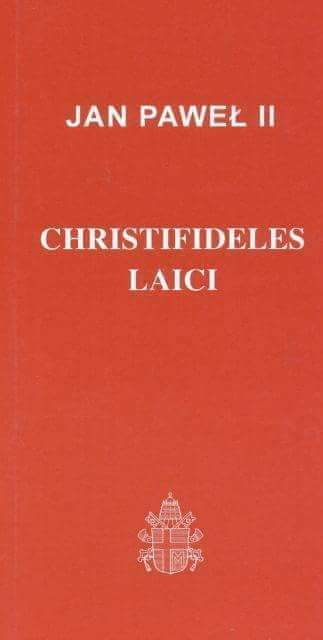 

### 1956

Zmarła Maria Kotarba zwana ,,Mateczką z Oświęcimia''. Po napaści hitlerowskiej Rzeszy Niemieckiej na Polskę we wrześniu 1939 r. Maria zaczęła działać w szeregach polskiego ruchu oporu. Do zadań Marii należało dostarczanie meldunków i zapasów żywności lokalnym grupom partyzanckim. W wyniku donosu została aresztowana przez Niemców i przetransportowana 6 stycznia 1943 roku do niemieckiego obozu koncentracyjnego Auschwitz-Birkenau, gdzie otrzymała numer obozowy 27995. Miesiąc później do Auschwitz-Birkenau trafiła również Lena Bankier - Mańkowska, deportowana przez Niemców z getta w Białymstoku. Dzięki pomocy Marii Lena została zarejestrowana jako polska więźniarka polityczna. W czasie pobytu w obozie Maria wielokrotnie pomagała Lenie,a także innym Żydom, dostarczając im lekarstwa oraz przemycając dodatkowe porcje żywności. Podczas ewakuacji obozu w styczniu 1945 r. obie Panie widziały się po raz ostatni. Po wojnie Lena Bankier-Mańkowska zamieszkała w Wielkiej Brytanii. Swoją wybawczynię odnalazła dopiero w 1997 r. Dzięki staraniom Leny 18 września 2005 r. Maria Kotarba została pośmiertnie uhonorowana medalem ,,Sprawiedliwa wśród Narodów Świata'', w dowód uznania, że z narażeniem życia ratowała Żydów prześladowanych w latach okupacji hitlerowskiej.

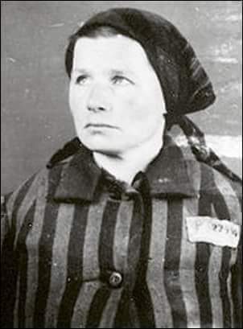 

### 1949

W Białymstoku wykonano wyrok śmierci na byłym dowódcy 1 Kompanii Szturmowej 3 Wileńskiej Brygady Armii Krajowej Romualdzie Rajsie ps "Bury" ( zdjęcie)-postaci tyle bohaterskiej, co dosyć kontrowersyjnej.
Rajs, jako podkomendny majora Zygmunta Szendzielarza był aktywnym uczestnikiem przeprowadzonej w 1944 roku operacji "Ostra Brama"i nawet jako dowódca jednego z oddziałów miał swoje sukcesy, ale miał też w swojej karierze kilka epizodów, które burzą obraz bohaterskiego żołnierza AK.
Jedno z tych wydarzeń miało miejsce już po wojnie 29 stycznia 1946 roku, kiedy to jako kapitan Narodowego Zjednoczenia Wojskowego wkroczył ze swoim oddziałem do wsi Zaleszany koło Bielska Podlaskiego. Żołnierze Rajsa zostali ostrzelani przez mieszkańców wsi, którzy sądzili, że są to żołnierze Korpusu Bezbieczeństwa Wewnętrznego. Oddziały Rajsa w odwecie zamordowały 16 osób wśród których były też dzieci. 31 stycznia 1946 również żołnierze Rajsa dokonali mordu na 30 mieszkańcach wsi Puchały Stare, a 1 lutego 1946 odbyła się odprawa dowódców plutonów. Kpt. Rajs przydzielił dowódcom zadania zniszczenia po jednej ze wsi: Zanie, Szpaki, Końcowizna. Wymienione wsie były w przeważającej części zamieszkałe przez ludność wyznania prawosławnego. W dniu 2 lutego 1946 roku plutony wyruszyły w kierunku poszczególnych wsi. Pierwszy pluton pod dowództwem „Wiarusa” wyruszył do wsi Szpaki, drugi pluton pod dowództwem „Bitnego” udał się do Zań, natomiast trzeci pluton pod dowództwem „Leszka” – do Końcowizny. Plutonowi „Leszka” towarzyszyło dowództwo.
W godzinach wieczornych do wsi Szpaki wkroczył pluton pod dowództwem „Wiarusa”. Żołnierze zaczęli podpalać zbudowania i strzelać do mieszkańców. Śmierć od kul lub w płomieniach oraz od odniesionych od tego ran poniosło 7 osób. Zostali zastrzeleni; Filipczuk Paweł (47 lat), Kłoczko Wasyl ( 58 lat), Szeszko Dionizy (50 lat), Szeszko Jan (45 lat), Szeszko Jan (21 lat). W jednym z domów dokonano gwałtu na kobiecie (zeznanie k. 1939 ). Wymieniona poddała się napastnikom, gdyż wcześniej Maria Pietruczuk (18 lat), która stawiała opór napastnikom została postrzelona w okolicy klatki piersiowej i pleców. Zmarła w wyniku odniesionych ran w dniu 6.02.1946 r. w szpitalu w Bielsku. Zostali też postrzeleni Teofil Bałło i Michał Rudczuk oraz Antonii Szeszko, który ranny w głowę zmarł w szpitalu Nadzwyczajna komisja powołana przez Powiatową Radę Narodową w Bielsku Podlaskim w dniu 3 lutego 1946 r. spisała straty materialne i odnalazła na miejscu ulotkę wzywająca ludność białoruską do opuszczenia wsi w ciągu 14 dni.
Drugi pluton, dowodzony przez „Bitnego” po przybyciu do Zań zajął następujące pozycje. Z jednej strony wieś została otoczona przez drużynę „Gołębia”, a z drugiej – przez drużynę „Szczygła”. Trzecia drużyna pod dowództwem „Ładunka” weszła do wsi, gdzie zaczęto podpalać poszczególne zabudowania. Nie podkładano ognia pod domy należące do osób wyznania katolickiego, jak też nie podpalano zabudowań tych prawosławnych, którzy zamieszkiwali w bezpośrednim pobliżu gospodarstw, należących do rodzin katolickich (według zeznań świadków wówczas w Zaniach mieszkały 4 rodziny katolickie). Mieszkańców, którzy usiłowali wydostać się z płonących domów zapędzano z powrotem lub strzelano do ludzi wybiegających z palących się budynków i próbujących uciec ze wsi. Przed oddaniem strzałów niektórych mieszkańców pytano o narodowość i wyznanie. W oparciu o dokumenty i zeznania świadków przesłuchanych w sprawie należy przyjąć, że podczas pacyfikacji wsi zginęły 24 osoby. Nadto rany postrzałowe odniosło 8 mieszkańców:
W protokole specjalnej komisji z Bielska Podlaskiego zapisano, że wśród zgliszczy znaleziono broń: jeden pistolet maszynowy oraz amunicję.
W dniu 2 lutego 1946r. została również zaatakowana wieś Końcowizna. Ataku dokonał trzeci pluton pod dowództwem „Leszka”. Świadkowie wydarzeń w Końcowiźnie podają, że wówczas zamieszkiwało wieś około 60 osób, wyznania prawosławnego. W tym dniu w około godziny 18.00 część oddziału przeszła do wsi przez lód na rzece Narwi i zaczęła podpalać strzechy domów, stodół oraz strzelać do ludności. Mieszkańcy wsi uciekli i nikt nie zginął (k. 1854). Władysław Z. dodał, iż mieszkańcy Końcowizna nie strzelali do partyzantów, gdyż nie mieli broni palnej. (cyt. za: Informacja o ustaleniach końcowych śledztwa S 28/02/Zi w sprawie pozbawienia życia 79 osób - mieszkańców powiatu Bielsk Podlaski w tym 30 osób tzw. furmanów w lesie koło Puchał Starych, dokonanych w okresie od dnia 29 stycznia 1946r. do dnia 2 lutego 1946)
Ostatecznie Rajsa aresztowano w 1948 roku, a 1 października 1949 roku skazano na karę śmierci. W 1995 roku Warszawski Sad Rejonowy zrehabilitowal kpt Rajsa i tym samym oczyścił z zarzutów.

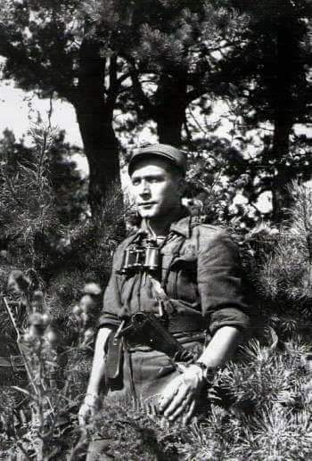 

### 1963

Papież Paweł VI nominował po śmierci metropolity Eugeniusza Baziaka na metropolitę krakowskiego Karola Wojtyłę (zdjęcie).
Ciekawostką jest fakt, że o swojej decyzji papież poinformował Wojtyłę telefonicznie.
Awansowanie Karola Wojtyły do godności
metropolity dało mu możliwość wzięcia udziału w zwołanym już wkrótce Soborze Watykańskim
II, gdzie dał się on poznać jako mądry i wybitny teolog.

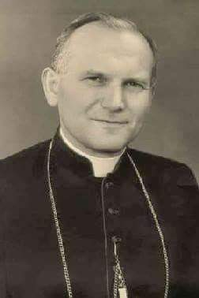 

### 1943

W ramach realizacji wydanego w lutym 1943 roku tzw "Rozkazu nr 1" nakazującego "masową likwidację ludności polskiej Polesia i Wołynia ,uznanych za tereny etnicznie ukraińskie" oddziały UPA zamordowały wszystkich mieszkańców kolonii Dąbrowa (powiat Tomaszów Lubelski).

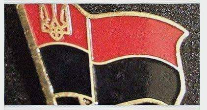 

### 1942

W swoim warszawskim mieszkaniu na ulicy Brackiej 13 aresztowana została Karolina Żurowska (zdjęcie) ziemianka, przedsiębiorca, właścicielka fabryki tkanin w Leszczkowie (obecnie Ukraina). Donos na nią złożył konfident gestapo, grekokatolicki ksiądz Josyp Kładoczny, który był również sekretarzem metropolity Lwowa biskupa Andrzeja Szeptyckiego.
Żurowską, jej córki i męża osadzono w areszcie na Pawiaku, a 17 stycznia 1943 roku tylko ją z córkami wywieziono do obozu w Majdanku. Mąż został na Pawiaku, gdzie zamordowano go podczas jednego z przesłuchań. Karolinę, po śmierci córek przewieziono do obozu w Ravensbrück, gdzie doczekała końca wojny.
Zmarła 5 czerwca 1980 roku w Lund w Szwecji.

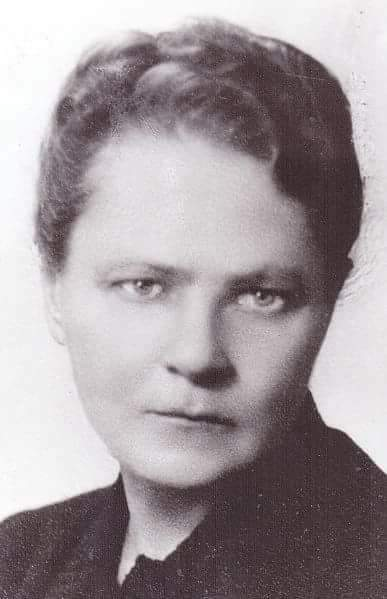 

### 1940

1940 roku grupa dywersyjna Związku Odwetu pod dowództwem inżyniera Franciszka Kwaśnickiego " Rawicza" przeprowadziła zamach bombowy na berlińskiej stacji kolejowej Anhalter. Wybuch ładunków podłożonych przez żołnierzy o nazwiskach Urbańczyk i Kupanik spowodował poważne zniszczenia pomieszczeń dworcowych. Kilka dni później szef Gestapo Heinrich Miller pisał w swoim raporcie:
" Zamach ten był aktem terroru dokonanym przez członków polskiego ruchu oporu. Z dochodzeń policyjnych wynika, że w przyszłości zamierzają oni dokonywać podobnych zamachów przy pomocy sic! bomb podkładanych w paczkach na innych dworcach".

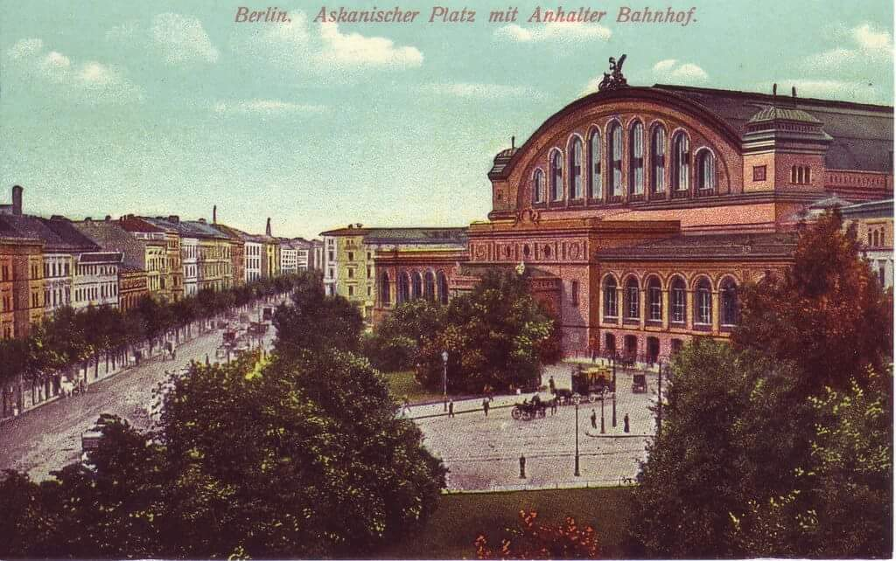 

### 1922

Powstał Związek Socjalistycznych Republik Radzieckich.
Państwo to powstało w wyniku połączenia Rosyjskiej Federacyjnej Socjalistycznej Republiki Radzieckiej, Białoruskiej Socjalistycznej Republiki Radzieckiej, Ukraińskiej Socjalistycznej Republiki Radzieckiej oraz Zakaukaskiej Socjalistycznej Republiki Radzieckiej.
I tu kolej na część naszej historii związanej z powstaniem ZSRR. Według szacunkowych danych, w granicach tego kraju według szacunków z roku 1943 na terenach polskich zagarniętych przez władze radzieckie znalazło się około 6 milionów Polaków. Zaś po uwzględnieniu przyrostu naturalnego, wysiedleń, oraz ewakuacji ludności z Armią Generała Władysława Andersa brakuje w bilansie ludności od 500 tysięcy do 1,5 mln Polaków. Jakaś ich część została zapewne zaliczona do innych nacji przez sowieckie organa państwowe.
Związek Socjalistycznych Republik Radzieckich upadł 26 grudnia 1991 roku.

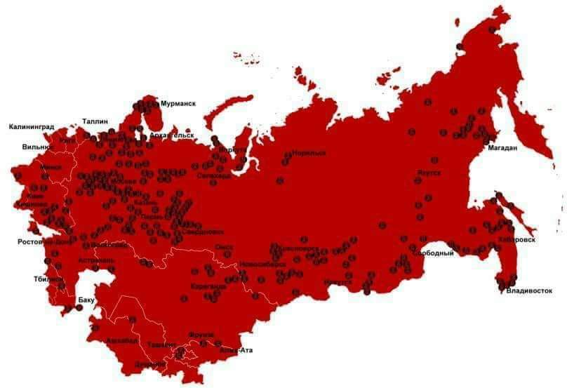 

### 1919

1919 roku Polska i Łotwa podpisały układ o wzajemnej pomocy wojskowej.
Na mocy tego porozumienia, oba kraje zobowiązały się do wspólnych działań militarnych przeciwko Rosjanom w ramach tak zwanej akcji "Zima". Pakt ten został następnie rozszerzony o kolejne postanowienia 16 stycznia 1920 roku.
Współpraca wojskowa Polaków i Łotyszy przyniosła efekt w postaci udanej styczniowej ofensywy wojskowej, w której udział wzięło 20 tysięcy żołnierzy, w tym 12 tysiecy Polaków pod wodzą generała Edwarda Rydza Śmigłego. Działania te, których częścią była wygrana bitwa pod Dyneburgiem zmusiły Rosjan do zawieszenia broni.

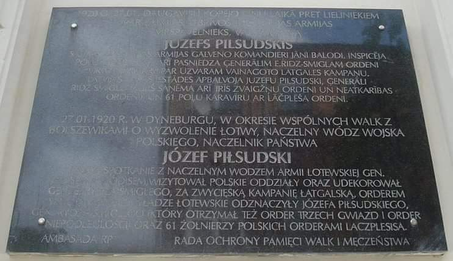 

### 1888

Urodził się Eugeniusz Kwiatkowski, bohater spektaklu Teatru Telewizji w reżyserii Roberta Talarczyka pt. "Imperium"

> Napisany specjalnie dla Teatru Telewizji dramat traktuje o spotkaniu legendarnego budowniczego Gdyni, premiera Eugeniusza Kwiatkowskiego, z wybitnym pisarzem Melchiorem Wańkowiczem, królem polskiego reportażu. Dwóm bohaterom partneruje córka Wańkowicza Krystyna oraz bracia Paweł i Władysław Kosieradzcy, twórcy Centralnego Okręgu Przemysłowego. Spotkanie w gabinecie premiera stanowi pretekst do wielu dyskusji oraz snucia wizji na temat rozwoju i przyszłości Polski, a towarzyskie pogawędki na tematy społeczno-obyczajowe (nie wyłączając plotek) pokazują, jakimi sprawami żyło społeczeństwo II RP. Eugeniusz Kwiatkowski jawi się jako wybitny polityk i wizjoner przyszłej Polski, Wańkowicz wtóruje mu swą błyskotliwością i inteligencją. Co stanie się z bohaterami za kilka lat? Czy ich wizje u progu II wojny światowej mają szansę na powodzenie? Dramat Tomczyka to niezwykła opowieść o wielkich i straconych nadziejach, a informacje zawarte w tekście świadczą o jego niewątpliwej wiedzy i ogromnej pasji historycznej.

Przedwojenny wicepremier, minister skarbu, twórca i koordynator budowy Centralnego Okręgu Przemysłowego oraz portu w Gdyni.
Stworzona przez niego w latach trzydziestych koncepcja budowy Centralnego Okręgu Przemysłowego zakładała uprzemysłowienie biednych rejonów wschodniej i centralnej Polski. W ramach COP powstały między innymi Huta Stalowa Wola, Wytwórnia Sprzętu Kominikacyjnego w Mielcu i Rzeszowie, Zakłady Metalowe w Nowej Dębie, Zakłady Chemiczne w Nowej Sarzynie i wiele innych.
Ambitne plany Kwiatkowskiego przerwał wybuch wojny, której czas wicepremier spędził na emigracji.
Po powrocie do kraju został odsunięty przez komunistów od władzy.
Zmarł w 1974 roku w Warszawie.
Odznaczony został pośmiertnie w 1996 roku Orderem Orła Białego.

### 1883

1883 roku w Łazanach w województwie małopolskim urodził się Jan Dunin Brzeziński (zdjęcie  podporucznik cesarskiej i królewskiej armii, podpułkownik kawalerii Wojska Polskiego, dowódca 2 pułku ułanów Polskiego Korpusu Posiłkowego.
Był absolwentem Wydziału Rolniczego Uniwersytetu w Hoenheim w Niemczech. Po ich ukończeniu podjął służbę w 1 pułku kawalerii austriackiej, gdzie uzyskał stopień podporucznika. W chwili wybuchu I wojny światowej zgłosił się na ochotnika do służby w Komendzie Legionow Polskich, gdzie został oficerem ordynansowym, a następnie dowódcą 3. Szwadronu Ułanów II Brygady Legionów Polskich. W czerwcu 1915 roku awansował do stopnia rotmistrza i został dowódcą Dywizjonu Ułanów II Brygady Legionów Polskich.
W roku 1918 podjął się misji utworzenia 2. Pułku Ułanów Wojska Polskiego przemianowanego później na 2. Pułk Szwoleżerów Rokitańskich.
Po zakończeniu wojny polsko-bolszewickiej przeszedł do rezerwy. Był gorącym orędownikiem Józefa Piłsudskiego. Został prezesem Towarzystwa Rolniczego w Osieczanach, a także zorganizował straż pożarną. W latach 1934-39 pełnił funkcję burmistrza Myślenic.
Na wieść o wybuchu II wojny światowej zgłosił się do armii na ochotnika. Brał udział w walkach o Lwów. Wkrótce został aresztowany przez władze sowieckie i osadzony w obozie w Starobielsku, a następnie w Kozielsku. Jego dalsze losy nie są dobrze znane. Został zamordowany prawdopodobnie w kwietniu 1940 roku w Miednoje.
Odznaczony Krzyżem Niepodległości, trzykrotnie Krzyżem Walecznych oraz Medalem Pamiatkowym za wojnę 1918-1921.

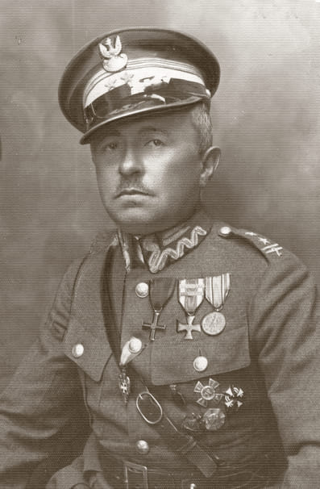 

### 1832

W Dokudowie koło Białej Podlaskiej urodził się Stanisław Brzóska (grafika) duchowny rzymskokatolicki, generał, naczelny kapelan powstania styczniowego oraz dowódca jednego z oddziałów powstańczych złożonego z chłopów.
Był absolwentem seminarium duchownego w Janowie Podlaskim, które ukończył w 1858 roku po czym podjął posługę wikariusza parafii w Sokołowie Podlaskim. Aresztowany przez władze rosyjskie w 1861 roku za głoszenie w swoich kazaniach polskich wartości patriotycznych za co został skazany na dwa lata pobytu w twierdzy Zamość. Wkrótce po wybuchu powstania styczniowego, decyzją Rządu Narodowego został mianowany na wspomnianą już funkcję naczelnego kapelana powstania. Służąc w stopniu generał brał udział między innymi w bitwach pod Siemiatyczami ,
Woskrzenicami , Gręzówką , Włodawą , Sławatyczami i Fajsławicami. W roku 1865 został schwytany w wyniku zeznania torturowanej przez Rosjan kurierki Rządu Narodowego Antoniny Konarzewskiej. Kobieta zdradziła miejsce jego pobytu, którym była wieś Krasnodęby, w której wojsko rosyjskie urządziło obławę na niego i podległy mu oddział. Został skazany na karę śmierci przez powieszenie. Wyrok wykonano 23 maja 1865 roku na rynku w Sokołowie Podlaskim.

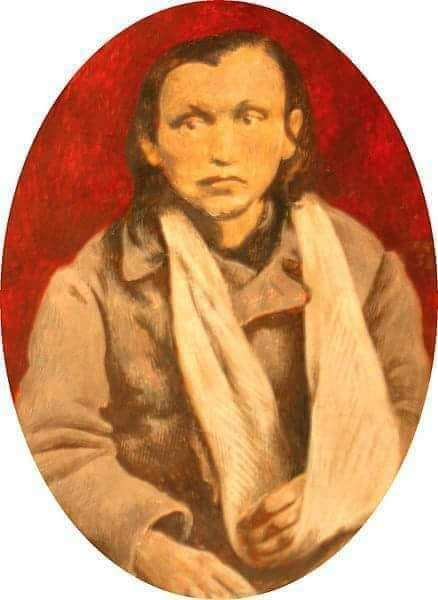 

---

<a href="https://github.com/TomaszWaszczyk/historia.waszczyk.com/edit/master/src/content/december-30.md" target="_blank">Edytuj tę stronę dzieląc się własnymi notatkami!</a>
