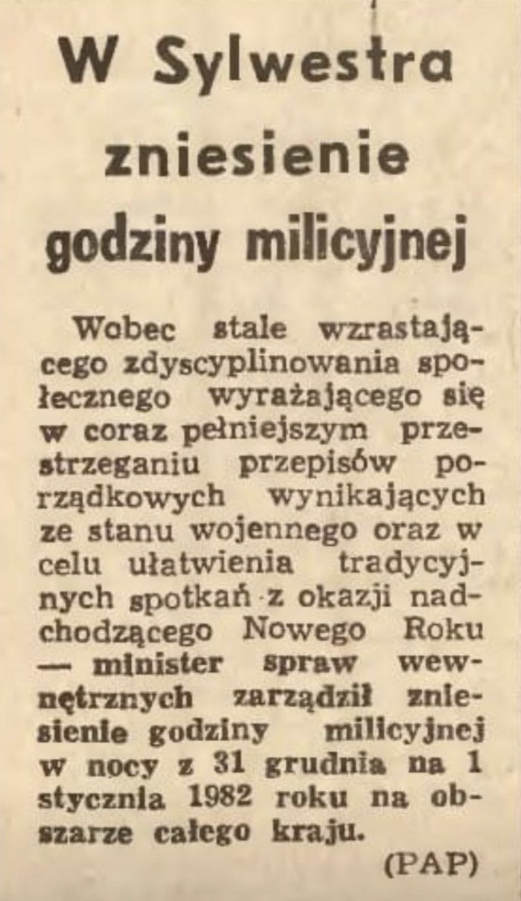
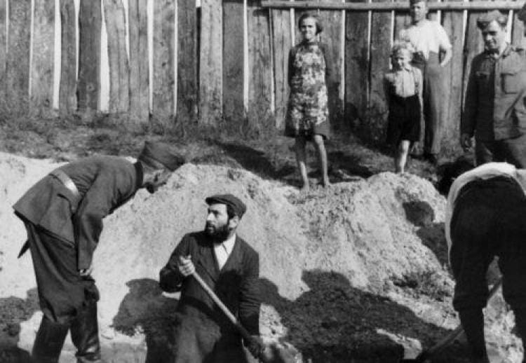
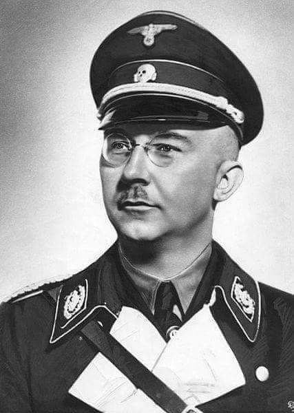
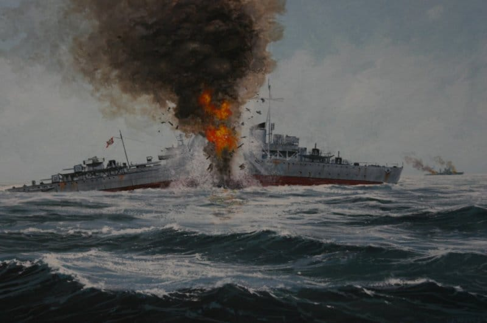
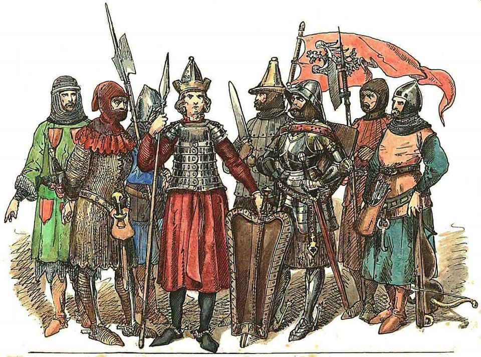
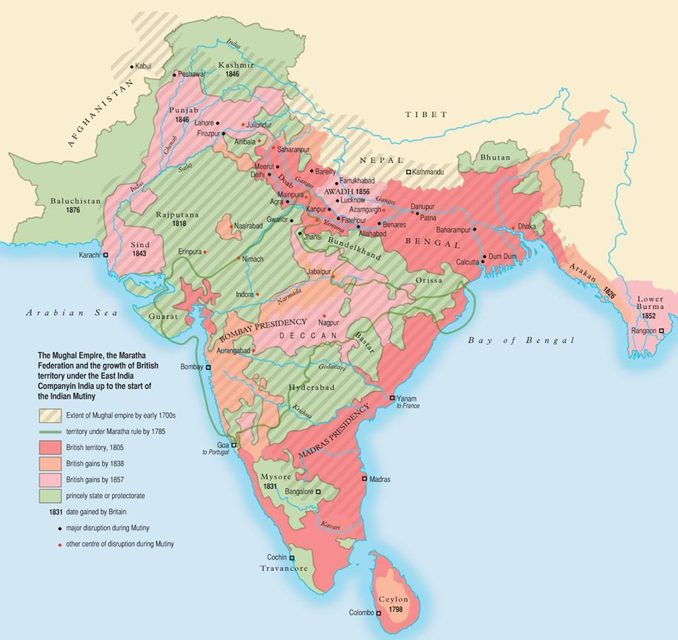
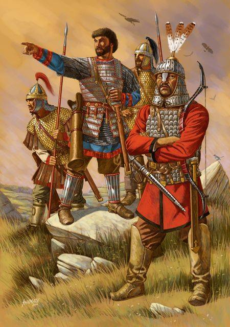

### 2021

Bełkot:

> “Wspólnie będziemy walczyć z inflacją. Jestem przekonany że będzie to walka zwycięska, ale musimy rzeczywiście zastosować nowe instrumenty finansowe, nowe instrumenty gospodarcze, inwestycyjne i je zastosujemy” – powiedział premier Mateusz Morawiecki.

---

Nuta prawdy:

> NBP podnosi prognozę inflacji na 2022. W przyszłym roku średnio ceny mają wzrosnąć o 7,6%

---

### 2020

Godzina policyjna w Sylwestra.

  

### 2020

> Dziś zadzwoniła do mnie moja siostra - pracująca w Instytucie Onkologii. Rząd zmniejszył nakłady na onkologię. W tym roku wydali 7mln zł na terapie. Na 2021 dadzą 3 mln. Dziś cofnęli jej urlop - siedzi w pracy i liczy komu mogą dać leczenie komu nie. Nowi nie dostaną. Liczą dla kontynuujących. Na pytanie do rządu co będzie jak braknie kasy we wrześniu - rząd każe PRZERWAĆ LECZENIE ONKOLOGICZNE ‼️‼️‼️
>Skur..wysyny.
>Zarządzenie przyszło przed wczoraj.

---

Po ostatniej interwencji walutowej NBP na PLN oraz komentarzy członków RPP odnośnie potencjalnej obniżki stóp procentowych złoty jest w grudniu najsłabszą walutą w bloku EMEA względem euro:

  

---

  

  

---

  

  

---

  

---

Idea Bank upada - and the game begins

  

---

Jak podaje "Super Express", były właściciel mięsnego imperium Henryk Kania został namierzony przez prokuraturę i ujęty w stolicy Argentyny Buenos Aires. Z informacji gazety wynika, że biznesmen oczekuje obecnie na ekstradycję.

''ZM Henryka K. oficjalnie upadły'' - ogłosił w czerwcu 2020 r. katowicki sąd gospodarczy. Jednocześnie orzeczenie potwierdza sprzedaż części przedsiębiorstwa na rzecz nowego właściciela. Za kwotę 100 mln zł netto zostanie nim Cedrob, jeden z liderów branży mięsnej w Polsce.

A warto przypomnieć początek tej historii:

– ''Jeżeli można mówić o aferze dotyczącej ZM Henryk Kania, to jest to afera związana ze zmową nadzoru sądowego, banków, Cedrobu i prawdopodobnie śląskiego wymiaru sprawiedliwości. Celem tej zmowy jest zniszczenie Henryka Kani i przejęcie Zakładów za małą część ich wartości. To tą aferą powinna się jak najszybciej zająć prokuratura'' – mówił Henryk Kania w rozmowie z Business Insider Polska w 2019r.

---

Minus 76% - o tyle zmniejszyła się sprzedaż mieszkań w Warszawie na rynku wtórnym w 3 kwartale 2020 rdr. Doszło do 936 transakcji w porównaniu do 3941 transakcji w 3 kwartale 2019. Dane: NBP.

---

  

---

Bitcoin nie zastąpi dolara i złota

    Ignacy Morawski

Dopóki za kryptowalutą nie stoi armia, nie widzę możliwości jej upowszechnienia się na dużą skalę jako środka płatniczego.

Wzrost ceny bitcoina to pewnie jedna z najbardziej intrygujących zmian finansowych na świecie w 2020 r. Nie chodzi tylko o wielkość tego wzrostu, ale fakt, że kryptowalutę poważnie zaczęły traktować duże instytucje finansowe i niektórzy ekonomiści. Coś, co jeszcze parę lat temu było uznawane za fanaberię technologicznych zapaleńców, jest uznawane czasem za wyzwanie rzucone dolarowi lub złotu.

Ranga bitcoina jako potencjalnego aktywa inwestycyjnego znacząco wzrosła w minionym roku, a już tylko ten fakt ma wpływ na jego wycenę. Kryptowalutę włączyło do swoich inwestycji wiele instytucji, ale mój ekonomiczny umysł wciąż każe mi wątpić, czy technologiczna innowacja może stać się walutą stosowaną na skalę globalną. Sądzę, że nadzieje ekonomiczne pokładane w bitcoinie i podobnych kryptowalutach się nie spełnią, nawet jeżeli popyt na nie będzie rósł.

---

### 2019

Sytuacja słuzby zdrowia (lek. med. Bartek Fiałek):

<video width="640" height="480" controls>
  <source src="./movies/december/sluzba-zdrowia-2019.mp4" type="video/mp4">
Your browser does not support the video tag.
</video>

---

### 1958

  

### 1941

Na terenie całej Rzeszy weszło w życie nowe prawo dla Polaków i Żydów zamieszkujących jej obszar. Czytamy w nim między innymi:

Polacy i Żydzi będą karani śmiercią, a w mniej ciężkich wypadkach karą pozbawienia wolności, o ile przez przejawianą nienawiść lub podburzającą działalność ujawnią wrogi w stosunku do niemczyzny nastrój i sposób myślenia, a w szczególności, jeśli występują z antyniemieckimi wynurzeniami, jeśli zrywają publicznie afisze niemieckich władz i instytucji oficjalnych oraz jeśli przez swe szczególne zachowanie się i postępowanie obniżają powagę państwa niemieckiej Rzeszy i niemieckiego narodu lub też szkodzą ich dobru.

  

Robotnicy przymusowi w Rzeszy.

### 1953

W Warszawie zaprezentowany został prototyp samochodu osobowego Syrena.
Decyzja o podjęciu produkcji tego auta zapadła na odbywającym się w maju tego samego roku zjeździe Komitetu Centralnego Polskiej Zjednoczonej Partii Robotniczej. Syrena, której głównym konstruktorem był 40 letni wówczas inżynier Karol Pionnier rozwijała prędkość do 100 km/h i spalała ponad 8 litrów benzyny na 100 kilometrów.
Pierwsze seryjnie produkowane Syreny zjechały z taśmy montażowej Fabryki Samochodów Osobowych na Żeraniu w 1957 roku. Produkcję tego auta zakończono w roku 1983.

  

### 1942

1942 roku szef SS Heinrich Himmler (zdjęcie) wydał zarządzenie likwidacji wszystkich żydowskich gett w Generalnej Guberni , za wyjątkiem wielkich gett zbiorczych w Warszawie, Krakowie, Częstochowie, Radomiu i Lublinie. Specjalnie wyselekcjonowani Żydzi mieli znaleźć się w obozach pracy na rzecz niemieckich firm
zbrojeniowych. Ponadto utworzono tzw. " wtórne getta " (pułapki), które miały za zadanie przyciągać ukrywających się Żydów. Powstały one w Międzyrzeczu, Parczewie, Łukowie, Włodawie, Izbicy, Piaskach i Zaklikowie (na początku 1943 r. zostały zlikwidowane). Był to wyrok śmierci dla milionów Żydów i początkiem niespotykanej w dziejach ludzkości akcji ludobójstwa.

  

---

Bitwa na Morzu Barentsa Taktyczne zwycięstwo Brytyjczyków nad Niemcami

  

### 1932

Polscy matematycy: Marian Rejewski, Jerzy Różycki i Henryk Zygalski złamali kody niemieckiej maszyny szyfrującej Enigma

### 1908

W Buczaczu na Ukrainie urodził się Szymon Wiesenthal (zdjęcie) -austriacki dziennkarz i pisarz pochodzenia żydowskiego, tropiciel niemieckich zbrodniarzy wojennych wśród których był między innymi Adolf Eichmann.
Wisenthal kilkakrotnie uniknął śmierci z rąk Niemców, a po wojnie współpracując z Mossadem rozpoczął słynną już dziś akcję tropienia hitlerowskich oprawców po całym świecie. Był też przeciwnikiem pomijania zbrodni popełnianych przez Żydów na Żydach.
Zmarł w 2005 roku.

  

### 1530

Wczasie polsko -mołdawskiej wojny o pokucie wojska polskie dowodzone przez hetmana polnego Jana Koła z Dalejowa poniosły pod Chocimiem bolesną klęskę. Przeciwnikem liczących 1400 żołnierzy wojsk polskich były czterokrotnie większe oddziały mołdawskie pod dowództwem hospodara mołdawskiego Piotra Raresza.

### 1435

W Brześciu Kujawskim podpisane zostało porozumienie kończące wojnę polsko-krzyżacką.
Stronami tego konfliktu były sprzymierzone z Krzyżakami wojska litewskiego księcia Świrdygiełły oraz wojska Zygmunta Kiejstutowicza.
Wojna ta była nieudaną próbą oderwania Litwy od Korony, a przypieczętowaniem klęski Świrdygiełły i Krzyżaków była przegrana przez nich 1 września 1435 roku bitwa pod Wiłkomierzem.
W ramach pokoju w Brześciu Kujawskim, Krzyżacy zobowiązali się do zerwania sojuszu z księciem litewskim, oddali zamek w Dybowie oraz wpłacili 9500 złotych węgierskich zadośćuczynienia, Zygmunt Kiejstutowicz został wielkim księciem litewskim.

  

Grafika przedstawia rycerzy polskich.

---

### 1600

Królowa Elżbieta I Tudor powołała Kompanię Wschodnioindyjską.

Wydaje wam się, że dzisiejsze transnarodowe korporacje są zbyt potężne? To co powiecie o prywatnej firmie, która posiadała ogromną armię, prawo wypowiadania wojny i zawierania pokoju, a w szczytowym momencie kontrolowała około połowy światowego handlu? Brytyjska Kompania Wschodnioindyjska była najpotężniejszą korporacją w dziejach, a do upadku przywiódł ją bunt pracowników.

W szczytowym okresie rozwoju Imperium Brytyjskiego, Indie były nazywane perłą w jego koronie. Kolonizację tego subkontynentu zaczęło nie państwo, a prywatna spółka londyńskich kupców.

Kompanii Wschodnioindyjskich pojawiło się w historii kilka, w różnych krajach. Ten sposób organizacji handlu zamorskiego był typowy dla XVI i XVII w. W tym artykule piszę o najsłynniejszej i najpotężniejszej z nich – Brytyjskiej Kompanii Wschodnioindyjskiej i to ją będę miał na myśli pisząc „Kompania”.

#### Skromne początki

Pod koniec XVI w. trudno było oczekiwać, że Wielka Brytania zdominuje świat. Kraj pod rządami Elżbiety I dopiero wchodził do pierwszej ligi europejskiej polityki. Zamorskie wyprawy i handel były domeną głównie dwóch państw z Półwyspu Iberyjskiego – Hiszpanii i Portugalii. Hiszpanie działali głównie na Atlantyku i w Ameryce, z kolei Portugalczycy w Brazylii, Afryce i Azji. Hiszpanie zakładali na zdobytych terenach swoją administrację i podporządkowywali ją Madrytowi, natomiast Portugalia budowała system faktorii handlowych i zadowalała się ogromnymi zyskami z handlu z Indiami.

Tę równowagę naruszyli Anglicy. W 1588 r. rozbili hiszpańską Wielką Armadę (przy wydatnej pomocy słynnej brytyjskiej pogody) i położyli kres hiszpańskiej dominacji na morzach. Pod koniec stulecia zaczęli coraz śmielej wypuszczać się na dalsze wody. Próbowali znaleźć północną drogę do Indii (zatrzymała ich Arktyka), poszerzali wpływy na Bałtyku i zaczęli pływać do Indii, wokół Przylądka Dobrej Nadziei.

W tamtych czasach handel oceaniczny był ryzykownym biznesem. Piraci, sztormy i trudy kilkuletnich wypraw sprawiały, że były to głównie prywatne przedsięwzięcia. Kupcy łączyli się w doraźne spółki, kupowali statek, wynajmowali załogę, a po szczęśliwym powrocie statku dzieli się gigantycznym profitem i rozwiązywali spółkę. Często jednak statek nie wracał, a wówczas udziałowcy niejednokrotnie plajtowali z powodu zaciągniętych na wyprawę długów.

31 grudnia 1600 r., królowa przyznała monopol na cały handel między Przylądkiem Dobrej Nadziei a Cieśniną Magellana nowej spółce akcyjnej, której udziałowcami stali się londyńscy kupcy i arystokraci. Tak narodziła się Kompania Wschodnioindyjska.

Początki były trudne. Brakowało doświadczenia, a ogromną konkurencję w regionie Indii i Azji Południowo-Wschodniej stanowili Portugalczycy i Holendrzy. Na domiar złego, ustawicznie potrzebujący pieniędzy król Jakub I naruszał monopol Kompanii, nadając przywileje handlu z Indiami innym spółkom kupieckim, za co naturalnie pobierał odpowiednie opłaty. Dopiero w połowie XVII w., Kompania uzyskała faktyczny monopol na brytyjski handel w Azji.

Początkowo Kompania działała tradycyjnymi metodami, czyli wysyłała wyprawy kupieckie. Jednak po kilku latach zaczęła zakładać faktorie handlowe, które szybko przekształciły się w miasta. Wiele ogromnych miast w dzisiejszej Azji, takich jak Kalkuta, Bombaj czy Singapur zaczynały jako jej posterunki handlowe. Do ich ochrony zatrudniano miejscowych, którzy stali się zalążkiem późniejszej armii Kompanii.

Agenci Kompanii zaczęli zapuszczać się również do Chin oraz Japonii, choć w Kraju Kwitnącej Wiśni nie udało im się zbudować trwałych relacji handlowych.

#### Budowa potęgi

W 1612 r. okręty Kompanii starły się z Portugalczykami w bitwie pod Suvali. „Bitwa” to dużo powiedziane. Z obu stron walczyły po cztery jednostki. Wrogowie ostrzelali się z dział, Portugalczycy podjęli nieudaną próbę abordażu i utracili jeden okręt, po czym się wycofali. Ta bitwa miała jednak ogromny wpływ na postawę lokalnej ludności. Władca państwa Wielkich Mogołów, rozciągającego się w dzisiejszych północnych Indiach i Pakistanie, uznał, że lepiej trzymać z Brytyjczykami i nadał im ogromne przywileje handlowe. To złamało portugalską siłę w Indiach.

Ocean Indyjski stał się polem intensywnej rywalizacji Kompanii i jej holenderskiej odpowiedniczki, co stało się źródłem licznych wojen brytyjsko-holenderskich w XVII i XVIII stuleciu.

Rosnąca w siłę Kompania miała naturalnie wielu wrogów. Nałożyły się na to niejasne powiązania między państwem a kapitałem prywatnym. Kompania zatrudniała profesjonalnych lobbystów, którzy pilnowali jej interesów w Parlamencie, a liczni członkowie Parlamentu posiadali jej akcje, którymi handlowano w publicznym, giełdowym obrocie. Do tego Kompania pozyskała intratne zlecenia na dostawy saletry (kluczowego składnika prochu strzelniczego) dla brytyjskiej marynarki, co wzmocniło jej wpływy w wojsku.

W pierwszej połowie XVIII w., korona próbowała przejąć kontrolę nad korporacją. Najpierw założono konkurencyjną firmę z udziałem państwa, ale bogaci właściciele Kompanii wykupili znaczącą część udziałów i doprowadzili do połączenia dwóch firm.

W 1756 r. wybuchła wojna siedmioletnia. Konflikt był pierwszą wojną o prawdziwie światowym zasięgu. Wzięła w nim udział większość ówczesnych potęg: po jednej stronie Brytyjczycy, Prusacy i Portugalczycy, po drugiej Austriacy, Rosjanie, Francuzi, Hiszpanie i Saksończycy. Walki toczyły się w Europie, Azji i Ameryce.

Wielka Brytania potrzebowała wsparcia militarnego i finansowego Kompanii, więc strony doszły do porozumienia. Kompania została poddana kontroli państwa. W ustawie o Kompanii Wschodnioindyjskiej z 1773 r. ustalono ostatecznie, że Kompanią kieruje rada pięciu osób, z których trzy nominuje Parlament, dwie zaś akcjonariusze firmy. W zamian Kompania otrzymała monopol na handel z Indiami i Chinami, potwierdzono jej prawa do nabytków terytorialnych w Indiach (choć były to nabytki „na rzecz korony”) oraz dano prawo wypowiadania wojny i zawierania pokoju.

Wojska Kompanii pokonały w Indiach Francuzów i ich hinduskich sojuszników w bitwie pod Palasi, w 1756 r. W efekcie władca Bengalu przyznał Kompanii prawo ściągania podatków w jego państwie, ustanawiając ją de facto władcą tych terenów.

#### Kompania, władca Indii

Kompania nie zamierzała poprzestawać na Bengalu. Korzystając z politycznych podziałów i rywalizacji między państwami indyjskimi, podporządkowywała sobie kolejne obszary. Urzędnicy pozostawiali miejscową arystokrację, która wciąż rządziła swoimi terenami, ale teraz z nadania Kompanii, która czerpała z tego kolosalne zyski.

W połowie XIX w., pod władzą korporacji znalazły się niemal całe dzisiejsze Indie i Pakistan oraz fragmenty dzisiejszych: Bangladeszu, Mjanmy (Birmy), Indonezji i Nepalu.

Kompania rządziła Indiami przez 100 lat (1757–1858). Stworzyła potężną, sprawną administrację, a jej interesy zabezpieczały trzy armie, liczące sobie w połowie XIX w. 250 tys. żołnierzy, czyli więcej, niż armia brytyjska. Niemal wszyscy wyżsi urzędnicy i oficerowie byli Brytyjczykami, a rządy Kompanii były okrutne. Podczas Wielkiego Głodu Bengalu, w 1770 r., zmarło ok. 10 mln osób, co stanowiło blisko 1/3 ludności tych terenów. Przyczyniła się do tego również polityka korporacji, która brutalnie ściągała podatki od zubożałej gwałtownie ludności, by powetować sobie spadek zysków.

Pod wpływem Kompanii, Parlament przeforsował zwolnienie indyjskiej herbaty z ceł, co miało zmniejszyć straty. Oburzeni koloniści amerykańscy wyrzucili ją ze statków w porcie w Bostonie, co stało się zarzewiem amerykańskiej Wojny o Niepodległość.

Kompania nawiązała również stosunki handlowe z największą ówczesną gospodarką świata – Chinami. Problem polegał na tym, że niewiele mieli Chińczykom do zaoferowania za ich jedwab, herbatę i porcelanę. Wpadli więc na pomysł, delikatnie mówiąc, wątpliwy moralnie. Zaczęli eksportować do Chin produkowane w Indiach opium. Oczywiście władcy Chin usiłowali zablokować handel, ale usankcjonowany przez Kompanię przemyt przybrał kolosalne rozmiary.

Chińczycy, przerażeni postępującym w społeczeństwie nałogiem, skonfiskowali w 1839 r. opium bez odszkodowania, zabronili brytyjskim kupcom handlu i uwięzili ich w swoich kwaterach. Kompania znów ruszyła na wojnę, która przeszła do historii jako pierwsza wojna opiumowa. Chiny przegrały, musiały się otworzyć na handel narkotykiem, a Hongkong przeszedł pod władzę Brytyjczyków. W 1856 r. wybuchła druga wojna opiumowa, która podporządkowała Chiny zachodnim mocarstwom na niemal sto lat.

#### Zmierzch i upadek Kompanii

Krytyka brutalnej polityki Kompanii w metropolii i problemy finansowe korporacji powodowały stopniowe ograniczanie jej roli. Kolejne ustawy Parlamentu coraz mocniej podporządkowywały Kompanię władzy państwa.

W 1813 r. zlikwidowano monopol na handel z Indiami, za wyjątkiem handlu herbatą. W 1833 r. Kompania ostatecznie straciła wszystkie brytyjskie monopole w Indiach i Chinach. Musiała się też zgodzić na zwiększenie roli Hindusów w administracji i armii. W 1835 r. Parlament przeznaczył część zysków Kompanii na rozwój edukacji i literatury w Indiach. W 1853 r. stanowiska urzędnicze w korporacji zaczęły podlegać otwartym konkursom, co zlikwidowało możliwość rozdawania pożądanych synekur przez dyrektorów Kompanii, ograniczając ich wpływy.

Ostateczny cios Kompanii Wschodnioindyjskiej zadało Powstanie Sipajów. Sipajami nazywano Hindusów służących w armii Kompanii. W 1857 r. wywołali oni potężny bunt.

Źródłem powstania były nadużycia, których urzędnicy Kompanii dopuszczali się na rodzimej ludności. Bezpośrednią iskrą, która wywołała wybuch, stała się sprawa tłuszczu zwierzęcego w nabojach, którymi posługiwali się żołnierze. W ówczesnej technologii strzelec, by naładować karabin, musiał odgryźć papierowe zamknięcie naboju. Żeby zapobiec zawilgoceniu prochu, papier nasączano tłuszczem zwierzęcym. To stanowiło problem tak dla muzułmanów (tłuszcz nieczystych świń), jak dla hinduistów (tłuszcz świętych krów). Kompania, zamiast wycofać się z niepopularnej decyzji, jeszcze zaogniła sytuację.

Powstanie Sipajów zrujnowało północne Indie, ale niemal doprowadziło do zakończenia brytyjskich rządów w Indiach. Ostatecznie nie wszyscy Hindusi i nie wszyscy sipajowie poparli wystąpienie, co dało czas Brytyjczykom na ściągnięcie posiłków z Europy i stłumienie rebelii. Jednak Kompania została ostatecznie skompromitowana. W 1858 r. Wielka Brytania oficjalnie przejęła urzędników i armie Kompanii, podporządkowując Indie bezpośrednio rządowi.

Kompania przetrwała w szczątkowej formie do 1874 r., gdy została oficjalnie rozwiązana.

#### Dziedzictwo Kompanii Wschodnioindyjskiej

Kompania zapisała wiele najgorszych kart w historii europejskiego kolonializmu, jednak nie sposób nie dostrzec jej wpływu na rozwój międzynarodowego biznesu na świecie.

Kompania była jedną z pierwszych spółek akcyjnych w naszym rozumieniu tego terminu. Akcjami handlowano w sformalizowany sposób, co dało zaczątek dzisiejszym giełdom papierów wartościowych. Akcjonariusze odpowiadali tylko do wysokości udziałów, co stanowi dziś jeden z fundamentów korporacji. Jej agenci przecierali szlaki na styku biznesu i polityki i byli jednymi z pierwszych profesjonalnych lobbystów.

Z ramienia Kompanii dokonano wielu odkryć geograficznych, a największe miasta dzisiejszych Indii zostały założone przez jej agentów. Motywacją korporacji był wyłącznie zysk, jednak to właśnie jej polityka w dużej mierze ukształtowała dzisiejszą Azję Południowo-Wschodnią. Od połowy XVII do połowy XIX wieku była najważniejszym graczem politycznym w regionie. Mówiąc językiem dzisiejszej geopolityki – regionalnym mocarstwem.

Tak więc kiedy będziecie narzekać na rozpasanie jakichś korporacji, pamiętajcie, że mogło być gorzej. Google nie ma własnej armii i nie prowadzi wojen. Przynajmniej oficjalnie.

  

---

### 535 r. n.e.

Wódz bizantyński Belizariusz wylądował na Sycylii i wkroczył do Syrakuz.

Latem 534 roku zwycięski wódz powrócił do stolicy. Za swoje ogromne osiągnięcia cesarz obsypał go zaszczytami – pozwalając mu nawet na wjazd triumfalny do Konstantynopola (pierwszy od 500 lat dla człowieka, nienależącego do rodziny cesarskiej, i jak się miało okazać, jeden z ostatnich, jeśli nie ostatni, w historii cesarstwa). Według Prokopiusza, w procesji niesiono łupy ze świątyni jerozolimskiej, zdobyte za Tytusa, a utracone w 455 roku, gdy Wandalowie pod wodzą Genzeryka zdobyli Rzym. W następnym roku Belizariuszowi przyznano tytuł patrycjusza oraz konsulat.

Justynian, zachęcony dotychczasowymi sukcesami, postawił przed wodzem nowe zadanie – odzyskanie Italii, gdzie panowali Ostrogoci. W 535 roku Belizariusz wylądował na Sycylii, którą bardzo szybko opanował. Rok później zdobył Neapol, gdzie dla postrachu dokonał rzezi mieszkańców, oraz Rzym. Wydawało się, że powtórzy się historia z Afryki, lecz Goci zdetronizowali swojego nieudolnego króla Teodata, a na jego miejsce powołali Witigesa. Podjął on próbę odbicia Rzymu, przez rok oblegając miasto, lecz bezskutecznie. Wiosną 538 roku wojska bizantyjskie przeszły do kontrataku, zdobywając Mediolan. Sytuacja zaczęła się jednak psuć ze względu na konflikt Belizariusza z innym wodzem, eunuchem Narsesem, przez najazd Burgundów, którzy odbili Mediolan, a na wschodzie Persowie znów szykowali się do wojny. Cesarz zaczął więc przynaglać swoich dowódców, by dokończyli jak najszybciej podbój Italii. Belizariusz opanował jeszcze podstępem stolicę Gotów, Rawennę (podczas oblężenia Goci zaproponowali mu, by został ich władcą jako cesarz zachodu; ten pozornie się zgodził, lecz kiedy otwarły się bramy miasta, szybko pojmał Witigesa i ogłosił, że zajmuje miasto w imieniu Justyniana).

To zdarzenie mogło wzbudzić w cesarzu podejrzenia, odwołał więc wodza na Wschód, by tam zajął się powstrzymaniem perskiej inwazji w Syrii. Król perski Chosroes zdobył i złupił Antiochię, a jej mieszkańców wybił niemal do nogi. Wiosną 541 roku Belizariusz rozpoczął kampanię, lecz bardzo szybko wycofał się z zajętych terenów. Przyczyną takiego obrotu rzeczy był wybuch zarazy (jakkolwiek Prokopiusz twierdzi, że powodem był konflikt wodza z jego żoną, Antoniną). Wódz został ponownie odwołany do stolicy, gdzie Teodora pogodziła go z żoną. Na Wschód powrócił w następnym roku, lecz było za późno – Persowie dokonali kolejnego najazdu na Syrię. W końcu udało mu się wynegocjować rozejm, dzięki któremu Persowie mieli powstrzymać się od ataków na następne 5 lat. Miary złego dopełniła kolejna fala zarazy, która ogarnęła całe państwo, uniemożliwiając wszelkie działania; słabym pocieszeniem był fakt, że także w imperium Sasanidów rozprzestrzeniła się zaraza, przez co wojna na wschodnich granicach cesarstwa samoistnie wygasła. Ta ogromna epidemia uśmierciła wiele tysięcy ludzi (w samym Konstantynopolu podobno zmarło 300 000 osób), a sam Justynian o mały włos nie dołączył do liczby jej ofiar, długo chorując – władzę dzierżyła wtedy Teodora.

  

---

### 192 r. n.e.

W noc noworoczną został zamordowany cesarz Kommodus. Do spiskowców należeli jego pokojowy Eclectus i konkubina Marcja. Zabójstwo było końcem panowania dynastii Antoninów i początkiem wojny domowej w Imperium rzymskim.

Kommodus był rodzonym synem Marka Aureliusza. Stoicki cesarz miał więcej potomstwa, ale większość wyginęła z powodu nieznanej epidemii jaka przywędrowała ze wschodu wraz z cesarzem Werusem. Podobno chłopiec również cierpiał z powodu choroby, ale uleczył go sławny lekarz Galen (jego to dzieła będą czytane w średniowieczu przez adeptów sztuki Asklepiosa). Aureliuszowi więc został jedynie Kommodus. Nic dziwnego, że cesarz bardzo cenił i wielbił jedynego spadkobiercę. O latach młodzieńczych przyszłego cesarza starożytni przekazują trochę niejasny osąd. Najprawdopodobniej już wtedy Kommodus wykazywał się dużą okrutnością i bezwzględnością jak i po prostu chamstwem. Nikt jednak nie ośmielał się otworzyć oczy Aureliuszowi, ślepo zapatrzonego w swojego jedynego syna.

Marek Aureliusz nigdy nie starał się ukrywać, że to właśnie Kommodusa uczyni następcą. Obdarzył go bowiem trybunatem, a później konsulatem. Razem z synem wyjechał również na drugą kampanię przeciw Markomanom, aby utworzyć nowe prowincje: Markomancję i Sarmację. Jednak cesarz zmarł, kiedy jego plany był już tak blisko urzeczywistnienia. Kommodus jako nowy cesarz podejmuje (jak kiedyś Hadrian) decyzję, że porzuca plany ojca a podbite ziemie zwraca barbarzyńskim plemionom. Dlaczego tak uczynił? Chciał bowiem jak najszybciej wrócić do Rzymu, a aby kampanie doprowadzić do końca trzeba było co najmniej roku walk w dzikich, barbarzyńskich puszczach. Niektórzy, usprawiedliwiając Kommodusa, twierdzili, że to z powodu pieniędzy, które trzeba by poświęcić na dalszą walkę. Ale jeżeli Aureliusz wydał już zawrotną sumę na dwu letnią kampanię, to właśnie przerywanie jej jest wyrzuceniem pieniędzy w błoto ! Decyzja nowego cesarza była jednak niezachwiana. Historia dała Rzymowi już drugą szansę zromanizowania barbarzyńców (wcześniej była klęska Warusa), z której imperium nie skorzystało. Wg przysłowia niewykorzystane szanse się mszczą i tak było w przypadku wiecznego miasta.

Kommodus powróciwszy do Rzymu zajął się (jak niegdyś Neron) tylko sprawami reprezentacyjnymi państwa, faktycznie rządzili jego doradcy. Sam cesarz poświęcał się jedynie ucztom, pałacowym orgiom seksualnym, igrzyskom i wyścigom rydwanów (dokładnie jak wiek wcześniej Neron). Był tak zepsuty, że kiedyś przed publicznością całując swojego sługę, jawnie przyznał się do pederastii ! Jak widać dla cesarza płeć nie grała roli w jego erotycznych wybrykach.

W końcu zawiązał się spisek na życie cesarza. Była w niego wplątana również siostra głowy państwa, a wdowa po Werusie, Lucylla. Jednak z powodu opieszałości zamachowca, Kommodus uratował życie.

Od tego czasu lubieżny cesarz stał się strasznie podejrzliwy i rozpoczął falę zabójstw, wymuszonych samobójstw i konfiskat majątków (taka sama sytuacja miała miejsce za panowania Kaliguli). Nikt nie był bezpieczny. Mimo wszystko cesarz odsunął się od sprawowania władzy, a imperium kierował prefekt pretorianów Perenis. Jak niegdyś Sejan za rządów Tyberiusza i również jak Sejan został zgładzony przez cesarza, gdy ten odkrył niebezpieczne aspiracje swojego prefekta.

Na szczęście dla imperium na granicy nie było większych zamieszek. Ciekawe co by się stało gdyby wojnę wywołała np. Partia?

W końcu cesarz, który żyje w zupełnym zepsuciu musi popaść w obłęd. Jak kiedyś Kaligula uważał się za bogów, tak teraz Kommodus postanowił, że będzie Herkulesem.

Arystokracja nie mogła ciągle patrzeć na wyczyny szaleńca (który, jak wcześniej wykazałem miał najgorsze paralelne rządów Tyberiusza, Kaliguli, Nerona) i zawiązała spisek. Tym razem się powiódł. Najlepsza dynastia w dziejach Rzymu, dynastia Antoninów, kończy swoje istnienie na lubieżnym, krwawym szaleńcu. Czyż to nie zaskakujące?

  

---

<a href="https://github.com/TomaszWaszczyk/historia.waszczyk.com/edit/master/src/content/december-31.md" target="_blank">Edytuj tę stronę dzieląc się własnymi notatkami!</a>
