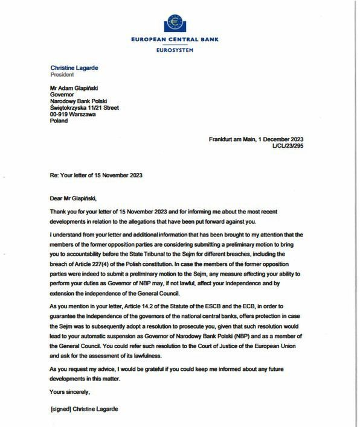
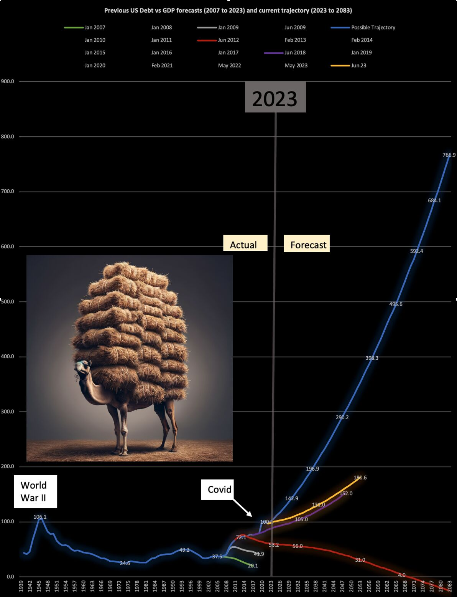
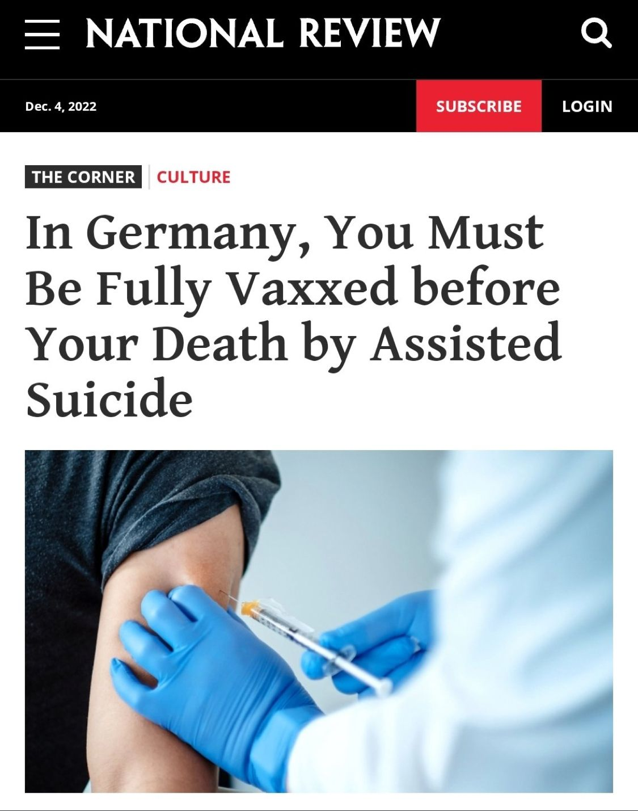
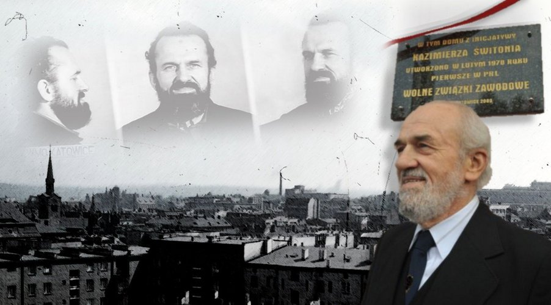

### 2023

  

  

### 2022

Macron:

> „Musimy przygotować się na to, co nastąpi po [wojnie w Ukrainie] i zastanowić się, jak możemy chronić sojuszników, a jednocześnie zapewnić Rosji gwarancje jej własnego bezpieczeństwa, gdy strony wrócą do stołu negocjacyjnego”.

### 2021

Raport oparty na danych urzędów państwowych. Prezentacja wybranych, ilościowych aspektów tragicznych skutków „walki” z wirusem covid-19 w Polsce w okresie od marca 2020 do maja 2021.

1. W Polsce i w wielu krajach europejskich nie było pierwszej fali zgonów. Str. 3
2. Covid-19 nie jest bardziej zjadliwy niż podobne wirusy sezonowe. Str. 3
3. Są w Europie kraje, gdzie nie było żadnych nadmiarowych zgonów. Str.5
4. Epidemiologia jako nauka zaprzecza informacjom płynącym z rządowych komunikatów. Str.7
5. „Liczba zakażonych” w Polsce nigdy nie była znana. Str. 8
6. Blokada szpitali i masowy rozwój innych chorób śmiertelnych zakończony hekatombą przedwczesnych śmierci. Str. 9
7. Hekatomba zgonów niecovidowych 2020/21. Str. 11
8. Dane o zgonach covidowych nie mają źródła w procesach naturalnych, jakim jest umieranie. Str.14

<a href="./documents/december/Prawdziwa_tragedia_narodu_polskiego_2020_2021_walka_z_covid_19_v1.pdf" target="_blank">Raport</a>

---

  

---

### 2020

"Po co nam właściwie państwo polskie, skoro wszystkie dyrektywy przyjdą z Unii"

Rafał Ziemkiewicz

Dwa tygodnie temu Polska i Węgry zawetowały projekt unijnego budżetu na lata 2021–27 oraz fundusz odbudowy gospodarek państw UE po pandemii koronawirusa. Sprzeciw Warszawy i Budapesztu wynika z faktu powiązania wypłat środków unijnych z przestrzeganiem praworządności.
– Zostaliśmy zrobieni w konia i teraz PiS nie umie wyjaśnić, czemu żeśmy się najpierw zgodzili a teraz nie zgadzamy. – A dlaczego tak zrobiliśmy? Dlaczego nas wykiwano i skazano na to, żebyśmy teraz jak idioci powtarzali: "Ale przecież to niezgodne z traktatami, przecież tam jest artykuł tak i taki”...
No niezgodnie, to własne służby UE to przyznały.
Nie dlatego oni to robią, żeby to było zgodne z prawem, ale robią to po to, aby coś osiągnąć; a że tego nie ma w traktatach.
Mamy w Polsce bardzo potężną siłę, która wyznaje filozofie: "Po co nam lotnisko, skoro lotnisko jest w Berlinie...(wcześniej np. stocznie-moje).
„Ta filozofia prowadzi do tego – po co nam w ogóle państwo polskie, skoro wszystkie dyrektywy przyjdą z UE, przyślą pieniądze i wszystkie wskazówki jak je wydawać”.

---

Ciekawostka: Archiwa służby bezpipieczeństwa w Polsce były/są ułożone według alfabetu.. rosyjskiego ;-)

---

### 2014

W Katowicach zmarł Kazimierz Świtoń. To On, jako pierwszy człowiek, publicznie oświadczył, że Lech Wałęsa to tajny współpracownik SB o pseudonimie "Bolek".

  

> Rząd światowy zdecydował (…), że Polaków ma być 15 mln, i to zdrowych parobków żydowskich.

### 2003

2003 roku w okolicach Chojnowa na Mazowszu około godziny 18.30 rozbił się rządowy śmigłowiec Mi-8, na którego pokładzie znajdowała się delegacja, której przewodniczył Leszek Miller. Nikt nie zginął, rannych zostało 14 osób.
Według ustaleń Państwowej Komisji Badania Wypadków Lotniczych przyczyną runięcia maszyny na zięmię była awaria silników wywołana przez ich oblodzenie.
10 marca 2004 roku prokurator z
Wojskowej Prokuratury Okręgowej w Warszawie postawiła pilotowi majorowi Markowi Miłoszowi zarzuty umyślnego sprowadzenia bezpośredniego niebezpieczeństwa katastrofy powietrznej przez niedochowanie zasad bezpieczeństwa w locie, to jest czyn z artykułu 174 paragraf 1 Kodeksu karnego, za co grozi kara do 8 lat pozbawienia wolności oraz nieumyślnego sprowadzenia katastrofy powietrznej zagrażającej życiu lub zdrowiu wielu osób, to jest czyn z artykułu 173 paragraf 2 w związku z paragrafem 1 Kodeksu karnego, za co grozi do 3 lat pozbawienia wolności.
Miłosz nie przyznał się do winy i złożył obszerne wyjaśnienia. W marcu 2010 roku, po trwających ponad sześć lat postępowaniu i procesie, Wojskowy Sąd Okręgowy w Warszawie uniewinnił Miłosza ze stawianych mu zarzutów.

### 1958

Ponad 2 miesiące bez lądowania i przebyte 240 tys. kilometrów - tyle trwał najdłuższy lot bez lądowania w historii. Kto zatem uważał, że Le Mans jest ekstremalną próbą wytrzymałości ten tkwił w głębokiej niewiedzy.

4 grudnia 1958 dwóch amerykańskich pilotów John Cook oraz Robert Timm wsiadło do małej awionetki Cessna 172 na lotnisku Las Vegas McCarran. To jednosilnikowy, czteromiejscowy samolot turystyczny produkowany od 1956 roku do dnia dzisiejszego

Samolot nosił nazwę Hacienda. Lot był bowiem sponsorowany przez właścicieli hotelu oraz kasyna, którzy w ten niekonwencjonalny sposób postanowi wypromować swój nowy obiekt.

Ze środka awionetki usunięto wszystko, co było zbędne. Wbudowano za to dodatkowy zbiornik paliwa. Jeden z foteli wymontowano z kabiny tworząc miejsce do spania-w jego miejsce wyłożono materac.

Paliwo tankowano podczas lotu, bez lądowania. Z jadącego samochodu podawano do samolotu także świeże ubrania, ręczniki, wodę oraz jedzenie. Piloci swoje potrzeby fizjologiczne załatwiali na dwóch podestach zamontowanych na zewnątrz kabiny.

### 1941

W Moskwie, dzień po spotkaniu z generałami Władysławem Andersem i Władysławem Sikorskim Józef Stalin podpisał porozumienie w sprawie wspólnej walki przeciwko Niemcom.
Tak skomentował to sam Sikorski:
"Żołnierze polscy będą się bić ze wspólnym wrogiem o oswobodzenie swojej ojczyzny. Razem z wami, gdyż Rosja sowiecka zrozumiała, że silna Polska rządząca się wewnętrznie zgodnie z duchem czasów, zgodnie z własną tradycją jest nieodzownym czynnikiem trwałej równowagi europejskiej. Wierzę zaś, że Rosja nie zapomni w przyszłości, iż Polska biła się razem z nią ze śmiertelnym wrogiem wszystkich Słowian Niemcami".

### 1943

Ukraińska Powstańcza Armia opublikowała raport pod tytułem " Służba Bezpieczeństwa na dole rozstrzeliwuje na lewo i prawo".
Służba Bezpeky, bo taka jest właściwa nazwa tej formacji była organem przeprowadzającym czystki w szeregach OUN i UPA na tak zwanym "elemencie niepewnym" czyli wszystkich podejrzanych o sympatie propolskie i proradzieckie.
Poniżej fragment wspomnień sierżanta UPA Maksyma Skorupśkiego, dówódcy kurenia, który dokonał zbrodni w Podkamieniu:
"Każdy wojskowy fachowiec, nawet dowódca roja, jeżeli był bezpartyjny (...) miał przy sobie jeśli nie politwychownyka, który decydował o wszystkim, to wybranego członka SB, których za ich okrucieństwo i tępotę nazywano "Uzbekami" (...) Ten system nadzoru oraz system likwidacji ofiar na podstawie decyzji SB - bez jakiegokolwiek sądu - był haniebny i straszny, ale (...) dawał banderowcom poczucie pełnie władzy. Oni zapędzili opozycję do podziemi. Nikt otwarcie nie odważył się wysłowić jakiejkolwiek krytyki (...) Najgłupszy i najstraszniejszy rozkaz był wykonywany."
Na zdjęciu Dmytro Kupiak "Klij" - dowódca SB OUN-UPA w Busku i Kamionce Strumiłowej (woj. tarnopolskie), ludobójca odpowiedzialny osobiście za zamordowanie ponad 200 osób w latach 1943-1945.

### 1940

Podczas próby przedostania się do Francji, na terenie Słowacji aresztowany został August Kowalczyk (zdjęcie) późniejszy wybitny polski aktor teatralny i filmowy. Osadzony z został w Kl Auschwitz jako numer 6804. Pracował przy wyładunku materiałów budowlanych, przy budowie zakładów Buna-Werke, przy rozbiórce zbombardowanej synagogi w Oświęcimiu oraz domów po wysiedlonych Polakach w Monowicach. 28 maja 1942 roku został przeniesiony za kontakty z ludnością cywilną Oświęcimia do dożywotniej kompanii karnej. Z obozu zbiegł 10 czerwca 1942 roku.

### 1926

Podczas zjazdu Związku Ludowo-Narodowego w Poznaniu powstał Obóz Wielkiej Polski- organizacja narodowa zrzeszająca środowiska prawicowe, której celem było oddziaływanie na społeczeństwo w duchu idei narodowej oraz walka z sanacją.
Twórcą Obozu Wielkiej Polski był Roman Dmowski, który na pomysł jej utworzenia wpadł po powrocie z podróży do Włoch. W jego zamyśle OWP miał zrzeszać elitę, która drogą rewolucji miała przejąć władzę w Polsce.
W szczytowym momencie organizacja liczyła ponad ćwierć miliona członków. OWP stał się z czasem solą w oku autorytatnych władz wakacyjnych, które widząc realne zagrożenie postawiły sobie za cel walkę z tą organizacją.
Jednym z kilku zamierzeń, jakie chciał zrealizować OWP było utworzenie państwa narodowego, które miałoby realizować interesy tylko i wyłącznie narodu polskiego, a nie wszystkich jego obywateli. OWP silnie również akcentował przywiązanie do katolicyzmu. Zakładał, iż Polska powinna być państwem wyznaniowym, z tolerancją dla istnienia innych wyznań i zachowaniem wolności woli. Gospodarka miała zaś opierać się na modelu społeczno -korporacyjnym, za którym opowiadała się znaczna część młodzieży o poglądach radykalnych. W sferze ustrojowej opowiadano się za wzmocnieniem władzy wykonawczej i wprowadzeniem zasad hierachizmu i elitaryzmu w życiu politycznym.
Obóz Wielkiej Polski został rozwiązany 28 marca 1933 roku za sprawą zarządzenia ministra spraw wewnętrznych w którym nakazywano władzom administracji rozwiązanie wszystkich jednostek organizacyjnych OWP istniejących jeszcze na terenach poszczególnych województw. Powodem miała być działalność OWP, która rzekomo stanęła w wyraźnym konflikcie z kodeksem karnym i władzami państwowymi.

---

<a href="https://github.com/TomaszWaszczyk/historia.waszczyk.com/edit/master/src/content/december-4.md" target="_blank">Edytuj tę stronę dzieląc się własnymi notatkami!</a>
