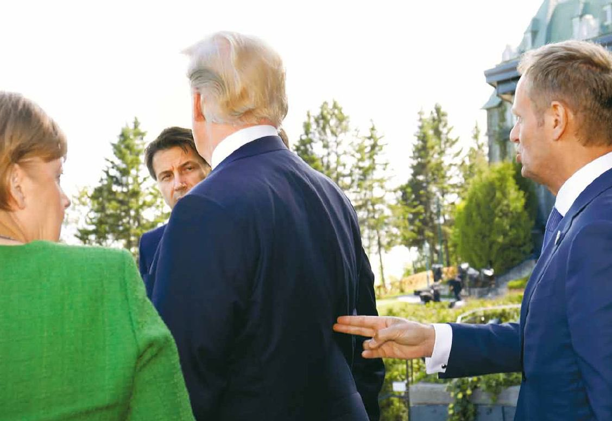

### 2019
 
  

### 1980

W Moskwie odbyła się narada przywódców państw Układu Warszawskiego. Głównym tematem rozmów była wewnętrzna sytuacja w Polsce. Mimo, iż uznano, że rozwój wypadków jest zagrożeniem dla komunizmu i nosi znamiona kontrrewolucji, nie podjęto decyzji o interwencji zbrojnej. W trakcie spotkania generał Wojciech Jaruzelski przedstawił projekt samodzielnej likwidacji Solidarności oraz opozycji w przypadku, gdy tylko zostaną zauważone pierwsze symptomy zmęczenia społeczeństwa trudną sytuacją polityczno- gospodarczą. Równocześnie Stanisław Kania ostrzegł Leonida Breżniewa, że zbrojna interwencja wojsk radzieckich spotka się z gwałtowną reakcją społeczeństwa, która może doprowadzić wręcz do wybuchu powstania narodowego.

### 1975

Oddany został do użytku Dworzec Centralny w Warszawie.
Jego lokalizację określiło już w 1946 roku Biuro Odbudowy Stolicy. Przez wiele lat władze Warszawy nie potrafiły wybrać odpowiedniego projektu (autorem wszystkich był zmarły w 2008 roku warszawski architekt Arseniusz Romanowicz). Decydowały głównie względy ekonomiczne. Wybrano projekt dosyć okrojony w funkcjonalność i ergonomię. Zrezygnowano m.in. z betonowych estakad dla pieszych planowanych na poziomie antresoli i prowadzących do pobliskich wieżowców Centrum LIM i Intraco II.
Budowę rozpoczęto w roku 1972. Prowadzono ją bardzo szybko z powodu zapowiadanej wizyty I sekretarza KC KPZR Leonida Breżniewa. Pośpiech sprawił, że budowlę oddano do użytku mimo, iż budowla miała przeciekający dach i niesprawną kanalizację.
W roku 1975, w popularnym konkursie architektonicznym, dworzec otrzymał tytuł „Mistera Warszawy"

---

59 intelektualistów skierowało do władz PRL list będący protestem przeciwko wprowadzeniu planowanych zmian w Konstytucji.
Oto jego treść:
"Powodowani troską obywatelską uważamy, że Konstytucja i oparte na niej prawodawstwo powinny zagwarantować przede wszystkim następujące wolności obywatelskie:
Wolność sumienia i praktyk religijnych. Wolności tych nie ma, gdyż ludzie przyznający się do wierzeń religijnych lub ujawniający światopogląd odmienny od oficjalnie obowiązującego nie są dopuszczani do znacznej części kierowniczych stanowisk w urzędach i instytucjach publicznych, organizacjach społecznych i gospodarce narodowej. Dlatego należy zapewnić wszystkim obywatelom, bez różnicy religii, światopoglądu lub przynależności partyjno-politycznej jednakowe prawo do obejmowania stanowisk państwowych. Decydować powinny jedynie kwalifikacje, indywidualne zdolności i uczciwość osobista. Należy także umożliwić wszystkim grupom wyznaniowym swobodne wykonywanie praktyk religijnych oraz budowę świątyń.
Wolność pracy. Wolności tej nie ma, gdy państwo jest jedynym pracodawcą, a związki zawodowe są podporządkowane instancjom partyjnym, sprawującym w praktyce władzę państwową. W tych warunkach – jak wskazują doświadczenia lat 1956-1970 – próby obrony interesów robotniczych grożą rozlewem krwi i prowadzić mogą do poważnych zaburzeń. Dlatego należy pracownikom zapewnić możliwość swobodnego wyboru własnej reprezentacji zawodowej, niezależnej od organów państwowych lub partyjnych. Należy zagwarantować również prawo do strajku.
Wolność słowa i informacji. Gdy nie ma wolności słowa – nie ma swobodnego rozwoju kultury narodowej. Gdy wszystkie publikacje przed ukazaniem się podlegają cenzurze państwowej, a wydawnictwa i środki masowego przekazu są kontrolowane przez państwo – obywatele nie mogą świadomie ustosunkować się do decyzji władzy państwowej, ta zaś nie wie, jaki jest stosunek społeczeństwa do jej polityki. Szczególnie groźne następstwa państwowego monopolu publikacji oraz działania cenzury prewencyjnej występują w literaturze i sztuce, które nie pełnią swych społecznie doniosłych funkcji. Dlatego związkom pracowniczym, stowarzyszeniom twórczym, religijnym i innym należy umożliwić powołanie niezależnych od państwa wydawnictw i czasopism. Dlatego należy znieść cenzurę prewencyjną, a odpowiedzialność w wypadku naruszenia ustawy prasowej egzekwować tylko w drodze postępowania sądowego.
Wolność nauki. Nie ma wolności nauki wówczas, gdy kryteria doboru kadry naukowej i tematów badań określane są przez władze państwowe i mają charakter polityczny. Dlatego należy przywrócić autonomię wyższych uczelni i zapewnić samorządność środowiska naukowego.
Zagwarantowanie tych podstawowych wolności nie da się pogodzić z przygotowywanym oficjalnie uznaniem kierowniczej roli jednej partii w systemie władzy państwowej. Tego rodzaju konstytucyjne stwierdzenie nadawałoby partii politycznej rolę organu władzy państwowej, nieodpowiedzialnego przed społeczeństwem i nie kontrolowanego przez społeczeństwo. W tych warunkach Sejm nie może być traktowany jako najwyższy organ władzy ustawodawczej, rząd nie jest najwyższym organem wykonawczym, a sądy nie są niezawisłe. Należy zapewnić realizację prawa wszystkich obywateli do wysuwania i wybierania swych przedstawicieli w pięcioprzymiotnikowych wyborach. Należy zapewnić niezawisłość sądów od władz wykonawczych, a Sejm uczynić rzeczywiście najwyższą władzą ustawodawczą.
Uważamy, że nierespektowanie wolności obywatelskich może doprowadzić do stopniowego pozbawiania społeczeństwa świadomości narodowej i do przerwania ciągłości narodowej tradycji. Jest to zagrożenie dla egzystencji narodu. [...]
Uznanie tych wolności, potwierdzone przez konferencję w Helsinkach, nabiera dziś wagi międzynarodowej, gdyż tam, gdzie nie ma wolności, nie ma pokoju ani bezpieczeństwa."
Wśród sygnatariuszy listu byli między innymi Andrzej Drawicz, Zbigniew Herbert, Stefan Kisielewski, Leszek Kołakowski i Jan Józef Lipski.

---

<a href="https://github.com/TomaszWaszczyk/historia.waszczyk.com/edit/master/src/content/december-5.md" target="_blank">Edytuj tę stronę dzieląc się własnymi notatkami!</a>
