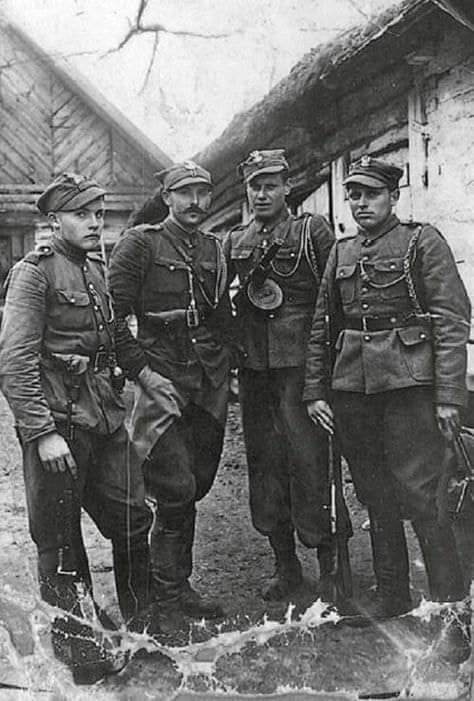

### 1991

Premierem rządu RP został Jan Olszewski (zdjęcie). Funkcję tę objął po Janie Krzysztofie Bieleckim. Wotum zaufania jego gabinetowi Sejm udzielił 23 grudnia 1991 roku.
Olszewski był zwolennikiem spowolnienia i ograniczenia prywatyzacji i wyprzedaży majątku państwowego, opowiadał się za dekomunizacją Ministerstwa Obrony Narodowej, Ministerstwa Spraw Wewnętrznych oraz Urzędu Ochrony Państwa. W maju 1992 wyraził swój sprzeciw wobec koncepcji przekazywania baz opuszczanych przez wojska rosyjskie stacjonujące w Polsce w ręce międzynarodowych spółek polsko-rosyjskich. Uchwałą Sejmu z 5 czerwca 1992 Jan Olszewski został pozbawiony urzędu na skutek uchwalenia wotum nieufności.
W jednym z wywiadów tak później o tym mówił:
"Jedna z naszych ustaw dotyczyła procesu prywatyzacji, powoływała instytucję – akcjonariat narodowy, która miała się zajmować procesem prywatyzacji. Jednak trudno sobie wyobrazić, by ci, którzy chcieli zarabiać na uwłaszczeniu, dopuścili do takich zmian. Uderzenie w ich interesy było do przewidzenia. Wyrok na mój rząd został wydany".

### 1945

W okolicach miejscowości Wola Malowana w województwie łódzkim w obławie zorganizowanej przez połączone siły grup operacyjnych Urzędu Bezpieczeństwa, NKWD i Korpusu Bezpieczeństwa Wewnętrznego śmierć ponieśli orucznik Henryk Piasecki "Zapora", dowódca kompanii Konspiracyjnego Wojska Polskiego i sierżant Józef Broniszewski "Boryna". Zabójcy czekali na swoje ofiary w jednym z miejscowych młynów. Poinformowani przez agenta o nadchodzących, Zaporze i Borynie otworzyli do nich ogień z dwudziestu karabinow maszynowych. Porucznik ˝Zapora˝ zginął na miejscu. Jego zastępca, ciężko ranny, zmarł po kilku godzinach pozostawiony na mrozie bez pomocy. Ciało poległego oficera trzymano 2 dni na mrozie, aby wieść o śmierci legendarnego partyzanta obiegła wszystkie wsie. Dopiero po 2 dniach wydano zwłoki rodzicom wraz z warunkową zgodą na cichy pogrzeb por. ˝Zapory˝ na cmentarzu w Kodrębie.

  

---

<a href="https://github.com/TomaszWaszczyk/historia.waszczyk.com/edit/master/src/content/december-6.md" target="_blank">Edytuj tę stronę dzieląc się własnymi notatkami!</a>
