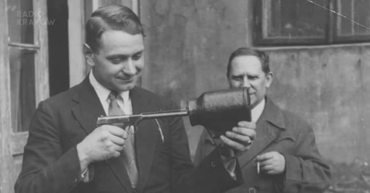

### 1991

Premierem rządu RP został Jan Olszewski (zdjęcie). Funkcję tę objął po Janie Krzysztofie Bieleckim. Wotum zaufania jego gabinetowi Sejm udzielił 23 grudnia 1991 roku.
Olszewski był zwolennikiem spowolnienia i ograniczenia prywatyzacji i wyprzedaży majątku państwowego, opowiadał się za dekomunizacją Ministerstwa Obrony Narodowej, Ministerstwa Spraw Wewnętrznych oraz Urzędu Ochrony Państwa. W maju 1992 wyraził swój sprzeciw wobec koncepcji przekazywania baz opuszczanych przez wojska rosyjskie stacjonujące w Polsce w ręce międzynarodowych spółek polsko-rosyjskich. Uchwałą Sejmu z 5 czerwca 1992 Jan Olszewski został pozbawiony urzędu na skutek uchwalenia wotum nieufności.
W jednym z wywiadów tak później o tym mówił:
"Jedna z naszych ustaw dotyczyła procesu prywatyzacji, powoływała instytucję – akcjonariat narodowy, która miała się zajmować procesem prywatyzacji. Jednak trudno sobie wyobrazić, by ci, którzy chcieli zarabiać na uwłaszczeniu, dopuścili do takich zmian. Uderzenie w ich interesy było do przewidzenia. Wyrok na mój rząd został wydany".

### 1945

W okolicach miejscowości Wola Malowana w województwie łódzkim w obławie zorganizowanej przez połączone siły grup operacyjnych Urzędu Bezpieczeństwa, NKWD i Korpusu Bezpieczeństwa Wewnętrznego śmierć ponieśli orucznik Henryk Piasecki "Zapora", dowódca kompanii Konspiracyjnego Wojska Polskiego i sierżant Józef Broniszewski "Boryna". Zabójcy czekali na swoje ofiary w jednym z miejscowych młynów. Poinformowani przez agenta o nadchodzących, Zaporze i Borynie otworzyli do nich ogień z dwudziestu karabinow maszynowych. Porucznik ˝Zapora˝ zginął na miejscu. Jego zastępca, ciężko ranny, zmarł po kilku godzinach pozostawiony na mrozie bez pomocy. Ciało poległego oficera trzymano 2 dni na mrozie, aby wieść o śmierci legendarnego partyzanta obiegła wszystkie wsie. Dopiero po 2 dniach wydano zwłoki rodzicom wraz z warunkową zgodą na cichy pogrzeb por. ˝Zapory˝ na cmentarzu w Kodrębie.

  

### 1942

W Ciepielowie w województwie mazowieckim żandarmeria niemiecka zamordowała 34 osoby-członków rodzin Kowalskich, Obuchiewiczów, Skoczylasów i Kosiorów za pomoc w ukrywaniu Żydów.

Relacja Marii Bieleckiej:

"Kowalskich wyprowadzili z domu. Całą rodzinę wiedli do Obuchów. Na przodzie szedł wuj Adam, trzymając za ręce chłopców-Heńka i Stefana, jak to z nimi czasami na spacer wychodził, tylko głowa mu do ziemi obwisła i nogami bezsilne powłóczył. Za nimi ciotka Helena tuliła w ramionach maleńkiego Tadka, a za matką szły Janka i Zośka (...) Wlekli się, otoczeni rojem żołdaków, żądłami bagnetów ponaglających ich do szybkiego kroku. Ciotka odwróciła głowę w stronę naszych okien. Pewnie chciała nas pożegnać spojrzeniem, ale Niemiec zdzielił ją w kark kolbą karabinu, że omal nie zaryła twarzą w brudny zdeptany śnieg. W drzwiach chaty Obuchów odezwała Tadzia od piersi, jakby co chciała poddać Niemcowi, zapewne błagała o zmiłowanie dla małżeństwa. Pchnął ją Niemiec tak silnie, że od futryny drzwi się odbiła i runęła gdzieś za próg chałupy. Drzwi dokładnie zamknęli, klamkę drutem unieruchomili i wieńcem rozstawili się wokół chaty (...)
Stałam w oknie i patrzyłam, co też teraz będzie z trzynastoma moich najbliższych, uwięzionych w ciasnej, próchniejącej chacie. Niemcy, jak czarne słupy, stali na śniegu, na coś czekali. Raptem na szarzejącym firmamencie w trzech miejscach rozlała się bladoróżowa smuga. Rosła w górę i gwałtownie przechodziła w chwiejącą się czerwień "Łuna"- szepnął ojciec i od razu utrafił-"Obu Kosiorów i Skoczylasa palą"
Na te łuny Niemcy wyczekiwali. Dwu z nich podeszło pod chatę Obucha. Jednocześnie zakreślili ramionami łuk i padli na śnieg. Huk targnął powietrzem, zadzwoniły szyby w naszym domu, z Obuchowej chałupy przez wyrwane okna posypały się drzazgi i straszny ludzki ryk uderzył w niebiosa. To było złudzenie, ale zdawało mi się, że ryk ten rozszczepia się na wycie Adama i Piotra, na wrzask obu ciotek, pisk dziewcząt skomlenie Tadzika i najmłodszego 7-miesięcznego syna Obuchów, któremu jeszcze nie zdążono nadać imienia na chrzcie. Po chwili ryk opadł, przeszedł w płacz i wołanie. Któryś z Niemców zbliżył się do chałupy i palący się wiecheć słomy przyłożył do strzechy. Ogień szybko uchwycił się poszycia, chciwymi klinami biegł w górę i na boki, aż cała strzecha przemieniła się w jeden wielki płomień.
Buchnął kłąb złotych iskier i czarna chmura dymu zakotłowała się nad chałupą. Dach zawalił się do środka. Znowu ryk nieludzki dobiegł przez szyby. A z nim i śmiech, niemieckie okrzyki radości. Po chwili z łomotem wypadły drzwi gorejącej chałupy i z sieni wybiegło dziecko. Leciało na oślep przed siebie, rękoma rozgarniając powietrze, bo zapewne dym oczy mu pokąsał (...) Padły strzały. Janka podcięta pociskami, wyciągnęła się do tyłu i rozrzucajac ramiona, legła w śniegu. Zbliżyli się do niej jak hieny, pochylili się nad dziewczęcym trupem (...) Skusiły ich nowe buty dziewczyny. Ściągnęli je z trupa brutalnymi szarpnięciami, a potem taki jeden złapał ją za warkocz i ciągnął po bruzdach, by podnieść za kark jak wór śmieci i rzucić w płomienie. W płomieniach ciągle odzywały się jęki.

---

https://en.wikipedia.org/wiki/Peter_Handke

### 1941

W Warszawie podpisano dokumenty scaleniowe dotyczące zjednoczenia organizacji konspiracyjnej Muszkieterzy z Związkiem Walki Zbrojnej.
Muszkieterzy byli organizacją konspiracyjną o charakterze wywiadowczym, o której nawet dziś niezbyt wiele wiadomo. Organizacja ta została utworzona w październiku lub listopadzie 1939 roku, a na jej czele stanął wywodzący się z Polskiej Organizacji Wojskowej kapitan Stefan Stefan Witkowski "Kapitan" (na zdjęciu z lewej).
Do Muszkieterów należeli przede wszystkim młodzi oficerowie służby czynnej i rezerwy oraz osoby wywodzące się ze środowisk technicznych, w sporej części znajomi Witkowskiego ze studiów technicznych.
Muszkieterzy wchodzili w skład Centralnego Komitetu Organizacji Niepodległościowych , od którego otrzymywali środki finansowe. Prowadzili głównie działalność wywiadowczą, w tym także na obszarze Rzeszy i polskich obszarach zajętych po 17 września 1939 r. przez ZSRR, oraz kontrwywiadowczą. Silna placówka wywiadowcza, tzw. baza, znajdowała się też w Budapeszcie .
Organizacja ta posiadała bezpośrednie kontakty z brytyjskim wywiadem Secret Service, któremu dostarczała regularne raporty wywiadowcze.
Niestety współpraca Muszkieterów z ZWZ nie należała do udanych. Już w kilka miesięcy od zjednoczenia doszło do konfliktu z powodu żądania przez Stefana Roweckiego Grota ujawnienia siatki agentów na co nie przystał Witkowski. Doprowadziło to do tego, że w sierpniu 1942 r. KG AK oskarżyła go o niesubordynację i współpracę z Abwehrą i Gestapo .
Wojskowy Sąd Specjalny skazał go na karę śmierci. Wyrok wykonała komórka egzekucyjna AK 18 września tego roku. Wcześniej Muszkieterzy zostali rozwiązani rozkazem komendanta głównego AK, gen. S. Roweckiego z 27 sierpnia 1942 r. Większość członków organizacji przeszła do AK, część do innych organizacji podziemnych.

  

---

<a href="https://github.com/TomaszWaszczyk/historia.waszczyk.com/edit/master/src/content/december-6.md" target="_blank">Edytuj tę stronę dzieląc się własnymi notatkami!</a>
