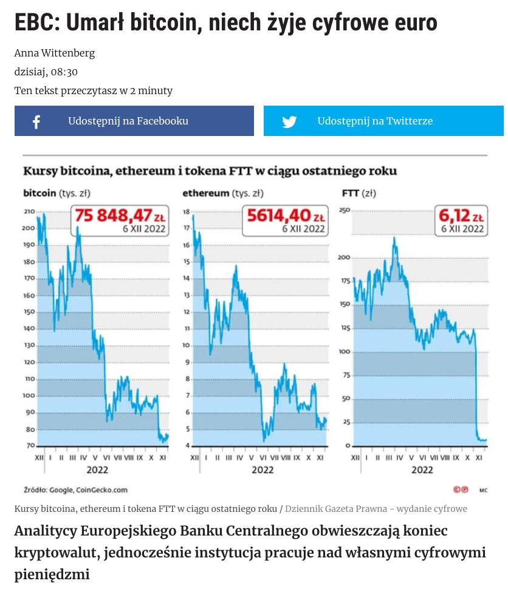

### 2022

Potomek starej arystokratycznej rodziny z Turyngii „Książę Henryk XIII”, który miał stanąć na czele Niemiec przekształconych w Rzeszę na wzór bismarckowskiej po przygotowywanym zamachu stanu, wg informacji podanych przez niemieckie służby po zatrzymaniu jego i współpracowników.

  

---

  

  

  

  

  

  

  

---

  

---

### 2021

> PAP: Holandia/Inflacja największa od 40 lat (od września 1982 roku) - poinformował we wtorek Holenderski Urząd Statystyczny (CBS).

---

Although the Senate finally voted to raise the debt limit on the night of Oct. 7 -- a mere 11 days before the US Treasury ran out of money -- this accommodation was only a short-term fix, as it only provided enough borrowing to hold the Treasury over until December. The House of Representatives followed suit.

The US House then passed a bill on Dec. 7 that set up new procedures in the Senate to raise the debt limit. Rather than needing 60 votes (as required for most legislation in the Senate), the procedure sets up an additional vote on the issue that only requires a simple majority of Senate votes -- but just this one time. Mirroring the House, the Senate enacted this fast-track process. This maneuver allows the GOP to "wash its hands" of the decision by allowing Democrats to raise the debt ceiling on their own.

---

### 2020

"EU chce przyjąć 34 miliony emigrantów, dać im mieszkanie, przywileje socjalne i obywatelstwo czyli prawo głosu. Jeśli lewica europejska da im prawa wyborcze, będzie miała ich głosy przez dziesięciolecia.
To plan Sorosa w czystej postaci."
Viktor #Orbán
Flaga Węgier
, Kossuth Radio 4.12.20

<!-- Dzień dobry Szanowni Państwo,
do niektórych z Was zwracałem się, prosiłem o pomoc, ochronę o sprawiedliwość kilka razy.  Nie przyszła...
Dzisiaj zwracam się do Wszystkich z Państwa definitywnie po raz ostatni, zostało już nie wiele dni do prezentów pod choinkę a Polacy jak żaden naród na świecie zasługują na prezent pod choinkę.
Ten krótki fragment w żółtym tle do naszej Księgowej p. Stanisławskiej, reszta już do wszystkich Państwa.
Dzień dobry Pani Aniu,
do końca roku obowiązuje nas wzajemna Umowa, więc proszę dokonać przyjęcia do użytkowania i do amortyzacji  z dniem 01.12.2020r zakupionych maszyn, urządzeń, sprzętu. 
Wszystkie zakupione maszyny, urządzenia, sprzęt znajdują się na hali pod tym adresem.
W załączniku potwierdzenie z Systemu przesłania i otrzymania przez US w Dębicy zawiadomienia w postaci NIP-8
Wszystkich łajdaków, którzy liczyli na zrobienie ze mnie przestępcy, serdecznie pozdrawiam i zapewniam o pamięci w modlitwie.
Bardzo się Wam już nie długo przyda.... Bardzo....
Pracowników , Urzędników wszelkich Instytucji Kontrolnych, Urzędów Skarbowych, którzy mieliby takową wolę , mieli wątpliwości, jakiekolwiek podejrzenia, insynuacje,  zapraszam po wcześniejszym umówieniu się ze mną do obejrzenia hali, maszyn i urządzeń.
Wszystkich poza 2 pracownikami I US w Rzeszowie - panami Łatką i Dziurzystą !!!  Ci panowie już pokazali do robią i dla kogo pracują, na czyjej smyczy chodzą.
Udostępnione dowody w postaci zdjęcia pana łatki na smyczy firmy Poltra, Nagrana moja rozmowa telefoniczna z panem Dziurzysta, nagrane,składanie moich wyjaśnień w I US w Rzeszowie, udostępniona wymiana e-maili między mną a p. Dziurzysta ,  jednoznacznie świadczą o makabrycznym,  bandyckim, przestępczym ich działaniu.
Ciekawy jestem, czy Naczelnik I US w Rzeszowie, którego narazili na olbrzymie ryzyko utraty wiarygodności, nawet ściągając na niego podejrzenia o również przestępcze działania gdyż pismo przygotowali ci dwaj panowie ale PODPIS POD NIM ZŁOŻYŁ PAN NACZELNIK...
Mam nadzieję, że Pan Naczelnik zapoznał się już z wymienionymi przeze mnie wyżej 4 niezbitymi, jednoznacznymi dowodami, nie podważalnymi   i zdał już sobie sprawę pod czym się podpisał...
Natomiast nasza udręczona rodzina, zniszczona firma,  na tym co udało nam się ocalić przed bandytami, uruchomiona znowu po moim nadludzkim wysiłkiem przez 5 miesięcy fizycznej i psychicznej pracy po 16 godzin na dobę.  
Taką pracę, olbrzymi wysiłek, wysiłek przy nie ustającym ataku na mnie , na moją umęczoną  rodzinę wykonałem po raz ostatni w życiu.
Po raz ostatni...
Jeżeli URZĘDY SKARBOWE, KTÓRE POWINNY W NORMALNYM KRAJU, BYĆ ZAINTERESOWANE UDZIELENIEM WSZELKIEJ NIEZBĘDNEJ POMOCY PRACODAWCY, CZŁOWIEKOWI, FIRMIE, KTÓRZY PRZEZ 30 LAT ZAPŁACILI MILIONY ZŁOTYCH PODATKÓW W RÓŻNEJ POSTACI DO SKARBU PAŃSTWA POLSKIEGO ,  ZAMIAST UDZIELIĆ TAKIEJ NIEZBĘDNEJ POMOCY TO UCZĘSTNICZĄ W PRZESZKADZANIU I JESZCZE DODATKOWO UCZESTNICZĄ W CAŁKOWITYM DOPEŁNIENIU DZIEŁA ZNISZCZENIA RODZINY I FIRMY,   TO JET TO GIGANTYCZNE PRZESTĘPSTWO I HAŃBA DLA WSZYSTKICH URZĘDNIKÓW PAŃSTWA POLSKIEGO I CAŁEGO PAŃSTWA POLSKIEGO !!!
Od ponad pól roku, czekamy na zwrot prawie 1 miliona złotych z tytułu zwrotu należnego nam z tytułu zwrotu VATu !!!  
Wyremontowałem starą ruderę po raz kolejny w swoim życiu, dostosowałem do wymogów, standardów obowiązujących w Europie, dostosowałem do wymogów, technicznych, technologicznych, chcę rozpocząć produkcję Systemów Precyzyjnych Systemów Mocowań jakich nie produkuje żadna firma w Polsce a Urzędy Skarbowe, zamiast pomóc to jeszcze przeszkadzają ?????  !!!!!!!!!!
Pytam się Wszystkich adresatów tego e-maila:  dokąd to bandyctwo będzie jeszcze trwało ???
Do kiedy??? 
Kiedy wreszcie w Rzeszowie , na Podkarpaciu wsadzą bandytów tam gdzie ich miejsce i zapanuje tu normalność , porządek i sprawiedliwość ???
Kiedy wreszcie republika bananowa, prywatne jak na westernie ranczo, które sobie tu utworzyli bandyci i robią co chcą, zostanie zlikwidowana !!!! ?????  Kiedy ????
Oświadczam, dziś publicznie po raz ostatni.
Jeżeli nie zostaną podjęte natychmiastowe działania, kroki do natychmiastowego zatrzymania i zlikwidowania przestępców, bandytów i nie podjęte natychmiastowe działania kończące NATRYCHMIAST NISZCZENIE MNIE, MOJEJ RODZINY I ZAMORDOWANEJ FIRMY,  TO BEDZIECIE MIELI PAŃSTWO Z MOJEJ STRONY PREZENT POD CHOINKĘ.
NAPISAŁEM JUŻ KILKAKROTNIE, NAPISZE JESZCZE RAZ.
WSZYSTKO MÓGŁBYM DAROWAĆ, MACHNĄĆ REKĄ ALE DALSZEGO ATAKOWANIA M NIE I MOJEJ RODZINY I ŁEZ, ZRYWANIA SIĘ PO NOCACH MOJEJ 12 LETNIEJ CÓRKI MAI, NIE PODARUJĘ SKURWYSYNOM !!!!!!
TO MAJĄ PEWNE, PO TYM CO ZROBILI I DALEJ NAM ROBIA,JAK W SZWAJCARSKI BANKU!!!
Zwracam się też do Naczelnika Podkarpackiego Urzędu Skarbowego:
Panie Naczelniku, zanim przyśle mi Pan następny mandat karę, po tym przesłanym 2 tysięcznym,może warto zapoznać sie z przesyłaną przeze mnie dokumentacją , dowodami w całej sprawie???
Moja rodzina nie miała przez kilka miesięcy na wiosnę środków pieniężnych na podstawowe potrzeby życiowe, zlikwidowałem Polisę ubezpieczeniową, którą opłacałem przez ponad 20 lat aby zapłacić opłaty, ZUS, podatki i mieć za co żyć...
Dociera do do Pana???  Pan kopie jeszcze leżącego, zniszczoną, sponiewieraną przez bogatych do nieprzytomności ale wciąż nie nażartych mafijnych bandytów, rodzinę ???
Ma Pan poczucie sprawiedliwości, sumienie, serce, honor ???
Odpowiednie Pismo, Zawiadomienie zostało wysłane przeze mnie dokumentem elektronicznym do Urzędu Skarbowego w Dębicy właściwego dla miejsca prowadzonej działalności i miejsca naszego zamieszkania.
Wysłany , potwierdzony dokument w załączniku.
Jeżeli obowiązujące przepisy wymagają wystosowania, wysłania dodatkowych Zawiadomień, Pism, dokumentów, to proszę to zrobić.
Ja nie jestem Księgowym więc nie posiadam potrzebnej w tym zakresie wiedzy. 
Równocześnie wnoszę zgodnie z obowiązującymi w Państwie Polskim przepisami o wniesienie treści tego e-maila, do dowodów w prowadzonych przeciwko ??? .... mnie, mojej rodzinie i naszym zmasakrowanym firmom sprawach.
Zgodnie z treścią art.180 & 1 ustawy z dnia 29 sierpnia 1997r - Ordynacja podatkowa, jako dowód należy dopuścić wszystko, co może przyczynić się do rzetelnego wyjaśnienia sprawy, a nie jest sprzeczne z prawem.
W myśl art. 187 & 1 Ordynacji podatkowej, organ podatkowy jest zobowiązany zebrać i w sposób wyczerpujący rozpatrzyć cały materiał dowodowy.
Zgodnie w w/w Ustawą - wnoszę o wniesienie jak dowody, treści tego e-maila oraz dowodów znajdujących się w Internecie pod linkiem:
https://www.dropbox.com/.../AAAL7XoHa-ycUIiYqWSagMDRa...
Tak , mafia, bandyci którzy okradli nasze 2 firmy, zniszczyli, okradli Skarb Państwa Polskiego, chodzą i się śmieją, są chronieni przez panów Teluka, Harpulę , Folcika i Spółkę z o.o,
  Spółkę Komandytową: Podkarpackie Wieprze Mafijne Sp. z o.o. Sp. Komandytowa
 a atakuje i chce żywcem zakopać człowieka który ośmielił się bronić swoich firm, swojej rodziny i do tego jeszcze zgromadził setki niezbitych dowodów i wskazał nazwiska, nazwy firm, tych niektórych z bandytów...
Jednak, jak zawsze w historii świata, wszystko ma swój początek ma i KONIEC !
I będzie już niebawem miało.
To jest już absolutnie moje ostatnie zawiadomienie, pismo, apel.
Zostało już tylko złożenie prezentu Państwu Polskiemu, Polakom, prezentu pod choinkę.
Wiesław Siwiec -->

### 2019

Olga Tokarczuk wygłosiła przemowę noblowską.

> Kryzys klimatyczny i polityczny, w którym dzisiaj próbujemy się odnaleźć i któremu pragniemy się przeciwstawić, ratując świat, nie wziął się znikąd. Często zapominamy, że nie jest to jakieś fatum i zrządzenie losu, ale rezultat bardzo konkretnych posunięć i decyzji ekonomicznych, społecznych i światopoglądowych (w tym religijnych). Chciwość, brak szacunku do natury, egoizm, brak wyobraźni, niekończące się współzawodnictwo, brak odpowiedzialności sprowadziły świat do statusu przedmiotu, który można ciąć na kawałki, używać i niszczyć.
> Świat umiera, a my nawet tego nie zauważamy. Nie zauważamy, że świat staje się zbiorem rzeczy i wydarzeń, martwą przestrzenią, w której poruszamy się samotni i zagubieni, miotani czyimiś decyzjami, zniewoleni niezrozumiałym fatum, poczuciem bycia igraszką wielkich sił historii czy przypadku
> Świat jest tkaniną, którą przędziemy codziennie na wielkich krosnach informacji, dyskusji, filmów, książek, plotek, anegdot. Dziś zasięg pracy tych krosien jest ogromny – za sprawą internetu prawie każdy może brać udział w tym procesie, odpowiedzialnie i nieodpowiedzialnie, z miłością i nienawiścią, ku dobru i ku złu, dla życia i dla śmierci.
> Zalew obrazów przemocy, głupoty, okrucieństwa, mowy nienawiści rozpaczliwie równoważone są przez wszelkie „dobre wiadomości”, ale nie są one w stanie ujarzmić dojmującego wrażenia, które trudno jest nawet zwerbalizować: Coś jest ze światem nie tak. To poczucie, zarezerwowane kiedyś tylko dla neurotycznych poetów, dziś staje się epidemią nieokreśloności, sączącym się zewsząd niepokojem.

### 2013

W Domu Pomocy Społecznej w Tursku odszedł 113-letni kapitan Józef Kowalski - ostatni żyjący uczestnik Bitwy Warszawskiej. 31 sierpnia 1920 roku Józef Kowalski stoczył w szeregach 22. Pułku Ułanów Podkarpackich bitwę pod Komarowem niedaleko Zamościa, rozbijając 1. Armię Konną dowodzoną przez Siemiona Budionnego. Józef Kowalski był również bohaterem polskiej wojny obronnej 1939; we wrześniu 1939 roku walczył w artylerii. Po rozbiciu pułku przez wojska niemieckie Józef Kowalski dostał się do niewoli niemieckiej, w której pozostał aż do zakończenia wojny. Po wyzwoleniu trudnił się pracą na roli. W 1993 roku w znacznym stopniu pogorszył się stan zdrowia Józefa Kowalskiego. Schorowany weteran przekazał grunty Skarbowi Państwa i zamieszkał w Domu Pomocy Społecznej w Tursku. W rocznicę swoich 110. urodzin został odznaczony przez prezydenta RP Krzyżem Oficerskim Orderu Odrodzenia Polski, Polonia Restituta, a dwa lata później decyzją ministra obrony narodowej Tomasza Siemoniaka otrzymał awans do stopnia kapitana Wojska Polskiego. Za liczne zasługi kapitanowi Kowalskiemu przyznano również medal ,,Pro Memoria'', oraz medal ,,Zasłużony dla Warszawy''. 26 maja 2010 uchwałą Rady Miejskiej Radzymina nadano kapitanowi Kowalskiemu tytuł honorowego obywatela tego miasta, dla przypomnienia dodam, że honorowymi obywatelami Radzymina są m.in. marszałek Edward Rydz-Śmigły, a także papież Jan Paweł II. Kapitan Józef Kowalski został pochowany z honorami wojskowymi 11 grudnia 2013 roku na cmentarzu parafialnym w Krzeszycach.

### 1992

G.Soros "pokonał" Bank of England w 1992r, jednak kilka lat później sam został pokonany, w innej części globu.

Okazją były napięcia na rynkach azjatyckich w latach 1997-1998, w szczególności szybko słabnące waluty sąsiadów Państwa-Miasta.

Miejscowy dolar (HKD) zakotwiczony był od 1983 r. na sztywno do USD na poziomie ca 7,80.

"Rynki" dostrzegły rosnący spadek atrakcyjności Hongkongu w porównaniu do Bankgkoku, czy nawet Tokio, zapachniało dewaluacją HKD, przynajmniej tak się niektórym wydawało.

Obstawiono podwójnie, była to sprzedaż pożyczonych akcji (krótka sprzedaż) za HKD oraz wymiana HKD na USD. Zyski miała zapewnić albo dewaluacja HKD, albo podwyżka stóp %, która pogrążyłaby giełdę (spadek cen akcji).

Jak na profesjonalnych spekulantów przystało, sama akcja nie ograniczała się jedynie do zajęcia odpowiednich pozycji.

Podobnie do roku 1992 "inwestorzy" robili wiele, aby założony scenariusz zmaterializował się. Sama sprzedaż HKD odbywała się w dużych, regularnie pojawiających się kwotach, tak aby mieć pewność, że zostanie to zauważone. Fundusze płaciły dziennikarzom i lokalnym wydawcom za treści sugerujące, że HKD lada moment będzie zdewaluowany, co miało przyspieszyć run na waluty.

Do gry wszedł Hong Kong’s Exchange Fund. Dysponując ok.570 mld $ zaczął kupować akcje, których rosnące ceny były stratą dla spekulantów siedzących po krótkiej stronie. Szacuje się, że na ten cel wydano ok. 20 % posiadanych $.

Czy fundusze hendgingowe nie spodziewały się tego?

Nie zakładały, że władze wolnorynkowego Hongkongu pozwolą na taką ingerencję w rynek. Stratne pozycje były więc rolowane w nadziei, że rząd się wycofa, tymczasem włożył kolejny "kij w szprychy".

Wprowadzono prawne ograniczenia krótkiej sprzedaży, czego efektem było masowe likwidowanie wcześniejszych pozycji.

Globalna krótka pozycja spekulantów wynosiła ok.30 mld $, nie jestem pewien, czy da się precyzyjnie oszacować, ile z tej kwoty udało im się uratować.

### 1954

Po prawie 10 latach działalności rozwiązane zostało Ministerstwo Bezpieczeństwa Publicznego-główne narzędzie w rękach komunistycznej dyktatury służące do walki z ruchami niepodległościowymi. MBP ponosiło odpowiedzialność za największe represje z okresu stalinizmu stosowane na Polakach. W ramach jego struktur główną rolę odgrywał powstały 1 sierpnia 1944 roku i dynamicznie rozbudowywany Departament Kontrwywiadu, na czele którego jako kierownik stanął urodzony w 1907 roku Roman Romkowski , późniejszy wiceminister bezpieczeństwa publicznego, generał Wojska Polskiego oraz członek Komitetu Centralnego Polskiej Zjednoczonej Partii Robotniczej.
Ocenia się, że ofiarami inwigilacji i działań operacyjnych MBP padło 5 200 000 obywateli polskich, którym założono akta osobowe czyli prawie 1/5 społeczeństwa.

  

### 1909

Urodził się Marian Mazur https://en.wikipedia.org/wiki/Marian_Mazur

---

<a href="https://github.com/TomaszWaszczyk/historia.waszczyk.com/edit/master/src/content/december-7.md" target="_blank">Edytuj tę stronę dzieląc się własnymi notatkami!</a>
