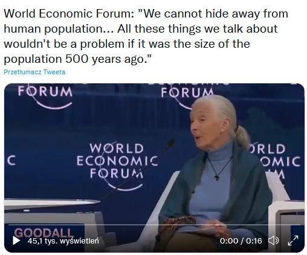
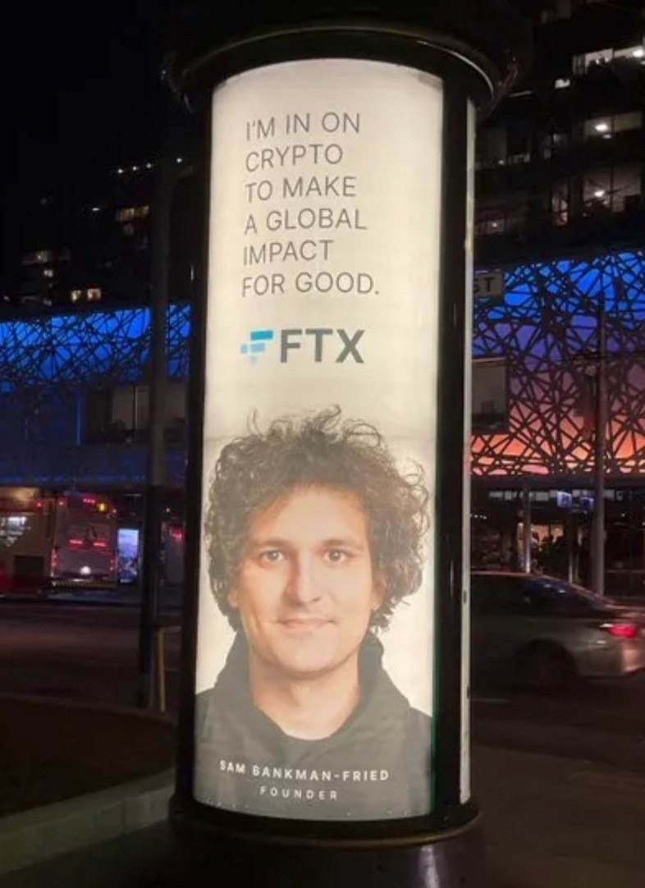
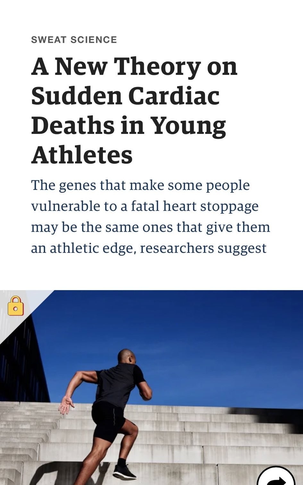
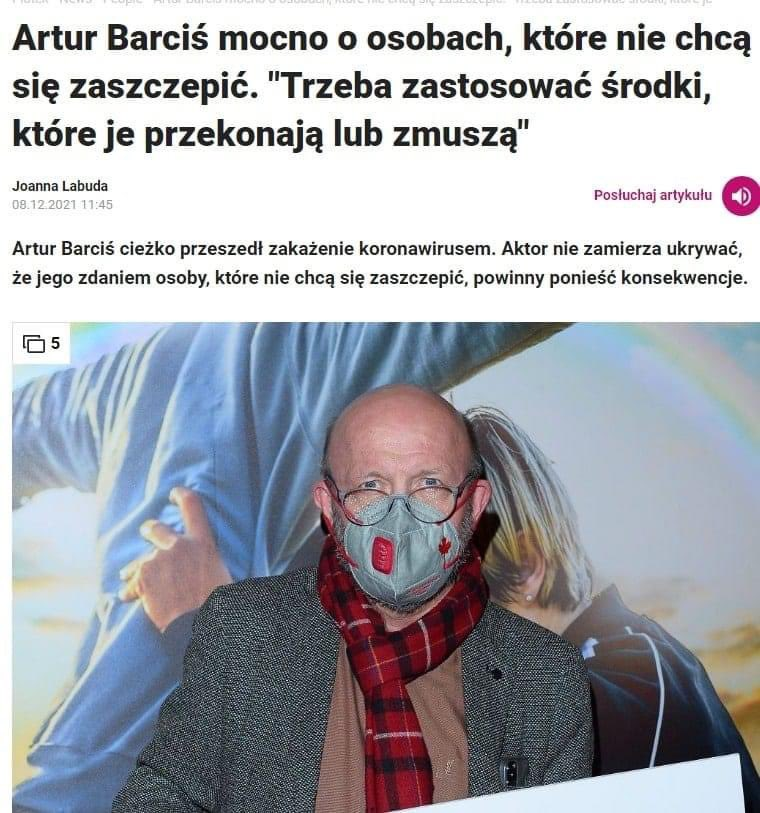
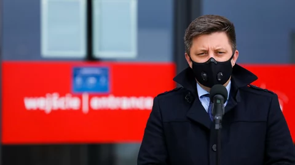
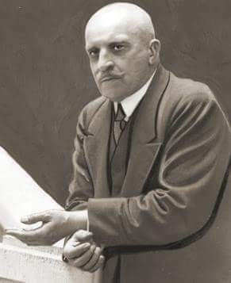
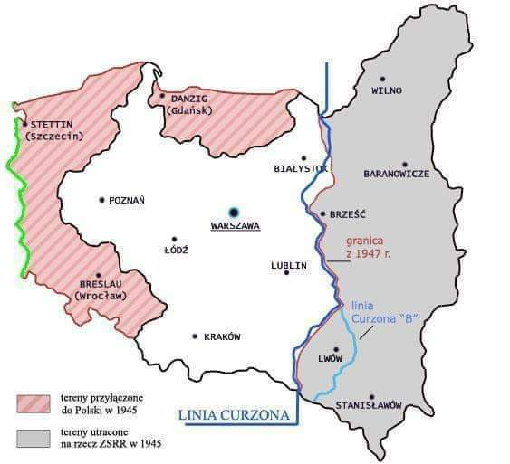

### 2022

  

### 2021

// wklejam 8 grudnia, ale Pani Jane wypowiadała się w innym dniu

Dr Jane Goodall podczas panelu na Światowym Forum Ekonomicznym: gdyby było nas mniej, to nie byłoby problemu z klimatem.

  

---

  

---

Investment in identity management hits new high

Figuring out better ways to ID and authenticate people isn’t new. While new methods are seeing slow adoption, they are also realizing large dollar investment from venture capitalists. This year has already seen $3.2 billion go into the identity management space—about 2.5x the amount of investment from last year’s $1.3 billion, which was already a record.

---

Science in 2021:

  

---

  

---

### 2020

Orlen kupuje Polska Press.

  

PKN ORLEN ogłosił przejęcie wydawnictwa Polska Press 📌😡

Oznacza to że media w Polsce stają się państwowe. Nic innego jak tajna repolonizacja bez ustawy. Poniżej szczegóły ⤵️
👎😡📌⤵️
"Konsekwentnie poszerzamy obszary naszej działalności. Na bazie Sigma Bis zbudowaliśmy od podstaw profesjonalną agencję mediową, która sukcesywnie zdobywa nowych klientów, w tym komercyjnych. Przejęliśmy spółkę Ruch, co ułatwi nam wejście na rynek nowych punktów sprzedaży i rozwój usług e-commerce. Z kolei dostęp do 17,4 milionów użytkowników portali zarządzanych przez Polska Press, skutecznie wzmocni sprzedaż całej Grupy Orlen, zoptymalizuje koszty marketingowe i umożliwi dalszą rozbudowę narzędzi big data. Podejmujemy działania, które wpisują się w nową strategię PKN Orlen do 2030 r. i będą efektywnie wspierać dynamiczny rozwój sieci detalicznej" - powiedział, cytowany w komunikacie prasowym, prezes PKN Orlen Daniel Obajtek.
W komunikacie podano, że według badania Mediapanel Polska za listopad 2020 r., serwisy internetowe Polska Press czyta 17,4 mln użytkowników miesięcznie.
Polska Press posiada 20 z 24 wydawanych w Polsce dzienników regionalnych oraz blisko 120 tygodników lokalnych. Wydawnictwo w 2019 r. osiągnęło przychody na poziomie ponad 398,4 mln zł. Portfolio grupy to także 500 witryn online, co - jak podano w komunikacie - czyni ją liderem polskiego internetu w kategorii informacje i publicystyka oraz w kategorii informacje lokalne i regionalne. Na przestrzeni ostatnich lat, liczba unikalnych użytkowników Polska Press wykazuje tendencję wzrostową, rosnąc w samym listopadzie 2020 r. 45 proc. rok do roku.
"Polska Press posiada bazę wiedzy na temat preferencji klientów, prowadzonych transakcji czy wartości koszyka w odniesieniu do grupy 60,07 proc. użytkowników internetu w całej Polsce. Dzięki temu w ramach Grupy Orlen możliwe będzie utworzenie nowych modeli biznesowych, które pozwolą na lepsze pokrycie geograficzne oraz dopasowanie oferty dla docelowej grupy klientów" - napisano.
Dodano, że przejęcie zwiększy efektywność działań reklamowych i marketingowych grupy Orlen, a także może wygenerować oszczędności w obszarze usług produkcji materiałów wideo w ramach grupy.
Zgodnie ze strategią do 2030 r. Orlen będzie rozwijał sprzedaż detaliczną poprzez rozwój nowoczesnych kanałów komunikacji, ekspansję sieci punktów odbioru paczek, digitalizację formatów sprzedaży oraz budowę platformy e-commerce w oparciu o sieć Ruch.
"W ramach działalności grupy Orlen na rynku mediów i reklamy możliwa jest również duża optymalizacja kosztów logistyki. Dla maksymalnego wykorzystania synergii rozważone zostanie stworzenie centrów logistycznych spółki Ruchu przy nowoczesnych drukarniach Polska Press" - dodano. (PAP Biznes)

---

Szef KPRM zdradził dziś, że to szczepionki Pfizera mają dotrzeć do Polski jako pierwsze. Dodatkowo, rząd przewiduje ''benefity'' dla osób, które się zaszczepią. A szczepienie będzie potwierdzane indywidualnym kodem QR.

To na razie projekt, który w najbliższych dniach ma być poddany konsultacjom - 15 grudnia Rada Ministrów zatwierdzi strategię, do tego czasu będą mogły być wprowadzane poprawki.

Szef KPRM w poniedziałek poinformował, że potwierdzenie otrzymania szczepienia będzie w dwóch formach; papierowej i cyfrowej – osoba zaszczepiona dostanie indywidualny kod QR.

Mówiąc o tym, szef KPRM wskazał, że osoby, które będą szczepione będą w sposób naturalny "bezpieczne dla otoczenia". Dodał, że jeżeli ktoś przestanie stanowić zagrożenie dla innych, to nie będzie musiał przestrzegać niektórych obostrzeń.

Podobne rozwiązanie zostało wdrożone na początku grudnia w Południowej Australii.

  

  

---

Niemiecki parlament zawiesił we wtorek wpisany do konstytucji limit zadłużenia, by zezwolić rządowi na zaciągnięcie w 2021 roku do 180 mld euro długu. Ma to chronić gospodarkę kraju przed skutkami pandemii

---

Odmrozić serca

Mój kolega, dziennikarz zadzwonił, że nie ma gdzie nocować. Ma głodowa emeryturę, kilkaset złotych, z której 500 zł. przeznaczył na wynajem wspólnie z kolegą. Kolega jednak go wystawił, kazano mu się wyprowadzić. Podzwoniłem po noclegowniach. Miejsc nie ma. Hostele przyjmują tylko „służbowo”. Ze względu na pandemię. Ze względu na pandemię straciła pracę w pralni nasza koleżanka, bo hotele już nie piorą. Kolegę jakoś na razie umieściłem. Niekoniecznie zgodnie z przepisami. Zgodnie z prawem to on mógł spędzić noc na ulicy. A akurat zaczęły się nożne przymrozki. Nasza koleżanka zamiast pracować w pralni żyje z szycia. W domu, systemem chałupniczym. Ciągle się na kogoś zrzucamy, żeby miał gdzie spać, żeby miała co jeść, szukamy dla siebie nawzajem roboty, staramy się przetrwać, ale jest coraz trudniej.
Im jest chłodniej tym częściej dzwoni telefon. Ludzie szukają schronienia. Znam osoby, które mają wolny pokój i chętnie by użyczyły go komuś potrzebującemu. Jednak mieszkania należy do miasta a miasto nie pozwala nikomu użyczać pokoju. Jeżeli ktoś zostanie na takim akcie miłosierdzia przyłapany, straci mieszkanie i sam trafi na bruk. 4,1 mln bezdomnych ludzi i 11 mln pustych domów. A w Warszawie jest kilka tysięcy pustostanów. To jest więcej niż wynosi oficjalna (zaniżona) liczba bezdomnych. Zwracaliśmy się wielokrotnie do prezydenta Rafała Trzaskowskiego, aby choć część tych mieszkań przeznaczyć na tymczasowy pobyt osób bezdomnych. Ma to jeszcze tę zaletę, że w dobie pandemii ludzie ci nie byli by stłoczeniu w jak noclegowniach, gdzie się nawzajem wciąż zarażają. Niestety ci, którzy mają gdzie mieszkać niespecjalnie się przejęli naszymi apelami. Samorządy wydają na opiekę nad bezdomnymi zwierzętami wielokrotnie więcej pieniędzy niż na pomoc osobom w kryzysie bezdomno9ści. Zwierzątka są wzruszające, ludzie jakby mniej. To oczywiście nie znaczy, że jestem przeciw zwierzakom. Nie zabrałbym im z budżetu ani złotówki. Chodzi o to by na opiekę nad ludźmi było więcej pieniędzy. I aby dla ludzi było więcej serca. Póki co w większości miast, w tym w stolicy nie ma nawet łaźni publicznej, w której osoby pozbawione dachu nad głowa mogłyby się umyć, żeby ładnie pachnieć i nie odstraszać od siebie bliźniego swego.

Piotr Ikonowicz

### 2019

Umiera Paul Volcker

> The central issue is we’re developing into a plutocracy,” he told me. “We’ve got an enormous number of enormously rich people that have convinced themselves that they’re rich because they’re smart and constructive. And they don’t like government, and they don’t like to pay taxes.

### 2017

  

### 1991

  

### 1953

W Solecznikach koło Wilna urodził się Władysław Kozakiewicz (zdjęcie) -tyczkarz , ośmiokrotny mistrz Polski, dwukrotny mistrz Europy. 30 lipca 1980 roku na olimpiadzie w Moskwie zdobył złoty medal pokonując wysokość 5.78m. Zasłynął jako wykonawca słynnego gestu w stronę nieprzychylnej mu sowieckiej widowni.

### 1943

1943 roku członkowie OUN-UPA uwięzili, a następnie zamordowali 48 letniego proboszcza parafii Jazłowiec w powiecie Buczacz (obecnie Ukraina) księdza doktora Andrzeja Kraśnickiego. Proboszcz był przetrzymywany i torturowany na własnej plebanii, z której okna strychu został wyrzucony na chodnik, a następnie utopiony w pobliskim jeziorze.

### 1940

W wyniku wycieńczenia i choroby serca zmarł w KL Dachau hrabia Edward Krasiński (zdjęcie) działacz społeczny, pamiętnikarz, zarządca Biblioteki Ordynacji Krasińskich w Warszawie.
Był synem hrabiego Józefa Krasińskiego. Przed pierwszą wojną światową pracował w Muzeum Narodowym Polskim w Rapperswilu. Zasłynął również jako posiadacz największej w Polsce kolekcji broni z epoki napoleońskiej. Działał w Stronnictwie Polityki Realnej. Dał się również poznać jako literat, wydając między innymi " Gawędy o przedwojennej Warszawie", w których udało mu się przedstawić mało znane fakty z życia kulturalnego i towarzyskiego przedwojennej stolicy.
Do KL Dachau trafił w wyniku aresztowania przez Gestapo w kwietniu 1940 roku, kiedy stanął w obronie chłopca katowanego w jedym z folwarków. Był odznaczony m.in. Krzyżem Komandorskim (1931) i Krzyżem Komandorskim z Gwiazdą (1938) Orderu Odrodzenia Polski, Krzyżem Oficerskim francuskiej Legii Honorowej. Był Kawalerem Honoru i Dewocji Zakonu Maltańskiego. Miał 70 lat.

 

### 1919

Obradująca w Paryżu Rada Ambasadorów ustaliła przebieg wschodniej granicy Polski według tzw Linii Curzona.
Linia przebiegała od Grodna przez Jałówkę , Niemirów , Brześć , Dorohusk , na wschód od Hrubieszowa, dalej na
Kryłów , skąd na zachód od Rawy Ruskiej i na wschód od Przemyśla aż do Karpat.
Co ciekawe, utożsamiany z jej powstaniem brytyjski minister spraw zagranicznych Curzon wcale nie jest jej autorem. Curzon tylko zaproponował ją w nocie z 11 lipca 1920 jako linię demarkacyjną pomiędzy wojskami polskimi i bolszewickimi.
Pomysłodawcą tego projektu był brytyjski urzędnik polsko-żydowskiego pochodzenia Lewis Namier, który był doradcą ówczesnego premiera Davida Lloyda George'a.

 

---

<a href="https://github.com/TomaszWaszczyk/historia.waszczyk.com/edit/master/src/content/december-8.md" target="_blank">Edytuj tę stronę dzieląc się własnymi notatkami!</a>
