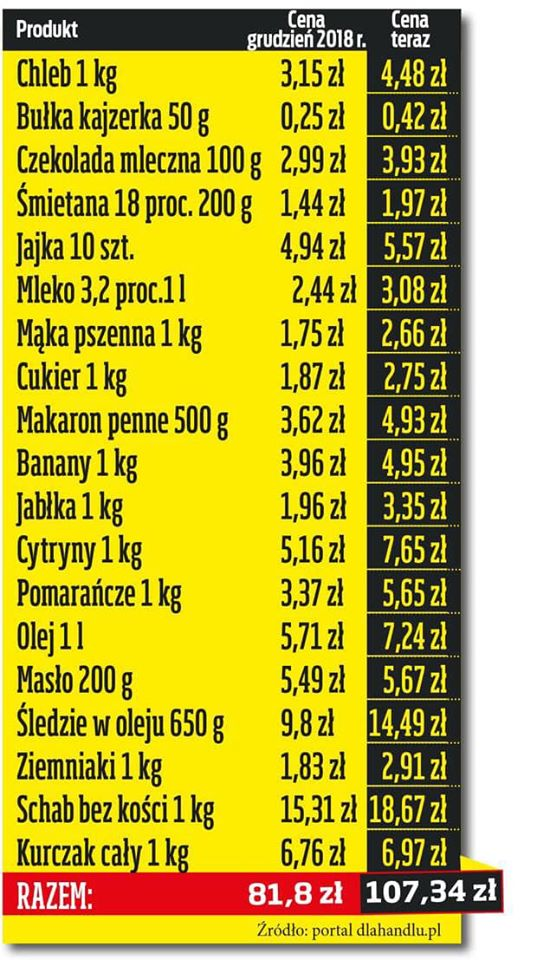
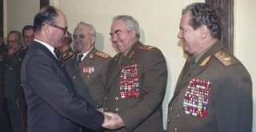
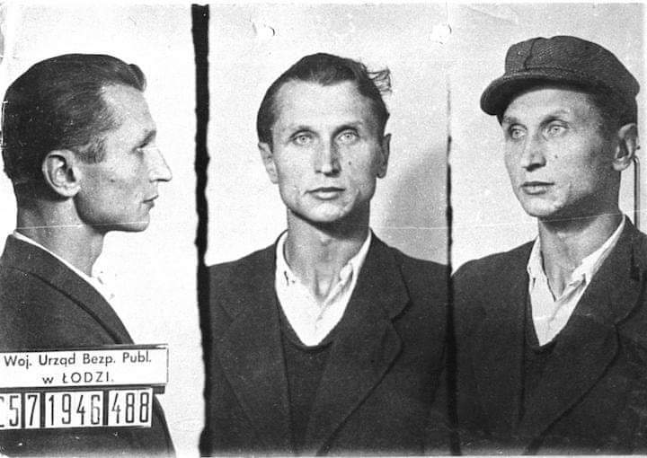
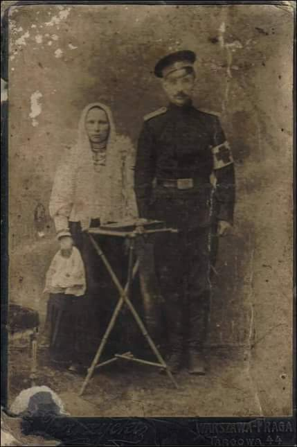
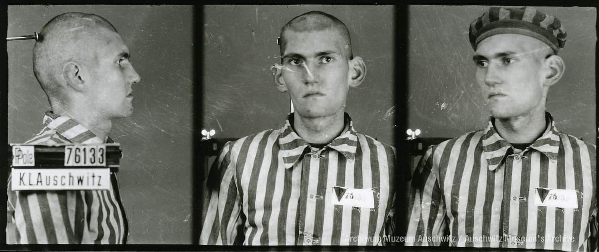
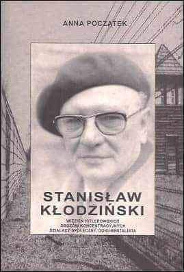
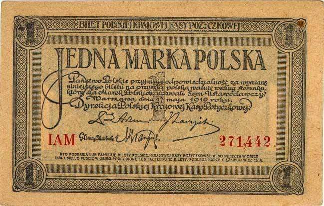

### 2019

Czyli jeśli rodzina miała 4000 zł na rękę miesięcznie i dostali 2x500+ czyli tysiąc złotych (25%) to i tak kupią mniej niż rok wcześniej. Witajcie w nowym świecie.

Na pocieszenie dodam ze torby od Michael Kors i buty od Gucci nie zdrożały wiec tego mogą więcej kupić...

 

### 1981

8 na 9 grudnia w Warszawie miało miejsce spotkanie generała Wojciecha Jaruzelskiego z radzieckim marszałkiem Wiktorem Kulikowem. Dotyczyło ono wprowadzenia w Polsce stanu wojennego. Jaruzelski poinformował o swoich zamiarach, nie podając jednak dokładnej daty ich realizacji. Dowiedzieć się tego możemy z notatki ze spotkania sporządzonej przez audiutanta Kulikowa generała Wiktora Anoszkina, która w całości została opublikowana w biuletynie IPN numer 12/107 z 2009 roku.
Zapisano w niej międzyinnymi takie słowa Jaruzelskiego:
"Strajki są dla nas najlepszym wariantem. Robotnicy pozostaną na miejscu. Będzie gorzej, jeśli wyjdą z zakładów pracy i zaczną dewastować komitety partyjne, organizować demonstracje uliczne itd. Gdyby to miało ogarnąć cały kraj, to wy (ZSRR) będziecie nam musieli pomóc. Sami nie damy sobie rady".

 

### 1980

We wsi Krzywopłoty koło Karlina w województwie zachodniopomorskim podczas prowadzonych na głębokości 2800 metrów prac wiertniczych na stanowisku Daszewo -1 doszło do erupcji ropy naftowej, która następnie zapaliła się.
Bezpośrednią przyczyną erupcji była nieszczelność prewentera - głowicy zabezpieczającej. Wybuch spowodowała iskra z silnika pompy w zetknięciu z ulatniającym się metanem.
Ciśnienie tryskającej ropy wynosiło 560 atmosfer, a łuna ognia widoczna była z odległości kilkunastu kilometrów.
W gaszeniu pożaru, oprócz polskich specjalistów udział wzięli również Węgrzy i Rosjanie.
Pożar ugaszono po 35 dniach.
Wkrótce też rozpoczęto tu wydobycie, ale z powodu małej wydajności złoża w połowie 1983 zaprzestano wydobycia ropy.

### 1946

Przed Wojskowym Sądem Rejonowym w Łodzi rozpoczął się trwający osiem dni proces kapitana Konspiracyjnego Wojska Polskiego Stanisława Sojczyńskiego (zdjęcie) i jego ośmu podkomendnych. Przewodniczącym składu sędziowskiego był pułkownik Bronisław Ochnio, zaś oskarżycielami prokuratorzy; major Czesław Łapiński i major Kazimierz Graff.
Oskarżonym postawiono zarzut prowadzenia działalności konspiracyjnej. Sojczyńskiego skazano również za wydanie rozkazu zabicia Jakuba Cukiermana- kierownika sekcji śledczej Powiatowego Urzędu Bezpieczeństwa Publicznego w Radomsku.
17 grudnia 1946 roku wszystkich skazano na kary śmierci. Wyrok na kapitanie Sojczyńskim i pięciu jego podwładnych wykonano 19 lutego 1947 roku, trzy dni przed ogłoszeniem amnestii.

 

### 1942

1942 roku w Kolonii Dąbrowa, nieopodal Łaskarzewa Niemcy za pomoc udzielaną Żydom rozstrzelali polską rodzinę Proczków - Tomasza i Jadwigę oraz trójkę ich dorosłych dzieci: Mariannę, Stanisława i Natalię. Wymienione osoby zostały rozstrzelane na podwórzu, natomiast dwaj Żydzi, którym rodzina Proczków udzielała pomocy zostali zastrzeleni przez Niemców podczas próby ucieczki: pierwszy z Żydów w okolicach gajówki, a drugi nieopodal majątku dziedzica Uścice. Z życiem uszedł najstarszy syn Proczków, Jan, który mieszkał w osobnym domu oraz najmłodsza córka Proczków, 12-letnia Aleksandra, którą w swoim domu ukryła rodzina Nowotników. Po ograbieniu zwłok i gospodarstwa Proczków Niemcy odjechali. Pochówkiem rodziców i rodzeństwa zajął się Jan. Po wojnie rodzeństwo upamiętniło pomnikiem pomordowanych członków rodziny. Pomnik wznosi się na cmentarzu parafialnym w Łaskarzewie. Na zdjęciu Tomasz Proczek podoficer armii carskiej jako sanitariusz wraz z żoną Jadwigą - zdjęcie z ok. 1910 roku.

 

---

W KL Auschwitz zamordowany został podchorąży rezerwy Wojska Polskiego Tadeusz Kifer "Kruszynka" (zdjęcie).
Był absolwentem Męskiego Gimnazjum im. Jana Zamoyskiego w Warszawie, harcerzem 2. Warszawskiej Drużyny Harcerskiej. Uczestniczył w wojnie obronnej, w czasie której odniósł cieżkie rany. Jako członek Związku Walki Zbrojnej, a następnie Armii Krajowej brał czynny udział w konspiracji antyhitlerowskiej oraz wielu akcjach współstworzonego przez siebie plutonu batalionu "Miotła". Jego siostrą była Halina Kifer "Kropelka".
Aresztowany został przez Gestapo w swoim domu w Czechowicach (obecnie Ursus), w którym zorganizował skład broni razem z matką i siostrą 1 października 1942 roku w wyniku donosu. Postawiono mu zarzut gromadzenia broni i przynależności do Armii Krajowej. W czasie brutalnego śledztwa w siedzibie Gestapo na Szucha nikogo nie wydał, biorąc całą winę na siebie. Do Auschwitz trafił 18 listopada 1942 roku.
Pośmiertnie, za działalność w AK , odznaczony został Krzyżem Walecznych.
Miał 20 lat.

 

### 1943

Członek więźniarskiej organizacji ruchu oporu w KL Auschwitz Stanisław Kłodziński wysłał gryps do Teresy Lasockiej działaczki PWOK w Krakowie. Oto fragment wspomnianego grypsu: "Złagodzenie kursu, zakres rozstrzeliwań itd. są wskutek nacisku zagranicy. Najwięksi nasi mordercy" Grabner, Boger, Woźnica, Palitzsch są pozwalniani ze swych stanowisk - pousuwani i poprzenoszeni. Robi się im dochodzenia za kradzieże lagrowe z Kanady. W nocy z 7 na 8 podpalili barak przy wydziale politycznym, a którym były zdeponowane dowody ich kradziezy. Materiał ten spalili. Zrobił to Lachmann. Chodzi im o zatuszowanie dowodów winy wobec Berlina. Opublikować. Nowy komendant lagru wprowadził całkowite odprężenie. Politische Abteilung zjechało ze swego kierowniczego stanowiska w obozie do podrzędnej roli (...).

 

### 1939

We Lwowie funkcjonariusze Ludowego Komisariatu Spraw Wewnętrznych czyli NKWD aresztowali około 2 tysięcy zarejestrowanych oficerów Wojska Polskiego. Pojmanych osadzono wkrótce w obozie w Brygidkach. Tego samego dnia na rozkaz szefa NKWD Ławrientija Berii przeprowadzony został spis ludności polskiej zamieszkujących tereny ZSRR.

### 1922

> Prasa obozu prawicowego wyraźnie podburzała, przedstawiając wybór Narutowicza jako tryumf żydostwa i nieszczęście dla Polski. Tłumy zaczęły szaleć, wygrażając każdemu, kto glosował za Narutowiczem. Niesłychanych wybryków wobec pierwszego Prezydenta odrodzonego państwa ani prasa, ani organizacje prawicowe należycie nie skarciły. Stało się to niemal zachętą do dalszych ekscesów.
Fragment wspomnień Wincentego Witosa.

Zgromadzenie Narodowej wybrało Gabriela Narutowicza na urząd pierwszego prezydenta Rzeczypospolitej. Wybór zapadł w III turze, wówczas Gabriel Narutowicz otrzymał 289 głosów, a jego kontrkandydat, popierany przez prawicę, hrabia Maurycy Zamoyski 227 głosów. O wyborze Gabriela Narutowicza na urząd prezydenta RP przesądziły głównie głosy lewicy, mniejszości narodowych oraz PSL Piast. Wybór Gabriela Narutowicza wzbudził protesty i nienawiść wśród środowisk skrajnie prawicowych i katolickich. Zarzuciły one nowemu prezydentowi ateizm, przynależność do masonerii i popieranie polityki Józefa Piłsudskiego.

### 1916

Na terenach Królestwa Polskiego okupowanych przez Cesarstwo Niemieckie do obiegu wprowadzono markę polską. Z biegiem czasu stała się ona także walutą obowiązującą także i wolnej Polsce aż do 29 kwietnia 1924 roku, kiedy to zastąpiono ją polskim złotym.

 

### 1914

Fragment wspomnień autorstwa generała dywizji Felicjana Sławoja Składkowskiego opisujący wydarzenia z czasów I wojny światowej:

,,Rano 9 grudnia (1914 roku przyp. M.S.) wyszliśmy za Limanową na pozycję, po paru godzinach wróciliśmy na te same kwatery i cały dzień spędziliśmy w mieście, jako pogotowie. Moskale bombardowali miasto i zapalili stodołę na plebanii. Sztab austriacki wskutek tego ewakuował się do Słotwiny. My zostaliśmy na noc w opuszczonym lokalu "Sokoła" i starostwa. O piątej rano, 10 grudnia, odmaszerowaliśmy do Słopnicy przez Lipowe.
Już ze wszystkich stron złaziliśmy te góry. Ludność wyniszczona, ale ciągle nam sprzyja i zaciekła na Moskali. W Stopnicy Królewskiej batalion otrzymał znów nowego komendanta. Jest nim obywatel Rylski, który przyjechał z Ameryki. Obywatel Norwid dzisiaj rano odjechał do Nowego Targu po ludzi z IV, VI i II batalionu. Dzisiejszą noc przespaliśmy w Zalesiu.
W tej chwili mamy atakować Młyńczyska. Piszę to siedząc w lesie na kłodzie drzewa z obywatelem Rylskim. Przed chwilą do Młyńczysk przejechało pół szwadronu naszej kawalerii. Za nim, jako straż przednia poszła kompania Wira. Urządziłem punkt opatrunkowy dla rannych, których na szczęście nie było. Podobno atak na Młyńczyska był tylko demonstracją.
Komendant Główny został w Kamiennej. Wróciliśmy i my do Kamiennej na godzinę 6 wieczór, mając w powrocie cudny widok Tatr o zachodzie słońca.
Rozkwaterowaliśmy się u stolarza, który nas przyjął jak najserdeczniej. Nie idziemy jeszcze spać mimo zmęczenia po całodziennym łażeniu, bo mówią, że jeszcze tego wieczoru musimy iść dalej. Byłaby wielka szkoda. Dom bardzo porządny nad rzeczką, złożony z sieni, dwóch pokoi i kuchni - warsztatu. Umeblowanie porządne, pokoje czyste, wybielone, obrazy świętych i na ścianie napis z Ameryki: "Boże, zbaw Polskę!"

Źródło: Felicjan Sławoj Składkowski "Moja służba w Brygadzie: pamiętnik polowy".

### 1683

Powracające z wyprawy wiedeńskiej połączone wojska polsko -litewskie pod dowództwem króla Jana III Sobieskiego zdobyły obleganą przez Turków twierdzę Sabinov na Słowacji. Był to jeden z ostatnich punktów tureckiego oporu w Europie.

### 1410

1410 roku w Nieszawie w województwie kujawsko-pomorskim strony-polska i krzyżacka podpisały rozejm w wojnie, której zasadniczym elementem była słynna bitwa pod Grunwaldem. Porozumienie to zostało parafowane w lutym 1411 roku i przeszło do historii jako pokój toruński.
Na zdjęciu kościół św. Jadwigi od strony Wisły.

---

<a href="https://github.com/TomaszWaszczyk/historia.waszczyk.com/edit/master/src/content/december-9.md" target="_blank">Edytuj tę stronę dzieląc się własnymi notatkami!</a>
