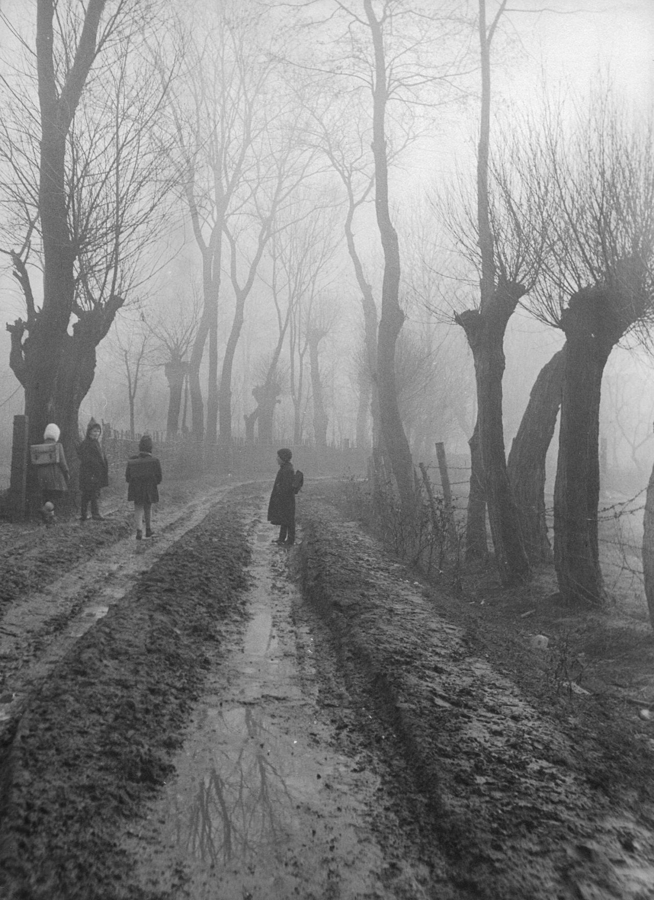
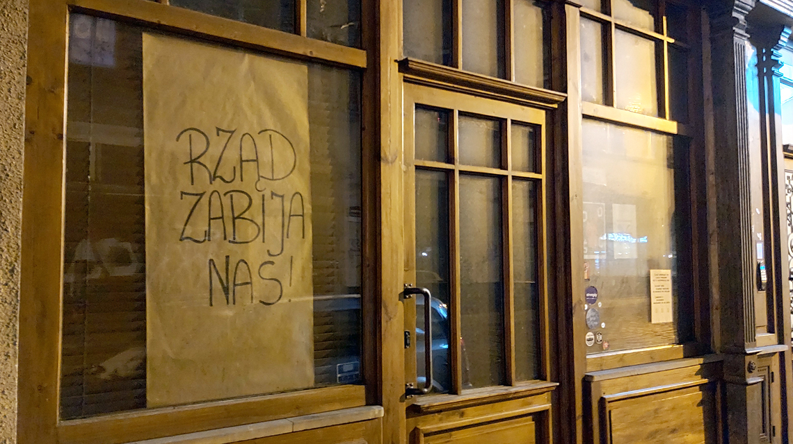
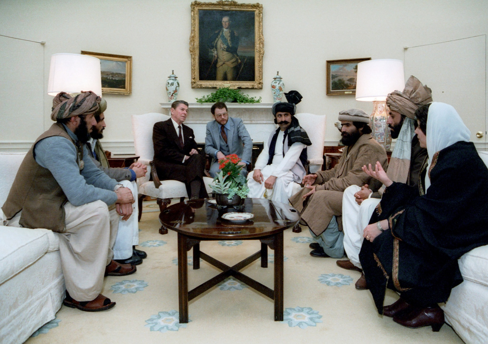
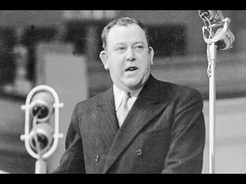
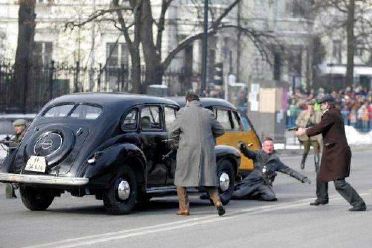
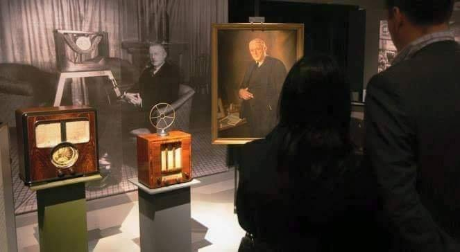
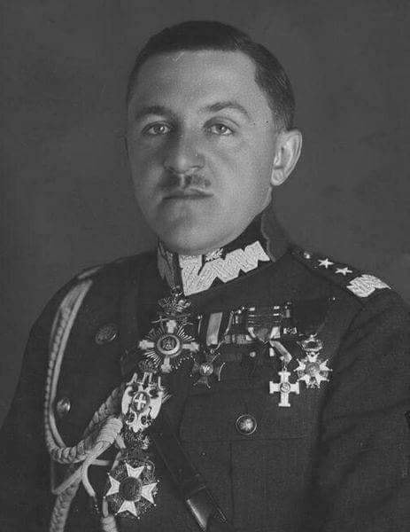
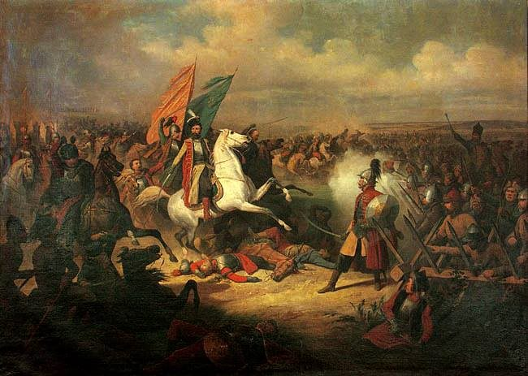

### 2024

On Monday, Nigeria de facto devalued the naira by ~30% (after another ~30% devaluation in June). And Egypt is under pressure to devalue too, with the pound ~50% weaker in the black market.

---

  

Tadeusz Chrzanowski - Do szkoły (fotografia), lata 50. XX wieku.

---

### 2023

> Powell: The only way forward is for congress to increase the debt ceiling.

Any deviations from that would be highly risky, no one should assume the Fed can protect the economy.

Fiat flood or cascading defaults. Amen.

<!-- Fed hikes by 25bp to 4.5-4.75%
US 2 yr drops 8bp to 4.127%
10 yr falls 12bp to 3.407%.
I am inclined to think the Fed's rate hiking cycle has peaked today. -->
---

### 2022

> Inflacja, brak działek i nowe przepisy będą głównymi czynnikami przyczyniającymi się do dalszego wzrostu cen mieszkań - ocenił Polski Związek Firm Deweloperskich. Związek prognozuje, że w tym roku mieszkania na rynku pierwotnym zdrożeją o 7-10 proc.

---

Największy na świecie państwowy fundusz majątkowy ostrzegł, że inwestorzy stoją w obliczu niskich zysków przez lata, ponieważ gwałtowny wzrost inflacji staje się trwałym elementem globalnej gospodarki.

„Widzimy to na całym świecie, w coraz większej liczbie miejsc. Widzieliście, jak Ikea podniosła ceny o 9 procent, widzieliście wzrost cen żywności, nadal bardzo wysokie stawki frachtowe, stawki przewozowe, metale, towary, energię, gaz. . . Widzimy też znaki na płacach”.

---

<video width="640" height="480" controls>
<source src="./movies/february/NoNordStream2oe Biden.mp4" type="video/mp4">
Your browser does not support the video tag.
</video>

---

### 2021

Zabicie gastronomii, platformizacja (uwłaszczenie się) za pomocą platform cyfrowych, efekt:

  

Przed kilkoma dniami mogliśmy się przekonać o sprawności działania bytomskiego samorządu. We wtorek w życie weszły przepisy umożliwiające zwolnienie gastronomii z koncesji, a już w czwartek Rada Miejska zebrała się w trybie nadzwyczajnym, aby przyjąć stosowną uchwałę.

Branża gastronomiczna w całej Polsce jest praktycznie zamrożona z powodu obowiązujących obostrzeń, które zabraniają serwowania jedzenia i napojów do spożycia na miejscu. Restauracje mogą jedynie wydawać posiłki na wynos lub w dowozie, lecz wielu przedsiębiorców przyznaje, że przychód z tego źródła nie wystarcza im na pokrycie bieżących kosztów. Z kolei właściciele pubów całkowicie zostali na lodzie, bo nawet, gdyby zaczęli sprzedawać piwo na wynos, to nie byliby w stanie konkurować ze zwykłymi sklepami. Poza tym wymaga to osobnej koncesji na sprzedaż alkoholu do spożycia poza miejscem zakupu, a to są kolejne koszty...

---

> “I do at this point think Bitcoin is a good thing. I am a supporter of Bitcoin. It’s on the verge of gaining broad acceptance from conventional finance people.” - Elon Musk
> “Bitcoin will likely go to 1 million, along with all your alternative currencies” - Elon Musk

  

>Nazywasz się Eugeniusz Piżmo>pracujesz w tartaku w Kanadzie>rąbanie drewna>profit>rok 1995>emigrujesz do USA>zaczynasz studia>po dwóch latach uznajesz że tam chooy z tym i robisz tylko licencjat z fizyki i ekonomii, pomimo że mogłeś nawet mieć doktora i magistra.>wpadasz na pierwszy projekt napisania aplikacji>znajdujesz jakiś przygłupów którzy piszą ją za ciebie>sprzedajesz ją za 307 milionów zielonych, i 22 miliony zgarniasz ty odlewając się na swojego brata który odwalił za ciebie większość roboty, ciepłym moczem>profit>Rok 1998>z pomocą kolejnych przygłupów zakładasz Paypala, nie robisz praktycznie nic, firma funkcjonuje za ciebie, w 2002 odsprzedajesz go za 1.5 miliarda zielonych, zgarniasz 115 milionów dolarów>kolejny profit>właściwie od 2002 żyjesz jak król>czerwiec 2002>zakładasz SpaceX, aby dodać powagi swojemu przedsiębiorstwu zatrudniasz Mariachi i grasz jak skończony debil na marakasach.>Właściwie pierwsze 7 lat istnienia twojej firmy to pompowanie w nią niezliczonych ilości hajsów którą pozyskujesz z życia na rządowy kredyt bo jakaś grupka idiotów w garniturach przestraszyła się tekturowej rakiety którą zaparkowałeś pod siedzibą NASA.>podwójny profit>w 2003 zakładasz Teslę, firma która przez pierwsze lata nawet nie istniała na poważnie>przez pięć lat budujecie jakiś gówno-prototyp który jest dosłownie Lotusem Elise>Nikt nie chce inwestować w wasz prototyp>Lotus ładuje w was hajsy bo ślepo wierzy w samochody elektryczne, tylko dlatego ta firma istnieje>W 2005 Forbes nazywa się "prawdziwym Tonym Starkiem" podczas kiedy ty całe noce zakoorwiasz na pigułach pobudzających i kawie. Pracujesz powyżej 100 godzin w tygodniu>z tego powodu twoja pierwsza żona cię rzuca.>wszystkie magazyny co chwila przyznają ci nagrody>w roku 2010 zostań ogłoszonym jedną z setki osób mających największy wpływ na świat. Po drodze dwa razy ożeniasz się i rozstajesz z całkiem spoko i bardzo inteligentną duperką, ona też cię rzuca za twoje uzależnienie od pracy>wolisz pracę od widywania się ze swoimi dziećmi>nikt nie wie że od lat żyjesz na kredyt rządu>twój jedyny sukces - SpaceX który by nie istniał bez setek ludzi których średnia IQ jest mniej więcej równa ich wzrostowi>wszystkie sukcesy SpaceXu przypisuj sobie>w ciągu 5 lat zakładasz kilkanaście startupów, które albo nie wypalają albo żyją na kolejnych kredytach>zakładając Hyperloopa nawet nie byłeś w stanie oszacować kosztów prototypu i projekt zatrzymał się na fazie tak groteskowej że to aż szkoda mówić...>coś tam z panelami słonecznymi o których #nikt, i jakieś implanty które mają przetrzymywać ludzką świadomość bo się za dużo naoglądałeś Ghost in the Shell i który też #nikogo>Na samym początku wspierałeś Sztuczną Inteligencję i założyłeś firmę OpenAI ale kiedy zobaczyłeś że ludzie tworzą coraz bardziej ludzkie roboty obsrałeś zbroje i sprzedałeś startup za grosze i dzisiaj piszczysz że "AI bad">Od założenia Tesli firma pożerała do 500 000 dolarów dziennie (stan na listopad 2017)>pracownicy Tesli narzekają na seksizm, niskie płace, przepracowanie (były przypadki że pod fabrykę Tesli przyjeżdżał ambulans) oraz na braki podstawowych artykułów do życia na zakładzie>warunki pracy w Tesli są tak chujowe że internet trąbi że nowe samochody Tesli są montowane w namiotach>twoje samochody mają największą śmiertelność przy wypadkach, ludzie giną w pożarach twoich samochodów.>twoje samochody mają tendencję do: wybuchania, samozapłonu, zwarć, błędów aktualizacji, zabijania przechodniów w trybie autopilota}>CHUJ TAM SUKCES>w 2018 obwieszczasz światu plany że do 2024 SpaceX posadzi ludzi na Marsie>jakiś podjarany japoniec kupuje wycieczkę na Księżyc w 2023>nie wie że nie poleci na Księżyc nawet w 2023 bo twój program cały czas zalicza obsuwy>zbuduj jeden tunel którym da się przejechać tylko w jedną stronę i który miał być pierwotnie zbudowany z myślą o ultranowoczesnych tramwajach Tesli, zamiast tego zaprezentuj bubla i wzbudź zażenowanie publiczności po tym jak wszyscy ogłaszają że zbudowałeś najdroższy i najbardziej bezsensowny tunel dla samochodów na świecie. Zmień nazwę swojego projektu na "po prostu tunel dla samochodów, bo to tańsze i działa">Rok 2019>Twój prototyp rakiety która ma docelowo być wielkości Saturna V jest budowana w warunkach które przypominają raczej szopę na wsi>twój budowany na powietrzu prototyp zostaje zdmuchnięty przez silniejszy podmuch wiatru>Wszyscy chcą być gangsterami na Marsie dopóki nie zjawia się wiatr XD>Taki poważny twój program kosmiczny>W tym samym roku twoja kapsuła która miała od-uzależnić USA od Rosyjskich Sojuzów, wybucha>program zalicza kolejne obsuwy a ty liczysz szekle>w wieku prawie 50 lat z powodu kryzysu wieku średniego na profilowym ustawiasz sobie na twitterze postacie z amino, spasłeś się jak świnia, wyglądasz jak ulaniec, wystrzeliwujesz samochód w kosmos w celach reklamy twojej upadającej firmy i spotykasz się z alternatywką która niszczy twoją karierę.>wciąż od lat nie sypiasz normalnie i lecisz na pigsach>prawdziwy kurwa Tony Stark>[tak kurwa to jest Elon w 2019]

---

### 2011

𝗣𝗮𝘂𝗹 𝗕𝗮𝗿𝗮𝗻 (1926 - 2011)- amerykański informatyk polskiego pochodzenia, 𝘁𝘄𝗼́𝗿𝗰𝗮 𝗶𝗻𝘁𝗲𝗿𝗻𝗲𝘁𝘂.
 
Można powiedzieć, że historia internetu zaczęła się w Grodnie na Podlasiu, gdzie przyszedł na świat wynalazca Paul Baran. Jako dziecko wyemigrował z rodzicami do USA.
 
Tam też dorastał i wykształcił się. W 1959 roku odebrał dyplom magistara inżynierii na 𝗨𝗖𝗟𝗔, po czym rozpoczął pracę w 𝗥𝗔𝗡𝗗 𝗖𝗼𝗿𝗽𝗼𝗿𝗮𝘁𝗶𝗼𝗻, gdzie stworzył swoje największe dzieło: 𝗽𝗮𝗰𝗸𝗲𝘁-𝘀𝘄𝗶𝘁𝗰𝗵𝗶𝗻𝗴, czyli pakowanie danych w mniejsze bloki, i w ten sposób spakowanych przesyłanie ich za pośrednictwem linii telefonicznych do innych komputerów.
 
Na zlecenie Amerykańskich Sił Zbrojnych firma, w której pracował realizowała projekt wytrzymałych, rozproszonych sieci cyfrowych transmisji danych 𝗔𝗥𝗣𝗔𝗡𝗘𝗧, zdolnych przetrwać przewidywaną wówczas III wojnę światową i atak nuklearny. W 1962 roku Paul Baran opublikował 12-tomową pracę, będącą w istocie projektem owej sieci. W 1968 roku, jako konsultant Centrum ARPANET w Departamencie Obrony USA spowodował podzielenie sieci ARPANET na 𝘄𝗼𝗷𝘀𝗸𝗼𝘄𝘆 𝗠𝗶𝗹𝗻𝗲𝘁 i 𝗰𝘄𝗶𝗹𝗻𝘆 𝗜𝗻𝘁𝗲𝗿𝗻𝗲𝘁.
 
Paul Baran już ponad pół wieku temu ostrzegał przed wyciekami baz danych i cybernetycznymi zagrożeniami dla demokracji i wolności jednostek. Mówił o wideokonferencjach, zakupach przez ekran komputera oraz nieograniczonym i swobodnym dostępie do informacji. 
 
Posiadał ponad 𝟰𝟬 𝗽𝗮𝘁𝗲𝗻𝘁𝗼́𝘄, wydał prawie 𝟭𝟱𝟬 𝗽𝘂𝗯𝗹𝗶𝗸𝗮𝗰𝗷𝗶, otrzymał wiele nagród, w tym amerykański  𝗡𝗮𝘁𝗶𝗼𝗻𝗮𝗹 𝗠𝗲𝗱𝗮𝗹 𝗼𝗳 𝗧𝗲𝗰𝗵𝗻𝗼𝗹𝗼𝗴𝘆. Dziś pozostaje cichym bohaterem rewolucji technologicznej, z której na co dzień wszyscy korzystamy.

### 2005

Do internetu trafiła tzw. lista Wildsteina, czyli spis nazwisk i sygnatur z katalogu osobowego Instytutu Pamięci Narodowej. Zbiór zawiera około 240 tysięcy imion i nazwisk osób, które były źródłami informacji służb bezpieczeństwa PRL – zarówno świadomych agentów, jak i osób niezwerbowanych.

- Nie upubliczniłem tego katalogu, tylko wyniosłem go z IPN. Znajdowały się w nim nazwiska agentów i funkcjonariuszy SB, ale także pewna, bardzo niewielka grupka osób, które chciano zwerbować, ale ostatecznie ich nie zwerbowano – mówił Bronisław Wildstein, publicysta i pisarz w rozmowie z Portalem PolskieRadio24.pl. – Chciałem przekazać go dziennikarzom po to, żeby zaczęli się tym interesować, bo to był fascynujący materiał do poznania historii PRL i III RP, a po drugie dlatego, że wtedy usiłowano zablokować dostęp do archiwów.

### 2003

https://pl.wikipedia.org/wiki/Traktat_nicejski

### 1983

Biały Dom, spotkanie Ronalda Reagana z przedstawicielami „afgańskich wojowników wolności”, w celu omówienia sowieckich zbrodni wojennych w trakcie interwencji w tym kraju. Dla prezydenta USA mudżahedini są cennymi sojusznikami w „wojnie zastępczej” ze Związkiem Radzieckim, ich własne islamskie plany po przejęciu władzy są mniej istotne. Amerykanie w dozbrajanie muzułmańskich partyzantów zainwestują setki milionów dolarów, a w celu zniwelowania sowieckiej  przewagi w powietrzu przekażą im nawet przenośne pociski Stinger. Bazą do działań bojowników jest sąsiedni Pakistan – wszystko za cenę „planu pomocy” wartego ponad trzy miliardy dolarów i wycofania sprzeciwu Waszyngtonu wobec programu atomowego Islamabadu. Kilkanaście lat później, już po ostatecznej klęsce Moskwy i dekompozycji stronnictw mudżahedińskich, władzę w Kabulu przejmą wspierani przez Pakistan talibowie, ogłaszając powstanie islamskiego emiratu. Tych Wuj Sam zdecyduje się pozbawić władzy w 2001 roku, po atakach na World Trade Center. Amerykańskie złudzenia, że górzysty Afganistan można zdobyć i trwale utrzymać, potrwają dłużej niż sowieckie – całe dwadzieścia lat. Zdjęcie: Michael Evans, Ronald Reagan Presidential Library, U.S. National Archives and Records Administration/domena publiczna.

  

### 1946

Norweg Trygve Lie został wybrany pierwszym sekretarzem generalnym ONZ.

Norweg Trygve Lie został pierwszym w dziejach sekretarzem generalnym Organizacji Narodów Zjednoczonych. Zastąpił Brytyjczyka Gladwyna Jebba pełniącego dotąd obowiązki sekretarza. Podczas II wojny światowej Lie kierował dyplomacją rządu norweskiego na uchodźstwie. Jako szef ONZ przyczynił się m.in. do udzielenia pomocy militarnej przez siły ONZ Republice Korei (Południowej) w wojnie z komunistycznymi wojskami Północy wspieranymi przez Chiny. Moskwa zamierzała zawetować jego reelekcję w Radzie Bezpieczeństwa, ale kadencja Lie została automatycznie przedłużona przez Walne Zgromadzenie i odtąd Stalin nie uznawał go za szefa ONZ. Lie zrezygnował z funkcji w 1952 r. po oskarżeniach amerykańskiego senatora Josepha McCarthy’ego, że zatrudniał w ONZ komunistów i wrogów USA.

 

### 1944

W Warszawie żołnierze oddziału specjalnego Kedywu Komendy Głównej AK dokonali udanego zamachu na Franza Kutscherę, szefa SS i policji Dystryktu Warszawskiego.

O godz. 9.07 żołnierze Armii Krajowej zastrzelili w Alejach Ujazdowskich warszawskiego dowódcę SS i policji SS-Brigadeführera (generała majora) Franza Kutscherę. Akcję przeprowadził oddział „Pegaz” Kierownictwa Dywersji (Kedywu), którym dowodził Bronisław Pietraszewicz ps. „Lot”. W zamachu uczestniczyło wraz z łączniczkami 12 akowców. Czterech zginęło: Pietraszewicz oraz Marian Senger ps. „Cichy” zmarli w szpitalu w wyniku odniesionych ran, Kazimierz Sott ps. „Sokół” i Zbigniew Gęsicki „Juno” zostali osaczeni przez Niemców na moście Kierbedzia. Dzień po zamachu w Alejach Niemcy rozstrzelali sto osób. Jednak potem, aż do wybuchu powstania warszawskiego, zaniechali tej formy terroru.

 

### 1943

https://en.wikipedia.org/wiki/Venona_project

### 1925

Stacja doświadczalna Polskiego Towarzystwa Radiotechnicznego mieszcząca się w Warszawie przy ulicy Narbutta nadała pierwszą oficjalną audycję radiową. Audycji tej można było wysłuchać na produkowanych wtedy przez warszwską firmę Radjopol odbiornikach radiowych.
1 lutego 1925 roku uznaje się za oficjalne narodziny polskiej radiofonii.
Na zdjęciu stare modele odbiorników radiowych na wystawie w Zamku Królewskim w Warszawie.

 

### 1889

W Borze koło Ostrowca Świętokrzyskiego urodził się Tadeusz Piskor (zdjęcie)-generał Wojska Polskiego, dowódca Armii "Lublin".
20 września 1939 roku trafił do niemieckiej niewoli. Osadzony został w obozie VII A Murnau, a następnie kolejno w oflagach VIII B Silberberg, IV C Colditz , X C Lübeck i VI B Dössel (był komendantem tajnej organizacji wojskowej, wchodzącej w struktury AK.
Wolność odzyskał 30 kwietnia 1945 roku. Wyjechał do Londynu, gdzie do śmierci w 1951 roku działał w Komisji Historycznej Sztabu Głównego.

 

### 1888

https://pl.wikipedia.org/wiki/Franciszek_Kleeberg

### 1717

https://pl.wikipedia.org/wiki/Sejm_niemy

W Warszawie rozpoczęły się obrady tzw "Sejmu Niemego" czyli obrady szlachty w czasie których nie dopuszczono do głosu żadnego z posłów. Wynikało to z obawy króla Augusta II Mocnego przed zerwaniem przez szlachtę jego obrad.
Głównym postanowieniem tego sejmu było ograniczenie liczebności wojsk Rzeczpospolitej do 24 tysięcy żołnierzy, rozwiązanie formacji rajtarów, ograniczenie władzy hetmanów i zakaz opuszczania terytorium Rzeczpospolitej przez króla Augusta II Mocnego.

### 1655

IV wojna polsko-rosyjska: zwycięstwem wojsk polsko-tatarskich nad rosyjsko-kozackimi zakończyła się bitwa pod Ochmatowem.

Wioska Ochmatów znajduje się dziś w obwodzie czerkaskim (rejon żaszkowski), na północ od Humania. W XVII wieku ta miejscowość była bardzo znana. Nie przypadkiem znalazła się na jednej z najstarszych map Ukrainy, ułożonej przez znanego francuskiego kartografa markiza Guillaume le Vasseur de Beauplana. W 1644 roku hetman wielki koronny Stanisław Koniecpolski oraz Jeremi Wiśniowiecki pobili tutaj wojsko tatarskie Tuhaj-beja. Tatarzy stracili wtedy ponad 4 tys. żołnierzy. Tuhaj-bej cztery lata później wsparł Bohdana Chmielnickiego i kozaków. Zginął czy to pod Zamościem, czy to pod Beresteczkiem. Swojej sławie zawdzięcza Henrykowi Sienkiewiczowi, bowiem pojawił się dzięki niemu w Ogniem i Mieczem, zarówno w opowieści, jak i w filmie.

Sienkiewicz zakończył swoje arcydzieło takimi słowami: „Wojny domowe ciągnęły się jeszcze długo. Przyszła potem zaraza i Szwedzi. Tatarzy stale prawie gościli na Ukrainie zagarniając tłumy ludu w niewolę. Opustoszała Rzeczpospolita, opustoszała Ukraina. Wilcy wyli na zgliszczach dawnych miast i kwitnące niegdyś kraje były jakby wielki grobowiec. Nienawiść wrosła w serca i zatruła krew pobratymczą”. Pustka była straszna w kraju. Nie wiadomo z jakiego powodu autor nie wspomina moskali, którzy po 1654 roku zaczęli grać ważną rolę na przestrzeni między Kijowem a Warszawą.

W maju 1654 roku wojska moskiewskie, wsparte przez oddziały kozackie spustoszyły całkowicie Litwę. Jeden za drugim padły Połock, Mścisław, Witebsk i Mohylew, a zatem Wilno i Smoleńsk. Wymęczone długom pochodem wojska carstwa moskiewskiego zatrzymały ofensywę dopiero pod koniec października. W Warszawie tą sytuację wykorzystano dla naniesienia kontruderzenia.

Na początku grudnia 1654 roku wojska Rzeczypospolitej pod dowództwem wielkiego hetmana Stanisława Rewery Potockiego i polnego hetmana Stanisława Lanckorońskiego wyruszyły na wschód. Wśród znanych żołnierzy w pochodzie wzięli udział oboźny wielki koronny Stefan Czarniecki, wojewoda czernichowski Krzysztof Tyszkiewicz, wojewoda bracławski Piotr Potocki i starosta jaworowski Jan Sobieski. 6 stycznia 1655 roku do wojsk koronnych dołączyli Tatarzy na czele z Mengli Gerejem i murzą Kammechmetą.

Mengli Gerej kilkakrotnie zwracał się do Chmielnickiego o zawarcia sojuszu i wspólnej wyprawie na Moskwę. Przyczyną było to, że po „zbrataniu się” z Kozakami, car moskiewski przestał płacić daninę chanom krymskim. Chmielnicki odmówił i wtedy doszło do porozumienia Tatarów z Warszawą.

Obydwie armie spotkały się pod Ochmatowem 29 stycznia. Dokładna liczba wojsk jest niezniana. Rosyjskojęzyczna wersja wikipedii przedstawia niemal 90 tys. z każdej strony. Prawdopodobną wydaje się liczba następująca: 20 tys. wojsk koronnych i 15 tys. tatarskich przeciwko 30 tys. wojsk kozackich wspartych 10 tys. oddziałem moskali na czele z Wasylem Szeremietewym i Andriejem Buturlinym.

Do walki doszło w nocy tego samego dnia. Mróz sięgał podobno 30 stopni. Oddział pod dowództwem Stefana Czarneckiego przebił się do moskiewskiego obozu i urządził rzeź. Wystraszone moskale rzucali broń i chorągwie i uciekali jak mogli. Dopiero Kozacy pomogli złagodzić sytuację. Prawie wszystkie źródła podają, że w tym dniu na polu walki zginęło ponad 9 tys. wojsk moskiewskich.

Kozacy zdążyli wokół swojej pozycji urządzić barykady z wozów, i bardzo zacięcie się bronili. Walki trwały przez kolejne dwa dni. Pierwszego lutego Tatarzy odmówili dalszego udziału w bitwie. Przyczyny nie są do końca znane. Jedni mówią, że zostali przekupieni przez Chmielnickiego, inni – że wyczerpał się prowiant jak dla ludzi, tak i dla koni. Niechętni do dalszej walki byli także Kozacy. Każda ze stron na polu zostawiła ponad 15 tys. żołnierzy.

Zdzisław Zamoyski, uczestnik bitwy, tak później napisał: Jednych postrzelano, drudzy wymarli, trzeci wymarzli, a czwarci pouciekali. Ledwiebyśmy wyrachowali dwanaście set piechoty do bitwy. Officyerów też nie mało zginęło i naszych Rotmistrzów i Poruczników, i Towarzystwa, ale przy takiej igraszce tak być musi.

Stanisław Potocki ze swoimi oddziałami odstąpił w kierunku Lwowa, zaś na Bracławszczyźnie pozostało około 10 tys. żołnierzy pod dowództwem Stanisława Lanckorońskiego.

Kontynuacją walki z pod Ochmatowa były potyczki wymęczonych stron i grabież ludności. Miejscowi nazwali pole na którym odbyła się bitwa – „dreżypolem”, ponieważ tak mocno drżała ziemia w podczas walki walki.

 

### 1411

Zawarto I pokój toruński kończący tzw. wielką wojnę pomiędzy Polską a zakonem krzyżackim.

1 lutego 1411 roku zawarto pokój kończący wielką wojnę polsko-krzyżacką (1409-1411). W przeciwieństwie do najważniejszego grunwaldzkiego starcia tej wojny układ zwanym pierwszym toruńskim przez stulecia uznawano za kompromitującą porażkę. Czy słusznie?

To Krzyżacy poprosili o rozpoczęcie negocjacji. W pierwszej kolejności ustalono warunki zawieszenia broni; działania wojenne miały zostać wstrzymane od 14 grudnia 1410 do 11 stycznia 1411 roku. Później zawieszenie broni przedłużano jeszcze dwukrotnie, 22 i 26 stycznia.

W rokowaniach nie brali udziału władcy: król Władysław Jagiełło rezydował w nieodległej Nieszawie, a wielki mistrz Henryk von Plauen na drugim brzegu Wisły - w Nowym Toruniu. Negocjacje prowadzono w opanowanym przez Polaków Starym Toruniu, najprawdopodobniej w gmachu ratusza. Zakon reprezentowali: arcybiskup ryski Jan von Wallenrode, biskup würzburski Jan von Egloffstein, mistrz krajowy niemiecki Konrad von Egloffstein oraz mistrz krajowy inflancki Konrad von Vietinghoff. Stronę polsko-litewską reprezentowała siedmioosobowa delegacja z wielkim księciem litewskim Witoldem na czele.

Brak źródeł nie pozwala na odtworzenie przebiegu rokowań. W każdym razie trwały zaledwie trzy dni, dokumenty traktatowe noszą datę 1 lutego 1411 roku. Świadczy to, że obie strony dążyły do jak najszybszego zakończenia działań wojennych i były gotowe do daleko idącego kompromisu.

Uzgodniono, że Żmudź, ziemia, o którą zaczęła się wielka wojna, zostanie przyznana Wielkiemu Księstwu Litewskiemu w dożywocie (do końca życia) Jagiełły i Witolda. Po ich śmierci miała wrócić do zakonu. Natomiast ziemia dobrzyńska wracała do Korony wieczyście. Inne spory terytorialne, przede wszystkim polskie pretensje do Pomorza Gdańskiego i ziemi chełmińskiej, mieli zbadać i rozstrzygnąć zaaprobowani przez obie strony arbitrzy. Zakon zobowiązał się również wypłacić jako odszkodowanie za zwolnionych jeńców oraz za zwrócone zamki 100 tys. kop groszy czeskich. Ponadto traktat zawierał też wiele ustaleń szczegółowych dotyczących m.in. wymiany jeńców, pokojowego rozwiązywania sporów w przyszłości oraz wolności handlu.

10 maja 1411 roku nad rzeką Drwęcą koło Złotoryi król Władysław i wielki książę Witold spotkali się z wielkim mistrzem i wymienili dokumenty traktatowe. Dodatkowo warunki pokoju potwierdzono uściskiem dłoni. Zgodnie z obowiązującym protokołem dyplomatycznym wymienili też dary – mistrz sprezentował królowi 12 pozłacanych srebrnych kubków, a w zamian otrzymał kilka szub (rodzaj płaszcza) podszytych sobolowymi skórkami. Wielka wojna dobiegła końca.

Długoszowa jeremiada:

Największym krytykiem pokoju toruńskiego był Jan Długosz. Piszący swą kronikę kilkadziesiąt lat po wojnie kanonik krakowski nie szczędzi gorzkich słów. Już tytuł rozdziału opisującego negocjacje mówi wszystko: Król Władysław za radą wielkiego księcia Litwy Aleksandra [chrześcijańskie imię wielkiego księcia Witolda – przyp. R.J.] zawiera haniebną, szkodliwą dla Polaków wieczystą ugodę z Prusakami. Dalej pisze, że żaden z dyplomatów nie zadbał o interes państwa polskiego: jedynie wspomniane Królestwo bolało, że zostaje pozbawione należących do niego tytułem prawa naturalnego ziem, których sposobność odzyskania nadarzała się w czasie oblężenia Malborka. Król zaś polski nie troszczył się zupełnie o odzyskanie ziem swojego Królestwa Polskiego, a mianowicie Pomorza, ziemi chełmińskiej i michałowskiej, [...] uznawszy [...] za rzecz wystarczającą, jeżeli Wielkie Księstwo Litewskie uzyska scalenie, nawet kosztem, nawet z okrojeniem Królestwa Polskiego, o które przede wszystkim winien mieć staranie. [...] A zatem wskutek niemających żadnych rozsądnych podstaw decyzji zarówno króla, jak księcia [Witolda] i doradców, owo wspaniałe i godne pamięci zwycięstwo pod Grunwaldem nie przyniosło Królestwu Polskiemu żadnej korzyści, obracając się wniwecz i stając przedmiotem drwin, było natomiast wielce pożyteczne dla Księstwa Litewskiego.

Ta niezwykle surowa i przepełnione emocjami opinia przez następne stulecia determinowała stosunek historiografii do warunków toruńskich. Zdanie Długosza powtarzano i powielano (czasami lekko je niuansując lub inaczej rozkładając akcenty) w kolejnych pracach naukowych, beletrystyce i szkolnych podręcznikach. Najczęściej zestawiano (podobnie jak to uczynił średniowieczny kronikarz) wspaniałe zwycięstwo na polach pod Grunwaldem z przegranym pokojem (Karol Górski). Długo historycy nazywali ustalenia z 1411 roku niegodnymi, haniebnymi i kapitulanckimi.

Z czasem w pracach naukowych zaczął się pojawiać inny, bardziej wyważony ton, zrywający z tradycją Długoszowej jeremiady. Przede wszystkim zaczęto podkreślać, że między bitwą grunwaldzką a rokowaniami pokojowymi minęło ponad sześć miesięcy, podczas których doszło do doniosłych wydarzeń. Zapominając o nich trudno zrozumieć, dlaczego państwo polsko-litewskie zaakceptowało takie a nie inne warunki pokoju.

Krajobraz po bitwie:

Można nie bez słuszności zapytać, dlaczego zwycięzcy nie podyktowali warunków pokoju wprost na pobojowisku lub niedługo po bitwie. Odpowiedź jest prosta – nie było z kim negocjować. Paradoksalnie Władysław Jagiełło padł ofiarą własnego triumfu. Grunwald był dla elit zakonnych prawdziwą hekatombą. Wśród tysięcy zabitych znalazła się praktycznie cała starszyzna zakonu, z wielkim mistrzem Ulrykiem von Jungingenem, wielkim komturem Kuno von Lichtensteinem, wielkim marszałkiem Fryderykiem von Wallenrodem i wieloma innymi dostojnikami krzyżackimi. Zakon został dosłownie zdekapitowany i potrzebował czasu na przywrócenie przewidzianych w regule władz. Wojna trwała więc jeszcze pół roku.

Przedłużająca się kampania sprawiła, że niewiele zostało z entuzjazmu spod Grunwaldu. Zbliżał się czas żniw i jesiennych prac polowych. Szlachta z pospolitego ruszenia bardziej niż o wojaczce myślała o omłotach, orkach i zasiewach. O ile szeregowi rycerze raczej wstrzymywali się z otwartą krytyką władcy głównodowodzącego, o tyle dostojnicy na radach wojennych mogli sobie pozwolić na wyrażenie własnego zdania. Jagiełło musiał się z nimi liczyć.

Przeciąganie wojny groziło także buntem nieopłacanych najemników, a w królewskim skarbcu widać już było dno. Tych problemów nie miał kierujący zakonem Henryk von Plauen – do Prus zaczęły ściągać posiłki z Inflant oraz oddziały zaciężne.

Wiadomość o spektakularnym zwycięstwie na polach grunwaldzkich głośnym echem odbiła się w całej chrześcijańskiej Europie. Triumf nad wydawałoby się niepokonanym zakonem rycerskim zachwiał układem sił w naszej części kontynentu. Przede wszystkim wzmocnił pozycję Polski i Litwy oraz osobistą króla Władysława. Ewentualny upadek zakonu lub jego trwała marginalizacja to całkowita przebudowa mapy politycznej nie tylko nad Bałtykiem, ale również na całym obszarze Europy Środkowej. Pojawiłoby się całkiem naturalne pytanie, w która stronę skieruje swoją energię potężne państwo polsko-litewskie, wzmocnione bogatymi prowincjami odebranymi zakonowi, a pozbawione kagańca w postaci zagrożenia z jego strony. Na wschód, przeciwko rosnącemu w siłę Wielkiemu Księstwu Moskiewskiemu? Na południe, by umocnić kontrolę nad księstwami naddunajskimi Mołdawią i Siedmiogrodem, co oznaczało wojnę z Węgrami? A może zechciałoby odzyskać Śląsk?

Nic dziwnego, że szybko uaktywniła się koalicja antypolska. Dotychczasowi sojusznicy zakonu, król węgierski Zygmunt Luksemburski i jego brat Wacław IV czeski, zaczęli przeć do zakończenia wojny, a jednocześnie gotowali się do interwencyjnego uderzenia na Polskę. Groźba wojny na dwa fronty była całkiem realna, a na domiar złego sytuacja na północny zaczęła się komplikować.

Twierdza Malbork:

Współcześni badacze podkreślają, że podstawowym warunkiem ostatecznego pokonania zakonu było zdobycie stolicy jego państwa, Malborka. Zdawali sobie z tego sprawę zarówno król Władysław, jak i komtur świecki Henryk von Plauen, który po Grunwaldzie przejął władzę nad zakonem jako namiestnik. Gdy wojska Jagiełły stanęły pod Malborkiem, jedna z najpotężniejszych twierdz ówczesnej Europy była przygotowana do obrony. Inna sprawa, że armia polsko-litewska nie była gotowa do wzięcia zamku szturmem czy wymuszenia kapitulacji długotrwałym oblężeniem i głodem. Zresztą chyba nikt w ówczesnej Europie nie był w stanie sforsować potężnych murów Malborka. Obozującym w cieniu stolicy zakonu grunwaldzkie zwycięstwo musiało się zdawać czymś bardzo odległym.

Po kilku nieudanych szturmach król zarządził odwrót spod twierdzy. Stracił tak ważną na wojnie inicjatywę. Od początku zmagań to sojusznicy narzucali zakonowi warunki gry, zmuszając go do reakcji na swoje działania. Teraz stroną ofensywną stali się Krzyżacy. Oczywiście nie było mowy, aby von Plauen zdecydował się na kolejną walną bitwę. Wielki mistrz przyjął taktykę może mało efektowną, ale efektywną – zaczął odbijać poszczególne miasta i zamki zajęte w Prusach w pierwszej fazie wojny. Czasami (jak w Tucholi, Toruniu czy Radzyniu) opór polskiego garnizonu był twardy, jednak częściej załoga oddawała swój posterunek po wezwaniu do poddania i za obietnicę bezpiecznego powrotu do domu. Represje (nierzadko bardzo brutalne) spadały na magistraty, które zbyt entuzjastycznie składały przysięgi na wierność królowi polskiemu. W ten sposób powoli kurczył się obszar kontrolowany przez wojska polsko-litewskie w Prusach i coraz trudniej było narzucić zakonowi twarde warunki pokoju.

Pokój:

Badacze oceniający dziś postanowienia traktatu toruńskiego podkreślają, że strona polsko-litewska otrzymała wszystko, czego żądała na początku wojny – a więc Żmudzi dla wielkiego księstwa, ziemi chełmińskiej dla Korony oraz odszkodowania. Cele wojny zostały osiągnięte. Czy można było, nie bacząc na realną sytuację wojenną, politykę wewnętrzną i relacje międzynarodowe, uderzyć ręką w stół i próbować wynegocjować więcej? Błyskawiczne zakończenie rokowań dowodzi, że nikt tego nie uczynił. Dlaczego?

Wielki książę Witold nie chciał dewastować państwa krzyżackiego. Co prawda było ono kłopotliwym sąsiadem, ale jednocześnie wygodną przeciwwagą dla Polski i ewentualnym sojusznikiem w razie konfliktu Litwy z Koroną. Poza tym osłabienie zakonu wzmacniało Królestwo Polskie i jego władcę, a to mogło zagrozić niezależności Litwy i pozycji Witolda.

Podobnie kalkulowali panowie małopolscy. Z ich perspektywy walki na pograniczu polsko-krzyżackim, które nie dotykały ich bezpośrednio, miały znaczenie drugorzędne. Ale ewentualne walne zwycięstwo mogło niebezpiecznie wynieść króla i panów wielkopolskich.

Decydujący głos miał oczywiście Władysław Jagiełło, ale on również nie był zainteresowany powaleniem zakonu na kolana. Wszak wspólny wróg był najważniejszym fundamentem unii polsko-litewskiej. Co stanie się z tym związkiem, kiedy tego spoiwa zabraknie? Podważenie unii pociągało za sobą podważenie legitymacji władzy królewskiej Władysława. Lepiej więc było zostawić zakon upokorzony i pokonany, ale niezniszczony.

Pierwszy pokój toruński, podobnie jak wszystkie traktaty, był rezultatem przebiegu całej wojny (a nie tylko jednej bitwy), owocem sytuacji międzynarodowej i oczywiście zimnej (lub cynicznej, jak kto woli) kalkulacji politycznej. Nie można o tym zapominać.

---

<a href="https://github.com/TomaszWaszczyk/historia.waszczyk.com/edit/master/src/content/february-1.md" target="_blank">Edytuj tę stronę dzieląc się własnymi notatkami!</a>
