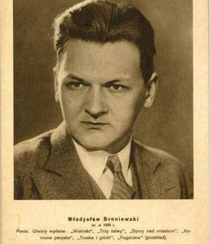

### 2021

  

> Wirtualna Polska włączyła się w akcję protestacyjną przeciwko wprowadzaniu szkodliwej dla mediów składki "z tytułu reklamy". Jesteśmy też sygnatariuszem listu mediów do władz Rzeczpospolitej Polskiej w tej sprawie. Sprzeciwiamy się wprowadzeniu dodatkowego obciążenia mediów działających na polskim rynku.
> Whoever controls the media, the images, controls the culture. (Allen Ginsberg)
> The advancement and diffusion of knowledge is the only guardian of true liberty. (James Madison)
> Jeśli wierzysz w wolność słowa, to wierzysz w wolność głoszenia poglądów, które ci się nie podobają. (Noam Chomsky)

---

Nie, to nie epidemia Covida jest teraz największym zagrożeniem dla naszego społeczeństwa. Epidemia chujowości zniszczy nas dużo wcześniej. Chujowość to stosowanie najniższych wystarczających standardów. To niewymaganie od siebie niczego. Chujowość to bezmyślna wiara w "done is better than perfect", jakby to była co najmniej stoicka maksyma.

Epidemia chujowości nasiliła się, gdy nazwę stopnia "mierny", tej wstydliwej dwói, za którą można drzewiej było dostać od starych wciry, zmieniono na "dopuszczający". "Good enough", powiedzielibyśmy w korpo-speaku, a po naszemu - "chujowo". O ile jest różnica w zrobieniu czegoś miernie, a dostatecznie, o tyle pomiędzy dopuszczającym, a dostatecznym tej różnicy już nie ma. Nie ma po co starać się o tróję, jeśli już dwója dopuszcza i jest OK!

Oglądam lekcje przygotowane w ramach akcji TVP Szkoła i jakże boli ta chujowość, wybrzmiewająca z niemal każdego kadru dzielnie wyprodukowanego na szybko z udziałem prawdziwych nauczycieli ze Szczecina (duma, rodzinne miasto!)

Nauczycielka podczas lekcji dla 3. klasy tłumaczy, "o co chodzi z tą średnicą". Gniazdo bociana ma średnicę dwa metry." Nauczycielka bierze taśmę o długości 2 metrów, pokazuje, że nawet ma te 2m zaznaczone, łączy ją w pętlę i pokazuje: oto średnica 2 metry. No kurwa! To nie jest wypadek przy pracy! Ona po prostu myli pojęcia obwodu i średnicy, przekazuje swoją niewiedzę dzieciom w szkole, jako nauczyciel, od lat, a teraz jeszcze przez telewizję publiczną! Ona tego nie robi sama w domu, bez zewnętrznego nadzoru, ktoś to nagrywa, ktoś to montuje, ktoś to wrzuca do internetu. I co, nikt nie widzi błędu? Nikt nie widzi, że nie przystoi tak chujowo uczyć?

Lekcja angielskiego, klasa 4. TVP Ja pierdolę. Na elektrotablicy wyświetla się:Hello students [dwie spacje]! Hello there [dwie spacje]! Lerning English might be greatPrzez 25 minut e-lekcji w polskiej państwowej telewizji PRAWDZIWA NAUCZYCIELKA angielskiego wyświetla na tablicy błąd ortograficzny i zjebaną interpunkcję, i to jest OK! I to jest OK, że nie używa rodzajników! I to jest OK, że uczy normalnie oprócz tego w szkole, że taką chujową lekcję TVP nagrywa, że fundacja PGNiG za to płaci.

Pomijam paździerzowość tych wszystkich materiałów video, te warsztatowe niedoróbki, tę nędzę reżysersko-produkcyjną, dziesięć budżetów poniżej TikToka Pana Prezydenta Andrzeja Dudy, który z radośnie podnieconą miną odpala profil na TikToku, by zachęcać dzieci do esportu, jaki prezydent jest cool - co tam epidemia, co tam, że dzielicie jeden komputer na całą rodzinę, co tam, że nie ma procedur obsługi pacjenta z symptomami Covida poza #zostańwdomu. Co tam chujowość! Bawmy się i grajmy w gry!

We mnie się gotuje. Kwarantanna wzmaga ten ból. Wspominam te wszystkie chwile, gdy w ostatnich latach od powrotu do Polski zauważałam symptomy chujowości, ale wierzyłam, że to incydenty. Teraz, w chwili kryzysu, ten tumor chujowości stoi przed nami w całej okazałości. Chujowi posłowie, którzy nakładają sobie maseczki na czoło. Chujowe rozporządzenia pisane na kolanie już po ich obwieszczeniu. Chujowa telewizja publiczna. Chujowa edukacja. Chujowa służba zdrowia. Chujowe procedury.

Ta chujowość to wyłącznie nasza odpowiedzialność. Tolerując chujowość, obniżamy standardy. Każdy, kto miał chujowego współpracownika wie, jak to wpływa na morale wszystkich wokół. Błagam, podnieśmy trochę poprzeczkę. Nie gódźmy się na chujowość! Wymagajmy od siebie więcej! Pójdźmy o tę jedną milę dalej, niż wystarczy na "dopuszczający"!

---

> Podhale. Chcą kupować hotele i pensjonaty za bezcen. Przychodzą z walizkami z pieniędzmi

Tak teraz robi się kapitał...
Jesteś podczepiony instytucjonalnie do drukarki? Masz spółkę, której obligacje kupi EBC? To przychodzisz z walizką pieniędzy do Podhalan, by za bezcen kupić ich aktywa, których nie obroni ani właściciel, ani sprzeniewierzony suwerenowi pisowski rząd. Ten zamknął bowiem autorytarnie gospodarkę, wygenerował wierzytelność na 400 mld w krótkim okresie czasu i robi teraz dobrą minę do złej gry.

Czy mam żal do polityków i wyborców PiS? Nie, umówiliśmy się w Magdalence na ustrój, w ramach którego komuniści uwłaszczą się na majątku Polaków, z kasy FOZZ komunistyczny prywaciarz zbuduje Mainstream Media, a suweren potrzebny bedzie władzy jedynie raz na cztery lata, wszakże po wcześniejszej indoktrynującej obróbce. Teraz w ramach tego układu dokonujemy wyborów i ODPOWIADAMY ZA NIE PERSONALNIE. Nie, nie nasi reprezentanci we władzy ustawodawczej i wykonawczej - my sami. To my okradany dziś Polaków z Podhala i Sopotu, MIEJMY TYLKO ODWAGĘ TO PRZYZNAĆ. To my jutro okradniemy górników ze Śląska, pojutrze resztę klasy średniej. Ty i ja. Poprzez premiera naszego demokratycznego rządu, naszych ludzi w niższej i wyższej izbie Parlamentu.

Nieznajomość prawideł ekonomii i politycznych kłamstw nie jest okolicznością łagodzącą.

---

### 1962

Na raka krtani zmarł Władysław Broniewski - poeta, tłumacz, żołnierz Legionów Polskich, uczestnik wojny polsko-bolszewickiej; 1940-41 więziony w ZSRR; żołnierz Armii Andersa, autor lewicowych wierszy polityczno-agitacyjnych oraz liryki żołniersko-patriotycznej , społecznej i osobistej. Napisał m.in. poemat ,,Komuna Paryska'', wiersz ,,Bagnet na broń'', cykl poetycki ,,Anka'' poświęcony zmarłej córce. Odznaczony Krzyżem Srebrnym Orderu Wojennego Virtuti Militari (1921), Krzyżem Walecznych - czterokrotnie oraz Krzyżem Komandorskim z Gwiazdą Orderu Odrodzenia Polski.

  

---

<a href="https://github.com/TomaszWaszczyk/historia.waszczyk.com/edit/master/src/content/february-10.md" target="_blank">Edytuj tę stronę dzieląc się własnymi notatkami!</a>
