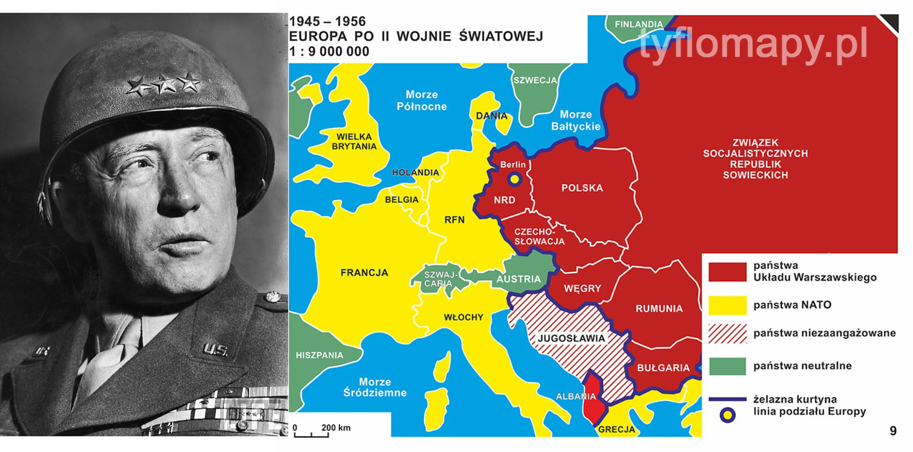
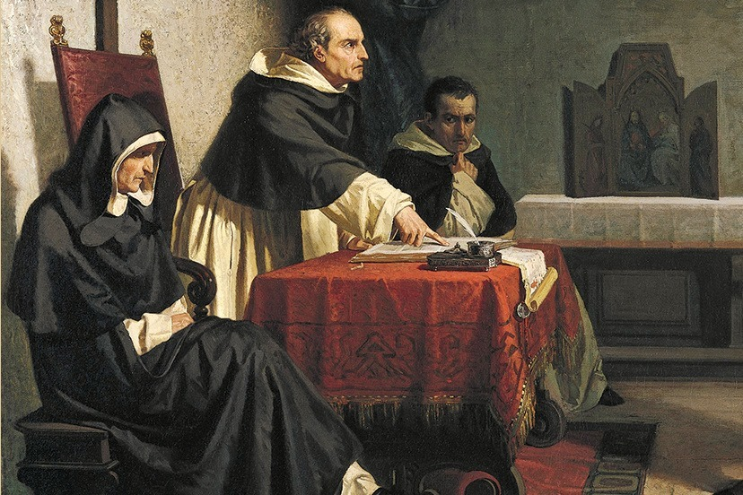

### 2021

Dzial IT:
Dzień dobry,
Pani X, otrzymaliśmy odpowiedź w sprawie Pani problemów ze znikającymi plikami w Outlooku.
Jeżeli sytuacja wciąż się powtarza, proszę mi odpowiedzieć, czy wyłączając komputer po skończonej pracy wyłącza go Pani poprzez wciśnięcie wpierw Log Off a następnie wyłączenie laptopa?
Czy może zamyka Pani sesję „X'em" i przechodzi następnie do zamknięcia laptopa?
Wiem, że to strasznie banalne pytanie, ale żeby zespół mógł się zająć dalej tą sprawą muszą mieć odpowiedź na powyższe pytanie.
Uprzejmie informuję, iż brak odpowiedzi w przeciągu 12 godzin roboczych zostanie potraktowane jako potwierdzenie rozwiązania a sprawa zostanie zamknięta po naszej stronie.
Pozdrawiam,
Y
Userka X:
Panie Y – owszem, zamykam jak biały człowiek wszytkie aktywne okna ciżykiem, po czym daję log off z aplikacji i mam jakiegoś opóźnionego windows shella, skutkiem czego dotaję sugierację „do you want to force log off" a ja, jako osoba serca spolegliwego, nie pragnę gwałtem wymuszać i czekam, jak powstaniec na odsiecz zza Wisły, na zakończenie programu. Jak mnie się wyloguje aplikacja, to myszko klikam na start i pokazuje się moim oczom bezmyślnym, pomiędzy innemi oczywista, prostokąt „shut down" to jak go klikam myszko i idę siku.
Zużywam złośliwie poważne ilości papieru toaletowego, żeby się normy ISO nie zgadzały, potem myję ręce, ale nie używam ręcznika papierowego, bo po primo mnie sumienie rwie przez ten nadmiar papieru toaletowego, a po sekundo zazwyczaj nie ma, bo hydry z ceesu zużyły.
Potem wracam do pokoju, a mój laptop już jest wyłączony, to ja go wypinam ze stacji dokującej (i tu mnie się zawsze Star Trek nasuwa) i wsadzam do przecenionego flaka z flo z małą dziurką na jednym rogu, ale za dychę, to może mieć dziurki. Laptop we flaku do torby, chyba, ze mam malą, to pod pachę, ale zazwyczaj mam torbę.
Kładę palto, jak mróz to i czapkie kładę, gaszę światło, przekręcam w zamku klucz i krokiem defiladowym podążam do samochodu swojego francuskiego, co ma nieco zawodny alternator i modlę się żarliwie, żeby odpalił.
Mam nadzieję, że powyższy opis procedury wypełnił zakres Pańskiego pytania.
Pozostaję w półprzykucu w oczekiwaniu na dalsze pytania mogące wyeliminować potencjalne przyczyny. Uprzedzając następne pytanie: ten garbaty karzeł, który zazwyczaj szcza do mleka, jak tylko człowiek na kwaśne nastawi, nie dotyka laptopa. On psuje ekspres do kawy...
Kłaniam grzywo do wykładziny
X

---

Rząd wprowadził już 45 podwyżek podatków i opłat! Szaleństwo podatkowe dobija polską gospodarkę!
OTO LISTA 45 PODWYŻEK PODATKÓW:

1. podatek bankowy, czyli od kredytów

2. podatek handlowy, czyli od zakupów

3. danina solidarnościowa

4. opłata emisyjna od paliw

5. opłata przejściowa

6. tzw. opłata mocowa za prąd

7. podatek „galeryjny" - początkowo od galerii handlowych i biurowców

8. następnie od wszelkich nieruchomości komercyjnych

9. w tym nawet od budynków z mieszkaniami na wynajem

10. opłata za wpis do rejestru BDO

11. opłata recyklingowa

12. podwyższenie i rozszerzenie zakresu obowiązywania opłaty recyklingowej

13. opłata denna od przystani

14. opłata wodna

15. opodatkowanie wkładów pieniężnych wnoszonych do firm

16. oraz przychodów z dziedziczonego majątku lub otrzymanego jako darowizna, którego nie będzie 
można już amortyzować

17. opłata jakościowa za badanie techniczne pojazdów

18. podwyżka VAT na wiele produktów spożywczych

19. utrzymanie wyższych stawek VAT do 8% i 23%

20. a następnie na czas nieokreślony

21. podwyżka podatku akcyzowego o 10 proc. na alkohole

22. na wyroby tytoniowe

23. i na e-papierosy

24. podwyżka opłat za wywóz śmieci

25. zamrożenie progów PIT

26. likwidacja liniowego PIT dla przedsiębiorców których dochody roczne przekraczają 1 milion złotych

27. obniżenia do zera kwoty wolnej od podatku od wysokich zarobków

28. pozbawienie wiele grup podatników możliwości korzystania z 50% kosztów uzyskania przychodów

29. likwidacja możliwość pomniejszania przychodów z działalności operacyjnej o koszty uzyskania przychodów kapitałowych

30. podatek deszczowy

31. zaostrzenie sposobu opodatkowania farm wiatrowych

32. zaostrzenie sposobu naliczania akcyzy od samochodów sprowadzanych z zagranicy

33. podwyżka opłaty paliwowej

34. podatek od serwisów VOD

35. podatek cukrowy

36. coroczna podwyżka składek ZUS

37. podwyżka opłaty OZE

38. podatek od tzw. małpek (czyli małych napojów alkoholowych)

39. podwyżka abonamentu RTV

40. podatek od przekształcenia spółek w celu skorzystania z estońskiego CIT, podatek wynosi 19 proc.

41. podatek od plastiku (unijny podatek, poparty przez premiera Morawieckiego na szczycie UE, naliczany jest od 1 stycznia)

42. Podwyżka opłat sądowych

43. ograniczenie ulgi abolicyjnej

44. podwójne opodatkowanie spółek komandytowych

45. podwyżka stawek maksymalnych opłat lokalnych; decyzją rządu zwiększone zostały maksymalne stawki podatków od nieruchomości, od środków transportu, od psa oraz od opłaty uzdrowiskowa i reklamowej.

---

### 2004

Zmarł Ryszard Kukliński https://pl.wikipedia.org/wiki/Ryszard_Kukli%C5%84ski

W Tampie na Florydzie zmarł płk Ryszard Kukliński, oficer Sztabu Generalnego Wojska Polskiego, który na początku lat 70. nawiązał współpracę z amerykańskim wywiadem. Jako Jack Strong przekazał m.in. strategiczne plany Układu Warszawskiego, czy wprowadzenia stanu wojennego w Polsce. Gen. Wojciech Jaruzelski uznawał go za zdrajcę i dezertera. Kukliński uważał natomiast, że oficer nie ma obowiązku być lojalnym wobec dowódcy, który nie jest lojalny wobec swojej ojczyzny. W wywiadzie dla "Tygodnika Solidarność" z 1994 r. stwierdził, że jego dylemat polegał nie na wyborze: komunizm czy kapitalizm, ale służba narodowi lub czerwonemu imperium. William Casey, dyrektor CIA, powiedział natomiast po zakończeniu wywiadowczej misji Kuklińskiego, że w ciągu ostatnich 40 lat nikt tak nie zaszkodził komunizmowi jak on.

### 1945

Zakończyła się konferencja Wielkiej Trójki z udziałem Józefa Stalina, Franklina D. Roosevelta i Winstona Churchilla w Jałcie, na której zachodni sojusznicy zdradzili Polskę i zgodzili się na podporządkowanie całej Europy Wschodniej totalitarnej stalinowskiej Rosji.
8 maja 1945 roku w dniu zakończenia wojny w Europie, podczas konferencji prasowej Patton zszokował słuchaczy, mówiąc:
„Problem w zrozumieniu Rosjanina jest taki, że nie bierzemy pod uwagę faktu że on nie jest Europejczykiem, ale Azjatą i dlatego myśli pokrętnie. My nie możemy zrozumieć Rosjanina bardziej niż Chińczyka czy Japończyka i od kiedy mam z nimi do czynienia, nie miałem żadnego szczególnego pożądania zrozumienia ich poza obliczeniami jak dużo ołowiu lub stali trzeba zużyć, aby ich zabić. W dodatku, poza innymi cechami charakterystycznymi dla Azjatów, Rosjanie nie mają szacunku dla ludzkiego życia i są sukinsynami, barbarzyńcami i pijakami”. Na koniec stwierdził:
„Niestety, niektórzy z naszych przywódców są po prostu cholernymi durniami i nie mają pojęcia o historii Rosji. Cholera, mam wątpliwości, czy wiedzieli chociaż tyle, że Rosja jeszcze niecałe sto lat temu zajmowała Finlandię, wyssała krew z Polski i zrobiła z Syberii więzienie dla własnego narodu. Wyobrażam sobie, jak szydził Stalin, kiedy uzyskał od nich wszystko podczas tych nibykonferencji”.

  

### 1942

W Warszawie miała miejsce "Akcja Kopernik" przeprowadzona przez podharcmistrza Macieja Aleksego Dawidowskiego "Alka" (zdjęcie)-żołnierza Organizacji Małego Sabotażu "Wawer".
Dawidowski odkręcił z pomnika Mikołaja Kopernika tabliczkę z niemiekim napisem "Dem Grossen Astronomen Nikolaus Kopernikus" (Wielkiemu Astronomowi Mikołajowi Kopernikowi), którą Niemcy zawiesili,by zasłonić polski napis "Mikołajowi Kopernikowi-Rodacy".
Akcja miała początkowo być przeprowadzona 19 lutego,w rocznicę urodzin Kopernika,ale ciekawski Dawidowski postanowił wcześniej sprawdzić jak mocno przymocowana jest niemiecka tablica i jakie klucze będą potrzebne do jej odkręcenia. Ku jego zdziwieniu dała się ją zdemontować ręcznie. Dawidowski postanowił nie czekać na wyznaczony termin i sam usunął tablicę.
Najciekawsze jest to, że zaledwie kilkadziesiąt metrów dalej znajdował się posterunek niemieckiej policji.
Odkręcenie ciężkiej tablicy było dopiero
początkiem akcji, bo niemiecki napis nie mógł być pozostawiony pod pomnikiem. "Alek" przeciągnął tablicę chodnikiem pod arkadami Pałacu Staszica, a następnie ukrył w kopie śniegu odgarniętego z ulicy.
Dwa dni pózniej "Alek" i inny harcmistrz Jan Rossman "Pan Janek"przetransportowali tablicę na Żoliborz, gdzie zakopali ją w ogrodzie rodziców Rossmana.
W odwecie za zdemontowanie tablicy z pomnika Kopernika Niemcy zdemontowali część pomnika Jana Kilińskiego. Tu znowu do akcji wkroczył Aleksy Dawidowski,który odkrył, że fragment tego pomnika hitlerowcy schowali na terenie Muzeum Narodowego.
Następnego ranka po akcji "Kiliński"
zaskoczonych mieszkańców Warszawy powitał napis na murach muzeum o treści: "Jam tu. Ludu W-wy. Kiliński Jan". Jego autorem był niezłomny "Alek".

### 1482

Hiszpański dominikanin Tomás de Torquemada otrzymał nominację na inkwizytora.
Tomás de Torquemada, dominikanin i spowiednik królowej Izabeli Kastylijskiej, otrzymał nominację na inkwizytora. Rok później został zwierzchnikiem wszystkich trybunałów w Kastylii, a w 1488 r. stanął na czele tzw. Supremy - Rady Najwyższej i Generalnej Inkwizycji, która była najwyższym trybunałem inkwizycyjnym dla całej Hiszpanii. Torquemada pochodził z rodziny żydowskiej, która przeszła na katolicyzm, a za sprawą swej 16-letniej działalności inkwizytorskiej przeszedł do historii jako najbardziej znany inkwizytor w historii tej instytucji oraz symbol fanatyzmu religijnego, bezwzględności i okrucieństwa. Liczba ludzi posłanych przez Torquemadę na stos jest trudna do określenia, starsze badania mówiły o blisko 9 tys., ale współcześni naukowcy uważają ją za zawyżoną.

  

---

<a href="https://github.com/TomaszWaszczyk/historia.waszczyk.com/edit/master/src/content/february-11.md" target="_blank">Edytuj tę stronę dzieląc się własnymi notatkami!</a>
