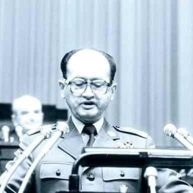
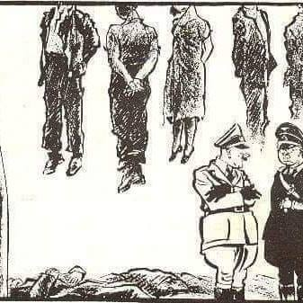
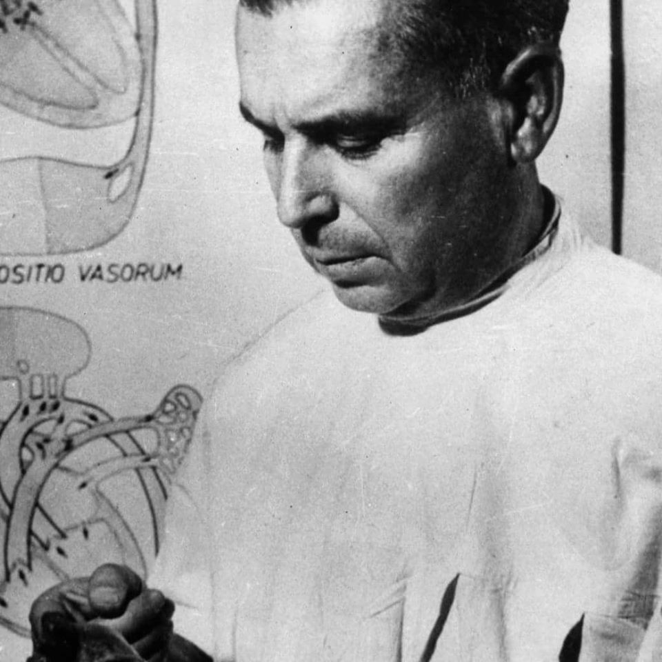
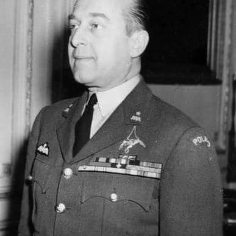

### 2021

Nie róbmy z Polski PRL. Konferencja Ministra Sprawiedliwości. Na mównicę parę dni temu wychodzi Minister i mówi, że opracował projekt ustawy mającej zapewnić wolność słowa w polskim Internecie i powołującej Radę Wolności Słowa. Organ, który może nałożyć na każdy portal karę do 50 mln zł kary. Jak mówi Minister, członkowie Rady będą wybierani przez Sejm większością 3/5 tak, by każdego członka musiała poprzeć opozycja. Pomyślałem, brzmi dobrze!

Usiadłem do lektury ustawy. Wstyd, że Minister opowiada takie rzeczy. Owszem, Radę ma powoływać większość 3/5 głosów, ale gdy nie uda się w pierwszym głosowaniu wybrać członka, zarządza się drugie głosowanie w którym do wyboru wystarczy większość zwykła. Czyli? Organ mający 6 letnią kadencję, mający decydować które wpisy w polskim Internecie naruszają prawo, ma wybrać obóz władzy. Niezależnie kim by on był, jest to absolutny skandal.

Najbardziej poraża, że konstrukcja projektu naprawdę daje szansę na niezauważenie powyższego. Redakcja przepisów poprzenosiła najbardziej niebezpieczne z nich w różne niezwiązane ze sobą miejsca. Efekt? Wczoraj na antenie jednego z najlepiej oglądanych programów, prof. S. Sowiński którego bardzo szanuję mówi do mnie "popieram ustawę".

Nie wolno jej popierać! Destrukcja wolności sieci w najlepszym wydaniu.

### 2020

"Facebook would never put it this way, but algorithms are meant to erode free will, to relieve humans of the burden of choosing, to nudge them in the right direction. Algorithms fuel a sense of omnipotence, the condescending belief that our behavior can be altered, without our even being aware of the hand guiding us, in a superior direction. That's always been a danger of the engineering mindset, as it moves beyond its roots in building inanimate stuff and beings to design a more perfect social world."

~ Franklin Foer. World Without Mind: The Existential Threat of Big Tech

### 1981

Prezes Rady Ministrów generał Wojciech Jaruzelski (zdjęcie) w wygłoszonym w Sejmie exposé wystosował "Apel o 90 spokojnych dni".
Powiedział wówczas:
""Zwracam się z tej Wysokiej Trybuny do związków zawodowych, do wszystkich ludzi pracy z apelem, z wezwaniem do zaniechania wszelkich akcji strajkowych. Zwracam się w tym momencie o trzy pracowite miesiące - 90 spokojnych dni. Czas ten pragniemy wykorzystać dla porządkowania najbardziej elementarnych spraw naszej gospodarki, dla dokonania remanentów, pozytywów i negatywów, podjęcia najpilniejszych problemów socjalnych, nakreślenia i zapoczątkowania realizacji programu stabilizacji gospodarki kraju oraz dalekosiężnej reformy gospodarczej".
W tym samym wystąpieniu stwierdził również, że "władza ludowa dysponuje mocą, aby zagrodzić drogę tym ludziom, tym procesom, które zmierzają do cofnięcia koła historii".

  

### 1942

W Rudzie Śląskiej Niemcy wykonali wyrok śmierci na Joachimie Achteliku -22 letnim członku podziemia, żołnierzu Związku Walki Zbrojnej, artyście malarzu.
Achtelik był synem Polki i żydowskiego lekarza. Był absolwentem krakowskiej Akademii Sztuk Pięknych. W czasie wojny obronnej pracował w kopalni w Rokitnicy. Był również poliglotą znającym język niemiecki, francuski i angielski, co w późniejszym czasie zaowocowało pracą tłumacza w urzędzie generalnego gubernatorstwa. W roku 1940 podjął współpracę z placówką Polskich Sił Zbrojnych w Rudzie, gdzie pełnił funkcję łącznika oraz której przekazywał informacje zdobyte w urzędzie. Dostarczał też dokumenty wyjazdowe ułatwiające opuszczenie Polski.
Achtelik został aresztowany 7 września 1941 roku i wraz z innymi członkami podziemia osadzony w więzieniu w Mysłowicach . Sąd SS skazał go za szczególnie niebezpieczną działalność na karę śmierci przez powieszenie w Rudzie, miejscu stałego zamieszkania.
Został powieszony na słupie oświetleniowym, co miało być niemiecką demonstracją rozprawiania się z polskimi patriotami.
Podczas zakładania na szyję pętli wypowiedział znane słowa konającego na krzyżu Jezusa "Wybaczcie im, bo nie wiedzą, co czynią". Po tych słowach wszyscy Polacy uklękli, co o mało nie wywołało zamieszek. Achtelik konał około piętnastu minut.
Tego samego dnia na 12 innych słupach w różnych dzielnicach Rudy powieszono również innych działaczy podziemia.
Jest patronem jednej z ulic w dzielnicy
Ruda w Rudzie Śląskiej . W miejscu egzekucji znajduje się tablica upamiętniająca śmierć młodego patrioty.

  

### 1958

Zespół lekarzy Akademii Medycznej pod kierownictwem profesora doktora habilitowanego Wiktora Brosa wykonał pierwszą w historii polskiej medycyny operację na otwartym sercu.
Operowanym pacjentem był 12 letni wówczas chłopiec Jerzy Chmiel. Operowano zwężenie tętnicy płucnej, a następnie zaszyto ubytek w przegrodzie międzyprzedsionkowej. Pacjentowi zatrzymano serce na kilkanaście minut, po czym obłożono go lodem.
Sam Jurek, któremu 51 lat później również w Akademii Medycznej we Wrocławiu wszczepiono trzy bajpasy tak mówił o tym wydarzeniu:
" Wszystko przez moją mamę, która nie chciała mnie puścić na kolonie - śmieje się pan Jerzy. - Tak długo chodziła ze mną po lekarzach, aż mi znaleźli wadę serca (...) Gdy pociekła trzecia kropla, odpłynąłem - opowiada Jerzy Chmiel. Nic nie pamięta, czy było mu zimno. Gdy się obudził, miał w klatce piersiowej cztery dreny, którymi płyny ustrojowe ściekały do butli na podłodze. - Jak mama to zobaczyła, to uciekła z płaczem"

  

### 1952

W Lyonie we Francji wieku 54 lat zmarł Mateusz Iżycki (zdjęcie)- generał brygady Wojska Polskiego, pilot, bohater wojny polsko-ukraińskiej w czasie której walczył jako żołnierz Szwadronu Jazdy Wojewódzkiej Warszawskiej Odsieczy Lwowa. Otrzymał za to Order Virtuti Militari V klasy. Został potem żołnierzem zorganizowanego przez oficerów byłego VII Pułku Ułanów w Rosji 12 Pułku Ułanów Podolskich.
W roku 1924 został oficerem Sztabu Sztabu Generalnego w Biurze Ścisłej Rady Wojennej. W latach 1925-27 był dowódcą 12 Eskadry Lotniczej w Warszawie, do 1929 roku był attache wojskowym w Turcji,a w latach 1929-30 dowódcą 22 Eskadry Liniowej.
Podczas wojny obronnej w 1939 roku dowodził lotnictwem i OPL Armii „Łódź”, a następnie Armii "Warszawa". Przez Węgry przedostał się do Francji, tam pełnił funkcję szefa Oddziału III Operacyjnego Dowództwa Lotnictwa. Od 17 czerwca 1940 roku kierował faktycznie ewakuacją lotnictwa polskiego w dniach upadku Francji, w miejsce dowódcy lotnictwa gen. Józefa Zająca . Przez Casablancę ewakuował się w lipcu 1940 roku do Gibraltaru. W latach 1940-1942 dowódca Polskiego Oddziału Transportowego w Afryce, 1942-1943 delegat Polskich Sił Powietrznych na Środkowym Wschodzie. 14 września 1943 roku został mianowany Inspektorem Polskich Sił Powietrznych, pełnił funkcję do stycznia 1948 roku (odpowiednia ranga brytyjska RAF: Vice Air Marshal).

  

---

<a href="https://github.com/TomaszWaszczyk/historia.waszczyk.com/edit/master/src/content/february-12.md" target="_blank">Edytuj tę stronę dzieląc się własnymi notatkami!</a>
