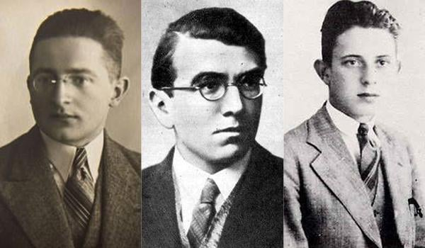

### 2021

> Coraz częściej mieszkania znajomych wyglądają jak apartamenty hotelowe. Oto estetyka sukcesu klasy średniej

> Most "modern" people place so much emphasis on "I want to travel" because they have no culture and spiritual connection in their own lives. This is not a message for idiots.

---

<video width="640" height="480" controls>
<source src="./movies/february/piasek.mp4" type="video/mp4">
Your browser does not support the video tag.
</video>

---

### 2020

"Dotychczas pracowałem w jednostce, w której mobbing jest na porządku dziennym, długo by opowiadać, skupię się tutaj tylko na problemie związanym ze specjalizacją. Rezydenci nie są puszczani na staże i kursy, ale system do tej pory działał, bo gdzieś w trakcie 6 lat trwania całej specjalizacji jakoś się te staże robiło. Najczęściej w bardzo okrojonej formie, prosząc o pieczątki w książce stażowej „za darmo” albo za kilka dni obecności, wpisując daty „tak żeby się zgadzało”. Zamiast tego pracowało się na oddziale macierzystym, niejako realizując program modułu specjalistycznego. Generalnie zmiana trybu jednolitego na modułowy w wymiarze praktycznym nie istnieje, czas jakby się zatrzymał.

Jestem po trochę ponad 3 latach, czyli ponad połowie specjalizacji. Do tej pory powinienem mieć zaliczone wszystkie staże i kursy z modułu podstawowego, ale brakuje mi kilku. Idę trybem modułowym, czyli teoretycznie nie mogę rozpocząć modułu specjalistycznego bez zakończenia podstawowego. Teoretycznie, bo tak jak pisałem wyżej, praktyka pokazuje inaczej. W tym czasie pracowałem na swoim oddziale. Jest to powszechna praktyka, na którą przymyka się oko.

Przez brak tych kilku staży i kursu nie mogę mieć zaliczonego modułu podstawowego. Kierownik specjalizacji na pewno potwierdzi, że zaliczylem w tym czasie staże na oddziale macierzystym. Tylko co z tego? Otóż pytałem w różnych miejscach, co się robi w takiej sytuacji – byłem w Urzędzie Wojewódzkim, CMKP, nawet w OIL i albo rozkładają ręce i współczują sytuacji albo pocieszają, że mogę przedłużyć specjalizację bez problemu i odrobić zaległe staże (oczywiście bez pensji, na wolontariacie ;().

Jeżeli faktycznie będę miał przedłużyć specjalizację, to będę pracować prawie pół roku za darmo…"

Koniec historii. Chcę tylko dodać, że to historia jednej osoby, ktora odwazyła się o tym napisać. Lekarzy odbywających w ten sposob rezydenturę jest więcej.

P.s. Wszelkie podobieństwo do prawdziwych osób i miejscjest przypadkowe.

---

Bardzo nie lubię tzw ekspertów od spraw ochrony zdrowia, którzy mówią "nie bilansujemy się bo na płacę wydajemy ponad 70% budżetu" zamiast powiedzieć

"nie jesteśmy w stanie się zbilansować, bo dostajemy za mało pieniędzy/procedury wycenione są za nisko/jest nieograniczony popyt na usługi zdrowotne, więc musimy limitować podaż/zatrudniamy świetnych fachowców, więc musimy ich dobrze opłacić"

Chodzi o przeniesienie środka ciężkości z niedofinansowania systemu na to, że ludzie chcieliby pieniądze za swoją pracę.

dla mnie jest to bardzo przemocowe, tak jakby szlachta wydała oświadczenie, że zniesienie pańszczyzny psuje model biznesowy folwarków szlacheckich i myślę, że gdyby nie zaborcy to pańszczyzna nigdy nie zostałaby zniesiona

teraz okazuje się, że system ochrony zdrowia nie ma prawa działać bo jego warunkiem sin equa non jest zaniżanie wartości pracy profesjonalistów, tworzenie wąskich gardeł, zmuszanie ludzi do wolontariatów, do zostawania po godzinach i nadgodzin

to wszystko oczywiście nie jest powiedziane wprost tylko używane są wielkie słowa typu:

"powołanie, praca dla idei, służebny charakter, etc etc"

ale jakby się temu przyjrzeć to są to tylko pewne konstrukty społeczne, to jest wyobrażenie polityków i tzw społeczeństwa dotyczące tego co powinniśmy robić

więc po prostu mamy siedzieć cicho i cieszyć się, że możemy służyć

a cały paradoks tej konstrukcji sprowadza się do tego, że powoli coraz mniej można liczyć na jakiekolwiek inne niż pieniężne aspekty docenienia naszej pracy, zanika jakikolwiek szacunek społeczny, poczucie tego, że jesteśmy potrzebni, że dużo poświęcamy, żeby ludziom pomagać

---

### 1980

W Warszawie - zmarł Marian Rejewski - matematyk i kryptolog, który wspólnie z Henrykiem Zygalskim i Jerzym Różyckim złamał szyfr Enigmy. „Enigmą” nazywano maszynę szyfrującą, używaną przez niemieckie armię i dyplomację w okresie międzywojennym i podczas II wojny światowej. System kodowania został złamany przez trzech matematyków z Uniwersytetu Poznańskiego: Mariana Rejewskiego, Jerzego Różyckiego i Henryka Zygalskiego, pracujących dla Biura Szyfrów Oddziału II Sztabu Głównego Wojska Polskiego. Pozwoliło to na zbudowanie w 1933 r. repliki „Enigmy” i odczytywanie niemieckich depesz. W tym celu stworzono specjalny ośrodek wywiadu w Pyrach pod Warszawą. W lipcu 1939 r., w atmosferze zagrożenia wojną, Polacy podzielili się z wywiadami francuskim i brytyjskim swoimi osiągnięciami, przekazując im po replice „Enigmy”. Umożliwiło to aliantom, przede wszystkim Brytyjczykom, rozszyfrowywanie niemieckich i później także japońskich depesz (tzw. Operacja Ultra)."

  

  

### 1964

https://pl.wikipedia.org/wiki/Ihor_Ko%C5%82omojski

### 1945

Armia Czerwona zdobyła Budapeszt.
Bezwarunkowa kapitulacja Budapesztu bronionego przez siły niemieckie, węgierskie i rumuńskie zakończyła jedną z najkrwawszych bitew II wojny światowej - oblężenie zaczęło się w grudniu 1944 r., 18 stycznia Sowieci opanowali Peszt, czyli wschodnią część miasta, a walki o resztę miasta trwały jeszcze ponad trzy tygodnie. Po kapitulacji nastąpił trwający dwa dni rabunek miasta i masowe gwałty - uważa się, że podczas oblężenia i zaraz po nim sowieccy żołnierze zgwałcili ok. 50 tys. kobiet (choć są szacunki mówiące nawet o 200 tys.) Liczba zabitych, rannych i zaginionych obrońców miasta i jego mieszkańców szacowana jest na 99 do 150 tys. (w tym 40 tys. zabitych cywili). Po stronie radzieckiej zginęło i zaginęło 80 tys. żołnierzy. Aż 80 proc. budynków legło w gruzach bądź zostało uszkodzonych.

  

### 1706

III wojna północna: zdecydowane zwycięstwo wojsk szwedzkich nad dwukrotnie liczniejszą armią sasko-rosyjską w bitwie pod Wschową.
Wojska szwedzkie liczyły ponad 9 tysięcy (ponad 5,5 tysiąca jazdy, resztę stanowiła piechota). Dowodził nimi feldmarszałek Carl Gustaf Rehnskiöld. Znacznie liczniejsze oddziały mieli jego przeciwnicy – połączone siły sasko-rosyjskie były ponad dwa razy liczniejsze niż Szwedzi, miały one 32 działa (Szwedzi nie dysponowali żadnym) i były kierowane przez Johanna Matthiasa von der Schulenburga.
Początkowo doszło do starcia oddziałów konnych, jednak punktem przełomowym bitwy było natarcie szwedzkiej piechoty. Oddziały piesze Rehnskiölda zaatakowały na lewe skrzydło przeciwników, gdzie stały pułki rosyjskie. Zostały one zaatakowane także od tyłu przez szwedzką jazdę. Szyk sasko-rosyjski załamał się, żołnierze zaczęli uciekać. W pogoń za uciekającymi ruszyła jazda szwedzka. Pod Wschową olbrzymie straty poniosły wojska koalicji antyszwedzkiej – zginęło ponad 7 tysięcy żołnierzy, kolejne 7 tysięcy dostało się do niewoli, stracono wszystkie działa. Szwedów zginęło ponad 400, około tysiąca poniosło rany.
Starcie pod Wschową przeszło do historii nie ze względu na działania zbrojne, a na to, co się stało już po bitwie. Z rozkazu dowódcy szwedzkiego rozstrzelano 500 jeńców rosyjskich. Miała być to zemsta Rehnskiölda na okrucieństwo Rosjan, jakiego rzekomo dopuszczali się w czasie walk na terenie Inflant.

  

### 1633

Galileusz przybył do Rzymu aby stanąć przed trybunałem inkwizycyjnym.
Galileusz cierpiący w lochach inkwizycji, przez nią torturowany i w końcu spalony na stosie to jeden z obrazów, który kształtuje współczesne wyobrażenia o tym genialnym astronomie, a zarazem o niesławnej postawie Kościoła, walczącego z nauką i postępem. Teraz w roku astronomii, obchodzonym w 401. rocznicę pierwszego użycia teleskopu właśnie przez Galileusza, obrazy te odżywają z nową siłą.
W rzeczywistości jednak Galileusz nie spłonął na stosie, ani chwili nie spędził w więzieniu, nie był też torturowany, a nawet nie został uznany za heretyka. Owszem, był sądzony. W ciągu całego procesu traktowano go jednak z wielkim szacunkiem. Tragedia Galileusza polega na tym, że występował przeciwko temu, co dla wszystkich było oczywiste jak słońce na niebie, które rano wschodzi, a wieczorem zapada. Głęboko przekonany o prawdziwości teorii Kopernikańskiej, przedstawiał ją jako fakt, a nie teorię, choć nie potrafił jej jeszcze dowieść.
O procesie Galileusza, jego czarnej legendzie opowiada książka podsekretarza Papieskiej Rady ds. Kultury, ks. Melchora Sáncheza de Toca, pod tytułem: „Galileusz i Watykan”, a także wywiad, którego udzielił on agencji Zenit.
Ks. Sánchez de Toca przypomina, że na początku XVII w. Kościół w sprawie interpretacji Pisma Świętego kierował się nauczaniem Soboru Trydenckiego, którego stanowisko było bardzo ostrożne, ale i rozsądne jak na owe czasy. Biblię należało odczytywać w sposób dosłowny, chyba, że jakaś dowiedziona prawda sugerowałaby interpretację alegoryczną bądź duchową. Kościół był zatem gotów przyjąć teorię Kopernikańską, uznać, że to Ziemia kręci się wokół Słońca, gdyby Galileusz był w stanie to udowodnić. Tymczasem Galileusz dowodów jeszcze nie posiadał. Głosił jednak wyższość teorii Kopernikańskiej nad ptolemejskim geocentryzmem i chciał, by według Kopernika interpretowano też Pismo Święte. Zrobił więc o jeden krok za daleko i za to właśnie był sądzony.
Proces Galileusza miał charakter dyscyplinarny. Astronom naruszył bowiem zakaz nauczania teorii Kopernikańskiej, a także podstępem zdobył imprimatur dla swej książki, w której ukazuje wyższość Kopernika nad Ptolemeuszem. Na procesie nie uznano Galileusza za heretyka. Stwierdzono jedynie, że w świetle ówczesnej wiedzy, z powodu braków dowodu na to, że Ziemia kręci się wokół Słońca, kopernikański heliocentryzm jest sprzeczny z tym, co mówi Biblia. Tylko tyle. Tak zresztą myślał cały ówczesny świat. Największych oponentów Galileusz miał nie w Kościele, lecz w świecie akademickim, który jego twierdzenia uważał za absurdalne. Również protestanci zgadzali się pod tym względem z Kościołem katolickim. Jeszcze w 1670 r. uniwersytet w Uppsali w Szwecji potępił jednego ze swych studentów za głoszenie tez Kopernikańskich.
Patrząc na sprawę Galileusza z dzisiejszego punktu widzenia, musimy jednak stwierdzić, że i jego sędziowie nie byli bez winy. Ich pracę osądziła przed niemal trzydziestu laty specjalna komisja powołana przez Jana Pawła II. Na polecenie Papieża przebadano Tajne Archiwum Watykańskie. W dokumentach inkwizycji nie znaleziono jednak żadnych sensacji. Kard. Paul Poupard, który przedstawił wyniki dochodzenia, uznał jednak, że sędziowie Galileusza popełnili błąd. Z jednej strony nie potrafili rozróżnić prawd wiary od wielowiekowej kosmologii. Z drugiej – przestraszyli się, niesłusznie, że przewrót kopernikański mógłby naruszyć tradycję katolicką, zagrozić wierze, zwłaszcza maluczkich. Dlatego też wydawało się im, że ich obowiązkiem jest zakazać nauczania tej naukowej teorii. „Dziś już wiemy – mówi ks. Sánchez de Toca – że zakazywanie nauczania teorii naukowych jest błędem. Nie do Kościoła bowiem należy rozsądzanie, czego można naukowo dowieść, a czego nie”.
Choć Galileusz nie skończył w więzieniu ani nie został spalony na stosie, w czym myli się go prawdopodobnie z Giordanem Bruno, został on jednak skazany na areszt domowy. Spotkały go też inne upokorzenia. Co tydzień musiał odmawiać siedem psalmów pokutnych. Nakazano mu odwołać niedowiedzione twierdzenia, a książka, w której o nich pisał, trafiła na indeks. Wyrok ten był niewątpliwie upokarzający, ale nie miał nic wspólnego z prawdziwym więzieniem, torturami czy stosem. Co więcej, Galileusz, który z czasem stał się ikoną oświecenia i wolnomyślicielstwa, ani przez chwilę nie przestał być przekonanym, choć wcale nie przykładnym katolikiem. Zależało mu na reputacji Kościoła. I właśnie dlatego zabiegał, aby władze kościelne nie potępiły teorii Kopernikańskiej. Wierzył bowiem, że Kopernik miał rację, że kiedyś uda się tego dowieść, a wtedy autorytet Kościoła zostałby poważnie naruszony. I rzeczywiście, Kościół nigdy nie potępił heliocentryzmu, choć dziś mało kto o tym pamięta.

  

### 1241

I najazd mongolski na Polskę: Mongołowie zdobyli i spalili Sandomierz.

W XIII wieku Polska doznała straszliwych w skutkach najazdów plemion Wielkiego Stepu. Rozpoczęło je uderzenie wojsk mongolskich w 1241 roku, które zakończyło się bitwą na legnickich polach. Na szlaku Tatarów był Sandomierz.

Głównym celem ataku nie były jednak księstwa piastowskie lecz Węgry. Ziemie polskie zaatakował zaledwie oddział dywersyjny. Powodem tego napadu były sojusze książąt polskich z południowymi sąsiadami. Sandomierz zawsze stał na drodze najeźdźcom ze wschodu. W czasie pierwszego najazdu ośrodek ten został zaliczony przez Mongołów do miast zdobywanych po długim i pełnym strat obleganiu, wobec których nie stosowano litości. Zapewne miał w tym udział wódz o imieniu Ordu, wnuk samego Czyngis-chana.

Armia Ordu zdobyła Sandomierz w Popielec, czyli 13 lutego 1241 roku, o czym informuje Rocznik kapituły gnieźnieńskiej. Długosz pisze, że chan oblega ciasno ze wszystkich stron zarówno zamek, jak i miasto Sandomierz. Zdobywszy je wreszcie, [Tatarzy] zabijają opata koprzywnickiego i wszystkich braci klasztoru koprzywnickiego, zakonu cystersów, oraz wielką liczbę duchownych i świeckich, mężczyzn i kobiet, szlachty i ludu obojga płci, którzy się tam zgromadzili w celu ratowania życia lub obrony miejsca. Urządzają wielką rzeź starców i dzieci i jedynie kilku młodym darują życie, ale zakuwają ich jak najgorszych niewolników w straszne dyby.

Najciekawszy szczegół dotyczący Sandomierza przynosi dość późno odkryte źródło obce − Historia Tatarów. Znalazł się tam opis losów Henryka Pobożnego. Według tego źródła książę nie zginął w bitwie pod Legnicą, lecz został wzięty do niewoli, po czym Mongołowie kazali mu klękać przed martwym wodzem, który poległ w Sandomierzu. W tym enigmatycznym zapisie może chodzić o zabrane stamtąd zwłoki mongolskiego dowódcy i przewiezione pod Legnicę. Jeżeli jednak zginął on pod Sandomierzem, to tam też mógł być pochowany. Może do jego mogiły przywleczono księcia Henryka i tam zmuszono do hołdu? Jego odmowa, ścięcie i zabranie głowy na Węgry zamykają jakże barwny i szerzej nieznany sandomierski epizod najazdu Mongołów. Nie wnikając w pośmiertne losy najbardziej chrześcijańskiego władcy tej ziemi, należy zauważyć, że jeżeli pod Sandomierzem został zabity jeden z wodzów mongolskich, to znaczy, że miasto dzielnie się broniło.

---

<a href="https://github.com/TomaszWaszczyk/historia.waszczyk.com/edit/master/src/content/february-13.md" target="_blank">Edytuj tę stronę dzieląc się własnymi notatkami!</a>
