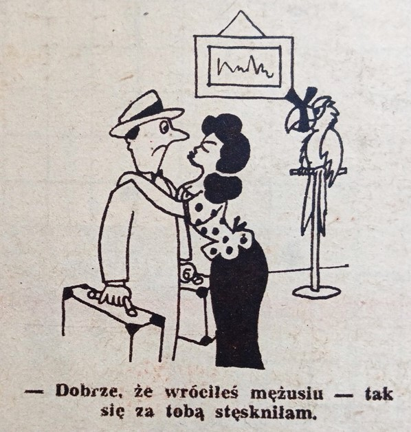
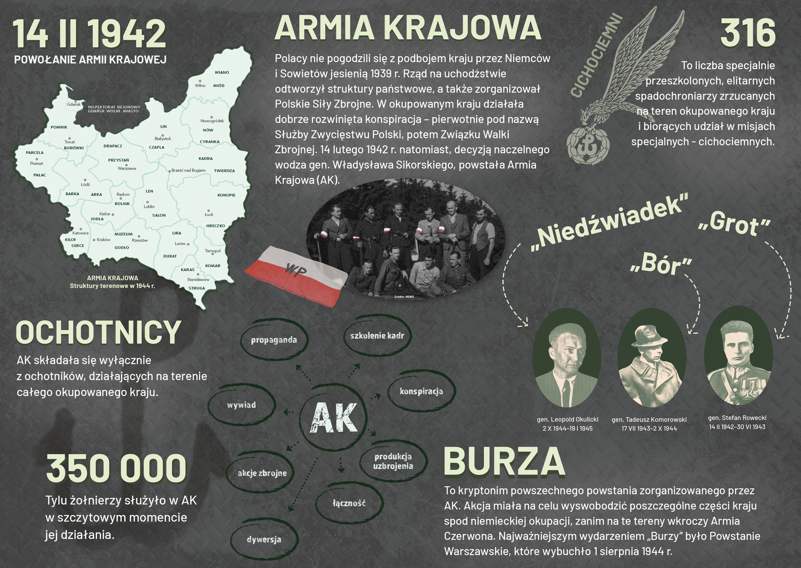
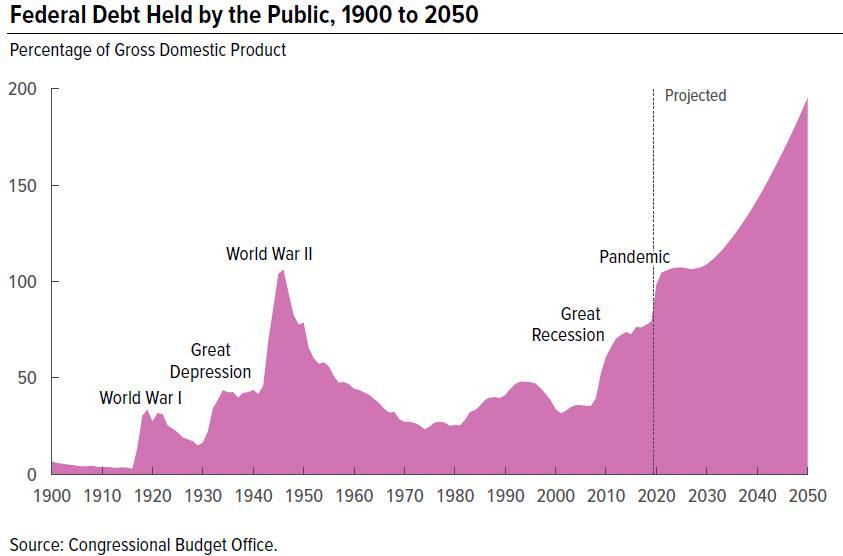
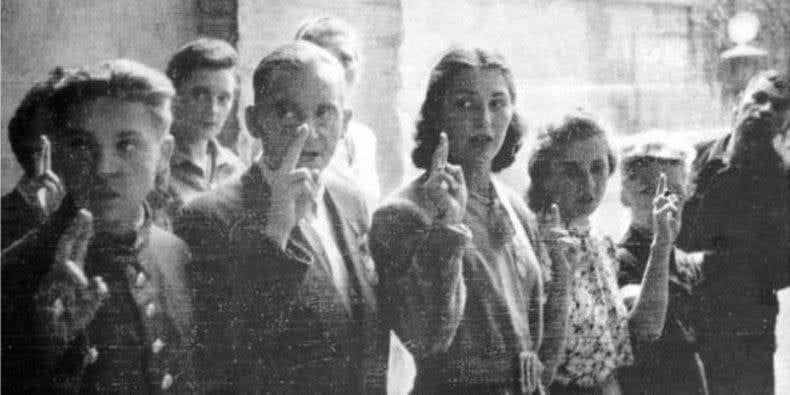

### 2024

  

  

  

### 2023

> The German government must disclose its findings on the #terrorist attacks on NordStream , considering that revelations by Seymour Hersh point to the responsibility of the USA & Norway.

<video width="640" height="480" controls>
<source src="./movies/february/sevim_dagd.mp4" type="video/mp4">
Your browser does not support the video tag.
</video>

### 2022

> "It's fiduciary system, it's all faith based (...) you gotta have confidence in that currency, in that dollar, cause there's nothing back in there"

<video width="640" height="480" controls>
  <source src="./movies/february/nobacked.mp4" type="video/mp4">
Your browser does not support the video tag.
</video>

### 2021

> Bitcoin has made the Nigerian currency Useless & Valueless.

<video width="640" height="480" controls>
  <source src="./movies/february/nigeria2021.mp4" type="video/mp4">
Your browser does not support the video tag.
</video>

---

  

---

> eksperymenty genetyczne — prowadzące do narodzin istot „postludzkich” — są warunkiem koniecznym przetrwania: albo człowiek przekształci sam siebie, albo spadnie do poziomu niewolnika. A ponieważ „człowiek jest wyłącznie informacją, bezcielesną strukturą umysłu, nagim frenem, więc rozwój polega na dążeniu do wykształcenia formy, która będzie tożsama z własną informacją. Aby tę formę przenieść z kodu do manifestacji, potrzebna jest informatyka ontologiczna, czyli technika odtwarzania informacji w każdych warunkach, a zatem od warunków niezależna. Pojawianie się wyższych istot wynika z pobudek ewolucyjnych, lecz jest powiązane z pieniędzmi: przyszłość należy do bogatych, którzy będą mogli kupić sobie mądrość, oraz do inteligentnych, którzy potrafią piąć się w górę Krzywej Progresu. Przepaść między feudalnie zorganizowaną arystokracją a niewolniczą resztą, która utrzymuje na własnym poziomie nieistotną demokrację, będzie zatem rosnąć. Brak znaczenia demokracji wynika stąd, że fizyka, nauka mówiąca o siłach, nigdy nie była demokratyczna, a metafizyka — czyli przyszłościowa wiedza o stwarzaniu warunków fizyki — okazuje się metapolityczna. Kto będzie władał ciałem, posiądzie władzę, która wykroczy poza dzisiejszy zestaw ustrojów. Przyszłe społeczeństwa można więc sobie wyobrazić jako równocześnie demokratyczne i feudalne, choć uwarstwienie to zrodzi się nie dzięki przywilejom urodzenia, lecz przywilejom genetycznego odrodzenia.

### 1946

Rozpoczęły się wysiedlenia ludności niemieckiej z Polski. Decyzję o przeniesieniu Niemców z terytorium Polski, Węgier i Czechosłowacji podjęły zachodnie mocarstwa.
Z trzech milionów Niemców zamieszkujących obszary polskich ziem zachodnich i północnych w ciągu dwóch lat wysiedlono milion. Ludzi tych wywieziono do brytyjskiej i radzieckiej strefy okupacyjnej czyli do RFN i NRD.
W latach 1945 – 1946 przybyło do Polski w ramach tzw. „repatriacji” ze Związku Radzieckiego 1 milion 528 tysięcy Polaków. Wcześniej samorzutnie opuściło dawne Kresy Wschodnie 200 tysięcy osób. Z Niemiec i emigracji powróciło do kraju 2 miliony 300 tysięcy osób, z tego 85% w latach 1945-1946. Ludność ta wraz z autochtonami i osadnikami z przeludnionych obszarów Polski centralnej stanowiła podstawę zasiedlenia ziem zachodnich i północnych, włączając się do ich odbudowy. W 1950 roku na ziemiach tych mieszkało 5 milionów 894 tysięcy ludzi, w. tym tylko 5 % mniejszości narodowych.
Do 1950 roku w wyniku działań podjętych w stosunku do ludności niemieckiej w Polsce terytorium naszego państwa opuściło blisko trzy i pół miliona Niemców.

  

### 1945

1945 roku Krajowa Rada Narodowa wydała dekret o powołaniu Biura Odbudowy Stolicy. Instytucja, na czele której stanął architekt i polityk Roman Piotrowski powstała na bazie utworzonego 22 stycznia 1945 roku Biura Odbudowy miasta stołecznego Warszawy. W struktury BOS, którego skrót Warszawiacy żartobliwie rozszyfrowywali jako "Boże Odbuduj Stolicę" wchodził między innymi Wydział Architektury Zabytkowej, za którego sprawą odbudowane między innymi Stare i Nowe Miasto, Trakt Królewski oraz Łazienki. Biuro Odbudowy Stolicy zostało zlikwidowane w 1951 na mocy Rozporządzenia Rady Ministrów z 6 września 1950 roku.
Zdjęcie; Czerwona tablica informacyjna BOS z 1945 w Centrum Interpretacji Zabytku w Warszawie.

  

---

Wojska 1.Frontu Ukraińskiego wyzwoliły istniejący od 1940 roku niemiecki obóz koncentracyjny Gross -Rosen.
Trudno tu jednak mówić o jakimś spektakularnym akcie oswobodzenia kogokolwiek, ponieważ obóz w chwili wejścia do niego Armii Czerwonej był prawie pusty. Na początku lutego wyruszył bowiem z niego Marsz Śmierci.
Tuż po wkroczeniu Rosjanie dokonali makabrycznych odkryć, które widzieli już wcześniej, m.in. na Majdanku, czy Auschwitz-Birkenau. Główne krematorium KL Gross-Rosen zostało wysadzone w powietrze, ale przy gruzowisku pozostały prochy i fragmenty kości pomordowanych więźniów. W pozostałościach jednego z pieców krematoryjnych odkryto również tylko częściowo spalone zwłoki jednego z więźniów.
W ciągu pięciu lat funkcjonowania obozu życie straciło w nim ponad 40 tysięcy ludzi.
Poniżej fragment wspomnień Mieczysława Mołdawy- byłego więźnia Gross -Rosen (numer obozowy P749)
" To był obóz zdobyty już bez więźniów. Ok. 200 osób zostało wybitych na rewirze, reszta, bardzo mała grupa, została wyratowana; byli to ci, którzy zdołali się jakoś ukryć. I dlatego trudno mówić o pierwszym dniu wolności.
Tę zbliżającą się wolność więźniowie czuli już w styczniu. - Stało nas na apelu ok. 30 tysięcy ludzi, ale nasze twarze były już zupełnie inne. Słyszeliśmy odgłosy walk, czuliśmy, że zbliża się wolność"

  

### 1942

Powstaje Armia Krajowa

Z rozkazu Naczelnego Wodza gen. Władysława Sikorskiego Związek Walki Zbrojnej został przemianowany na Armię Krajową. Na jej czele stanął gen. Stefan Rowecki „Grot”. Zadaniem Armii Krajowej było tworzenie struktur wojskowo-organizacyjnych na czas okupacji, mobilizację społeczeństwa do walki bieżącej. Ochrona Polskiego Państwa Podziemnego oraz odtworzenie armii na czas otwartej walki o niepodległość, czyli przygotowanie kraju do powstania powszechnego. Armia Krajowa była najliczniejszą formacją konspiracyjno-wojskową podczas II wojny światowej, której liczebność w szczytowym okresie wynosiła ok. 400 tys. ludzi.
Rozkazem podanym depeszą o numerze z dziennika podawczego O.VI L. dz. 627/42 Wódz Naczelny gen. Władysław Sikorski przemianował Związek Walki Zbrojnej na Armię Krajową.
1. Znoszę dla użytku zewnętrznego nazwę ZWZ. -Wszyscy żołnierze w czynnej służbie wojskowej w Kraju stanowią "Armię Krajową" podległą Panu Generałowi, jako jej dowódcy.
2. Stanowisko Pana Generała nosi nazwę Dowódcy Armii Krajowej.
3. Pewne specjalne uprawnienia Pana Generała w powyższym charakterze zostaną określone w osobnej instrukcji.
4. Nazwa ZWZ lub inne nazwy konspiracyjne mogą być zachowane na użytek wewnętrzny według uznania Pana Generała.
5. Rozkaz powyższy proszę podać do wiadomości Delegata Rządu.
Naczelny Wódz /-/ Sikorski generał broni.
Rota przysięgi AK:
„W obliczu Boga Wszechmogącego i Najświętszej Marii Panny Królowej Korony Polskiej, kładę swe ręce na ten święty Krzyż, znak męki i Zbawienia. Przysięgam być wiernym Ojczyźnie mej, Rzeczpospolitej Polskiej, stać nieugięcie na straży Jej honoru i o wyzwolenie Jej z niewoli walczyć ze wszystkich sił, aż do ofiary mego życia. Prezydentowi Rzeczypospolitej i rozkazom Naczelnego Wodza oraz wyznaczonemu przezeń dowódcy Armii Krajowej będę bezwzględnie posłuszny, a tajemnicy dochowam niezłomnie cokolwiek by mnie spotkać miało.
Przyjmuję cię w szeregi żołnierzy Armii Polskiej walczącej z wrogiem w konspiracji o wyzwolenie Ojczyzny. Twym obowiązkiem będzie walczyć z bronią w ręku. Zwycięstwo będzie twoją nagrodą. Zdrada karana jest śmiercią.”

  

### 1919

Rozpoczęła się wojna polsko-bolszewicka.
Wojsko polskie w liczbie 360 tysięcy żołnierzy stawiło czoło 950 tysięcznej Armii Czerwonej. Była to walka nie tylko o wolność Polski, ale też o obronę całej Europy przed rozprzestrzeniającą się na zachód falą bolszewizmu. Celem Rosjan było stworzenie Związku Radzieckiego na terenie całej Europy.
Wojna przez cały okres trwania toczyła się równolegle w wymiarze militarnym jak politycznym. Najbardziej znane epizody tej wojny to: wyprawa kijowska, bitwa warszawska, bitwy nad Wieprzem, pod Komarowem i nad Niemnem.
Marsz Armii Czerwonej udało się zatrzymać, a 12 października 1920 roku władze Polski i Rosyjskiej Federacyjnej Socjalistycznej Republiki Radzieckiej podpisały w Rydze postanowienie o zawieszeniu broni.
Jednak definitywnym końcem wojny był dopiero traktat pokojowy podpisany 18 marca 1921 roku.

  

### 1610

II wojna polsko-rosyjska: do obozu króla Zygmunta III Wazy pod Smoleńskiem przybył patriarcha moskiewski Filaret, który w imieniu obozu tuszyńskiego zawarł tajny układ o powołaniu królewicza Władysława na tron carski w zamian za zagwarantowanie wolności wyznawania religii prawosławnej.

W 1609 r. wybuchła wojna Rzeczypospolitej z Rosją. Na początku 1610 r. bojarowie, niezadowoleni z rządów cara Wasyla Szujskiego, ofiarowali koronę carską Władysławowi. Rokowania w tej kwestii prowadził hetman wielki koronny Stanisław Żółkiewski. On też zawarł w imieniu królewicza odpowiedni układ z bojarami i zaprzysiągł warunki elekcji pod Moskwą w dniu 27 sierpnia 1610 r. Koronacja Władysława na cara miała przypieczętować unię Rzeczypospolitej i Rosji. Rozpoczęto nawet bić monety z imieniem nowego cara Władysława Zygmuntowicza (ros. Владислав Жигимонтович). Jednak niechęć Zygmunta III wobec przyjęcia przez syna prawosławia – co było warunkiem bojarów rosyjskich do objęcia tronu cara Rosji – przekreśliła te plany. Wojna polsko-rosyjska trwała jeszcze kilka lat, aż do rozejmu zawartego w styczniu 1619 r. w Dywilinie. I chociaż Władysław nigdy nie włożył na głowę korony carskiej, tytuł wielkiego księcia nosił do 1635 r., nie zważając, że Rosjanie, zrażeni polską polityką, wybrali innego władcę – Michała Romanowa.

  

Wojna pomiędzy II Rzeczpospolitą a Rosją Radziecką nie została nigdy wypowiedziana, niełatwo zatem określić, kiedy dokładnie miała swój początek. Do niedawna przyjmowano, że konflikt wybuchł 14 lutego 1919 r.
Wojna rozpoczęła się 14 lutego 1919 starciem koło miasteczka Mosty na Białorusi, gdzie wysunięte poza wycofujące się jednostki niemieckie oddziały wojska polskiego powstrzymały dalszy marsz na zachód w ramach operacji "Cel Wisła" oddziałów Frontu Zachodniego Armii Czerwonej. Szczupłe siły polskie, składające się z 12 batalionów piechoty, 12 szwadronów kawalerii i 3 baterii artylerii, działały tam na dwóch, dość równomiernie obsadzonych odcinkach frontu. Formacjami odcinka południowego (rzeka Prypeć - miasteczko Szczytno), czyli Grupy Podlaskiej, przemianowanej potem na Grupę Poleską, dowodził gen. Antoni Listowski. Jego oddziały prawym swym skrzydłem utrzymywały łączność z Grupą Wołyńską gen. Edwarda Rydza-Śmigłego i koncentrowały się głównie pod Antopolem na kierunku Brześć-Pińsk i koło Berezy Kartuskiej. Oddziały odcinka północnego (Szczytno-Skidel) należały do Dywizji Litewsko-Białoruskiej gen. Wacława Iwaszkiewicza-Rudoszańskiego, który swoje oddziały skupiał przede wszystkim w rejonie Wołkowyska. Na tych pozycjach wiązano niewielkie siły Armii Czerwonej, której wysiłek wojenny skupiony był jeszcze wówczas przede wszystkim na walce z oddziałami białych.
Na początku marca formacje zgrupowań polskich przeszły do akcji zaczepnej, opanowały na wschodzie Słonim (2 marca) i Pińsk (5 marca), a na północy dotarły pod Lidę, gdzie zatrzymały się na kilka tygodni. Dalsze decyzje w sprawie działań na wschodzie zostały podjęte w pierwszej dekadzie kwietnia, zgodnie z wolą Józefa Piłsudskiego, który uznał konieczność przejęcia inicjatywy na północno-wschodnim teatrze wydarzeń wojennych.
16 kwietnia 1919 wojska polskie rozpoczęły ofensywę. Główne zadanie, jakim było zajęcie Wilna, realizowała grupa jazdy pułkownika Władysława Beliny-Prażmowskiego (9 szwadronów kawalerii i pluton artylerii konnej) oraz grupa piechoty generała Rydza-Śmigłego (3 bataliony piechoty).
Na Lidę uderzyły oddziały generała Zygmunta Lasockiego, na Baranowicze i Nowogródek grupa generała Stefana Mokrzeckiego, a na Łuniniec generała Antoniego Listowskiego.
17 kwietnia opanowano Lidę, 18 kwietnia Nowogródek, 19 kwietnia Baranowicze i Wilno. Po zajęciu Wilna Józef Piłsudski wydał 22 kwietnia 1919 odezwę do mieszkańców byłego Wielkiego Księstwa Litewskiego deklarując samostanowienie wszystkich narodowości przedrozbiorowej Rzeczypospolitej Obojga Narodów.
Dalsze operacje na tym froncie prowadzone przez generała Stanisława Szeptyckiego, przy współudziale wojsk wielkopolskich (m.in. 15 Pułk Ułanów pod dowództwem ppłk. Władysława Andersa) i części "błękitnej armii" generała Hallera doprowadziły do zdobycia Mińska, Bobrujska i Borysowa.
Szeptycki, stając na czele nowo utworzonego Frontu Litewsko–Białoruskiego miał do dyspozycji następujące grupy operacyjne:
gen. Mokrzeckiego (rejon Baranowicz)
gen. Lasockiego (rejon Nowogródka),
płk. Ferdynanda Zarzyckiego (na wschód od Lidy)
gen. Rydza-Śmigłego (rejon Wilna)
Na północnym skrzydle wojska polskie nawiązały łączność z wojskami łotewskimi. W styczniu 1920 Wojsko Polskie zdobyło Dyneburg, który przekazano Łotwie.
W końcu 1919 front wschodni na całej swej długości przebiegał w sposób następujący: Uszyca (lewy dopływ Dniestru) – Płoskirów – Słucz (prawy dopływ Prypeci) – Uborć (prawy dopływ Prypeci) – Ptycz (lewy dopływ Prypeci), a dalej na północ przez Bobrujsk, wzdłuż Berezyny, a następnie przez Lepel i Połock do Dyneburga.
We wrześniu 1919 kody szyfrowe zarówno Armii Ochotniczej gen. Antona Denikina jak i przede wszystkim kody szyfrowe Armii Czerwonej zostały złamane przez polski radiowywiad pod kierownictwem por. Jana Kowalewskiego. Miało to rozstrzygające znaczenie dla podejmowania decyzji przez Naczelnego Wodza Józefa Piłsudskiego.

### 44 p.n.e.

Gajusz Juliusz Cezar został obwołany przez senat Republiki Rzymskiej dyktatorem wieczystym, najwyższym kapłanem, imperatorem i ojcem ojczyzny.

Rzeczownik cesarz, podobnie jak car, wywodzą się bezpośrednio od nazwiska słynnego Rzymianina, jednak on sam nigdy nie został obwołany królem. Miesiąc przed śmiercią, dokładnie 14 lutego 44 roku, odmówił koronacji, wiedząc, że tytuł królewski jest od wieków znienawidzony przez Rzymian. Senat ogłosił go natomiast dyktatorem wieczystym (dictator in perpetuum), najwyższym kapłanem, imperatorem i Ojcem Ojczyzny (pater patriae) przy jednoczesnym zachowaniu pozorów ustroju republikańskiego.

Warto wspomnieć, że według badań językoznawczych, nazwisko Caesar najprawdopodobniej wymawiano „kajzar”. Cognomen ten ma nieznaną etymologię, choć sam Juliusz twierdził, że pochodzi od punickiego wyrazu oznaczającego słonia – imponującego zwierzęcia, które pełniło istotną rolę w prywatnej mitologii polityka.

  

---

<a href="https://github.com/TomaszWaszczyk/historia.waszczyk.com/edit/master/src/content/february-14.md" target="_blank">Edytuj tę stronę dzieląc się własnymi notatkami!</a>
