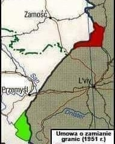
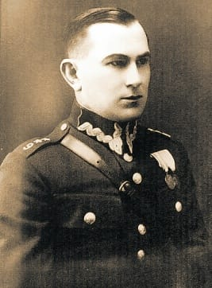
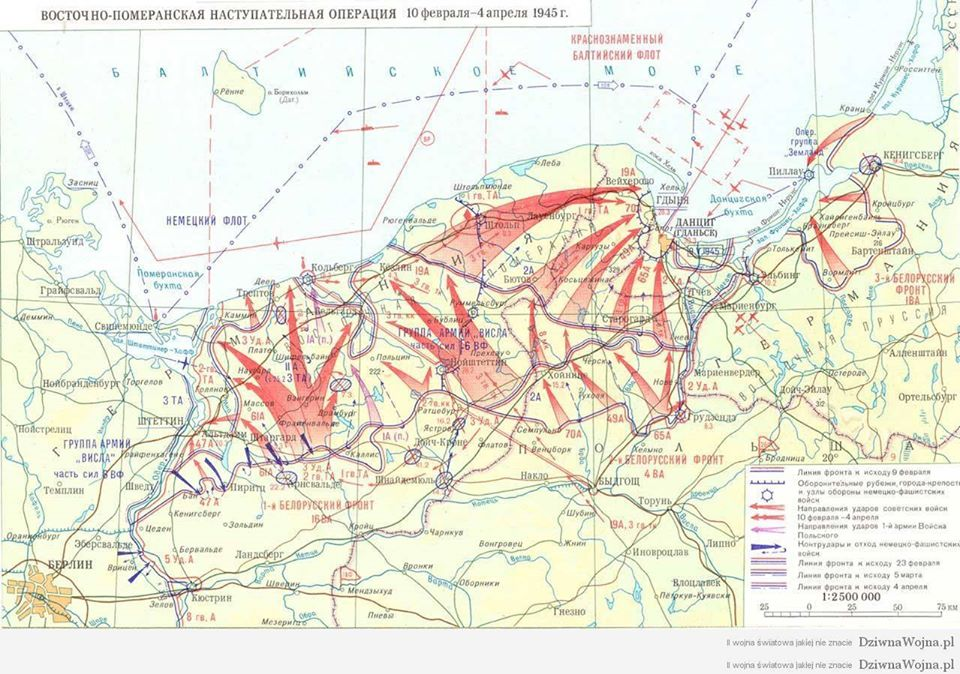
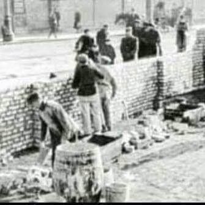
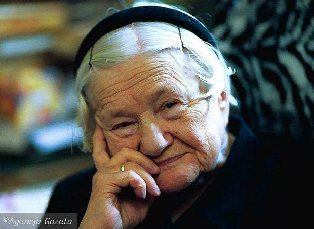
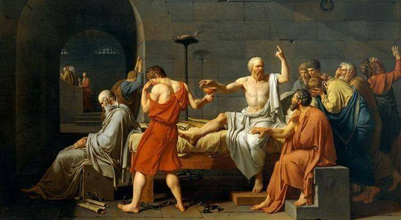

### 2022

> "Kanadyjskie banki otrzymały polecenie przyjrzenia się rachunkom i korzystaniu z usług bankowych "wszystkich, którzy uczestniczyli w nielegalnych blokadach". Banki mają przekazywać informacje o wspieraniu blokad policji (RCMP) lub służbom wywiadu CSIS), będą też mogły zawieszać prowadzenie rachunków bez konieczności uzyskiwania postanowienia sądu"

---

Stopień alarmowy obowiązuje od 15 lutego 2022 r. od godz. 23:59 do 28 lutego 2022 r. do godz. 23:59.

Stopień ALFA-CRP jest najniższym z czterech stopni alarmowych określonych w ustawie o działaniach antyterrorystycznych.

Oznacza to, że administracja publiczna jest zobowiązana do prowadzenia wzmożonego monitoringu stanu bezpieczeństwa systemów teleinformatycznych. Instytucje publiczne będą m.in. monitorować i weryfikować, czy nie doszło do naruszenia bezpieczeństwa komunikacji elektronicznej.

---

### 2021

  

  

  

  

  

  

### 1951

Weszła w życie polsko-radziecka umowa o zmianie granic. Ta jedna z najistotniejszych zmian granic w naszej historii była w rzeczywistości kolejną radziecką grabieżą polskich ziem. Część województwa lubelskiego czyli miejscowości: Bełz, Uhnów, Krystynopol, Waręż,Chorobrów i Sokalszczyzna, bogate w złoża węgla kamiennego i gazu ziemnego znalazły się po radzieckiej stronie. Rekompensatą za to było przyznanie Polsce części ubogiego w gleby i "bogatego" w wyeksploatowane złoża ropy obwodu drohobyckiego czyli miejscowości: Ustrzyki Dolne, Czarna, Lutowiska, Bystre, Krościenko, Bandrów Narodowy i Liskowate.
W sumie wzajemna wymiana terytoriów objęła
obszar o powierzchni 480 km kw. W oficjalnym komunikacie o korekcie granic Polski władze informowały, że "rząd RP zwrócił się do rządu ZSRR z prośbą o zamianę niewielkiego pogranicznego odcinka Polski na równorzędny mu przygraniczny odcinek terytorium ZSRR z powodu ekonomicznego ciążenia tych odcinków do przyległych regionów ZSRR i Polski. Rząd ZSRR zgodził się na prośbę rządu RP".
Owa "korekta" była również, a może przede wszystkim tragedią zwykłych ludzi zamieszkujących te tereny, ponieważ wyrzucano ich z całym dobytkiem z domów bez pytania o zgodę i przesiedlano w obce im strony.
W roku 1952 miała wejść w życie kolejna taka "korekta" w ramach której powiaty hrubieszowski i tomaszowski miały zostać wcielone do ZSRR. Realizacji tego planu zaniechano ze względu na śmierć Stalina.

  

### 1945

Rozkaz podpułkownika Władysława Liniarskiego (zdjęcie) o utworzeniu Armii Krajowej Obywatelskiej z dnia 15 lutego 1945 roku.

"Wojna trwa! Dopóki na polskiej ziemi będzie jeden zaborczy sołdat czy bojowiec obcego państwa-wojna trwa! Bo co robi komandir, bojowiec NKWD na naszej Świętej Ziemi? Kradnie nasz dobytek, rabuje, gwałci nasze siostry, morduje ojców i matki, broniących swych córek. Wywieziono do Rosji żelazo, zapasy z magazynów, pozostałe maszyny z fabryk, drugie tory z niektórych linii kolejowych, sprzęt rolniczy z pasa wysiedlonego. Wycięto lasy. Aresztowano w Białostockiem 85 000 najlepszych naszych braci, wywieziono z tego do Rosji 48 000. Pozostałych w więzieniach katuje się w bestialski sposób (...) Dojdzie do Waszej wiadomość, że Armia Krajowa jest rozwiązana ze względów czysto politycznych. Ale Armia Krajowa Obywatelska nie może być rozwiązana, bo nie oddacie rodzonej córki, mowy, wiary, zagrody-na łup rosyjskiego zaborczy, który chce wcielić Polskę do Rosji, a całą ludność Polski wywieźć do Syberii, do rosyjskich kopalń, kołchozów. Armia Krajowa Obywatelska istnieje nadal. Dowódca wydał rozkaz-'Będziecie nadal przewodnikami Narodu!"

  

---

https://de.wikipedia.org/wiki/U_96_(Kriegsmarine)

---

Rozpoczęła się bitwa pancerna o Stargard (Operacja Sonnenwende).

Była to jedna z ostatnich niemieckich prób przejęcia chwilowej inicjatywy na froncie wschodnim, mająca pozwolić w założeniach na lepsze przygotowanie obrony Berlina.

Przebieg operacji

Ofensywa rozpoczęła się między 15 a 16 lutego 1945 roku z rejonu Suchania w kierunku południowym na Choszczno. Nacierającym wojskom udało się połączyć z oddziałami pod Choszcznem i utworzyć do nich wąski korytarz. Następnego dnia ruszyło główne uderzenie, z linii pomiędzy Stargardem a jeziorem Miedwie. Pomimo osiągnięcia pewnych sukcesów terenowych i zniszczenia wielu czołgów radzieckich, natarcie miało dość słabe tempo. 17 lutego generał Wenck uległ wypadkowi samochodowemu, co wyłączyło go z dowodzenia. Wieczorem tego samego dnia rozpoczęły się kontrataki oddziałów radzieckiej 3. Armii Uderzeniowej i natarcie niemieckie zostało praktycznie powstrzymane. Następnego dnia Niemcy oficjalnie wstrzymali dalsze działania zaczepne.

10 Dywizja Pancerna SS została włączona do XXXIX Korpusu Pancernego. Działania zaczepne 10. Dywizji Pancernej SS napotkały na silną obronę wojsk sowieckich. Następnego dnia dywizja nacierała w kierunku Morzycy (niem. Blumberg), obchodząc pozycje wojsk sowieckich. Dalej atak 2 batalionu 10 Pułku Pancernego SS i 22 Pułku Grenadierów Pancernych SS był skierowany na południowy zachód do Żalęcina i Moskorzyna. Na przedmieściach tego miasta dowódca 7 kompanii 10 Pułku SS – Ostuf. Riedel zniszczył 13 nieprzyjacielskich czołgów. 1 batalion 10 Pułku Pancernego SS nacierał bardziej na południe w kierunku Lubiatowa. Tam wspierał natarcie 4 Dywizji Policyjnej Waffen SS. 23 lutego dywizja przeszła odwodu i wycofana do Stargardu.

W walkach o tereny miedzy Małą Iną a Iną brali udział żołnierze Volkssturmu oraz Walończycy. Fala szturmowa przesunęła się tylko o około dziesięć kilometrów na południe. Niemcy zdobyli przed północą Kolin i Morzycę. Był to jedyny sukces. Sztaby już wtedy sygnalizowały energiczne kontrataki Rosjan. Zdołano wedrzeć się na krótki czas do przydworcowej części Dolic, gdzie doszło do zaciekłego pojedynku, w którym Niemcy wykorzystywali pociąg pancerny. Nad centrum ofensywy, nad Stargard wysłano całą masę samolotów rosyjskich. O dwudziestej drugiej w świetle rac rozpoczęło się niszczenie miasta. Najsilniejsze uderzenie Rosjan zostało skierowane na wzniesienie Lipia Góra (k. miejscowości Przewłoki), który był ważnym węzłem drogowym. Zajęło tam pozycję siedemdziesięciu niemieckich żołnierzy. Porucznik Capelle otrzymał rozkaz utrzymania się na wzniesieniu przez dwadzieścia cztery godziny. Ostatecznie obrona ważnego punktu zakończyła się niepowodzeniem.

Fragmenty z opracowań historycznych:

W drugiej dekadzie stycznia Armia Czerwona rozpoczęła ofensywę zimową. 15 stycznia siły 1. Frontu Białoruskiego przełamały obronę wojsk niemieckich na Wiśle, rozcinając je na dwa zgrupowania. Już 31 stycznia wojska 2. Armii Pancernej Gwardii i 5. Armii Uderzeniowej dotarły nad Odrę w okolicach Kostrzyna. Dowództwo wojsk niemieckich, chcąc ratować powstałą sytuację, poderwało swe wojska do jeszcze jednego wysiłku – wzięcia udziału w operacji „Sonnenwende„. Celem jej było rozcięcie z północy na południe (do Gorzowa Wlkp.) klina radzieckich wojsk marszałka Gieorgija Żukowa i opóźnienie uderzenia 1. Frontu Białoruskiego na Berlin o 4-6 tygodni.

Na początku lutego rozpoczęła się na Pomorzu Zachodnim koncentracja wojsk niemieckich przeznaczonych do wzięcia udziału w operacji. Ze względu na jej ważność głównie były to jednostki SS, np. z Kurlandii przybył transport morski z jednostkami III Korpusu Pancernego SS, składającymi się m.in. z ochotników z „krajów germańskich” (Holendrów, Duńczyków, Norwegów, Finów…), np. 11. Ochotniczej Dywizji Grenadierów Pancernych SS „Nordland”, 23. Ochotniczej Dywizji Grenadierów Pancernych SS „Nederland” czy 27. Ochotniczej Dywizji Grenadierów Pancernych SS „Langemarck”. Spod Baden-Baden transportem kolejowym nadciągnęła 10. Dywizja Pancerna SS „Frundsberg”, której dokuczały po drodze naloty alianckiego lotnictwa. Pomimo rozkazów nieangażowania świeżych sił w walki bieżące przed rozpoczęciem operacji, kolejne jednostki rzucane były w wir walk.

tak o kryptonimie „Sonnenwende” (Przesilenie dnia z nocą), przeprowadzony przez 3 armię pancerną, spowodował maleńkie wgniecenie na odcinku bronionym przez 2 armię pancerną gwardii i 61 armię z Frontu Żukowa, ale został powstrzymany już 17 lutego. Tego dnia Wenck, wracając na front po konferencji z Hitlerem w Berlinie, zasnął za kierownicą i uderzył w balustradę mostu. Ciężko rannego zastąpił gen. Hans Krebs, oficer sztabowy z najbliższego otoczenia Hitlera, któremu brakowało doświadczenia i niezależności myślenia, niezbędnych do utrzymania inicjatywy w swoim ręku. Chociaż do 19 lutego operacja „Sonnenwende” dobiegła końca, wywarła jednak nieproporcjonalnie duże wrażenie na radzieckim naczelnym dowództwie, potwierdziła bowiem jego coraz silniejsze obawy związane ze słabością prawego skrzydła Żukowa. Marszałek przed dalszym natarciem na kierunku berlińskim otrzymał polecenie oczyszczenia Pomorza.

Wynikiem decyzji było zniszczenie Grupy Armii „Wisła”. Rokossowski zaczął działania 24 lutego, podczas gdy Żuków w dalszym ciągu przegrupowywał siły na swoim prawym skrzydle. Dowódca l Frontu Białoruskiego przeszedł do ofensywy tydzień później. Jego potężne zgrupowanie w składzie: 2 i 1 armie pancerne gwardii oraz 2 armia uderzeniowa, podążyło w stronę Bałtyku, rozszerzyło działania na cale Pomorze i rozczłonkowało Grupę Armii „Wisła” na odizolowane jednostki. 4 marca l armia pancerna gwardii dotarła do Bałtyku pod Kołobrzegiem, na linii rozgraniczającej kierunki natarć l i 2 Frontu Białoruskiego, odcinając niemiecką 2 armię i zmuszając ją do wycofania się w rejon Gdyni i Gdańska. Hitler natychmiast ogłosił zapchany uciekinierami Kołobrzeg kolejną „twierdzą”.

  

### 1941

Mary Berg zapisała w swoim pamiętniku z getta warszawskiego: ,,Ulice getta są zamykane jedna po drugiej. Teraz przy pracach murarskich są zatrudniani Polacy. Hitlerowcy nie ufają już żydowskim murarzom, którzy rozmyślnie zostawiali w wielu miejscach luźne cegły, żeby przemycać żywność lub uciekać w nocy przez te otwory na ,,drugą stronę''. Teraz mury rosną coraz wyżej i wyżej i nie ma już luźnych cegieł. Szczyt muru jest pokryty grubą warstwą gliny zmieszanej z tłuczonym szkłem, żeby pociąć ręce ludzi próbujących ucieczki. Ale Żydzi wynajdują wciąż nowe sposoby. Rury kanalizacyjne nie zostały odcięte - tą drogą otrzymuje się małe worki mąki, cukru, kaszy i inne artykuły. Podczas ciemnych nocy próbują robić dziury w murach. Usunięcie jednej cegły wystarcza. Przygotowuje się specjalne paczki odpowiadające wymiarom tym otworom. Są także inne sposoby. Na granicy między gettem a ,,drugą stroną'' jest wiele zbombardowanych domów. Piwnice tych domów często tworzą długie tunele ciągnące się przez trzy, cztery lub pięć posesji. Większość szmuglu idzie właśnie tędy. Niemcy wiedzą o tym, ale nie są w stanie kontrolować całego ruchu (...)"

  

### 1938

https://en.wikipedia.org/wiki/General_Motors_streetcar_conspiracy

### 1910

1910 r. urodziła się w Warszawie Irena Sendlerowa, Sprawiedliwa wśród Narodów Świata, dama Orderu Orła Białego, kierowniczka referatu dziecięcego Rady Pomocy Żydom („Żegoty”). W czasie II wojny światowej zaangażowała się w działalność konspiracyjną oraz wiele akcji społecznych. W wyniku działań Ireny Sendlerowej i współpracujących z nią osób uratowano ok. 2500 żydowskich dzieci, wywożąc je z warszawskiego getta i ukrywając u polskich rodzin, w sierocińcach oraz klasztorach. W czasie Powstania Warszawskiego była sanitariuszką na Mokotowie. Po wojnie pracowała w opiece społecznej. Przez długie lata jej działalność podczas okupacji była nieznana. W 2007 i 2008 została zgłoszona do Pokojowej Nagrody Nobla. Zmarła 12 maja 2008 roku.

  

### 399 p.n.e.

Został skazany na karę śmierci poprzez wypicie trucizny Sokrates, grecki filozof, uznany, obok Platona i Arystotelesa, za największego filozofa starożytności.
Proces Sokratesa uczy nas, że istnieje nierozwiązywalne napięcie między żądaniami moralnego czy religijnego sumienia a uzasadnionymi potrzebami społeczności.
Wielkie filozoficzne niebezpieczeństwo, jakie tkwi w Obronie Sokratesa, polega na tym, że oślepieni godnością i niewinnością Sokratesa oraz tak krytyczni wobec pełnych wad Ateńczyków – nie zauważymy głębokiego moralnego dylematu, który kryje się za tym procesem i za tą śmiercią – pisze Richard Kraut w książce „Reason and Religion in Socratic Philosoph”, której fragment opublikowaliśmy w 2. numerze Teologii Politycznej
W niniejszym szkicu pragnę poruszyć dwa zagadnienia związane z oskarżeniem oraz skazaniem Sokratesa: jedno natury historycznej, drugie – filozoficznej. Pytanie historyczne brzmi: czy można znaleźć zadowalające wytłu­maczenie przyczyn oskarżenia i skazania Sokratesa? Pytanie filozoficzne zaś: czego uczy nas to historyczne wydarzenie? Sąd nad Sokratesem pozostaje kamieniem milowym naszej historii kultury; wydaje się, że ma dla nas wciąż niesłabnące znaczenie. Ale jakie dokładnie jest to znaczenie? Nie uda nam się odpowiedzieć na to pytanie filozoficzne, dopóki nie odpowiemy na historyczne: dlaczego Sokratesa skazano na śmierć?
Dlaczego Sokrates stanął przed sądem:
Przebieg rozprawy Sokratesa znamy głównie z Platońskiej Obrony Sokratesa. Platon sugeruje, że był jej naocznym świadkiem: w pewnym momencie każe Sokratesowi wskazać na widownię i powiedzieć, że „ten tutaj Platon” proponuje sporą sumę jako grzywnę. Można mieć jednak pewne podejrzenia, czy Platon nie kłamie. Sam fakt, że pozwala sobie zagrać pomniejszą rolę w Obronie Sokratesa, nie jest jeszcze niepodważalnym dowodem na to, że tam rzeczywiście był – mógł przecież zmyślić całą mowę. Jednak taka hipoteza wydaje się zbyt daleko idąca, bo u starożytnych trudno byłoby znaleźć choćby cień wątpliwości co do tego, że Platońska Obrona Sokratesa jest zgodna z prawdą historyczną. Starożytni Grecy i Rzymianie nie byli łatwowierni; oni – a przynajmniej współcześni Platonowi – wiedzieli, czy Obrona Sokratesa jest, czy nie jest zmyślona, i z pewnością, gdyby tylko któryś z nich zarzucił Platonowi nieprawdę, dowiedzielibyśmy się o tym. Toteż niewielu uczonych wątpi dziś w to, że Platon rzeczywiście był obecny na rozprawie, oraz w to, że Obrona Sokratesa nie jest całkowitą fikcją literacką. Nie oznacza to jed­nak oczywiście, że jesteśmy w posiadaniu do­słownej mowy obrończej Sokratesa, bez żadnych modyfikacji, dodatków, upiększeń czy zmian w kompozycji autorstwa Platona. Obrona nie powinna być czytana jako zapis, ale raczej jako interpretacja mowy Sokratesa. I pierwszy problem, który chcę tu poruszyć, dotyczy tego, czy może ona zaspokajać naszą historyczną ciekawość. Sokrates tłumaczy nam w Obronie, dlaczego został postawiony przed sądem. Czy powinniśmy uznać, że to, co mówi, to nie tylko prawda, ale wręcz cała prawda?
Twierdzi, że znalazł się przed sądem dlatego, że już od dłuższego czasu pada ofiarą niesłusznych oskarżeń. Według tych starych oszczerców „Sokrates, człowiek mądry, i na gwiazdach się rozumie, i co pod ziemią, to on wszystko wybadał, i ze słabszego zdania robi mocniejsze”. Ci zaś, którzy badają zjawiska astro­nomiczne i geologiczne, uważani są za ateistów; nie uznają słońca i księżyca za bogów, ale twierdzą, że to tylko kawał kamienia czy jakiegoś innego materiału. A Sokratesa uważa się za jednego z nich. Podobnie, według tych starych oszczerców, Sokrates jest jednym z sofistów, którzy podróżują od miasta do miasta i namawiają młodzież, by ich zatrudniała w roli nauczycieli retoryki potrzebnej w dyskusji i przemowach. Mówi się o nich, że psują młodzież, ponieważ dają im narzędzia politycznej władzy, ale nie uczą ich zasad moralnych – potrzebnych, by się mądrze tymi narzędziami posługiwać.
Sokrates jest przekonany, że jego nowi oskarżyciele po prostu przejęli te błędne pogłoski, uznawszy je za prawdziwe, a jednocześnie nie mają żadnych innych podstaw do swoich zarzutów. Mówią, że Sokrates nie uznaje bogów, których państwo uznaje, ale inne, nowe duchy – bo mylą go z filozofami przyrody; oskarżają go o psucie młodzieży – bo mylą go z sofistami. Trzeba przyznać, że pozornie Sokrates rzeczywiście przypomina sofistę, bo młodzi ludzie garną się do niego, a on wciąga ich w dyskusje. Lecz jednocześnie, jak utrzymuje, różni się od nich diametralnie, ponieważ nie obiecuje ich czegokolwiek nauczyć i nie żąda za­płaty.
Bez wątpienia fakty, do których Sokrates nawiązuje, stanowią po części odpowiedź na zarzuty postawione przeciw niemu w sądzie. Z pewnością filozofowie przyrody i sofiści bu­dzili wrogość oraz podejrzenia, że ich działalność jest bezbożna i niemoralna. Sokrates zaś mógł, w ogólnym odczuciu, kojarzyć się z tą grupą, ponieważ – nawet jeśli sam nie badał rzeczy niebieskich – analizował wierzenia, opierając się na rozumowych przesłankach. Gdyby spotkał kogoś, kto sformułował argument wspierający tezę, że słońce to kamień, Sokrates zastanowiłby się nad takim argumentem bez uprzedzeń, zamiast z miejsca go od­rzucić. I chociaż nie obiecywał niczego nauczyć i nie żądał zapłaty, jego przeciwnikom takie różnice między nim i sofistami mogły się wydawać mniej znaczące niż podobieństwa. Tak jak oni chlubił się swoimi zdolnościami do przeprowadzania argumentacji oraz miał duże powodzenie wśród młodych. Sądzę zatem, że wyjaśnienia Sokratesa przytoczone w Obronie pozwalają zrozumieć, dlaczego już od dłuższe­go czasu wzbudzał w Ateńczykach wrogość, i niewątpliwie możemy się tu także doszukać częściowej odpowiedzi na pytanie, dlaczego został postawiony przed sądem i skazany.
Jednakże nie wierzę, by tylko to dawało nam pełną i wyczerpującą odpowiedź. Przede wszystkim wydaje się, że w Atenach w V wieku p.n.e. panowała dość niezwykła wolność intelektualna. Filozofowie przyrody i sofiści, z którymi mylono Sokratesa, prowadzili nadal swoją działalność bez większych przeszkód i ingerencji prawa. Stwierdzając ten fakt, poruszam zagadnienie niezmiernie kontrowersyjne, ponieważ niejeden wybitny uczony będzie twierdzić coś wprost przeciwnego. W znakomitym dziele Grecy i irracjonalność E. R. Dodds pisze, że schyłek V wieku był okresem, gdy wielu intelektualistów zostało skazanych za brak ortodoksyjnych przekonań – lista obejmuje Protagorasa, Eurypidesa, Anaksagorasa, Aspazję, Damona, Diagorasa i Sokratesa. Gdyby teza Doddsa była prawdziwa, znikłoby źródło naszego problemu, bo należałoby wtedy wpisywać proces Sokratesa w szerszy kontekst, a jego śmierć uznać za potwierdzenie szerszej zasady. Jednak większość uczonych jest przeciwna tej tezie, ponieważ antyczne świadectwa, na których oparł ją Dodds, są wysoce niepewne[3]. Wygląda na to, że sofiści i filozofowie przyrody zostali pozostawieni w spokoju i mogli kontynuować swoje naukowe zainteresowania. I to właśnie sprawia, że proces i śmierć Sokratesa są takie niepokojące – dlaczego tylko jego spotkały takie konsekwencje intelektualnych dociekań? Nawet jeśli uwierzymy, że – jak twierdzi w Obronie – istniała pewna niechęć względem sofistów i filozofów przyrody, nie tłumaczy to, dlaczego ta wrogość doprowadziła w jego wy­padku do postępowania sądowego, gdy innych pozostawiono w spokoju. Trudno się oprzeć wrażeniu, że musiały istnieć jakieś wyjątkowe czynniki, które wytłumaczyłyby, dlaczego postawiono go przed sądem i skazano, a nie uczyniono tego wobec kogoś innego spośród nieortodoksyjnych intelektualistów. Jest oczywiście możliwe, że to tylko dzieło przypadku, szczególnego pecha, a to, co mówił i czynił, nie było mniej obraźliwe od tego, co mówili lub czynili pozostali. Nie powinniśmy jednak od razu poprzestawać na takiej konkluzji. Musimy się zastanowić, czy w zachowaniu Sokratesa było coś takiego, co spowodowało, że ogólny nastrój wrogości wobec intelektualistów zamanifestował się w akcie prawnym wymierzonym właśnie przeciw Sokratesowi, a nie przeciw pozostałym.
Istotne znaczenie mogła mieć zła sława pewnych osób blisko z Sokratesem związanych, takich jak Alcybiades czy Kritias, pierwszego jako zdrajcy demokracji, drugiego – jednego z Trzydziestu Tyranów, który zaledwie kilka lat przed procesem Sokratesa dzierżył przez chwilę władzę. Z pewnością te znajomości mogły go kosztować kilka głosów, gdy sędziowie decydowali o wyroku. Co więcej, Sokrates nawet nie próbuje ukryć przed sędziami, że jest wrogiem demokracji. W rozmowie z jednym z oskarżycieli mówi, że z zasady to wielu psuje młodzież, a tylko niewielu, czyli ci, którzy są w tej dziedzinie biegli, wie, jak młodzież naprawiać. Mówi też sędziom, że rządy demokratyczne w sposób nieunikniony opierają się na niesprawiedliwości i łamaniu prawa. Jeśli weźmiemy pod uwagę to, co Platon pisze o Sokratesie gdzie indziej, zrozumiemy, że przy podejmowaniu decyzji zamiast głosowania proponował docieranie do wiedzy. Nie znaczy to, że Sokrates popierał tendencje oligarchiczne. Był tak przeciwny tradycyjnej oligarchii, jak był przeciwny demokracji, bo przecież żadna z nich nie niosła ze sobą prawdy. Mimo to jego dalekie od populizmu uwagi musiały wywoływać niechęć – i to także spowodowało pewnie utratę kilku sędziowskich głosów. Być może jeden z jego oskarżycieli wniósł skargę między innymi dlatego, że Sokrates irytował go swoim sprzeciwem wobec populizmu, bo przecież jeden z nich, Anytos, był właśnie wpływowym przywódcą demokratów.
Choć antydemokratyczne elementy filozofii Sokratesa mogły mieć jakiś wpływ na jego oskarżenie i skazanie, byłoby błędem wnioskować, że oskarżenie o treści religijnej stanowiło tylko pretekst. W jego religijnych przekonaniach i praktykach był co najmniej jeden wyjątkowy element – daimonion, boski znak czy głos, który przychodził nieoczekiwanie i nieustannie chronił go przed błędnymi decyzjami. Nikt nigdy nie twierdził, że otrzymuje takie bezpośrednie, osobiste wskazówki od bogów; w powszechnym przekonaniu, jeśli bogowie dają wskazówki, czynią to raczej poprzez uznane zwyczajowo wyrocznie, które z kolei objaśniają kapłani i kapłanki wybrani zgodnie z ogólnie przyjętymi normami. Boski znak, który Sokrates – jak sądzi – otrzymuje, jest zatem radykalną zmianą; i z pewnością ma związek z naszym problemem, jako że Sokrates został oskarżony o uznawanie nowych duchów. Sokrates mówi w Obronie wprost, że gdy Meletos przedstawiał swoje oskarżenie odpowiednim władzom, boski znak został wspomniany i wyśmiany. Co więcej, w Eutyfronie, gdy Sokrates opowiada, że został oskarżony o tworzenie nowych bogów, Eutyfron od razu odpowiada: „bo ty zawsze mówisz, że ci się ten boski głos odzywa”.
Zanim przejdę do dalszych rozważań nad politycznym znaczeniem tego boskiego znaku, przypomnijmy sobie pokrótce to zjawisko charakterystyczne dla Sokratesa. Co się dokładnie działo, gdy Sokrates dostawał wskazówki? Czy słyszał głosy? Czy był szalony? Czy może to religijne przeżycie było tylko blefem? Jest tu jeszcze inna zagadka: jak łączył posłuszeństwo wobec boskich znaków z zasadą, że zawsze kieruje się rozsądkiem, dokądkolwiek on prowadzi? Wydaje się, że spełnianie wskazówek boskiego głosu łączy się z zawieszaniem swoich własnych zdolności oceny oraz ze zdaniem się na autorytet. Jak to możliwe, że Sokrates czyni tak i jednocześnie głosi potrzebę racjonalnego uzasadniania wszystkiego, co robimy i w co wierzymy?
Proponuję następującą historię jako najlepszy sposób znalezienia sensu w tych zeznaniach. Stosunkowo wcześnie Sokrates zaczął od czasu do czasu doświadczać pewnego wzniosłego i niepokojącego uczucia, gdy rozmyślał, lub zaraz po tym, gdy rozmyślać przestawał. Nie powinniśmy uznawać, że odczucia te były czymś tak określonym i niedwuznacznym jak głosy dające wskazówki. Mogły to być raczej mgliste i tajemnicze wrażenia, które on rozumiał jako ostrzeżenie dane mu z zewnątrz. I oczywiście, żyjąc w społeczeństwie, w którym nadzwyczajne zjawiska przypisywano bogom, Sokrates uznał, że otrzymuje od bogów swoiste napomnienia. Jeśli decydował się na jakiś czyn, a otrzymywał ten dziwny, niepokojący sygnał – uznawał go za znak, że w jego decyzji tkwi jakiś błąd i odpowiednio ją zmieniał. A ilekroć tak właśnie postąpił, uświadamiał sobie potem, że podjął słuszną decyzję, a alternatywa, przed którą ostrzegło go dziwne przeczucie, byłaby złym wyborem, choć nie mógł o tym wiedzieć, gdy podejmował decyzję. Gdy odkrył tę znaczącą, niezmienną zależność między przeczuciem i podejmowaniem słusznej decyzji, Sokrates doszedł do rozsądnego wniosku, że otrzymuje boskie wskazówki. Spełniając boskie napomnienia, nie odrzucał swoich zdolności krytycznych, bo boski znak wytrzymał krytyczny egzamin – oto sam rozum wskazywał, że znak od bogów zawsze pomaga w podjęciu słusznej decyzji. Tak więc Sokrates poddał się jego rozkazom.
Ale dlaczego ktokolwiek miałby pozywać Sokratesa za to, że – jak twierdzi – bogowie przychodzą do niego i dają mu specjalne rady? Jest to wprawdzie niespotykany fenomen, ale sam fakt, że jest czymś nowym, nie tłumaczy, dlaczego pozostali mieliby czuć się nim aż tak zaniepokojeni, że postanowili oskarżyć Sokratesa o bezbożność. Co więcej – czyny, które podejmował Sokrates biorący pod uwagę boskie wskazówki, nie były czynami religijnego fanatyka; nie groziły podważeniem społecznej tkanki miasta. Dlaczego więc nie zignorowano daimoniona jako zwykłego dziwactwa?
Twierdzę, że Sokrates budził trwogę, bowiem odbierano jego opowieści o otrzymywaniu boskich rad jako oznaki wywyższania się ponad całą religijną strukturę Aten. Boski głos nie uraziłby specjalnie nikogo, gdyby był tylko zjawiskiem odosobnionym – ale nie był. Musiał być raczej odbierany przez współczesnych jako element postawy aroganckiego i lekceważącego stosunku do tradycyjnej religii. Utrzymując, że bogowie dają mu znaki, Sokrates sugerował swoją wyższość wobec pozostałych, bo to on wiedział lepiej niż ktokolwiek inny, czego życzą sobie bogowie. Oznaczało to także, że nie potrzebuje on religijnych tradycji i instytucji polis, by pośredniczyły między nim i bogami oraz interpretowały ich życzenia. Mógł porozumiewać się z nimi osobiście, więc nic go nie powstrzymywało przed odrzuceniem instytucji państwa–miasta i postępowaniem zgodnie ze swoją prywatną misją religijną. Jeśli na boski znak spojrzeć jako na element aroganckiej postawy, Sokrates ukaże się nam jako osoba rzeczywiście bardzo niebezpieczna. Nie próbuje nawet ukryć swojego poczucia wyższości, wręcz przeciwnie – postawiony przed sądem za wywyższanie się ponad miasto, ogłasza, że jest spośród Ateńczyków najmądrzejszy. Sędziom oświadcza wprost, że jeśli wyrok zakazałby mu kontynuowania jego religijnej misji, złamie go raczej, niżby miał być nieposłuszny bogom. Jeśli spojrzeć na to w taki sposób, boski znak nie jest już taki niewinny. Opowieści o boskich wskazówkach wyglądają raczej na insynuację, że tradycyjne instytucje religijne są nieistotne, a jednostka ma większe znaczenie niż polityczne decyzje całego miasta. To dlatego boski znak, choć stanowił część oskarżenia, budzi tak mało zainteresowania podczas procesu – to nie sam znak tak przeraził Ateńczyków, ale nielojalność i antytradycjonalizm, które implikował. I dlatego Sokrates opiera swoją obronę przede wszystkim na pokazaniu, jak bardzo leży mu na sercu prawdziwe dobro jego współobywateli. Wie bowiem, że prawdziwy problem tkwi nie w samym znaku, ale w całym jego zachowaniu.
Jest jeszcze coś, co musimy sobie uświadomić, jeśli chcemy zrozumieć, dlaczego Sokrates był postrzegany jako zagrożenie. Centralnym punktem jego filozofii jest teza, że cnota jest wiedzą. Co za tym idzie, ten, kto jest prawdziwie pobożny lub – jakbyśmy mogli powiedzieć – prawdziwie religijny, musi poważnie przemyśleć kwestię bogów oraz relacji między bogami i ludźmi. Jeśli ktoś poprzestaje tylko na uczestnictwie w religijnych ceremoniach nadzorowanych przez miasto, przychodzi na uroczystości, składa odpowiednie ofiary i unika nieczystości, przed którymi ostrzega tradycja, żadna z tych czynności nie będzie dla niego źródłem prawdziwej cnoty pobożności, bo wszystko to można wykonywać zupełnie bezmyślnie. Nie powinno nam umknąć radykalne przesłanie, jakie niesie to stwierdzenie dla konwencjonalnych praktyk religijnych – tradycyjne obrządki religijne są zwykłą stratą czasu, jeśli stanowią tylko zewnętrzne formy. Nie oznacza to, że Sokrates nie uczestniczył w zwyczajowych miejskich i religijnych uroczystościach, albo że krytykował kogokolwiek za uczestniczenie w nich. Równie dobrze mógł je uważać za niezbędny warunek pobożności. Ważne jednak, że jego filozofia zobowiązywała go do nieuznawania żadnych wystarczających warunków. Ci, którzy wypełniają zalecenia nakazane przez tradycję i nie robią nic więcej, nie są prawdziwie pobożni i mają zły stosunek do bogów. To może nam pomóc zrozumieć, dlaczego ktoś mógł oskarżyć Sokratesa o to, że nie wierzy w bogów miasta. Bogowie miasta to tacy bogowie, których cieszą tradycyjne ofiary i zwyczaje, a w pewnym sensie jest prawdą, że w takich bogów Sokrates nie wierzył. Jego boski znak można łatwo zrozumieć jako nowego boga, który miałby być ważniejszy od tradycyjnych bóstw miejskich, a przez to – wręcz je zastąpić.
Oczywiście Sokrates nie zgadza się z oskarżeniem o to, że nie wierzy w bogów miasta, i łatwo możemy zrozumieć, dlaczego jest w stanie bronić swojej niewinności z czystym sumieniem. Jest przekonany, że jego współobywatele mylą się co do istoty bogów i ich oczekiwań. Wydaje się im, że bogowie pragną od ludzi konkretnych rzeczy – czci oddawanej podczas uroczystości albo przedmiotów składanych w ofierze. Od takiego błędu już niedaleko do innego, o wiele poważniejszego, który ludzie robią, określając, o co warto zabiegać – zupełnie zapominają o troszczeniu się o duszę, a skupiają się na powierzchownych celach, takich jak potęga, bogactwo czy status społeczny. Zatem we własnym mniemaniu Sokrates broni się tak, jak powinien – krytykuje wartości, które stoją za religijnymi obyczajami współobywateli. Jest przekonany, że bogowie chcą, byśmy dążyli do mądrości poprzez poznawanie siebie i innych, a nie zadowalają ich czcze rytuały i zewnętrzne formy.
Jeśli weźmiemy pod uwagę wszystkie wymienione tu czynniki, łatwo zrozumiemy, dlaczego Sokrates został oskarżony i skazany. Uprzedzenia wobec intelektualistów i naukowców działały na jego niekorzyść; podobnie jego niechęć do demokracji. Bez względu na to, czy to właśnie stanowiło motywację dla jego oskarżycieli, z pewnością z tych właśnie powodów wielu sędziów ustosunkowało się wrogo do Sokratesa. Ale najważniejszym czynnikiem, jak argumentowałem powyżej, była pobożność, czy raczej jej brak. Sokrates był słusznie postrzegany jako ktoś, kto podważa podstawy tradycyjnych praktyk religijnych, a jego powoływanie się na boski głos świadczyło o tym, że uważa się za kogoś wyjątkowego w całej społeczności, za kogoś lepszego, co było sprzeczne, jak rozumowano, z lojalnością dobrego obywatela. I tę swą postawę arogancji, nielojalności i braku szacunku dla tradycji szerzył wśród młodych. Nic dziwnego więc, że postrzegano go jako zagrożenie dla społeczności – znacznie większe zagrożenie niż ci ekscentryczni inte­lektualiści, którzy badają niebiosa albo nauczają, jak przemawiać i dyskutować.
Jednocześnie – choć teraz już widzimy, dlaczego Sokrates był postrzegany jako zagrożenie – musimy wciąż pamiętać o tym, że niewiele brakowało, by został uniewinniony. Jak wytłumaczyć głosy tych, którzy byli w dość licznej mniejszości? Nie wydaje się prawdopodobne, że udało mu się przekonać tak pokaźną liczbę sędziów, iż jego moralne i religijne poglądy są słuszne, a ich – nie. Nie zdołałby w jeden dzień i w rozmowie z tak licznym przeciwnikiem zmienić sposobu rozumowania słuchaczy, skoro właśnie to próbował osiągnąć poprzez osobiste dyskusje przez całe swoje życie. Bardziej prawdopodobne wydaje się, że po prostu nigdy nie popełnił żadnego aktu bezbożności i nikt mu go nigdy nie zarzucił, jako że dla większości Ateńczyków pobożność była po prostu kwestią pewnego zachowania – a Sokrates zachowywał się bez zarzutu. Paradoksalnie, to utożsamienie religijności i zachowania zgodnego z obyczajem jest odzwierciedleniem właśnie tych przekonań, które Sokrates atakował. Mało brakowało, a uratowałyby go przekonania, które sam krytykował.
Zastrzeżenia Platona:
Przejdę teraz do drugiego pytania postawionego na początku tego szkicu: czego uczy nas proces i śmierć Sokratesa? Zanim jednak zajmę się tym problemem, chciałbym wskazać, że Platon wyciągnął z całego tego wydarzenia wnioski zgoła inne, niż robią to zwykle współcześni czytelnicy. Co ciekawe, uważa, że Sokrates nie zachowywał się poprawnie i że sam ponosi częściowo winę za swoją śmierć. W Państwie zaleca, żeby młodzieży nie pozwalano na uczestniczenie w tego typu dyskusjach, jakie zapoczątkował Sokrates. Twierdzi, że w kwestionowaniu tradycyjnych moralnych założeń, które młodzi ludzie otrzymują od swoich rodziców, kryje się poważne niebezpieczeństwo: gdy podważy się takie przekonania, młody człowiek zarzuca je zupełnie i równie dobrze może robić wszystko, co kiedyś uważał za godne pożałowania, skoro zniszczone zostały podstawy jego etycznych wyborów. Platon jest przekonany, że lepiej poczekać, aż młodzi ludzie dojrzeją, zanim włączy się ich do filozoficznych dyskusji, ponieważ dojrzalsze osoby trudniej wprowadzić w błąd. Jest oczywiste, że mówiąc to, Platon ma na myśli Sokratesa i gani swojego mistrza za zwracanie się ze swoimi pytaniami do wszystkich bez wyjątku.
Bardziej ogólnym zarzutem Platona przeciw Sokratesowi jest to, że nie możemy wymagać, by wszyscy prowadzili życie zracjonalizowane – większość ludzi jest bardzo przywiązana do tradycyjnych obrzędów religijnych i podważanie ich wiary jest błędem, bo nie są oni w stanie zostać filozofami. Sokrates żądał błędnie, by jego współobywatele poszukiwali tego rodzaju wiedzy, którą odkrywa się tylko wtedy, jeśli ktoś poświęci się długim filozoficznym rozważaniom. Jednak większość ludzi, według Platona, potrzebuje czegoś prostszego. Religijne obyczaje powinny zostać oczyszczone ze swoich najgorszych błędów, ale nawet w najlepszym razie wierzenia i praktyka religijna może się co najwyżej zbliżać do prawdy o istotach boskich. To niezwykłe, że Platon napisał zarówno obronę Sokratesa, jak i zaatakował go w Państwie – można się zastanawiać, w jaki sposób autor, który w swoim wczesnym utworze dał tak dramatyczny obraz szlachetności i wybitności Sokratesa, niewiele później przyznał, że przeciwnicy Sokratesa też mieli swoje racje, bo tak naprawdę miał on zgubny wpływ na młodzież i w pewnym sensie ją psuł. Możliwe, że Platon zmienił zdanie po napisaniu Obrony Sokratesa i zwrócił się przeciw temu, którego kiedyś podziwiał, ale – jak sadzę – jest równie prawdopodobne, że od samego początku uważał, iż w procesie Sokratesa wina leży po obu stronach, choć wina Aten jest nieporównywalnie większa.
Nieprzemijający dylemat:
Chciałbym w tym miejscu wrócić do zagadnienia, które odwlekałem od jakiegoś czasu, czyli do kwestii, jaką naukę powinniśmy wyciągnąć z procesu Sokratesa. Podkreślałem dotąd, że choć jego antydemokratyczna filozofia narobiła mu wrogów, oskarżenie o bezbożność nie powinno być lekceważone i nie było wyłącznie pretekstem. To był proces religijny, a nie polityczny prowadzony pod jakąś przykrywką. Dziś, jeśli zadamy sobie pytanie, czy Sokrates powinien zostać skazany za bezbożność – trudno nam odpowiedzieć inaczej jak przecząco. Obrona Sokratesa przekonuje nas, że Sokrates był osobą głęboko wierzącą, jeśli przez pobożność rozumiemy zdolność do szczerego poświęcenia się temu, co boskie. Taka koncepcja pobożności, jaką miał Sokrates – niepoprzestawanie na wypełnianiu zaleceń danej społeczności odnośnie do pewnych standardów zewnętrznych zachowań religijnych – dziś wydaje się nam bardzo przekonująca. Jednocześnie zaprotestujemy prawdopodobnie dlatego, bo jesteśmy przekonani, że nie ma właściwie znaczenia, czy Sokrates był pobożny, czy nie. Ważniejszy wydaje się fakt, że Ateny postąpiły wobec niego niesprawiedliwie przez samo ustalenie i egzekwowanie prawa przeciw bezbożności. Możemy zatem powiedzieć, że nawet jeśli Sokrates był ateistą, nie powinien być sądzony za jakiekolwiek przestępstwo, bo czyjeś praktyki religijne i wiara nie powinny interesować nikogo poza nim samym.
Jednak gdy tylko to powiemy, uświadomimy sobie, że podnosimy argument, którego sam Sokrates nigdy by nie użył. Sokrates nawet przez moment nie wątpi, że prawo przeciw bezbożności jest najzupełniej słuszne; on próbuje jedynie dowieść, że sam tego prawa nie złamał. Mimo to możemy upierać się, że i on, i wszyscy pozostali starożytni mylili się co do moralnej zasady, którą w dzisiejszych czasach uznajemy za oczywistą, tj. że każda istota ludzka ma prawo do wolności wyznaniowej. Zgodnie z tym sposobem myślenia państwo nie powinno popierać żadnych wierzeń czy praktyk, ani żadnych przekonań co do tego, jak powinny one wyglądać. Stosunek państwa do religii powinien być zupełnie neutralny. A z procesu Sokratesa możemy wynosić taką naukę, że za wymuszanie pobożności przez państwo, czy nawet za wymuszanie określonego rozumienia pobożności, płaci się bardzo wysoką cenę. Gdy państwo angażuje się w sprawy religii, w sposób nieunikniony popełnia błędy i skazuje tych naprawdę wielkich.
Mam jednak dwa zastrzeżenia co do takiego rozumienia procesu Sokratesa. Po pierwsze, zgadzam się całkowicie, że byłoby to zupełnie nierozsądne, gdyby państwo takie jak Stany Zjednoczone uchwaliło prawo przeciw bezbożności lub popierało jakąś określoną koncepcję bycia pobożnym. Doktryna o rozdzielności państwa od Kościoła w naszym wypadku sprawdza się i zmiana tego stanu rzeczy nie rozwiązałaby żadnych problemów, z którymi się borykamy. Przykładowo: poprawka do konstytucji pozwalająca na modlitwę czy chwilę ciszy w szkołach publicznych nie sprawi, że dzieci staną się bardziej religijne czy choćby odrobinę lepsze. Motywy tych, którzy taką zmianę proponują, wydają mi się co najmniej podejrzane. Jednakże – i to jest moje drugie zastrzeżenie – nie wierzę, żeby rozdzielność państwa i Kościoła była podstawową zasadą sprawiedliwości, obowiązującą zawsze i wszędzie. Sądzę raczej, że jest ona odpowiednia dla naszego kraju, biorąc pod uwagę jego historię, tradycję i demografię. Nie mamy i nigdy nie mieliśmy religii panującej, a jakikolwiek gest uczyniony w tym celu spowodowałby wrogość i niestabilność polityczną, bez żadnych korzyści. Jednocześnie nie sądzę jednak, żeby było coś z istoty swej niesprawiedliwego w takim systemie politycznym, który państwu daje znacznie większą swobodę ingerowania w życie religijne obywateli. W pewnych sytuacjach zaangażowanie państwa w sprawy religijne nie budzi sprzeciwu. I nie rozumiem, dlaczego właśnie Ateny miały być potępione za to, że regulowały życie religijne, wspierając uroczystości sakralne i rozpowszechniając określone rozumienie, czym jest pobożność. W starożytności nikt nie był ciemiężony przez takie instytucje. Prawdą jest, że Sokrates został skazany niesłusznie. Ale fakt, że został skazany niesłusznie, nie jest dowodem, że nie powinno być prawa przeciw pobożności, tak jak niesłuszne skazanie człowieka oskarżonego o morderstwo nie udowadnia, że nie powinno być prawa przeciw zabijaniu.
Żeby uniknąć nieporozumienia, pozwolę sobie od razu zaznaczyć: nie przekonuję tutaj, że to, co jest ogólnie przyjęte przez daną społeczność, jest poza krytyką i musi być dla danej społeczności słuszne. Takie przekonanie byłoby swo­jego rodzaju relatywizmem w sferze wartości, a ja taki relatywizm odrzucam. Załóżmy, że w danej społeczności kobiety otrzymują połowę opieki medycznej, jaka przysługuje mężczyznom, a taka sytuacja jest przez wszystkich akceptowana, ponieważ zarówno mężczyźni, jak i kobiety są przekonani, że mężczyźni jako istoty wyższe mają prawo do większych dóbr. Naszą odpowiedzią na taki przykład powinno być stwierdzenie, że kobiety są tu traktowane niesprawiedliwie, nawet jeśli one same są nauczone akceptować taką sytuację. Mówiąc tak, zgadzamy się jednocześnie z przekonaniem, że kobiety nie zasługują na gorsze traktowanie tylko dlatego, że są kobietami. Jestem natomiast przekonany, że doktryna o rozłączności państwa i Kościoła nie ma tak fundamentalnego statusu jak równość płci. Zasada równości płci jest zasadą podstawową i jej prawdziwość nie zależy od tego, czy dana społeczność ją akceptuje, czy nie. I odwrotnie – rozłączność państwa i Kościoła powinna odgrywać znacznie mniej zasadniczą rolę w naszych moralnych przekonaniach. Wypływa ona z rozsądnej interpretacji konstytucji, ale – jak już powiedziałem – jest to związane z pewnymi cechami Ameryki, jej ludzi i historii.
Pragnę teraz wrócić do pytania o proces Sokratesa. Próbowałem dowieść, że istnienie prawa przeciw bezbożności nie było samo w sobie niesprawiedliwe i byłoby błędem wnioskować na podstawie tego procesu, że takie prawo w ogóle nie powinno istnieć. Byłoby jednakże dziwne, gdybyśmy myśleli, że w całym tym wydarzeniu nie ma żadnego filozoficznego przesłania. Zamiast tego chcę więc pokazać, że ów proces obrazuje zderzenie się dwóch perspektyw myślenia – obu słusznych i nie do pogodzenia. Spojrzenie na to w taki sposób będzie do pewnego stopnia bliskie Platonowi, ponieważ – jak widzieliśmy – sympatyzował on do pewnego stopnia z oskarżeniem, że Sokrates psuje młodzież, choć jednocześnie bardzo Sokratesa podziwiał. Nie uznaję Platońskiego argumentu, że Sokrates krzywdził młodzież, ale mimo to myślę, że należy mieć pewne zrozumienie zarówno dla oskarżenia, jak i dla obrony. Jest tak dlatego, że między uzasadnionymi żądaniami politycznej społeczności a bardziej fundamentalnymi zasadami może istnieć konflikt, którego nie da się rozwiązać.
Wytłumaczę to na następującym przykładzie. Pewni obieralni urzędnicy Stanów Zjednoczonych składają przysięgę, że będą stać na straży konstytucji. Wymaga się tej przysięgi, ponieważ należy się upewnić, że urzędnicy państwowi nie będą mieli jakiś innych zobowiązań, które by ich odwiodły od stania na straży najważniejszego w państwie prawa. Składając przysięgę, dają słowo, że ponad wierność konstytucji nie przedłożą żadnych religijnych zasad czy własnej moralności. Żądanie od nich takiej przysięgi wydaje się najzupełniej rozsądne. Jako wyborcy nie chcemy, żeby nasi wybrani przywódcy odrzucali nasze prawo, na­wet jeśliby, czyniąc tak, postępowali zgodnie z jakimś wyższym prawem. A teraz wróćmy do Sokratesa i jego stwierdzenia, że posłucha raczej bogów niż obywateli Aten. Wiemy, że nie było to dla niego nietypowe, raczej wpisywało się w ogólną zasadę – jego boski znak dawał mu specjalny dostęp do boga i zapewniał mu taki sposób podejmowania decyzji, jaki był niedostępny zwykłym obywatelom. Takie nastawienie Sokratesa sprawiało, że nie mógłby on złożyć przysięgi, którą uznajemy za rozsądną w wypadku wybieralnych urzędników państwowych. Nie mógłby ślubować najwyższego posłuszeństwa konstytucji, ponieważ uważał, że posłuszeństwo wobec bogów jest ważniejsze niż wobec dokumentu stworzonego przez ludzi, a więc niezmiernie niepewnego. A zgodnie ze sposobem myślenia rozpowszechnionym w świecie starożytnym, osoba, która ze względu na swoje religijne przekonania nie nadawała się do pełnienia funkcji obieralnych urzędników, nie nadawała się też do pełnienia funkcji dobrego obywatela. Dobry obywatel musiał bowiem być gotowy do spełnienia swojego obowiązku i zajęcia odpowiedniego urzędu.
Taki sposób widzenia Sokratesa jest niewygodny, ponieważ dowodzi, że religijne przekonania mogą być szkodliwe dla rozsądnych zasad moralnych i politycznych. Możemy powiedzieć, że na istotę religijnych wierzeń składa się ich fundamentalna natura – cóż w końcu może być bardziej podstawowego niż boski porządek? Jednocześnie wydaje się jednak, że pojęcie dobrego obywatela politycznej społeczności zakłada także zapewnienie współobywateli, że będziemy przestrzegać zasad, które uznają pozostali członkowie społeczności. Jeśli zaś mamy do czynienia z różnicami wyznaniowymi między obywatelami, co dzieje się często – nawet w tak homogenicznym społeczeństwie jak starożytne Ateny – wtedy bycie dobrym obywatelem wchodzi w konflikt z czyimiś religijnymi przekonaniami. W takich wypadkach nie ma chyba dobrych rozwiązań. Fundamentalna natura przekonań religijnych wymaga od każdego, by odrzucił społeczność jako źródło zobowiązań. Co więcej, nikt, kto traktuje moralność poważnie, religijny czy nie – nie może uważać grupy za niezawodne źródło norm określających, co jest dobre, a co złe. A jednak inni członkowie społeczeństwa mają słuszne powody, by od każdego wymagać przestrzegania norm dobrego obywatela. Wartości religijne i polityczne mogą wejść w konflikt i niemożliwe jest określenie z góry, że jakieś wartości są ważniejsze; że grupa ma zawsze rację, wymagając czegoś od jednostki, lub że jednostka ma zawsze rację, nie zgadzając się z grupą.
Odpowiedzią Platona na ten problem było opisanie idealnego miasta, w którym koncepcja sprawiedliwości i, co za tym idzie, poprawne religijne przekonania i praktyki są akceptowane przez wszystkich. Tu nie może powstać konflikt między filozofami takimi jak Sokrates i niefilozoficzną społecznością po prostu dlatego, że filozofowie pilnują, by społeczność podzielała ich przekonania. Ale, z czego Platon zdawał sobie sprawę, takie rozwiązanie jest możliwe tylko w bardzo rzadkich wypadkach. W zwykłym świecie zawsze istnieje prawdopodobieństwo, że odmienne koncepcje pobożności wyznawane przez jednostkę i społeczeństwo wejdą w konflikt, i żadna ze stron nie będzie uznawała za rozsądne ustąpić przeciwnej.
Tak więc, najogólniej rzecz biorąc, proces Sokratesa uczy nas, że istnieje nierozwiązywalne napięcie między żądaniami moralnego czy religijnego sumienia – a uzasadnionymi potrzebami społeczności. Żadna polityczna społeczność nie może i nie powinna pozwalać jednostkom na wyłamywanie się spod ogólnie przyjętych zasad, ale jednocześnie istnieją normy ważniejsze niż te, które dana grupa uznaje. Wielkie filozoficzne niebezpieczeństwo, jakie tkwi w Obronie Sokratesa, polega na tym, że oślepieni godnością i niewinnością Sokratesa oraz tak krytyczni wobec pełnych wad Ateńczyków – nie zauważymy głębokiego moralnego dylematu, który kryje się za tym procesem i za tą śmiercią.

  

---

<a href="https://github.com/TomaszWaszczyk/historia.waszczyk.com/edit/master/src/content/february-15.md" target="_blank">Edytuj tę stronę dzieląc się własnymi notatkami!</a>
