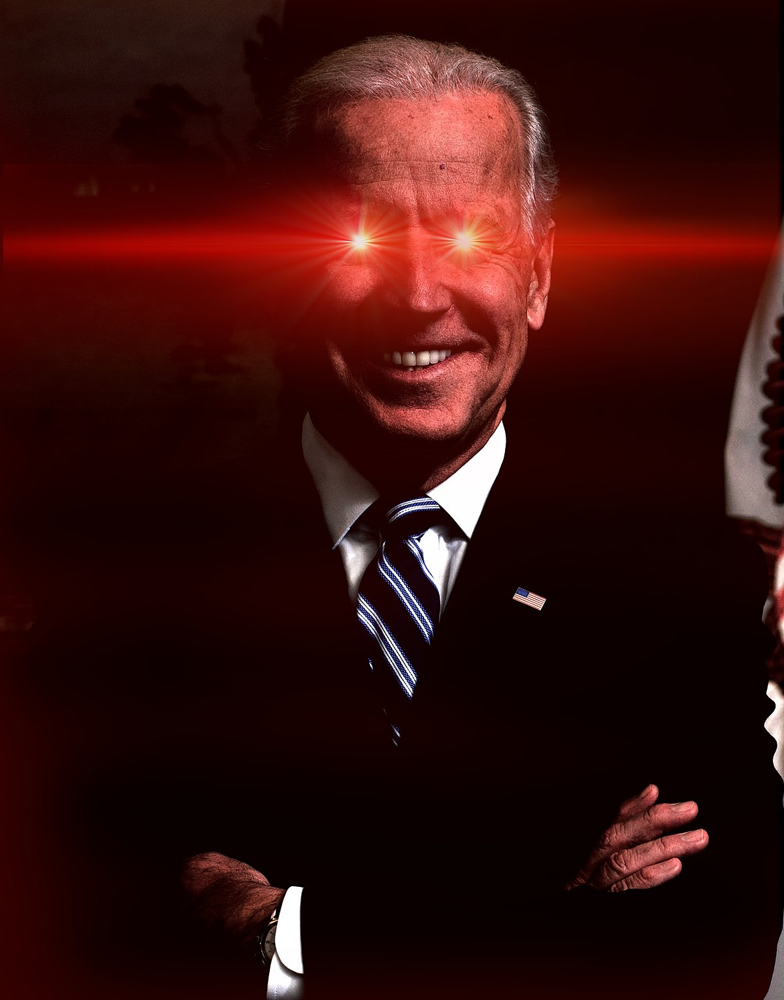
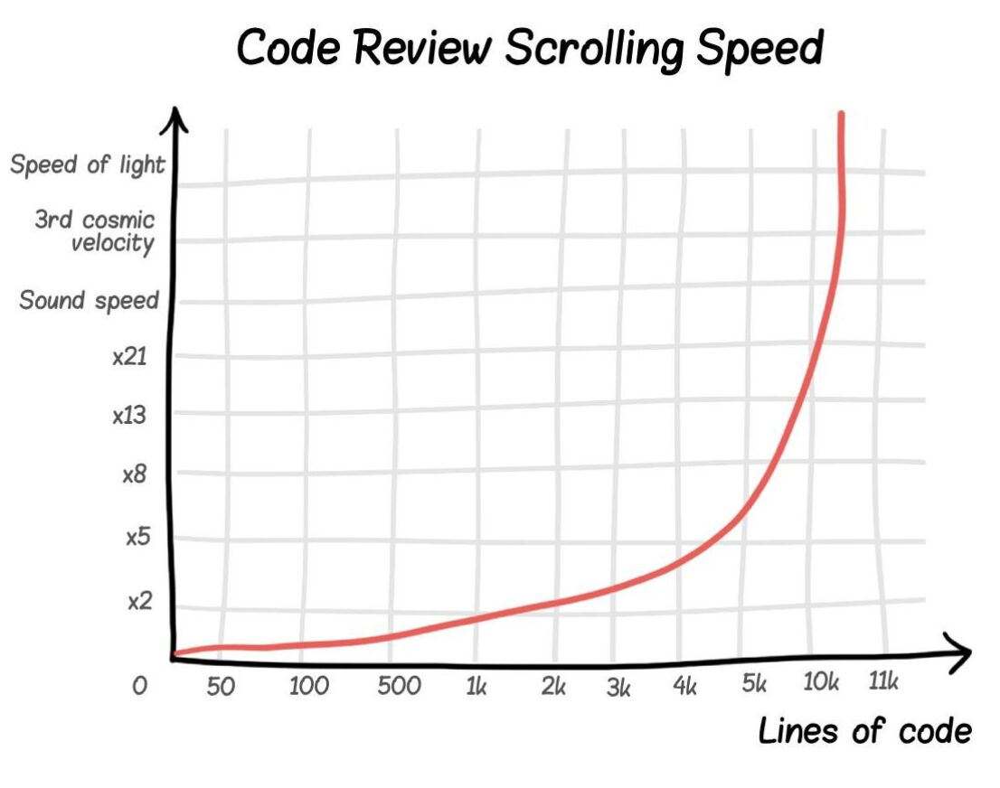
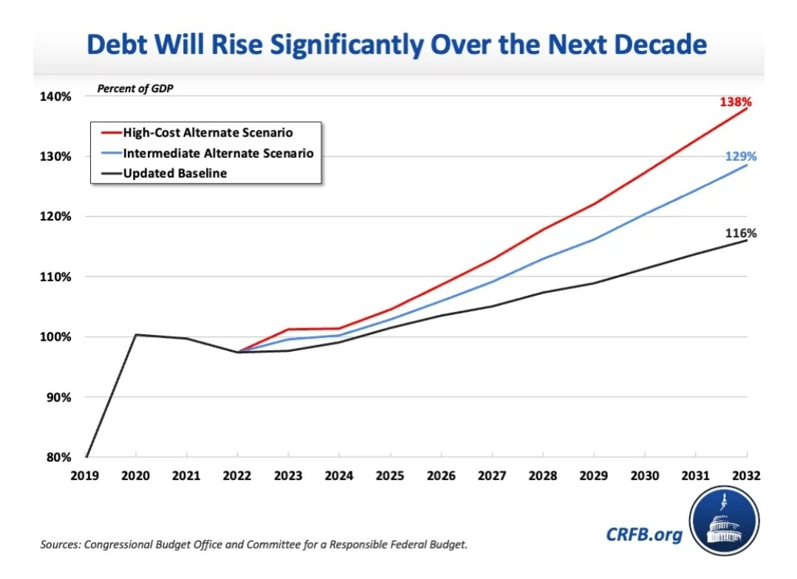
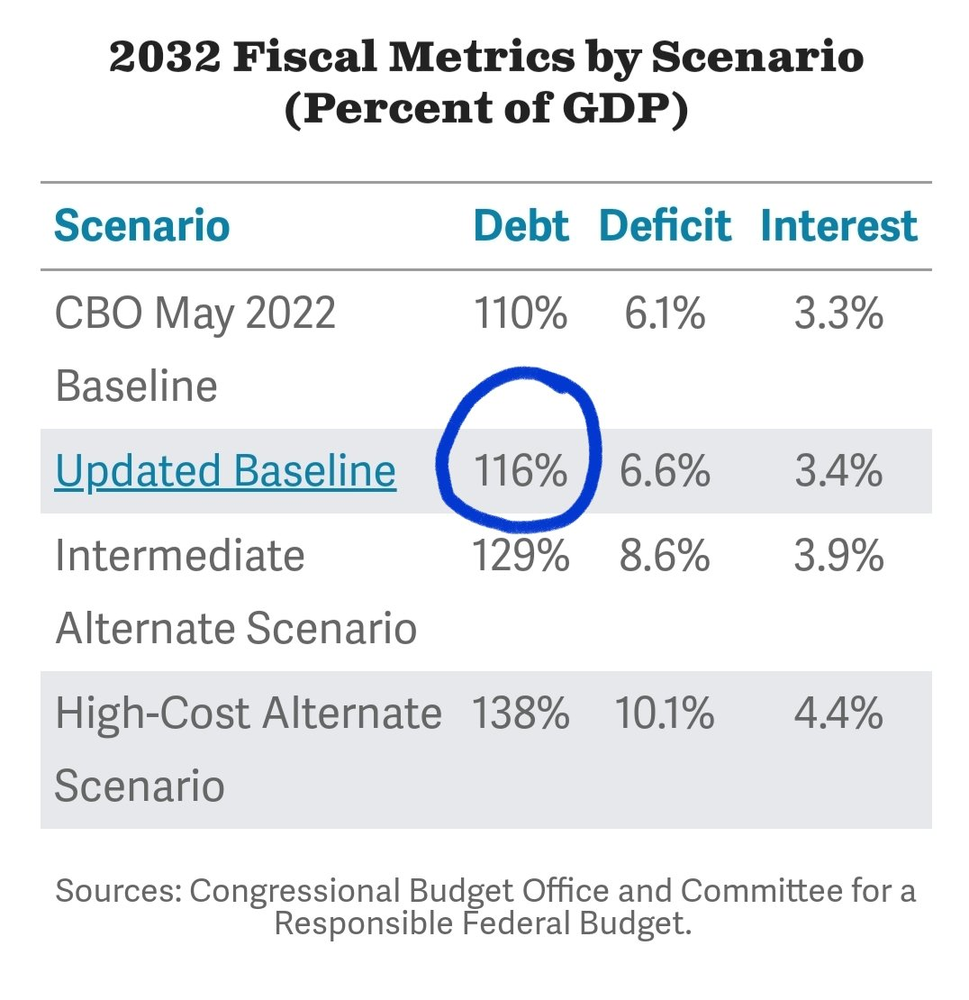
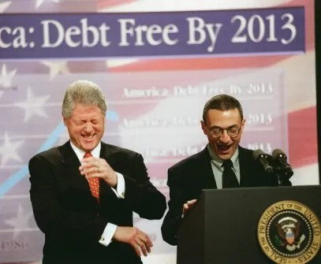
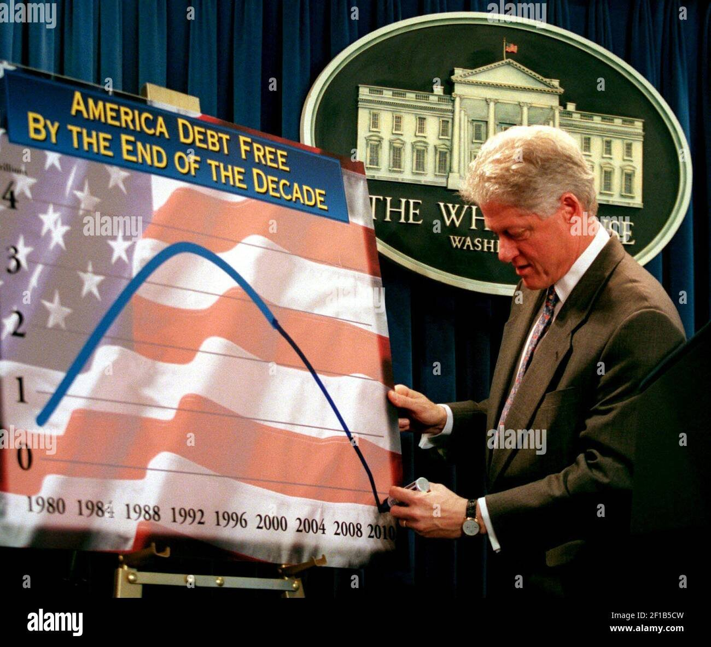
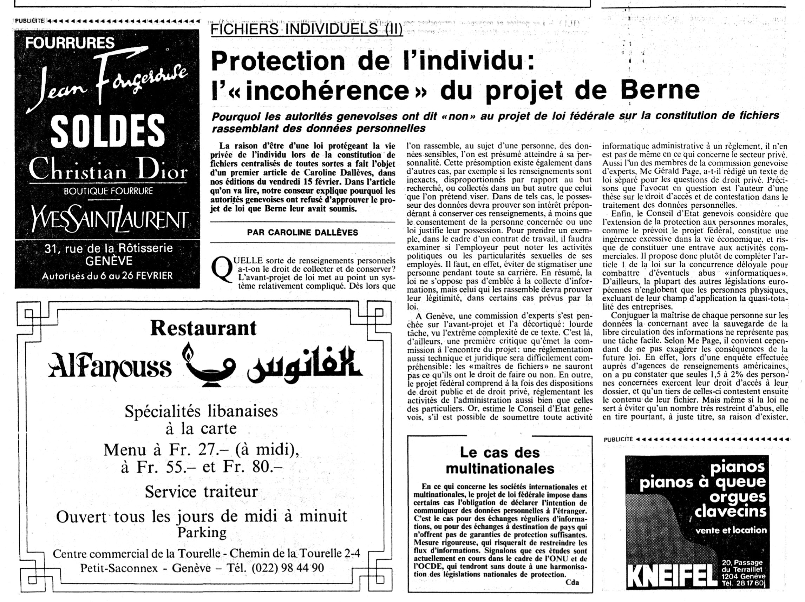
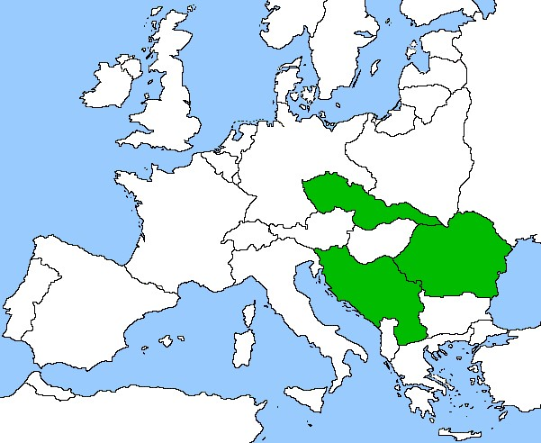

### 2024

It’s sad watching Europe‘s demise in real time. In 2007, 46 out of 100 world’s most valuable companies were from Europe. 16 years later this number has decreased to only 15.

Wealth of France compares to the wealth of Idaho which is 48th US state by wealth. Yes this remains GDP per capita which has its own major flaws, but nevertheless it paints gray picture of regress.

Unprecedented rise of bureaucracy last 20 years, striking decrease in birth rates coupled with aging population, ludicrous green movement agenda, insane immigrant policies, and absurd energy policies are the reasons of this demise.

I hate to break it to you Germany, but closing nuclear power plants while dreaming how everyone is driving EVs while windmills and solar panels are generating enough energy will stay only the dream.

Where are we headed?

<video width="640" height="480" controls>
<source src="./movies/february/europe-where.mp4" type="video/mp4">
Your browser does not support the video tag.
</video>

---

  

  

  

---

### 2023

Dług USA.

Politycy myślą od wyborów do wyborów i nie patrzą na długoterminowe konsekwencje długu. USA ma walutę rezerwową i może pozwolić sobie na więcej. Pytanie tylko do kiedy? Chiny już wzywały USA aby ograniczyły QE po czym zaczęły zmniejszać wartość posiadanych rezerw $.

  

  

### ~~2000

  

  

### 2021

> “We should all look at what we have learned from this epidemic, because there will be another epidemic coming." - Bill Gates

---

Wykorzystując lockdown spółka skarbu państwa przejęła popularną warszawską restaurację DRUKARNIA na Pradze razem z wyposażeniem, dokumentacją firmy oraz kasami fiskalnymi. Właściciele nie mogą wypłacić pensji pracownikom ani zrobić raportów do Urzędu Skarbowego.

---

### 1985

The 🇨🇭 newspaper Journal de Genève reported about the discussions surrounding a data protection legislative proposal, including on the possible impact of the  right of access.

  

### 1943

Rozkaz Reichsführera-SS, Heinricha Himmlera (zdjęcie) z dnia 16 lutego 1943 roku dotyczący warszawskiego getta:
>Zarządzam, aby getto warszawskie zostało zniszczone. (...) Zburzenie getta i założenie obozu koncentracyjnego jest konieczne, gdyż inaczej nigdy nie doprowadzimy do uspokojenia Warszawy. (....) Należy osiągnąć to, aby przestrzeń istniejącą dotychczas dla ponad 500 tysięcy podludzi, a nie nadająca się nigdy dla Niemców, znikła z powierzchni.

  

### 1939

W Starych Wasiliszkach na terenie dzisiejszej Białorusi urodził się Czesław Niemen (prawdziwe nazwisko Czesław Juliusz Wydrzycki).
Już jako dziecko był uzdolniony muzycznie. Uczył się w Pedagogicznym Liceum Muzycznym.
W 1963 roku Niemen wraz z zespołem Niebiesko -Czarni wystąpił na pierwszym Festiwalu Piosenki Polskiej w Opolu. Zagrali tam utwór pt "Wiem, że nie wrócisz". Występ nie spodobał się jury, za to bardzo spodobał się publiczności, a piosenka ta stała się wielkim przebojem. W grudniu tego samego roku wówczas jeszcze jako Wydrzycki wyjechał z zespołem na tournee po Europie zachodniej. Niezwyklę trudną dla obcokrajowców barierą okazało się jego nazwisko w skutek czego zmienił je na Niemen.
W 1964 roku Niemen napisał utwór "Czy mnie jeszcze pamiętasz", którego swoją niemiecką wersję nagrała nawet Marlena Dietrich.
Krokiem milowym w karierze Niemena okazał się wyjazd do Francji w 1966 roku i nagranie tam płyty z orkiestrą Michaela Colombier. To z tej płyty pochodzi "Sen o Warszawie".
W 1967 roku Niemen założył zespół Akwarele i to z nim wylansował utwór "Dziwny jest ten świat".Później przyszła kolej na płytę "Sukces",na której jako pierwszy muzyk w Polsce Niemen użył organów Hammond.
Lata 70 te to początek jego eksperymentów z muzyką elektroniczną i filmową. W latach 80 tych muzyk skupił się bardziej na koncertowaniu i nagrał tylko jedną płytę w 1989 roku pt "Terra deflorata". W latach 90 Niemen zadebiutował na łamach "Tylko Rock" jako felietonista. W swoich felietonach wyrażał często bardzo krytyczne opinie o polskiej scenie muzycznej.
Ostatnia jego płyta pt Spodchmurykapelusza"ukazała się w 2001 roku. Zmarł 17 stycznia 2004 roku.

  

### 1936

W szwajcarskiej willli w Morges należącej do Ignacego Paderewskiego (zdjęcie) zawarte zostało porozumienie polityczne działaczy stronnictw centrowych, których celem było odsunięcie od władzy w Polsce sanacji. Inicjatorem tego spotkania był generał Władysław Sikorski. Wzięli w nim udział również Józef Haller, Wojciech Korfanty, Karol Popiel, płk Izydor Modelski, gen. Marian Januszajtis, Włodzimierz Marszewski.
Zamiarem ich było powołanie Paderewskiego na stanowisko prezydenta, zaś na stanowisko premiera Wincentego Witosa. Oprócz tego wystosowano postulat przywrócenia w Polsce demokracji i zacieśnienia sojuszu z Francją.

  

### 1933

Czechosłowacja, Rumunia i Jugosławia zawarły pakt Małej Ententy.
Celem Małej Ententy było utrwalenie w tej części Europy układu polit., powstałego w wyniku traktatów pokojowych z Węgrami i Bułgarią po I wojnie świat., zwłaszcza przeciwdziałanie restauracji Habsburgów na Węgrzech i rewanżyzmowi węg.; Francja wykorzystywała Małą Ententę jako jeden z gł. instrumentów swej polityki wobec Niemiec i ZSRR; w celu umocnienia wpływów w państwach Małej Ententy Francja zawarła traktaty przyjaźni i przymierza z Czechosłowacją (1924), Rumunią (1926) i Jugosławią (1927); 1933, po dojściu A. Hitlera do władzy, podpisano Pakt Organizacyjny, powołujący ponadpaństw. struktury Małej Ententy: Stałą Radę (ds. polit.) i Radę Gosp.; w 2. poł. lat 30., pod presją Niemiec i Włoch, doszło do wzrostu napięć między państwami Małej Ententy: 1937 zostały naruszone warunki sojuszów (układy Jugosławii z Bułgarią i Włochami oraz zgoda Stałej Rady na równouprawnienie Węgier w dziedzinie zbrojeń); podpisanie układu monachijskiego 1938 spowodowało faktyczny rozpad Małej Ententy.

  

### 1922

Po prawie 600 latach w granice Polski wrócił Górny Śląsk. Swoją suwerenność Śląsk stracił w 1348 roku, gdy został częścią Królestwa Czech. Następnie w 1526 roku trafił pod panowanie Habsburgów. Ci z kolei przegrali swoją batalię o ten region z Hohenzollernami i w 1763 roku Śląsk stał się częścią Królestwa Prus. W 1871 roku przyłączono go do Cesarstwa Niemieckiego.
Odzyskanie przez Polskę niepodległości w 1918 r. wzmogło działający tam polski ruch niepodległościowy. Skutkiem jego działań były trzy powstania śląskie w latach 1919-21.
20 marca 1921 roku został zorganizowany plebiscyt, w którym miały rozstrzygnąć się losy Górnego Śląska.Głosujący za jego przynależnością do Polski byli jednak w mniejszości, więc komisja plebiscytowa zdecydowała, że prawie cały ten obszar należy się Niemcom. Jednak ostatnie powstanie wywarło skuteczny wpływ na zmianę tej decyzji. Blisko 30 procent obszaru plebiscytowego i ponad 40 procent jego ludności znalazło się w granicach Rzeczpospolitej.
16 lipca 1922 roku w Katowicach odbyła się uroczystość zjednoczenia Śląska z Polską. Wtedy też podpisano Akt Objęcia Górnego Śląska przez Polskę.

### 1893

https://pl.wikipedia.org/wiki/Michai%C5%82_Tuchaczewski

### 1822

https://pl.wikipedia.org/wiki/Francis_Galton

---

<a href="https://github.com/TomaszWaszczyk/historia.waszczyk.com/edit/master/src/content/february-16.md" target="_blank">Edytuj tę stronę dzieląc się własnymi notatkami!</a>
