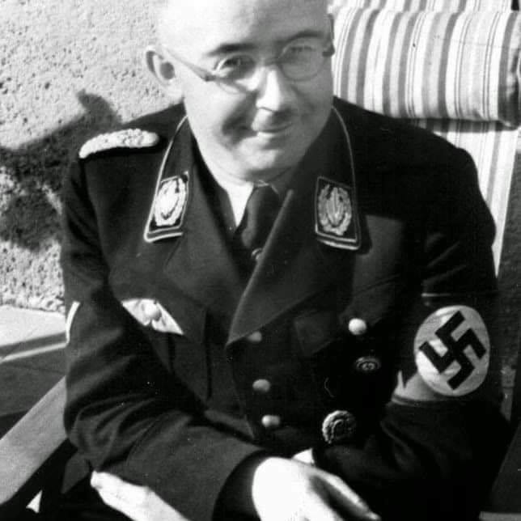
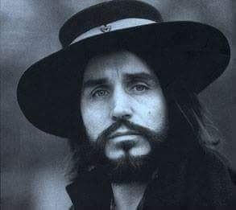
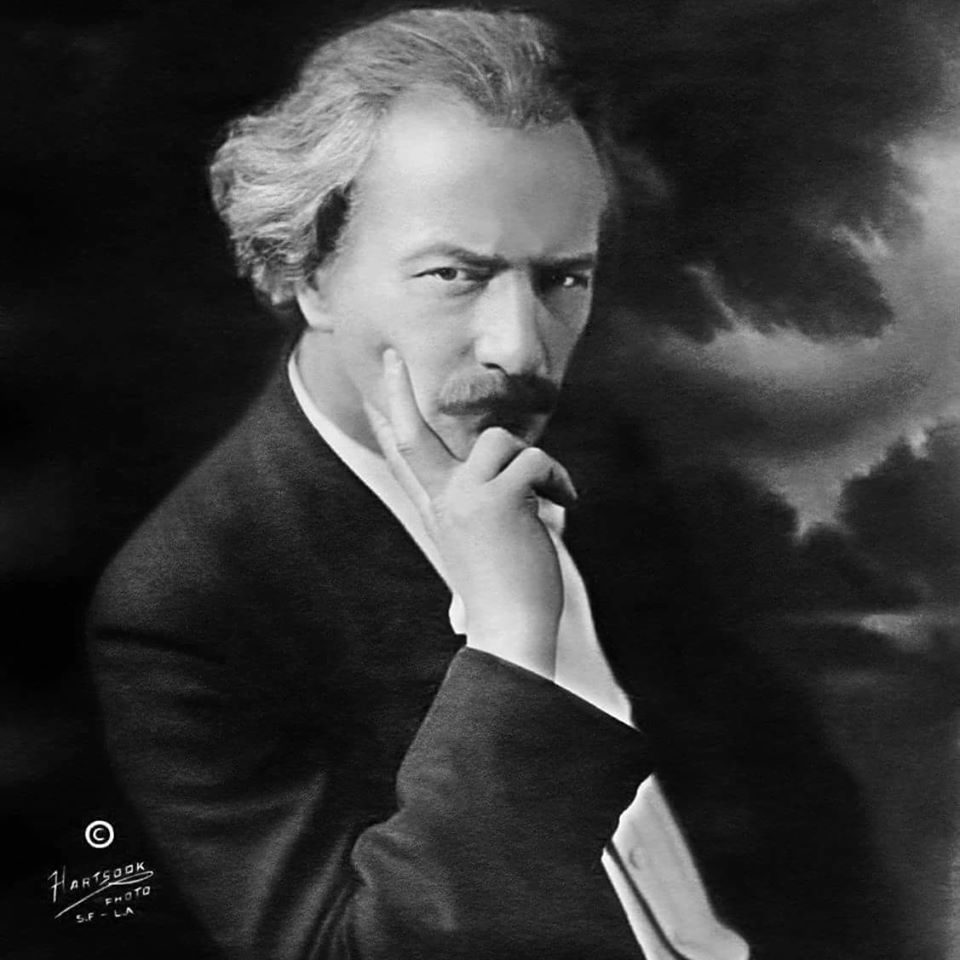

### 1943

Rozkaz Reichsführera-SS, Heinricha Himmlera (zdjęcie) z dnia 16 lutego 1943 roku dotyczący warszawskiego getta:
>Zarządzam, aby getto warszawskie zostało zniszczone. (...) Zburzenie getta i założenie obozu koncentracyjnego jest konieczne, gdyż inaczej nigdy nie doprowadzimy do uspokojenia Warszawy. (....) Należy osiągnąć to, aby przestrzeń istniejącą dotychczas dla ponad 500 tysięcy podludzi, a nie nadająca się nigdy dla Niemców, znikła z powierzchni.

  

### 1939

W Starych Wasiliszkach na terenie dzisiejszej Białorusi urodził się Czesław Niemen (prawdziwe nazwisko Czesław Juliusz Wydrzycki).
Już jako dziecko był uzdolniony muzycznie. Uczył się w Pedagogicznym Liceum Muzycznym.
W 1963 roku Niemen wraz z zespołem Niebiesko -Czarni wystąpił na pierwszym Festiwalu Piosenki Polskiej w Opolu. Zagrali tam utwór pt "Wiem, że nie wrócisz". Występ nie spodobał się jury, za to bardzo spodobał się publiczności, a piosenka ta stała się wielkim przebojem. W grudniu tego samego roku wówczas jeszcze jako Wydrzycki wyjechał z zespołem na tournee po Europie zachodniej. Niezwyklę trudną dla obcokrajowców barierą okazało się jego nazwisko w skutek czego zmienił je na Niemen.
W 1964 roku Niemen napisał utwór "Czy mnie jeszcze pamiętasz", którego swoją niemiecką wersję nagrała nawet Marlena Dietrich.
Krokiem milowym w karierze Niemena okazał się wyjazd do Francji w 1966 roku i nagranie tam płyty z orkiestrą Michaela Colombier. To z tej płyty pochodzi "Sen o Warszawie".
W 1967 roku Niemen założył zespół Akwarele i to z nim wylansował utwór "Dziwny jest ten świat".Później przyszła kolej na płytę "Sukces",na której jako pierwszy muzyk w Polsce Niemen użył organów Hammond.
Lata 70 te to początek jego eksperymentów z muzyką elektroniczną i filmową. W latach 80 tych muzyk skupił się bardziej na koncertowaniu i nagrał tylko jedną płytę w 1989 roku pt "Terra deflorata". W latach 90 Niemen zadebiutował na łamach "Tylko Rock" jako felietonista. W swoich felietonach wyrażał często bardzo krytyczne opinie o polskiej scenie muzycznej.
Ostatnia jego płyta pt Spodchmurykapelusza"ukazała się w 2001 roku. Zmarł 17 stycznia 2004 roku.

  

### 1936

W szwajcarskiej willli w Morges należącej do Ignacego Paderewskiego (zdjęcie) zawarte zostało porozumienie polityczne działaczy stronnictw centrowych, których celem było odsunięcie od władzy w Polsce sanacji. Inicjatorem tego spotkania był generał Władysław Sikorski. Wzięli w nim udział również Józef Haller, Wojciech Korfanty, Karol Popiel, płk Izydor Modelski, gen. Marian Januszajtis, Włodzimierz Marszewski.
Zamiarem ich było powołanie Paderewskiego na stanowisko prezydenta, zaś na stanowisko premiera Wincentego Witosa. Oprócz tego wystosowano postulat przywrócenia w Polsce demokracji i zacieśnienia sojuszu z Francją.

  

### 1922

Po prawie 600 latach w granice Polski wrócił Górny Śląsk. Swoją suwerenność Śląsk stracił w 1348 roku, gdy został częścią Królestwa Czech. Następnie w 1526 roku trafił pod panowanie Habsburgów. Ci z kolei przegrali swoją batalię o ten region z Hohenzollernami i w 1763 roku Śląsk stał się częścią Królestwa Prus. W 1871 roku przyłączono go do Cesarstwa Niemieckiego.
Odzyskanie przez Polskę niepodległości w 1918 r. wzmogło działający tam polski ruch niepodległościowy. Skutkiem jego działań były trzy powstania śląskie w latach 1919-21.
20 marca 1921 roku został zorganizowany plebiscyt, w którym miały rozstrzygnąć się losy Górnego Śląska.Głosujący za jego przynależnością do Polski byli jednak w mniejszości, więc komisja plebiscytowa zdecydowała, że prawie cały ten obszar należy się Niemcom. Jednak ostatnie powstanie wywarło skuteczny wpływ na zmianę tej decyzji. Blisko 30 procent obszaru plebiscytowego i ponad 40 procent jego ludności znalazło się w granicach Rzeczpospolitej.
16 lipca 1922 roku w Katowicach odbyła się uroczystość zjednoczenia Śląska z Polską. Wtedy też podpisano Akt Objęcia Górnego Śląska przez Polskę.

---

<a href="https://github.com/TomaszWaszczyk/historia.waszczyk.com/edit/master/src/content/february-16.md" target="_blank">Edytuj tę stronę dzieląc się własnymi notatkami!</a>
