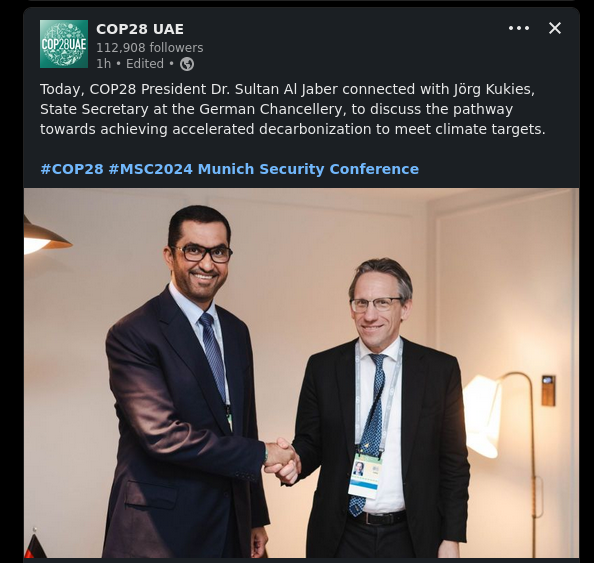
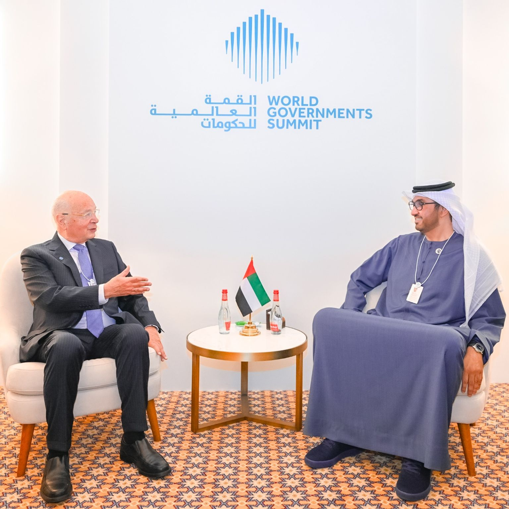
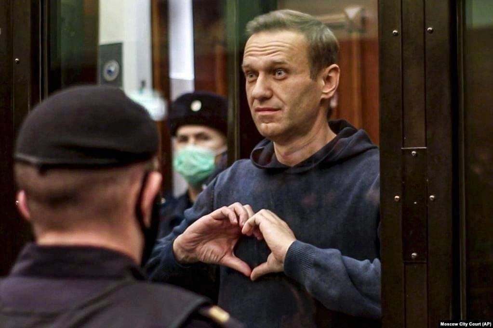
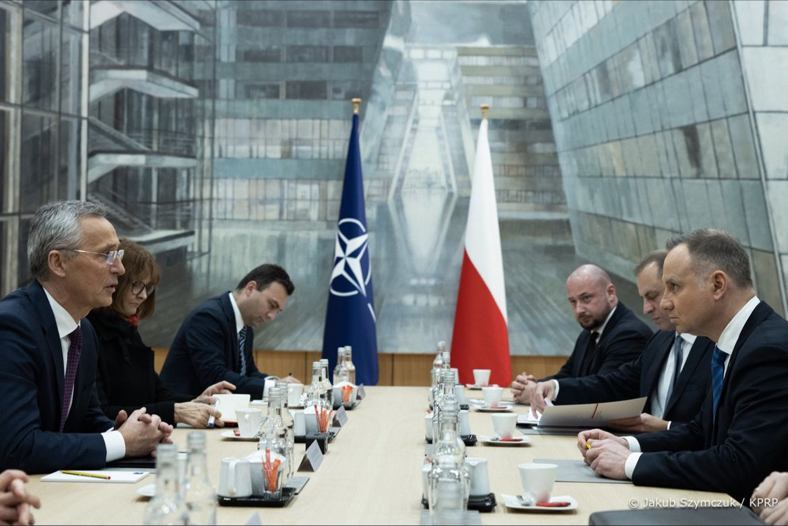
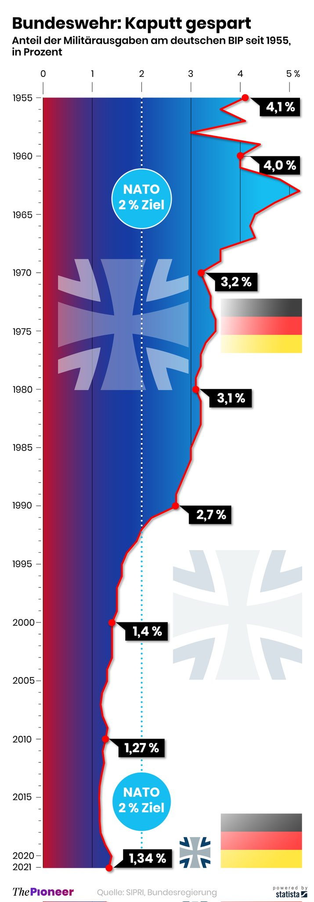
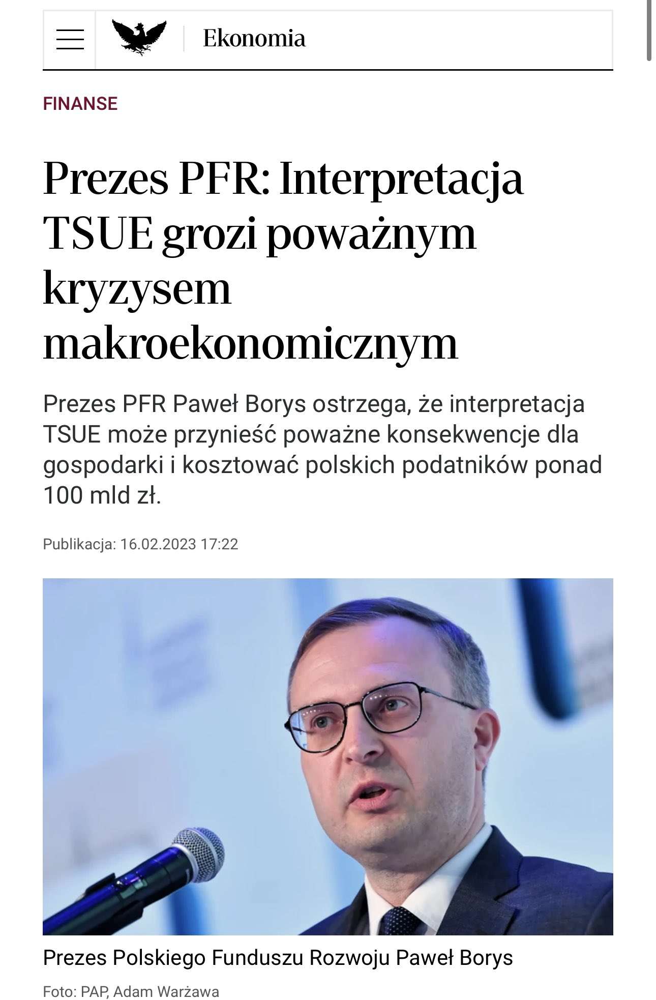

### 2024

> acceleration of decarbonization

  

  

---

Aleksiej Nawalny nie żyje. Miał 47 lat. Nie wszyscy wiedzą, że był adwokatem. Poniższy tekst napisalem niecałe 3 lata temu. Moja nauczycielka literatury w moskiewskiej szkole mawiała, że Rosja to kraj, w którym wysoka kultura przeplata się z tragiczną historią.

  

"Jak wszyscy śledzący wydarzenia ze świata zapewne wiedzą, Aleksiej Nawalny został skazany na 3,5 roku kolonii karnej.

Być może nie wszyscy wiedzą natomiast, że transport do kolonii karnych odbywa się w tzw. „stołypinowskich” wagonach, które nie mają okien, a na przestrzeni ok. 3,5 m2 wiezionych jest 10 osób. Do tego zarówno więźniowie, jak i ich rodziny nie wiedzą, dokąd są transportowani. Miejsce przeznaczenia to z reguły „in the middle of nowhere”, ale kto by się przejmował brakiem kontaktu z rodziną czy adwokatem.

Rosja ma długą tradycję więźniów politycznych i prześladowania za poglądy. Ostatnie lata dostarczyły wielu przykładów – Anna Politkowska, Borys Niemcow, Aleksander Litwinienko, czy – podobnie jak Nawalny adwokat – Siergiej Magnitski.

Najbardziej znanym więźniem politycznym był Fiodor Dostojewski, który za czytanie Hegla w Kole Pietraszewców dostał karę śmierci, zamienioną w ostatniej chwili przed egzekucją na lata katorgi w Omsku i Semipałatyńsku. Po tych doświadczeniach powstały „Wspomnienia z domu umarłych”, którymi ratował się 100 lat później w obozach w Witebsku i Wołogdzie Gustaw Herling-Grudziński. Za bardziej panoramiczny „Archipelag GUŁag” Alekdander Sołżenicyn dostał w 1970 r. Nagrodę Nobla, choć bardziej wstrząsającą jego książką jest „Jeden dzień Iwana Denisowicza”.

Trudno pomyśleć o jakimkolwiek rosyjskim dwudziestowiecznym twórcy, u którego tematyka obozowa i toksyczne relacje z państwem nie byłyby obecne, a dla wielu były kluczowe. Bułhakow, Pasternak, Babel, Pilniak, Szołochow, Achmatowa i wielu innych. Niektórzy w takie miejsca trafili, niektórzy o tym pisali, a niektórzy i jedno i drugie.

Bardzo wymowny, również w kontekście A. Nawalnego, jest przykład Osipa Mandelsztama, który stracił życie za wiersz przeciwko Stalinowi. Poniżej fragment w tłumaczeniu niezawodnego Stanisława Barańczaka:

Żyjemy tu, nie czując pod stopami ziemi,
Nie słychać i na dziesięć kroków, co szepczemy.
A w półsłówkach, w półrozmowach naszych
Cień górala kremlowskiego straszy.
(…)
Miodem kapie każda nowa śmierć
Na szeroką, osetyńską pierś."

---

> Światowy gigant zwalnia Niemców i przenosi produkcję do Polski

Globalny producent części samochodowych, gigant zatrudniający 30 tysięcy ludzi w 80 zakładach na całym świecie, zamierza przenieść część swojej produkcji z Niemiec do Polski. Chodzi o Cooper Standard, a powodem są problemy związane z przestawianiem produkcji na samochody elektryczne.

### 2023

Poland - a country forced to spend 4% of GDP on defense is also forced to spend 3xU:

1. Making our own defense industry a key sector of the economy
2. Making part of its defense capabilities available to the countries of the region
3. Realizing one's own role in the coming decades.

  

---

Ukazał się nowy raport Monachijskiej Konferencji Bezpieczeństwa zatytułowany "Re:vision". Tytuł nawiązuje do faktu, że Rosja i Chiny zaczęły na poważnie budować alternatywny ład międzynarodowy i że ich propozycja spotyka się z zainteresowaniem państw i narodów, które czuły się do tej pory nietraktowane po partnersku przez państwa zachodnie. Stąd też autorzy raportu uznali, że "globalne południe" trzeba zacząć traktować poważniej, gdyż niedługo zupełnie się wyemancypuje spod wpływów państw zachodnich... To ważny raport bo pokazuje, że jesteśmy świadkami/uczestnikami procesu globalnej przemiany, z którego Zachód zaczyna sobie powoli zdawać sprawę, ale którego moim zdaniem nie będzie już w stanie zatrzymać. Oczywiście będzie to miało kluczowe znaczenie dla kwestii globalnych procesów gospodarczych. Kto myśli przyszłościowo już teraz zaczyna się przyglądać polityce państw BRICS.

> "If we do not address the resentment that countries in Africa, Latin America, and Asia feel toward the international order, which has not always served their interests, we will struggle to win the fence-sitters as allies in the defense of key rules and principles".

---

  

---

  

---

  

---

  

---

### 2021

"Dobra zmiana" zaczyna przynosić "efekty".

Zgodnie z zasadami prowadzonej przez duet marksistów Kaczyński - Morawiecki "II Bitwy o Handel" przedsiębiorczość w Polsce zaczyna być tłamszona.

---

Chiny zostały największym partnerem handlowym Unii Europejskiej

Chiny zdetronizowały w 2020 r. Stany Zjednoczone stając się największym partnerem handlowym Unii Europejskiej. Wśród głównych przyczyn wymienia się wybuch pandemii, która zakłóciła dotychczasowy handel oraz szybsze wyjście z kryzysu pandemicznego chińskiej gospodarki.

### 2020

WHO:

"...extremely cautious using term pandemic"

---

> “What these companies have done is created a business model where the most incendiary, upsetting, controversial, and oftentimes false and damaging things get more oxygen than they deserve because we are a tribal species and when people say things that are upsetting we tend to engage. Engagement equals enrichment. The more rage equals the more clicks equals the more Nissan ads. So these algorithms have figured out that if you promote the flawed junk science of anti-vaxxers, it increases shareholder value.” - Leviego: Facebook: The Inside

---

### 1923

  

### 1772

W Petersburgu podpisano tajną konwencję rosyjsko-pruską dotyczącą I rozbioru Polski.
Po wojnie siedmioletniej terytorium Rzeczypospolitej stanowiło łakomy kąsek dla trzech sąsiadujących z nią wielkich mocarstw, które kosztem Polski chciały regulować swoje wzajemne stosunki. Austria starała się rozbić tzw. system północny opierający się na sojuszu Prus i Rosji poprzez przekupienie tych pierwszych terenami Prus Królewskich w zamian za zwrot Śląska. Mimo że Prusy nie okazały się tą propozycją zainteresowane, podobne pomysły miały się już niedługo urzeczywistnić, tym bardziej że w wyniku wojny rosyjsko-tureckiej cała Europa zaczęła poważnie obawiać się o dotychczasowy stan równowagi.
Jego bezpośrednim efektem był pruski plan uregulowania wschodniego sporu między Rosją a Austrią (uważającą Turcję za swoją strefę wpływów) kosztem Polski - zamiast terenów tureckich Rosja miała otrzymać ziemie na zachodzie, a dla zachowania równowagi także inni mieli skorzystać w ten sam sposób.
Rosja przed 1771 rokiem uważała Rzeczpospolitą za swój protektorat. Jednak trwająca już trzy lata konfederacja barska dowodziła niemożliwości zapanowania nad polską szlachtą siłami samej Rosji. Ostatecznie Rosjanie przystali na pruskie propozycje rozbioru Rzeczypospolitej. 17 lutego 1772 r. w Petersburgu podpisano tajną konwencję rosyjsko-pruską. W tym czasie jej obydwie strony traktowały jeszcze Austrię jako swojego wroga, deklarując wzajemną pomoc, gdyby Austria usiłowała zapobiec rozbiorowi Rzeczypospolitej.

  

---

<a href="https://github.com/TomaszWaszczyk/historia.waszczyk.com/edit/master/src/content/february-17.md" target="_blank">Edytuj tę stronę dzieląc się własnymi notatkami!</a>
