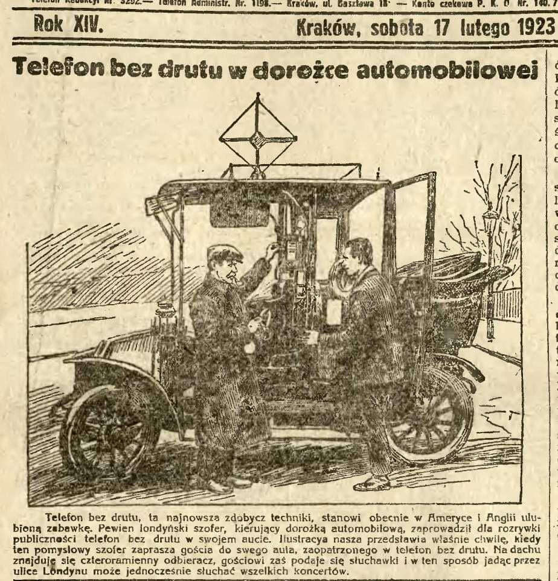

### 2020

WHO:

"...extremely cautious using term pandemic"

---

> “What these companies have done is created a business model where the most incendiary, upsetting, controversial, and oftentimes false and damaging things get more oxygen than they deserve because we are a tribal species and when people say things that are upsetting we tend to engage. Engagement equals enrichment. The more rage equals the more clicks equals the more Nissan ads. So these algorithms have figured out that if you promote the flawed junk science of anti-vaxxers, it increases shareholder value.” - Leviego: Facebook: The Inside

---

### 1923

  

---

<a href="https://github.com/TomaszWaszczyk/historia.waszczyk.com/edit/master/src/content/february-17.md" target="_blank">Edytuj tę stronę dzieląc się własnymi notatkami!</a>
