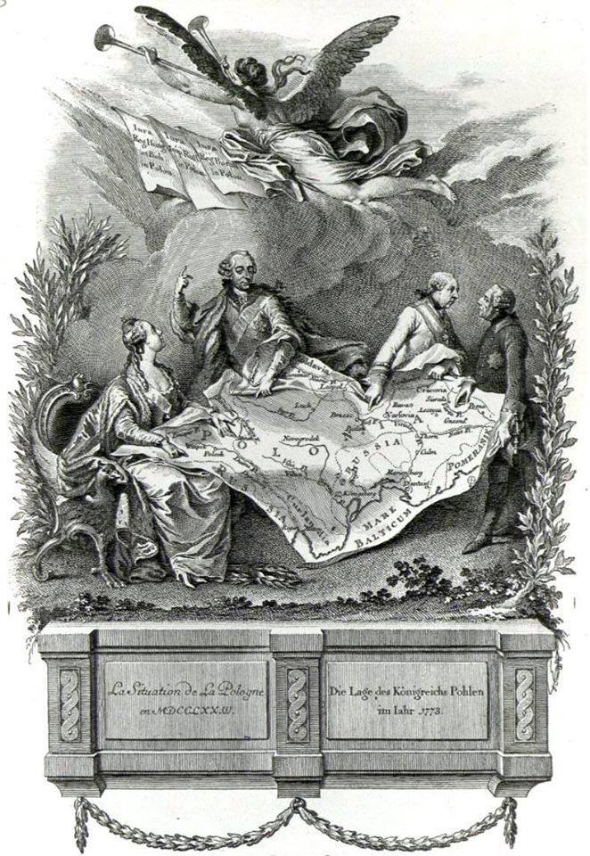

### 2023

Ukazał się nowy raport Monachijskiej Konferencji Bezpieczeństwa zatytułowany "Re:vision". Tytuł nawiązuje do faktu, że Rosja i Chiny zaczęły na poważnie budować alternatywny ład międzynarodowy i że ich propozycja spotyka się z zainteresowaniem państw i narodów, które czuły się do tej pory nietraktowane po partnersku przez państwa zachodnie. Stąd też autorzy raportu uznali, że "globalne południe" trzeba zacząć traktować poważniej, gdyż niedługo zupełnie się wyemancypuje spod wpływów państw zachodnich... To ważny raport bo pokazuje, że jesteśmy świadkami/uczestnikami procesu globalnej przemiany, z którego Zachód zaczyna sobie powoli zdawać sprawę, ale którego moim zdaniem nie będzie już w stanie zatrzymać. Oczywiście będzie to miało kluczowe znaczenie dla kwestii globalnych procesów gospodarczych. Kto myśli przyszłościowo już teraz zaczyna się przyglądać polityce państw BRICS.

> "If we do not address the resentment that countries in Africa, Latin America, and Asia feel toward the international order, which has not always served their interests, we will struggle to win the fence-sitters as allies in the defense of key rules and principles".

### 2021

"Dobra zmiana" zaczyna przynosić "efekty".

Zgodnie z zasadami prowadzonej przez duet marksistów Kaczyński - Morawiecki "II Bitwy o Handel" przedsiębiorczość w Polsce zaczyna być tłamszona.

---

Chiny zostały największym partnerem handlowym Unii Europejskiej

Chiny zdetronizowały w 2020 r. Stany Zjednoczone stając się największym partnerem handlowym Unii Europejskiej. Wśród głównych przyczyn wymienia się wybuch pandemii, która zakłóciła dotychczasowy handel oraz szybsze wyjście z kryzysu pandemicznego chińskiej gospodarki.

### 2020

WHO:

"...extremely cautious using term pandemic"

---

> “What these companies have done is created a business model where the most incendiary, upsetting, controversial, and oftentimes false and damaging things get more oxygen than they deserve because we are a tribal species and when people say things that are upsetting we tend to engage. Engagement equals enrichment. The more rage equals the more clicks equals the more Nissan ads. So these algorithms have figured out that if you promote the flawed junk science of anti-vaxxers, it increases shareholder value.” - Leviego: Facebook: The Inside

---

### 1923

  

### 1772

W Petersburgu podpisano tajną konwencję rosyjsko-pruską dotyczącą I rozbioru Polski.
Po wojnie siedmioletniej terytorium Rzeczypospolitej stanowiło łakomy kąsek dla trzech sąsiadujących z nią wielkich mocarstw, które kosztem Polski chciały regulować swoje wzajemne stosunki. Austria starała się rozbić tzw. system północny opierający się na sojuszu Prus i Rosji poprzez przekupienie tych pierwszych terenami Prus Królewskich w zamian za zwrot Śląska. Mimo że Prusy nie okazały się tą propozycją zainteresowane, podobne pomysły miały się już niedługo urzeczywistnić, tym bardziej że w wyniku wojny rosyjsko-tureckiej cała Europa zaczęła poważnie obawiać się o dotychczasowy stan równowagi.
Jego bezpośrednim efektem był pruski plan uregulowania wschodniego sporu między Rosją a Austrią (uważającą Turcję za swoją strefę wpływów) kosztem Polski - zamiast terenów tureckich Rosja miała otrzymać ziemie na zachodzie, a dla zachowania równowagi także inni mieli skorzystać w ten sam sposób.
Rosja przed 1771 rokiem uważała Rzeczpospolitą za swój protektorat. Jednak trwająca już trzy lata konfederacja barska dowodziła niemożliwości zapanowania nad polską szlachtą siłami samej Rosji. Ostatecznie Rosjanie przystali na pruskie propozycje rozbioru Rzeczypospolitej. 17 lutego 1772 r. w Petersburgu podpisano tajną konwencję rosyjsko-pruską. W tym czasie jej obydwie strony traktowały jeszcze Austrię jako swojego wroga, deklarując wzajemną pomoc, gdyby Austria usiłowała zapobiec rozbiorowi Rzeczypospolitej.

  

---

<a href="https://github.com/TomaszWaszczyk/historia.waszczyk.com/edit/master/src/content/february-17.md" target="_blank">Edytuj tę stronę dzieląc się własnymi notatkami!</a>
