### 2024

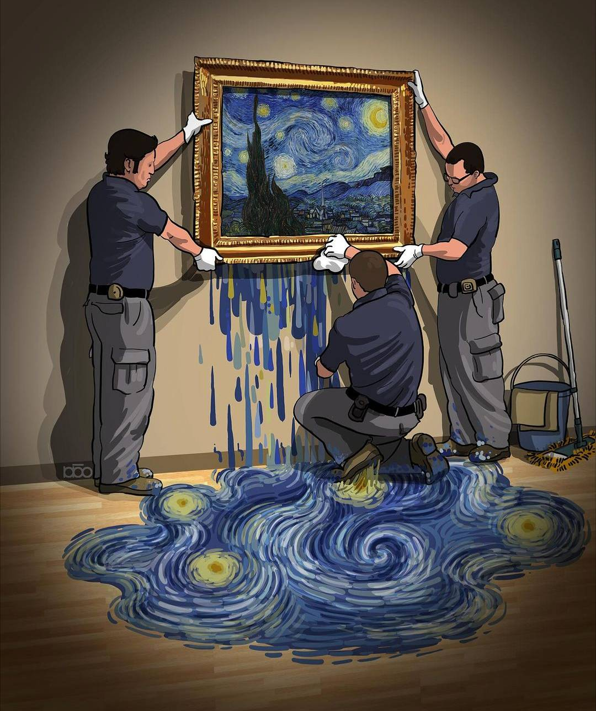  

  

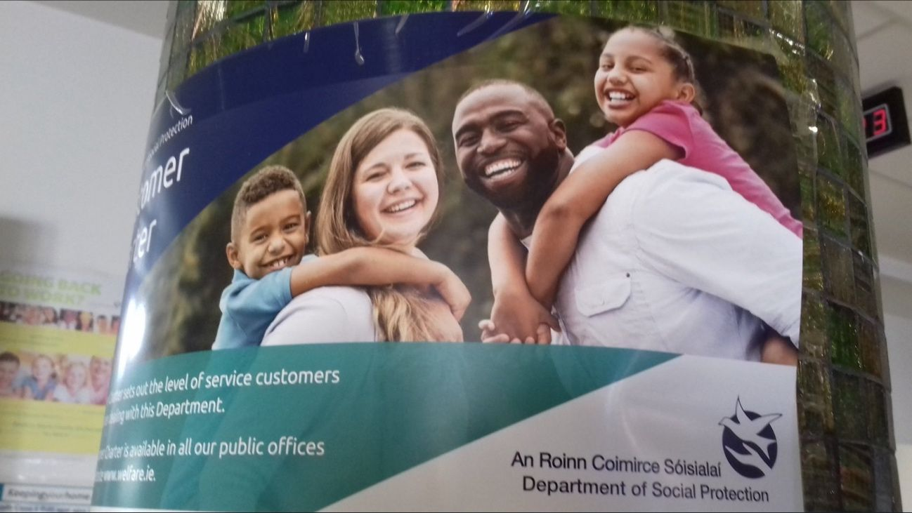  

<video width="640" height="480" controls>
<source src="./movies/february/who-is-better-for-putin.mp4" type="video/mp4">
Your browser does not support the video tag.
</video>

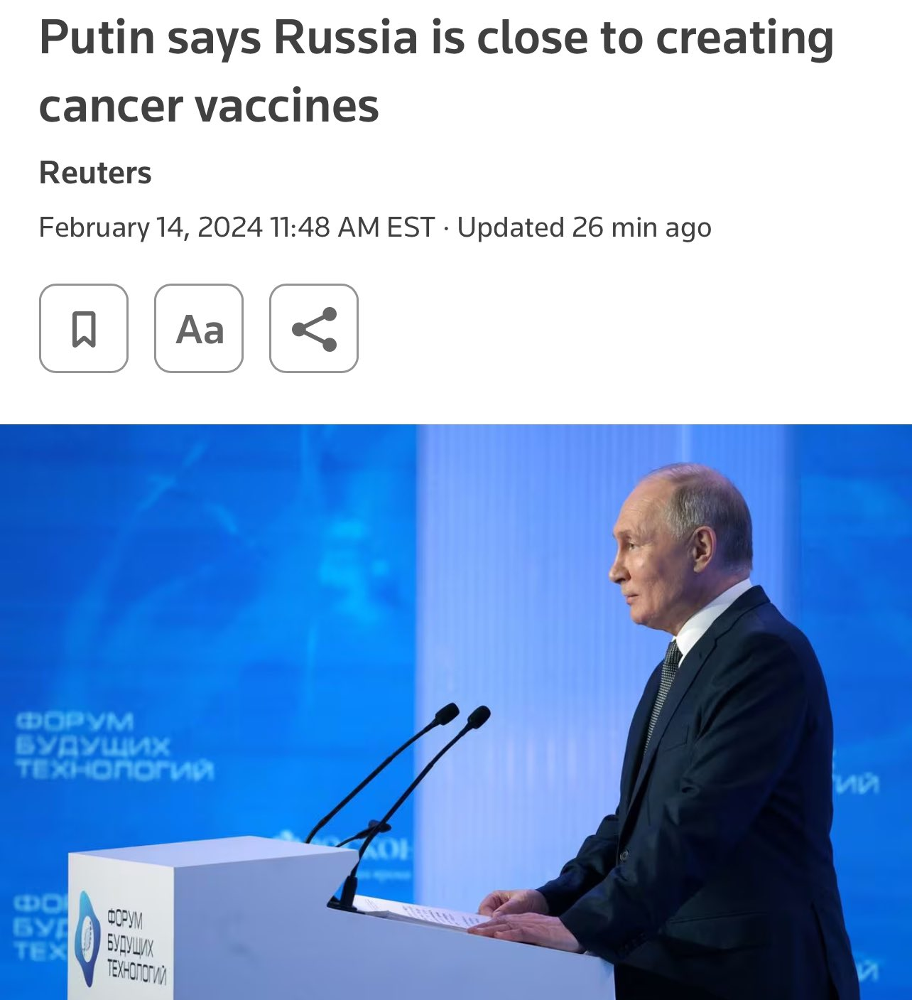  

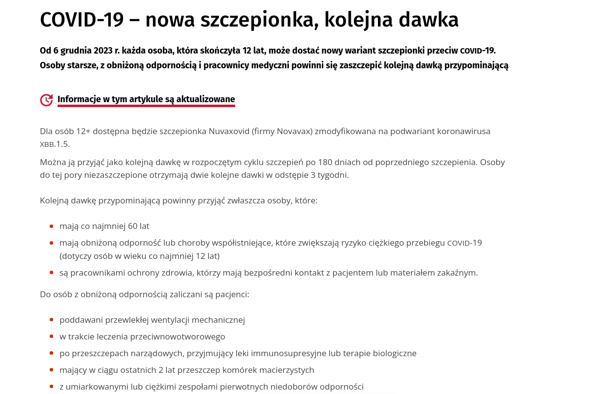  

---

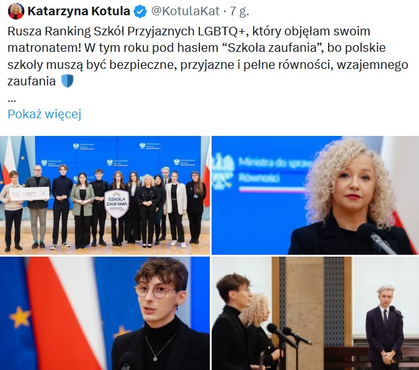  

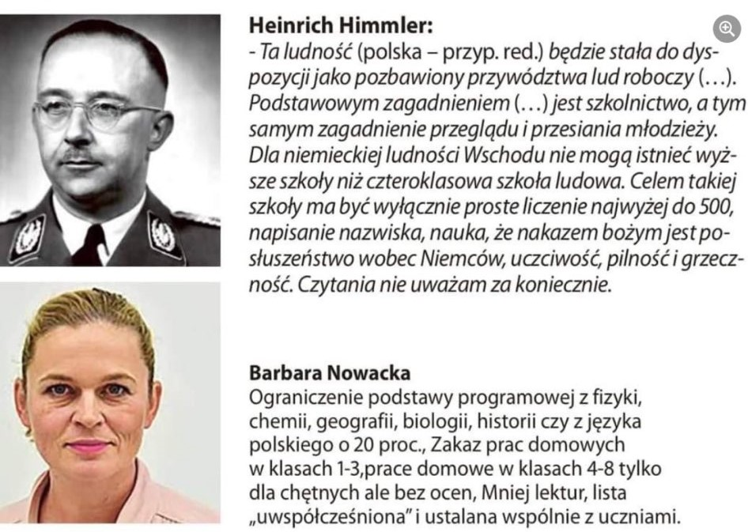  

(fake??)

<video width="640" height="480" controls>
<source src="./movies/february/zmiana-nauczania.mp4" type="video/mp4">
Your browser does not support the video tag.
</video>

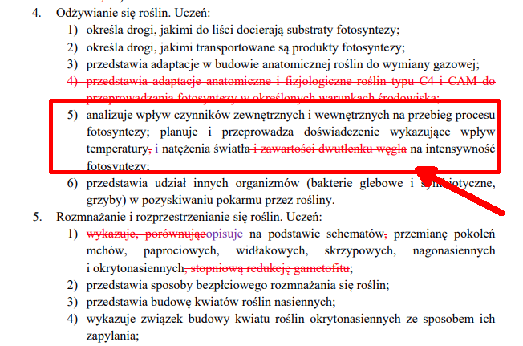  

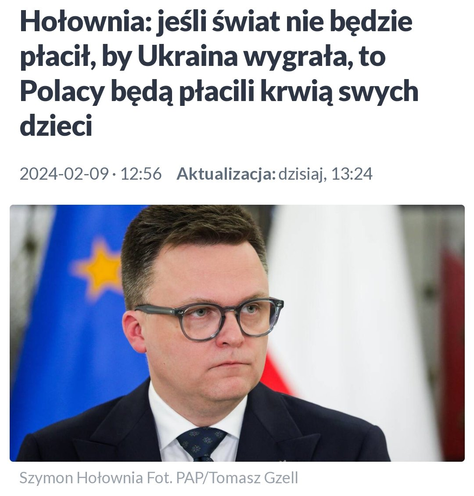  

<a href="./documents/february/Prezentacja_zmiany_w_podstawie_programowej_17_przedmiotów-1.pdf" target="_blank">Zmiany w szkolnictwie</a>

<a href="./documents/february/Prezentacja_zmiany_w_podstawie_programowej_17_przedmiotów.pdf" target="_blank">Zmiany w szkolnictwie</a>

---

<video width="640" height="480" controls>
<source src="./movies/february/bad-message.mp4" type="video/mp4">
Your browser does not support the video tag.
</video>

<video width="640" height="480" controls>
<source src="./movies/february/Bardzo-kurwa-jego-mac.mp4" type="video/mp4">
Your browser does not support the video tag.
</video>

---

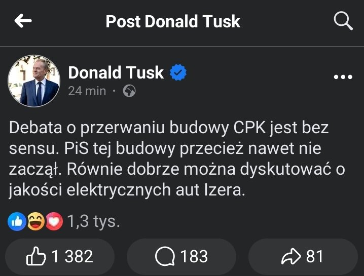  

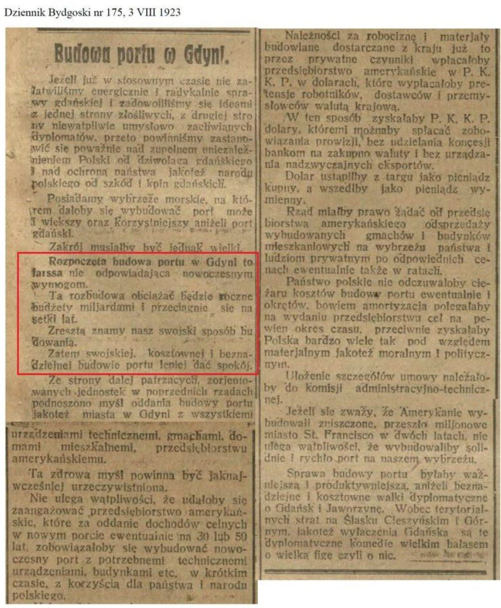  

---

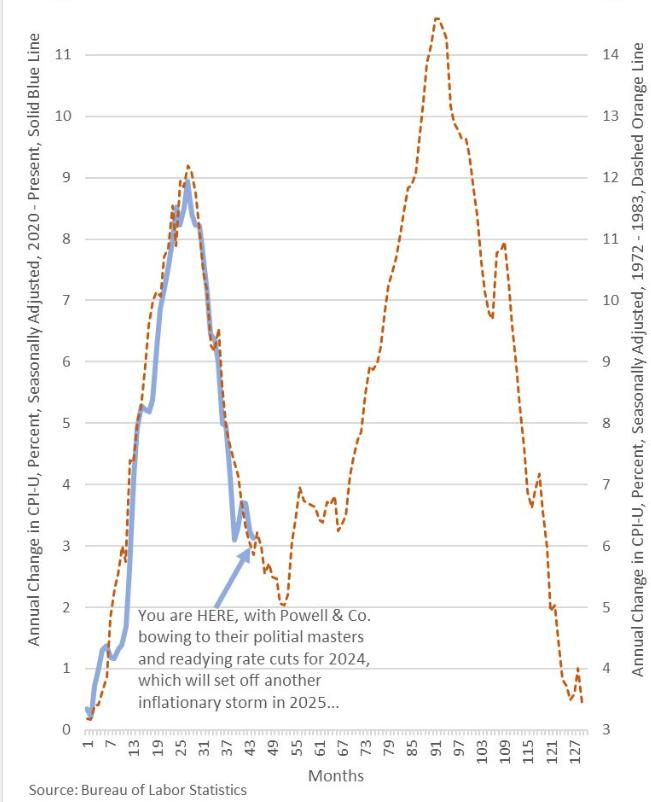  

---

<video width="640" height="480" controls>
<source src="./movies/february/podwyzka-inaczej.mp4" type="video/mp4">
Your browser does not support the video tag.
</video>

---

<a href="./documents/february/war_bonds_inflation.pdf" target="_blank">War Bonds</a>

<a href="./documents/february/thomson_david_k_201605_phd.pdf" target="_blank">Bonds</a>

---

### 2022

<video width="640" height="480" controls>
<source src="./movies/february/merkel-not-good.mp4" type="video/mp4">
Your browser does not support the video tag.
</video>

<video width="640" height="480" controls>
<source src="./movies/february/hand-not-good.mp4" type="video/mp4">
Your browser does not support the video tag.
</video>

### 2021

Big Techom słusznie zarzuca się wykorzystywanie pozycji rynkowej do miażdżenia konkurencji. Czy kogoś więc zdziwi, że Google właśnie zakazało wszelkich ogłoszeń usług ślusarskich pojawiających się w wynikach wyszukiwania w Belgii, Holandii, Niemczech i Szwecji? Zakaz wprowadzony został pod pretekstem, że większość zamieszczonych ofert pochodzi od nieuczciwych rzemieślników. Śmiechu warte: Big Tech w roli sędziego w kwestiach etycznych norm prowadzenia biznesu.

### 1945

1945 roku miała miejsce jedyna udana ucieczka z ubeckiego więzienia na Zamku w Lublinie. Z cel zbiegło 11 byłych żołnierzy Armii Krajowej skazanych na kary śmierci za działalność antykomunistyczną.
W całej historii tej ucieczki najbardziej zaskakuje fakt, że uławili ją skazanym pilnujący ich żołnierze Batalionu Ochrony Jeńców, który składał się z wcielonych przymusowo byłych akowców, wśród których znaleźli się również byli podkomendni skazanego na śmierć trzy dni wcześniej majora Stefana Dębickiego "Kmicic" - komendanta Armii Krajowej na Miasto Lublin. Ucieczkę ułatwiła również libacja alkoholowa, którą tego dnia urządzili sobie ubecy oraz fakt, że jedynym prawdziwie oddanym sprawie pilnowania więźniów był klucznik, którego siłą szybko obezwładniono. Wartownicy otwarli cele kluczami i wyprowadzili skazanych boczną furtka przez skarpę Zamku w stronę Lubartowa. Jeden ze skazanych oficerów AK Briks-Wigurski ps. „Boruta” odmówił opuszczenia celi (prawdopodobnie sadził, że to prowokacja) zaś Stefan Dębicki ps. „Jaksa”, „Kmicic” nie był zdolny do samodzielnego marszu z powodu przeżytych tortur Odprowadzony został w okolice Łęcznej i następnie wywieziony karetka szpitalną na Pomorze gdzie spotkał się z byłym oficerem AK obwodu Lublin Powiat Romanem Szyszkowskim.
Wśród uwolnionych znaleźli się również major Konstanty Witkowski "Müller" komendant obwodu Radzyń, podporucznik Kazimierz Burski "Konrad", podporucznik Mieczysław Kwarciński "Ziut" i Leon Majchrzak "Dzięcioł".

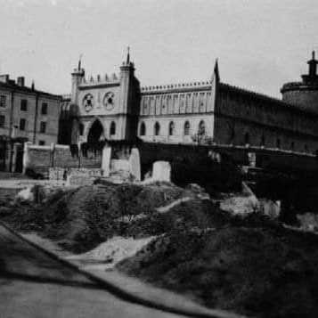  

### 1943

Gestapo aresztuje grupę Białej Róży: https://en.wikipedia.org/wiki/White_Rose

### 1941

W Krakowie w wieku 62 lat zmarł Karol Wojtyła senior (zdjęcie).
Był podoficerem Cesarskiej i Królewskiej Armii, kapitanem Wojska Polskiego, uczestnikiem pierwszej wojny światowej oraz wojny polsko-bolszewickiej. W roku 1924 pełnił służbę w Powiatowej Komendzie Uzupełnień w Wadowicach, w stopniu porucznika ze starszeństwem z 1 grudnia 1922 i 170 lokatą w korpusie oficerów zawodowych administracji, dział kancelaryjny. Po zakończeniu kariery wojskowej w stopniu kapitana (1927) został urzędnikiem. W 1934 zajmował 78 lokatę na liście starszeństwa oficerów stanu spoczynku administracji. W roku 1938, po śmierci żony Emilii przeniósł się razem z 18 letnim synem Karolem z Wadowic do Krakowa.
Tak o swoim ojcu mówił później papież Jan Paweł drugi:
" Matkę straciłem jeszcze przed Pierwszą Komunią św. w wieku 9 lat i dlatego mniej ją pamiętam i mniej jestem świadom jej wkładu w moje wychowanie religijne, a był on z pewnością bardzo duży. Po jej śmierci, a następnie po śmierci mojego starszego Brata zostaliśmy we dwójkę z Ojcem. Mogłem na co dzień obserwować jego życie, które było życiem surowym. Z zawodu był wojskowym, a kiedy owdowiał, stało się ono jeszcze bardziej życiem ciągłej modlitwy. Nieraz zdarzało mi się budzić w nocy i wtedy zastawałem mojego Ojca na kolanach, tak jak na kolanach widywałem go zawsze w kościele parafialnym. Nigdy nie mówiliśmy ze sobą o powołaniu kapłańskim, ale ten przykład mojego Ojca był jakimś pierwszym domowym seminarium .(...) W wieku dziesięciu, dwunastu lat byłem ministrantem, ale muszę wyznać, że niezbyt gorliwym. Moja matka już nie żyła... Mój ojciec, spostrzegłszy moje niezdyscyplinowanie, powiedział pewnego dnia: „Nie jesteś dobrym ministrantem. Nie modlisz się dosyć do Ducha Świętego. Powinieneś się modlić do Niego”. I pokazał mi jakąś modlitwę.(...) Nie zapomniałem jej. Była to ważna lekcja duchowa, trwalsza i silniejsza niż wszystkie, jakie mogłem wyciągnąć w następstwie lektur czy nauczania, które odebrałem. Z jakim przekonaniem mówił do mnie Ojciec! Jeszcze dziś słyszę jego głos."

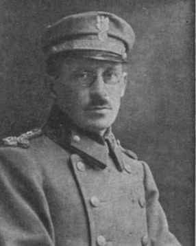  

### 1918

https://pl.wikipedia.org/wiki/Traktat_brzeski

---

<a href="https://github.com/TomaszWaszczyk/historia.waszczyk.com/edit/master/src/content/february-18.md" target="_blank">Edytuj tę stronę dzieląc się własnymi notatkami!</a>
