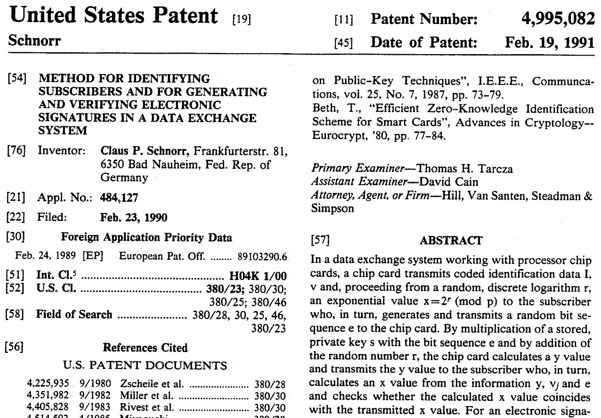
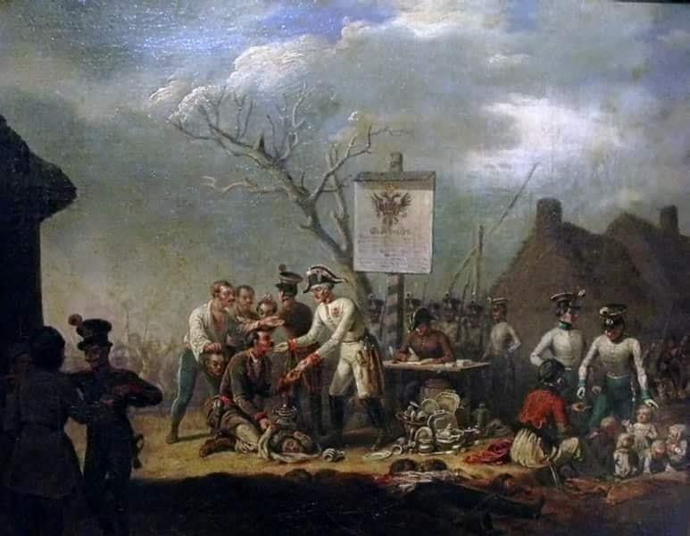
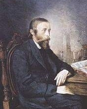

### 2023

> "Some worry that our support to Ukraine risks triggering escalation,let me be clear,there are no risk-free options,but the biggest risk of all is if Putin wins" - Jens Stoltenberg

### 2022

Pandemia jest wygaszana, ale plakaty zostały.

  

---

Kanada:

  

w Kanadzie policja na rozkaz Justin Trudeau podczas pacyfikowania pokojowych demonstracji zabiła bezbronną kobietę, a dziennikarze informują, że niszczony jest im sprzęt i używana jest wobec nich siłą fizyczna.

#TruckerConvoy2022

  

### 2021

Oficjalne dane GUS są zatrważające - od kwietnia (czas pierwszego lockdownu) do września 2020 z rynku zniknęło 2055 firm gastronomicznych, a ponad 4300 zawiesiło działalność! Długi branży sięgają już blisko 700 milionów zł... (dane nie uwzględniają jeszcze ostatnich 4 miesięcy!) Bartosz Marczuk, wiceszef Polskiego Funduszu Rozwoju (PFR), oficjalnie przyznał, że pomoc finansowa skierowana do branży gastronomicznej trafiła do 4045 przedsiębiorców. Tymczasem punktów gastronomicznych w Polsce jest nieco ponad... 70 tysięcy.

  

---

Tomasz Ga***an: Mówi, że bitek zostanie zablokowany przez rządy państw.

---

### 2020

Google is planning to move its British users’ accounts out of the control of European Union privacy regulators, placing them under US jurisdiction instead, the company confirmed late on Wednesday.

The shift, prompted by Britain’s exit from the EU, will leave the sensitive personal information of tens of millions with less protection and within easier reach of British law enforcement.

Alphabet Inc’s Google intends to require its British users to acknowledge new terms of service including the new jurisdiction, according to people familiar with the plans.

### 1991

  

### 1846

https://pl.wikipedia.org/wiki/Rze%C5%BA_galicyjska

Na terytorium Galicji Wschodniej rozpoczęła się tak zwana "rabacja chłopska" czyli zbrojne powstanie chłopskie skierowane głównie przeciwko szlachcie nazywane też nie bez powodu "rzezią galicyjską".
Chłopi, zmęczeni swoją trudną sytuacją oraz prawie nieograniczonymi wobec nich prawami szlachty, która bardzo często zmuszała ich do odrabiania pańszczyzny,a dodatkowo podburzani przez Austriaków, którym na rękę był bunt przeciwko szlachcie w ciągu około półtora miesiąca dokonali setek mordów i napaści na szlachcicach i ich majątkach. Jednym z najkrwawszych wydarzeń były te, które miały miejsce w okolicach Grybowa i Limanowej, gdzie według szacunków zamordowano nawet 3000 osób, niemal wyłącznie ziemian, urzędników dworskich i rządowych oraz kilkudziesięciu księży. Chłopi z wyjątkowym bestialstwem mordowali swoich dziedziców, m.in. odpiłowywali im głowy. Austriacy wypłacali również nagrody pieniężne za głowy zamordowanych ziemian. Ponieważ kwota wypłacana za martwych była dwukrotnie wyższa od płaconej za rannego, wiele osób, przywiezionych jako ranne do siedziby starostwa w Tarnowie, zamordowano na progu tego budynku stojącego w centrum miasta. Było to tak masowe, że ulicami płynęła krew.
Powstanie zakończyły władze austriackie, które uznały, że chłopski bunt nie jest im już do niczego potrzebny.

  

https://pl.wikipedia.org/wiki/Jakub_Szela

---

Został aresztowany Ignacy Łukasiewicz.
Był on nie tylko znanym wynalazcą, ale także jednym z przywódców powstania rzeszowskiego przeciwko austriackiemu zaborcy, do którego jednak nigdy nie doszło. W areszcie przebywał przez dwa lata. W 1848 roku został przeniesiony z więzienia w Rzeszowie do Lwowa. Jednak w styczniu 1848 roku Najwyższy Trybunał Sprawiedliwości w Wiedniu umorzył postępowanie przeciwko niemu.
Łukasiewicz był nie tylko wynalazcą lampy naftowej. Dzięki niemu powstała w 1854 roku pierwsza na świecie i czynna do dziś kopalnia rooy naftowej w Bóbrce.Trzy lata później w Klęczanach koło Jasła otworzył również pierwszą na świecie rafinerię ropy naftowej. To także on pierwszy wyprodukował z ropy kilka rodzajów smaru i asfalt.

  

### 1812

https://pl.wikipedia.org/wiki/Zygmunt_Krasi%C5%84ski

---

<a href="https://github.com/TomaszWaszczyk/historia.waszczyk.com/edit/master/src/content/february-19.md" target="_blank">Edytuj tę stronę dzieląc się własnymi notatkami!</a>
