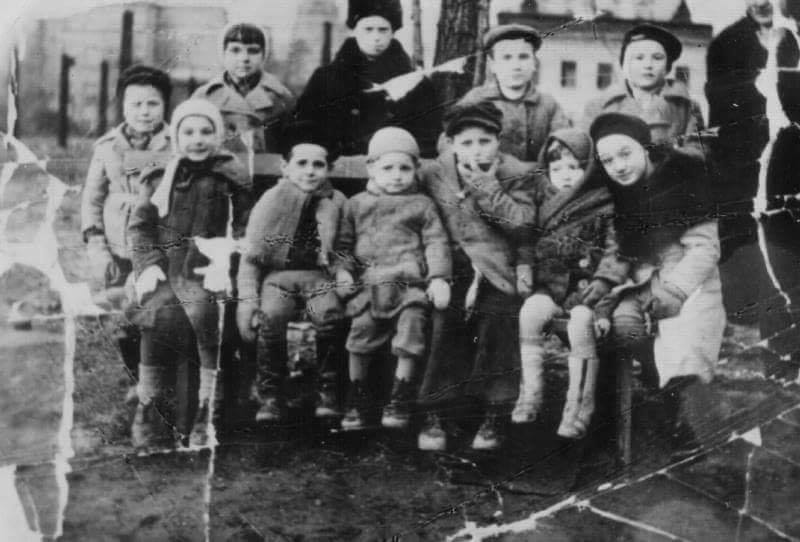
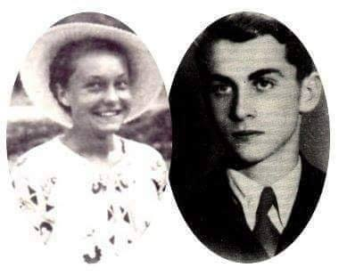
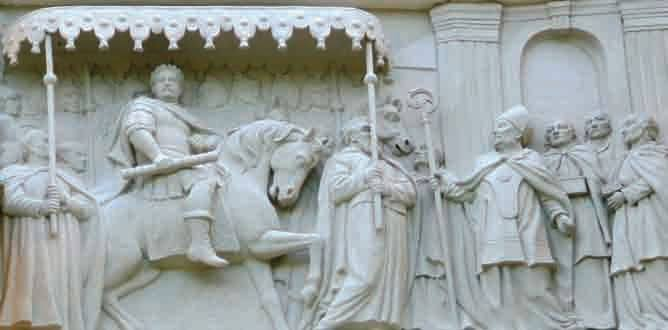
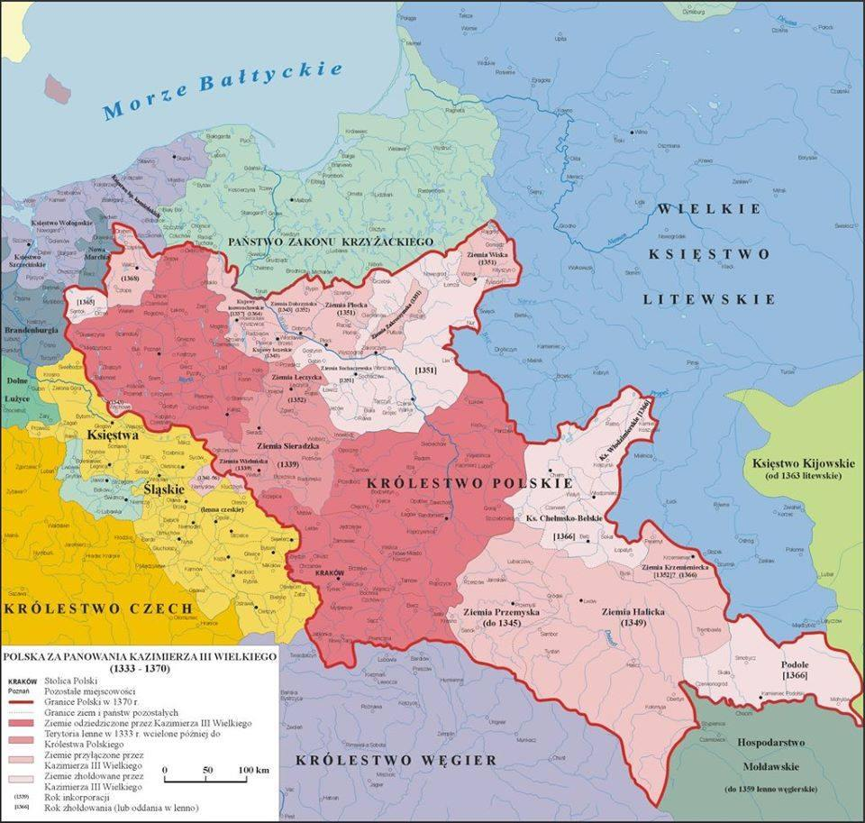

### 2021

Likwidacja lokalnej przedsiębiorczości(na rzecz czeboli):

Obecna sytuacja zmusza coraz więcej przedsiębiorców do sprzedaży własnego biznesu. Trudno jednak znaleźć nabywców na hotel czy restaurację.

Dochodowy lokal gastronomiczny, kompleks restauracyjno-hotelowy, klub muzyczny, pasaż handlowy wraz z najemcami – takich ogłoszeń o biznesach wystawionych na sprzedaż na różnych portalach inwestycyjnych jest już całe zatrzęsienie.

---

W niedzielę Ministerstwo Rolnictwa i Rozwoju Wsi poinformowało, że zarejestrowano pierwszy w Polsce przypadek zakażenia SARS-CoV-2 u norek. Wirus został zdiagnozowany na fermie w woj. pomorskim na terenie powiatu kartuskiego. Hodowcy wskazują, że to kolejna furtka do zniszczenia przemysłu futrzarskiego w Polsce.

Dodatkowo, hodowcy wskazują, że w myśl rozporządzenia wydanego przez ministra rolnictwa hodowcy norek nie dostaną odszkodowań za „zlikwidowane” zwierzęta. To już kolejna, po „piątce dla zwierząt”, próba zniszczenia polskiej branży futrzarskiej przez rząd.

Warte uwagi, że do podobnej sytuacji doszło już w zeszłym roku w Danii - wtedy to po wykryciu nowej mutacja koronawirusa u norek, premier Mette Frederiksen ogłosiła na początku listopada, że zlikwidowanych zostanie ok. 17 mln milionów norek w Danii, która jest największym na świecie eksporterem ich futer. Po rozpoczęciu operacji, decyzja o jej przeprowadzeniu została zakwestionowana przez sąd, bowiem okazało się, że nie miała podstaw prawnych. Skandal doprowadził do rezygnacji ministra rolnictwa.

---

### 2020

Według Winstona Churchilla "Niemcy powinno się bombardować co 50 lat, profilaktycznie, bez podania przyczyny". Od poprzedniego bombardowania trochę czasu już minęło, nikt się za nie raczej nie zabiera, Niemcy postanowili więc wziąć sprawy w swoje ręce, a dokładniej władze Berlina postanowiły nadrobić zaległości wprowadzając kontrolę czynszów w postaci zamrożenia opłat za wynajem mieszkań na 5 lat.

Czy ma to związek z bombardowaniem? Ano ma. Szwedzki (i oczywiście lewicujący) profesor ekonomii Assar Lindbeck, stwierdził kiedyś ,że kontrola czynszów jest najlepszą, poza bombardowanie, metodą na zniszczenie miasta. Dlaczego tak się jest?

Prawa popytu i podaży nie da się tak po prostu wyłączyć. Jeżeli ograniczamy wzrost cen wynajmu, sprawiamy, że popyt na mieszkania zaczyna rosnąć. Równocześnie maleje też podaż mieszkań, ponieważ ich budowanie staje się mniej opłacalne. Ale to nie koniec efektów. Właściciele obłożonych kontrolą nieruchomości nie inwestują w nie, nie robią remontów, nie odnawiają elewacji. Po co mieliby to robić, jeżeli nie spowoduje to wzrostu wpływów z najmu? Lokatorzy z mieszkań objętych kontrolą nie wyprowadzają się z nich, nawet jeżeli nie potrzebują tak dużego mieszkania, ponieważ nie mają ekonomicznych bodźców by to zrobić. Dochodzi do nieefektywnej alokacji zasobów mieszkaniowych. To nie tylko teoria. Zjawiska te można obserwować od dekad w różnych miastach w USA i w Europie.

Negatywny wpływ kontroli czynszów na rynek mieszkań jest tak oczywisty i tak łatwo obserwowalny empirycznie, że wśród ekonomistów panuje w tej sprawie konsensus,. Niestety zawsze znajdą się jacyś pobratymcy płaskoziemców, którzy wierzą, że tym razem socjalizm zadziała. Pół biedy, gdy ktoś wierzy w strzygi, dżiny i kikomory na swój prywatny użytek, kiedy jednak ktoś taki zaczyna mieć wpływ na prawo, robi się zdecydowanie groźniej, o czym Berlińczycy się wkrótce przekonają.

Wzrost cen mieszkań w europejskich metropoliach jest oczywiście problemem. Czy jednak naprawdę nie da się nic z tym zrobić? Czy w największych miastach ceny nieruchomości muszą tak szybko i tak mocno rosnąć? Nie. Mamy przykłady miast które poradziły sobie z tym problemem za pomocą rozwiązań wolnorynkowych. Sprawa jest prosta. Aby ceny nie rosły przy rosnącym popycie, trzeba sprawić, aby wzrosła podaż. Nie mówię oczywiście o jakichś subsydiach czy dopłatach do budowy mieszkań. Okazuje się, że wystarczy nie przeszkadzać.

W latach osiemdziesiątych Japonia również zmagała się z wysokimi cenami nieruchomości. Wtedy to bardzo zliberalizowano prawo budowlane, usuwając mnóstwo utrudnień w budowie oraz burzeniu budynków. Efekt? od dwudziestu lat ceny nieruchomości w Tokio prawie nie wzrosły, za to mieszkań buduje się tam na potęgę. Dziesięć lat po Tokio tą samą drogą poszło Houston w USA. Efekt? Ten sam.

Usunięcie biurokratycznych ograniczeń w budownictwie ma jednak też swoje wady. Miasto staje się bardziej dzikie, pojawia się architektoniczny i urbanistyczny bałagan. Jest to koszt, który trzeba ponieść, jeżeli chce się sprawić, by mieszkania były bardziej dostępne. Osobiście nie mam zdania, gdzie dokładnie należy znaleźć złoty środek pomiędzy anarchią w urbanistyce a drogimi mieszkaniami. Uwielbiam Barcelonę i Paryż. Ale wygląd tych miast to dzieło urbanistów z drugiej połowy XIX wieku, a nie efekt wolnego rynku.

Prawdziwa alternatywa jest więc następująca: niskie ceny mieszkań i bałagan urbanistyczny albo wysokie ceny mieszkań i porządek. Jeżeli chcemy sprawić by mieszkania były łatwo dostępne dla biedniejszej części społeczeństwa, musimy poświęcić swoje doznania estetyczne i komfort życia w mieście. Jeżeli bardziej zależy nam na walorach turystycznych i na własnej przyjemności, musimy ograniczać swobodę deweloperów kosztem najbiedniejszych. Na to nakłada się oczywiście wiele innych czynników. Wysoki poziom migracji oraz zaniżone stopy procentowe również prowadzą do wzrostu cen nieruchomości. Nie ma jednak wątpliwości, że aby zatrzymać ceny nieruchomości, trzeba zwiększyć podaż, a nie stymulować popyt i ograniczać podaż.

---

Smok mówi, że za trzy miesiące będzie mieć czas na rzeczy WAŻNE - telefon za 3 miesiące - 2 maja.

### 1952

Urodził się Ralf Merkle https://en.wikipedia.org/wiki/Ralph_Merkle

> Bitcoin is the first example of a new form of life. It lives and breathes on the internet. It lives because it can pay people to keep it alive. It lives because it performs a useful service that people will pay it to perform. It lives because anyone, anywhere, can run a copy of its code. It lives because all the running copies are constantly talking to each other. It lives because if any one copy is corrupted it is discarded, quickly and without any fuss or muss. It lives because it is radically transparent: anyone can see its code and see exactly what it does.

### 1945

https://pl.wikipedia.org/wiki/Anne_Frank

### 1943

W kościele pod wezwaniem św. Stanisława w Siedlcach odbył się demonstracyjny pogrzeb 30 dzieci przywiezionych tu z Zamojszczyzny dwa dni wcześniej. Dzieci te przybyły z transportem ponad 1000 mieszkańców tego regionu Polski objętego akcją wysiedleńczą. Ciężkie warunki, choroby, a przede wszystkim ogromny mróz sprawiły,że 30 małych Polaków nie przeżyło tej podróży. Jeden ze świadków tamtych wydarzeń tak wspomina tamten czas:

> Pamiętam jak trzymałem się matki za
> rękę, ale Niemiec oderwał mnie od niej.
> Widziałam później, jak także Niemiec uderzył
> kolbą karabinu inną matkę, która nie chciała dać malutkiego dziecka. > Kobieta ta upadła na ziemię zbroczoną krwią. Drugi Niemiec chwycił
> ją za warkocz i wyciągnął z baraku przez próg na dwór.

 

### 1942

Krzysztof Kamil Baczyński napisał utwór pt. ''Erotyk'', który zadedykował najdroższej Basi Drapczyńskiej
Krzysztof i Basia poznali się 1 grudnia 1941 roku podczas zajęć na tak zwanych tajnych kompletach. Basia Drapczyńska była córką znanego warszawskiego drukarza, właściciela drukarni przy ulicy Pięknej. Młodzi pobrali się 3 czerwca 1942 roku w kościele na Solcu w Warszawie. Niestety ich miłość zakończyła się tragicznie. Krzysztof poległ w Powstaniu Warszawskim 4 sierpnia 1944 roku w pałacu Blanka, trafiony kulą w głowę przez niemieckiego snajpera ulokowanego na budynku Teatru Wielkiego. Barbara zmarła kilka tygodni później 1 września 1944 roku trafiona w głowę odłamkiem szkła podczas powstania warszawskiego, również w tych samych okolicach.

> Erotyk

> W potoku włosów twoich, w rzece ust
> kniei jak wieczór - ciemnej
> wołanie nadaremne,
> daremny plusk.
> Jeszcze w mroku owinę, tak jeszcze róża nocy
> i mienie świat gałązka, strzępem albo gestem,
> potem niemo sie stoczy,
> smuga przejdzie przez oczy
> i powiem: nie będąc - jestem.
> Jeszcze tak w ciebie płynąc, niosąc cię tak odbitą
> w źrenicach lub u powiek zawisłą jak łzę,
> usłyszę w tobie morze delfinem srebrnie ryte,
> w muszli twojego ciała szumiące snem.
> Albo w gaju, gdzie jesteś
> brzozą, białym powietrzem
> i mlekiem dnia,
> barbarzyńcą ogromnym,
> tysiąc wieków dzwigając
> trysnę szumem bugaju
> w gałęziach twoich - ptak.
> Dedykacja:
> Jeden dzień - a na tęsknotę - wiek,
> jeden gest - a już orkanów pochód
> jeden krok - a otoś tylko jest
> w każdy czas - duch czekający w prochu.
> Mojej najdroższej Basi - Krzysztof
> dn. 2.II.42r.

 

### 1934

https://pl.wikipedia.org/wiki/J%C3%B3zef_Gryf-Czajkowski

### 1919

https://pl.wikipedia.org/wiki/Zbigniew_Lengren

### 1676

W katedrze na Wawelu zostali koronowani Jan III Sobieski i Maria Kazimiera.

Koronacja królewska Jana III Sobieskiego odbyła się 2 lutego 1676 po zakończeniu działań wojennych pod Lwowem i Trembowlą. Jan III Sobieski zdobył w ten sposób cenny czas na uporządkowanie czekających od elekcji spraw wewnętrznych.

Udało mu się także dokonać mobilizacji społeczeństwa szlacheckiego do walnej rozprawy z Turcją, pozwalającej myśleć o uzyskaniu korzystnego dla Rzeczypospolitej pokoju. Na sejmie koronacyjnym (2 lutego - 14 marca) ogarnięci patriotycznym zapałem posłowie uchwalili zgodnie z życzeniem króla podatki umożliwiające utworzenie armii polskiej liczącej aż 80 tys. żołnierzy, lecz na skutek opóźnienia wykonania uchwał podatkowych przez szlachtę wielkopolską i litewską, wśród której uwijali się agenci austriaccy i brandenburscy, król mógł przeciwstawić 40-tysięcznej armii turecko - tatarskiej zaledwie 20 tys. żołnierzy.

W tej sytuacji trudno było marzyć o pokonaniu przeciwnika dowodzonego po śmierci Szyszmana przez Ibrahima Szejtana, paszę Damaszku, który w sierpniu przeprawił się przez Dniestr, zdobywając następnie szereg twierdz na Podolu (Czortków, Buczacz, Jazłowiec), obległ Stanisławów, a czambuły tatarskie grasowały po kraju uprowadzając wiele jasyru.

23 września wojsko koronne dotarło do Żórawna, w dobrze wybranym strategicznie miejscu zakładając obóz warowny, w którym przez kilka tygodni, przy pogarszającej się sytuacji aprowizacyjnej i załamaniu pogody, wojsko Sobieskiego wytrzymywało ataki wojsk oblężniczych, którym zresztą również zaczęły doskwierać liczne niedogodności.

W tej sytuacji 17 października 1676 roku podpisano rozejm, określający warunki wstępne przed rokowaniami pokojowymi. Strona turecka nie odważyła się już żądać haraczu, obiecała również zwrócić jeńców wziętych w ostatniej kampanii i zabroniła Tatarom wypraw na ziemie polskie, zatrzymała natomiast Kamieniec Podolski i Ukrainę prawobrzeżną. Pozostałe kwestie terytorialne odłożono do rokowań pokojowych. Jedynie możliwe warunki (jak na trudne położenie własnych wojsk) zostały przyjęte bardzo źle przez szlachtę podolską, pozbawioną możliwości powrotu do swych majątków; przeciwko nim występowali również często inni, nie bacząc, iż sami przyczynili się decydująco do słabości militarnej Rzeczypospolitej.

W czasie trudnych, pomimo przegranej przez Turcję w 1677 roku kampanii przeciwko Moskwie, rokowań poselstwa polskiego w Stambule, prowadzonych od sierpnia 1677 roku i zatwierdzonych w kwietniu 1678 roku przez sułtana Mehmeda IV, powtórzono w zasadzie warunki rozejmu żórawińskiego, z tym że Turcja zrezygnowała tylko z niewielkiego terytorium (Pawołocz i Biała Cerkiew) i definitywnie z haraczu, nigdy zresztą przez Polskę nie wypłaconego, wymogła również zapewnienie o niełączeniu się Rzeczypospolitej z wrogami Turcji.

Pokój ucieszył Francję, natomiast wywołał irytację na dworach papieskim i cesarskim. Rozejm żórawiński oraz pokój stambulski pozwoliły na kilka lat odetchnąć od wojen, toczonych przez Polskę niemal nieustannie od trzydziestu lat.

 

### 1339

Król Kazimierz Wielki ratyfikował postanowienia drugiego zjazdu władców Europy środkowej w Wyszehradzie. Na jego mocy stawiał się spadkobiercą Rusi Halickiej w przypadku bezpotomnej śmierci tamtejszego księcia. Bez tamtego, nieco zapomnianego traktatu, w granicach Polski nie byłoby Sanoka, Przemyśla i wielu innych miast.
Gdy w kwietniu 1340 roku na skutek spisku możnych zginął halicki książe Jerzy Bolesław Trojdenowicz, król Kazimierz Wielki nie wahał się długo z interwencją w sąsiednim państwie. Na mocy postanowień II zjazdu wyszehradzkiego Ruś Czerwona – jak wówczas określano te tereny – stanowiła jego spadek. W „masie spadkowej” znajdowały się m.in. znaczące grody jak Przemyśl, Sanok, Lwów. Rozstrzygnięcia, które zapadły w pierwszej połowie XIV wieku, na czterysta lat uregulowały kwestie terytorialne w tej części Europy, zaś obecne Podkarpacie na trwale związały się z Polską.
Dwa zjazdy wyszehradzkie:
Zanim jednak król Kazimierz Wielki na czele swych zastępów mógł w majestacie ówczesnego prawa międzynarodowego wkroczyć na Ruś musiał nastąpić szereg zdarzeń, który sankcjonowałyby jego działania. Nieco zapomnianymi, chociaż niezwykle istotnymi- z punktu widzenia późniejszego rozwoju sytuacji, były dwa zjazdy w węgierskim Wyszehradzie. Swego rodzaju konferencje głównych ówczesnych „graczy” w Europie środkowo-wschodniej, mające na celu rozwiązanie spornych kwestii i ustalenie w tej części Europy politycznej równowagi.
Pierwszy zjazd wyszehradzki, na którym zjawili się Kazimierz Wielki, król czeski Jan Luksemburczyk oraz władca Węgier Karol Andegaweński, miał miejsce w listopadzie 1335 roku. Jego celem było wyjaśnienie spornych kwestii między Kazimierzem i Janem (roszczącym sobie prawa do polskiej korony) oraz wyjaśnienie kwestii przynależności Pomorza, zajętego niemal trzydzieści lat wcześniej przez Krzyżaków. Na spotkaniu monarchów ustalono, że Zakon Krzyżacki może zatrzymać w swoim osiadaniu Pomorze i Ziemię Chełmińską, musi natomiast zwrócić Polsce Kujawy i Ziemię Dobrzyńską. Udało się zawrzeć także porozumienie w sprawie korony polskiej, o w zasadzie ostatecznie kończyło proces jednoczenia ziem polskich. Jan Luksemburczyk zrezygnował ze swych roszczeń w zamian zadowalając się rekompensatą finansową w niebagatelnej wysokości 20 000 kop groszy praskich. Zawarty został także antyhabsburski sojusz Polski, Czech i Węgier.
Z punktu widzenia mieszkańców obecnego Podkarpacia znacznie większe miał drugi zjazd monarchów, który odbył się w 1338 lub 1339 roku (zdania historyków co do dokładnej daty są podzielone). Tym razem dyskutowano m.in. o zachowaniu czeskiego stanu posiadania na Śląsku i Mazowszu oraz przyszłości Rusi. W zamian za uznanie racji Jana Luksemburczyka Kazimierz Wielki otrzymał gwarancje, że czeski władca nie będzie przeszkadzał przy kolejnych próbach doprowadzenia Krzyżaków z którymi Polska toczyła spory terytorialne, przed sąd papieski.
Ruski spadek:
Oprócz władców Polski, Czech i Węgier na zjeździe pojawił się książe halicko-włodzimierski Jerzy Bolesław II Trojdenowicz. Ówczesna sytuacja polityczna za naszymi wschodnimi granicami była mocno skomplikowana. O rozdartą wewnętrznymi sporami i podzieloną na szereg księstw Ruś upominali się sąsiedzi. Aspiracje do tych terenów mieli Polacy, Węgrzy, Tatarzy i Litwini.
Jerzy Trojdenowicz, spokrewniony z Kazimierzem, potomek Konrada Mazowieckiego, zdawał sobie sprawę z faktu, że jego władza w księstwie jest nieustannie zagrożona, zarówno przez wrogów zewnętrznych jak i silną opozycję wewnętrzną. Książe zasiadł na tronie w 1325 roku po śmierci otrutych przez wrogów książąt z dynastii Rurykowiczów: Andrzeja II i Lwa II. Balansujący między katolicyzmem a prawosławiem, otoczony przez lokalne mocarstwa, zmuszony był szukać wsparcia dla swej kruchej władzy.
By zagwarantować sobie ewentualną pomoc zbrojną wojsk polskich i węgierskich w rozprawie z opozycją Jerzy II pojawił się w Wyszehradzie. Ostatecznie wynegocjowano, że w przypadku bezpotomnej śmierci księcia jego dobra w spadku przypadną Kazimierzowi Wielkiemu. Z kolei, by zaspokoić aspiracje węgierskie ustalono jednocześnie, że jeżeli z kolei polski władca umrze bezpotomnie, to jego tron przypadnie węgierskiemu królewiczowi Ludwikowi. Tez zapis, jak się okazało po latach, miał ogromne znaczenie.
Marsz na wschód:
Sprawy ruskie nadzwyczaj szybko musiały zaabsorbować Kazimierza Wielkiego. Niedługo po II zjeździe wyszehradzkim, wiosną 1340 roku Jerzy zmarł. Niemal pewne jest, że został otruty przez lokalnych możnowładców, którzy zarzucali mu m.in. dążenia do ograniczenia ich władzy oraz nadmierne faworyzowanie kleru katolickiego i cudzoziemców. Dla Kazimierza Wielkiego był to sygnał do interwencji.
Wśród grodów księstwa halicko-włodzimierskiego, którego głównymi miastami były Włodzimierz (stolica) oraz Lwów, istotne znaczenie miały także Sanok, Jarosław, Przemyśl i szereg innych pereł dzisiejszego Podkarpacia. Śmierć Jerzego i interwencja Kazimierza Wielkiego rozpoczęły trwający szereg lat okres walk o Ruś Halicko-Włodzimierską. Już w kilka tygodni po zgonie księcia ruszyli Litwini, zajmując północne rubieże spornych terenów: Włodzimierz, Bełz, Chełm. Z kolei Kazimierz Wielki w kwietniu 1340 roku na czele niewielkich sił zajął Lwów, spalił tamtejszy zamek, przejął zgromadzone tam dobra i powierzył miejscowym Niemcom obronę grodu. Byłą to w zasadzie demonstracja siły. Poważniejsze zaangażowanie militarne miało nastąpić nieco później.
Do rozgrywki o Ruś prócz Polaków i Litwinów włączyli się Tatarzy, którzy mając wsparcie części bojarów zaatakowali w początkach 1341 roku. Atak został odparty, Polacy przystąpili do ofensywy. Jak pisał później Jan Długosz: - W dzień Narodzenia św. Jana Chrzciciela prowadzi (Kazimierz – przyp. autora) wojsko zebrane ze wszystkich ziem na Ruś i zdobywa zagarnia pod swoje panowanie, szczególnie, że niektórzy dobrowolnie się poddawali – zamki i miasta zarówno w Przemyślu, jak Haliczu, Łucku, Włodzimierzu, Sanoku, Lubaczowie, Trembowli i Tustaniu i pozostałe warownie.
Walki, głównie z Litwinami o Ruś Halicką trwały jeszcze, ze zmiennym szczęściem, kilka dziesięcioleci. Polacy wspierani byli przez Węgrów, liczących na sukcesję tronu polskiego. Po śmierci Kazimierza Wielkiego tereny te faktycznie podlegały koronie węgierskiej, w imieniu której rządy sprawował tu książe opolski Władysław. W 1387 roku królowa Jadwiga ponownie zajęła prawie całą Ruś Halicką. Ostateczne uregulowanie kwestii przynależności tych obszarów nastąpiło w czasie ugody w Ostrowie w 1392 na mocy której Wielkie Księstwo Litewskie (już związane z Koroną Polską unią krewską) otrzymało potwierdzenie praw do ziemi łuckiej i włodzimierskiej.
Dla terenów przyłączonych do Polski nastąpił okres gwałtownego rozwoju i napływu osadników. Jeszcze w 1366 roku Kazimierz Wielki uroczyście potwierdził prawa miejskie Sanoka przyznane w 1339 roku przez księcia Jerzego. Kolejne grody wchłaniane przez Królestwo Polskie otrzymywały przywileje. Jak się okazało , postanowienia II zjazdu wyszehradzkiego miały przetrwać ponad 400 lat, do I rozbioru Polski w 1772 roku. A w zasadzie nawet do dzisiaj, bo przecież część terenów, których spadkobiercą został Kazimierz Wielki, jest obecnie częścią Polski.

  

---

<a href="https://github.com/TomaszWaszczyk/historia.waszczyk.com/edit/master/src/content/february-2.md" target="_blank">Edytuj tę stronę dzieląc się własnymi notatkami!</a>
