### 2024

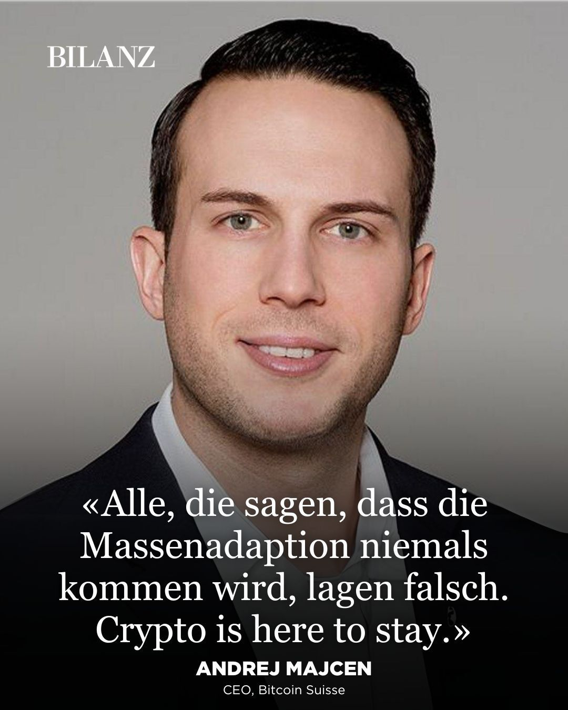<br><br>

---

<br><br>

<a href="./documents/february/KUBIS.pdf" target="_blank">„Poznacie prawdę, a prawda was wyzwoli”…</a>

---

Hołownia na wojnę, marsz!

<video width="640" height="480" controls>
<source src="./movies/february/holownia-duren.mp4" type="video/mp4">
Your browser does not support the video tag.
</video>

---

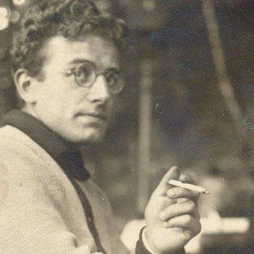<br><br>

Über die Seele im Zeitalter der zweiten industriellen Revolution

<br><br>

„Um jede Revolte im Voraus zu ersticken, darf man nicht gewalttätig vorgehen. Methoden wie die Hitlers sind überholt. Es reicht aus, eine kollektive Konditionierung zu schaffen, die so stark ist, dass die Idee der Revolte den Menschen nicht einmal mehr in den Sinn kommt. Das Ideal wäre, Individuen von Geburt an zu formatieren, indem man ihre angeborenen biologischen Fähigkeiten einschränkt ...

Dann würden wir die Konditionierung fortsetzen, indem wir die Bildung drastisch reduzieren, um sie wieder zu einer Form der beruflichen Integration zu bringen. Ein ungebildeter Mensch hat nur einen begrenzten Denkhorizont, und je mehr sein Denken auf mittelmäßige Beschäftigungen beschränkt ist, desto weniger kann er rebellieren. Es muss sichergestellt werden, dass der Zugang zu Wissen immer schwieriger und elitärer wird … dass die Kluft zwischen den Menschen und der Wissenschaft größer wird, dass Informationen, die für die breite Öffentlichkeit bestimmt sind, von jeglichen Inhalten subversiver Natur betäubt werden. Vor allem keine Philosophie. Auch hier müssen wir Überzeugungsarbeit leisten und keine direkte Gewalt: Wir werden massiv über das Fernsehen Unterhaltung ausstrahlen, die immer dem Emotionalen oder Instinktiven schmeichelt.

Wir werden die Köpfe mit dem Vergeblichen und Spielerischen beschäftigen. Es ist gut, durch unaufhörliches Geschwätz und Musik den Geist vom Denken abzuhalten.

Sexualität wird in den Vordergrund der menschlichen Interessen gestellt. Als soziales Beruhigungsmittel gibt es nichts Besseres. Im Allgemeinen werden wir darauf achten, den Ernst des Daseins zu verbannen, alles zu verspotten, was einen hohen Wert hat, eine ständige Entschuldigung für die Leichtigkeit aufrechtzuerhalten; damit die Werbeeuphorie zum Maßstab menschlichen Glücks und zum Vorbild der Freiheit wird.

Die Konditionierung wird also von sich aus eine solche Integration erzeugen, dass die einzige Angst (die aufrechterhalten werden muss) die sein wird, aus dem System ausgeschlossen zu werden und daher nicht mehr auf die Bedingungen zugreifen zu können, die für das Glück notwendig sind. Der so produzierte Massenmensch muss als das behandelt werden, was er ist: ein Kalb, und er muss beaufsichtigt werden, wie es eine Herde sein muss. Alles, was die Klarheit einschläfert, ist sozial gut, alles, was sie zu erwecken droht, muss verspottet, unterdrückt, bekämpft werden...

Jede Doktrin, die das System in Frage stellt, muss zuerst als subversiv und terroristisch bezeichnet werden, und diejenigen, die sie unterstützen, müssen dann als solche behandelt werden. Wir stellen jedoch fest, dass es sehr einfach ist, ein subversives Individuum zu korrumpieren: Alles, was Sie tun müssen, ist ihm Geld und Macht anzubieten.“

```« Die Antike des Menschen »/« Die Obsoleszenz des Menschen », Auszug aus Günther Anders, deutscher Schriftsteller, Jahrgang 1956, Seite 122.```

---

„Aby z góry stłumić wszelkie bunty, nie należy robić tego brutalnie. Archaiczne metody jak Hitler, są zdecydowanie przestarzałe. Wystarczy stworzyć zbiorowe uwarunkowanie tak potężne, że sama idea buntu nie przyjdzie już nawet do głowy.

Najlepszym sposobem byłoby formatowanie ludzi od urodzenia poprzez ograniczenie ich wrodzonych zdolności biologicznych… Następnie kontynuujemy uwarunkowanie poprzez drastyczne obniżenie poziomu i jakości edukacji, przywracając je do formy zatrudnienia. Osoba niewykształcona ma ograniczony horyzont myślenia, a im bardziej ograniczona jest jego myślenie materialne, mierne, tym mniej może się buntować.

Należy sprawić, aby dostęp do wiedzy stał się coraz trudniejszy i elitarny… pogłębia się przepaść między ludźmi a nauką, aby informacje skierowane do ogółu społeczeństwa zostały znieczulone wszelkimi wywrotowymi treściami. Szczególnie bez filozofii. Znów należy użyć przekonywania, a nie bezpośredniej przemocy: będziemy transmitować masowo za pośrednictwem telewizji rozrywkę, która zawsze pomaga emocjonalnemu i instynktowemu ogłupieniu.

Zajmiemy umysły tym, co jest daremne i zabawne. Dobrze jest z nieustanną gadką i muzyką, aby nie zadawać sobie pytań, myślenia i myślenia. Seksualność będzie najważniejsza w ludzkich interesach. Jako znieczulenie społeczne, nie ma nic lepszego. Ogólnie rzecz biorąc, należy zabronić powagi egzystencji, wyśmiewać wszystko, co ma wysoką wartość, utrzymywać ciągłe apologię lekkości, tak aby euforia reklamy i konsumpcji stała się cenną standardową podstawą ludzkiego szczęścia i wzorem wolności.

Opakowanie samo w sobie spowoduje taką integrację, że jedynym lękiem (który trzeba będzie podtrzymywać) jest wykluczenie z systemu i tym samym utrata dostępu do warunków materialnych niezbędnych do szczęścia. Masowy człowiek, tak wyprodukowany, powinien być traktowany tak, jak jest: produktem, cielęciem i musi być monitorowany tak, jak powinno być stado. Wszystko, co pozwala uśpić jego jasność, jego krytyczny umysł jest dobre społecznie, więc to co mogłoby go obudzić, musi być zwalczone, wyśmiewane, duszone…

Wszelkie doktryny kwestionujące system muszą być najpierw wyznaczone jako wywrotowe i terrorystyczne, a ci, którzy ją popierają, będą musieli być traktowani jak takie właśnie.”

`Günther Anders „ludzka przestarzałość” 1956`

---

### 2023

Ukraina/Kijów. Joe Biden przyjechał dokładnie w rocznicę jednych z najtragiczniejszych wydarzeń podczas Euromajdanu w 2014 r. Złożył wieniec pod pomnikiem "Niebiańskiej Sotni".

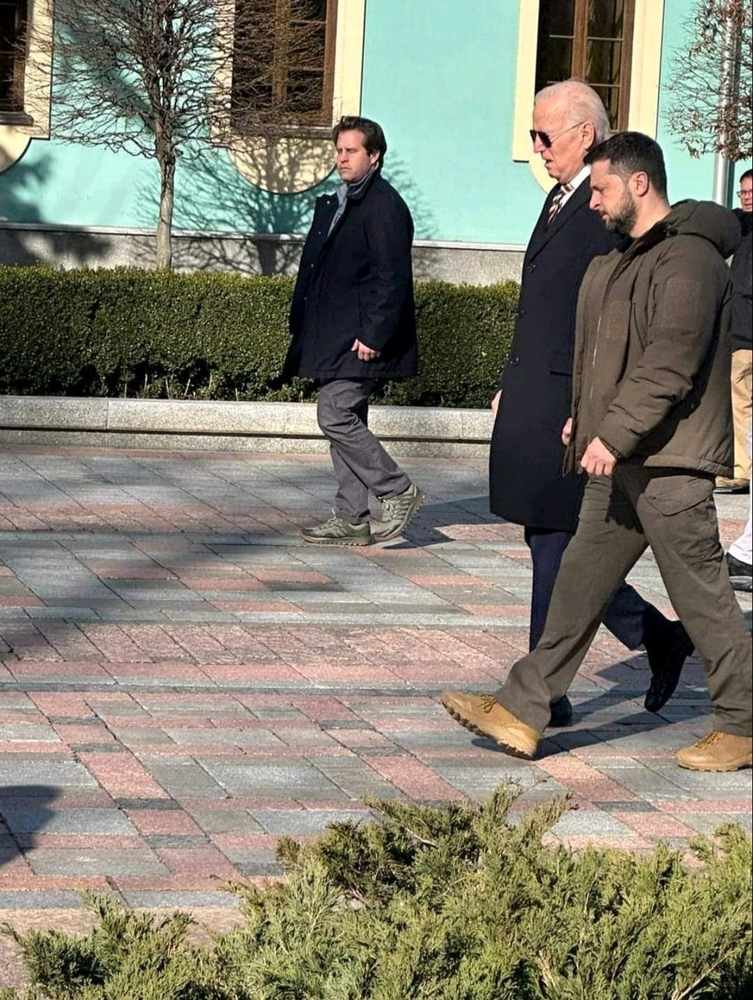<br><br>

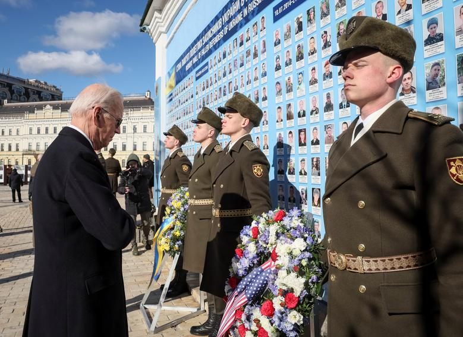<br><br>

---

New Era:

<br><br>

---

### 2021

China vs Zuckerberg flip sides of the same coin, both are childish bullies.
Bullies might hit, kick, or push to hurt people, or use words to call names, tease, and even threaten people with harm..

"In the end, most bullies wind up in trouble. If they keep acting mean and hurtful, sooner or later they may have only a few friends left. The power they wanted slips away fast. Other kids move on and leave bullies behind."

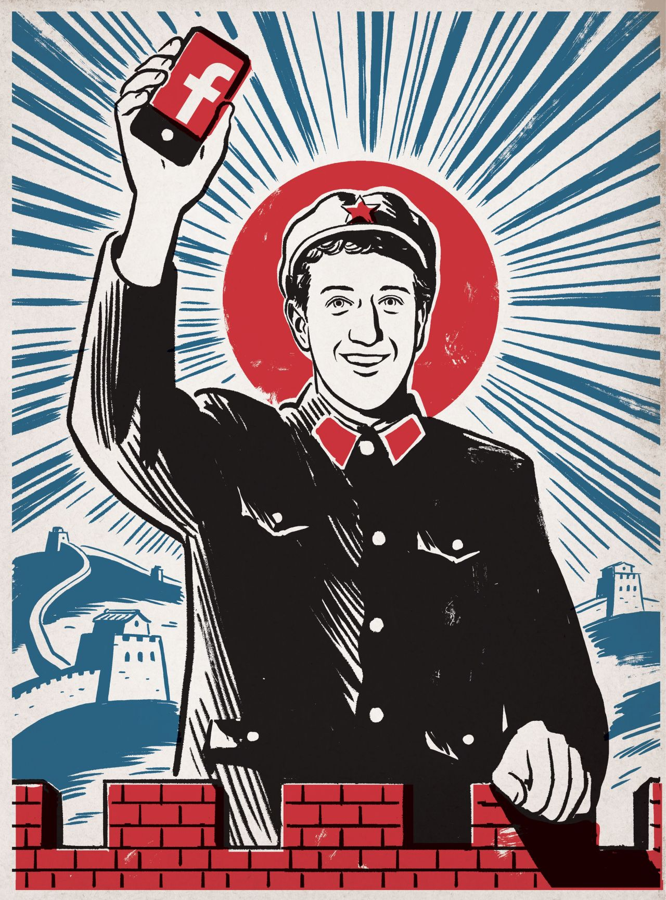<br><br>

### 2004

<a href="./documents/february/FRBSpeechBernanke-TheGreatModeration--February-20_2004.html" target="_blank">The Great Moderation</a>

### 1952

Meet the first accredited female jet pilot in NATO, Col Leman Bozkurt. Turkish women continue to lead in every aspect of Turkish society/ economy since Turkiye joined NATO in 1952.

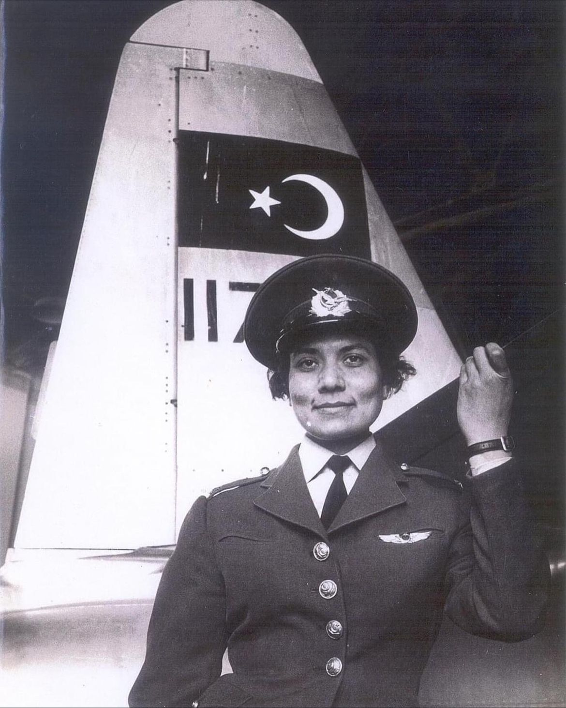<br><br>

### 1945

W Jabłonówce w obwodzie lwowskim bandyci ze Służby Bezpeky zamordowali Ukrainkę Hannę Bogomołową- kierowniczkę tamtejszego młyna, która miała odwagę odmówić im dostaw mąki. Dowódcą oddziału, który miał na swoim koncie wiele innych dokonanych w tym rejonie zbrodni był Dymitr Kupiaka. Trzy dni wcześniej te same bestie zamordowały polskie mażłeństwo z Grabowa ich byli: inspektor oświaty rejonu Busk – Konstanty Naczas i jego żona, nauczycielka – Maria (zdjęcie).
Ich córka Lidia Poroniuk tak wspominała:
" Na całe życie w mojej pamięci pozostało, jak tego wieczora rodzice mnie kąpali. Nagle do pokoju weszło kilku bandytów. Jeden z nich wydał mi się bardzo wysokiego wzrostu, zaczął roz-mawiać z ojcem a potem strzelił do niego. Ojciec upadł, w pokoju zgasła lampa. Bardzo się przestraszyłam i zaczęłam krzyczeć”.
Tak zaś mówił o zbrodni ojciec Marii Naczas:
" Bandyci weszli do naszej chałupy i kazali podać wieczerzę. Po wieczerzy powiedzieli, że mają sprawę do nauczycieli i weszli do drugiego pokoju, gdzie mieszkała córka Maria, z mężem i dzieckiem. Mojej żony do tego pokoju nie wpuścili. Po kilku minutach oddali pięć strzałów i natychmiast wyszli. Jeden z nich kazał zabrać dziecko. Kiedy z żoną weszliśmy do pokoju, córka i jej mąż leżeli martwi. Córka miała kilka ran w głowie, jej mąż tylko jedną”.

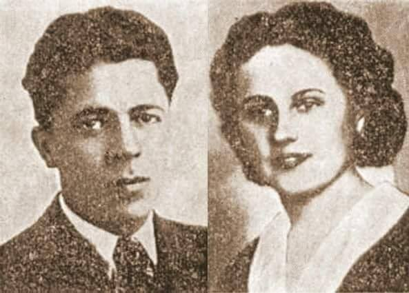<br><br>

### 1938

Wizytę w Polsce złożył premier Prus Hermann Göring (na zdjęciu z Ignacym Mościckim). Była to czwarta wizyta tego polityka w Polsce. Jej celem było nawiązanie współpracy z ówczesnymi najważniejszymi polskimi osobistościami politycznymi, w których władze Niemiec upatrywały sojuszników w stworzeniu paktu przeciwko Rosji. Podczas wizyty Hermann Göring rozmawiał również z marszałkiem Śmigłym-Rydzem, premierem Składkowskim i ministrem Beckiem. Jednym z elementów wizyty było polowanie w Puszczy Białowieskiej, w czasie którego pruski premier upolował 13 dzików i lisa, a także złożył Mościckiemu obietnicę podarowania samochodu Meredes- Benz, którą wywypełnił w sierpniu 1938 roku.

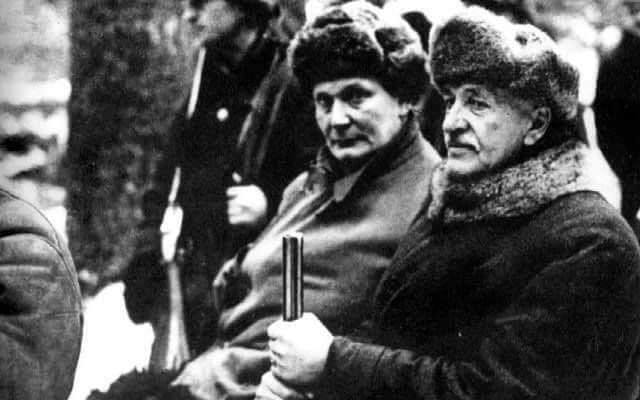<br><br>

### 1919

Sejm Ustawodawczy Rzeczpospolitej Polskiej zatwierdził Józefa Piłsudskiego jako Naczelnika Państwa. Nazwa tej funkcji miała być wyraźnym nawiązaniem do najlepszych lat okresu kościuszkowskiego.
Wydaje się, że był to zabieg czysto formalny, ponieważ Piłsudski mianowany na tę funkcję, chociaż tylko tymczasowo dekretem o najwyższej władzy reprezentacyjnej Rzeczpospolitej Polskiej zajmował to stanowisko już od 22 listopada 1918 roku. Marszałek pełnił tę funkcję do 11 grudnia 1922 roku, kiedy to przekazał ją pierwszemu prezydentowi drugiej RP Gabrielowi Narutowiczowi.

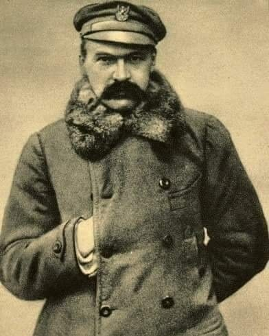<br><br>

### 1894

W Rzeszowie urodził się Mieczysław Boruta -Spiechowicz (zdjęcie)-generał brygady Wojska Polskiego, dowódca 4 Pułku Strzelców Podhalańskich,weteran wojny polsko-bolszewickiej, żołnierz Polskiej Organizacji Wojskowej, a w czasie wojny obronnej dowódca Grupy Operacyjnej "Bielsko"wchodzącej w skład Armii "Kraków".
Aresztowany przez NKWD w nocy z 13 na 14 grudnia 1939 i wywieziony do więzienia na Łubiance, gdzie przebywał do sierpnia 1941 roku.
W marcu 1943 roku został dowódcą wojsk polskich w Iranie, a następnie przeniesiony został do Wielkiej Brytanii, gdzie do roku 1945 pełnił funkcję dowódcy 1 Korpusu Pancerno-Motorowego.
W grudniu 1945 roku powrócił do Polski. Do lipca 1946 roku pełnił funkcję zastępcy szefa Departamentu Piechoty i Kawalerii w
Ministerstwie Obrony Narodowej.
Zmarł 13 października 1985 roku w Zakopanem.

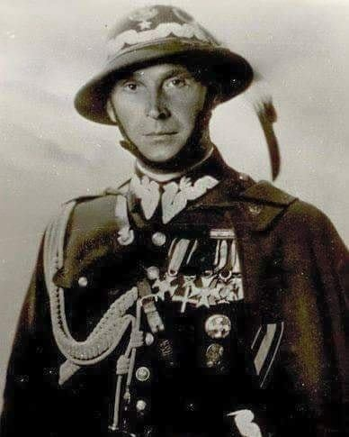<br><br>

### 1846

Wybuchło powstanie krakowskie. Było ono wynikiem planów przeprowadzenia jednoczesnego ogólnonarodowego zrywu na terenie wszystkich zaborów. Niektórzy działacze próbowali przy tej okazji powalczyć o ideę wyzwolenia chłopskiego. Okazało się później, że zryw ten możliwy jest tylko na terenie zaboru austriackiego, ponieważ policja rosyjska i pruska skutecznie inwigilowały działaczy opozycyjnych i niweczyły ich działalność.
Już 21 lutego po wyparciu Austriaków z Krakowa powstał tam rząd, na którego czele stanął Jan Tyssowski. Jednak szybki odwet Austriaków i skuteczne próby buntowania chłopów przeciwko szlachcie doprowadziły już 4 marca 1846 roku do upadku powstania.

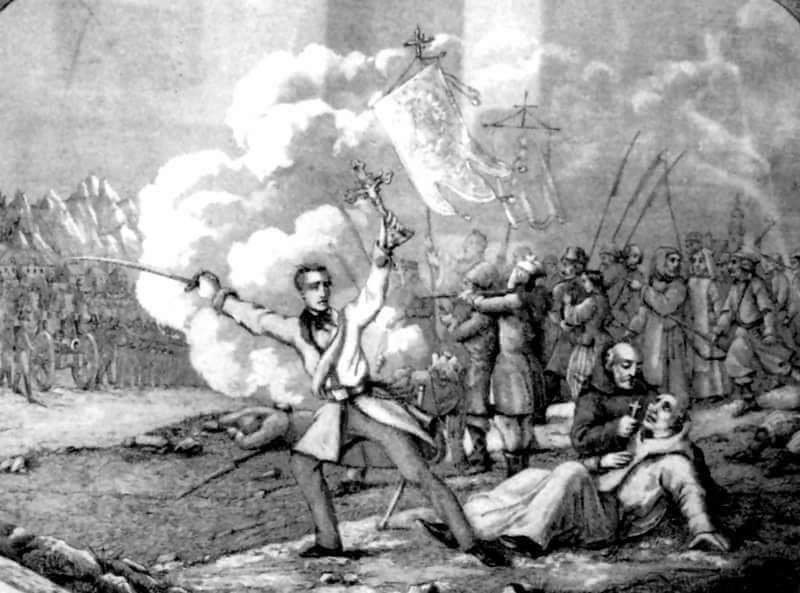<br><br>

---

<a href="https://github.com/TomaszWaszczyk/historia.waszczyk.com/edit/master/src/content/february-20.md" target="_blank">Edytuj tę stronę dzieląc się własnymi notatkami!</a>
