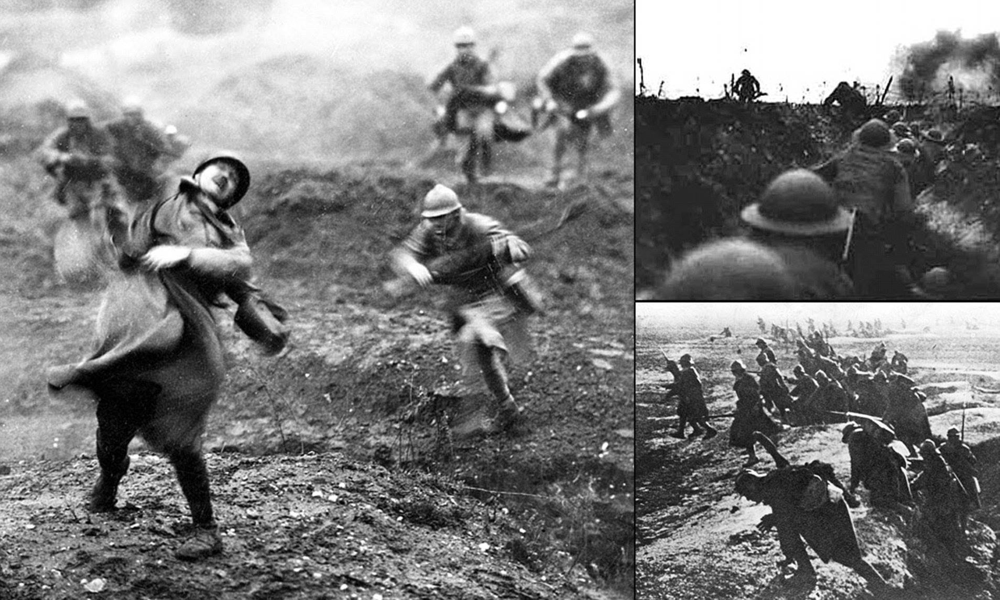
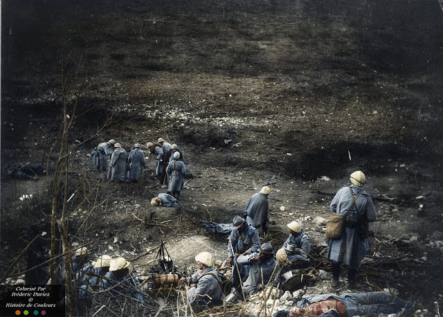
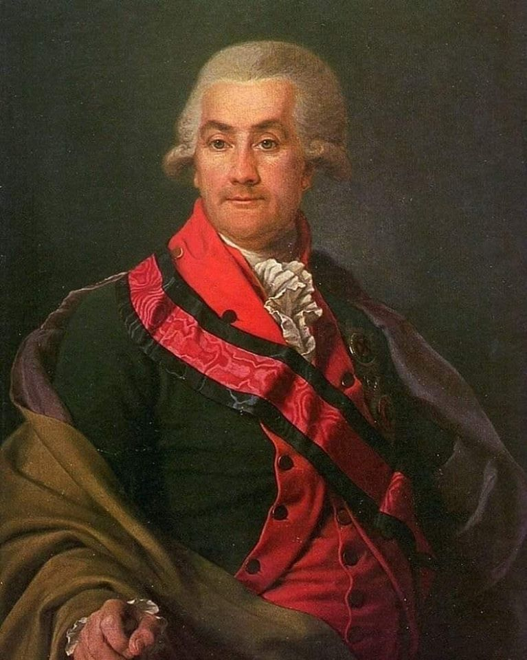
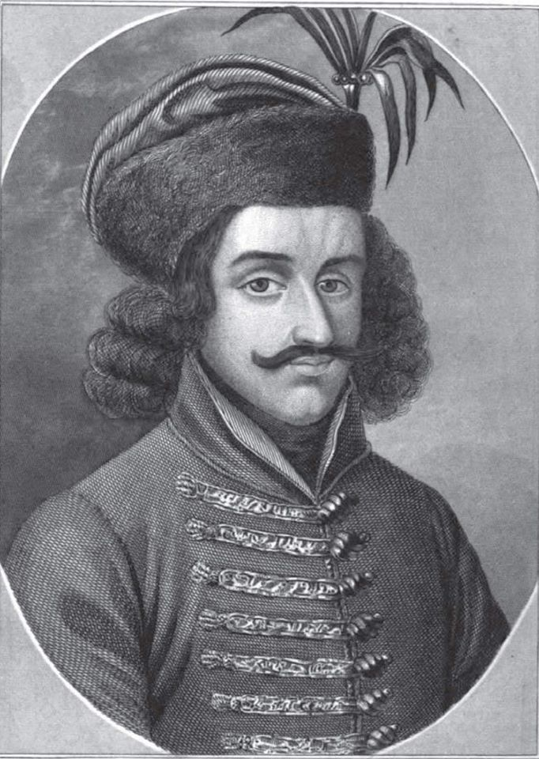

### 2021 - Digital Communism

> "No power on earth can stop an idea whose time has come" - Victor Hugo

Mankind is standing on the brink of another industrial revolution which is going to challenge the basic idea of being a human. With every revolution, a new challenge emerges. In 18th Century Britain, with the rise of the 1st Industrial Revolution, a new socio-economic system came into existence - ‘Capitalism’, which was based on private ownership of resources in a country. It divided the society into the 'ruling’ class and 'working’ class. The ruling class held power and resources while the working class worked and served under the ruling class. This led to the exploitation of the working class as they were given inferior accommodations, insignificant wages and were treated without any respect. In 1848, Karl Marx and Friedrich Engels published "The Communist Manifesto" which gave birth to a new socio-economic ideology. Unlike Capitalism, Communism aims to establish a 'classless’ society upon the ideology of 'public ownership' where the community holds the power and the resources collectively.  Due to its appealing features, in the 20th century, communism started to spread following the pattern of the Domino effect in many nations until the decline of the USSR.

"At the dawn of the 21st century, data is literally power”, Barack Obama emphasized with this statement the significance of data in the modern world. With the creation of WEB 2.0, humanity has reinvented herself. Data has emerged as a new resource that has the potential to push the human race forward.

History has repeated itself because WEB 2.0 has enabled a few organizations to completely control data and other related resources in a capitalistic fashion. Data is concentrated in silos by major corporations which makes it prone to hack. This became the reason for the origin of a new revolution representing the spirit of communism in the domain of interconnected networks in the form of WEB 3.0. 

The spirit of WEB 3.0 can be summarized with the phrase ‘Digital Communism’. The aim of this revolution is to build, boost and blow-up a decentralized-web in place of the existing web which is virtually owned and operated by a few corporations that have gained the power to influence and control the functioning of information and hence data on the web. This revolutionary idea has existed for almost a decade now, but now due to Blockchain, it has undergone a major popularity boost. Blockchain makes WEB 3.0 seem achievable in the current scenario due to its nature of being owned and operated by the peers that are participants of this system. The Blockchain is essentially a ledger that is maintained collectively by all the users, in which every single value is modified after verification and acceptance by each user rather than the same process being carried out by selected corporations. Hence, Blockchain can liberalize data from control and ownership by private organizations. This is a matter of concern for people and 'Web-Revolutionaries' alike and therefore the decentralization of the Internet seems like the viable solution for this problem. The rise of WEB 3.0 in today's world can hence be correlated to the rise of communism in the 1900s.

---

8601,50 USD to cena za tonę miedzi na giełdzie metali w Londynie w czwartek 18 lutego 2021 r. o godzinie 20:00. W ostatnim roku najniżej była w marcu spadając do niemalże 4500 USD/t. W 2019 roku polski KGHM sprzedał 700 tysięcy ton miedzi i 1417 ton srebra. Dziś opowiem Wam dzięki komu Polska jest jednym z największych na świecie producentów tych metali. 
#DobraHistoria
Zacznę od tego, że udokumentowane złoża miedzi w Polsce są uznawane za największe w Europie. Miedź zaś ma zasadnicze znaczenie współcześnie ze względu na jej przewodnictwo. Każdy sprzęt ewlektroniczny zawiera w sobie miedź. Każdy. Kropka.
Pokłady minerałów na terenie dzisiejszego Zagłębia Miedziowego w południowo-zachodniej Polsce zaczęły tworzyć się około 250 milionów lat temu, gdy Europę Zachodnią i Środkową pokrywało Morze Cechszyńskie. Z powodu nie do końca wyjaśnionego fenomenu osady wyjątkowo bogate w minerały gromadziły się na fragmencie jego akwenu, który w dalekiej przyszłości miał być nazwany Dolnym Śląskiem i Ziemią Lubuską. Po wyschnięciu lub odpływie wód agregowały suche osady, które na kolejne miliony lat skryć miały wyjątkowe bogactwo tych złóż.
Historia KGHM liczy nieco ponad sześćdziesiąt lat, ale świadomość bogactw mineralnych na tych terenach funkcjonuje przynajmniej od dziesięciu stuleci. Ich poszukiwaczy ściągały przede wszystkim Karkonosze i Sudety, w naturalny sposób ułatwiające odkrywanie złóż, minerałów, a nawet złota. Pewną reminescencją tamtych czasów są nazwy miejscowości takie jak Złotoryja, jedno z najstarszych miast regionu, czy Miedzianka, rozsławiona w ostatnich latach jako znikające miasto bestsellerową książką Filipa Springera. Kres Miedzianki jako organizmu miejskiego nadszedł wkrótce po ostatniej wojnie i połączony był z zajęciem dawnych sztolni górniczych, tym razem do wydobycia uranu potrzebnego... Armii Radzieckiej.
Po przejęciu  przez polską administrację w 1945 roku Ziem Zachodnich, przystąpiono do intensywnej eksploatacji bogactw naturalnych, częściowo zbadanych przez poprzednich, niemieckich gospodarzy tych terenów. W trudnych warunkach gospodarczych i politycznych wznowiono wydobycie miedzi na terenie tzw. Starego Zagłębia Miedziowego, w okolicy Bolesławca. Eksploatacja była jednak niezwykle trudna ze względu na zalewającą kopalnie wodę. Inżynierowie, geolodzy i górnicy czuli przy tym presję władz domagających się szybkich efektów w jak najkrótszym czasie. 
W tak niesprzyjających okolicznościach przybył do Zagłębia 38 letni Jan Wyżykowski, geolog, odpowiedzialny od 1955 roku za przygotowanie wierceń. Prace jego zespołu utrudniane były ciągłymi przeszkodami w postaci braków kadrowych, materiałowych i sprzętowych. Nawet urządzenia wiertnicze odmawiały posłuszeństwa, na jednym z odwiertów psując się na głębokości 480 metrów, zaledwie 280 metrów od bogatych złóż potwierdzonych w późniejszych latach. Kosztowne niepowodzenia mogły zniechęcać zwłaszcza, że inżyniera Wyżykowskiego zaczęto oskarżać o grożący więzieniem sabotaż gospodarczy. Prace jednak kontynuowano, do czego przyczyniła się decyzja rządu PRL z 17 grudnia 1955 roku nakazująca odkrycie złóż miedzi. Ministrowie z Bierutem na czele uchwalili, że miedź ma się znaleźć. Proste?
Nakaz Rady Ministrów byłby jednak tylko życzeniem, gdyby nie ciężka praca i wytrwałość inżynierów. Przyniosła ona efekty 23 marca 1957 roku, na odwiercie S-1 w Sieroszowicach. Tam, z głębokości 655,9–658,70 metrów robotnicy wydobyli rdzeń, na którym widać było rudawy kolor.
Ważący kilkaset kilogramów materiał badawczy został niezwłocznie załadowany do samochodu Warszawa i osobiście odtransportowany do stołecznego Państwowego Instytutu Geologicznego. Tam potwierdzono bogactwo złoża - ruda zawierała 1,4% miedzi. Sześć miesięcy później ekipa Wyżykowskiego znalazła w Lubinie, na głębokości ponad 600 metrów rudę o jeszcze wyższej zawartości miedzi. Otwór poszukiwawczy S-19 w Lubinie wiercony był starym aparatem wiertniczym KAM-500. Kiedy głębokość odwiertu zbliżyła się do 600 m nakazano wstrzymanie robót, ale wiertacze złamali zakaz. Wyżykowski był głęboko przekonany o celowości dalszych działań.
Jeden z najbliższych współpracowników Jana Wyżykowskiego, dr Andrzej Rydzewski, wspominał go jako prawdziwego lidera, który w niezwykły sposób tchnął bojowego ducha w ekipę wiertników i zaraził ich swoją wiarą w sukces przedsięwzięcia. Miał przy tym dość oryginalne metody zacieśniania więzi w zespole. Nowym jego członkom potrafił śpiewać arie operowe na powitanie. Było to wspomnienie młodzieńczych marzeń o karierze śpiewaczej rozwijanej potajemnie w okupowanym Krakowie pod okiem Bronisława Romaniszyna. Szczęśliwie dla polskiego przemysłu karierę artysty przerwała choroba gardła. 
Na początku kwietnia 1959 roku, po dwóch latach od wielkiego odkrycia, Wyżykowski wraz z zespołem przygotował geologiczną dokumentację złoża. Wynikało z niej, że na 24 wykonane odwierty, w 18 natrafiono na miedziową mineralizację. Obliczono również, że złoże zajmuje obszar 175 km2, a jego szacunkowe zasoby to 1 364 652 tys. ton rudy, zawierającej 19 339 tys. ton pierwiastka Cu. W następnych latach kontynuował prace poszukiwawcze na monoklinie przedsudeckiej. W 1964 roku opracował “Generalny projekt poszukiwań złóż miedzi”. Realizacja tego projektu pozwoliła mu w 1971 roku obliczyć zasoby perspektywiczne rud miedzi na głębokości 1200-1500 metrów. W 1965, na podstawie pracy “Zagadnienie miedzionośności cechsztynu na tle budowy geologicznej strefy przedsudeckiej”, uzyskał stopień doktora nauk przyrodniczych i stanowisko samodzielnego pracownika naukowego w Instytucie Geologicznym. W 1973 roku objął stanowisko docenta w tym Instytucie. Niestety, już w następnym roku został z niego zwolniony a tym samym pozbawiony możliwości prowadzenia dalszych prac poszukiwawczych. Został poinformowany, że jego stanowisko „zostaje powierzone specjalistom o szerszych horyzontach i odpowiedniej dynamice”. Takie potraktowanie odkrywcy największych europejskich złóż miedzi nie pozostało bez wpływu na jego zdrowie. 29 października 1974 roku dr Jan Wyżykowski zmarł na zawał serca.
Lata, które nastąpiły po odkryciu złóż dzisiejszego Nowego Zagłębia Miedziowego były okresem intensywnej pracy realizowanej na przekór brakom materiałowym i zawistnym konkurentom. Ich działania nie ustały po śmierci dr. Wyżykowskiego. Oskarżany był między innymi o wykorzystywanie nieznanych szerzej, starych, niemieckich map geologicznych. Wielu bardziej doświadczonych kolegów nie mogło uwierzyć, że ten młody człowiek, pełen pasji, odwagi i uporu wspartego wiedzą, był w stanie osiągnąć tak spektakularny sukces. Plotki te powracały regularnie godząc w dobre imię niemogącego się bronić zmarłego. Dlatego w 1998 r. na wniosek Związku Zawodowego Pracowników Przemysłu Miedziowego, zwrócono się z prośbą o wyjaśnienie sprawy w oficjalnym piśmie do niemieckiego Federalnego Urzędu ds. Geologii i Surowców Naturalnych w Hanowerze. Odpowiedź była jednoznaczna: „W naszych dokumentach nie ma żadnych wskazówek na to, by niemieccy geologowie przeprowadzali prace poszukiwawcze na obecność rud miedzi w rejonie Lubina i Głogowa. […] ich odkrycie jest wyłączną zasługą polskich geologów. Zostały one sklasyfikowane jako największe osiągnięcie w historii poszukiwań."
Kłamliwe zarzuty wobec dr. Wyżykowskiego stały się przeszłością. To co dobre, pozostało w pamięci ludzi i ciężko jest znaleźć choć jedno przykre wspomnienie na jego temat. Imię Wyżykowskiego noszą szkoły podstawowe, wyższa uczelnia i szyb w kopalni Polkowice-Sieroszowice. O pamięć dba Towarzystwo Przyjaciół im. Jana Wyżykowskiego. Od 1985 roku jego pomnik ozdabia stolicę regionu - Lubin, a podczas górniczych uroczystości obowiązkowo podaje się pierogi - ulubioną potrawę odkrywcy największych europejskich złóż miedzi.

---

### 1916

I wojna światowa: rozpoczęła się niemiecko-francuska bitwa o Verdun.
Bitwa pod Verdun była najdłuższą i jedną z najkrwawszych batalii I wojny światowej. Stała się symbolem niezłomności żołnierzy francuskich i dumy narodowej Francji.
W sierpniu 843 r. w Dugny koło Verdun trzej wnukowie Karola Wielkiego podpisali traktat, w którym liczące ponad milion kilometrów kwadratowych imperium ich dziadka zostało podzielone na trzy równe części. Karol Łysy wziął w posiadanie część zachodniofrankijską, w której mówiono w języku starofrancuskim. Ludwik II Niemiecki objął panowanie nad obszarem wschodniofrankijskim z językiem starogórnoniemieckim, Lotar I zaś, noszący tytuł cesarza, władał w środkowofrankijskiej części, gdzie posługiwano się łaciną jako językiem urzędowym. Królestwo środkowofrankijskie przetrwało zaledwie 15 lat po śmierci Lotara I. 8 sierpnia 870 r. na zjeździe w Meerssen królowie Karol Łysy i Ludwik II Niemiecki podzielili między siebie pozostałą część królestwa. W dużym uproszczeniu można powiedzieć, iż najwcześniejsze historycznie zalążki Francji i Niemiec miały od tamtej pory wspólną granicę, która przebiegała przez Lotaryngię i Alzację. Prawa własności do obu tych regionów stały się na całe stulecia kością niezgody pomiędzy narodem niemieckim i francuskim.
W 1648 r. traktat westfalski zakończył ostatecznie wojnę trzydziestoletnią, a Lotaryngia i Alzacja stały się częścią Francji. Poczucie zagrożenia ze strony wschodniego, niemieckojęzycznego sąsiada spowodowało, że Ludwik XIV zlecił swemu architektowi Sebastienowi Le Prestre de Vauban zaprojektowanie i zbudowanie łańcucha fortyfikacji zabezpieczających drogę na Paryż od strony wschodniej i północno-wschodniej. De Vauban wykonał to zadanie po mistrzowsku. Miasto Verdun, przecięte w połowie rzeką Moza, zostało otoczone siecią 21 fortów.
W 1870 r., równo tysiąc lat po porozumieniu sukcesyjnym, likwidującym królestwo Lotaryngii, wybuchła wojna francusko-pruska, która doprowadziła do upadku Napoleona III, a tym samym zamknęła epokę monarchistyczną w dziejach Francji. Rozbudowy i unowocześnienia twierdzy Verdun dokonał francuski generał i inżynier Raymond Adolphe Sere de Rivieres.
Klęska Francji w wojnie z Prusami w latach 1870–1871 uświadomiła światu, że w centrum Europy wyrosła pod przewodnictwem Prus i rodziny Hohenzollernów nowa potęga gospodarcza, polityczna, intelektualna i militarna. Faktyczny twórca II Rzeszy Niemieckiej – Żelazny Kanclerz Otto von Bismarck – nie miał złudzeń, że Francja nigdy nie pogodzi się z utratą bogatych gospodarczo regionów Alzacji i Lotaryngii. Strata Metzu i innych twierdz, wielomilionowe kontrybucje wojenne, pamięć klęski pod Sedanem i Le Mans, a wreszcie triumfalna defilada armii pruskiej 17 lutego 1871 r. w zdobytym kilkanaście dni wcześniej Paryżu dopełniły czary goryczy i wstydu Francuzów. Koncepcja oparcia granicy wschodniej na Renie pozostała jednym z priorytetów polityki zagranicznej III Republiki Francuskiej.
W 1882 r. II Rzesza, świadoma żądzy odwetu ze strony Francji i czująca oddech Rosji od strony wschodniej, zawarła trójprzymierze z Austro-Węgrami i Włochami. Każda ze stron paktu zobowiązała się przyjść z pomocą zaatakowanemu sojusznikowi. Porozumienie było systematycznie odnawiane w latach 1887, 1892, 1902 i 1912. Reakcją Francji i Rosji na powstanie tak potężnego bloku militarnego w centralnej Europie było zawiązanie w 1892 r. tajnego sojuszu, do którego w 1907 r. dołączyła Wielka Brytania.
Europa ostatnich dwóch dziesięcioleci XIX w. powoli stawała się beczką prochu. W 1890 r. nowy cesarz Niemiec Wilhelm II zdymisjonował Bismarcka. Między Francją a Rosją zacieśniały się stosunki polityczne, gospodarcze i militarne. Rosja liczyła na pomoc Paryża w unowocześnieniu armii i uzyskanie dostępu do Morza Śródziemnego. Francja miała nadzieję na pomoc Rosji w odzyskaniu Alzacji i Lotaryngii. W rosyjskim Bobrujsku powstała silna radiostacja nadawcza, a na wieży Eiffla w Paryżu – radiostacja odbiorcza.
W Niemczech poczucie osaczenia z zachodu i wschodu znacznie przybrało na sile. Od końca XIX stulecia aż do 1905 r. w sztabie generalnym armii niemieckiej powstawał tajny plan uderzenia na Francję i Rosję. Koncepcja ta rodziła się w ściśle wtajemniczonym kręgu oficerskim i nawet niektórzy członkowie rządu nie byli świadomi jej powstawania. Autorem tajnego planu był szef sztabu armii pruskiej feldmarszałek Alfred von Schlieffen, ekspert kartografii i wybitny teoretyk strategii militarnej. Wychowany w pruskiej dyscyplinie wojskowej von Schlieffen był wielkim zwolennikiem dominacji korpusu oficerskiego i armii w sprawnym zarządzaniu państwem. Jego plan zakładał uderzenie na Francję z zastosowaniem tzw. manewru canneńskiego. Zamiast frontalnego ataku operacja miała się dokonać poprzez oskrzydlenie pozycji francuskich od strony neutralnej Belgii. Obejście Paryża od północy i zachodu miało sprawić, że nastawione na obronę od wschodu twierdze i pozycje francuskie nie miałyby szans. Zgodnie z tą koncepcją po 42 dniach zwycięska armia niemiecka miała zostać przegrupowana i skierowana przeciwko Rosji. Ogromną rolę w tych operacjach miał odegrać transport kolejowy.
Plan Alfreda von Schlieffena do czasu wybuchu wojny w 1914 r. był stale sprawdzany i modyfikowany. Oficerem, który miał go wdrożyć z wieloma poprawkami, był gen. Helmuth von Moltke, następca Schlieffena na stanowisku szefa sztabu armii. Dzisiejsi specjaliści strategii wojskowej są zgodni, że plan był tak precyzyjny, że można go było porównać jedynie do świetnie działającej maszyny. I to zresztą przesądziło o jego słabości. Nieuwzględnione detale mogły łatwo zakłócić skuteczność operacji.
Wtargnięcie na terytorium neutralnej Belgii stanowiło brutalne pogwałcenie prawa międzynarodowego i stało się przyczyną wypowiedzenia Niemcom wojny przez Wielką Brytanię 3 sierpnia 1914 r. Zamiast spodziewanych 48 godzin zajęcie Belgii zajęło armii Wilhelma II osiem dni, co znacznie opóźniło działania oskrzydlające.
Ofensywa rosyjska na Mazurach spowodowała wycofanie 2 korpusów 2. i 3. Armii do Prus Wschodnich. Osłabiło to, a w pewnym momencie wręcz uniemożliwiło, manewr okrążenia Francji od północy. Jak na ironię zwycięstwo Niemców pod dowództwem feldmarszałka Paula von Hindenburga i Ericha Ludendorffa nad armią gen. Aleksandra Samsonowa pod Tannenbergiem dokonało się przed przybyciem odwodów z frontu zachodniego. Bitwa nad Marną (5–9 września 1914 r.) ostatecznie powstrzymała oskrzydlającą ofensywę niemiecką.
Do klęski Niemców przyczynił się francuski nalot lotniczy przeprowadzony 13 września, który zniszczył niemiecki pociąg z zapasami amunicji. Działając zgodnie z rozkazami gen. Josepha Joffre'a, głównodowodzącego sił alianckich, kontratakujące wojska francuskie i brytyjskie zmusiły siły niemieckie do wycofywania się i poddania 2. Armii. Ten moment uznaje się za przełomowy dla losów Francji i Paryża. Wojna mająca być w zamyśle pierwszym w historii blitzkriegiem zamieniła się teraz w wojnę pozycyjną, której linię wyznaczały okopy meandrujące od kanału La Manche aż do granicy ze Szwajcarią.
4 grudnia 1915 r. rozpoczęła się francusko-brytyjska narada sztabowa w Calais, której celem było ustalenie wspólnej strategii walki z armiami II Rzeszy. Rząd brytyjski nie miał wątpliwości, że nienawidzący Anglików, upośledzony fizycznie wnuk królowej Wiktorii, cesarz Wilhelm II, zrobi wszystko, aby pokonać Wielką Brytanię. 6 grudnia 1915 r. w Chantilly nowo utworzona Międzynarodowa Rada Wojenna pod przewodnictwem głównodowodzącego armii francuskiej gen. Josepha Joffre'a przyjęła strategię działania przeciw państwom centralnym. Latem 1916 r. na podstawie tych ustaleń na froncie wschodnim nastąpiła ofensywa gen. Aleksieja Brusiłowa.
14 lutego postanowiono w Chantilly, że wojska brytyjsko-francuskie rozpoczną 1 lipca 1916 r. ofensywę w Pikardii nad Sommą. Uderzenie niemieckie na Verdun 21 lutego sprawiło, że część wojsk francuskich przegrupowano i przesunięto na ten właśnie kierunek. Na brytyjską armię pod dowództwem gen. Douglasa Haiga spadło główne zadanie zaatakowania pozycji niemieckich. Po ataku artyleryjskim miał nastąpić atak piechoty, a następnie kawalerii. Niepokojąca sytuacja Francuzów pod Verdun przyspieszyła o tydzień ofensywę brytyjską. 24 czerwca 1916 r. 4. Armia pod dowództwem gen. Henry'ego Rawlisona, część 3. Armii pod dowództwem gen. Edmunda Allenby'ego i francuska 6. Armia gen. Marie Emile Fayolle'a rozpoczęły atak na umocnienia niemieckiej 2. Armii pod dowództwem gen. Fritza von Bellowa. Intensywne bombardowanie pozycji niemieckich nie przyniosło oczekiwanych rezultatów. Ataki piechoty brytyjskiej zostały okupione olbrzymimi stratami, mimo że do walki wprowadzono nowe rodzaje broni, w tym gazy bojowe (fosgen), nowe typy moździerzy miotających granaty z bronią chemiczną, a od 15 września nowe czołgi brytyjskie. Trwająca przeszło cztery miesiące bitwa nad Sommą przeszła do historii jako największa bitwa I wojny światowej. Armia brytyjska straciła ponad 400 tys. ludzi, Francja przeszło 200 tys., a Niemcy ponad 400 tys. Jedyną korzyścią było dla Francuzów częściowe odciążenie frontu pod Verdun.
Klęska Niemiec nad Marną w 1914 r. i pod Artois w 1915 r. zmusiła naczelne dowództwo niemieckie i samego cesarza do wprowadzenia kilku poprawek w planie pokonania Francji i Brytyjskiego Korpusu Ekspedycyjnego. Szefa sztabu armii gen. Helmutha von Moltke zastąpił gen. Erich von Falkenhayn. W tzw. memoriale bożonarodzeniowym, skierowanym w grudniu 1915 r. do cesarza Wilhelma II, gen. von Falkenhayn postulował działania operacyjne idące w kierunku „całkowitego wykrwawienia przeciwnika". Armia Wielkiej Brytanii miała zostać wyeliminowana z działań lądowych, a jej flota zniszczona w nieograniczonej wojnie podwodnej. Falkenhayn uważał, że skoro manewr okrążenia Paryża się nie powiódł, to należy atakować frontalnie w kierunku Verdun i dokonać przebicia na liniach obrony francuskiej, a tym samym otworzyć drogę na Paryż. Nieustający atak artyleryjski, gazowy i wreszcie falowe ataki piechoty niemieckiej miały wykrwawić i złamać obrońców francuskich. Pierwotnie planowano, że uderzenie na pozycje francuskie rozpocznie się 13 lutego 1916 r., ale złe warunki pogodowe przesunęły ofensywę na 21 lutego. W sztabie niemieckim atak otrzymał kryptonim „Osąd".
O godzinie 7.12 wystrzał z armaty Kruppa kal. 38 mm rozpoczął najdłuższą bitwę w historii, która trwała 303 dni. Na 20-kilometrową linię francuskich okopów ciągnących się wzdłuż Mozy spadła lawina ognia artyleryjskiego. Ostrzał 1200 dział niemieckich trwał bez przerwy przez dziewięć godzin. Forty na prawym brzegu Mozy okazały się niedostatecznie przygotowane do obrony. 25 lutego Niemcy zdobyli fort Douaumont, wokół którego toczyły się zacięte walki, a resztki fortecy jeszcze przez jakiś czas przechodziły z rąk do rąk.
25 lutego dowództwo francuskiej 2. Armii walczącej pod Verdun objął gen. Philippe Petain. Jego nastawione na defensywę działania przywróciły spokój i dyscyplinę w szeregach obrońców. Petain podzielił całą linię frontu pod Verdun na cztery odcinki, dozbroił forty, a także nakazał budowę mostów przeprawowych przez Mozę. W celu odciążenia pierwszych linii obrony wprowadził tzw. kierat, czyli system rotacji, w którym wyczerpane jednostki bojowe były wycofywane i zastępowane świeżymi. Usprawniony został transport i wszelkie związane z nim działania logistyczne.
Ta nazwa została nadana 72-kilometrowej drodze łączącej Bar-le-Duc z Verdun. W opinii historyków wojskowości spełniła ona funkcję życiodajnej arterii zaopatrzeniowej, którą od 21 lutego do 22 marca 1916 r. około 600 kursujących codziennie ciężarówek dostarczyło 48 tys. ton amunicji, 6400 ton żywności, leków, koców, mundurów i innych materiałów oraz przewiozło 263 tys. żołnierzy na pola bitewne pod Verdun. W tym okresie wstrzymano na „świętej drodze" wszelki ruch konny i cywilny. Wszystkie francuskie połączenia kolejowe z Verdun zostały już w 1914 r. zablokowane, zniszczone lub przejęte przez Niemców. „Voie sacrée" stała się jedynym łącznikiem pól bitewnych wokół Verdun z głębokim zapleczem armii. Nad utrzymaniem drogi i sprawnego transportu czuwało 16 batalionów inżynieryjno-saperskich. Aby dostarczyć kamienne kruszywo niezbędne do nieustannej reperacji drogi, wznowiono wydobycie w pobliskich kamieniołomach. Sama droga została poszerzona do 7 metrów.
Nad całością transportu, utrzymaniem drogi w najlepszej kondycji i stałej gotowości czuwał szef sztabu 2. Armii płk Maurice de Barescut. Komunikację samochodową nadzorowała specjalna jednostka licząca 300 oficerów i 8500 żołnierzy. W odbywającym się nieprzerwanie ruchu samochodowym brało udział 3500 ciężarówek typu Berliet i Renault oraz 800 ambulansów. Awarie, jakie się zdarzały, powodowały natychmiastowe zepchnięcie samochodu na pobocze drogi. Warsztaty w Bar-le-Duc i Troyers zapewniały uszkodzonym maszynom natychmiastową naprawę, głównie wymianę opon.
Równie ważną rolę w zaopatrywaniu frontu odgrywała wąskotorowa kolejka Le Chemin de Fer Meusien, biegnąca równolegle do „świętej drogi". Dziennie dostarczała 1800 ton zaopatrzenia, a w drodze powrotnej zabierała rannych. Kolejka dostarczała żywność dla armii znajdującej się na linii frontu, to znaczy dla 16 600 oficerów, 420 tys. żołnierzy i 136 tys. koni. Począwszy od marca 1916 r. stopniowo przywracano szerokotorowe połączenia lub w przyspieszonym tempie budowano objazdy, jak choćby ten z Sommeilles-Nettancourt do linii Dugny. Latem 1916 r. Verdun zostało połączone z regionalnymi sieciami kolejowymi.
Mówiąc o „świętej drodze", należy wspomnieć, że w magistracie wioski Souilly przy słynnej drodze znajdowała się kwatera główna, z której działaniami wojennymi kierowali generałowie Philippe Petain i Robert Nivelle. Ratusz w Souilly funkcjonuje do dziś, podobnie jak droga, której w 2006 r. nadano nazwę „Droga 1916" dla upamiętnienia wielkiej roli, jaką odegrała w krytycznych dla Francji miesiącach bitwy pod Verdun. Między wrześniem a listopadem 1918 r. droga służyła także oddziałom armii amerykańskiej pod dowództwem gen. Johna Pershinga. W korpusie oficerskim tej armii znaleźli się m.in. płk George Patton i ppłk Dwight Eisenhower, którzy tam zdobywali pierwsze doświadczenia związane z pancernym uderzeniem czołgów.
Pierwsze dni bitwy pod Verdun zdominowały ataki niemieckie na prawym brzegu Mozy, między fortami Douaumont i Vaux. Walki toczyły się o istotne pod względem strategicznym wzgórza, wioski i lasy. W pierwszej fazie walk, na przełomie lutego i marca 1916 r., do niewoli niemieckiej dostał się ciężko ranny kapitan Charles de Gaulle. Po niepowodzeniach na prawym brzegu Mozy Niemcy zmienili taktykę i wyprowadzili atak na obu brzegach Mozy. Na prawym brzegu trwały walki o fort Vaux.
To była druga faza bitwy o Verdun, zakończona ogromnymi stratami po obu stronach. Niemcy stracili 60 tys. żołnierzy, a drugie tyle zostało rannych. Straty francuskie przekroczyły 55 tys. zabitych i wziętych do niewoli oraz 50 tys. rannych.
Rozpoczęta ofensywa francusko-brytyjska nad Sommą spowodowała, że Niemcy musieli przemieścić tam część swoich sił, co w sposób oczywisty osłabiało ich uderzenie pod Verdun. Główne walki toczyły się na północny wschód od Verdun. W drugiej połowie maja gen. Nivelle zastąpił gen. Petaina na stanowisku dowódcy 2. Armii. Sam Petain został dowódcą Grupy Armii Centrum. Na rozkaz Nivelle'a gen. Charles Mangin prowadził działania ofensywne, których efektem było odbicie z rąk Niemców 22 maja ważnego fortu Douaumont, a właściwie jego ruin, gdyż 8 maja w wyniku eksplozji śmierć poniosło tam 800 żołnierzy niemieckich. 7 czerwca kontruderzenie Niemców spowodowało otoczenie i zdobycie fortu Vaux. Bitwa pod Verdun stawała się powoli walką na wyczerpanie przeciwnika.
Piekło Verdun to najbardziej trafne określenie stopnia brutalności i intensywności walk. Wioski znajdujące się w rejonie walk, wielokrotnie przechodzące z rąk do rąk, zostały całkowicie zniszczone, a ich mieszkańcy, którzy wcześniej nie uciekli, ginęli od krzyżowego ognia artyleryjskiego, szrapneli, ognia karabinów maszynowych i toksycznych gazów bojowych. Pola były poorane wybuchami pocisków armatnich i powoli zamieniały się w księżycowy krajobraz. Wszelka roślinność była poszarpana i popalona. Sczerniałe kikuty drzew były żałosnym wspomnieniem lasów rosnących kiedyś poza liniami francuskich okopów. Aby je zdobyć, falowe ataki niemieckiej piechoty i kontratakujące szeregi francuskie musiały najpierw sforsować linie zasieków stanowiących pierwszą zaporę przed okopami.
Seriami z karabinów maszynowych dokonywano rzezi biegnących żołnierzy i tych, którzy zaplątali się w zwoje drutu kolczastego. Ci, którzy nie zostali wcześniej zadławieni przez gazy bojowe lub nie zawiśli na zasiekach, wpadali do okopów wroga i tu w błocie ginęli w ostatniej walce na bagnety, broń krótką albo gołe pięści. Walczący brodzili we krwi i potykali się o fragmenty ciał zabitych lub ranionych kompanów.
Historycy obliczają, że w pierwszych dniach bitwy w zmasowanych atakach na pozycje francuskie brało udział przeszło 80 tys. żołnierzy niemieckich, pędzonych do ataku na stosunkowo niewielkim obszarze, co przekładało się na olbrzymią liczbę ofiar. Archiwalne zdjęcia czy filmy ukazują koszmar bitwy pod Verdun.
Gen. Erich von Falkenhayn, główny architekt planu wykrwawienia Francuzów na śmierć, został zdymisjonowany 29 sierpnia 1916 r. i zastąpiony przez zwycięski duet spod Tannenbergu: feldmarszałka Paula von Hindenburga i gen. Ericha Ludendorffa. Jednak dowódcy z frontu wschodniego nie odmienili losów bitwy pod Verdun. Niemcy przeszli do defensywy, a Francuzi do grudnia odzyskali wszystkie forty, wioski i strategiczne pozycje.
Bitwa o niezdobytą twierdzę Verdun zakończyła się w drugiej połowie grudnia 1916 r. W czasie jej trwania wystrzelono około 40 mln pocisków artyleryjskich. Do dzisiaj historycy nie są zgodni, czy 303 dni walk pochłonęły 700 tys. czy 800 tys. ofiar, a może nawet milion. To porażające statystyki. Zarówno dowódcy niemieccy, jak i francuscy wydawali rozkazy, nie licząc się z ofiarami. Dla obu narodów Verdun stało się historycznym i świętym symbolem.
Lotaryngia i Alzacja od 870 r., a więc od czasu faktycznego zlikwidowania państwa króla Lotara, były istnym węzłem gordyjskim w stosunkach francusko-niemieckich. Po upadku III Rzeszy Alzacja i Lotaryngia powróciły do Francji, chociaż ustalenia z lat 50. XX wieku silnie związały przemysł wydobywczy Lotaryngii z przemysłem hutniczym Zagłębia Ruhry i Saary. 2 września 1984 r. na polach bitewnych pod Verdun spotkali się i podali sobie ręce w geście pojednania prezydent Francji François Mitterrand i kanclerz RFN Helmuth Kohl. Milcząc, stali na ziemi, w którą bezsensownie wsiąkła krew setek tysięcy przypędzonych tu na rzeź ich rodaków.

  

  

### 1794

Rada Nieustająca na polecenie posła rosyjskiego Osipa Igelströma (grafika), który zastąpił zwolennika zachowania Rzeczypospolitej jako protektoratu rosyjskiego posła Jakoba Sieversa uchwaliła redukcję wojska Rzeczypospolitej o połowę oraz przymusowy werbunek zredukowanych do wojska rosyjskiego i pruskiego. Była to wyraźna prowokacja, która wkrótce spowodowała wybuch Insurekcji Kościuszkowskiej.
Warto dodać, że Igelström zabronił również noszenia Orderu Virtuti Militari oraz publikowania ustaw sejmu grodzieńskiego bez uprzedniego ocenzurowania ich w ambasadzie rosyjskiej, a także rozbudował policję w Warszawie.

  

### 1474

W Spiskiej Starej Wsi (obecnie Słowacja) król Czech Maciej Korwin (grafika) i król Polski Kazimierz IV Jagiellończyk podpisali pokój po wojnie o tron węgierski. Zawarcie tego porozumienia nie zakończyło jednak rywalizacji o koronę węgierską. Jesienią tego roku walki wybuchły ponownie

  

---

<a href="https://github.com/TomaszWaszczyk/historia.waszczyk.com/edit/master/src/content/february-21.md" target="_blank">Edytuj tę stronę dzieląc się własnymi notatkami!</a>
