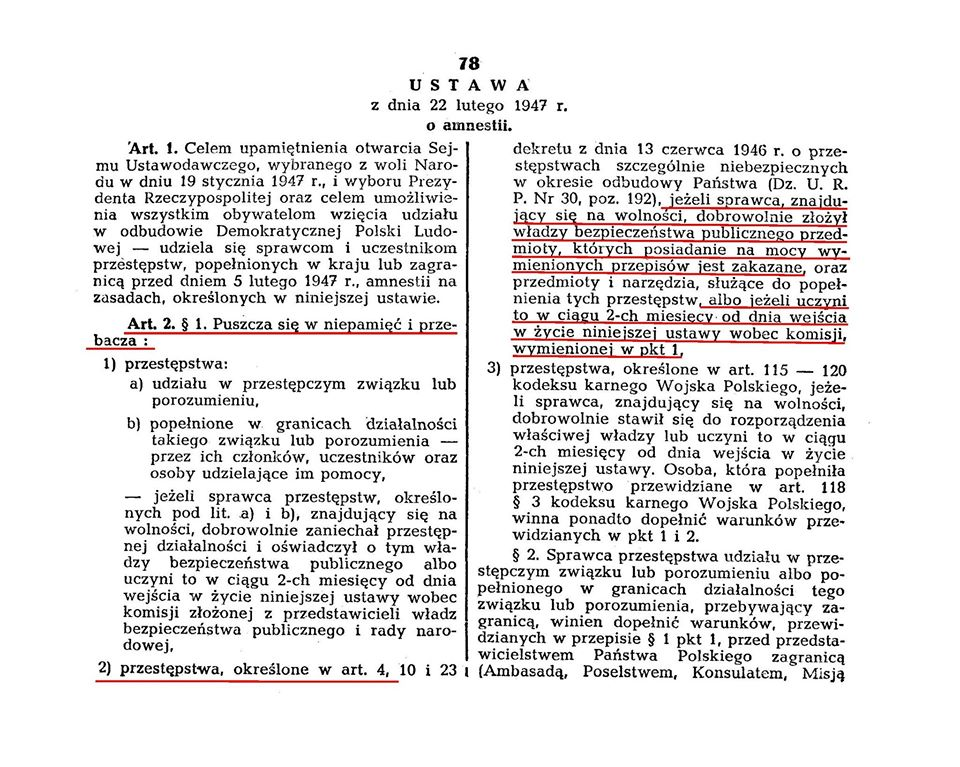
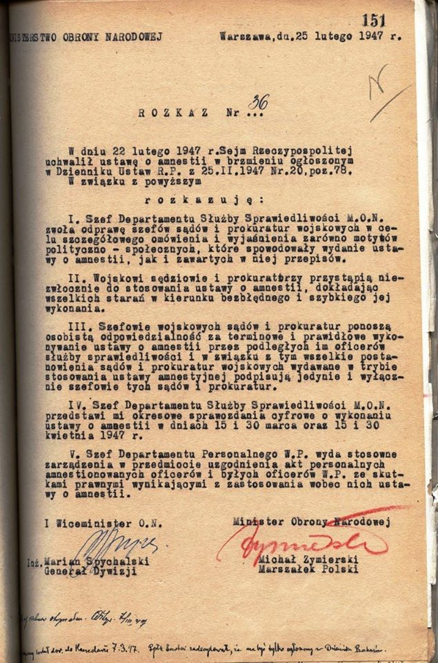
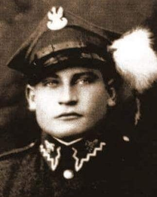
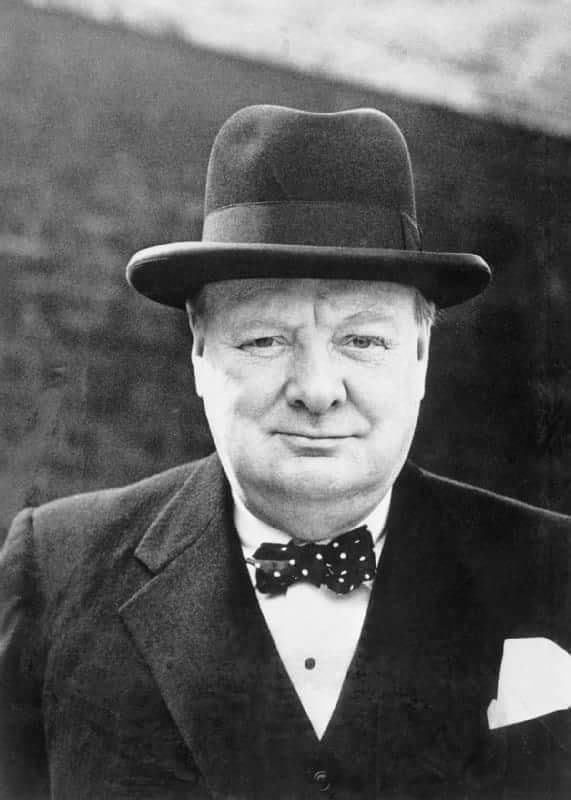
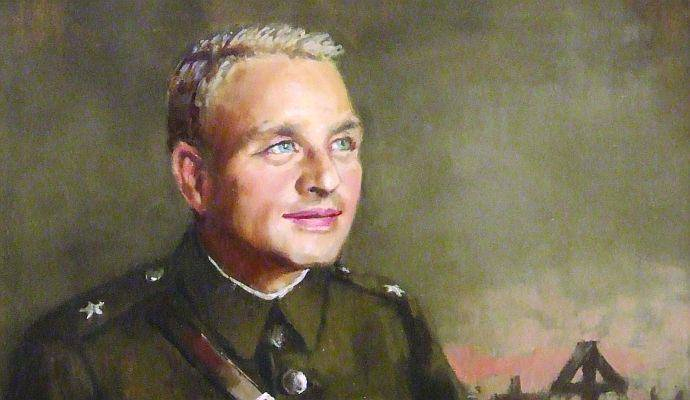
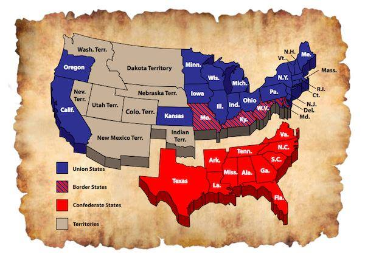

### 2021

Globally, the world is $255 trillion in debt.

We are in the beginning of what is looking to be like the most major financial crisis that the world has ever witnessed. #Bitcoin has gone from being something that is laughed at, to being a form of money which billionaires are purchasing, and which major financial institutions are studying.
Family offices now have a choice; to stay in the collapsing traditional financial system, or to evolve and adapt for the future.

### 1947

Sejm Ustawodawczy uchwalił amnestię dla żołnierzy i działaczy podziemia antykomunistycznego. W rzeczywistości był to podstęp, którego celem było ujawnienie i późniejsze aresztowanie ukrywających się działaczy konspiracji niepodległościowej i żołnierzy AK.

W dniu 22 lutego 1947 roku komunistyczny sejm w Polsce uchwali ustawę o amnestii. Zgodnie z art. 1 tej komunistycznej ustawy: Celem upamiętnienia otwarcia Sejmu Ustawodawczego, wybranego z woli Narodu w dniu 19 stycznia 1947 r., i wyboru Prezydenta Rzeczypospolitej oraz celem umożliwienia wszystkim obywatelom wzięcia udziału w odbudowie Demokratycznej Polski Ludowej – udziela się sprawcom i uczestnikom przestępstw, popełnionych w kraju lub zagranicą przed dniem 5 lutego 1947 r., amnestii na zasadach, określonych w niniejszej ustawie.

Ustawa między innymi dotyczyła ustanowionego przez komunistyczny PKWN przestępstwa opisanego w art. 4 dekretu z dnia 13 czerwca 1946 r. o przestępstwach szczególnie niebezpiecznych w okresie odbudowy Państwa. Przepis ten miał brzmienie:

Art. 4§1 Kto bez zezwolenia wyrabia, gromadzi lub przechowuje broń palną, amunicję, materiały lub przyrządy wybuchowe albo inne przedmioty mogące sprowadzić niebezpieczeństwo powszechne, podlega karze więzienia na czas nie krótszy od lat 5 lub dożywotnio albo karze śmierci.

§ 2. W przypadkach mniejszej wagi sąd może zastosować nadzwyczajne złagodzenie kary albo nawet od kary uwolnić.

Dotyczyła zatem komunistycznego przestępstwa nielegalnego posiadania broni. Stosowny przepis ustawy o amnestii mówił, że puszcza się w niepamięć i przebacza przestępstwa, określone w art. 4 dekretu z dnia 13 czerwca 1946 r. o przestępstwach szczególnie niebezpiecznych w okresie odbudowy Państwa (Dz. U. R. P. Nr 30, poz. 192), jeżeli sprawca znajdujący się na wolności, dobrowolnie złożył władzy bezpieczeństwa publicznego przedmioty, których posiadanie na mocy wymienionych przepisów jest zakazane, oraz przedmioty i narzędzia, służące do popełnienia tych przestępstw, albo jeżeli uczyni to w ciągu 2-ch miesięcy od dnia wejścia w życie niniejszej ustawy wobec komisji, wymienionej w pkt 1.

Innymi słowy towarzysze komuniści ogłosili na całą Polskę, że puszczają w niepamięć i przebaczają nielegalne posiadanie broni o ile tą broń się towarzyszom komunistom odda w ciągu dwóch miesięcy od dnia wejścia w życie ustawy (od 25 lutego do 25 kwietnia 1947 r.). Towarzysze komuniści powiedzieli do Polaków wybaczymy jak oddacie broń.

Wykonanie ustawy amnestyjnej powierzono Ministerstwu Bezpieczeństwa Publicznego. W całym kraju przy Powiatowych Urzędach Bezpieczeństwa Publicznego powołano Państwowe Komisje Amnestyjne. Główną rolę w tych komisjach odgrywali funkcjonariusze Urzędu Bezpieczeństwa. Każdy ujawniający się zdawał broń, jeżeli taką posiadał, wypełniał szczegółowy formularz, w którym podawał swoją przynależność organizacyjną, pseudonim, imię i nazwisko, adres, stopień oraz imię, nazwisko, pseudonim i adres dowódcy. W czasie amnestii z podziemia wyszło 53 517 osób, swoją działalność ujawniło także 23 257 osób przebywających w więzieniach. Łącznie amnestia objęła 76 774 osoby. W rzeczywistości „ankiety amnestyjne” ułatwiały aresztowania osób, które się nie ujawniły. Dla porównania – w roku 1945 podziemie opuściło tylko 30 217 osób, część z nich jednak na powrót podjęła walkę z polskimi i radzieckimi służbami bezpieczeństwa.

Po upływie terminu amnestii w 1947 w podziemiu pozostało nie więcej niż 2 tysiące osób. Szacunki Urzędu Bezpieczeństwa Publicznego wskazywały na znacznie mniejszą liczbę: około 250 partyzantów działających w 52 zbrojnych grupkach. Już od kwietnia 1947 z rozkazu Stanisława Radkiewicza wykonywano wyroki śmierci na osobach, które były objęte amnestią.

W wyniku amnestii z 1947 praktycznie przestało istnieć zorganizowane podziemie zbrojne w kraju. Dzięki informacjom uzyskanym przez UB od ujawniających się ludzi, przyspieszyła akcja wykrywania i niszczenia pozostałych grup partyzantów. Funkcjonariusze służb bezpieczeństwa wcale nie myśleli stosować się do uchwalonych przez siebie praw. Gdy tylko zaprzestano wykonywać amnestię, natychmiast przystąpiono do analizy zebranego materiału, a następnie do aresztowań osób ujawnionych, pod zarzutem dalszego prowadzenia działalności antypaństwowej. Ludzie ujawnieni w 1947 w latach 1948–1950 byli często ponownie aresztowani i skazywani za czyny objęte ową amnestią. Zapadały często wysokie wyroki, zgodnie z artykułem 6. amnestii pozostawiono jednak taką możliwość wobec działalności uprzednio zagrożonej karą śmierci lub dożywocia. Część osób ponownie zeszła do podziemia, rzadko jednak organizując zbrojny opór.

  

  

---

W nocy z 21 na 22 lutego 1947 roku w Nowym Targu zmarł Józef Kuraś "Ogień" (zdjęcie) - żołnierz Wojska Polskiego i Armii Krajowej (został wydalony z szeregów AK za brak dyscypliny), działacz Konfederacji Tatrzańskiej, a także porucznik Batalionów Chłopskich i dowódca Urzędu Bezpieczeństwa w Nowym Targu.
W latach powojennych jeden z głównych działaczy podziemia antykomunistycznego, pod którego podlegała cała podhalańska partyzantka.
W liście do Bolesława Bieruta z dnia 18 listopada 1946 roku tak pisał o działaniach podległych mu żołnierzy:
"Błyskawica» walczy o Wolną, Niepodległą i prawdziwie demokratyczną Polskę. Walczyć będziemy tak o granice wschodnie, jak i zachodnie. Nie uznajemy ingerencji ZSRR w sprawy wewnętrzne polityki państwa polskiego. Komunizm, który pragnie opanować Polskę, musi zostać zniszczony".
21 lutego 1947 roku, w wyniku zdrady przez troje byłych współpracowników-Stanisława Byrdaka, Antoniego Twaroga i Stefanii Kruk, dom Józefa i Anny Zagatów w Ostrowsku, w którym ukrywał się Kuraś otoczyło 40 żołnierzy Korpusu Bezpieczeństwa Wewnętrznego wspomaganych przez 10 funkcjonariuszy Urzędu Bezpieczeństwa i Milicji Obywatelskiej. Doszło do walki w trakcie której towarzyszący Ogniowi Jan Kolasa „Powicher” wraz z rannym
Stanisławem Ludzią „Harnaś” zdołali się przebić i uciec. Zginęli Stanisław Sral „Zimny”, Kazimierz Kuraś „Kruk” (bratanek „Ognia”). W trakcie dalszych starć Kuraś zdołał przedostać się do innego budynku, w którym został otoczony i wezwany do poddania się, czego nie uczynił. Nie widząc wyjścia, oddał samobójczy strzał w skroń, w wyniku którego zmarł 20 minut po północy. Miejsca jego pochówku do dziś nie udało się ustalić.
Działalność Kurasia do dziś budzi spore kontrowersje. Przez jednych uważany jest za zdrajcę, przez innych za bohatera. W sporym stopniu przyczyniła się do tego komunistyczna propaganda. Według organizacji żydowskich działających w Polsce oddział „Ognia”, oprócz ataków na urzędy UB i posterunki MO, mordował Żydów ocalałych z Holocaustu i dokonywał rozbojów. Oddział zamordował m.in. kilkudziesięciu Żydów w okolicy Krościenka. Fakty mordowania Żydów przez oddział „Ognia” potwierdza Żydowski Instytut Historyczny, zaś według zastępcy „Ognia”, Jana Kolasy „Powichra”, jego ludzie mieli walczyć „O Polskę bez komunistów i Żydów tę ideologię wyznających”. Regionalista Julian Kwiek podaje, że oddział "Ognia" odpowiadał za śmierć około 50 Żydów. Jednostce ''Ognia'' przypisuje się ostrzelanie z broni maszynowej żydowskiego sierocińca w Rabce z 12 i 27 sierpnia 1945 roku. Jak podaje Marek Jan Chodakiewicz w swojej książce "Po zagładzie. Stosunki polsko-żydowskie 1944-47", drugi napad jest przypisywany "Ogniowi" najprawdopodobniej słusznie. Sam zaś Ogień tak pisał w 1945 roku w jednej ze swoich ulotek:
" Walczyliśmy o Orła, teraz - o koronę dla Niego, hasłem naszym Bóg, Ojczyzna, Honor" Zaś w sprawie ujawnienia się, w liście do UB przeczytać możemy:
"Jako Polak i stary partyzant oświadczam: wytrwam do końca na swym stanowisku «Tak mi dopomóż Bóg». Zdrajcą nie byłem i nie będę. [...] Daremne wasze trudy, mozoły i najrozmaitsze podstępy."
O Józefie Kurasiu przeczytać można również we wspomnieniach znanego podhalańskiego duszpasterza księdza Józefa Tischnera:
„Jestem głęboko przekonany, że kto nie pozna historii Józefa Kurasia 'Ognia' i jego oddziału, ten nie zrozumie, czym był komunizm i w jaki sposób wchodził w polski organizm społeczny. W historii tej niczym w soczewce odbija się ówczesna sytuacja Polski”.
Dalej czytamy tam:
" Ciało w dziwny sposób zniknęło. Dlaczego miał nie mieć grobu? Jeśli był bandytą, niech ludzie plują na grób bandyty. Widać jednak nie. W tym życiu i śmierci musiało tkwić coś autentycznego, co było groźne. Trup mógł pewnego dnia ożyć".
W zupełnie innym tonie na temat "Ognia" wypowiadał się Marek Edelman: "Takie niby niepodległościowe organizacje wyciągały Żydów z pociągów i ich zabijały. Też tak było. Taki „Ogień” ma dziś pomnik i ulicom w miastach nadaje się jego imię, ale, bądźmy zdrowi, to był normalny bandzior. (…) Niech pojadą do Makowa, niech pojadą na Podhale, niech zapytają, kto to był „Ogień”. On męczył całą tamtejszą ludność, nie tylko Żydów...".
Oddział "Ognia" oskarża się również o zbrodnie i grabieże dokonane na Słowakach zamieszkujących Spisz i Orawę. ''Oddział "Ognia" w pierwszych latach po wojnie przerażał Słowaków zamieszkujących Spisz i Orawę, dopuszczał się zbrodni i grabieży - mówi Ludomir Molitoris z Towarzystwa Słowaków w Polsce.
W wydanym w roku 1990 oświadczeniu nowotarski Światowy Związek Żołnierzy AK odcinał się od postaci ''Ognia'', pisząc:
''Nie mamy nic wspólnego z „Ogniem” i jego pogrobowcami. Uważamy, że zamiast uczestniczyć w uroczystościach ku czci „Ognia”, należało by raczej odprawić żałobne nabożeństwa w intencji jego ofiar.''

  

### 1945

W przemówieniu wygłoszonym w Izbie Gmin, brytyjski premier Winston Churchill (zdjęcie) wyraził poparcie dla sowieckich postulatów dotyczących wschodniej granicy Polski. Wyraził on opinię, że granica Polski z ZSRR powinna przebiegać według tak zwanej Linni Curzona. W praktyce było to oddaniem kresów wschodnich Związkowi Radzieckiemu.
Poniżej fragment tej mowy:
" Nie gwarantowaliśmy nigdy żadnej określonej linii granicznej dla Polski. Nie wyrażaliśmy zgody na polską okupację Wilna w roku 1920, ale brytyjski pogląd w roku 1919 znalazł swój wyraz w tak zwanej linii Curzona....
Nie mogę odnieść wrażenia, aby żądania Rosji zabezpieczenia jej granic zachodnich wykraczały poza obręb tego, co jest rozsądne i sprawiedliwe.
Rosja ma prawo zabezpieczenia się przeciwko dalszym atakom z zachodu-i kroczymy z nią razem po tej samej drodze, aby upewnić się, że uzyska to nie tylko przez potęgę swej armii, ale przy pomocy zgody i porozumienia Zjednoczonych Narodów".

  

### 1921

Gosplan (OGAS)

### 1915

Urodził się Zygmunt Rumel ps. "Mały", oficer Armii Krajowej, poeta, męczennik Wołynia.
W 1943 r. został wyznaczony jako dowódca VIII okręgu BCh – Wołyń do rozmów z dowództwem SB OUN w celu zahamowania rzezi wołyńskiej. Zrezygnował z wojskowej obstawy. 10 lipca 1943 r. udał się wraz z przedstawicielem Okręgu Wołyńskiego AK Krzysztofem Markiewiczem pseudonim „Czort” i woźnicą Witoldem Dobrowolskim, wszyscy trzej zostali aresztowani i zabici przez Ukraińców.
Według przekazów mord odbył się przez rozerwanie końmi.
Jarosław Iwaszkiewicz wspominając śmierć młodego poety napisał: „Był to jeden z diamentów, którym strzelano do wroga. Diament ten mógł zabłysnąć pierwszorzędnym blaskiem”. Rękopisy wierszy Rumla przetrwały dzięki żonie poety, która z rodzinnym archiwum -„walizką Rumlów”- przeszła m.in. przez powstanie warszawskie jako sanitariuszka. Wybór jego wierszy dokonany przez Annę Kamieńską wydano pośmiertnie dopiero w 1975 r.

  

https://pl.wikipedia.org/wiki/Zygmunt_Rumel

https://pl.wikipedia.org/wiki/Dezercja_ukrai%C5%84skich_policjant%C3%B3w_na_Wo%C5%82yniu_w_1943_roku

### 1862

Weszła w życie konstytucja Skonfederowanych Stanów Ameryki oraz zaprzysiężony został Jefferson Davis, jedyny prezydent tego państwa.

Specjalne grupy interesu od dawna próbowały wykorzystać demokratyczne procesy polityczne, aby kreować prawa, w celu osiągania własnych, prywatnych korzyści, a Konstytucja USA zawierała wady, które im to ułatwiały. Jedną z prób usunięcia takich wad była Konstytucja Konfederacji.

Konwencja Konstytucji Konfederacji została otwarta w lutym 1861. Robert Barnwell Rhett z Karoliny Południowej, nazywany „Ojcem Secesji”, w momencie gdy zainicjował odejście swojego stanu z Unii uważał, że model amerykański był najlepszym z możliwych. Podobnie zresztą myślało pozostałych 50 delegatów. Nominował on Howella Cobba, adwokata z Georgii i byłego przewodniczącego amerykańskiej Izby Reprezentantów, aby przewodniczył posiedzeniu, które zakończyło się 1 marca 1861. Do końca roku 13 stanów ratyfikowało nową Konstytucję.

W ogólnym zarysie, Konstytucja Konfederacji była zmodyfikowaną Konstytucją USA. Nawet w kwestii niewolnictwa była niewielka różnica. O ile Konstytucja USA zakończyła import niewolników po 1808, Konstytucja Konfederacji po prostu tego zabroniła. Oczywiście, obie konstytucje pozwalały posiadać niewolników.

Tak naprawdę, konstytucyjnie problem niewolnictwa został rozwiązany dopiero po wojnie. W 1861, w przemówieniu inauguracyjnym, Abraham Lincoln powiedział: „Wśród południowych stanów wydaje się panować obawa, że poprzez przystąpienie do republikańskiej administracji, ich własność będzie zagrożona… Nie mam celu, pośrednio lub bezpośrednio, aby ingerować w instytucję niewolnictwa w Stanach Zjednoczonych, tam gdzie ono istnieje… Wierzę, że nie mam ku temu prawa i nie mam zamiaru tego robić”.

Różnice w zapisach – niewielkie, ale jednak – były ekstremalnie ważne. Ludzie którzy napisali Konstytucję Południa żyli w ramach jednego federalnego rządu. Znali jego atuty, które próbowali skopiować oraz słabości, które starali się wyeliminować.

Jedną z poważnych słabości Konstytucji USA byłą klauzula o tzw. „powszechnym dobrobycie”, którą to Konstytucja Konfederacji zlikwidowała. Konstytucja Stanów Zjednoczonych dała Kongresowi prawo do „nakładania i ściągania podatków, ceł, danin i akcyzy, aby spłacić długi oraz w celu zapewnienia wspólnej obrony i powszechnego dobrobytu Stanów Zjednoczonych”. Za to w Konstytucji Konfederacji zapisano, że Kongres może „nałożyć i zbierać podatki, daniny i akcyzy w sytuacji niezbędnej do tego, aby spłacić długi, zapewnić wspólną obroną i umożliwić funkcjonowanie rządu Skonfederowanych Stanów Ameryki”. Południowcy twierdzili, że klauzula powszechnego dobrobytu otwiera drzwi dla niemal każdego rodzaju interwencji rządowych. Jak możemy zauważyć obecnie, mieli rację.

Natomiast zamiast tego, w Konstytucji Konfederacji była klauzula, która nie ma swojego odpowiednika w Konstytucji USA. Jest to potwierdzenie dla poparcia wolnego handlu i sprzeciw wobec protekcjonizmu: „żadne dodatkowe granty nie mogą być przyznane dla Skarbu Państwa; ani żadne cła, ani podatki nie mogą być nałożone na towary sprowadzane z innych krajów, w celu promowania lub wspierania jakiejkolwiek gałęzi przemysłu”.

Korzystanie z taryf, aby ochronić przemysł krajowy przed zagraniczną konkurencją, było istotnym problemem, odkąd pierwsze taryfy zostały użyte w 1816 roku. Południowe stany ponosiły wysokie koszty, ponieważ taryfy chroniły północną manufakturę, kosztem importu na Południu. Południe eksportowało towary rolne, a importowało prawie wszystkie dobra konsumpcyjne, z zagranicy lub z północnych stanów. Taryfy drastycznie podniosły koszty towarów w stanach południowych, podczas gdy większość dochodów z nich było wydawanych na Północy.

Konstytucja Konfederacji powstrzymywała Kongres przed zawłaszczaniem środków pieniężnych w celu finansowania „jakichkolwiek działań usprawniających handel” za wyjątkiem działań mających na celu usprawnienie handlowych szlaków wodnych. Jednakże „we wszystkich takich przypadkach, podatki powinny być nakładane tylko na użytkowników, którzy korzystali z ulepszeń powstałych w skutek tych działań”.

Do „wewnętrznych ingerencji” zaliczały się projekty szczególnych prac publicznych (w oryginalne projekty te są określane zwrotem „pork-barrel”, co luźno można przetłumaczyć jako „kiełbasa wyborcza” – przyp. tł). Zatem Południowi Założyciele zdecydowali się zabronić sytuacji, w których dochód publiczny mógł być użyty na rzecz partykularnych interesów. Pieniądze z podatków mogły być przeznaczony jedynie na programy, z których korzystali wszyscy, a nie tylko wyszczególniona część populacji.

Kolejnym atakiem przeprowadzonym na wydatki rządowe było prawo weta prezydenckiego, jakiego udzielała Konstytucja Konfederacji. „Prezydent może zatwierdzić każdy przydział środków oraz odrzucić każdy inny przydział w tej samej ustawie”. Konfederaci przewidzieli też przyszłe zmiany w Konstytucji, które stały się później konieczne po tym, jak Franklin Delano Roosevelt był wybierany na urząd prezydenta czterokrotnie – prezydent mógł pełnić urząd tylko przez jedną, sześcioletnią kadencję.

W wielu przypadkach, aby przeznaczyć na coś środki, Konfederacja wymagała przegłosowania większością przynajmniej 2/3, a nie zwykłą większością. Bez wniosku od Prezydenta, aby Kongres mógł wydać jakiekolwiek pieniądze, niezbędne było 2/3 głosów obu Izb. Gdyby taki przepis został przyjęty w Konstytucji USA, uniemożliwiłby większość wydatków rządu, z którymi mamy do czynienia dzisiaj.

Założyciele Konfederacji starali się upewnić, że Skonfederowane Stany nie będą miały żadnych nieokreślonych zobowiązań, ani uprzywilejowanych programów. „Wszystkie ustawy, które wymagają zawłaszczenia pieniędzy, muszą wyszczególnić dokładną ilość wszystkich środków oraz celów, na które będą one wydawane”, mówił dokument. „I Kongres nie udzieli żadnego dodatkowego wynagrodzenia żadnemu publicznemu wykonawcy, urzędnikowi, ani pracownikowi, oprócz wartość jego produktu bądź usługi, która została spisana w umowie”. Taki przepis wyeliminowałby wszystkie „koszty dodatkowe”, które są ulubionych sposobem marnotrawstwa dzisiejszych wykonawców rządowych.

Konstytucja Konfederacji wyeliminowałaby również rachunki zbiorcze ustaw, gdyż twierdziła, że każda ustawa może „dotyczyć tylko jednego przedmiotu”, który musiał być „wyszczególniony w tytule”. Nie byłoby więc „świątecznych” wydatków ani ukrytych rozchodów.

Te zmiany miałyby realną szansę, aby utrzymać mały i nieinwazyjny rząd. Ich wprowadzenie pokazuje niezwykłą mądrość konfederackich mężów stanu, którzy potrafili poprawić Ojców Założycieli. Niestety, rząd federalny nie pozwolił im nawet spróbować.

  

---

<a href="https://github.com/TomaszWaszczyk/historia.waszczyk.com/edit/master/src/content/february-22.md" target="_blank">Edytuj tę stronę dzieląc się własnymi notatkami!</a>
