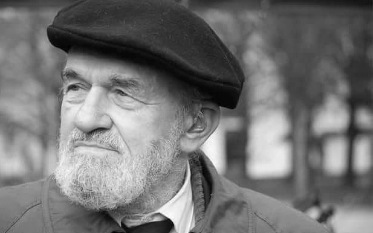

### 1977

W Katowicach powstał Komitet Wolnych Związków Zawodowych - organizacja, na czele której stanęli Kazimierz Switoń (zdjęcie), Roman Kściuszka, Władysław Sulecki, Ignacy Pines i Tadeusz Kicki.
KWZZ wystował apel do wszystkich polskich robotników, w którym namawiał do tworzenia przez nich w swoich zakładach wolnych organizacji związkowych. Wkrótce po rozpoczęciu działalności represjom poddano członków KWZZ, z których część zmuszono do zrezygnowania z członkostwa. Pod wpływem KWZZ, w kwietniu 1978 roku utworzone zostały Wolne Związki Zawodowe Wybrzeża.

  

### 1960

W Warszawie, wieku 86 lat zmarł generał Bolesław Szarecki (zdjęcie) lekarz wojskowy, weteran pierwszej wojny światowej i wojny polsko- bolszewickiej w roku 1920, uczestnik walk pod Monte Monte Cassino, szef służby zdrowia Armii Polskiej generała Władysława Andersa w Związku Radzieckim.
Mając już 65, w chwili niemieckiej agresji na Polskę w roku 1939 zgłosił się na ochotnika do wojska. Podjął służbę w jako chirurg w 104. szpitalu wojennym. Po 17 września 1939 roku trafił do sowieckiej niewoli do obozów w Kozielsku i Griazowcu. W roku 1941 wstąpił do organizowanej przez generała Andersa Armii Polskiej. Był oddany swojemu powołaniu. Zasłynął z tego, że już jako 70-latek, w czasie bitwy pod Monte Cassino przez dwie doby operował i kierował pracą Głównego Punktu Opatrunkowego. Po wojnie zajął się organizowaniem służby zdrowia w nowym Wojsku Polskim. Był autorem kilku publikacji z zakresu chirurgii wojennej.

  

### 1946

Podpułkownik Ludowego Wojska Polskiego prokurator wojskowy Jan "Iwan" Amons (zdjęcie) zatwierdził wyrok śmierci na plutonowym rezerwy Armii Krajowej, bohaterze wojny polsko -bolszewickiej Antonim Wiszowatym. Mężczyzna został zatrzymany przez Urząd Bezpieczeństwa Publicznego podczas przygotowań do porwania wicepremiera Tymczasowego Rządu Jedności Narodowej Władysława Gomułki w celu jego wymiany na więzionych żołnierzy podziemia lub likwidacji. W śledztwie nikogo nie wydał, utrzymując, że akcja była jego pomysłem. Wiszowaty został rozstrzelany, a jego ciało zostało prawdopodobnie rozpuszczone w sodzie kaustycznej.

  

### 1884

W Warszawie, urodził się Kazimierz Funk - polski biochemik żydowskiego pochodzenia, pracujący głównie w USA, odkrywca witamin i twórca nauki o nich. W 1911 roku wyodrębnił z otrębów ryżowych pierwszą witaminę (B1). W 1936 roku jako pierwszy wyizolował kwas nikotynowy. Prowadził też badania hormonów płciowych, insuliny i nowotworów.

  

### 1840

<https://en.wikipedia.org/wiki/Carl_Menger>

### 1836

Rewolucja teksańska: rozpoczęła się bitwa o Alamo.

Jednym z najbardziej znanych epizodów wojen grecko-perskich jest bitwa w Wąwozie Termopilskim, gdzie jak głosi legenda 300-u Spartan stawiało opór hordzie wojowników perskich. Żołnierze Leonidasa w końcu ulegli, ale ich mit przetrwał do dziś. W historii wielu krajów pojawiają się odpowiedniki Termopil. Dla dziejów Stanów Zjednoczonych do rangi takiego wydarzenia urosła bitwa o Alamo, która rozegrała się na przełomie lutego i marca 1836 r. Rolę amerykańskiego Leonidasa przejął podpułkownik William Travis.

Kilka lat po uzyskaniu przez Meksyk niepodległości (traktat pokojowy w Cordobie z 24 sierpnia 1821 r. pomiędzy nowo utworzoną Republiką Meksyku a Królestwem Hiszpanii) tereny tego państwa stały się polem kolejnego konfliktu, który amerykańska historiografia określa Rewolucją Teksańską. Jej główną przyczyną był narastający konflikt między amerykańskimi osadnikami zamieszkującymi tereny stanu Teksas – Coahuila a rządem meksykańskim.

Przybysze zza północnej granicy zaczęli masowo napływać do Teksasu krótko po powstaniu Republiki Meksyku. Zachęcały ich do tego miejscowe władze, które pragnęły rozwinąć gospodarczo najbiedniejszy stan nowego państwa. Teksas miał stać się jednym z centrów rolnictwa i hodowli. Największą rolę w organizowaniu amerykańskiego osadnictwa na tym obszarze odegrali Stephen Austin oraz Green DeWitt. Ten pierwszy otrzymał miano „Ojca Teksasu”. Mimo daleko sięgających planów co do roli Teksasu w ramach republiki meksykańskiej, między amerykańskimi osadnikami, a miejscowymi dochodziło do wielu nieporozumień i konfliktów. Przewaga liczebna „białych” nad Latynosami spowodowała, że rozwinął się pośród nich pomysł oddzielenia stanu i przyłączenia go do Stanów Zjednoczonych. Oczywiście pogłoski o zamierzeniach osadników docierały do Mexico City. Władze postanowiły przeciwdziałać rosnącym wpływom „białych”. Przykładowo w 1830 r. wprowadzono zakaz napływania do Teksasu osadników amerykańskich. Pomiędzy obiema stronami dochodziło do starć zbrojnych, czego przykładami są „rewolta Jamesa Longa” (1819 r. – jeszcze przed ogłoszeniem deklaracji niepodległości Meksyku) czy „Rebelia Fredońska” (1826-27 r.). Teksas nadal pozostał jednak w granicach Republiki Meksyku. Do czasu.

Szansę oderwania stanu Amerykanie upatrywali w toczącej się w latach 1832-33 w Meksyku wojnie domowej. W jej wyniku, od maja 1833 r. stanowisko prezydenta Meksyku sprawował generał Antonio Lopez de Santa Ana. W toczących się walkach osadnicy poparli Santa Anę, licząc na jego wdzięczność po zwycięstwie. Głęboko się jednak rozczarowali. Podejrzewając jednego z liderów Teksańczyków, Stephena Austina o sianie fermentu na terenie stanu, aresztowali go w trakcie jego powrotu ze spotkania z Santa Aną. Oczywiście fakt ten zadziałał na osadników jak czerwona płachta na byka. Austin został wypuszczony na wolność w lipcu 1835 r. i rozpoczął otwarte głoszenie propozycji oderwania Teksasu od Meksyku. Zdławić nieposłusznych Teksańczyków miał generał Martin Perfecto de Cosa i jego żołnierze. 9 października 1835 r. dotarł do San Antonio, gdzie otrzymał informacje o potyczce pod Gonzales, która jak się później okazało była bezpośrednią przyczyną wybuchu Rewolucji Teksańskiej.

2 października 1835 r. doszło do krótkiego starcia pomiędzy mieszkańcami miasteczka Gonzales a grupą meksykańskich dragonów. Dzień wcześniej meksykańscy żołnierze zażądali oddania starego działa, które znajdowało się w rękach amerykańskich osadników. Ci nie zgodzili się jednak. Przy armacie ustawili proporzec z napisem „Come and take it” i zaczęli drwić z przeciwnika. Rankiem 2 października, Amerykanie ostrzelali obóz Meksykanów z działa i karabinów. Dragoni rzucili się do ucieczki. Nic już nie mogło powstrzymać nadchodzącego huraganu. W ciągu kilku dni na miejscu potyczki pojawiło się blisko 500. Teksańczyków. Do Gonzales przybyli także ochotnicy ze Stanów Zjednoczonych. Dowództwo nad tą „armią” objął Stephen Austin, który poprowadził ją na San Antonio. 28 października grupa osadników, którą dowodził słynny traper Jim Bowie rozniosła meksykańską załogę misji Conception. Miesiąc później Teksańczycy wygrali tzw. „bitwę o trawę”. W obu tych starciach straty Latynosów wyniosły 120-u zabitych i ponad setkę rannych. Na polu walk pozostało zaledwie kilku poległych osadników. Po dotarciu pod San Antonio (12 października) Amerykanie rozpoczęli oblężenie miasta. Blokada San Antonio przeciągała się. Część osadników planowała nawet odpuszczenie i powrót do domów. 5 grudnia myśliwy Ben Milam poderwał jednak swoich kamratów do walki i poprowadził ich do ostatecznego ataku na miasto. Meksykańscy obrońcy mieli przewagę liczebną. Jednak żołnierze gen. de Cosy mieli niskie morale, a w mieście brakowało żywności. Po trwających pięć dni walkach miejskich osadnicy odnieśli zwycięstwo. San Antonio oraz kluczowa dla tej opowieści misja Alamo znalazły się w ich rękach. Meksykanie przyrzekli, że nigdy nie będą walczyć przeciwko osadnikom i zostali puszczeni wolno. Sukces w San Antonio sprawił, że wielu Teksańczyków uznało, że wojna bliska jest ku końcowi. Część z nich wróciła do swoich domów. Nowo wybrany dowódca teksańskiej armii, Samuel Houston przeczuwał jednak, że Santa Ana nie odpuści. Wiedział, że wojska meksykańskie liczebnie biją na głowę osadników. Planował zorganizować obronę we wschodnim Teksasie, gdzie zarówno ukształtowanie terenu jak i zalesienie tego obszaru sprzyjałby mniej liczebnym Amerykanom. Liczył na rozciągnięcie linii zaopatrzeniowych nieprzyjaciela i rozbicie jego oddziałów w kilku starciach. Walczących rodaków wspierali obywatele Stanów Zjednoczonych, gdzie w wielu miastach powstały punkty werbunkowe. Teksańczycy otrzymywać zaczęli także transporty z bronią, amunicją i żywnością.

W połowie stycznia 1836 r. do Alamo przybył wspomniany już przeze mnie Jim Bowie z grupką ochotników. Budynki misji powstały w 1718 r. i początkowo miały służyć edukacji nawróconych na chrześcijaństwo Indian. Później Alamo przejęło hiszpańskie wojsko. Bowie rozpoczął prace fortyfikacyjne, przygotowując bastion do obrony. Amerykanie zdawali sobie sprawę, że Santa Ana z pewnością zechce odzyskać utracone punkty. W ciągu kilkunastu następnych dni do Alamo przybyły posiłki, choć nie tak liczne, aby skutecznie obsadzić mury misji. Obrońcy nie mieli za to problemów z amunicją. Pozycje Amerykanów wzmacniało 21 armat. 3 lutego 1836 r. na miejsce przybył nowo mianowany dowódca, podpułkownik William Travis. Kilka dni później załogę wzmocnił słynny myśliwy Davy Crockett.

Jak przewidywał Samuel Houston gen. Santa Ana nie miał zamiaru zrezygnować ze stłumienia rebelii. Pod koniec grudnia 1835 r. zebrał 5000. ludzi i wyruszył przeciwko Amerykanom. Kiedy 23 lutego żołnierze gen. Joaquina Sesmy (dowodzącego jedną z brygad Santa Any) dotarli pod Alamo, jego załoga liczyła 175-u ludzi. Meksykanie wezwali obrońców do poddania się, gwarantując zachowanie życia. Amerykanie odmówili, wiedząc że w przypadku dostania się do niewoli zostaną straceni. Travis otrzymał wcześniej meldunek, że pomoc, na którą liczył może nie dotrzeć na czas do Alamo (tylko jedna 32-osobowej grupie ochotników wzmocniła obrońców w trakcie walk). Zajmujący pozycje wokół misji żołnierze meksykańscy rozpoczęli ostrzał artyleryjski. Obrońcy odgryzali się celnym ogniem z ustawionych na szańcach dział. Kilkakrotnie w trakcie oblężenia Amerykanie dokonywali nocnych wypadów na pozycje meksykańskie, siejąc wśród nich popłoch. Z racji niewielkiej liczby obrońców, którzy musieli czuwać 24 godziny na dobę, Santa Ana liczył na szybkie wyczerpanie załogi. Rozkazał także odciąć dopływ wody pitnej do misji. Pomysł chytry, ale okazał się nieskuteczny. Dzięki istnieniu dwóch studni w jej obrębie żołnierzom w Alamo nie brakowało wody.

Dzięki napływowi kolejnych pododdziałów, w początkowych dniach marca gen. Santa Ana miał pod Alamo blisko 2500. żołnierzy. Powtarzające się ataki meksykańskiej piechoty i ostrzał artyleryjski spowodowały, że wśród załogi pojawiały się o nikłych szansach na doczekanie się odsieczy podpułkownik zebrał swoich żołnierzy i przedstawił sytuację jasno. Pozostanie i walka do końca oznacza śmierć. Ci, którzy chcą spróbować przedrzeć się poza pierścień okrążenia mają drogę wolną. Następnie wyznaczył linię na ziemi, za którą mieli stanąć wszyscy, którzy postanowili zostać. Po chwili tylko jeden obrońca, Francuz Louis Rose pozostał na swoim miejscu. Udało mu się szczęśliwie przedrzeć przez linie meksykańskie. Davy Crockett zaproponował otwartą ostatnią walkę poza murami Alamo. Jednak większość zdecydowała, że jeśli Meksykanie chcą zwyciężyć, muszą pokonać obrońców w murach misji. Przemówienie Travisa bardzo dobrze ukazał w swoim filmie „Alamo”, John Lee Hancock.

Tymczasem Santa Ana omówił w swoim obozie plan ostatecznego szturmu na Alamo. O świcie 6 marca 1836 r. 1800. meksykańskich piechurów ruszyło do ataku. Generał Santa Ana podzielił ich na cztery kolumny, nacierające ze wschodu, południa, północnego-zachodu i północnego-wschodu. Meksykański dowódca zrezygnował z ostrzału artyleryjskiego, licząc na zaskoczenie. Obrońcy Alamo usłyszeli okrzyki „Viva Santa Ana” oraz wygrywaną przez orkiestrę „Pieśń o podrzynaniu gardeł”. Teksańczycy rozpoczęli ostrzał kroczące szeregi nieprzyjaciela. Od kul armatnich i wystrzałów karabinowych ginęli oficerowie i zwykli żołnierze. W zażartej walce trup kładł się gęsto po obu stronach. Santa Ana rozkazał gros swoich ludzi wysłać w kierunku północnej części misji, najsłabiej bronionej i osłabionej ostrzałem. W pewnym momencie poległ ppłk Travis, a Meksykanie wdarli się do Alamo, rażąc Teksańczyków z karabinów i dźgając bagnetami. Jako pierwsi starli się z obrońcami piechurzy generała Juana Amadora. Meksykanie przedarli się także w północno-wschodniej części. Dowództwo nad pozostałymi przejął kapitan John Baugh, ale już tylko kwestią minut była porażka obrońców Alamo. Część Amerykanów została zepchnięta w głąb „długich koszar”. Wokół uszu świstały kule, błyskały ostrza noży i bagnetów. Wściekli Meksykanie zdobywali kolejne pomieszczenia, eliminując nie mających szans Teksańczyków. Inni, m.in. Jim Bowie zginęli w „niskich koszarach”, a Davy Crockett został zakłuty bagnetami przed kościołem. Do końca wymachiwał strzelbą, nie dopuszczając do siebie żołnierzy Santa Any. Ostatni szturm na Alamo skończył się o godzinie 630. Na polu walki pozostało 189. znanych z nazwiska obrońców Alamo. Generał Santa Ana stracił w ciągu oblężenia blisko 600. zabitych i rannych. Kilkunastu cywilów, którzy znajdowali się na terenie misji Santa Ana oszczędził. Schwytani jeńcy zostali rozstrzelani. Upadek Alamo i późniejsza klęska pułkownika Jamesa Fannina pod Coleto Creek i masakra jeńców w Goliad nie doprowadziły jednak do porażki Rewolucji Teksańskiej. Oddziały Teksańczyków pokonały żołnierzy Santa Any pod San Jacinto. Meksykański wódz salwował się ucieczką, ale został schwytany. 14 maja 1836 r. obie strony konfliktu podpisały układ pokojowy w Velasco, uznający niepodległość Teksasu. Jednak dopiero 9 lat później, 29 grudnia 1845 r. Teksas stał się częścią Stanów Zjednoczonych Ameryki Północnej.

  

### 532

Rozpoczęto budowę świątyni Hagia Sophia w Konstantynopolu.
Burzliwe dzieje kościoła Hagia Sophia w Stambule (niegdysiejszym Konstantynopolu) są odzwierciedleniem przemian politycznych i wyznaniowych, jakie zachodziły na terenach dawnego Cesarstwa Bizantyjskiego. Kościół, wzniesiony jako miejsce liturgii kościoła wschodniego, w XV stuleciu, po zdobyciu Konstantynopola przez Turków, został zamieniony w meczet, a w 1934 roku, po przejęciu władzy przez Mustafę Kemala Atatürka i proklamowaniu republiki, stał się muzeum. Świątynia została ufundowana przez cesarza Justyniana I Wielkiego (panował w latach 527–565), a w obecnym kształcie wybudowana została w latach 532–537 przez wybitnych architektów-matematyków Anthemiosa z Tralles i Izydora z Miletu. Hagia Sophia, kościół poświęcony Mądrości Bożej, była najważniejszą świątynią Cesarstwa Bizantyjskiego, katedrą patriarchy i miejscem koronacji cesarzy. Pod względem architektonicznym uznawana jest za rozwiązanie wyjątkowe, śmiałe i nowatorskie, nie dające wpisać się w ramy znanych typów budowli.
Na poziomie rozplanowania Hagia Sophia łączy w sobie cechy bazyliki – podłużnej budowli założonej na planie prostokąta lub krzyża łacińskiego – i budowli centralnej – założonej na planie koła, wieloliścia bądź wieloboku. Typ bazylikowy jest charakterystyczny dla architektury chrześcijańskiej kręgu łacińskiego, typ centralny szczególnie często wykorzystywany był w kręgu greckiego chrześcijaństwa.
Centralną część kościoła stanowi przestrzeń założona na planie kwadratu, znajdująca się w nawie głównej i wyznaczona przez cztery potężne filary. W kwadrat wpisane jest koło będące podstawą kopuły rozpiętej nad główną przestrzenią świątyni. Rozwiązanie rozpięcia kopuły jest wybitnym osiągnięciem konstrukcyjnym budowniczych pracujących dla cesarza Justyniana. Kopuła nie wspiera się na murach obwodowych świątyni, we wnętrzu nie znajdziemy monumentalnej rotundy, na którą spływałby ciężar sklepienia. Kopułę podtrzymują bezpośrednio cztery pendentywy „wyrastające” z narożnych filarów. Pendentywy, zwane inaczej żagielkami, mają kształt trójkąta sferycznego i pozwalają na przejście z planu kwadratu (w przyziemiu) do planu koła (kopuły). Wyobraźmy sobie, że na każdej krawędzi kwadratu ustawione zostało półkole, na owe cztery półkola zaś nałożone koło. Miedzy krawędziami stykających się półkoli a krawędzią koła powstają trójkątne, jakby wklęsłe, pola. To właśnie pendentywy. Dzięki nim masywna kopuła – jej średnica liczy 31 metrów a wysokość od posadzki do najwyższego punktu 55, 6 metra – optycznie traci swój ciężar, wydaje się lekka, i jak pisali współcześni obserwatorzy „zwisająca jakby z nieba na złotym łańcuchu”. Zastosowanie w kościele Hagia Sophia pendentywów było rozwiązaniem zupełnie nowatorskim. Z czasem stało się typową cechą architektury bizantyjskiej. Od wschodu i zachodu poniżej kopuły, do ścian nawy przylegają dwie półkopuły, wspierające centralne nakrycie i przykrywające pozostałą przestrzeń nawy głównej. Dodatkowo filary podtrzymujące kolumnę, od południa i północy, wzmocnione zostały masywnymi przyporami.
Nawy boczne są oddzielone od nawy głównej kolumnami połączonymi łukiem półokrągłym. W tych partiach nawy głównej, które przykryte są półkopułami, znajdują się cztery półkoliste nisze (zwane eksedrami), dwie od wschodu i dwie od zachodu. Nawy boczne przykryte są sklepieniem krzyżowym. Ponad nimi znajduje się galeria (zwana emporą) otaczająca centralną przestrzeń kościoła, sięgająca połowy wysokości świątyni. Galeria, będąca w istocie długim korytarzem nakrytym sklepieniem kolebkowym (mającym kształt walca przeciętego wzdłuż), otwierała się na wnętrze centralnej części świątyni rzędem arkad wspartych na kolumnach.
Kościół poprzedzony jest przedsionkiem, zwanym nartekstem, gdzie znajdowały się liczne reprezentacyjne wejścia.
Wnętrze kościoła Hagia Sophia było dość ściśle podzielone na monumentalną, oświetloną przestrzeń nawy głównej oraz zacienione nawy boczne z emporami, zdecydowanie podporządkowane centralnej przestrzeni. Jak wiadomo ze źródeł, cesarz Justynian I Wielki nie szczędził środków na wyposażenie kościoła. Do wystroju świątyni użyto wielu niezwykle kolorowych materiałów, takich jak porfiry i marmury, które wykorzystano jako okładzinę ścian i filarów. Dekoracyjności przydawały wnętrzu także elementy ozdobione złotem, srebrem, kością słoniową i błyszczącymi kamieniami. Światło wpadające do świątyni ślizgało się po powierzchniach kamieni i cennych kruszców, podkreślając luksus i przepych najważniejszej świątyni Cesarstwa.

  

---

<a href="https://github.com/TomaszWaszczyk/historia.waszczyk.com/edit/master/src/content/february-23.md" target="_blank">Edytuj tę stronę dzieląc się własnymi notatkami!</a>
