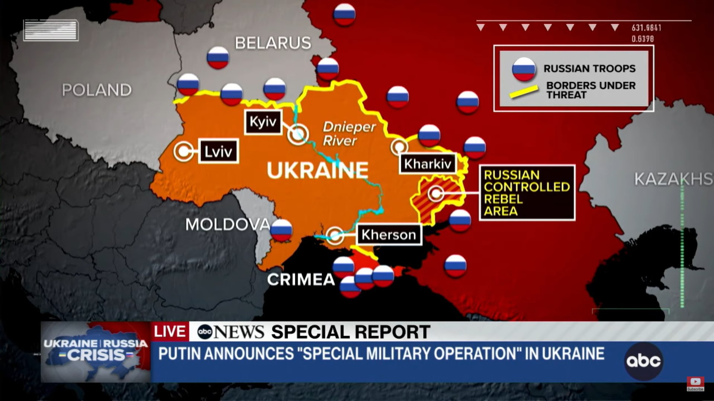
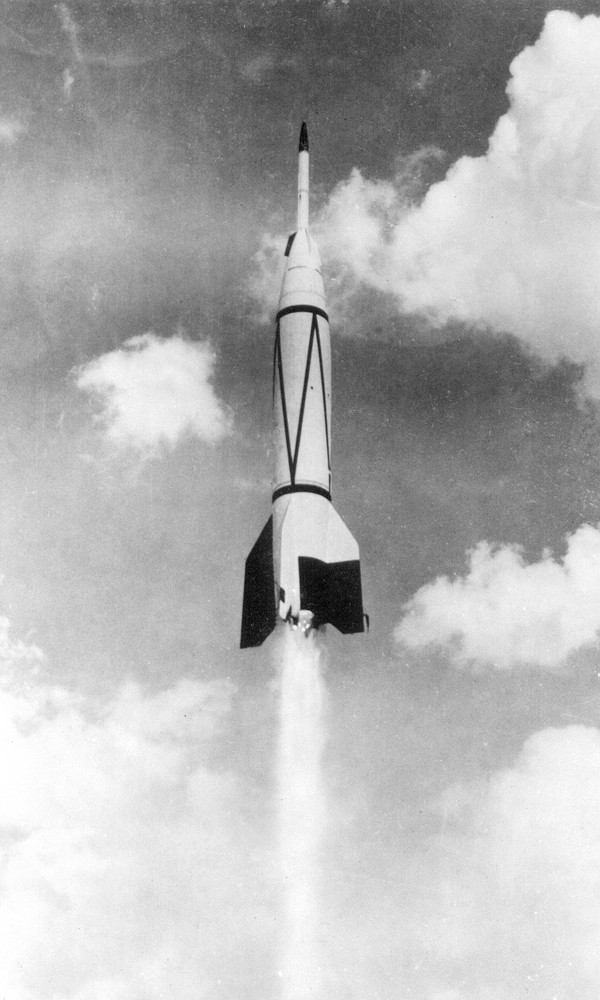
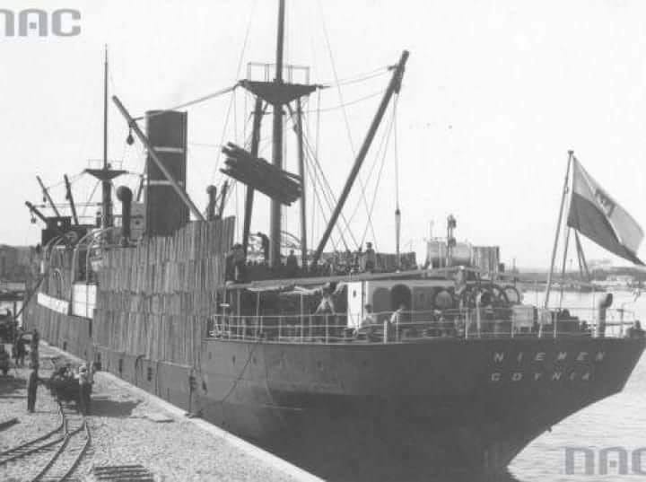
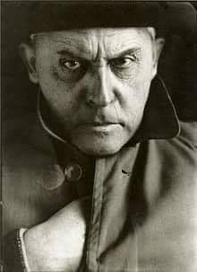
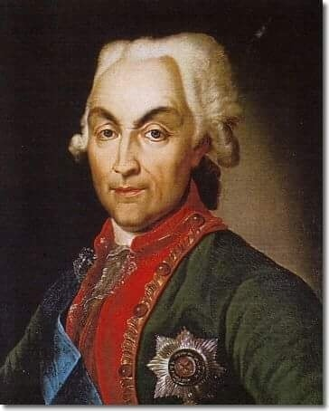
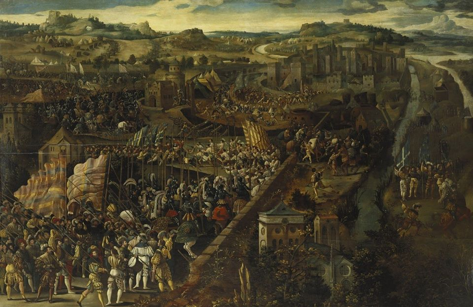

### 2022

> Rosja zaatakowała Ukrainę. Rozpoczęła się inwazja

> Wielka Brytania wyśle do Polski mobilny system obrony przeciwlotniczej Sky Sabre.

W nocy ze środy na czwartek Władimir Putin ogłosił w telewizyjny wystąpieniu rozpoczęcie „operacji specjalnej w Donbasie”. Według informacji władz i relacji w sieciach społecznościowych rosyjskie siły zaczęły ostrzał ukraińskich miast także z innych kierunków. Wybuchy słychać było także w stolicy Ukrainy, Kijowie.

Rosyjska flota atakuje Odessę. Trwa też atak na Kijów. Ostrzeliwane są lotniska

  

### 2021

Umiera Claude Shannon

### 1949

Amerykańska rakieta Bumper 5 wzniosła się na rekordową wysokość 400 km przy prędkości 2300 m/s.
Maksymalna prędkość rakiety wyniosła 8290 km/h. Była to pierwsza na świecie duża dwuczłonowa rakieta na paliwo ciekłe. Powstała z połączenia niemieckiej V2 (po usunięciu głowicy bojowej) ze zmodyfikowaną rakietą WAC Corporal, jako drugim członem. Powstało 8 egzemplarzy rakiety.

  

### 1931

Polski masowiec SS Niemen, jako pierwsza polska jednostka handlowa przepłynął równik.
Statek pod dowództwem kapitana Leona Rusieckiego odbywał rejs z portugalskiej Madery do Colon w Ameryce Południowej. Zatonął 1 października 1932 roku w wyniku zderzenia fińskim żaglowcem.

  

### 1885

W Warszawie urodził się Stanisław Ignacy Witkiewicz (zdjęcie) malarz, filozof, literat i fotografik.
Był absolwentem krakowskiej Akademii Sztuk Pięknych. Jego twórczość fascynowała talentem, futuryzmem i ekscentryzmem, którego jemu samemu również w życiu prywatnym nie brakowało.
Na swoim koncie ma takie dzieła jak "Sonata Belzebuba", "Szewcy", "Tumor Mózgowicz","W małym dworku" czy "Nienasycenie".
Sam o sobie mówił: : "Nie jest moją winą, że jestem taki. Trzeba się z tym pogodzić".

  

### 1768

Zastraszona przez posła carskiego Nikołaja Repnina (grafika) delegacja posłów polskich podpisała Trakrat Wieczystej Przyjaźni z Rosją. Na jego mocy państwo polsko - litewskie dostało się pod protekcję rosyjską, zaś caryca Katarzyna II zobowiązała się zagwarantowania nienaruszalności granic Rzeczypospolitej. Jedynym protestującym przeciwko przyjęciu tego dokumentu był Józef Wybicki.

  

### 1525

V wojna włoska: decydujące zwycięstwo wojsk habsburskich nad francuskimi w bitwie pod Pawią.

Bitwa pod Pawią, która rozegrała się 24 lutego 1525, była decydującą bitwą w toczonych w latach 1494–1559 wojnach włoskich. Początek wojen włoskich przypada na rok 1494, gdy władca Francji Karol VIII, starając się umocnić panowanie we Włoszech, został pokonany przez ligę hiszpańsko-austriacką, do której dołączyły Anglia i miasta włoskie. Następca Karola Ludwik XII ponownie przystąpił do wojny i w roku 1500 zajął Mediolan oraz starł się w roku 1504 z Hiszpanami w bitwie o Neapol. Francuzi toczyli walki z wojskami Maksymiliana I Habsburga oraz króla angielskiego Henryka VIII. Po krwawych bitwach pod Ginegate oraz Novarą 1512-1513 r. zmuszeni jednak zostali do opuszczenia Mediolanu. Większy sukces odniósł następca Ludwika, Franciszek I, który już na początku swojego panowania odnosząc wspaniałe zwycięstwo pod Marignano w roku 1515, ponownie zajął Mediolan. Kolejny władca Habsburgów, Karol V, uznał postanowienia traktatu z Noyon za nieważne i w roku 1521 walki we Włoszech wybuchły na nowo. W październiku 1524 r. w wyniku nowej kontrofensywy wojska francuskie zawładnęły Mediolanem, rozbite zaś wojska cesarskie zamknęły się w Pawii, obleganej przez Francuzów. Do oblegania Pawii król francuski Franciszek I zaangażował cztery i pół tysiąca landsknechtów z Czarnego Legionu, pięć tysięcy Szwajcarów, około dwóch tysięcy jazdy włoskiej i francuskiej. Pawia została obsadzona przez wojska hiszpańskie, cesarskie i niewielkie korpusy włoskie. Obrońcy miasta, przede wszystkim ze względu na silne fortyfikacje, odparli pierwszy szturm wojsk francuskich, który nastąpił 28.X.1524 r. Wojska francuskie bez skutku próbowały odciąć miasto od wody, aż w końcu zdecydowano o blokadzie Pawii. Wojska francuskie stały pod twierdzą aż do zimy, przez co wojsko francuskie słabło, rosła dezercja i szerzyły się choroby, co pozwoliło wojskom cesarskim uzupełnić straty. W tym celu sprowadzono z Niemiec jedenaście kompanii landsknechtów i osiemnaście kompanii piechoty.

Po koncentracji armia cesarska liczyła dwanaście tysięcy landsknechtów, pięć tysięcy piechoty (w tym hiszpańska piechota, która była wyposażona także w broń palną) i tysiąc jazdy hiszpańskiej. Armia Franciszka liczyła wówczas już dwadzieścia tysięcy wojska. Wojska cesarskie przeprowadziły szturm w nocy z 23 na 24 lutego. Zaskoczenie wojsk francuskich było ogromne. Franciszek zbierając rozproszone oddziały zdecydował się na desperacki atak. Z użyciem oddziału jazdy ordynansowej rozbił tylną straż wojsk cesarskich i związał na lewym skrzydle jazdę hiszpańską. Gdy Hiszpanie odskoczyli od ciężkozbrojnych kompanii ordynansowych, cesarscy muszkieterowie i arkebuzerzy zdziesiątkowali ogniem Francuzów i umożliwili kontrnatarcie jeździe hiszpańskiej.

Następnie doszło do walki między czworobokami piechoty. Dowódca landsknechtów, mimo iż posiadał mniej liczne oddziały, nie dał żadnych szans wojskom Franciszka. Piechota francuska zaatakowana z trzech stron została „wybita do nogi”. Niedobitki jazdy francuskiej uciekając w stronę Pawii wpadły na własną piechotę szwajcarską. Z Pawii wymaszerował w ostatniej fazie bitwy dowódca obrony tego miasta na czele załogi Niemiecko-hiszpańskiej i szybkim atakiem zdobył obóz francuski Bitwa pod Pawią ukazała wzrastającą rolę broni palnej. Ogień hiszpańskich muszkieterów nie tylko powstrzymał natarcie Szwajcarów i zdziesiątkował skrzydło kolumny francuskiej piechoty, ale także osłabił i pokonał szwadrony jazdy francuskiej. Ponadto, strzelcy ukryci w krzakach i za płotami prowadzili silny ogień, likwidując żołnierzy i konie, podczas gdy przeciwnicy nie mogli ich dosięgnąć pikami. Brak w armii francuskiej dostatecznej liczby piechoty uzbrojonej w broń palną w dużym stopniu zadecydował o ich klęsce. Dalszy rozwój broni palnej kładzie kres świetności jazdy rycerskiej, a na polach bitew od tej pory decydującą rolę zaczyna odgrywać piechota uzbrojona w broń palną w postaci arkebuzów i muszkietów.

  

---

<a href="https://github.com/TomaszWaszczyk/historia.waszczyk.com/edit/master/src/content/february-24.md" target="_blank">Edytuj tę stronę dzieląc się własnymi notatkami!</a>
