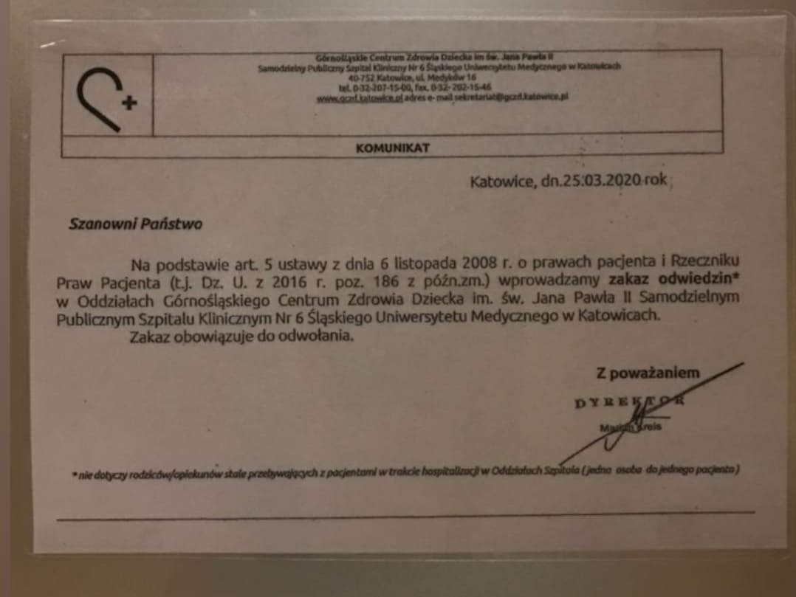
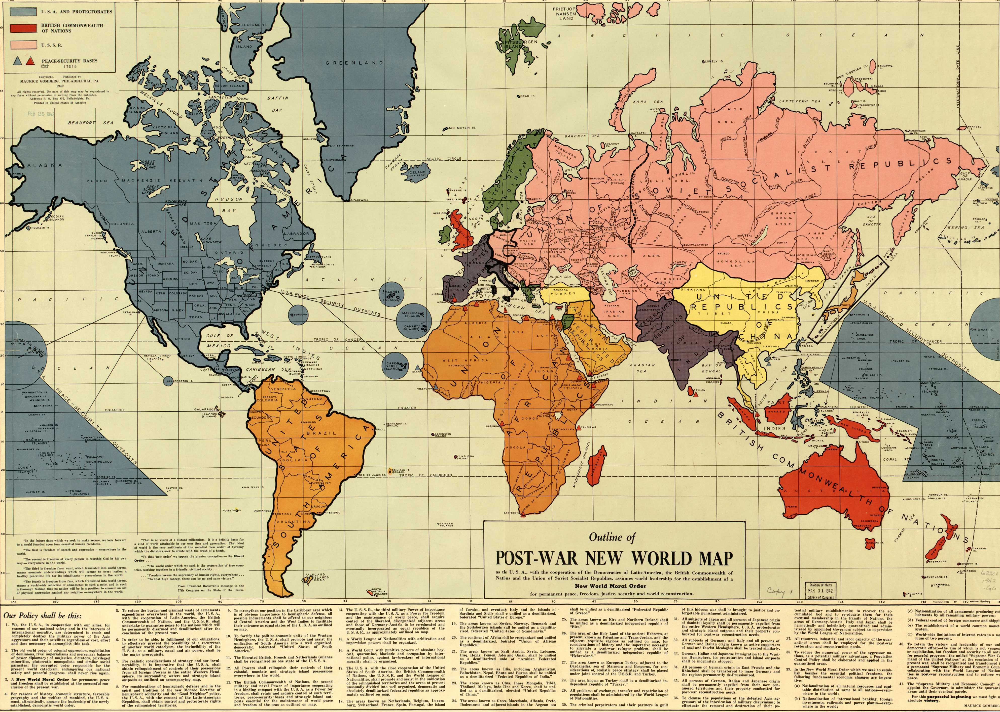
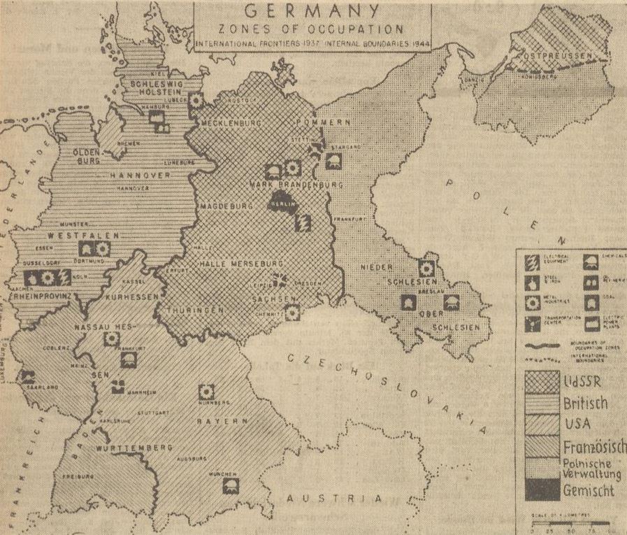
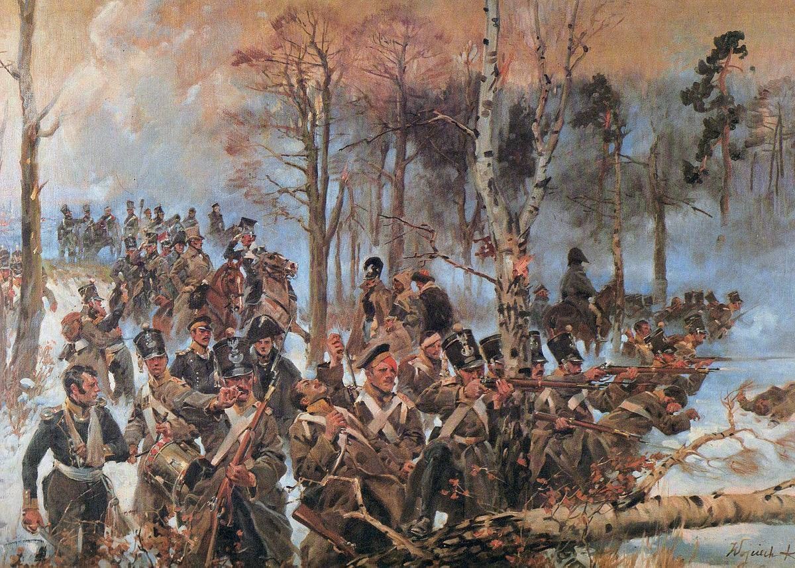
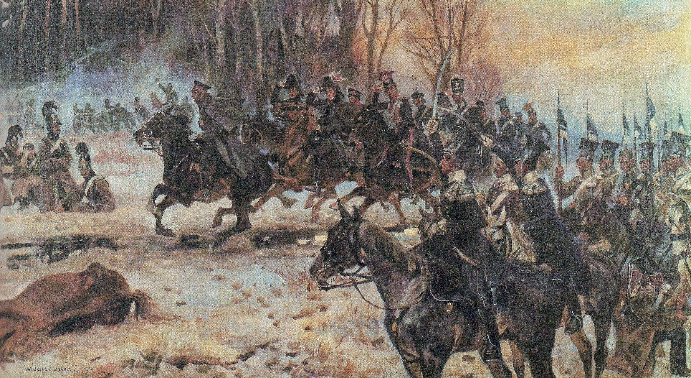
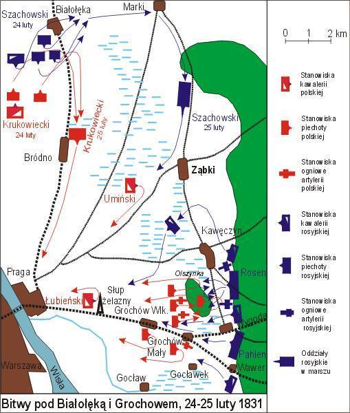
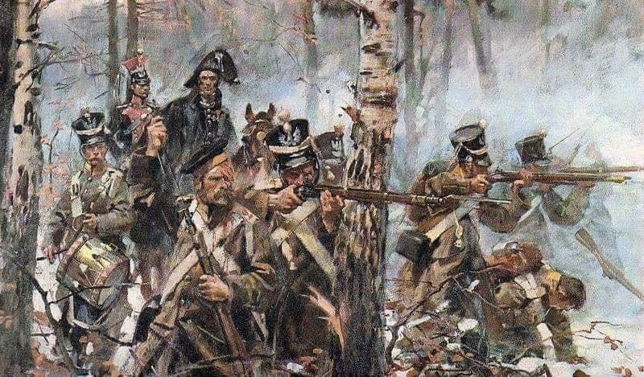

### 2024

  

> Polska - jedna z ładniejszych działek na świecie.

### 2023

  

### 2022

Ukraina:

<video width="640" height="480" controls>
<source src="./movies/february/wojnaputina.mp4" type="video/mp4">
Your browser does not support the video tag.
</video>

### 2021

Mamy wcześniaków nawet po dwóch szczepieniach nie są wpuszczane do dzieci. W szp. Rydygiera w Toruniu mogą jedynie zostawić odciągnięte mleko. W Katowicach też są nadal odcięte od dzieci. Zakaz z 03.2020 r.obowiązuje do teraz.

  

---

> Zachęcam do używania nowej odsłony aplikacji STOP COVID, która pomaga identyfikować kontakt z zakażonym wykorzystując technologie Bluetooth. Jednocześnie zapewnia anonimowość i poszanowanie prywatności. Osoby, które miały kontakt i przejdą przez ankietę ryzyka mają dostęp do testu bez konieczności wizyty u lekarza. Dodaliśmy też bieżące informacje o tempie realizacji akcji szczepień.
> W Wlk Brytanii przeprowadzono badania, wg których zwiększenie o 1% liczby użytkowników zmniejsza liczbę zakażeń o 2,3%. - Adam Niedzielski

---

### 1942

Outline of the Post-War New World Map

  

---

### 1946

"Die Weltpresse", Niemcy. Granice stref okupacyjnych.

  

---

### 1862

https://pl.wikipedia.org/wiki/Stanis%C5%82aw_G%C5%82%C4%85bi%C5%84ski_(polityk)

Stanisław Głąbiński był jednym z najbardziej wpływowych polityków endecji w dwudziestoleciu międzywojennym. Wiosną 1939 roku opublikował swoje wspomnienia polityczne, które z konieczności musiał zakończyć na maju 1926 roku. W latach trzydziestych cenzura nie pozwalała na swobodną krytykę sanacji i Piłsudskiego. Dlatego dopiero w październiku 1939 roku Głąbiński napisał suplement do wspomnień obejmujący lata 1926-39.

Poniżej zamieszczam niektóre cytaty z tego suplementu.

"Zamach stanu uzasadniał Piłsudski i jego otoczenie koniecznością ścigania szujów, złodziei i morderców, zagnieżdżonych rzekomo w rządzie, i przeprowadzenie sanacji moralnej. Wprawdzie dowodów na te łajdactwa nie znalazł, mimo to cel tak wzniosły i tak zrozumiały znalazł poklask u szerokich warstw".

"Nic też nie odkrywa tak jaskrawo i tak dosadnie bankructwa moralnego piłsudczyzny, jak ten fakt, że to samo tak piękne i żywotne hasło w ciągu ich rządów bladło stopniowo w oczach społeczeństwa, a w końcu stało się przedmiotem niemal powszechnego pośmiewiska i wzgardy. Sami zwolennicy sanacji moralnej przestali posługiwać się tym hasłem, aby nie wywoływać wrogiej reakcji u słuchaczy. Dla ogółu społeczeństwa hasło takie, głoszone przez grupę ludzi splamionych bezprawnymi i fałszywymi wyborami, demagogicznymi obiecankami, metodami policyjnymi, łapownictwem i obdzieraniem skarbu publicznego, stało się cyniczną prowokacją i szydzeniem z obywateli".

"[wpływowy sanator] powiedział mi <<Po cóż mamy walczyć ze sobą, gdy możemy łatwo się porozumieć. Jest w Polsce przecież tyle posad do obsadzenia, że wystarczy ich dla nas i dla was. Proszę więc zastanowić się nad tym, czy nie moglibyśmy się porozumieć i zawiesić walki wzajemnej?>>".

"Zrazu zadowalano się zwalnianiem endeków i ludzi podejrzanych o nieprawomyślność (...). Gdy to nie wystarczało, trzeba było otwierać posady zupełnie niepotrzebne (...). Tak zdezorganizowano administrację państwową, powiększono koszta administracyjne monopolów i przedsiębiorstw państwowych, obciążono niezmiernie budżet emerytur państwowych i kolejowych, aby nasycić głodnych próżniaków, zwiększając szeregi sanacji i entuzjastycznych wielbicieli wskrzesiciela Polski".

"Piłsudski objął władzę w okresie najpomyślniejszej koniunktury w Polsce i wierzył w to, a tak samo wierzyli jego mamelucy, że tak będzie zawsze, tak musi być, skoro on, ich prorok, rządzi w państwie. Rok 1926 zakończył się pomyślnie pod względem finansowym a jeszcze pomyślniej pod względem gospodarczym".

"Mając zupełnie oddane sobie i uległe otoczenie, skarżył się później, że ma wrażenie, iż naród polski jest narodem idiotów".

"Sądownictwo polskie zostało pozbawione niezależności sędziowskiej przez kilkakrotne "reorganizacje", dowolne pensjonowanie i przenoszenie sędziów, wstrzymywanie awansów i wykonywanie terroru ze strony przełożonych".

"Prokuratoria państwowa utraciła również samodzielność, stała się służebną ideologii sanacyjnej".

"Zabrano się najpierw do zmiany konstytucji celem stworzenia podstawy prawnej dla całego systemu. Przez dziesięć lat dyskutowano w swoich kołach, projektowano i projekty ucinano, aby zadowolić Piłsudskiego, dla którego przeznaczono stanowisko prezydenta Rzeczypospolitej , odpowiedzialnego tylko przed Bogiem i historią. Ale zaledwie zdołano taki projekt konstytucji opracować i uchwalić, Piłsudski zmarł".

"Chełpiła się sanacja przy każdej sposobności swoimi dziełami, przeważnie urojonymi, jak np. budową portu w Gdyni, utworzeniem silnej armii, mocarstwowym stanowiskiem państwa, stabilizacją waluty, Centralnym Okręgiem Przemysłowym, planem połączenia Wisły z Dnieprem i Morzem Czarnym".

"Największą chlubą sanacji było podniesienie Polski do godności mocarstwa".

"Jakaś mania wielkości, szał prawdziwy opętał tych ludzi, którzy wmawiali w siebie i drugich, że Piłsudski zbawił Polskę i podniósł ją do pierwszorzędnej potęgi mocarstwowej".

"Doczekaliśmy się najstraszliwszej katastrofy politycznej państwa i narodu (X 1939). Niech powszechne potępienie sprawców tego losu będzie nauką i przestrogą na zawsze przed podobnymi próbami na przyszłość".

Tym zdaniem Stanisław Głąbiński zakończył swoje wspomnienia. Półtora roku później zmarł w sowieckim więzieniu w Charkowie. Patrząc na obecne rządy trzeba powiedzieć, że wbrew nadziejom Głąbińskiego nie wyciągnęliśmy żadnej nauki z upadku II RP. A co gorsza, historia sanacji nie stała się ostrzeżeniem. Stała się podręcznikiem rządzenia.

### 1831

Powstanie listopadowe: wojska powstańcze odniosły zwycięstwa w bitwach pod Białołęką i o Olszynkę Grochowską.

”Żołnierze polscy, to najlepsi w świecie żołnierze” – Wielki Książę Konstanty obserwujący bitwę grochowską.

5 lutego 1831 roku, zakończyła się najkrwawsza bitwa powstania listopadowego. Pod Grochowem Wojsko Polskie wydało walną bitwę rosyjskim siłom głównym feldmarszałka Iwana Dybicza.

W dniach 19-25 lutego, na przedmościu praskim, pod Białołęką i Grochowem siły polskie faktycznie dowodzone przez gen. Chłopickiego (formalnie naczelnym wodzem był książę Michał Radziwiłł), a liczące około 36 tys. żołnierzy i 114 dział, zmierzyły się z armią carską liczącą około 59 tys. żołnierzy i 178 dział. Głównym zadaniem strony polskiej była obrona Warszawy i uniemożliwienie Rosjanom przeprawy przez Wisłę.

Po zwycięskich dla Polaków starciach pod Wawrem i Białołęką, feldmarszałek Dybicz zdecydował się na rzucenie sił głównych do natarcia przeciw centrum polskiego ugrupowania. Najbardziej wysuniętą pozycją był mały zagajnik olchowy pod wsią Grochów, którego bronił 4. Pułk Piechoty Liniowej. Uporczywa obrona „Czwartaków” załamywała kolejne szturmy Rosjan, a lasek przechodził wielokrotnie z rąk do rąk. Ta szczególnie zacięta walka przeszła do historii jako bój o Olszynkę Grochowską.

Siły polskie jednak systematycznie wyczerpywały się, Dybicz natomiast, dysponujący przewagą liczebną posiadał wciąż świeże odwody. Po trzech godzinach zmagań Olszynka została ostatecznie zajęta przez Rosjan. Na skutek niepodporządkowania się rozkazom dyktatora przez generałów Krukowieckiego i Łubieńskiego, jazda nie została użyta do planowanego przeciwnatarcia. Ostatecznie, dywizje Chłopickiego, zostały zmuszone do rozpoczęcia odwrotu. Tymczasem, widząc szansę na rozstrzygnięcie bitwy, rzucił Dybicz do szarży swoją kawalerię. 28 szwadronów rosyjskich zaatakowało polskie lewe skrzydło, 30 kolejnych uderzyło na prawe. Był to krytyczny moment bitwy, grożący całkowitym rozbiciem armii polskiej. Uchodzące oddziały, otrząsnęły się i sformowawszy czworoboki, odparły groźne rosyjskie szarże. Na kawalerię Dybicza uderzyła także jazda Krukowieckiego wsparta baterią rac kongrewskich, zmuszając Rosjan do odwrotu. Ostatecznie polskie oddziały wycofały się na Pragę.

Bitwę pod Grochowem uznaje się za nierozstrzygniętą. Wojskom rosyjskim nie udało się rozbić polskiej armii. Dybicz zaniechał także szturmu Pragi. Straty rosyjskie to około 9400 żołnierzy, straty polskie – 7350.

  

  

  

---

W czasie powstania listopadowego miała miejsce bitwa pod Grochowem-jedna z najkrwawszych batalii tego polskiego zrywu narodowego.
40 tysięczne oddziały powstańcze dowodzone przez generała brygady Józefa Chłopickiego stanęły do walki z 65 tysięcznymi wojskami rosyjskimi pod dowództwem feldmarszałka Iwana Dybicza.
W bitwie tej poległo 7 tysięcy Polaków i 10 tysięcy Rosjan. Mimo to uznaje się ją za nierozstrzygniętą.
W bitwie chwałą okrył się 4 Pułk Piechoty Liniowej, który wielokrotnie kontratakował,a także odpierał ataki przważających sił rosyjskich.

  

### 1793

Rozpoczął się kryzys bankowy wywołany zrujnowaniem gospodarki w wyniku wojny polsko-rosyjskiej i wprowadzeniem rządów konfederacji targowickiej.
Pośród wielu katastrof, które spadły na Rzeczpospolitą w drugiej połowie XVIII wieku były również te gospodarcze. Wszystkie razem doprowadziły do wielkiego kryzysu bankowego, będącego agonalnym krzykiem umierającego państwa.
atastrofy spadały na Rzeczpospolitą już od samego początku XVIII wieku, a zapoczątkowała je wojna północna prowadzona na jej terytorium, choć formalnie bez jej udziału. Zresztą w nowe stulecie wchodziło nasze państwo wyniszczone wieloletnimi wojnami, przetrzebione przez konflikty i zarazy oraz niewydajną, ekstensywną gospodarką. W połowie wieku umacniające się pod rządami Fryderyka Wielkiego Prusy zdobyły w czasie wojny z Saksonią matryce do bicia polskich monet. Zdając sobie sprawę z wagi narzędzia, które trafiło w jego ręce rozpoczął berliński władca produkcję pieniądza zalewając Rzeczpospolitą złej jakości monetami. Zdaniem historyków ten proceder trwający kilkanaście lat spowodował napływ do naszego kraju 600 mln złotych fałszywego pieniądza. Dla porównania para butów kosztowała wówczas 3 złote, a pensja woźnego 2 złote tygodniowo.
Król Stanisław August Poniatowski nie tylko pobierał pensje od sąsiedzkich dworów, ale również na potęgę się w nich zapożyczał. Najchętniej w Petersburgu, u swojej protektorki, Katarzyny II. Kiedy w 1792 r. Rosja wystąpiła zbrojnie przeciwko Polsce wspierając Targowiczan, Katarzyna zażądała od władcy (co w sumie zrozumiałe) wstrzymania działań obronnych grożąc żądaniem natychmiastowej spłaty zobowiązań. Król uległ naciskom i przystąpił do Targowicy.
Sytuacji nie ułatwiały wysunięte przez Prusy i Rosję żądania terytorialne wobec Polski i w ich konsekwencji II rozbiór dokonany na początku 1793 roku. Oddzielone od RP kordonem celnym zostały bogate tereny Kujaw i Wielkopolski oraz zaplecze rolnicze Ukrainy i Litwy. Do tego żołnierze żądali wypłaty żołdu, a kasa królewska znalazła się u dna spirali kredytowej. Zadłużenie władcy wynosiło sześciokrotność jego rocznego budżetu. U samego bankiera Teppera było to 11 i pół miliona złotych.
Piotr Fergusson Tepper nie miał zresztą szczęścia. Był najbogatszym bankierem końca XVIII wieku, jego majątek wynosił ok 65 mln złotych, pośredniczył w lokowaniu w Polsce kapitałów bankierów amsterdamskich. Jednak wojna obronna 1792 r., nagłe wycofywanie pieniędzy przez niderlandzkich inwestorów i niewypłacalność króla doprowadziła do jego upadku.
25 lutego 1793 r. największy w Rzeczpospolitej bank - Piotra Fergussona Teppera ogłosił bankructwo. W ślad za nim upadło pięć innych instytucji bankowych, co spowodowało przejściową niewypłacalność poselstw pruskiego i rosyjskiego. Tepper wspólnie z Piotrem Blankiem odpowiadał za wypłacanie politykom polskim i litewskim łapówek z kasy władców zaborczych, dlatego ambasador rosyjski nakazał opieczętowanie archiwów bankiera. Na niewiele zdały się pieczęcie, kiedy 20 kwietnia 1794 r. podczas insurekcji kościuszkowskiej wzburzony tłum wpadł do rezydencji byłego bankiera spodziewając się znaleźć kompromitujące dokumenty.
Nie pomylili się. Według ksiąg bankiera na stałej pensji był Poniatowski i całe jego najbliższe otoczenie. Doprowadziło to do publicznych egzekucji targowiczan (bądź ich portretów). Władca uniknął śmierci dzięki postawie części mieszczan, którzy postanowili go uratować i wyznaczyli gwardię przyboczną. Wojna, która w kolejnych miesiącach ogarnęła kraj stała się pretekstem do kolejnego rozbioru i likwidacji państwa.
Sam Tepper zmarł sześć dni po napadzie na jego dom na skutek odniesionych ran.

---

<a href="https://github.com/TomaszWaszczyk/historia.waszczyk.com/edit/master/src/content/february-25.md" target="_blank">Edytuj tę stronę dzieląc się własnymi notatkami!</a>
