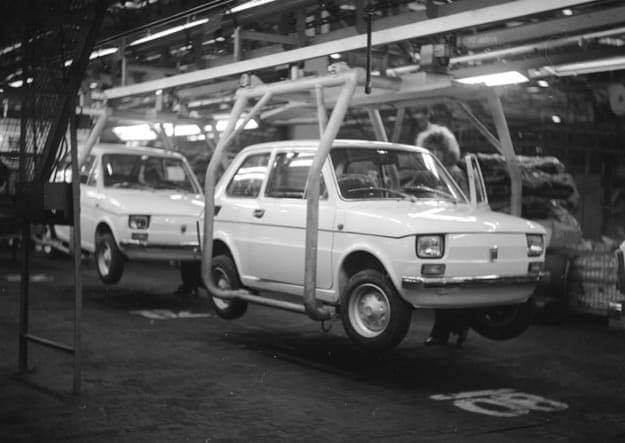
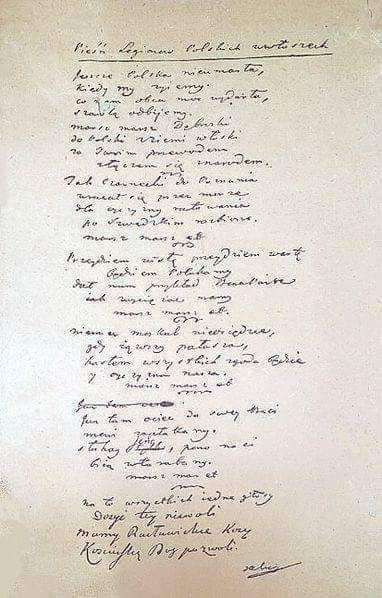

### 2018

### Prof. Oręziak: PPK? Wielka iluzja emerytalna. Jak OFE. Ogromne koszty, brak jakichkolwiek gwarancji dla oszczędzających

Korzyści z prowadzenia PPK przypadną nielicznym, tak samo jak było, i dalej jest, przy OFE. Dług obciąża całe państwo, a korzystały towarzystwa emerytalne i różne instytucje finansowe oraz osoby z nimi powiązane - rozmowa z prof. Leokadią Oręziak o nowym sposobie oszczędzania na emerytury, czyli Pracowniczych Planach Kapitałowych.

Piotr Skwirowski: Rząd przyznaje, że emerytury z ZUS będą bardzo niskie. Będziemy głodować na starość?

Prof. Leokadia Oręziak, Szkoła Główna Handlowa: System emerytalny, który jest teraz i będzie decydował o emeryturach w przyszłości, sam się taki nie stał. Został stworzony w 1999 r. Stworzyli go polscy neoliberałowie. Przeprowadzili skrajnie neoliberalną reformę, która polegała na obniżeniu świadczenia z pierwszego filara i ustanowieniu drugiego filara kapitałowego. Zredukowano więc emerytury ZUS-owskie wprowadzając zasadę zdefiniowanej składki i odchodząc od zasady zdefiniowanego świadczenia. Dało to możliwość obcięcia emerytur o połowę, o czym Polacy wtedy się nie dowiedzieli, bo cały czas zachwalano, że reforma zapewni wysokie emerytury.

Obiecywano, że na stare lata będziemy odpoczywali w ciepłych krajach, pod palmami.

- Tak. Trzeba było jednak powiedzieć ludziom, że obniża im się emerytury o połowę, że stopa zastąpienia, czyli stosunek pierwszej emerytury do ostatniej pensji pracownika, która wtedy wynosiła 70 proc., jest nie do utrzymania. W uczciwej debacie trzeba było o tym mówić.

Ale spadek stopy zastąpienia do 50 proc. jakoś nas wtedy specjalnie nie niepokoił. Teraz mówi się jednak o 30 proc., a może nawet mniej. I to już trochę przeraża.

- Rzeczywiście stopa zastąpienia spadła do około 50 proc. Ale jest jeszcze relatywnie wysoka dlatego, że są osoby, które przy ustalaniu emerytury mają kapitał początkowy. On rzutuje na to, że ta emerytura jest wyższa. W pewnym momencie jednak ten kapitał nie będzie już odgrywał roli i ludzie będą mieć tylko takie emerytury, jakie wynikają ze składek zaksięgowanych na ich kontach. System zdefiniowanej składki gwarantuje wprawdzie emeryturę minimalną dla osób, które mają określony staż, ale jest to system pozbawiony elementu solidarnościowego, ochronnego.

To mechanizm w gruncie rzeczy rentierski. Do tego dołożono Otwarte Fundusze Emerytalne, które pochłaniały około 40 proc. składki. Czas pokazał, że było to rozwiązanie niezwykle szkodliwe z każdego punktu widzenia. Mimo to dalej trwa. To pokazuje, jak trudno się z tak skrajnie złego systemu wycofać. Próby w tym kierunku napotykają na opór tych, którzy są zainteresowani jego utrzymywaniem i nakręcają nastroje społeczne przeciwko takim zmianom. W efekcie, to co zrobiły PO z PSL, częściowa likwidacja OFE, większość ludzi postrzega jako coś niedobrego.

Jako skok na kasę.

- No właśnie. A to oczywiście nie był żaden skok na kasę, tylko konieczne zmiany, gdyż z powodu OFE w latach1999-13 powstał dodatkowy dług publiczny na kwotę ponad 330 mld zł, co stanowiło połowę przyrostu długu w tym okresie. Dług ten wynikał z konieczności refundowania ZUS-owi ubytku składek emerytalnych, które skierowano do OFE, zamiast na wypłatę bieżących emerytur. Ponieważ od 1999 r. do OFE zaczęto przekazywać prawie 40 proc. całej składki emerytalnej pobieranej od wynagrodzeń pracowników, to kolejne rządy musiały zaciągać pożyczki, by pokryć ten ubytek i zapewnić środki do życia osobom, które już przeszły na emeryturę.

Zmiany w OFE były niezbędne przede wszystkim po to, by zapobiec niewypłacalności Polski i ograniczyć ten rujnujący finanse publiczne system. Konieczne były także, by chronić interes przyszłych emerytur, dla których taki system jak OFE jest bardzo krzywdzący ze względu na wysokie ryzyko i koszty.

Ostrzeżeniem dla Polaków powinny być doświadczenia Chile, gdzie w 1981 r. sprywatyzowano system emerytalny i całą składkę emerytalną skierowano do funduszy emerytalnych do inwestowania na rynku finansowym. Po ponad 35 latach większość członków tych funduszy nie jest w stanie osiągnąć nawet minimalnej emerytury i bez pomocy państwa nie byłaby w stanie przeżyć w okresie starości.

W Polsce rządzący sami sobie są winni, bo wprowadzając zmiany w OFE nie wytłumaczyli ludziom, że tego systemu w ogóle nie trzeba było tworzyć. A jak już powstał, to trzeba go było czym prędzej zlikwidować. Pewnie to w jakiś sposób przyczyniło się do utraty władzy przez PO-PSL. Ale jak się tego nie tłumaczy, to zwykli ludzie tak to postrzegają.

No dobrze, ale skoro ten system ciągle jest i emerytury z ZUS będą niskie, to trzeba jakoś ludzi zachęcić do dodatkowego oszczędzania na starość.

- Ci, którzy tworzyli obecny system, uznali, że emerytom należy się relatywnie niewiele. A kto będzie zaradny, będzie sobie sam do tego zbierał dodatkowe pieniądze na rynku finansowym. Tak naprawdę chodziło w tym wszystkim właśnie o to, by wypchnąć ludzi na rynek finansowy. Ta narracja się powtarza.

W najnowszym projekcie rządu, który zakłada tworzenie Pracowniczych Planów Kapitałowych, też tak jest?

- No naturalnie. Różne instytucje z sektora finansowego, w tym banki, towarzystwa ubezpieczeniowe, towarzystwa zarządzające funduszami inwestycyjnymi i emerytalnymi oraz elity gospodarcze i polityczne z nimi związane, oczekujące zysków z tego systemu, nieustannie przekonują, że trzeba Polaków skłonić do większych oszczędności. Z góry się przyjmuje, że system solidarnościowy jest bez sensu. Bez końca powtarza się, że ZUS to worek bez dna. Robi się to po to, by ludzi zniechęcić. Ba, wywołać w nich nienawiść do powszechnego systemu emerytalnego.

Po co to?

- Kalkulacja jest taka, że wtedy ci, którzy mogą, a nawet ci, których na to za bardzo nie stać, przyjdą grać na giełdzie i inwestować na rynku kapitałowym. I to jest prawdziwa motywacja takich zmian i projektów. Kluczowe jest to, że jeśli ludzie nie będą sobie uświadamiać, iż tak naprawdę jedyne zabezpieczenie daje im solidarnościowy system emerytalny, chętniej pójdą na rynek kapitałowy.

Tymczasem kapitałowe systemy oszczędzania na emerytury nic nie gwarantują, są przy tym szalenie kosztowne i dają złudzenie bezpieczeństwa. Generują ogromne nierówności społeczne i nie chronią ludzi przed ubóstwem. W efekcie powodują ogromne, negatywne skutki społeczne. Ale tej wiedzy nie ma. Media w dużej mierze forsują poglądy tych, którym zależy na tym, by ZUS był widziany jak najczarniej, a rynek finansowy jako wspaniałe miejsce, na którym każdy, może zarobić duże pieniądze.

Skoro jest tak jak pani mówi, to dlaczego ten przekaz dominuje?

- Ludzie, którzy to forsują, nie myślą szerszymi kategoriami. Wielu z tych, którzy występują w mediach, to ludzie związani z instytucjami finansowymi. Nie mówię, że wszyscy są tam na liście płac, ale nawet jeśli nie, to są przekonanymi neoliberałami, dla których kwestie społeczne są bez znaczenia. Ich nie obchodzi czy wielkie masy społeczne, będą poddawane wyzyskowi czy nie, czy będą cierpieć ubóstwo. Biją na lament dopiero wtedy, gdy te ogromne nierówności społeczne doprowadzają do władzy tych, którzy gotowi są wprowadzić rządy autorytarne. Wtedy dopiero płaczą nad demokracją. A demokracja ma swoje podstawy w harmonijnym rozwoju społecznym i unikaniu tych zagrożeń.

Ale przecież w namawianiu do oszczędzania, na przyszłość, nie ma nic złego. To wręcz obowiązek państwa.

- Dobrze. Ale nowy system żadnych problemów nie rozwiąże, za to pochłonie gigantyczne pieniądze. I nie da żadnej gwarancji emerytur.

Mówi pani o systemie Pracowniczych Planów Kapitałowych, który szykuje rząd?

- Tak. Proszę zwrócić uwagę, że to nawet nie nazywa się Pracownicze Plany Emerytalne. W całym projekcie ustawy nie ma słowa "emerytura". Zapisany tam program to działania, które mają ściągnąć z pensji pracowniczych ogromne pieniądze i przekazać je do zarządzania instytucjom finansowym. W większości z nich przeważa kapitał zagraniczny. I będą one ciągnąć zyski nie tylko z opłat za zarządzanie, które tylko pozornie są niskie, ale przede wszystkim z faktu dysponowania pieniędzmi. Bo, nawet gdyby nie brali żadnych opłat, to fakt, że mogą obracać ogromnymi pieniędzmi ściągniętymi z pensji pracowniczych i lokować je według swego uznania, w tym inwestować w różne podmioty powiązane z nimi w taki czy inny sposób, jest dla nich ogromną wartością.

Co gorsza, w tym mechanizmie, także w OFE, celowość i sensowność danej inwestycji nie podlega ocenie. Fundusz zainwestował w spółkę, która zaraz upadła i jej akcje warte są zero albo otrzymała od funduszu pożyczkę, której w praktyce nie spłaci. I co z tego? W projekcie zakłada się, że działalność PPK będzie oceniana jedynie pod względem legalności, czyli zgodności z prawem, a nie celowości i słuszności. Byłoby to zresztą niemożliwe, bo na rynku finansowym trudno odróżnić nietrafione inwestycje od inwestycji, które podjęto z myślą wzbogacenia się kosztem przyszłego emeryta. Zgodne z prawem jest inwestowanie we wszystko, co nie jest zakazane. Inwestować można przy tym w kraju i za granicą.

To niebezpieczne? OFE przecież zarabiają.

- Przy ocenie OFE nie należy zapominać, że aktywa znajdujące się obecnie w tych funduszach też zostały sfinansowane długiem publicznym, obciążającym nas wszystkich. Odsetki od tego długu przyrastają każdego dnia, zaś wartość aktywów w OFE raz rośnie, a raz spada.

Odrabianie spadków wartości rynkowej aktywów po załamaniach giełdowych i kryzysach finansowych zajmuje wiele lat, czego dowodzi np. indeks giełdowy WIG20. Nawet jak indeksy giełdowe wrócą do poziomu przedkryzysowego, to przecież nikt nie zagwarantuje, że za rok czy dwa, kolejny kryzys znowu nie zredukuje wartości rynkowej aktywów zgromadzonych w funduszach.

W PPK, podobnie jak w OFE, ryzyko i koszty obciążają pracownika i przyszłego emeryta. Obciążają też finanse publiczne. Czyli nas wszystkich. Reklamuje się to jako system prywatny, mimo że istotna część jego finansowania ma pochodzić z Funduszu Pracy i innych pieniędzy publicznych. Jest to więc tak naprawdę ogromny transfer pieniędzy z wynagrodzeń i z finansów publicznych, czyli od nas wszystkich, do wąskiej wybranej grupy.

Kogo ma pani na myśli? Kto jest w tej wąskiej grupie?

- Są to przede wszystkim zarządzający instytucjami finansowymi, inwestorzy instytucjonalni i inni gracze na rynku finansowym oraz różni pośrednicy, w tym biura maklerskie. Dla nich ten transfer to paliwo. Niecierpliwie czekają, aż ustawa wejdzie w życie. Gracze giełdowi liczą, że stały duży napływ na giełdę pieniędzy ze składek pracowniczych będzie powodował wzrost cen akcji. Szacuje się, że do PPK co roku będzie trafiało od kilku do kilkunastu, a może nawet około dwudziestu miliardów złotych.

Wysokość tych kwot zależy od tego, ile osób zdecyduje się na oszczędzanie w ramach PPK.

- No właśnie, ale tak czy owak to będą ogromne pieniądze. Znacznie więcej niż jest teraz, kiedy możemy naprawdę dobrowolnie oszczędzać na emerytury w ramach IKE i IKZE.

Akurat z tego korzysta niewiele osób. Nawet zachęty podatkowe nie działają.

- Jestem przeciwna jakimkolwiek zachętom z pieniędzy publicznych do tego rodzaju oszczędzania na emeryturę. Jeśli ktoś chce korzystać z IKE czy IKZE, to powinien to robić na własny koszt. Wszelkie zachęty podatkowe to wspieranie pieniędzmi publicznymi zysków instytucji finansowych. Tego rodzaju oszczędzanie nie gwarantuje jakiejkolwiek emerytury i nie rozwiązuje problemów publicznego systemu emerytalnego, a tworzy jedynie dodatkowe koszty.

Jak sektor prywatny to sobie załatwia. Jak to wywalcza?

-  W światowej literaturze jest wiele publikacji na temat działalności lobbystów sektora finansowego. W niektórych krajach, jak Stany Zjednoczone czy Wielka Brytania mają oni duże wpływy w systemie władzy, a w efekcie wpływy na stanowienie prawa. Instytucje sektora finansowego walczą nieustannie o rozwiązania korzystne dla siebie. Szczególnie zainteresowane są tym, aby państwo tworzyło systemy wymuszające udział w nich jak największej liczby pracowników, by składki pobierane od ich miesięcznych wynagrodzeń płynęły na rynek finansowy.

Ale oszczędzanie w PPK ma być dobrowolne.

- Nie zastosowano tu prostego przymusu, ale zastosowano dość wyrafinowany sposób, aby możliwie dużo pracowników wpłacało składki do PPK. Po pierwsze jest automatyczny zapis. Do PPK zostaną obowiązkowo zapisani wszyscy pracownicy w wieku od 19 do 55 lat. Dopiero potem będą się mogli z tego systemu wypisać. Co więcej, takie automatyczne zapisy będą powtarzane co dwa lata. Nikt nie będzie pytał pracownika o zgodę, ponieważ to pracodawca w imieniu i na rzecz pracownika zawiera umowę o prowadzenie PPK.

Nie da się zrezygnować raz na zawsze?

- Nie. Po dwóch latach, nawet jak ktoś raz zrezygnował, znów zostanie zapisany. I jeśli ponownie nie zrezygnuje, to składki z jego wynagrodzenia będą do PPK odprowadzane. I tak bez końca.

Trochę to podstępne.

- Samo stosowanie automatycznego zapisu jest nie fair. Będzie to swego rodzaju pułapka zastawiona przez państwo, z której wiele osób nie będzie z różnych przyczyn w stanie się wyrwać. W efekcie państwo za nich podejmie decyzję, której sami w normalnych warunkach nigdy by nie podjęli. Decyzję o powiązaniu swej przyszłej emerytury z ryzykiem rynku finansowego. Oczywiście może się zdarzyć tak, że właściciele mniejszych firm, nie mówiąc wprost, bo to jest zagrożone karą dwóch lat pozbawienia wolności, zniechęcą pracowników do udziału w PPK.

Dobrowolność zagrożona więzieniem?

- Sam pan widzi. W każdym razie w dużych przedsiębiorstwach tak nieformalnie, po cichu, na pewno się nie da wpływać na to, by pracownicy rezygnowali z PPK. Poza tym praktycznie wszystkie prywatne i publiczne podmioty zatrudniające pracowników i tak muszą uruchomić PPK, podpisać umowy o zarządzanie i zawrzeć w imieniu i na rzecz pracownika umowę z TFI. Pracownik nic tu nie robi. Wstawi się go do systemu automatycznie i jeśli się nie wycofa, to składki obciążające jego wynagrodzenie będą cały czas płynąć do PPK, aż do osiągnięcia przez niego wieku 60 lat.

Pewnie chodzi o to, żeby ułatwić pracownikom życie.

-  Zostało to raczej pomyślane jako sposób na zapewnienie dużego strumienia składek do PPK. Chodzi o to, by działał tu pewien automat zwalniający ludzi z myślenia o tym, co naprawdę może oznaczać  uzależnienie dochodu na starość od efektów gry na rynku finansowym. Gra jak to gra - można wygrać lub przegrać. O angażowaniu się w taką grę człowiek powinien decydować w sposób świadomy.

Chcę to wchodzę, nie chcę to nie?

- Właśnie tak. Normalnie większość ludzi nie decyduje się na taką grę, o czym świadczy nikłe zainteresowanie Polaków takimi rozwiązaniami jak IKE czy IKZE, w których uczestniczy zaledwie 2-3 proc. pracowników. Tu zostaną do tego popchnięci. Przez to, że wszystkich się do tego wpisze, wielu się nie wypisze. Bo zapomną, bo będą chorzy, bo wyjadą w tym czasie. Będą myśleć: a może poczekam i zobaczę co będzie. Albo będą się bać, że jak się wypiszą, to zaraz im coś zrobią i zostaną w PPK dla świętego spokoju. Powtarzanie, że to jest dobrowolne, sprawi, iż wielu ludzi pomyśli: skoro jest dobrowolne, to nie trzeba nic robić. I nie wypiszą się. Na to liczą twórcy tego projektu. A jeszcze dojdą do tego zachęty ze strony państwa. Finansowe i podatkowe.

Na psychikę działa się też tym, że mówi się, iż to będzie system całkowicie prywatny, a odłożone pieniądze można będzie dziedziczyć.

A nie będzie prywatny?

- Może byłby taki, gdyby nie planowano znacznego zaangażowania w nim pieniędzy publicznych, szacowanego co najmniej na ok. 3 mld rocznie. Bo przecież państwo będzie wkładało do niego składkę powitalną dla każdego pracownika w wysokości 250 zł. Do tego jeszcze co roku dopłatę w kwocie 240 zł. Będą także ulgi dla firm zmniejszające ich obciążenia podatkiem dochodowym oraz składkami na ubezpieczenie społeczne. No i przecież, jeśli systemem objęci zostaną pracownicy sektora publicznego, to znaczy, że składki do PPK będą szły tak naprawdę z budżetu państwa. Więc mówienie, że to całkowicie prywatny system, nie odzwierciedla rzeczywistości.

To po co się tak mówi?

- Po to, by jak najwięcej osób zdecydowało się pozostać w PPK, a w efekcie kierować do nich składki. Chodzi o rozproszenie obaw społecznych, które są dość powszechne, po tym jak wprowadzono zmiany w OFE, wprawdzie słuszne i konieczne, ale nie wyjaśnione społeczeństwu w sposób dostateczny. Powtarzanie informacji o prywatnym charakterze PPK ma ludzi przekonać, że teraz będzie inaczej.

Dziedziczenie też jest złe?

- Eksponowanie kwestii dziedziczenia pieniędzy z PPK służy także zapewnieniu jak największego uczestnictwa pracowników w tych planach. Jednocześnie wskazuje to, że PPK nie stanowią części systemu emerytalnego. Dziedziczenie w publicznym solidarnościowym systemie emerytalnym jest w ogóle bez sensu. W takim systemie w przypadku śmierci osoby ubezpieczonej, należne jej pieniądze dziedziczyłaby rodzina lub inne wskazane osoby. Pieniądze te zatem nie mogłyby być wykorzystane na rzecz tych emerytów, którzy żyją dłużej. Oni więc otrzymaliby mniej, albo trzeba byłoby podnieść składki. 

Z tego powodu w tradycyjnych repartycyjnych systemach emerytalnych dziedziczenie nie występuje. Dzieci i inni członkowie rodzin osób zmarłych mogą natomiast otrzymać rentę. Świadomość tej zasady nie powstrzymała jednak twórców OFE od złożenia obietnicy dziedziczenia środków z OFE, dzięki której udało się w 1999 r. przyciągnąć do tych funduszy kilka dodatkowych milionów osób, które miały prawo wyboru i nie musiały do OFE przystąpić. Beneficjenci OFE, czyli wielkie koncerny finansowe tworzące towarzystwa emerytalne, nie sfinansowali tej obietnicy ze swoich pieniędzy, tylko z naszych. W PPK też ma być dziedziczenie i jest to podobny cukierek, jak obietnica dotycząca OFE, mająca skłonić ludzi do podjęcia w istocie niekorzystnej dla siebie decyzji.

A czy z PPK będzie można wycofać się w dowolnej chwili?

- Będzie można, ale to już będzie wiązało się z kosztami i koniecznością poniesienia pewnego wysiłku. Bo trzeba będzie zwrócić składkę powitalną, dopłaty roczne oraz część pobranej składki. No i zapłacić podatek dochodowy. To będzie powodować, że część osób machnie na to ręką: a niech dalej już pobierają te składki. Dla wielu osób70 czy 100 zł składek do PPK miesięcznie, to nie będzie duży koszt. Zgodzą się na płacenie za cenę spokoju. Wielu nic nie zrobi z powodu inercji. I na tym się to wszystko buduje. Na możliwej nieaktywności ludzi. I stąd oczekiwania rządu, że duża część spośród ogólnej liczby ponad 11 mln pracowników podlegających automatycznemu zapisowi pozostanie w PPK.

No właśnie rząd spodziewa się tu nawet 75 proc. wszystkich pracowników.

- Optymistycznie zakłada się, że będzie to 75 proc., czyli 8,5 mln osób, a w wariancie mniej optymistycznym, będzie to co najmniej 50 proc. wszystkich pracowników.

To też dużo. To możliwe?

- Zobaczymy. W programie są zachęty, czyli wspomniane już 250 zł składki powitalnej oraz coroczne dopłaty w wysokości 240 zł oraz ulgi podatkowe. Wszystko to z pieniędzy publicznych.

To dużo?

- Dużo, jeśli się to przemnoży przez kilka milionów uczestników PPK. Konieczność sfinansowania tych zachęt zwiększy potrzeby pożyczkowe naszego kraju, a w rezultacie zadłużenie publiczne.

Na forach internetowych zdecydowanie przeważają negatywne opinie o PPK. "Za chwilę znów to zlikwidujecie", "znów zabierzecie nasze pieniądze", "po OFE już nie damy się na to nabrać", "złodzieje"…

- Głównie tego ludzie się boją i nie patrzą na nic innego. Nie mają szerszego spojrzenia. A czy Polska ma nadwyżki żeby poprzez OFE czy PPK inwestować je na rynku finansowym na przyszłe emerytury? Nie. Ciągle mamy deficyt w budżecie państwa. Dług publiczny cały czas rośnie. Rolujemy go, czyli zaciągając kolejne pożyczki uzyskujemy pieniądze na spłatę rat tego długu. A odsetki od długu powiększają deficyt budżetowy.

Nawet jeśli do budżetu udałoby się pozyskać dodatkowe dochody, to powinny być przeznaczone na oddłużanie państwa. Bez sensu jest tworzenie takich systemów przymusowego oszczędzania, które powodują wzrost zadłużenia publicznego. W zwykłym gospodarstwie domowym w pierwszej kolejności spłaca się istniejące kredyty, a nie zaciąga się dodatkowe, by pożyczone pieniądze zainwestować na rynku finansowym.

Ale między gospodarstwem domowym i budżetem jest różnica. Gospodarstwo domowe przy takiej polityce wpadnie w spiralę kredytową. Państwo pożyczy kolejne pieniądze. Mniej martwi się o ich spłacanie, bo za 20-30 lat i tak,ktoś inny będzie rządził i to on będzie się martwił spłatą długu.

- To prawda. Państwa mogą też bankrutować, ale pociąga to za sobą gigantyczne koszty społeczne w postaci bezrobocia i wzrostu skali ubóstwa. Poza tym drastycznie redukuje wartość emitowanych przez dane państwo papierów skarbowych, także tych znajdujących się w portfelach funduszy inwestycyjnych i emerytalnych. Bezpieczeństwo finansów publicznych jest warunkiem harmonijnego funkcjonowania państwa, gospodarki i rynku finansowego oraz bezpieczeństwa obywateli.

W sytuacji już istniejącego w Polsce dużego długu publicznego i utrzymywania się znacznego deficytu budżetowego, mimo trwającej od kilku lat dobrej koniunktury, budowanie systemu oszczędności emerytalnych współfinansowanego ze środków publicznych jest rozwiązaniem, które pogarsza sytuację finansową kraju.

Podobnie jak z powodu OFE, także z powodu PPK zadłużenie publiczne będzie rosnąć. Podważa to sens projektu dotyczącego PPK. Nie da się na trwałe utrzymać systemu zakładającego, że warto zaciągnąć dług, by uzyskane w ten sposób pieniądze zainwestować. Na rynku finansowym odsetki od kredytu są bowiem zawsze wyższe niż odsetki od nawet najlepszej lokaty. Czasem może zdarzyć się, że opłaca się zaciągnąć kredyt np. na 10 proc., by kupić akcje, potem je sprzedać, spłacić kredyt z odsetkami i osiągnąć zysk. Nie można jednak założyć, że taka spekulacyjna transakcja uda się zawsze. A na takim założeniu zbudowano w Polsce OFE, finansowane w całości wzrostem zadłużenia państwa. W takim kierunku zmierza też projekt dotyczący PPK.

W czasie oszczędzania w PPK zdarzą się różnego rodzaju kryzysy, bessy na rynkach akcji?

- No naturalnie. I na to nakłada się dodatkowe zadłużenie publiczne, które spada na nas wszystkich. A korzyści z prowadzenia PPK przypadną nielicznym, tak samo jak było, i dalej jest, przy OFE. Dług obciąża całe polskie państwo, a korzystały dotychczas towarzystwa emerytalne i różne instytucje finansowe oraz osoby z nimi powiązane. Taki jest bilans tego systemu. Mam świeży raport Międzynarodowej Organizacji Pracy z 2017 r. I tu znajdujemy niezwykle krytyczną ocenę emerytalnych systemów kapitałowych. Że są nieprzejrzyste, niedemokratyczne, nie podlegające kontroli, podatne na defraudację i różne inne negatywne zjawiska. Takie po prostu są.

Pani widzi tylko minusy. Ale dzięki temu, że odłożymy pieniądze w PPK, będą dodatkowe pieniądze na inwestycje. I będzie rozwój.

- Pomija się tutaj dodatkowe negatywne efekty w postaci rosnącego zadłużenia publicznego, obniżki pensji pracowników, mniejszej konsumpcji oraz wyższych kosztów pracy, co ma istotne znaczenie dla firm. A to co się mówi o inwestycjach, to tylko słowa, hasła. Bo to, że spłyną na rynek finansowy dodatkowe miliardy złotych wcale nie musi przełożyć się na wzrost inwestycji. Przecież bardzo wiele polskich przedsiębiorstw ma duże pieniądze i ich z jakichś powodów nie inwestuje.

Jeśli zgadzamy się, że dla rozwoju gospodarczego i społecznego naszego kraju potrzebna jest realizacja takich projektów jak lotniska, porty, dworce czy energetykę odnawialna i że powinny one być finansowane z pieniędzy publicznych, to trzeba ludzi obciążyć dodatkowymi podatkami. Gdyby różne propagowane inwestycje miały być finansowane ze środków gromadzonych w PPK, to też przecież będą to pieniądze z dodatkowego obciążenia pracowników. Tyle, że wydatkowanie tych pieniędzy przez PPK te nie będzie podlegać żadnej demokratycznej kontroli. Wsiąkną gdzieś i zostaną wydatkowane w sposób, na jaki nie będziemy mieli wpływu. Jest bezmiar przykładów jak instytucje finansowe mogą oszukać, manipulować, co mogą zrobić obracając cudzymi pieniędzmi.

Ale skoro w tym systemie będzie państwo, to może będzie to gwarantowało bezpieczeństwo inwestycji?

- Państwo nie jest tu w stanie niczego gwarantować. Warto wskazać, że nie są żadnym prawnym zobowiązaniem obietnice składane przez autorów projektu PPK w dokumentach towarzyszących projektowi ustawy. Obietnice te pokazują, jakie pieniądze mogą zostać zgromadzone w tych planach po 25 lub po 40 latach przekazywania do nich składki w wysokości 3,5 proc. wynagrodzenia pracownika lub wyższej, w wysokości do 8 proc. Są to tylko obietnice, podobnie, jak twórcy OFE obiecywali emerytom wczasy w egzotycznych krajach pod palmami.

PPK nie jest bowiem system o zdefiniowanym, czyli z góry ustalonym świadczeniu. Nikt tu niczego nie gwarantuje. To jest system o zdefiniowanej składce, w którym wiadomo ile masz wpłacić, ale nie wiadomo, ile otrzymasz z powrotem. W istocie nie dziwi takie podejście twórców PPK, jeśli weźmie się pod uwagę, że zakładowe plany emerytalne o zdefiniowanym świadczeniu np. w Stanach Zjednoczonych są już w dużej części niewypłacalne i nie są w stanie zapewnić swym członkom obiecanych emerytur, na które członkowie ci wpłacali przez dziesiątki lat składki.

No dobrze, a w co Towarzystwa Funduszy Inwestycyjnych będą inwestować pieniądze zebrane ze składek w ramach PPK?

- Pieniądze ze składek będą lokować w to, co jest dostępne na rynku. Do wyboru są dwa główne rodzaje instrumentów finansowych: papiery udziałowe, czyli głównie akcje oraz papiery dłużne, czyli obligacje, emitowane przez państwo i przez przedsiębiorstwa. Z wyjątkiem obligacji skarbowych wszystkie inne instrumenty są bardzo ryzykowne. Pieniądze starszych pracowników, tych bliżej emerytury, mają być inwestowane w bardziej bezpieczne aktywa, niż w przypadku ludzi młodych. Czyli głównie w obligacje skarbowe. Państwo łatwiej więc sprzeda obligacje i to w kraju, a nie za granicę.

Generalnie można oczekiwać, że PPK, podobnie, jak OFE, będą poważnymi nabywcami obligacji skarbowych, gdyż inwestując w nie, bez żadnego wysiłku i ryzyka można osiągnąć zadowalającą stopę zwrotu. W ten sposób pieniądze wzięte z pensji pracowników poprzez PPK pójdą częściowo do budżetu.

To zadziała więc trochę jak podatek?

- Tak, ale wpływy do budżetu z prawdziwego podatku musiałyby być wydawane zgodnie z procedurą budżetową, a ponadto instytucje finansowe nie mogłyby sobie pobrać od nich opłat. A w PPK będą mogły. Zgodnie z narracją zwolenników PPK, gromadzone w nich oszczędności mają chronić Polaków przed słabościami ZUS-u i polskiego państwa. A przecież pieniądze ze składek i tak trafią w części do kasy tego państwa, gdy PPK kupią obligacje skarbowe. W czym obligacje skarbowe są lepsze od zobowiązania państwa z tytułu emerytur z ZUS? W niczym. Ponadto, TFI, za to przekierowanie do budżetu pieniędzy z wynagrodzeń pracowniczych, pobiorą sobie opłatę za zarządzanie, a w istocie za pośrednictwo. Instytucje finansowe chętnie realizują takie interesy z rządami.

Obligacje też się pani nie podobają?

- Ależ skąd. Nie mam nic przeciwko temu, żeby pan kupował obligacje. Indywidualnie. Ale PPK to jest system wymuszony. Na wielką skalę. Duża część obligacji w ogóle by nie powstała, gdyby nie dodatkowe potrzeby pożyczkowe wynikające z planowanego dofinansowania publicznego do PPK. Dzięki inwestowaniu w obligacje skarbowe TFI będą chwalić się, że zarabiają dla polskiego emeryta poważne pieniądze.

Tak samo chwaliły się OFE. Większość tych zarobionych pieniędzy to były odsetki od polskich obligacji skarbowych, stanowiące poważne obciążenie budżetu państwa, a więc obciążenie dla nas wszystkich. Zarządzający OFE traktowali jednak jako swój sukces wzrost wartości aktywów z tego powodu i przekonywali Polaków, jak skutecznie pomnażają ich oszczędności na emeryturę. Proszę też zwrócić uwagę, że TFI tym więcej zarobią dla przyszłego emeryta, im wyższe odsetki od długu będzie płacić polski rząd. A będzie płacić tym wyższe odsetki, im sytuacja płatnicza kraju będzie gorsza, a jego wiarygodność kredytowa niższa.

Będą działać na szkodę państwa? To chyba niemożliwe.

- Nie tylko na przykładzie OFE można powiedzieć, że bez sensu jest tworzenie przez państwo na masową skalę systemu, którego działanie ma opierać się na tak szkodliwej zasadzie. Czy naprawdę pracownik i przyszły emeryt będzie cieszyć się z tego, że PPK zarobi dla niego pieniądze dzięki obciążeniu budżetu państwa odsetkami od obligacji? Czy będzie zadowolony, jak wartość aktywów w PPK będzie rosła dzięki temu, że Polska będzie płacić coraz wyższe odsetki od obligacji, a z budżetu państwa trzeba będzie przeznaczać coraz wyższe kwoty na koszty obsługi długu publicznego, w tym na odsetki mające trafiać do PPK? Czy będzie mógł uwierzyć, że w ten absurdalny sposób można zbudować jego bezpieczeństwo finansowe na okres starości?

A inwestowanie w akcje?

- Jest niezwykle ryzykowne. Jak pokazuje historia, co pewien czas po rynku finansowym przechodzi walec i ścina wartość akcji oraz innych instrumentów finansowych. Już teraz ceny akcji, zwłaszcza w Stanach Zjednoczonych, są napompowane tak, że tylko patrzeć jak polecą dramatycznie w dół, nawet o kilkadziesiąt procent. Nikt nie jest w stanie obiecać, że kryzys, który był w latach 2007-08 był już ostatni i więcej kryzysów nie będzie.

Wręcz przeciwnie. Jest pewne, że będą kolejne.

- No właśnie. I mogą drastycznie zredukować wartość rynkową aktywów zarówno w OFE, jak i PPK.

Ale w długiej perspektywie indeksy giełdowe jednak rosną. Falują, ale rosną.

- Dobrze. Może pan wygrać. Jak pan będzie miał szczęście. Ale czy na szczęściu powinna być oparta emerytura? Do 30 proc. aktywów PPK można będzie inwestować za granicą, co dla przyszłego emeryta oznacza dodatkowe ryzyko.

Poza tym jest też inna kwestia o fundamentalnym znaczeniu, pokazująca, że emerytury mające pochodzić z inwestowania składek na rynku finansowym są w istocie iluzją tworzoną przez zwolenników tego rozwiązania. Iluzja ta polega na tym, że najpierw duże strumienie pieniędzy ze składek pracowników płynące na rynek finansowy windują ceny akcji i innych instrumentów finansowych, a następnie, wraz ze starzeniem się społeczeństwa i osiąganiem wieku emerytalnego przez coraz większą liczbę osób, następuje proces odwrotny. Nie dość, że mniej liczne będzie pokolenie wpłacające składki do funduszy inwestycyjnych i emerytalnych, to dodatkowo fundusze te będą musiały zbywać coraz więcej aktywów, by móc wypłacać emerytury. Skutkiem tego będzie spadkowa tendencja cen aktywów finansowych.

Jeśli rzeczywiście tendencje demograficzne spowodują, że aktywne zawodowo pokolenie będzie niezbyt liczne, to powstaje pytanie, kto miałby tworzyć popyt na zbywane przez fundusze aktywa? Ten systemowy czynnik wraz ze wskazanymi uprzednio zagrożeniami związanymi z kryzysami finansowymi i załamaniami giełdowymi oraz różnymi patologiami na rynku finansowym oznacza, że emerytura z rynku finansowego nie jest w stanie dać ludziom takiego zabezpieczenia na starość, jakiego potrzebują.

Tak czy inaczej emeryt coś z tego oszczędzania na koniec dostanie.

- Jakieś resztki może oczywiście z tego dostać. Pracownik musi mieć świadomość, że o ile z tego systemu wcześniej się nie wycofa, to przekazywane do PPK składki pozostaną tam przez dziesiątki lat. Dla młodych ludzi okres ten może wynieść nawet ponad 50 lat, zważywszy, że po osiągnięciu wieku 60 lat, jeszcze co najmniej przez 10 lat następowałaby wypłata świadczenia z PPK, jeśli nie chcieliby utracić dopłat ze strony państwa oraz ulg podatkowych. Przez pół wieku może się zdarzyć jednak poważna inflacja rujnująca aktywa finansowe, kilka poważnych kryzysów finansowych, bankructw instytucji finansowych i innych trudnych do przewidzenia zjawisk.

Aktywa zgromadzone w PPK będą też ciągle pomniejszane o opłaty za zarządzanie. Taki system jak OFE czy PPK niesie ze sobą ogromne koszty, które Polska mogłaby wykorzystać inaczej. Czy gdyby to pan decydował, czy z lekkim sercem dałby pan ogromne pieniądze na rynek finansowy, dzięki czemu bankierzy będą zarabiać nie 200 tys. lecz 300 tys. zł miesięcznie? A może lepiej to dać na szpitale, na terapie ratujące życie? Jeśli miliony Polaków ma płacić dodatkowe składki od wynagrodzeń, to może niech to będą składki na ratowanie służby zdrowia. Zanim wyjedzie z Polski ostatni lekarz i pielęgniarka.

No to, to już demagogia. Wracam do tego, ale przecież trzeba ludzi zachęcać do oszczędzania. Oszczędzanie jest dobre.

- Ale tu ono nic nie daje. Liczba osób z niskimi emeryturami będzie rosła. I będą musiały rosnąć dopłaty z budżetu, by tym ludziom zapewnić choć minimalne świadczenia. Żeby mogli przeżyć. Stworzenie PPK nie tylko nie rozwiązuje problemu niskich emerytur pochodzących z systemu funkcjonującego od 1999 r., ale przyczyni się do wzrostu nierówności społecznych. Spowoduje dodatkowe problemy związane z obciążeniem finansów publicznych. Poza tym, podobnie, jak w Chile, przyczyni się do umocnienia pozycji społecznej i politycznej elit związanych z instytucjami rynku finansowego.

Rozwiązanie w postaci PPK nie jest w stanie zapewnić bezpiecznych i sprawiedliwych emerytur, mimo że corocznie pochłonie ogromne zasoby finansowe, pochodzące z wynagrodzeń pracowniczych i budżetu państwa. PPK to kolejna, po OFE, wielka iluzja. Praktyka pokazuje, że to, czego ludzie potrzebują najbardziej, to sprawnie funkcjonujący publiczny system emerytalny, oparty na solidarności międzypokoleniowej. Jest to najtańszy, najłatwiej dostosowywalny i najbardziej sprawiedliwy system zapewniający starym ludziom środki do życia. Inne rozwiązania tych warunków nie spełniają, gdyż ich prawdziwym celem nie są emerytury, tylko zyski i wpływy wybranej wąskiej grupy społecznej. Kraje wysoko rozwinięte nieustannie dbają o swoje publiczne systemy emerytalne i dostosowują je do zmieniającej się sytuacji demograficznej.

Prof. Leokadia Oręziak jest kierownikiem Katedry Finansów Międzynarodowych Szkoły Głównej Handlowej w Warszawie. Jej książka "OFE. Katastrofa prywatyzacji emerytur w Polsce" uzyskała w 2014 r. pierwsze miejsce w konkursie Economicus na najlepszą książkę szerzącą wiedzę ekonomiczną. W latach 2014-15 była członkiem Prezydenckiej Komisji Doradczej ds. Systemu Emerytalnego w Chile (Comisión Asesora Presidencial sobre el Sistiema de Pensiones), powołanej przez prezydent Chile Michelle Bachelet. Opracowana przez nią koncepcja przywrócenia w Chile publicznego solidarnościowego systemu emerytalnego jest jedną z trzech głównych koncepcji reformy tego systemu przedstawionych w raporcie Komisji, opublikowanym we wrześniu 2015 r. (http://comision-pensiones.cl/report.html).

### 1981

Sejm PRL przyjął ustawę nr 49 Rady Ministrów w sprawie sprzedaży samochodów osobowych dla ludności oraz rozwoju zaplecza motoryzacji.

W punkcie 6. paragrafu 3. zapisano:
"Nabywcą nowego samochodu może być osoba, która przez ostanie cztery lata nie nabyła nowego samochodu (okres karencji) w przedsiębiorstwach Polmozbyt lub w innych jednostkach organizacyjnych nadzorowanych przez Ministra Przemysłu Maszynowego; nie dotyczy to osób nabywających samochody w ramach eksportu wewnętrznego."

  

### 1927

"Mazurek Dąbrowskiego" został ogłoszony oficjalnym hymnem Polski. Pierwowzorem Mazurka była " Pieśń Legionów Polskich we Włoszech", której autorem był Józef Wybicki. Warto dodać, że jako kandydatkę na hymn wzięto też pod uwagę " Rotę"Marii Konopnickiej.
" Mazurek Dąbrowskiego" stał się też inspiracją dla hymnów : słowackiego, czeskiego, ukraińskiego i chorwackiego.

  

---

<a href="https://github.com/TomaszWaszczyk/historia.waszczyk.com/edit/master/src/content/february-26.md" target="_blank">Edytuj tę stronę dzieląc się własnymi notatkami!</a>
