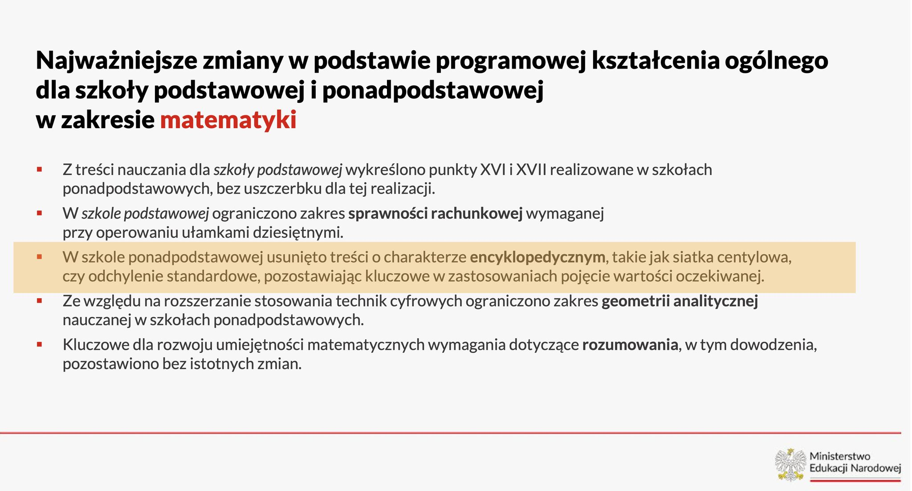

### 2024

<br><br>

<br><br>

<video width="640" height="480" controls>
<source src="./movies/february/nato-na-wojne.mp4" type="video/mp4">
Your browser does not support the video tag.
</video>

- NATO idzie na wojnę z Rosją na terenie Ukrainy. A my będziemy nowym frontem...

---

❎ Algorithmic nightmares in 2024 and beyond ❎

<br><br>

In October 1941, most members of the German General Staff realized that the war against the Soviet Union, and thus the Second World War, was lost.

Shortly afterwards, the SS in the Reich Ministry of Economics began planning for the period after the total collapse.

By the end of 1941, 200,000 German soldiers were reported dead on the Eastern but the completely hopeless war against communist Soviet Union continued until May 1945 and cost the Wehrmacht a further 3.5 million casualties in the East (still a fraction of the losses of soldiers and civilians suffered by other countries).

The question here is, why did the Germans continue to fight, even though the defeat had long been clear?

The answer is: the hierarchical order in their system, which kept running like a gigantic algorithm that methodically and unemotionally implemented the user's specifications like modern artificial intelligence.

A bureaucracy purged of democratic opposition and thus brought into line carried out the Nazi regime's orders to the end, because self-preservation was only possible if the regime, with which it was inevitably linked, survived.

But it wasn't just algoritmic terror that took the place of commitment to persuade German soldiers to keep fighting.

A well-known German General was asked after the war why he fought to the end, and he replied that it was pointless to tell a drowning man to stop swimming.

This is the power of a totalitarian meta-algorithm on the subconscious.

But as history shows, every war ends at some point even for totalitarian regimes, and then it becomes necessary to cooperate with the former enemy for the good of the state.

For this reason, hierarchies then resorts to the application of diplomatic rules.

This is necessary because the alternative to hierarchy is anarchy, which is not compatible with our current level of civilization.

Civilization is important, because it is itself a powerful problem-solving algorithm that increases the likelihood of a people's survival.

```text
This is a profound very short diatribe on the mechanism with which States are run.
In the Boxers rebellion in 1901,while the eight nation alliance troops were inexorably advancing to Peking ,the Mandarin advisors of the Qing Dynasty were discussing in front of of the Empress what kind of torturers would they impose on those troops.
As Dietmar perceptively observes ,the reason is not that the Mandarins were fools ,they were very well informed on the inevitability of their defeat ,but it was their only way to survive within the system.
The same applies to Democracies ,only less so, because there also,strongly embedded groups ,the weight of the files and hence the inertia generated by them ,demand great Statesmen to be overcome.
The present Leaderships of the European States is a case in point.
```

---

<video width="640" height="480" controls>
<source src="./movies/february/more-death.mp4" type="video/mp4">
Your browser does not support the video tag.
</video>

---

<br><br>

---

### 2023

<br><br>

---

<br><br>

---

### 2022

> US official: Russian invasion of Ukraine risks release of dangerous pathogens

Możliwe, że USA rozwija patogeny na Ukrainie w Odessie i teraz amerykanie boją się, że rosjanie przejmą te laboratoria.

### 2016

> Cari fratelli massoni

### 2014

> "There is no national security without cybersecurity, and there is no modernization without informatization" - President Xi Jinping

### 1987

Prawdopodobnie zamordowany: https://pl.wikipedia.org/wiki/Franciszek_Blachnicki

### 1945

Nad Odrą żołnierze 6. Warszawskiego Batalionu Pontowo-Mostowego wbili pierwszy polski słup graniczny na nowej granicy polsko-niemieckiej.
Aktu tego dokonali ppor. Władysław Cieślak, chor. Stefan Kobek, plut. Zenobiusz Janicki i plut. Henryk Kalinowski, a słup wyciosał cieśla z Wołynia– kpr. Adolf Wydrzyński.. Słup graniczny był biało-czerwony z wizerunkiem Orła Białego z napisem „Polska”. Pod słupem zakopali butelkę z dokumentem, pod którym się podpisali:
„Oddział Wojska Polskiego pomagając Armii Czerwonej w rozgromieniu wroga hitlerowskich Niemiec walczył za Polskę niepodległą i demokratyczną. Na brzegu Odry zginęli niżej wymienieni podoficerowie: sierż. Majchrzak Mieczysław, plut. Fijałkowski Mieczysław, kpr. Wydrzyński Adolf, st. saper Chemus Stanisław, st. saper Woźniak Władysław, st. saper Habrych Zygmunt, szeregowcy: Pietrzyk Feliks, Rumyński Władysław, Dorożko Jan, Kolęda Stanisław. Zginęli na polu chwały. Cześć ich pamięci. 30 żołnierzy zostało rannych”.

<br><br>

### 1664

Za zdradę rozstrzelany zostaje Iwan Bohun, pułkownik kozacki. Był pierwowzorem Bohuna z "Ogniem i Mieczem". Tworząc bohaterów Sienkiewicz sięgał do źródeł z epoki. Wybierał postacie autentyczne, ale raczej z drugiego szeregu. W ten sposób mógł kształtować ich powieściowe losy.
"Odwaga lwa,chytrość węża, przebiegłość lisa i lekkomyślność wichru drgały w każdej jego żyle .Wolność, step, wojna były jego żywiołem"
W następnych wojnach częstokroć wypływało jego nazwisko między nazwiskami najsłynniejszych wodzów kozackich. Postrzał z jakiejś mściwej ręki dosięgnął go w kilka lat później, lecz i wówczas nie przyszedł na niego kres ostatni. Po śmierci księcia Wiśniowieckiego, który z trudów wojennych umarł, gdy państwo łubniańskie odpadło od ciała Rzeczypospolitej, Bohun zawładnął większą częścią jego obszarów. (…) Mówiono także, że uśmiech nie postał nigdy na ustach tego szczególnego człowieka. Żył nie w Łubniach, ale w wiosce, którą z popiołów odbudował i która zwała się Rozłogi. Tam też podobno umarł”. Tak w epilogu „Ogniem i mieczem” Henryk Sienkiewicz opisuje ostatnie lata życia Bohuna. Taka była jego literacka wizja.
Bohun zmienia front:
W rzeczywistości Bohun zakończył życie w zupełnie innych okolicznościach. Istniał bowiem historyczny pułkownik kozacki Iwan Bohun (a nie Jurko, jak u Sienkiewicza), jedna ze znaczących postaci powstania Chmielnickiego, dowódca, który wielokrotnie wyróżnił się w walce.
Jego młodość tonie w mrokach tajemnicy, na arenie historii pojawił się dopiero podczas kozackiej rebelii i szybko zdobył sławę. Podczas oblężenia Zbaraża wdarł się na mury twierdzy i choć został odparty przez obrońców, to za swoje męstwo zyskał uznanie Kozaków i samego Chmielnickiego. Pod Beresteczkiem wyprowadził z klęski resztę pobitych sił kozackich, a pod Batohem przyczynił się do zwycięstwa, dowodząc szarżą konnicy, która przełamała polskie linie.
Gdy w 1654 r. na mocy ugody perejasławskiej Ukraina została poddana carowi rosyjskiemu, Bohun głośno zaprotestował. Wysłał list do hetmana Stanisława Potockiego, w którym zadeklarował chęć przejścia na stronę polską. W odpowiedzi szybko zaproponowano mu godność hetmana Ukrainy, tytuł szlachecki i jedno z kresowych starostw.
Przeciągnięcie na swoją stronę popularnego pułkownika kozackiego byłoby znacznym sukcesem i mogłoby zostać wykorzystane propagandowo przez Polaków. Niestety, Bohun nagle zmienił zdanie i wrócił do swoich, ujawniając polskie próby pozyskania go.
Potem bronił Monasterzysk i Bracławia przed siłami polskimi. Co jakiś czas zmieniał front, raz popierając sojusz Ukrainy z Rosją, drugi raz opowiadając się po stronie Rzeczypospolitej.
Prawdopodobnie kolejna taka zdrada sprawiła, że został pozbawiony tytułu pułkownika i uwięziony na zamku w… Malborku. Wyszedł stamtąd w 1663 r. i uczestniczył - znów po stronie polskiej - w kolejnych walkach na Ukrainie.
Podczas tej kampanii wojska Rzeczypospolitej i sprzymierzonych z nimi Kozaków spotykały dziwne i nie zawsze uzasadnione przeszkody. Czasem proste zadania okazywały się z jakichś powodów niemożliwe do wykonania.
Zaczęto w tym szukać ręki ludzkiej, a wtedy okazało się, że Iwan Bohun donosi Rosjanom o ruchach strony polskiej. Szybko zebrał się sąd wojenny, który wydał wyrok: kara śmierci. Zostaje rozstrzelany w obozie polskim pod Nowogrodem Siewierskim.

<br><br>

---

### 1434

W Grodnie wielki książe litewski Zygmunt Kiejstutowicz odnowił zapisy wydanego w 1401 roku przez poprzedniego wielkiego księcia litewskiego Witolda Kiejstutowicza dokumentu, w którym zatwierdzono zwierzchnictwo Władysława Jagiełły i Korony nad Litwą. Dokument ten potwierdzał też przejęcie ziem litewskich przez Królestwo Polskie. Zapisano w nim również klauzulę,która mówiła, że w przypadku bezpotomnej śmierci króla Władysława Jagiełły następcę tronu wybiorą bojarzy litewscy razem z polskimi panami. Dokument ten zatwierdziła następnie w Radomiu rada koronna. Nazwano go Układem Wileńsko- Radomskim.

<br><br>

---

<a href="https://github.com/TomaszWaszczyk/historia.waszczyk.com/edit/master/src/content/february-27.md" target="_blank">Edytuj tę stronę dzieląc się własnymi notatkami!</a>
