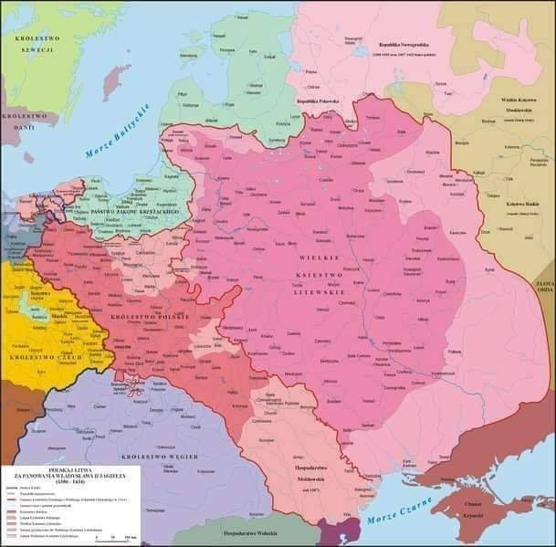

### 1945

Nad Odrą żołnierze 6. Warszawskiego Batalionu Pontowo-Mostowego wbili pierwszy polski słup graniczny na nowej granicy polsko-niemieckiej.
Aktu tego dokonali ppor. Władysław Cieślak, chor. Stefan Kobek, plut. Zenobiusz Janicki i plut. Henryk Kalinowski, a słup wyciosał cieśla z Wołynia– kpr. Adolf Wydrzyński.. Słup graniczny był biało-czerwony z wizerunkiem Orła Białego z napisem „Polska”. Pod słupem zakopali butelkę z dokumentem, pod którym się podpisali:
„Oddział Wojska Polskiego pomagając Armii Czerwonej w rozgromieniu wroga hitlerowskich Niemiec walczył za Polskę niepodległą i demokratyczną. Na brzegu Odry zginęli niżej wymienieni podoficerowie: sierż. Majchrzak Mieczysław, plut. Fijałkowski Mieczysław, kpr. Wydrzyński Adolf, st. saper Chemus Stanisław, st. saper Woźniak Władysław, st. saper Habrych Zygmunt, szeregowcy: Pietrzyk Feliks, Rumyński Władysław, Dorożko Jan, Kolęda Stanisław. Zginęli na polu chwały. Cześć ich pamięci. 30 żołnierzy zostało rannych”.

  

---

### 1434

W Grodnie wielki książe litewski Zygmunt Kiejstutowicz odnowił zapisy wydanego w 1401 roku przez poprzedniego wielkiego księcia litewskiego Witolda Kiejstutowicza dokumentu, w którym zatwierdzono zwierzchnictwo Władysława Jagiełły i Korony nad Litwą. Dokument ten potwierdzał też przejęcie ziem litewskich przez Królestwo Polskie. Zapisano w nim również klauzulę,która mówiła, że w przypadku bezpotomnej śmierci króla Władysława Jagiełły następcę tronu wybiorą bojarzy litewscy razem z polskimi panami. Dokument ten zatwierdziła następnie w Radomiu rada koronna. Nazwano go Układem Wileńsko- Radomskim.

  

---

<a href="https://github.com/TomaszWaszczyk/historia.waszczyk.com/edit/master/src/content/february-27.md" target="_blank">Edytuj tę stronę dzieląc się własnymi notatkami!</a>
