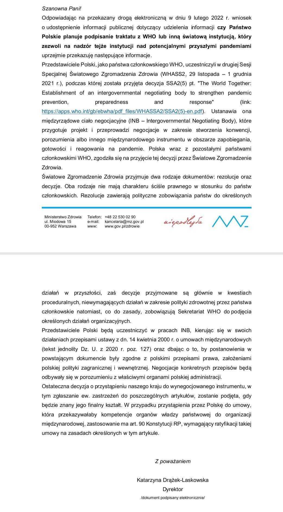
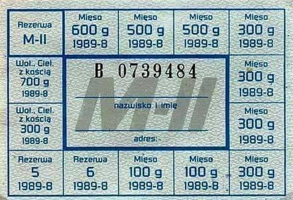
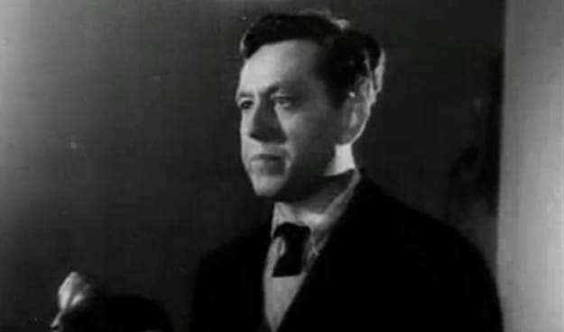
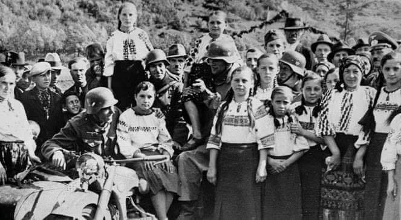
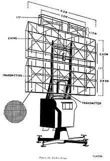
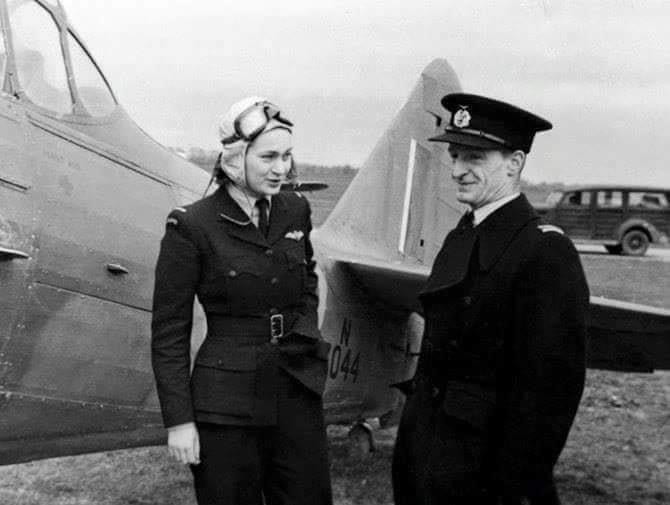

### 2022

Zgodnie z oczekiwaniami dziś w Rosji mamy do czynienia z dramatycznym spadkiem wartości #RUB, po ogłoszeniu w weekend sankcji wyłączających rosyjskie banki z systemu SWIFT i zamrożeniu zagranicznych aktywów centralnego banku Rosji.

Już wcześnie rano - przed otwarciem oficjalnego rynku kurs spadł o blisko 30% a przed bankami tworzą się duże kolejki. Bank Rosji przesunął otwarcie notowań forex na 10.00 a notowań giełdy rosyjskiej na 15.00 lub później.

Z dużym prawdopodobieństwem zakończy się to ograniczeniem lub wstrzymaniem wypłat gotówki i brakiem możliwości wypłaty walut obcych.

---

  

---

  

---

### 1981

Władze wprowadziły reglamentacyjną sprzedaż mięsa i wędlin czyli tzw. system kartkowy. Miesięczny przydział wynosił 2,5 kilograma dla pracownika umysłowego i 4 kilogramy dla pracownika fizycznego. Natomiast dodatkowym atrybutem ekspedientek w sklepach mięsnych oprócz noża i tasaka były nożyczki.

  

### 1952

> Kto należy do narodu polskiego, musi zniknąć. Najzaszczytniejszym dla nas zadaniem jest uczynienie wszystkiego, aby każdy przejaw polskości zginął bez reszty

> Musimy tych zawszonych Polaków wytępić począwszy od kołyski (…) w ręce wasze oddaję los Polaków, możecie z nimi robić, co chcecie!

Autorem tych cytatów jest Albert Forster (zdjęcie) niemiecki zbrodniarz wojenny, gauleiter gdańskiego NSDAP, stracony na mocy wyroku Najwyższego Trybunału Narodowego, stracony w areszczie na Mokotowie 28 lutego 1952 roku.
Był odpowiedzialny między innymi za barbarzyńskie mordy na Polakach w Piaśnicy, gdzie Niemcy zabili nawet 14 tysięcy osób. Wiele z nich zakopano żywcem w zbiorowych mogiłach w lesie. Dzieci mordowano rozbijając im głowy o drzewa.

  

### 1945

Krajowa Rada Narodowa wydała " Dekret o wyłączeniu ze społeczeństwa wrogich elementów". Chodziło w nim głównie o volksdeutchów. Karą za zdradę miało być umieszczenie w obozie pracy i konfiskata majątku.
Dekret głosił, że: "obywatele Państwa Polskiego, wpisani po dniu 31 sierpnia 1939 na obszarach Rzeczypospolitej Polskiej, wcielonych przemocą przez okupanta do Rzeszy Niemieckiej oraz na obszarze byłego Wolnego Miasta Gdańska do trzeciej lub czwartej grupy niemieckiej listy narodowej (Deutsche Volksliste) lub do grupy tzw. "Leistungs-Pole” posiadają pełnię praw obywatelskich, jeżeli wciągnięci zostali na tę listę wbrew swojej woli lub pod przymusem, a swoim zachowaniem się wykazali polską odrębność narodową".
Dekret nie wszedł jednak w życie, a zastąpiła go ustawa z 6 maja 1945 roku, która miała na celu odizolowanie ich, a także dopuszczała możliwość rehabilitacji tych obywateli polskich, którzy wbrew własnej woli otrzymali obywatelstwo niemieckie.

  

### 1943

W fabryce Norsk Hydro w Vemork w okupowanej przez Niemców Norwegii grupa norweskich komandosów zniszczyła urządzenia do produkcji ciężkiej wody, potrzebnej III Rzeszy do prac nad bronią atomową. Akcja ta była częścią tzw. bitwy o ciężką wodę.

„Ronneberg (dowódca akcji) podpalił lonty, Kayser policzył do 10 i kazał dwóm strażnikom uciekać na górę, ile sił w nogach. Zaraz potem sabotażyści wybiegli na dwór przez stalowe drzwi piwnicy. Zdążyli przebiec nie więcej niż 20 metrów, gdy rozległ się głuchy huk eksplozji. Hałas maszyn i grube betonowe mury stłumiły go do tego stopnia, że członkowie grupy osłaniającej zastanawiali się, czy ich koledzy właściwie założyli ładunki. Ronneberg jednak poznał po odgłosie wybuchu, że cylindry zostały zniszczone i 1000 litrów ciężkiej wody – mniej więcej 4-5 miesięczna produkcja – ścieka do rur kanalizacyjnych” – tak szczegóły akcji sabotażowej w zakładach Norsk Hydro opisuje Ray Mears w książce „Bitwa o ciężką wodę”.

Tytułowa bitwa to szereg operacji alianckich przeprowadzonych w latach 1942-1943 w celu zniszczenia znajdującej się w rękach Niemców norweskiej fabryki Norsk Hydro w Vemork (rejon Telemarku) – jedynych na świecie zakładów produkujących ciężką wodę(tlenek deuteru).

Produkcja substancji pochodzącej ze związku ciężkiego izotopu wodoru (deuteru) z tlenem miała posłużyć Niemcom do konstrukcji nowej broni masowego rażenia – broni atomowej. „Tlenek deuteru (…) jest znakomitym +spowalniaczem+, dzięki któremu procesy chemiczne i biologiczne zachodzą znacznie wolniej niż w zwykłej wodzie. Spowolnienie neutronów powstających w wyniku rozszczepienia jąder atomowych pozwala na przeprowadzenie kontrolowanej reakcji łańcuchowej i zbudowanie reaktora jądrowego” – wyjaśnia Mears. Jak dodaje, „w takiej bombie reakcja łańcuchowa zachodzi w sposób niekontrolowany, a w jej trakcie wyzwala się energia dziesiątki tysięcy razy większa niż podczas wybuchu zwykłej bomby”.

Niemcy usiłowali zdobyć ciężką wodę już po ataku na Francję 10 maja 1940 r., gdzie w tajemnicy przed nazistami przewieziono zbiorniki z tą substancją. Jednak dzięki francuskiemu fizykowi Fredericowi Joliot-Curie zapasy ciężkiej wody udało się bezpiecznie wywieźć do Wielkiej Brytanii.

Miesiąc później, z chwilą całkowitego opanowania przez Niemcy Norwegii, w ich posiadanie weszła fabryka Norsk Hydro. Rozpoczęła się produkcja ciężkiej wody do celów atomowych - pod koniec 1941 r. wynosiła ona 4 tys. litrów na rok.

Po zajęciu przez Hitlera strategicznie ważnej Norwegii, jednym z celów alianckich służb specjalnych stało się zniszczenie dotychczasowych zapasów ciężkiej wody. Od kwietnia 1942 r. Kierownictwo Operacji Specjalnych (SOE) rozpoczęło przygotowania do opanowania Norsk Hydro. Na aliantów czekało jednak trudne zadanie logistyczne. „Fabryka stała w głębi kraju, 250 kilometrów od Oslo i równie daleko od najbliższego wybrzeża, dotrzeć do niej można więc było jedynie drogą powietrzną. Budynki zakładów, do których prowadziła tylko jedna szosa, stały w wąskiej dolinie, w połowie stromej ściany skalnej. Powyżej doliny zaś rozciągał się płaskowyż Hardangervidda, znany z niegościnnego terenu i surowego klimatu” – tłumaczy Mears.

Zbombardowanie fabryki groziłoby śmiercią sporej liczby cywilów, na co nie godził się norweski rząd na emigracji. Ostatecznie szefostwo SOE zdecydowało się na opanowanie Norsk Hydro poprzez akcję sabotażową przeprowadzoną przez specjalnie wyszkolonych komandosów.

Jednym z głównych autorów planu ataku – oprócz m.in. szefa sekcji norweskiej SOE ppłk. Jacka Wilsona – był prof. Leif Tronstad, były dyrektor zakładów Norsk Hydro, oficer armii norweskiej. Tronstad znał dobrze swego następcę w fabryce, dr. Jomara Bruna. Ten na bieżąco starał się informować aliantów o postępach Niemców w produkcji ciężkiej wody.

Podobne zadanie alianci postawili przed Einarem Skinnardlandem, norweskim agentem SOE zatrudnionym w Norsk Hydro. Przerzucono go do okupowanej Norwegii na spadochronie pod koniec marca 1942 r. Według jego doniesień, w miasteczku Rjukan nieopodal Vemork stacjonowało ok. 100 Niemców.

18 października 1942 r., w ramach akcji „Grouse”, alianci przerzucili do Norwegii czterech przeszkolonych, wyposażonych w fałszywe dokumenty Norwegów: Jensa Antona Poulssona (dowódca), Knuta Hauglanda, Clausa Helberga i Arne Kjelstrupa. Ich celem było przygotowanie gruntu pod przyszły aliancki desant. Służyć temu miało m.in. uruchomienie radiostacji oraz zorganizowanie punktu odbioru zrzutów broni.

Pierwsza operacja aliancka (kryptonim „Freshman”) przeprowadzona 19 listopada 1942 r. przez aliantów zakończyła się jednak niepowodzeniem. Brytyjskie szybowce rozbiły się, a ci, którzy ocaleli z katastrofy, zostali zabici przez Niemców. „Operacja +Freshman+ była nie tylko tragedią ludzką, ale także strategiczną klęską. Zginęło 34 doborowych żołnierzy (brytyjskich saperów – PAP), a Niemcy, odkrywszy cel misji Brytyjczyków, wzmocnili jeszcze system ochrony Norsk Hydro” – podkreśla Mears.

Do planów zniszczenia zapasów ciężkiej wody alianci powrócili w styczniu 1943 r. (operacja „Gunnerside”). 16 lutego na norweskiej ziemi stanęło sześciu komandosów: Knut Haukelid, Kasper Idland, Fredrik Kayser, Hans Storhaug, Birger Stromsheim oraz dowodzący grupą Joachim Ronneberg. Przed zrzutem uczestników akcji przeszkolono, uzbrojono oraz wyposażono w narty i inny niezbędny sprzęt do poruszania się w górskim terenie. Norwegowie nosili brytyjskie mundury, co – w przypadku aresztowań – miało zwiększyć prawdopodobieństwo uniknięcia śmierci z rąk Niemców.

Sześciu komandosów wraz z wcześniej przerzuconymi do okupowanego kraju czterema innymi żołnierzami przedostało się do zakładów Norsk Hydro 28 lutego. Tam zniszczyli urządzenia (elektrolizery) służące do produkcji ciężkiej wody, co spowodowało utratę przez Niemców tony dotychczasowych zapasów substancji. Akcja sabotażowa zaskoczyła ich do tego stopnia, że nie byli przygotowani na wymianę ognia.

Natychmiast po wysadzeniu części fabryki, komandosi ukryli się w trudno dostępnych górskich rejonach. „Było to cudowne uczucie, bo od wielu miesięcy całe nasze życie obracało się wokół tej misji (…). Niemcy byli niedaleko w dolinie, ale nie obawialiśmy się ich. Od tej pory musieliśmy walczyć już tylko z norweską przyrodą” – wspominał dowódca akcji Ronneberg.

Część komandosów uciekła na nartach do Szwecji (do granicy mieli 400 km), inni zostali na miejscu celem obserwacji poczynań Niemców, jeszcze inni udali się do Oslo, gdzie zamierzali kontynuować antyniemiecką działalność sabotażową. Wszyscy biorący udział w ataku na Norsk Hydro przeżyli wojnę.

Udany sabotaż w fabryce nie spowodował jednak, że Niemcy odstąpili od planów produkcji broni jądrowej przy pomocy ciężkiej wody. W ciągu dwóch miesięcy produkcja w Norsk Hydro została wznowiona. W tej sytuacji, 16 listopada 1943 r. alianckie dowództwo zdecydowało się zbombardować fabrykę. Nalotu dokonały amerykańskie samoloty.

Choć dobrze zabezpieczone zapasy ciężkiej wody wyprodukowane do tej pory przez Niemców (16 ton) przetrwały, Hitler zdecydował się przenieść dalszą produkcję tej substancji do Niemiec. Plany te nie zostały zrealizowane. 20 lutego 1944 r. przewożący zapasy ciężkiej wody prom SF „Hydro” został zatopiony przez norweskich komandosów na jeziorze Tinnsjo.

### 1942

Front zachodni: w nocy 27 na 28 lutego brytyjscy komandosi dokonali rajdu na Bruneval we Francji, zdobywając części niemieckiego radaru obrony przeciwlotniczej.

W latach 1940-41 Brytyjczycy próbowali odpowiedzieć na bombardowania prowadzone przez Luftwaffe swoimi atakami na cele w Niemczech. Niestety wyprawy bombowe ponosiły niewspółmierne do osiąganych efektów straty. Nowy wywiad naukowy doszedł do wniosku, że winny jest, być może doskonalszy od brytyjskiego, niemiecki system radarowy.

Najlepszym sposobem zorientowania się w niemieckich osiągnięciach wydawało się zdobycie istotnych części takiego radaru. Najbliższy był na klifie pod wsią Bruneval, niedaleko Hawru na wybrzeżu Francji. Naukowcy wskazali cel lordowi Mountbatten, szefowi Dowództwa Operacji Połączonych, który z kolei, nie widząc możliwości bezpośredniego ataku z morza, zwrócił się do nowych wojsk, do 1. Dywizji Powietrznodesantowej. Do wykonania zadania wybrano kompanię C z 2. brygady dowodzoną przez majora Johna Frosta (tak tego Johna Frosta spod Arnhem).

W akcji wzięli również lotnicy z 51 dywizjonu RAF, którzy swoimi Whitleyami podrzucili spadochroniarzy nad Bruneval, komandosi z 12. komanda obsadzający 6 barek LCA, które ewakuowały spadochroniarzy z plaży i którzy zapewnili osłonę podczas odwrotu, jednostki Marynarki Królewskiej oraz najważniejszy człowiek w całej wyprawie sierżant Cox, podoficer RAF, specjalista od radiotechniki, do którego zadań należało rozmontowanie części radaru.

W największym skrócie operacja wyglądała tak: kompania Frosta, w kilku grupach, wylądowała szczęśliwie niezauważona na wybrzeżu Francji. W krótkim boju zajęła willę mieszczącą stację radarową i odpierała kontrataki niemieckie umożliwiając zdemontowanie istotnych części radaru. Później próbowano wycofać się na plaże, co uniemożliwiło niemieckie umocnione gniazdo karabinów maszynowych. Spadochroniarze cofnęli się do wilii, znowu ją odbijając z rąk niemieckich i poczekali aż kolejny oddział zniszczył gniazdo km. Znów zeszli na plażę i korzystając z osłony komandosów, opuścili niegościnne, acz szczęśliwe dla nich, wybrzeże francuskie, realizując założone cele przy minimalnych stratach (2 zabitych, 6 zaginionych).

Operacja skończyła się ogromnym sukcesem. Po pierwsze, dzięki przywiezionym częściom, poznano szczegóły radaru Würzburg, po drugie pokazano skuteczność jednostek powietrznodesantowych, co pozwoliło na zdwojenie działań przy ich dalszym rozbudowywaniu. Po trzecie brytyjskiej propagandzie potrzebny był taki spektakularny sukces.

  

### 1920

W Warszawie przyszła na świat druga córka Józefa Piłsudskiego-Jadwiga (zdjęcie).
Z wykształcenia była magistrem inżynierem architektem,ale zasłynęła też jako porucznkik pilot Wojska Polskiego.
W 1937 roku po ukończeniu kursu w Sokolej Górze koło Krzemieńca rozpoczęła loty na szybowcach. Najdłuższy przelot wykonała na szybowcu typu "Delfin". Dwa lata pózniej po uzyskaniu wszystkich kategorii szybowcowych rozpoczęła wykonywanie lotów wyczynowych.
Okupacja zastała ją, jej siostrę Wandę i jej matkę Aleksandrę Szczerbińską w Wilnie skąd po radzieckiej agresji uciekły do Kowna,z którego zostały ewakuowane przez Łotwę i Szwecję do Anglii. Tam podjęła studia na Uniwersytecie Cambrige.
W 1942 roku została przyjęta do Pomocniczej Lotniczej Służby Kobiet. Była jedną z wielu Polek służących w tej formacji. Jej ulubionym samolotem był Spitfire, chociaż latała też na innych maszynach, takich jak: Taylocraft Auster czy Fairey Barracuda.
W czasie swojej służby nie miała żadnego
wypadku, a jej przełożeni w opinii wydanej w
listopadzie 1943 r. ocenili ją jako niezwykle
obiecującą pilotkę o umiejętnościach powyżej
przeciętnej. Za swoją służbę została
odznaczona Brązowym Krzyżem Zasługi z
Mieczami. W 1944 r. wyszła za kpt. Andrzeja
Jaraczewskiego, oficera Marynarki Wojennej. Po wojnie przebywała w Anglii na emigracji.
Pracowała tam jako architekt, a także prowadziła z mężem firmę.
W 1990 roku wróciła do Polski i zamieszkała w Warszawie. Zajęła się pracą społeczną w stworzonej przez siebie Fundacji Rodziny Piłsudskich.
W dniu swych urodzin, 28 lutego 2008 r. została odznaczona przez Prezydenta RP Lecha Kaczyńskiego Krzyżem Komandorskim Orderu Odrodzenia Polski.
Zmarła 16 listopada 2014 roku.

  

### 1621

Wojna trzydziestoletnia: został podpisany tzw. akord drezdeński – ugoda między cesarzem Ferdynandem II Habsburgiem a stanami śląskimi.

Śląsk, mimo że uczestniczył w wojnie trzydziestoletniej jedynie do 1621 roku, należał do najbardziej poszkodowanych w tym konflikcie krajów.

Najbardziej krwawą, okrutną i wyniszczająca wojną w dziejach Europy była wojna trzydziestoletnia, trwająca od 23 maja 1618 do 24 października 1648 roku. Objęła swoim zasięgiem prawie całą Europę, od Siedmiogrodu (dzisiejsza Rumunia) po Hiszpanię i od Bałkanów po Szwecję.

Śląsk, mimo, że formalnie uczestniczył w tej wojnie jedynie do 1621 roku, należał do najbardziej poszkodowanych w tym konflikcie krajów. Polska, która nie była bezpośrednim uczestnikiem tej wojny, w swojej historiografii traktuje ją marginalnie, opisując ją niesłusznie jedynie jako zachodnioeuropejską wojnę religijną.

Strąceni na kupę gnoju:

Początek XVII wieku to w Koronie Czeskiej czas władzy schorowanego Rudolfa II Habsburga, a jednocześnie okres politycznych zabiegów Stanów Śląskich o sięgnięcie po supremację w Koronie. Uzyskany List Majestatyczny (20 sierpnia1609 roku) gwarantował z jednej strony swobodę religijną, z drugiej wykluczał biskupa wrocławskiego z pełnienia urzędu śląskiego starosty generalnego (mógł nim być jedynie świecki książę śląski). W 1611 roku Stany Śląskie wykorzystały konflikt w rodzinie Habsburgów i wymusiły zgodę na utworzenie osobnej Kancelarii Śląsko-Łużyckiej, zlikwidowanej jednak 5 lat później. W ówczesnych realiach funkcja starosty generalnego odpowiadała mniej więcej dzisiejszemu prezydentowi, a kancelaria kraju – rządowi. Wybór na następcę cesarza ultrakatolickiego arcyksięcia Ferdynanda ze styryjskiej linii Habsburgów oraz układ z Onate, dający hiszpańskiej linii Habsburgów prawo sukcesyjne w Koronie Czeskiej i na Węgrzech, spowodował bunt Czechów – tzw. defenestrację praską: strącenie namiestników cesarskich z okien hradczańskiego zamku na kupę gnoju – co stanowiło bezpośrednią przyczynę wojny, która szybko rozlała się na całą Europę, by w długotrwałym i krwawym konflikcie zlikwidować pozostałości wywodzących się jeszcze ze średniowiecza stosunków, sojuszy i zależności. Mimo religijnych powodów konfliktu, u jego podłoża tkwił zamiar wzmocnienia stanowo-federalistycznego modelu Korony Czeskiej. Istotą miało być to, aby pod jednym królem gwarantującym jedność Korony Czeskiej, właściwą władzę przesunąć w ręce Stanów. Stany krajów (Czech, Śląska, Moraw i Łużyc) miały być samodzielne, miały mieć równe prawa oraz uczestniczyć w wyborze króla. Wbrew religijnemu zaczynowi, religijnej propagandzie i religijnym uzasadnieniem działań militarnych, sojusze, zyski i straty w tej wojnie przebiegały w poprzek wyznań. Największą polityczną stratę w wyniku wojny poniosła ultrakatolicka Hiszpania, a najbardziej politycznie zyskała ultrakatolicka Francja. Wśród protestantów najbardziej straciła będąca wcześniej lokalnym mocarstwem Korona Czeska, w tym same Czechy, Stany Śląskie i Łużyce. Na mocarstwo europejskiego formatu wyrosła protestancka Szwecja. Formalnie protestanckimi wojskami duńskimi dowodził gorliwy katolik Ernst von Mansfeld, który ścierał się m. in. z pozostającymi pod katolickim dowództwem prawosławnymi Kozakami...

Bunt praski i obrona Śląska:

Nie ma kompleksowych prac opisujących wojnę 30- letnią na Śląsku. Zarówno polscy, jak i niemieccy historycy, jak do tej pory traktowali ten temat po macoszemu. Znajdujemy jedynie w obu językach prace omawiające wybrane, wąskie tematy lub sprowadzające się jedynie do problemów bardzo lokalnych, konkretnych miast czy posiadłości.

Rozruchy wywołane buntem praskim doprowadziły do powstania konfederacji Czech, Stanów Śląskich, Moraw, Łużyc, Dolnej i Górnej Austrii. Stany Śląskie ze względu na długość zewnętrznych granic znalazły się w bardzo trudnym położeniu. Formowane jednostki militarne jedynie w części skierowano do bezpośrednich walk z wojskami cesarskimi – 2 tysiące piechoty i 1160 jazdy (rok później dosłano następnych 600 konnych i 1 tysiąc piechoty) – większość przeznaczono do obrony granic kraju. Obronę Śląska sformowano na podstawie ordynacji obrony krajowej, dzieląc cały obszar na cztery regiony obronne. Z korespondencji wewnętrznej wiemy, że oddziały wojskowe rozmieszczono w miarę równomiernie wzdłuż granicy z Polską, od księstwa cieszyńskiego poczynając, na zachodnich jej fragmentach z Wielkopolską kończąc. W czasie trwania wojny liczebność wojsk śląskich aż do praktycznie kończącej bezpośredni udział jako jednej ze stron bitwy pod Białą Górą, stale i systematycznie rosła, stanowiły je jednostki zarówno wybranieckie, śląskie, jak i zaciężne z innych krajów.

Słabo zaludniony, ale bogaty:

Sytuację ludnościowa Śląska u progu wojny możemy jedynie oszacować na podstawie spisu z 1578 roku. Spis ten wykazał bardzo nierównomierne zaludnienie Śląska. Od ludnych księstw opawskiego, karniowskiego, brzeskiego, nyskiego, wrocławskiego i świdnickiego (do 50 osób/km.kw) do księstw opolskiego i raciborskiego (jedynie okolo 18 osób/km.kw). Wyliczenia wskazują, że w 1619 roku na Śląsku (prawdopodobnie i w przybliżeniu) mieszkało nieco ponad 1.5 miliona osób. Potencjał finansowy Stanów Śląskich był wysoki i najprawdopodobniej w przeliczeniu na mieszkańca należał do najwyższych wśród wszystkich krajów biorących udział w wojnie. Obrona terytorialna kraju opierała się na istniejących twierdzach, jednak w ich rozmieszczeniu również były wielkie dysproporcje między różnymi częściami kraju. Obok potężnych i nowoczesnych twierdz Legnicy, Wrocławia i przede wszystkim Brzegu mieliśmy silne twierdze, których umocnienia pochodziły z XV i XVI wieku: Świdnica, Jawor, Jelenia Góra, Lwówek Śląski, w trakcie wojny wzmocniono także fortyfikacje Dzierżoniowa, Ziębic i Strzegomia. Stosunkowo silne umocnienia posiadało Opole i Opawa. Większość miast była słabo broniona pojedynczym murem obronnym (na przykład Racibórz, Wodzisław, Żory, Gliwice), a w najgorszej sytuacji były miasta otwarte (na przykład Rybnik).

Wszystkie armie Europy:

Klęska wojsk Konfederacji w bitwie po Białą Górą w dniu 8 listopada 1620 roku skłoniła Stany Śląskie do znalezienia kompromisowego porozumienia ze zwycięzcami. Był to tak zwany akord drezdeński – porozumienie cesarza Ferdynanda II ze Stanami Śląskimi, gwarantowane przez elektora saskiego i wielka kontrybucja finansowa zapłacona przez Śląsk z jednej, amnestia dla Ślązaków z drugiej strony. Akord szybko jednak okazał się fikcją. Śląsk formalnie nie będący stroną konfliktu przez następne kilkadziesiąt lat wciąż był areną walk, rabunków wojennych, wciąż nakładano nań kontrybucje wojenne.

W momencie wybuchu wojny Śląsk znalazł się na peryferiach działań wojennych, toczonych głównie w Austrii i Czechach, szybko jednak wraz z rozprzestrzenieniem się działań militarnych, stał się głównym korytarzem łączącym miejsca intensywnych walk: obszar brandenbursko-pomorski i cały zachodnio-europejski z kluczowym austriacko-węgiersko-siedmiogrodzkim. Głubczyce stały się kluczem do Bramy Morawskiej. Przez Śląsk maszerowały wszystkie praktycznie armie Europy. Mordując, paląc, rabując. Właśnie w tym późniejszym okresie na naszym terenie rozegrały się dwie wielkie bitwy wojny trzydziestoletniej. 11 października 1633 roku pod Ścinawą starły się zwycięskie wojska cesarskie (łącznie z kawalerią śląską) z oddziałami szwedzko – saskimi. W bitwie wzięło udział w sumie około 70 000 żołnierzy. Z kolei 13 maja 1634 roku Saksonia pokonała pod Legnicą wojska cesarskie.

Na granicy z Polską:

Długa granica z Polską, której król Zygmunt III Waza był naturalnym, konfesyjnym i rodzinnym sojusznikiem cesarza Ferdynanda II, była właściwie nie do obrony. Z tego powodu jeszcze przed przystąpieniem do Konfederacji antycesarskiej Stany Śląskie podjęły oficjalną i zakulisową ofensywę dyplomatyczną w Polsce, tym pilniejszą, że biskup wrocławski, Karol Styryjski (brat cesarza) nakłaniał w licznych pismach króla i możnowładców polskich do przystąpienia do wojny przeciwko Stanom Śląskim. W liście do prymasa Polski pisał m. in. (cytuję): " (...) na ostatnim sejmie wrocławskim postanowiono pogranicze polskie od Polski przegrodzić rowem i warowniami. (...) Upraszamy też abyś króla Zygmunta nakłaniać i napominać nie przestawał (...)"

Zygmunt III, po naradzie z kilku zaufanymi senatorami polskimi wysłał posła Zaleskiego do Stanów Śląskich we Wrocławiu, z pismem nakłaniającym do wyłamania się z Konfederacji. W odpowiedzi Stanów dostarczonej Zaleskiemu już następnego dnia czytamy m. in. : "Z listu (...) poznaliśmy uprzejmy umysł Waszej Królewskiej Mości i troskliwe staranie o dobro nie tylko sławnego królestwa czeskiego, ale też prowincji skonfederowanych, tudzież ojczyzny naszej, ukochanego Szląska. (...)" Dalej Stany dziękują za troskę, piszą o przyjaźni z Polską i dołożeniu wszelkiej staranności, aby nie naruszyć tych dobrych stosunków. Wyjaśniają powody buntu wskazując, iż to Ferdynand II naruszał wielokrotnie prawa krajowe, gwałcąc przede wszystkim przysługującą stanom Korony Czeskiej samowładzę.

Jednocześnie wysłany przez Zygmunta III do biskupa wrocławskiego, do Nysy, królewicz Władysław, zawiózł następujące propozycje polskiego udziału w wojnie po stronie cesarskiej: zaciąg 5000 lisowczyków do służby cesarskiej, 50 000 rejestrowych kozaków zaporoskich – mogą stawić się na Śląsku na początku sierpnia, książę Ostrogski i hetman Żółkiewski mieli też wysłać swoje prywatne armie – około 20 000 doświadczonych żołnierzy.

Misja Kochcickiego:

Tak wielka siła militarna mogła zdławić Konfederację w kilka tygodni, na szczęście większość senatorów polskich sprzeciwiła się przystąpieniu do wojny, w czym zasługa skutecznych zabiegów dyplomacji Stanów Śląskich, tradycyjnej antyhabsburskiej wrogości części polskich magnatów oraz zakulisowych działań prowadzonych w imieniu Stanów przez Starostę Górnośląskiego Andreasa Kochcickiego. Kochciccy byli potężnym górnośląskim rodem magnackim. Władali rozległymi dobrami Bytomia i Ujazdu, poprzez Lubliniec, Koszęcin i rodowe Kochcice, Turawę aż do Koźla i Białej. Ojciec Andreasa, Jan Kochcicki, oficjalnie radca Komory Śląskiej zarządzającej założoną na Śląsku w 1578 roku pocztą państwową, był jednocześnie twórcą i nadzorcą sieci dyplomatów reprezentujących cesarza Rudolfa II oraz finansowanej z kasy cesarza siatki szpiegowskiej w Polsce. Stał za wszystkimi zakulisowymi działaniami tzw. stronnictwa habsburskiego w Polsce, także w czasie elekcji królewskich. Z zachowanych dokumentów można wnioskować, że jedynie wyselekcjonowana część informacji szpiegowskich docierała do Rudolfa II, część zostawała tajemnicą Stanów Śląskich, przy czym wydaje się, że Jan Kochcicki jedynie unowocześnił i przyspieszył w oparciu o sieć pocztową przekazywanie informacji, sama siatka szpiegowska miała chyba dłuższą historię i była konieczna wobec trwającej od kilku stuleci dość wyrównanej wojny handlowej małego terytorialnie Śląska z potężną Polską (temat niewątpliwie wart osobnych, szczegółowych badań i analizy). Andreas Kochcicki nie tylko był bajecznie bogaty, ale i wszechstronnie wykształcony. Był również sponsorem wielu uczonych i szkół w swoich miastach. Był też pierwszym górnośląskim magnatem przemysłowym – w jego dobrach pracowały liczne huty zarządzane przez Walentego Roździeńskiego (autora pierwszego dzieła traktującego o górnictwie i hutnictwie). Po ojcu przejął też wszystkie kontakty w Polsce i pełną informację o możliwości oficjalnych i zakulisowych działań w Polsce. Praktycznie w momencie podjęcia przez Stany Śląskie decyzji o przystąpieniu do Konfederacji, skutecznie uaktywnił stare stronnictwo antyhabsburskie, jak i część dotychczasowych zwolenników monarchów wiedeńskich.

Dobra Kochcickiego zostały skonfiskowane przez zwycięskiego Ferdynanda II w 1628 roku, a ujęty Andreas zmarł w 1634 roku w więzieniu we Wiedniu, ocalała część rodziny ratowała się ucieczką do Saksonii i Polski.

---

<a href="https://github.com/TomaszWaszczyk/historia.waszczyk.com/edit/master/src/content/february-28.md" target="_blank">Edytuj tę stronę dzieląc się własnymi notatkami!</a>
