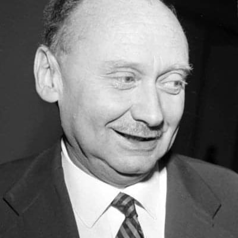
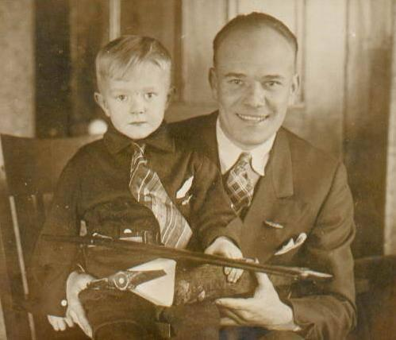
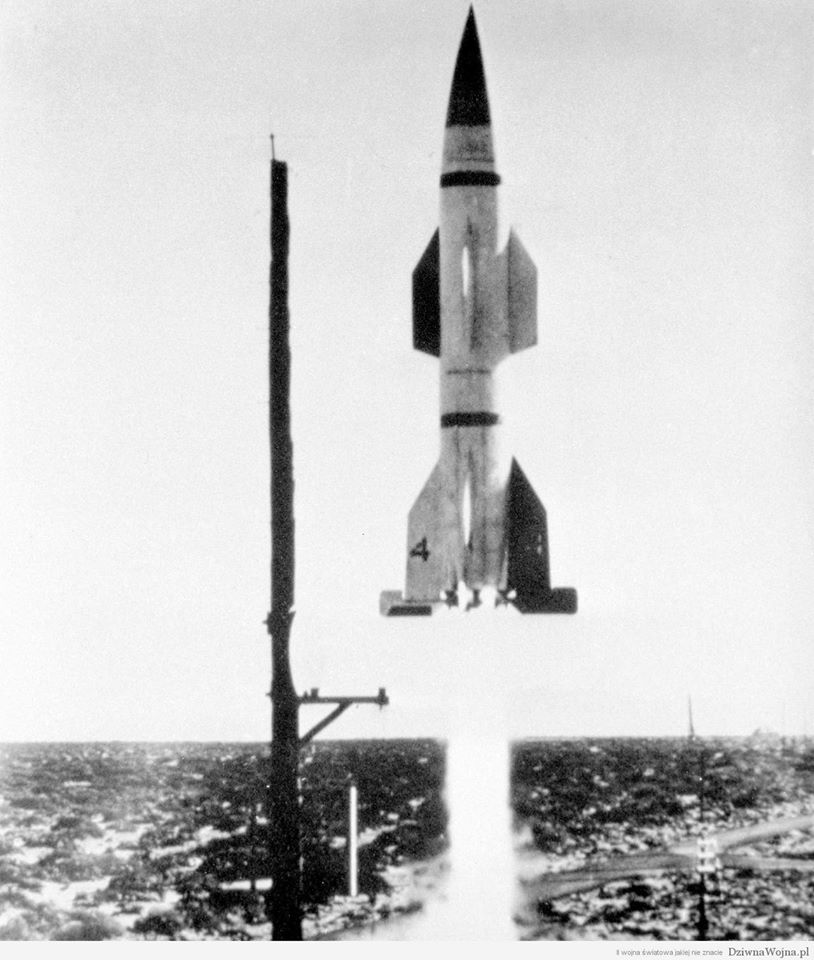
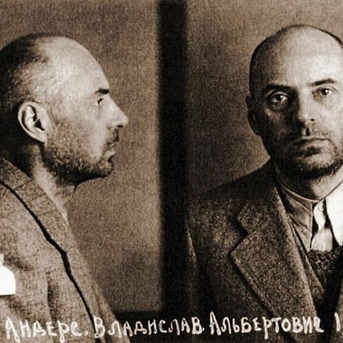

### 2024

```
„Russland, ein ständiges Mitglied dieses Sicherheitsrats, will, dass ein souveräner Staat sein Existenzrecht aufgibt.
Wo kämen wir hin, wenn sich dieses Prinzip durchsetzen würde?
Welches unserer Länder würde als Nächstes von einem ruchlosen Nachbarn überfallen?
Wessen Kinder würden als Nächstes verschleppt?
Wessen Söhne erschossen?
Wessen Töchter vergewaltigt?
Gäben wir nach, wäre dies das Ende der Charta, unserer Charta.“
-Außenministerin Annalena Baerbock im Sicherheitsrat der Vereinten Nationen anlässlich des Jahrestags des russischen Angriffskriegs gegen die Ukraine.
```

<video width="640" height="480" controls>
<source src="./movies/february/who-next.mp4" type="video/mp4">
Your browser does not support the video tag.
</video>

### 2022

Przykład bzdur mówionych w Polsce:

Tłumaczenie. K to ukraiński kierowca, Ż to rosyjscy żołnierze:

K: Zepsuło się, co chłopaki? Zepsuło?
Ż: Paliwa zabrakło...
K: Może was odholować? Z powrotem do Rosji.
Ż: (żołnierze się śmieją)
K: A wiecie gdzie jedziecie?
Ż: Nie. - Na was? - Ja nie.
K: Na Kijów nak*rwiacie
Ż: Na Kijów, cholera, j*bać to. A co w wiadomościach mówią?
K: Póki co wszystko idzie po naszej myśli. Wasi łatwo trafiają do niewoli, ponieważ też chłopaki nie wiedzą gdzie jadą. Całą kolumnę pytałem i nikt nie wie gdzie jadą.

Podjeżdża Ukrainiec do ruskiego oddziału. Brzmi jak początek kawału, który będzie rywalizować z tymi o wchodzeniu do baru.

Na TikToku gdzie do niedawna tańczyły dzieciaki, dziś można zobaczyć niefiltrowane relacje z pierwszej ręki. Okazuje się, że sowiecka szkoła dezinformacji działa gorzej, kiedy wszyscy wokół mają telefony z kamerami i dostępem do internetu.

W sieci udostępniane są kolejne materiały z wypowiedziami rosyjskich żołnierzy, którzy się poddali, albo zostali schwytani.

Wychodzi na to, że Putin okłamał zachód.

Swój naród.

Swoją armię.

Schwytani Rosjanie mówią o tym, że mieli jechać na ćwiczenia, niektórym dowództwo przekazało, że to Ukraina ich zaatakowała i ruszyli, aby się bronić.

Kłamstwa, filozofia Władimira Putina.

Jakie są ryzyka dla jego planu?

Rosjanie poznający prawdę. Bo kiedy poczują się na tyle pewnie, żeby odstąpić od kłamstw zagrażających ich zdrowiu i życiu, porzucają pozorowaną lojalność.

Taki pojazd opancerzony jak na filmie spala ponad 100 litrów paliwa na 100 km, czołg nawet 800 litrów. Wiele z nich nie tankowało od granicy. Brak cystern z Rosji. Logistyka tej wojny jest dramatyczna i już po kilkudziesięciu godzinach przypomina bardziej improwizację, niż egzekwowaną strategię. Jak inaczej można wyjaśnić ten chaos? To część planu?

Może rzeczywiście rosyjscy żołnierze, którzy domyślili się, że zostali wrobieni w wojnę, przehandlowali paliwo na wódkę z kiełbasą, mając później pretekst do wstrzymania działań i ocalenia życia w bezsensownej wojnie.

Coraz więcej pojawia się filmów z Rosjanami, którzy składają broń, nie chcą walczyć.

Jeszcze kilka lat temu zachodni eksperci straszyli, że gdyby Rosja wypowiedziała wojnę, kraje pierwszej linii frontu NATO zostałyby podbite w 36-60 godzin.

Tymczasem walcząc z samą Ukrainą, to Rosja ponosi większe straty. Boryka się z brakiem dyscypliny we własnej armii, dezerterami i przerwami w zaopatrzeniu.

Jeśli ktoś miał jeszcze wątpliwości, to teraz może zobaczyć, że silna Rosja to mit, który wykoleił się w 3 dni.

Putin chce się cofnąć do czasów związku radzieckiego, wykorzystując sprzęt ze związku radzieckiego. Miejsce tych wojsk jest w muzeum, nie na froncie.

Rosyjska armia to młodziaki, które zmanipulowano, a które na Ukrainie same do tego dochodzą.

Są też starsi goście, których Putin zwerbował za flaszkę. Nie mają pojęcia gdzie są, ani co robią.

Rosjanie uświadamiają sobie, że śmierć w imię kaprysów szaleńca nie uszlachetnia.

### 1968

W Warszawie odbył się zjazd oddziału Związku Literatów Polskich w czasie którego wyrażono protest przeciwko zdjęciu ze sceny Teatru Narodowego w Warszawie Dziadów Adama Mickiewicza w reżyserii Kazimierza Dejmka. Podczas tego zjazdu wystosowano również rezolucję wyrażającą sprzeciw wobec nasilaniu się cenzury i działaniom władz zagrażającym kulturze narodowej.
Warto też przytoczyć znamienne słowa Stefana Kisielewskiego (zdjęcie), które dotknęły władze komunistyczne do tego stopnia, że 11 dni później został on ciężko pobity:
" Opowiadam się za rezolucją kolegi Kijowskiego, która stawia sprawę całościowo na tle tej skandalicznej dyktatury ciemniaków w polskim życiu kulturalnym, jaką obserwujemy od dłuższego czasu”.
Kilka dni później dotknięty tym Gomułka odpowiedział:
" Dla każdego, kto zna nazwiska, działalność, postawę polityczną ludzi, których Kisielewski wymienił w swoim przemówieniu, jest rzeczą jasną, że jego ideałem jest restauracja Polski burżuazyjnej antyradzieckiej...”

<br><br>

### 1953

[EN] Exactly 92 years ago this photo was taken. There is Lester Jennings Hendershot (inventor of free electricity generators)and his son Lester Jay Hendershot. In their hands we see a toy constructed for the son - a plane that flew without a battery.

[PL] Równo 92 lata temu zostało wykonane to zdjęcie. Jest na nim Lester Jennings Hendershot (wynalazca generatorów wolnej energii elektrycznej) i jego syn Lester Jay Hendershot. W ich rękach widzimy zabawkę skonstruowaną dla syna - samolot, który latał bez baterii.

<br><br>

### 1952

Ambasada radziecka w Stanach Zjednoczonych wystosowała pismo w sprawie zbrodni katyńskiej do Departamentu Stanu w Waszyngtonie.
Czytamy w nim między innymi:

1. Kwestia zbrodni katyńskiej była badana w 1944 r. przez oficjalną komisję i ustalono, że sprawa katyńska to dzieło hitlerowskich zbrodniarzy, o czym powiadomiono publicznie
26 stycznia 1944 r.
2. Przez osiem lat rząd Stanów Zjednoczonych Ameryki nie zgłaszał żadnych zastrzeżeń do takiej konkluzji tej komisji i uczynił to dopiero całkiem niedawno.
W związku z tym ambasada uważa za konieczne stwierdzić, że podnoszenie kwestii zbrodni katyńskiej osiem lat po werdykcie oficjalnej komisji może służyć wyłącznie zniesławianiu Związku Sowieckiego, a tym samym rehabilitacji powszechnie znanych zbrodniarzy hitlerowskich.
Do niniejszego pisma dołączamy wyżej wspomniany raport oficjalnej komisji ds. zbrodni katyńskiej.
Ambasada Związku Socjalistycznych Republik Sowieckich (Podpisane inicjałami) A. P.
Waszyngton, 29 lutego 1952 r.

### 1944

Na poligonie w Peenemünde dokonano pierwszego udanego wystrzelenia rakietowego pocisku przeciwlotniczego Wasserfall.

Prace nad tą bronią rozpoczęto w 1941 roku. W projektowaniu wykorzystano doświadczenia z opracowywania rakiety V-2 (Wasserfall był od niej dwukrotnie mniejszy). Pierwsze próby rozpoczęto w styczniu 1944.

Lot pocisku był sterowany drogą radiową przez operatora z ziemi, jednak planowano też opracować automatyczne systemy naprowadzania radarowego oraz śledzenia ciepła emitowanego przez cel z wybuchem wyzwalanym przez zapalnik zbliżeniowy.

Pułap jaki osiągały te pociski wynosił 20 000 m, było to znacznie więcej niż osiągały alianckie bombowce. Prędkość wynosiła 770 m/s. Materiał wybuchowy zawarty w głowicy miał w zamierzeniu zniszczyć kilka samolotów w jednym wybuchu. Eksplozja następowała na polecenie operatora.

Broń ta mogła sporo namieszać, jednak pocisk nie doczekał produkcji seryjnej, w lutym 1945 ośrodek w Peenemunde został ewakuowany. Skończyło się na 35 próbnych wystrzeleniach.

<br><br>

### 1940

NKWD wywiozło do Moskwy i osadziło w więzieniu na Łubiance generała Władysława Andersa (zdjęcie). Fakt ten był następstwem aresztowania go podczas pobytu w lwowskim szpitalu na ulicy Kurkowej.
W moskiewskim więzieniu Anders spędził 22 miesiące w czasie których poddawany był licznym brutalnym przesłuchaniom.
On sam tak pisał później o pobycie w więzieniu:
" Co dwa, trzy dni wrzucano mi kawałek chleba i wsuwano talerz obrzydliwej lury. W ciągu ośmiu tygodni, które tam spędziłem, jeden raz tylko opuściłem celę […] Po sześciu tygodniach zjawił się sędzia śledczy; złożyłem na jego ręce protest przeciw zachowaniu się władz więziennych. […] Pokazałem odmrożone, zaropiałe policzki, ręce i nogi. […] sędzia spytał mnie, czy zgadzam się na podpisanie oświadczenia o wstąpieniu do Armii Czerwonej. Odmówiłem. Wyszedł wściekły, grożąc, że zgniję w tej celi. […] Pomimo odporności organizmu bardzo wychudłem. Byłem tak osłabiony, że nawet nie czułem bólu z ran i odmrożeń. […] co kilka dni w nocy wpadało kilku enkawudystów i przeprowadzało jak najbardziej szczegółową rewizję celi i osobistą […] Za to rewizje we wszystkich otworach ciała przeprowadzano jak najbardziej fachowo i brutalnie. […] Bito mnie przy tym i kopano."

<br><br>

---

### 1768

W Barze na Podolu szlachta Polska zaprzysięgła akt założycielski zbrojnego związku szlacheckiego znanego jako Konfederacja Barska. Celem konfederatów barskich była obrona wiary katolickiej i niepodległości Rzeczypospolitej. Konfederacja skierowana była przeciwko Imperium Rosyjskiemu i królowi Stanisławowi Augustowi Poniatowskiemu. Innym celem było zniesienie ustaw narzuconych przez Rosję, a zwłaszcza dających równouprawnienie innowiercom. Naczelnym hasłem konfederatów było "Wolność i wiara".
Grafika przedstawia Krzyż konfederatów barskich na Jasnej Górze.

---

<a href="https://github.com/TomaszWaszczyk/historia.waszczyk.com/edit/master/src/content/february-29.md" target="_blank">Edytuj tę stronę dzieląc się własnymi notatkami!</a>
