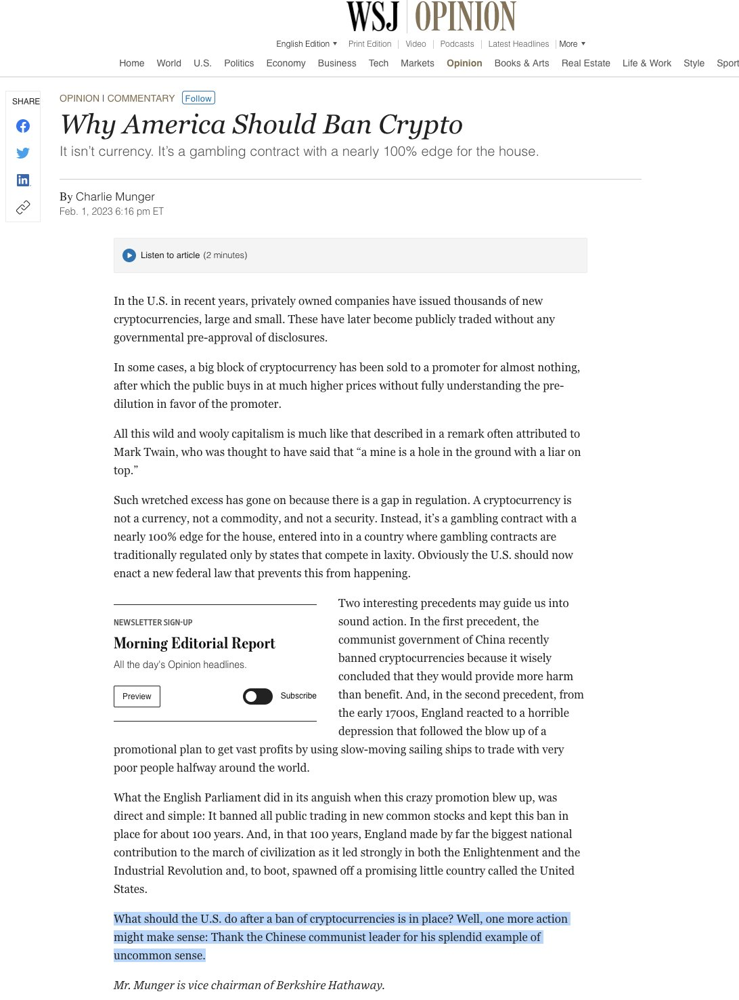
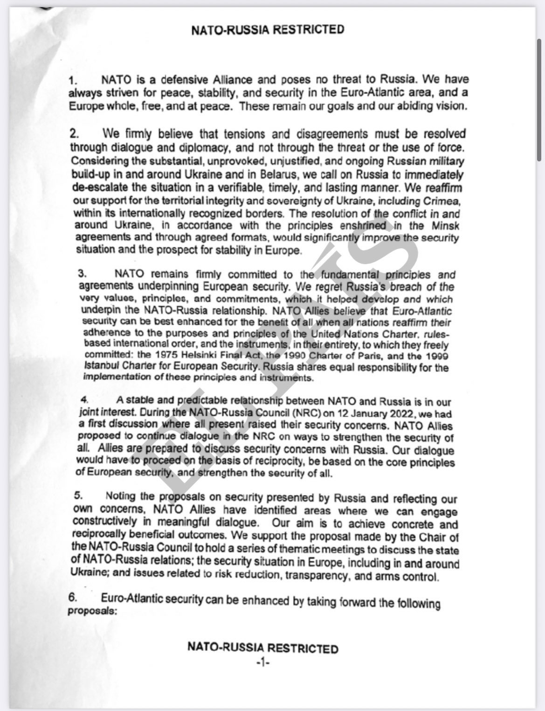
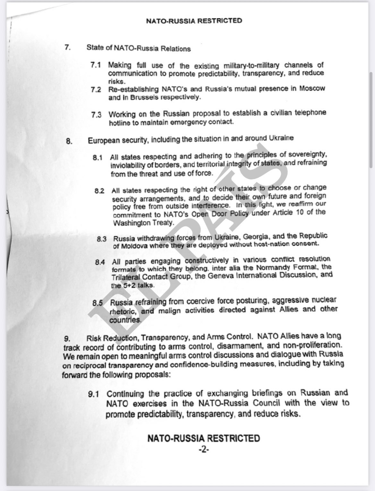
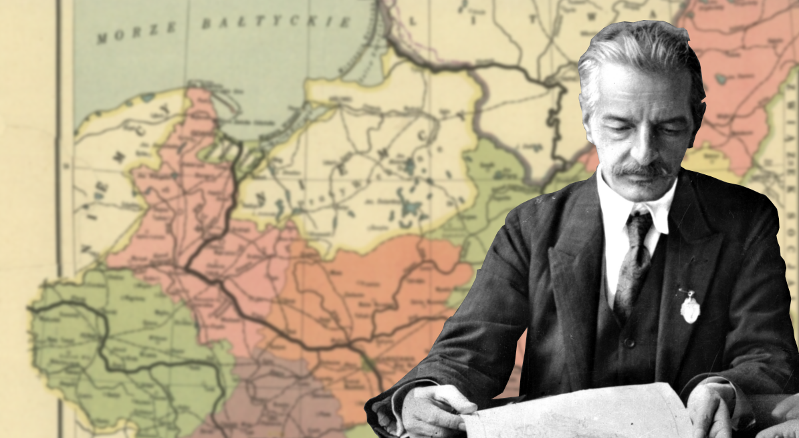

### 2023

Charlie Munger says:

> The United States should follow China's lead and ban Cryptocurrencies all together.

  

  

---

Stan społeczeństwa:

  

---

### 2022

Odpowiedź NATO na żądania Rosji:

  

  

---

Wczorajszy gigantyczny spadek cen akcji Facebooka może za parę lat być odnotowany na kartach historii jako symboliczny moment upadku Web2 i narodzin Web3.

---

### 2021

Today's Thought?

How the Reserve Bank of Australia pumped Bitcoin...
Australian unfunded deficits, debt, negative rates and fears of currency debasement have stoked every bubble including bitcoin.

The rally in bitcoin beyond $38,850 is a digital indictment of the easy money policies embraced by the Reserve Bank of Australia and its central bank "old boys" club, as increasingly aggressive balance sheet expansions obliterate the concept of a price for risk and fuel an ever-growing "everything bubble".

It's easy to understand why more capital is seeking an exit from, or a hedge against, a system where central banks have gone wild, sorry "plunged head first into unconventional policy".

As the Reserve Bank has destroyed the ability of markets to price anything, investors have been left with no choice but to chase risk in a world devoid of yield. Real, or inflation-adjusted, yields are nil or negative, meaning there is no opportunity cost for investors in non-income producing assets such as gold and digital currencies.

The Reserve Banks need to look no further than the mirror, to understand bitcoin's success.

---

Model chiński(decyzją polityczną można zablokować stronę internetową - dla bezpieczeństwa, naturalnie).

Z bólem podpisuję się pod krytyką projektu ustawy o krajowym sysystemie cyberbezpieczeństwa. Znam osoby, które go tworzyły i nie dopatruję się złych intencji. Trudna do wzruszenia decyzja premiera nie może ograniczać jednak dostępu do usług cyfrowych przy tak ogólnych przesłankach jej wydania.

Jednym z założeń projektu nowelizacji jest uprawnienie premiera do wydawania mających rygor natychmiastowej wykonalności decyzji, które w razie zagrożenia dla bezpieczeństwa narodowego mogą m.in. nakazać operatorowi telekomunikacyjnemu "wyłączenie" dostępu do określonych adresów IP a więc stron www.

Decyzje mogą nie być uzasadnienie. Tak radykalne rozwiązanie wyobrażam sobie tylko przy treściach terrorystycznych czy pedofilskich. W projekcie brakuje klauzuli zgodnie z którą jej wydanie możliwe jest tylko przy ryzyku niepowetowanych strat. Przepraszam, że uwag nie odniosłem wcześniej na etapie konsultacji społecznych. Nienawidzę ekspertów mądrych tylko przed kamerami TV. Nie wiedziałem o istnieniu przepisu projektu w takiej treści wcześniej.

Bezpieczeństwo przestrzeni cyfrowej to przede wszystkim wolność. Uważam że nawet, gdy płacimy za nią cenę mniejszego bezpieczeństwa.

---

### 2018

  

---

### 1947

W Warszawie zakończył się proces przywódców antykomunistycznej organizacji Wolność i Niezawisłość, nazwany "procesem Rzepeckiego" od nazwiska głównego oskarżonego.

Wbrew nadziei przeciwstawiali się sowieckiej okupacji Polski. Dramat Zrzeszenia "Wolność i Niezawisłość" to równocześnie dramat polskiego podziemia, którego resztki w latach pięćdziesiątych XX wieku ginęły w głębi ubeckich więzień.

Pokazowy proces

Przed sądem stanęło 10 osób z Zarządu Krajowego WiN, m.in.: pułkownik Jan Rzepecki, założyciel i pierwszy prezes, podpułkownik Jan Szczurek-Cergowski i szefowa łączności zagranicznej Emilia Malessa. Zarzucono im organizowanie dywersji, akty terroru, morderstwa i rabunki, szpiegostwo, a także uchylanie się od powinności wojskowej. Był to pierwszy z głośnych procesów pokazowych stalinowskiej Polski. Propagandowe relacje z procesu pojawiły się w prasie, radiu i Kronice Filmowej.

Sąd wydał wyrok już 3 lutego 1947 roku. Pułkownik Rzepecki został skazany na 8 lat więzienia i był więziony, z przerwami, do 1955 roku. Pozostałe osoby otrzymały kary od 2 do 12 lat więzienia, a jedna - karę śmierci. Zostali oni następnie ułaskawieni przez prezydenta Bolesława Bieruta. Potem jednak niektórzy byli ponownie aresztowani. Emilia Malessa wyczerpana psychicznie i fizycznie, w 1949 roku popełniła samobójstwo.

Więcej o Żołnierzach Wyklętych>>>

Organizacja WiN domagała się opuszczenia Polski przez wojska radzieckie i NKWD oraz zaprzestania prześladowań politycznych i utworzenia apolitycznej armii. Żądała też przeprowadzenia wolnych wyborów, niezależnej polskiej polityki zagranicznej, a także rewizji granicy wschodniej.

Rozpaczliwa sytuacja polskiego podziemia

Po upadku Powstania Warszawskiego widać było, że sowieci i polscy komuniści nie będą się z nikim liczyć. Sytuacja Armii Krajowej i ludzi podziemia niepodległościowego była rozpaczliwa. Więzienia pełne były patriotów, na masową skalę trwały aresztowania byłych akowców. W Polsce działały wojska NKWD, szalał terror, a o stabilizacji nie było mowy.

Powstanie WiN

Po rozwiązaniu Armii Krajowej w kręgach byłych akowców istniała potrzeba stworzenia nowej organizacji, która byłaby bardziej polityczna niż zbrojna. 2 września 1945 roku, m.in. z inicjatywy płk. Jana Rzepeckiego, powołano do życia zrzeszenie Wolność i Niezawisłość. Organizacja działała do 1952 roku, kiedy to została ostatecznie zlikwidowana przez Urząd Bezpieczeństwa.

Organizacja "Wolność i Niezawisłość" zakładała przede wszystkim działanie drogą walki politycznej, dopuszczając jednak możliwość zbrojnej samoobrony. W latach 1945-46 zrzeszenie liczyło ponad 30 tysięcy członków. Partyzanckie oddziały WiN atakowały więzienia i posterunki milicji, prowadziły walkę zbrojną z oddziałami wojska i likwidowały osoby współpracujące z władzą komunistyczną, traktując te działania jako obronę przed terrorem.

Aresztowania i procesy

Z powodu aresztowań przez UB, skład osobowy i struktura organizacyjna Zarządu Głównego WiN ulegała częstym zmianom. Kolejne cztery zarządy zostały rozbite przez funkcjonariuszy Ministerstwa Bezpieczeństwa Publicznego. W 1947 roku przeprowadzono trzy pokazowe procesy kolejnych zarządów WiN. Pierwszy tzw. proces Rzepeckiego już w styczniu tego roku.

Wyrok w sprawie IV Zarządu Głównego zapadł 14 października 1950 roku. Wykonany został 1 marca 1951 roku w więzieniu mokotowskim w Warszawie. Członkowie IV zarządu WiN zostali straceni strzałami w tył głowy. Śmierć ponieśli: Łukasz Ciepliński, Mieczysław Kawalec, Józef Batory, Adam Lazarowicz, Franciszek Błażej, Karol Chmiel i Józef Rzepka. Następnego dnia zwłoki pomordowanych umieszczono w trumnach i wywieziono z terenu więzienia. Do dziś nieznane jest miejsce ich pochówku.

Prowokacje UB

Po rozbiciu IV komendy WiN, UB przeprowadziło prowokacje. Ministerstwo Bezpieczeństwa Publicznego utworzyło infiltrowany "V Zarząd WiN", który składał się z funkcjonariuszy UB, aresztowanych i zmuszonych do współpracy oficerów WiN oraz tych, którzy nie zdawali sobie sprawy z prowokacji.

Przez cztery lata UB za pośrednictwem "V Zarządu" prowadziło grę wywiadowczą, której ofiarą padły grupy konspiracyjne w kraju oraz niepodległościowe środowiska emigracyjne. Przechwytywano amerykańskie pieniądze, zrzuty broni, a nawet agentów, którzy byli szkoleni w Niemczech i przerzucani do Polski. W skutek tej mistyfikacji w więzieniach znalazły się setki ludzi, którzy w dobrej wierze podjęli działalność w rzekomej podziemnej organizacji.

W marcu 2001 roku Sejm Rzeczypospolitej przyjął specjalną uchwałę, w której złożył hołd poległym, pomordowanym, więzionym i prześladowanym członkom organizacji "Wolność i Niezawisłość". Posłowie napisali, że "WiN, następczyni Armii Krajowej, dobrze zasłużyła się Polsce".

### 1945

Kelly’s Heroes” is a war movie like no other. The 1970 film is set in World War II Europe and features a group of ne'er-do-wells who learn about a cache of stolen Nazi gold behind enemy lines and form a mission to get it for themselves.
Not only was the gold far behind enemy lines, the Germans were in the process of making a big push against the Allies while supply problems stalled the push into Europe. The gold was also in a locked bank, guarded by a team of Tiger tanks. It’s not really a spoiler to reveal that Kelly’s makeshift platoon gets the gold in the end -- but it might be a surprise to learn the heist was based in reality.
Screenwriter Troy Kennedy Martin first learned about the real-life gold heist in an entry titled “The Greatest Robbery on Record” in the “Guinness World Records” book. In the real world, the gold wasn’t just a bunch of Nazi loot; it was the German National Gold Reserve.
On Feb. 3, 1945, a massive Allied air campaign over Berlin wrecked much of the city’s important government fixtures. Among them was the Reichsbank, where Nazi Germany stored its gold reserves. Some 950 bombers flattened the German capital, exposing the bank’s vault.
Its valuable contents were left intact, but would not survive another raid like the one on Feb. 3. The vault contained Germany’s gold reserves, as well as those looted from Czechoslovakia, Austria, Hungary, Albania, Belgium, Italy, Holland and the Soviet Union. In all, there was more than $21 billion (in 2021 dollars) in the German Reichsbank.
Not all of it was in Berlin that day, but there was enough of it that the German government was compelled to move the gold to a potassium mine in Merkers, Germany, for safekeeping. Also in the mine were Germany’s paper currency reserves, pilfered works of art, stolen gold and silver from death-camp victims, and the captured currency from other nations.
Then, Gen. George Patton’s Third Army launched a surprise attack that tore through the Nazi defenses. Before his forces captured Merkers and the money hidden in the mines, the Germans moved some of the contents, but much of it was captured by the Americans and moved to Frankfurt.
That wasn’t all of Germany’s gold bullion, however. What was left of the Reichsbank reserves were spread out in branches across Germany. The German south became the repository of the rest of the Nazi gold, hidden away in mines, houses and mountains, just to name a few places. An estimated $151 million was sent to Bavaria, specifically the Alpine resort town of Mittenwald, where it eventually was hidden away in a remote mountain lodge.
The Americans knew the currency and gold were in the area and were looking for it. Two German officers took charge of clandestinely moving the reserves little by little and reburying it in an area adjacent to a friendly alpine lodge. The Americans soon discovered the cache through the help of captured internees and two German informants. The gold was buried in the mountains near Lake Walchen under a false tree stump and was discovered by U.S. armored engineers -- nine tons of it, 728 bars worth $15,000 each. They took the gold to a depository at the Reichsbank building in Frankfurt.
But 25 crates of 100 gold bars each still were missing. They were not among the 728 dug up in the mountains. Most of the answers regarding the missing gold came from Sgt. Albert Singleton, 10th Armored Division’s provost marshal of the Mittenwald area after the war.
Singleton’s commander, a Capt. Craig, told him that he received orders for the provost marshal to take a couple of guards and a half track into the mountains with some former German officers to find a load of gold buried there. Two American intelligence officers from the Office of Strategic Services met them on the road to the pass with two 2.5-ton trucks.
The OSS agents led the group to a creek and a steep incline in the mountains that leveled off at a certain point. There, they found a trap door that led to a 12-square-foot bunker filled with gold bars. They removed the gold and slid it down the mountain rather than carry it (to prevent injuries). They put the gold in bags and loaded them onto the trucks provided by the OSS.
The next day, Singleton received a telegram from divisional headquarters, saying the gold arrived in Munich. It was just another day in the life of the provost marshal. He remembers because he sent his wife a letter describing the gold, along with a photo he’d taken at the bunker. But Singleton swore his account and the account of the 728 captured bars are different caches.
In fact, all descriptions of the two gold sites differ, from the level of inclines to the presence of a creek and the absence of a trail at the Singleton site. Singleton doesn’t even recognize anyone in the photos taken at the first cache.
And not only does Singleton’s photo back up his memory, there’s no record of the order Capt. Craig received about picking up the gold. The only physical evidence is the telegram he received after the deed had been done, but the gold loaded onto the two OSS trucks never was registered in Munich.
Some 25 boxes of gold bullion, 1.25 tons, disappeared into thin air. It never was recovered, and there are no leads as to where it might have vanished.
The myth of the missing Nazi gold actually was mistaken for the original 728 bars that ended up in Frankfurt, but the 100 boxes faded from memory as fast as they were uncovered in the mountains. It wasn’t until 1957 that any missing gold entered the public consciousness, when it appeared in the “Guinness World Records” book under the heading “Robbery: Biggest Unsolved.” It read:
“The greatest robbery on record was of the German National Gold Reserves in Bavaria by a combine of US Military personnel and German civilians in June 1945, A total of 730 gold bars valued at £3,528,000 together with six sacks of banks notes and 25 boxes of platinum bars and precious stones disappeared in transit but none of those responsible has been brought to trial.”
It was this entry that inspired British film and television writer Troy Kennedy Martin to write the screenplay for what became the film “Kelly’s Heroes.”

  

### 1871

Urodził się Eugeniusz Romer, ojciec polskiej kartografii, wybitny geograf, ekspert polskiej dyplomacji, który brał udział jako ekspert w konferencjach pokojowych w Paryżu i Rydze.
Jak geograf stał się kowalem
Bez wątpienia najważniejszym dziełem w liczącym setki pozycji dorobku tego badacza jest "Geograficzno-statystyczny atlas Polski", który ukazał się w 1916 roku. Warto nadmienić, że opracowanie publikacji w dobie I wojny światowej, kiedy ważyły się losy kwestii odrodzenia Polski, miało charakter nie tylko naukowy, lecz także polityczny.
– Atlas powstawał na emigracji ojca w Wiedniu – wspominał Edmund Romer

  

### 1863

Zakończyła się bitwa pod Węgrowem. Była ona elementem powstania styczniowego.
Stacjonujący w Siedlcach garnizon rosyjski w sile 1000 ludzi pod dowództwem pułkownika Georgija Papaafanasopuło próbował odbić zdobyty przez powstańców 23 stycznia Węgrów. 3500 Polaków pod wodzą generałów: Władysława Jabłonowskiego i Jana Matlińskiego skutecznie odparło rosyjski atak.

 

### 1826

https://en.wikipedia.org/wiki/Walter_Bagehot

### 382

Cesarz wschodniej części Imperium Rzymskiego Teodozjusz I Wielki osiedlił w Tracji Gotów jako sprzymierzeńców Rzymu (Foederati).

Foederati:

Choć trudno nazwać ich tradycyjnymi sojusznikami, a tym bardziej częścią wojsk cesarstwa, foederati stanowili cenny nabytek dla armii Rzymu. Były to grupy plemienne, zamieszkujące pogranicza imperium, które poprzysięgły Rzymianom wsparcie bojowe, zazwyczaj w zamian za dostawy żywności. W skład feoderati wchodzić mogli Goci, Wandalowie, Frankowie, Alanowie, a nawet Hunowie. Podstawowym problemem w przypadku tych oddziałów była ich niestabilność, zwłaszcza w przypadku wyłonienia nowego przywódcy. Na przykład, Goci walczyli jako foederati Cesarstwa Wschodniorzymskiego dla cesarza Walensa, ale w końcu zbuntowali się i rozbili jego wojska, zabijając przy tym cesarza pod Adrianopolem w roku 378 n.e. Jak na ironię, straty poniesione w standardowych oddziałach Rzymu wymusiły częstsze korzystanie z oddziałów foederati, co ostatecznie przyśpieszyło upadek Cesarstwa Zachodniorzymskiego. Wraz z osłabieniem władzy cesarza i coraz częstszymi atakami ze strony plemion wędrownych, wielu foederati osiedliło się na obszarze rzymskich prowincji.

Goci:

Historyk gockiego pochodzenia Jordanes, który korzystał z pracy Kasjodora i prisca carmina, tradycji ustnej przekazywanej z pokolenia na pokolenie, opisał w VI w. w dziele „Getica" wędrówkę tego ludu z na wpół mitycznej, północnej krainy zwanej przez nich Skandza. Dowodzeni przez króla Beriga przepłynęli na trzech statkach na południe i osiedli w krainie nazwanej Gothiskandza. Skandza według Jordanesa sąsiadowała od północy z królestwem Adogit, któregomieszkańcy żyli latem w nieustannym blasku słońca, a zimą w ciemnościach, pogrążając się na zmianę w euforii i cierpieniu (to pierwszy w historii opis zimowej depresji). Jordanes pisał też, że mieszkańcy Skandzy byli wyżsi niż Germanie. Badania antropologiczne potwierdziły wysoki wzrost Skandynawów z początków naszej ery.

Gothiskandza to prawdopodobnie teren między ujściem Wisły i Odry. Na początku I w. n.e. pojawiła się tam nowa kultura. Zmienił się rodzaj używanych przez miejscową ludność przedmiotów, przede wszystkim ozdób i broni, pojawiły się nowe typy grobów. Ich kultura, zwana wielbarską, rozprzestrzeniła się w I i II w. na znaczną część dzisiejszej północnej Polski: Pomorze, północną Wielkopolskę i Warmię, a wiek później – na prawobrzeżne Mazowsze, Podlasie i Lubelszczyznę.

Największe gockie cmentarzysko w Europie odkryto w samym środku wojskowego poligonu. – Dzięki temu nie jest ono zniszczone przez orkę i nie było narażone na rabunki. Ale zdarza się, że dzwoni telefon z informacją o ostrzale prowadzonym właśnie tam, gdzie zamierzaliśmy kopać – mówi dr Adam Cieśliński z Uniwersytetu Warszawskiego, który wspólnie z Andrzejem Kasprzakiem z muzeum w Koszalinie kieruje wykopaliskami w Nowym Łowiczu. Podczas manewrów NATO zdarzyło się, że brytyjskie czołgi rozjechały kurhan, ale dziś wojskowi rozumieją już znaczenie stanowiska i starają się je chronić przed zniszczeniem. Badania cmentarzyska są objęte honorowym patronatem Ministerstwa Obrony Narodowej i rektora Uniwersytetu Warszawskiego.

Według Jordanesa pięć pokoleń po dotarciu do Gothiskandzy populacja Gotów zwiększyła się tak bardzo, że plemię ruszyło w dalszą wędrówkę na południe, w kierunku Imperium Romanum. W ciągu kilku następnych pokoleń dotarli na stepy nadczarnomorskie, należące dzisiaj do Ukrainy. Tam, w bezpośrednim sąsiedztwie greckich i rzymskich miast, po raz pierwszy zagrozili granicom imperium. Goci podbili lub uzależnili od siebie liczne nadczarnomorskie miasta i niemal sparaliżowali handel na Morzu Czarnym. Do pierwszego starcia z wojskami rzymskimi dowodzonymi przez cesarza Gordiana doszło w 239 r. W drugiej połowie III w. Goci opanowali Pannonię i Illirię oraz zagrozili Italii. Pokonani w bitwie pod Naissus (dzisiejszy Nisz w Serbii) zostali wyparci za Dunaj, zdołali jednak zająć Dację, z której wcześniej ewakuowali się Rzymianie.

Od III w. rzymscy kronikarze piszą o dwóch odłamach Gotów: Terwingach, czyli mieszkańcach lasu, i Greutungach, mieszkańcach stepu. Badacze uważają, że te nazwy z grubsza odpowiadają późniejszemu podziałowi plemiona na Ostrogotów, rządzonych przez królewską rodzinę Amarów, i Wizygotów pod rządami królów z dynastii Baltów. W IV w. w Europie pojawili się Hunowie, koczowniczy lud z Dalekiego Wschodu. Zepchnęli plemiona germańskie na zachód i w 375 r. podbili Ostrogotów, którzy od tej pory brali udział w ich wyprawach łupieżczych. W 451 r. doszło do bratobójczej bitwy na Polach Katalaunijskich. Naprzeciw siebie stanęli Wizygoci, sprzymierzeńcy Rzymian dowodzonych przez Aecjusza, i Ostrogoci jako główni sojusznicy Attyli, wodza Hunów. Bitwa nie została rozstrzygnięta, stała się jednak początkiem końca Hunów. Zginął w niej też król Wizygotów Teodoryk (nie mylić z Teodorykiem Wielkim, królem Ostrogotów).

W V w. Ostrogoci utworzyli w Italii królestwo ze stolicą w Rawennie, która miała być spadkobiercą Rzymu. Królestwo osiągnęło szczyt potęgi za panowania Teodoryka Wielkiego na początku VI w. Zostało pokonane dopiero w 553 r. przez armie wschodniego cesarstwa rzymskiego dowodzone przez Belizariusza i Narsesa, którzy na krótko przejęli kontrolę nad Italią, dopóki 15 lat później nie wyparli ich stamtąd Longobardowie. Wizygoci tak bardzo obawiali się Hunów, że w 377 r. poprosili cesarza Walensa o pozwolenie na przekroczenie Dunaju. Walens obiecał im ziemię uprawną, dostawy zbożai ochronę armii. Nie dotrzymał jednak słowa. Nękani głodem Wizygoci rozpoczęli bunt i rok później pokonali armię rzymską w bitwie pod Adrianopolem, w której zginął sam cesarz. W 410 r. Wizygoci pod wodzą Alaryka I złupili Rzym. Mimo że miasto nie było już stolicą imperium (w 330 r. Konstantyn Wielki przeniósł stolicę do Konstantynopola), podkopało to morale Rzymian. Po złupieniu Italii Wizygoci założyli królestwo na terenach dzisiejszej południowo-zachodniej Francji. Później pod naciskiem Franków przenieśli się na Półwysep Iberyjski. Pod koniec VI w. porzucili arianizm i przeszli na katolicyzm. Królestwo Wizygotów w Hiszpanii przetrwało do VIII w., w 711 r. zostało podbite przez Arabów.

Chociaż Rzymianie nazywali Gotów barbarzyńcami, podobnie jak wszystkie inne ludy żyjące poza granicami imperium, Goci wcale nimi nie byli. Przez stulecia kontaktów i walk na pograniczu imperium oraz intensywne kontakty z Bizancjum przejęli wiele od Rzymian. Tacyt pisał, że byli bardziej karni i lepiej zorganizowani niż inne plemiona germańskie, bo podlegają władzy królewskiej. Goci jako pierwsi barbarzyńcy przyjęli chrześcijaństwo w wersji ariańskiej (z doktryną głoszącą, że Jezus nie jest częścią Trójcy Świętej, tylko został stworzony przez Boga), a gocki apostoł Wulfila przetłumaczył w IV w. Biblię na język gocki. Ostrogocki władca Teodoryk Wielki, który wychował się i zdobył wykształcenie w Konstantynopolu, próbował w swoim państwie wskrzesić upadającą rzymską kulturę. Z kolei Wizygoci jako jedyni zakładali w Europie nowe miasta między upadkiem Rzymu a powstaniem imperium Karolingów. Pozostawili też kodeks prawny używany aż do późnego średniowiecza, który był podstawą prawodawstwa na terenie Półwyspu Iberyjskiego jeszcze długo po upadku państwa Gotów.

Do tradycji gockiej chętnie nawiązywali późniejsi władcy Europy. Jeszcze w XIX w. Szwedzi uważali się za bezpośrednich potomków wojowniczego plemienia, podobnie jak Hiszpanie, którzy wywodzili swoje szlacheckie rody od Wizygotów. Doprowadziło to do incydentu dyplomatycznego w 1434 r., kiedy na soborze bazylejskim członkowie szwedzkiej delegacji, powołując się na pochodzenie od Gotów, zażądali, aby usadzić ich jak najbliżej papieża. Hiszpanie odpowiedzieli, że wszyscy dzielni i waleczni Goci opuścili Skandynawię i udali się do Hiszpanii, pozostawiając za sobą jedynie tchórzy. Na gockie dziedzictwo chętnie powoływali się też nazistowscy historycy, wywodząc np. nazwę Gdańska (niem. Danzig) od Skandzy, oraz zmieniając w 1939 r. nazwę Gdyni na Gothenhafen, czyli „gocki port". Goci nie byli jednolitym ludem. Na cmentarzysku w Nowym Łowiczu archeolodzy odkryli różne typy grobów, co wskazuje na różnorodność wierzeń ludzi z tego plemienia. – Obrządek pogrzebowy był bardzo zróżnicowany – mówi dr Cieśliński. Niektórych zmarłych składano bezpośrednio do dużych jam w ziemi, innych palono na stosach, a szczątki zsypywano do urn lub do ziemi. Jedynie nad połową grobów usypano kurhany. W większości złożono kobiety i dzieci, podobnie jak na innych terenach opanowanych przez Gotów. Kilkadziesiąt lat temu badacze pisali nawet o Amazonkach w kontekście mazowieckich reliktów kultury wielbarskiej. W Nowym Łowiczu nieliczni pochowani mężczyźni są sędziwi. Cieśliński uważa, że w społeczeństwie tzw. demokracji wojennej, w którym jedyna możliwa ścieżka kariery była związana w wojną, mężczyźni często wychodzili z domów i nigdy do nich nie wracali.

Zagadką gockich cmentarzysk jest to, że w grobach wojowników nie ma broni. Przedstawiciele innych ludów żyjących w tym samym okresie zawsze dawali swoim zmarłym kilka sztuk broni na wędrówkę w zaświaty. Goci stanowili wyjątek. Niewykluczone, że broń była dziedziczona z pokolenia na pokolenie i dlatego nie wkładano jej do grobów. Być może wierzenia Gotów zakładały, że po śmierci wojownicy będą wiedli pokojową egzystencję i broń nie będzie im już potrzebna. Gockie kobiety były jednak chowane z przedmiotami służącymi do wykonywania prac domowych, takimi jak przęśliki, ciężarki tkackie, igły czy szydełka. Trzecią zagadką jest kontrast wyposażenia grobów kobiecych i męskich. Mężczyźni, nawet ci o wysokiej pozycji społecznej (co potwierdzają na przykład wielkie rozmiary kurhanu), chowani byli skromnie. W ich grobach można znaleźć najwyżej pojedyncze fibule (rodzaj starożytnej agrafki) lub fragmenty ozdobnych okuć pasa. Kobiety Gotów lubiły się stroić. Tacyt pisał, że kobiece tuniki były haftowane purpurową nicią i nie miały rękawów. Pruderyjny Rzymianin nie omieszkał też zaznaczyć, że kobiety z plemion germańskich eksponowały górne części piersi. Upodobanie gockich kobiet do ozdób widać na wielu cmentarzyskach w Polsce. Gockie damy kazały się chować z naszyjnikami, zawieszkami, bransoletami i zapinkami ze szlachetnych kruszców. Zdobiły się też sznurami paciorków ze szkła i z bursztynu, a także naszyjnikami z muszli importowanymi aż z rejonu Morza Śródziemnego. Prawdopodobnie pochodziły z łupów wojennych, które mężczyźni przekazywali kobietom.

 

---

<a href="https://github.com/TomaszWaszczyk/historia.waszczyk.com/edit/master/src/content/february-3.md" target="_blank">Edytuj tę stronę dzieląc się własnymi notatkami!</a>
