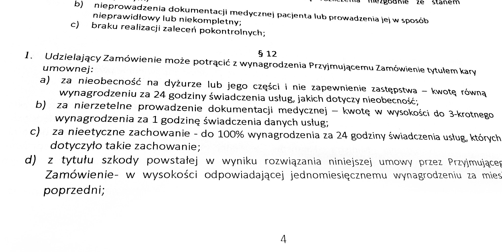
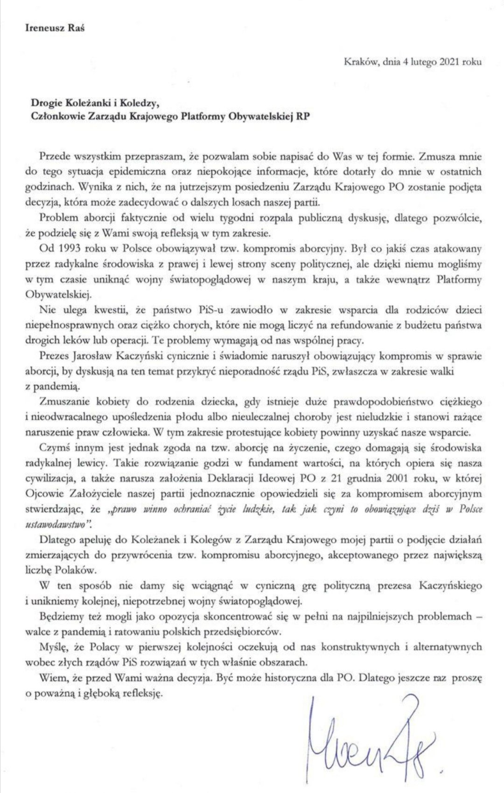

### 2022

Taką umowę kontraktową na dyżury dostał LEKARZ SPECJALISTA PSYCHIATRII DZIECI I MŁODZIEŻY. W szpitalu publicznym, w oddziale, który nie ma obsady dyżurowej i szuka pracownika. Zdziwieni, że coraz mniej chętnych do pracy w polskich szpitalach?

  

### 2021

  

---

Jedno z pierwszych wspomnień o grze wojennej w masowych mediach (onet.pl) oraz wojny konwencjonalnej:

> Porażka polskiej armii w symulowanej wojnie. Ćwiczenia wykazały klęskę w pięć dni Wojskowe ćwiczenia "Zima-20" skończyły się blamażem i całkowitą klęską. Symulacja wskazała, że po pięciu dniach wojna była przegrana, a polska armia przestała istnieć - informuje Interia.

W symulacjach uwzględniono zamówione przez Polskę - choć jeszcze niedostarczone - nowe systemy uzbrojenia
Zacięta obrona wschodu Polski spowodowała rozbicie znajdujących się tam jednostek i potężne straty
Według informatorów Interii już piątego dnia wirtualnego konfliktu przeciwnik dotarł do linii Wisły. "SE" dodaje, że czwartego dnia Warszawa znalazła się w okrążeniu
Kancelaria Prezydenta i Ministerstwo Obrony Narodowej nie chciały komentować tych doniesień, powołując się na niejawność ćwiczeń

W symulacjach uwzględniono zamówione przez Polskę - choć jeszcze niedostarczone - nowe systemy uzbrojenia
Zacięta obrona wschodu Polski spowodowała rozbicie znajdujących się tam jednostek i potężne straty
Według informatorów Interii już piątego dnia wirtualnego konfliktu przeciwnik dotarł do linii Wisły. "SE" dodaje, że czwartego dnia Warszawa znalazła się w okrążeniu
Kancelaria Prezydenta i Ministerstwo Obrony Narodowej nie chciały komentować tych doniesień, powołując się na niejawność ćwiczeń

Jak przekazała Interia, w ćwiczenia sztabowych wzięło udział kilka tysięcy oficerów. W symulacjach uwzględniono zamówione przez Polskę - choć jeszcze niedostarczone - nowe systemy uzbrojenia: zestawy przeciwlotnicze Patriot, artylerię rakietową HIMARS i wielozadaniowe samoloty F-35. Sprawdzano także rozwiązania, które wprowadziła reforma systemu kierowania i dowodzenia siłami zbrojnymi, obowiązująca od końca 2018 r.

Zobacz: Karabinek Grot przegrywa z piaskiem. Pokazujemy próby na kilku rodzajach broni
Okazuje się, że niewiele dało m.in. "wzmocnienie wschodniej flanki". Obrona wschodu Polski spowodowała rozbicie znajdujących się tam jednostek i potężne straty - wskazuje Interia.

Według informatorów portalu już piątego dnia wirtualnego konfliktu przeciwnik znalazł się na linii Wisły, trwały walki o Warszawę, strategiczne porty zostały zablokowane lub zajęte. Lotnictwo i Marynarka Wojenna przestały istnieć, mimo wsparcia NATO. Na wschód od Wisły polskie jednostki miały ponieść druzgocącą klęskę. Pierwszorzutowe bataliony straciły od 60 do 80 proc. stanów. Przegrane ćwiczenia miały wywołać ogólną konsternację.

---

  

---

W ramach walki z COVID-19 Europejski Bank Centralny wyłożył łącznie 1,850 biliona Euro. Przeznaczono je na kilka programów, jednym z nich jest skup obligacji korporacyjnych. Łącznie EBC posiada obecnie obligacje korporacyjne od europejskich firm na kwotę 255 miliardów Euro. Czyli ok. 1,15 biliona złotych. Inaczej mówiąc tysiąc miliardów złotych.
Budżet Polski w 2020 roku to 398 mld zł, zatem EBC skupił obligacje korporacyjne w wysokości ok. 3 budżetów Polski.

EBC na przestrzeni ostatnich lat skupił 1609 obligacji korporacyjnych od 344 firm. Od niektórych kilka, a nawet kilkanaście razy. Dlaczego teraz, przy okazji COVID, nie zdecydowano się pomóc większej ilości podmiotów tylko kupiono po raz kolejny np. od firmy Allianz, łącznie 8 różnych obligacji, a od BMW aż 27 różnych obligacji? Nie wiemy ale się domyślamy.
Pełna lista obligacji skupionych przez EBC, niestety bez rozdzielenia na wcześniejsze oraz te z bieżącego skupu na walkę z COVID.

My postanowiliśmy wymienić tu kilkadziesiąt najbardziej znanych w Polsce bądź występujących na naszym rynku korporacji.
ABB
Adecco
Adidas
Aeroports de Paris - lotniska paryskie
Air Liquide
Airbus
Allianz
Alstom
Autoroutes du Sud - firma zarządzająca autostradami we Francji
Autostrade per L'Italia - autostrady włoskie
Albertis Infrastucturas - autostrady hiszpańskie
BASF
Bayer
Bertelsmann SE - media w Niemczech, właściciel RTL
BMW
Bouygues - konglomerat skłądający się z firm budowlanych, stacji tv (m.in. Eurosport), operator telefonii komórkowej
Brussels Airport
Cap Gemini
Carrefour
Cepsa Finance - hiszpański gigant energetyczny
Cellnex Telecom - operator telefonii komórkowej w Hiszpani, Włoszech, Francji, Holandii, UK, Szwajcarii i Irlandii
Saint Gobain
Michelin
Continental
Covestro - odłam powstały z Bayera, przemysł polimerowy
Daimler - chyba rekordzista, 37 obligacji
Danone
Deutsche Bahn - niemieckie koleje państwowe
Deutsche Borse - niemiecka giełda
Deutsche Post - niemiecki operator poczty
Deutsche Telekom
E.ON - niemiecki gigant energetyczny (EBC wykupił od nich 19 obligacji)
EDF - francuski gigant energetyczny, posiadający kilka elektrowni również w Polsce
Enel - włoski koncern energetyczny
Engie - francuski gigant energetyczny (24 obligacje)
ENI - włoski gigant energetyczny
Eutelsat
Evonik
EXOR - włosko-holenderski multiholding, 28 firma na świecie pod względem przychodów
Fiat
Fortum - fiński gigant energetyczny, posiadający elektrownie również w Polsce
Fresenius - niemiecki gigant branży medycznej
Heineken (15 obligacji)
Iberdrola - hiszpański gigant energetyczny
innogy
JAB Holding  -branża spożywcza, m.in. Jacobs, Douwe Egberts
Philips
Linde
Louis Vitton 🤯
Mondelez - Milka, Oreo itp.
Nestle
Nokia
Novartis
OMV - austriacki koncern petrochemiczny
Orange
Peugeot
Renault
Repsol - hiszpański gigant petrochemiczny
Richemont - biżuteria, luksusowe zegarki
Royal Schiphol - lotnisko w Amsterdamie
Ryanair
Sanofi - francuski koncern farmaceutyczny
SAP - branża informatyczna, dostawca oprogramowania dla biznesu
Schneider Electric
Shell
Siemens
Snam - gazownictwo, Włochy
SAGESS - branża naftowa, Francja
Sodexo SA
Suez SA - francuska multikorporacja, gazownictwo, energetyka, infrastruktura wodna
Swisscom
Telecom Italia
Telefonica
Tennet - holenderski państwowy moloch energetyczny
Total
Unilever
Valeo
Veolia
Vinci
Vivendi
Volskwagen
Whirlpool
Wizzair
Zurich Finance - ubezpieczenia
I wiele wiele innych firm
Bardzo interesujące na liście są też podmioty.... spoza UE.
Anheuser-Busch - browar z St. Louis - m.in. Budweiser
Coca-Cola
ArcelorMittal - hinduska firma która zamknęła niedawno oddział w Nowej Hucie
CK Hutchinson - konglomerat firm z branży telefonii, budownictwa, właściciel portów oraz wielu sieci sklepów z siedzibą w Hongkongu
______________
1. Wiemy już od kogo, teraz sprawdźmy na jaki procent.
Procenty są różne. Od 0% (zera procent) do 8% - jednakże rozkład jest mniej więcej taki
0 procent - 58 obligacji
0-1 procent - 513 obligacji
1-2 procent - 636 obligacji
2-3 procent - 240 obligacji
3-4 procent - 76 obligacji
powyżej 4 procent - 68 obligacji, głównie dla firm, które wypuściły kilka innych obligacji
ruchome oprocentowanie - 17 obligacji
Na 1609 obligacji - 1207 wynosi nie więcej niż 2% (słownie: dwa procent)
Tu mamy ciekawą analogię z życiem szarego człowieka.
Znajdziecie gdzieś kredyt mieszkaniowy na 10-20 lat z oprocentowaniem na poziomie 0-2% ? Widocznie nie pytaliście w EBC 🙂
______________
3. Na jak długo?
Okresy są różne i bez dokładnego zgłębiania każdej obligacji odrębnie, nie da się podać pełnej informacji. Jednakże wiemy, do kiedy należy wykupić swoje obligacje:
97 obligacji kończy się w 2021 roku
650 obligacji w latach 2021-2025
655 obligacji  latach 2026-2030
153 obligacje w latach 2031-2035
46 obligacji w latach 036-2041
5 obligacji w latach 2049-2051
Kilkaset bogatych korporacji musi wykupić swoje wielomilionowe obligacje z oprocentowaniem np. 0,5%. Prawdopodobnie zrobili interes życia, bo przebiją nawet inflację 🤯
______________
4. I tu dochodzimy do pytania czwartego - na jakie kwoty?
Wiemy że łącznie jest to 255 miliardów Euro (jak wspomnieliśmy, to równowartość trzech budżetów Polski albo, licząc z grubsza, budżet Polski, Czech, Słowacji, Węgier, Bułgarii, Słowenii, Litwy, Łotwy i Estonii razem wziętych ). 
Na stronie Europejskiego Banku Centralnego próżno jednak szukać informacji najważniejszej - za ile skupili konkretne obligacje korporacyjne? Taki tam, drobiazg, kto by się kwotami przejmował. Przecież te pieniądze i tak drukujemy.
Aby znaleźć informację, musimy zajrzeć na tę stronę i wpisać kod:
https://cbonds.pl/bonds/680631/
Np. dla tego kodu, mamy obligacje dla Deutsche Bahn na kwotę 300 milionów Euro, na 0% do spłaty 14.02.2024 (screen w komentarzu)
I tak musimy postąpić z każdą z tych obligacji ręcznie.
______________
Chwileczkę, jak to Deutsche Bahn? Czy to nie jest podmiot w 100% należący do niemieckiego rządu? Podobnie jak wiele firm na liście wyżej należy do rządów Francji, Niemiec, Belgii, Holandii, Włoch czy Hiszpanii?
Jak czytamy na Wikipedii, jednym z podstawowych założeń EBC jest:
"EBC nie może udzielać kredytów organom wspólnotowym ani podmiotom sektora publicznego w poszczególnych krajach"
🔥 Ale hej! Przecież EBC nie udziela kredytów tylko wykupuje obligacje korporacyjne! EBC inwestuje w te obligacje i liczy na zwrot! A że inwestuje na zero procent w państwowe koleje, będące na skraju upadłości pod koniec 2019 roku? Oj tam. Zwróci się. To musi być świetna inwestycja.

🔥🔥🔥 Równie zasadne pytania brzmią, dlaczego EBC z powodu walki z COVID-19 wspiera firmy:
- energetyczne, petrochemiczne, gazownicze, farmaceutyczne, firmy produkujące proszki do prania, firmy wytwarzające słodycze, browary, firmy ubezpieczeniowe, producentów samochodów, operatorów telefonii komórkowych, producentów ubrań, w tym biżuterii, luksusowych zegarków czy torebek, stacje telewizyjne albo dostawców usług informatycznych?
Kto nie znajduje odpowiedzi na to pytanie, niech jeszcze raz wróci na początek tekstu, do wywiadu z Cezarym Głuchem.
______________
Podsumujmy:
👀 EBC skupił obligacje od europejskich korporacji na ok. 255 mld Euro (1 150 miliardów złotych)
👀 Większość obligacji jest oprocentowana poniżej 2% (dwóch procent) na okres 5-10 lat
👀 Na liście firm nie ma ani jednej firmy z Polski (bo Polska nie należy do strefy Euro) ale jest jedna firma czeska (z siedzibą w Luksemburgu, która ma 100% udziałów w firmie w Czechach) - Czech Gas Networks Investments S.a.r.l.
👀  33% obligacji otrzymały firmy francuskie, 26% firmy niemieckie, 8% hiszpańskie, 7% włoskie, 6% holenderskie, 4% belgijskie, 3% szwajcarskie
Na sam koniec jeszcze wypadałoby zapytać - a skąd tak właściwie EBC ma te wszystkie pieniądze? I dlaczego nasz NBP nie może zrobić podobnej operacji na tak dużą skalę (robi na mniejszą)? Ale to zostawmy może na dyskusję w komentarzach.

---

### 1946

W Trzciannem w województwie podlaskim rozpoczęła się trwająca sześć dni obława funkcjonariuszy Urzędu Bezpieczeństwa Publicznego w Białymstoku i żołnierzy Korpusu Bezpieczeństwa Wewnętrznego na oddział AK-WiN dowodzony przez Władysława Chojnowskiego „Kreta”.
Przypuszczono atak na wioski Zubole i Szorce, gdzie zatrzymano 20 osób podejrzanych o członkostwo lub współpracę z podziemiem antykomunistycznym. Wszystkich przewieziono do byłego domu parafialnego w Trzciannem. Po przesłuchaniach zwolniono szesnaście osób. Cztery pozostałe, którym udowodniono przynależność do Armii Krajowej poddano brutalnym torturom. Byli to: Izydor Wysocki, Edward Kobeszko „Szczep”, Franciszek Malinowski „Karaś” oraz Józef Bielawiec „Dzięcioł”. Wszyscy w wieku około dwudziestu lat. Poddano ich 40- godzinnym przesłuchaniom, podczas których wbijano im w pięty gwoździe i połamano ręce. Przesłuchiwani nikogo nie wydali.

Skatowane ofiary Urząd Bezpieczeństwa wywiózł drogą prowadzącą z Trzciannego w kierunku Łomży. Niedaleko za Trzciannem, w lesie przy drodze, strzałami z broni palnej mężczyzn dobito. Ciała porzucono. Znaleźli je mieszkańcy okolicznych miejscowości. Poinformowane o tym przez sąsiadów rodziny pomordowanych zabrały zwłoki i pochowały je na cmentarzu parafialnym w Trzciannem.
Ubeccy kaci, chcący uniknąć kary spreparowali raport, w którym napisali:
> Wieczorem dnia 6 lutego 1946 roku podczas przejazdu naszej grupy operacyjnej w lesie koło wsi Zubole została obstrzelana przez bandę nasza maszyna, na której byli umieszczeni członkowie bandy NZW. Podczas strzelaniny zatrzymani próbowali uciec do lasu, zostali zabici podczas tej ucieczki.

### 1945

> Ponownie stwierdzamy nasze wspólne pragnienie ujrzenia Polski państwem silnym, wolnym, niepodległym i demokratycznym.

Te piękne słowa,nijak nie oddające pózniejszej polskiej rzeczywistości padły podczas rozpoczętej 4 lutego 1945 roku w byłym pałacu Potockich w Jałcie konferencji "wielkiej trójki"czyli premiera Wielkiej Brytanii Winstona Churchilla, prezydenta USA Franklina Delano Roosvelt i przewodniczącego Rady Ministrów ZSRR Józefa Stalina.
Podczas tego spotkania zdecydowano,w sporej mierze pod dyktat Stalina o przyszłym kształcie powojennej Europy i Polski.
Postanowienia konferencji jałtańskiej podane
zostały do wiadomości publicznej. Nic zatem
dziwnego, że Polacy zareagowali na dyktat tzw.
Wielkiej Trójki rozpaczliwymi protestami. Polska, z państwa ciemiężonego przez Niemcy, stawała się krajem zniewolonym przez Związek
Radziecki. Wszystko przy cichym przyzwoleniu
mocarstw zachodnich.

 

### 1900

Został po raz drugi aresztowany Feliks Dzierżyński. Osadzono go w pawilonie 10 na warszawskiej cytadeli. Było to jedno z 6 aresztowań "Czerwonego
kata". Pierwszego dokonano 29 lipca 1897 roku.
Dzierżyński był sowieckim komunistą polskiego pochodzenia i twórcą takich organów służby bezpieczeństwa i aparatu terroru jak : Czeka, GPU i OGPU. Był też bliskim współpracownikiem Lenina. Jako szef GPU stosował krwawy terror wobec przeciwników bolszewizmu. Razem ze Stalinem i Zinowiewem zmusił Lwa Trockiego do
usunięcia się. Jego perfidia w zwalczaniu opozycji osiągneła swój szczyt, gdy stworzył nawet w Moskwie organizację...antykomunistyczną, która w
rzeczywistości była wabikiem na prawdziwych
działaczy opozycyjnych.
Zmarł na zawał serca 20 lipca 1926 roku w Moskwie.

 

### 1505

> A niechaj narodowie wżdy postronni znają, iż Polacy nie gęsi, iż swój język mają

4 lutego 1505 roku w Żurawnie koło Halicza (obecnie Ukraina) urodził się autor tych słów Mikołaj Rej - polski poeta, prozaik i polityk zwany także "ojcem polskiej literatury"-założyciel miasta Rejowiec w województwie lubelskim, gdzie zmarł prawdopodobnie 8 września 1569 roku.

---

<a href="https://github.com/TomaszWaszczyk/historia.waszczyk.com/edit/master/src/content/february-4.md" target="_blank">Edytuj tę stronę dzieląc się własnymi notatkami!</a>
