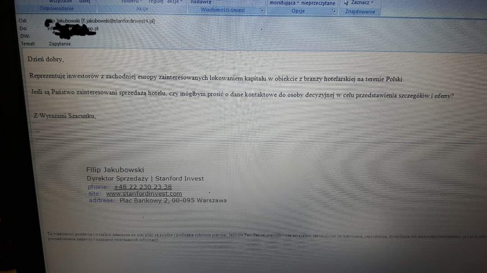
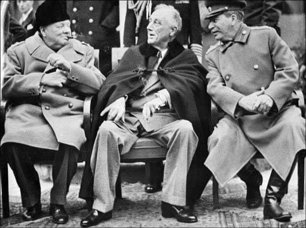

### 2021

  

---

Jedno z pierwszych wspomnień o grze wojennej w masowych mediach (onet.pl) oraz wojny konwencjonalnej:

> Porażka polskiej armii w symulowanej wojnie. Ćwiczenia wykazały klęskę w pięć dni Wojskowe ćwiczenia "Zima-20" skończyły się blamażem i całkowitą klęską. Symulacja wskazała, że po pięciu dniach wojna była przegrana, a polska armia przestała istnieć - informuje Interia.

W symulacjach uwzględniono zamówione przez Polskę - choć jeszcze niedostarczone - nowe systemy uzbrojenia
Zacięta obrona wschodu Polski spowodowała rozbicie znajdujących się tam jednostek i potężne straty
Według informatorów Interii już piątego dnia wirtualnego konfliktu przeciwnik dotarł do linii Wisły. "SE" dodaje, że czwartego dnia Warszawa znalazła się w okrążeniu
Kancelaria Prezydenta i Ministerstwo Obrony Narodowej nie chciały komentować tych doniesień, powołując się na niejawność ćwiczeń

W symulacjach uwzględniono zamówione przez Polskę - choć jeszcze niedostarczone - nowe systemy uzbrojenia
Zacięta obrona wschodu Polski spowodowała rozbicie znajdujących się tam jednostek i potężne straty
Według informatorów Interii już piątego dnia wirtualnego konfliktu przeciwnik dotarł do linii Wisły. "SE" dodaje, że czwartego dnia Warszawa znalazła się w okrążeniu
Kancelaria Prezydenta i Ministerstwo Obrony Narodowej nie chciały komentować tych doniesień, powołując się na niejawność ćwiczeń

Jak przekazała Interia, w ćwiczenia sztabowych wzięło udział kilka tysięcy oficerów. W symulacjach uwzględniono zamówione przez Polskę - choć jeszcze niedostarczone - nowe systemy uzbrojenia: zestawy przeciwlotnicze Patriot, artylerię rakietową HIMARS i wielozadaniowe samoloty F-35. Sprawdzano także rozwiązania, które wprowadziła reforma systemu kierowania i dowodzenia siłami zbrojnymi, obowiązująca od końca 2018 r.

Zobacz: Karabinek Grot przegrywa z piaskiem. Pokazujemy próby na kilku rodzajach broni
Okazuje się, że niewiele dało m.in. "wzmocnienie wschodniej flanki". Obrona wschodu Polski spowodowała rozbicie znajdujących się tam jednostek i potężne straty - wskazuje Interia.

Według informatorów portalu już piątego dnia wirtualnego konfliktu przeciwnik znalazł się na linii Wisły, trwały walki o Warszawę, strategiczne porty zostały zablokowane lub zajęte. Lotnictwo i Marynarka Wojenna przestały istnieć, mimo wsparcia NATO. Na wschód od Wisły polskie jednostki miały ponieść druzgocącą klęskę. Pierwszorzutowe bataliony straciły od 60 do 80 proc. stanów. Przegrane ćwiczenia miały wywołać ogólną konsternację.

---

### 1946

W Trzciannem w województwie podlaskim rozpoczęła się trwająca sześć dni obława funkcjonariuszy Urzędu Bezpieczeństwa Publicznego w Białymstoku i żołnierzy Korpusu Bezpieczeństwa Wewnętrznego na oddział AK-WiN dowodzony przez Władysława Chojnowskiego „Kreta”.
Przypuszczono atak na wioski Zubole i Szorce, gdzie zatrzymano 20 osób podejrzanych o członkostwo lub współpracę z podziemiem antykomunistycznym. Wszystkich przewieziono do byłego domu parafialnego w Trzciannem. Po przesłuchaniach zwolniono szesnaście osób. Cztery pozostałe, którym udowodniono przynależność do Armii Krajowej poddano brutalnym torturom. Byli to: Izydor Wysocki, Edward Kobeszko „Szczep”, Franciszek Malinowski „Karaś” oraz Józef Bielawiec „Dzięcioł”. Wszyscy w wieku około dwudziestu lat. Poddano ich 40- godzinnym przesłuchaniom, podczas których wbijano im w pięty gwoździe i połamano ręce. Przesłuchiwani nikogo nie wydali.

Skatowane ofiary Urząd Bezpieczeństwa wywiózł drogą prowadzącą z Trzciannego w kierunku Łomży. Niedaleko za Trzciannem, w lesie przy drodze, strzałami z broni palnej mężczyzn dobito. Ciała porzucono. Znaleźli je mieszkańcy okolicznych miejscowości. Poinformowane o tym przez sąsiadów rodziny pomordowanych zabrały zwłoki i pochowały je na cmentarzu parafialnym w Trzciannem.
Ubeccy kaci, chcący uniknąć kary spreparowali raport, w którym napisali:
> Wieczorem dnia 6 lutego 1946 roku podczas przejazdu naszej grupy operacyjnej w lesie koło wsi Zubole została obstrzelana przez bandę nasza maszyna, na której byli umieszczeni członkowie bandy NZW. Podczas strzelaniny zatrzymani próbowali uciec do lasu, zostali zabici podczas tej ucieczki.

### 1945

> Ponownie stwierdzamy nasze wspólne pragnienie ujrzenia Polski państwem silnym, wolnym, niepodległym i demokratycznym.

Te piękne słowa,nijak nie oddające pózniejszej polskiej rzeczywistości padły podczas rozpoczętej 4 lutego 1945 roku w byłym pałacu Potockich w Jałcie konferencji "wielkiej trójki"czyli premiera Wielkiej Brytanii Winstona Churchilla, prezydenta USA Franklina Delano Roosvelt i przewodniczącego Rady Ministrów ZSRR Józefa Stalina.
Podczas tego spotkania zdecydowano,w sporej mierze pod dyktat Stalina o przyszłym kształcie powojennej Europy i Polski.
Postanowienia konferencji jałtańskiej podane
zostały do wiadomości publicznej. Nic zatem
dziwnego, że Polacy zareagowali na dyktat tzw.
Wielkiej Trójki rozpaczliwymi protestami. Polska, z państwa ciemiężonego przez Niemcy, stawała się krajem zniewolonym przez Związek
Radziecki. Wszystko przy cichym przyzwoleniu
mocarstw zachodnich.

 

### 1900

Został po raz drugi aresztowany Feliks Dzierżyński. Osadzono go w pawilonie 10 na warszawskiej cytadeli. Było to jedno z 6 aresztowań "Czerwonego
kata". Pierwszego dokonano 29 lipca 1897 roku.
Dzierżyński był sowieckim komunistą polskiego pochodzenia i twórcą takich organów służby bezpieczeństwa i aparatu terroru jak : Czeka, GPU i OGPU. Był też bliskim współpracownikiem Lenina. Jako szef GPU stosował krwawy terror wobec przeciwników bolszewizmu. Razem ze Stalinem i Zinowiewem zmusił Lwa Trockiego do
usunięcia się. Jego perfidia w zwalczaniu opozycji osiągneła swój szczyt, gdy stworzył nawet w Moskwie organizację...antykomunistyczną, która w
rzeczywistości była wabikiem na prawdziwych
działaczy opozycyjnych.
Zmarł na zawał serca 20 lipca 1926 roku w Moskwie.

 

### 1505

> A niechaj narodowie wżdy postronni znają, iż Polacy nie gęsi, iż swój język mają

4 lutego 1505 roku w Żurawnie koło Halicza (obecnie Ukraina) urodził się autor tych słów Mikołaj Rej - polski poeta, prozaik i polityk zwany także "ojcem polskiej literatury"-założyciel miasta Rejowiec w województwie lubelskim, gdzie zmarł prawdopodobnie 8 września 1569 roku.

---

<a href="https://github.com/TomaszWaszczyk/historia.waszczyk.com/edit/master/src/content/february-4.md" target="_blank">Edytuj tę stronę dzieląc się własnymi notatkami!</a>
