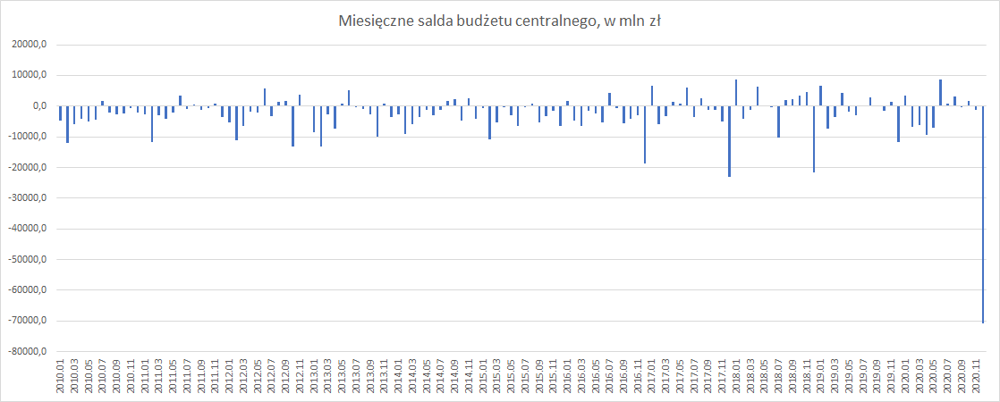
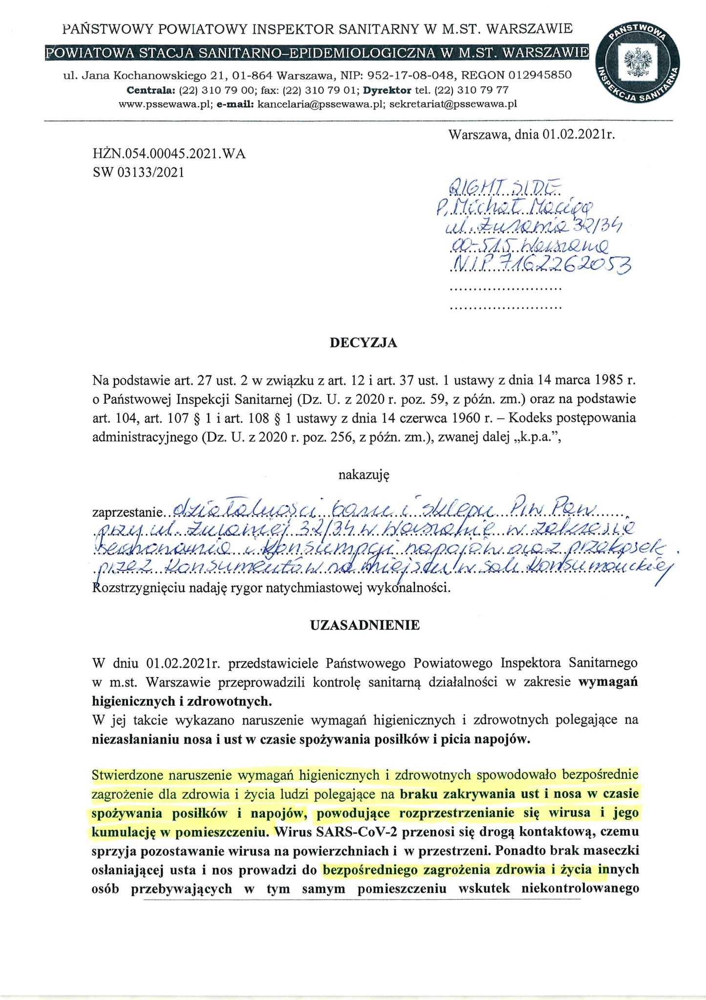
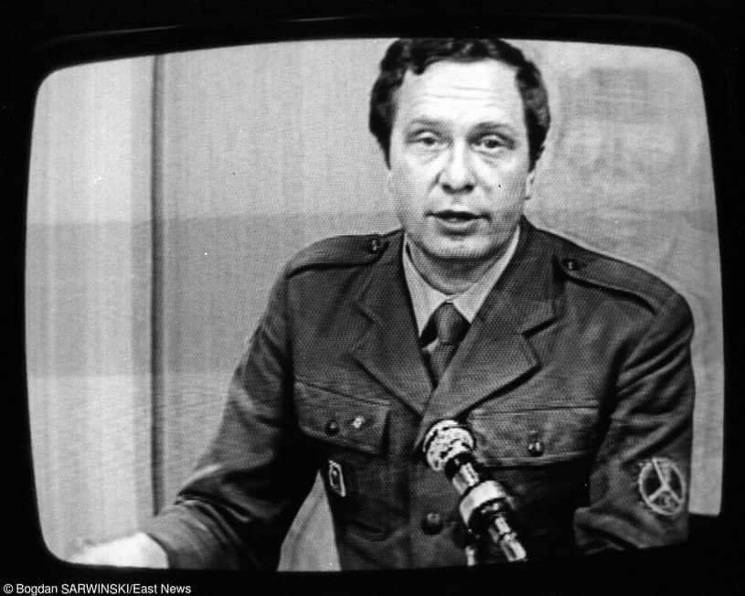
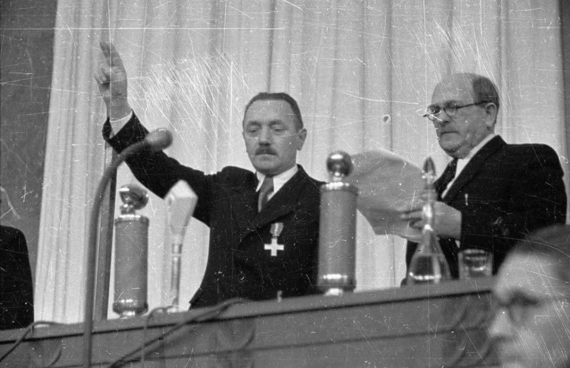
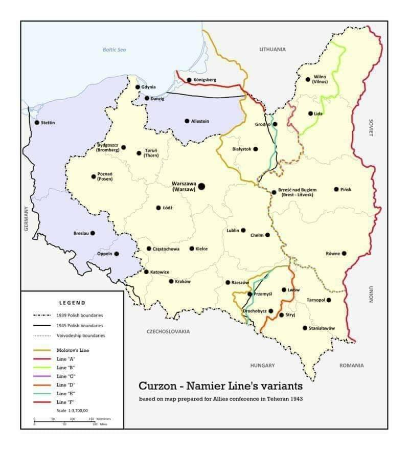
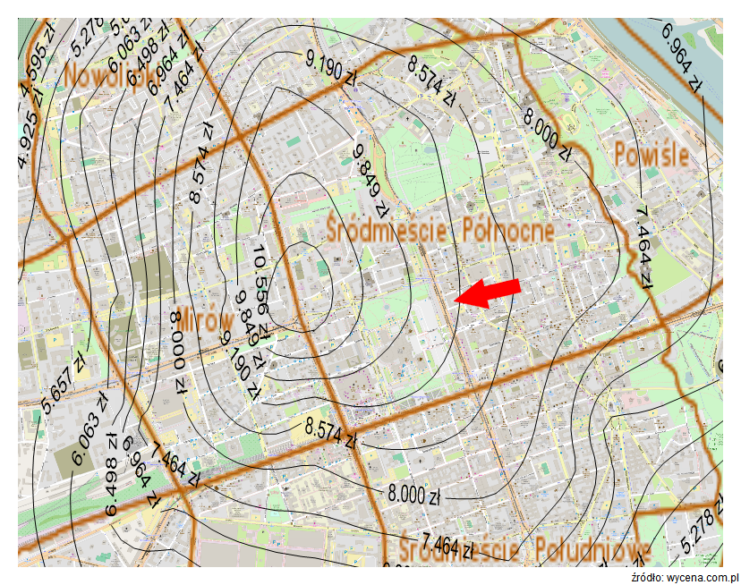

### 2021

Jeśli deficyt budżetowy w 2020 roku wyniósł 84 mld złotych, a po listopadzie wynosił 13 mld złotych, to znaczy, że w grudniu sięgnął 71 mld złotych, co jest nowym, imponującym rekordem Polski (choć oczywiście budżet centralny nie mówi wszystkiego o finansach publicznych kraju)

  

---

Drugi próg podatkowy:

2009 - 85 528 zł

2021 - 85 528 zł

Polacy w drugim progu podatkowym:

2009 - 387.000

2020 - 1.500.000 (prognoza)

Gdy wprowadzono drugi próg PIT (32%) w 2008 r. by załapać się na wyższą stawkę, trzeba było zarabiać prawie 3-krotność przeciętnego wynagrodzenia, obecnie wystarczy 1,26-krotność.

---

  

---

### 2019

  

### 1982

W Świdniku odbyła się pierwsza z z tak zwanych " manifestacji spacerowych". Ta bardzo osobliwa forma protestu, polegająca na ostentacyjnym wychodzeniu z domu o godzinie 19.30 czyli w porze nadawania Dziennika Telewizyjnego była wyrazem dezaprobaty społcznej wobec poczynań komunistycznej propagandy telewizyjnej. W kolejnch dniach protest ten przybrał formę ogólokrajową.
Starsi Fani naszej strony zapewne jeszcze bardzo dobrze pamiętają prezenterów Dziennika Telewizyjnego ubranych w wojskowe mundury.
Na zdjęciu jeden z nich, Marek Tumanowicz.

  

### 1947

Wyłoniony w wyniku sfałszowanego głosowania Sejm Ustawodawczy wybrał na prezydenta Polski Bolesława Bieruta (na zdjęciu po lewej)- działacza komunistycznego, przewodniczącego Krajowej Rady Narodowej, agenta NKWD.
Sam sposób obsadzenia Bieruta na urzędzie prezydenta budzi sporo wątpliwości natury konstytucyjnej, ponieważ w tym okresie parlament był jednoizbowy, co uniemożliwiało wybranie głowy państwa przez Zgromadzenie Narodowe, czego wymagał artykuł 39 Konstytucji marcowej. Przyjęta zatem została ustawa konstytucyjna, której zapisy pozwalały na dokonanie wyboru prezydenta jedynie przez Sejm.
Bierut był zwolennikiem uzależnienia Polski od Związku Radzieckiego oraz animatorem prześladowań działaczy podziemnych organizacji antykomunistycznych i niepodległościowych. Co ciekawe swoje zaprzysiężenie zakończył słowami " Tak mi dopomóż Bóg".
Urząd ten pełnił do 20 listopada 1952 roku, czyli do momentu wyboru przez Sejm Rady Państwa. W uchwalonej 22 lipca Konstytucji PRL nie było urzędu prezydenta Polski.

  

### 1946

Weszła w życie zawarta 16 sierpnia 1945 roku polsko- radziecka umowa graniczna.
Na jej mocy, wschodnią granicę Polski miała wyznaczać tak zwana Linia Curzona ( pierwotnie w czasie wojny polsko-bolszewickiej w roku 1920 linia demarkacyjna rozdzielająca działania wojsk polskich i bolszewickich).
Umowę, która formalnie kończyła tak zwany okres " polskiej okupacji kresów wschodnich" podpisali premier Rządu Tymczasowego Edward Osóbka Morawski i minister spraw zagranicznych ZSRR Wiaczesław Mołotow.

  

### 1897

Carska „świnka” i ponad wiekowa stałość fundamentalnych relacji cenowych

W lutym 1897 r. Towarzystwo Ubezpieczeń „Rosja” dokonało zakupu działki budowlanej, na której wzniosło swój „dom dochodowy”. Za sumę 315.000 rubli nabyto działkę o powierzchni około 4 tysięcy metrów kwadratowych na rozparcelowanych terenach Szpitala Dzieciątka Jezus, pomiędzy ulicami Sienną, Marszałkowską i Moniuszki. Aktualnie jest to posesja przy ul. Marszałkowskiej 124, pomiędzy ulicami Sienkiewicza a Moniuszki, tzw. przez warszawiaków „Dom pod Sedesami„, gdzie ma swoją siedzibę oddział banku PKO BP.

Zaciekawiło nas jak cena zapłacona w 1897 r. za grunt w tym reprezentacyjnym miejscu ma się do aktualnych cen w tym samym miejscu. Aby uzyskać pewną informację o cenie jednostkowej zapłaconej ówcześnie, dla pewności dokonaliśmy obmiaru działki (dotyczy to dzisiejszej dz. nr 17 z obrębu geodezyjnego 5-03-10). Okazało się, że dokładniej ma ona 3.760 m2.
Cena jednostkowa zakupionego w 1897 r. gruntu wyniosła więc: 83,78 rubli/m2.

Ile to byłoby w dzisiejszych cenach wyrażonych w złotówkach?
Dość ciężko jest to przeliczyć na aktualne pieniądze. Po drodze wojny, rewolucje, okupacje, wymiany walut i denominacje. Ale jednak spróbujmy, przynajmniej relatywnie.

Wskazówką niech będzie „świnka” – 5-rublowa złota moneta obiegowa. Złota 5-rublówka, zwana była „świnką” dlatego, że jej wartość odpowiadała w przybliżeniu cenie jednej żywej świni. To powinno nam pozwolić znaleźć archimedesowy „punkt podparcia”. Możemy bowiem przeliczyć ówczesne ruble uwzględniając dzisiejszą wartość żywej świni.

Ile więc to będzie dziś uwzględniając cenę skupu żywca wieprzowego i wagę świni?

Średnia cena skupu żywca wieprzowego w wadze żywej wynosi aktualnie wg danych z 02.02.2015 r. 3,83 zł/kg – na podstawie 35 cenników firmowych – dane portalu cenyrolnicze.pl za money.pl). Problem jednak w tym, że ceny wieprzowiny cechują się dość znaczną zmiennością. Aktualnie mamy właśnie bardzo silny „świński dołek” i ceny żywca wieprzowego są bardzo niskie, znacznie niższe niższe niż prognozy.

Dla porównania wg GUS w ceny skupu żywca marcu 2014 wynosiły 4,73 zł/kg (+24%) a w marcu 2013 aż 5,35 zł/kg (+40%). Dodatkowo w cenach skupu świń występuje bardzo silna sezonowość – ceny w styczniu-marcu są najniższe w całym roku. Uwzględniając, że „świnka” reprezentowała raczej typową, średnią cenę świni w dłuższym czasie, sensowne więc i bardziej reprezentatywne będzie raczej przyjąć ceny średnie. Przyjąłem średnie ceny z 12 miesięcy październik 2013 – wrzesień 2014 wg danych GUS (dane za WODR Poznań), która wyniosła w okresie tego roku ok. 4,95 zł/kg. Pierwszy parametr więc mamy.

Trudniej jest z danymi określającymi typową wagą tucznika. Zasadniczo pisze się, że jest to przedział ok. 100-120 kg. Dane z internetu wg wypowiedzi hodowców świń określających średnią wagę tuczników przez nich odstawianych do skupu w ciągu jakiegoś dłuższego okresu dały odpowiedź, że średnia waga świni w skupie wynosi ok. 109 kg/świnię. Drugi parametr także mamy.

Mając te dane możemy stwierdzić, że typowa cena świni aktualnie to: 4,95 zł/kg x 109 kg = 539,55 zł.

5 rubli „świnka” odpowiada więc 539,55 zł a jeden rubel to 539,55/5, co odpowiada przeliczeniu wartości na poziomie 107,91 zł dzisiejszych zł za ówczesnego rubla.

Można także poziom cen określić wychodząc nie od świń a od krów. W „Placówce” Bolesława Prusa jest wzmianka, że Ślimakowa kupiła krowę za 33 ruble. Wg informacji portalu forum Spółdzielczości Mleczarskiej za listopad 2014 o cenach targowiskowych krów mlecznych średnia cena krowy wynosiła 3.438 zł a w poprzednim tygodniu 3.667 zł. Przyjmijmy średnio 3.553 zł/krowę. Jeśli odpowiada to ówczesnym 33 rublom, to wartość dzisiejsza jednego rubla wyniesie… 107,67 zł/rubla. Czyli dokładnie tyle samo.

Oczywiście, można spróbować jeszcze prościej, pamiętając, że złota świnka, to po prostu złota moneta o wadze 4,3 g o próbie 900. Ówcześnie bez wartości numizmatycznej a jedynie tezauryzacyjnej (ceny numizmatyczne są trochę wyższe). Aktualny kantorowy kurs skupu złota o próbie 900 wynosi 126,20 zł/gram. Daje to wartość złota w „śwince” wynoszącą 126,20 zł/gr x 4,3 g = 542,66 zł, co daje identyczną w zasadzie wartość 542,66 zł/5 = 108,53 zł za ówczesnego rubla.

Z różnych wzmianek w literaturze (np. u Dostojewskiego, Dąbrowskiej, Prusa itd.), gdzie są podawane różne ceny w rublach także można wywnioskować, że siła nabywcza ówczesnego 1 rubla była rzędu ok. 100 zł dzisiejszych, co znajduje niezależne potwierdzenie w przeliczniku kursu „świnki”.

Przykładowo: Marmieładow za buty, gorsy z kolońskiego płótna i „wicmundur” zapłacił 11 rubli i 5 kopiejek (co odpowiadałoby ok. 1192 zł). Matka Majakowskiego otrzymała po mężu 10 rubli miesięcznego zasiłku (odpowiadałoby to ok. 1080 zł), co uchodziło za głodowe. Tyle samo (120 rubli rocznie) wynosi emerytura matki Raskolnikowa. Raskolnikow tłumaczył różne głupoty wg stawki 3 ruble za arkusz, co stanowi ok. 22,2 strony znormalizowanego maszynopisu, czyli wg stawki 14,58 zł/stronę. Barbara Niechcicowa dziedziczy 6.000 rubli za co chciała kupić dom w Kalińcu (odpowiadałoby to ok. 650 tys. zł). Kamienica Łęckich była wyceniana realnie na 60.000 rubli (co odpowiadałoby ok. 6.475.000 zł).

Jaka więc była cena jednostkowa cena gruntu zakupionego w lutym 1897 r. przez Towarzystwo Ubezpieczeń „Rosja” w przeliczeniu siły nabywczej ówczesnych rubli na dzisiejsze złotówki?

Możemy policzyć: 83,78 rb/m2 x 107,91 zł/rb = 9.041 zł/m2 gruntu (netto bez VAT, którego wtedy nie znano).

Nas, oczywiście interesuje najbardziej, jak ta cena z 1897 r. ma się do cen aktualnych dla tego gruntu?
Czy grunty podrożały czy potaniały w okresie tych ponad 100 lat?

Aby to stwierdzić możemy posłużyć się opracowaną na podstawie danych transakcyjnych mapą cenową dla gruntów m.st. Warszawy stworzoną w Dziale Analiz realexperts.pl we współpracy merytorycznej z Polskim Instytutem Wyceny, która została zaprezentowana i upubliczniona w zeszły wtorek (27 stycznia 2015 r.) na Konferencji „Obiektywna wycena wartości. Możliwości i zastosowania nowoczesnej wyceny nieruchomości na przykładzie systemu ekspertowego dla m.st. Warszawy”.

Poniżej prezentujemy fragment mapy cenowej, na której można odnaleźć wskazaną działkę i odczytać cenę dla danego punktu. Miejsce położenia nieruchomości jest zaznaczone strzałką. Przez działkę przechodzi izopreta (linia cen) 9.190 zł/m2, obrazująca typową cenę gruntu w tym miejscu dla typowych cech rynkowych.

  

Jakie wnioski? Przede wszystkim należy zauważyć, że cena tego gruntu wykazywana przez mapę cenową opracowaną w 2015 r. oraz jego cena zapłacona przez Towarzystwo Ubezpieczeniowe „Rosja” w 1897 r., po przeliczeniu na dzisiejsze pieniądze, pokrywają się z dokładnością ok. 1,6%(!). Przy przyjęciu aktualnej wartości złota w ówczesnym rublu mamy wartość jeszcze bardziej zbliżoną do ceny wykazywanej przez mapę cenową (9.093 zł/m2 gruntu), co stanowi różnicę ok. 1,0%.

Trzeba przyznać, że rezultat jest wręcz zadziwiający.
Pokazuje po pierwsze, jak skutecznym narzędziem jest mapa cenowa zbudowana na bazie analizy cen transakcyjnych. Po drugie,  jak ważne i trwałe są wzajemne relacje między cenami najistotniejszych dóbr (tu: żywności i nieruchomości oraz złota). Za ten sam grunt w 1897 r. i w 2014 r. trzeba było zapłacić równowartością takiej samej liczby świń, krów i takiej samej ilości złota.

---

<a href="https://github.com/TomaszWaszczyk/historia.waszczyk.com/edit/master/src/content/february-5.md" target="_blank">Edytuj tę stronę dzieląc się własnymi notatkami!</a>
