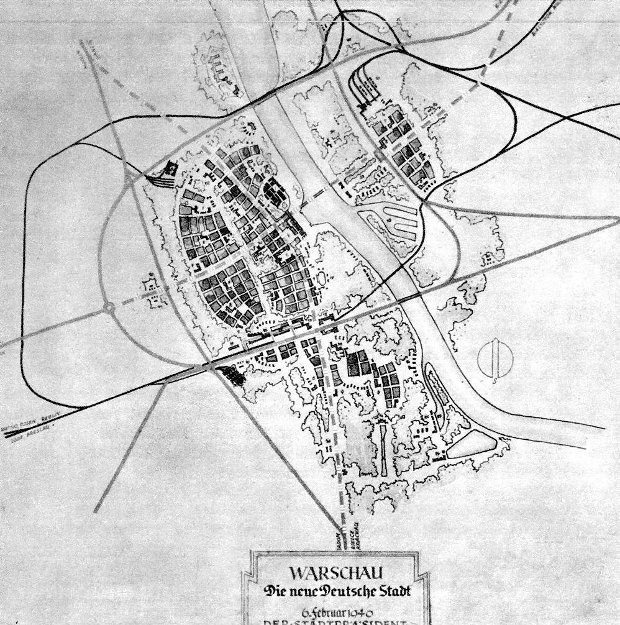

### 2023

Ostatnie podrygi pajacowania:

  

### 2021

<a href="./documents/february/hanke-krus-hyperinflation-table-may-2013.pdf" target="_blank">HYPERINFLATION TABLE</a>

---

kredyt !== pożyczka

---

Rząd przyjął sowiecką metodę stalinowskiego prokuratora Andrzeja Wyszyńskiego - "dajcie mi człowieka, a znajdę na niego paragraf". W sumie nie powinno to dziwić, że bolszewicka partia stosuje bolszewickie metody. Na przedsiębiorców zostali wysłani przedstawiciele Sanepidu, straży pożarnej, skarbówki i policja. Sanepid przychodził z gotowymi decyzjami, które powinny zostać sporządzone dopiero po kontroli, a nie przed. Bandycki rząd wykorzystuje wszystkie możliwe instytucje i przepisy do tępienia przedsiębiorców. 
A gromadzony od lat arsenał przepisów mają ogromny. Od dawna powtarzam, że nie ma w Polsce przedsiębiorcy, który działa zgodnie z wszystkimi przepisami. Najróżniejszych obowiązków, często zupełnie kretyńskich, przestarzałych i przez nikogo nieprzestrzeganych mamy mnóstwo. Pół biedy, póki istnieją tylko teoretycznie, gorzej, jeżeli władza sobie o nich przypomina. A teraz sobie przypomnieli. Spodziewać się można najazdu bandy urzędników sprawdzających, czy ktoś ma odpowiednią naklejkę i właściwy kwitek, czy spełnia wszystkie normy budowlane i sanitarne, czy nie ma ryzyka pożarowego i czy budynek na pewno się nie zawali. To jest szykanowanie legalnie działających przedsiębiorców i ktoś z góry, kto wydał takie polecenia, powinien kiedyś za to odpowiedzieć.

Czasem bywa jeszcze gorzej. Na jednej z ferm norek na Pomorzu u czterech norek testy wykryły koronę. Z tego powodu właśnie gazowanych jest tysiące pozostałych norek, następnie zniszczone zostaną ich wiaty. Właściciel z pracownikami zostali wysłani na kwarantannę, dzięki czemu nawet nie mogą się bronić przed tą niegodziwością. Straty wyniosą kilka milionów złotych. Właściciel fermy nie dostanie ani złotówki odszkodowania. Wyobraźcie sobie, że to was rząd pozbawia dorobku całego życia, majątku firmy wartego miliony złotych. Jak byście się czuli? Czy w cywilizowanym państwie takie coś jest dopuszczalne? Gdy kasjer w Biedronce źle wyda wam resztę, czujecie się oszukani? To teraz pomyślcie, że jakiś urzędnik zabiera wam mieszkanie, samochód, zwalnia z pracy i zeruje konto. Jak wyrazić to uczucie?
Informacja dla ludzi, którzy wydają te bandyckie decyzje: nie jesteście anonimowi. Mam gdzieś waszą obronę, że tylko wykonujecie rozkazy. Niszczycie ludziom życie, pozbawiacie całe rodziny źródła utrzymania. Też powinniście odpowiedzieć za swoje działania. Taka Ewa Nowak-Wąsicka z toruńskiego Sanepidu, która właśnie postanowiła wykończyć Smaki Indii, powinna się wstydzić tego co robi. Gdybym miał kawiarnie czy restaurację, to bym jej już nigdy nie obsłużył. Takich ludzi jest więcej, każdy z was ma w swoim mieście przedstawicieli aparatu opresji, którzy egzekwują to bezprawie, którzy tylko wykonują rozkazy.
To państwo wytoczyło otwartą wojnę przedsiębiorcom. Trzeba się bronić, jakkolwiek kontratakować, póki jest jeszcze czego bronić.

Dlatego zapraszam na stronę zapytajsanepid.pl. Okazało się ostatnio, że pracownicy Sanepidu mają zbyt dużo wolnego czasu, zamiast zajmować się tym, czym powinni, chodzą po restauracjach. Może warto ich zapytać o kilka spraw w trybie dostępu do informacji publicznej, będą mieli mniej czasu na głupoty.

---

### 1940

Został przedstawiony tzw. plan Pabsta, przewidujący 10-krotne zmniejszenie i przebudowę Warszawy.
Zespół urbanistów pod kierunkiem Friedricha Pabsta, od 1939 r. naczelnego architekta Warszawy, zaprezentował projekt „Die neue Deutsche Stadt Warschau” (Nowe niemieckie miasto Warszawa). Przewidywał on przebudowanie stolicy, a przede wszystkim zredukowanie jej do niewielkiego, kilkudziesięciotysięcznego miasteczka. Na prawym brzegu Wisły, na mniej więcej 6 km kw., miały powstać osiedla dla niemieckich urzędników administrujących podbitymi terenami na Wschodzie. Natomiast na Pradze na powierzchni zaledwie 1 km kw. miały powstać domy dla polskich niewolników, których liczebność szacowano na 30-80 tys. Jednym z pomysłów niemieckich urbanistów było wybudowanie w miejscu Zamku Królewskiego wielkiej hali widowiskowej.

  

---

### 1922

Rodzi się Witold Kieżun https://en.wikipedia.org/wiki/Witold_Kie%C5%BCun

### 1910

Urodził się Roman Czerniawski

---

<a href="https://github.com/TomaszWaszczyk/historia.waszczyk.com/edit/master/src/content/february-6.md" target="_blank">Edytuj tę stronę dzieląc się własnymi notatkami!</a>
