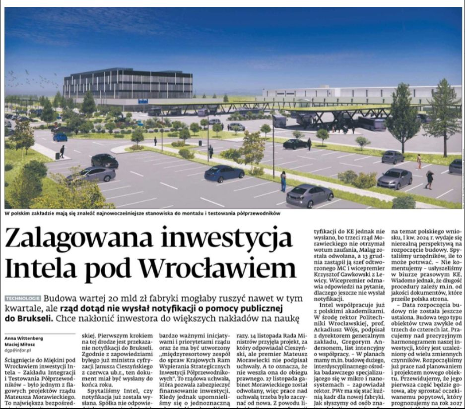
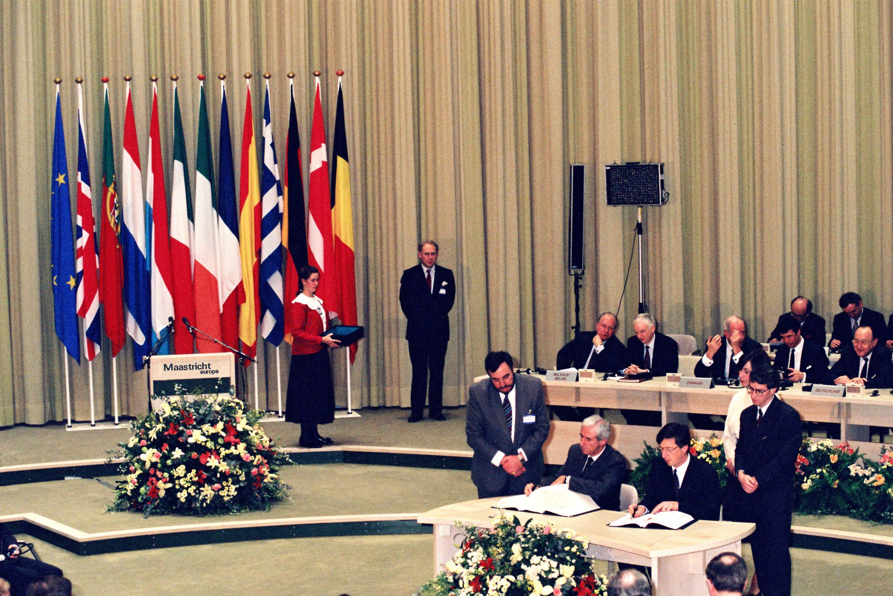
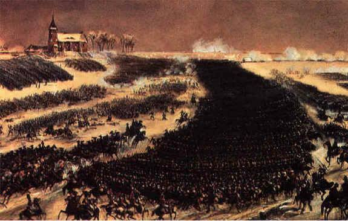

### 2024

  

✔ Trzy miesiące temu słyszeliśmy w kierownictwie firmy, że inwestycja ruszy w I kw. 2024. Termin wydaje się nierealny.
✔ Rząd nie przesłał do Brukseli notyfikacji pomocy publicznej. Bez tego nie będzie można przekazać subsydiów. Chodzi o ok. 6 mld zł.
✔Najpierw sprawę opóźniły dwa rząd PiS - uchwałę o przekazaniu RM podejmowała dwa razy, bo za pierwszym premier jej nie podpisał. A potem rząd odwołano, sprawę przejął gabinet dwutygodniowy.
✔Od 1,5 miesiąca notyfikacji nie wysyła rząd Koalicji.
✔Nasze źródła w rządzie mówią: chcemy renegocjować umowę, żeby Intel przy okazji budowy fabu dał więcej pieniędzy na polską naukę.
✔Słyszymy też, że budowa nie jest zagrożona. 

### 2023

Nowy Jork (PAP/AFP) - W miarę wzrostu ryzyka eskalacji na Ukrainie świat zmierza "z szeroko otwartymi oczami" w kierunku "wojny na szerszą skalę" - oświadczył w poniedziałek sekretarz generalny ONZ w przemówieniu, w którym przedstawił priorytety organizacji na rok 2023.

"Wojna na Ukrainie, kryzys klimatyczny, skrajne ubóstwo... Rok 2023 rozpoczęliśmy, myśląc o zbieżności wyzwań, jakich nie widziano za naszego życia" - powiedział Guterres przed Zgromadzeniem Ogólnym ONZ.

Przypomniał, że grupa naukowców, "monitorujących zegar zagłady również niedawno oszacowała, że ludzkość nigdy nie była tak blisko końca świata i teraz jest 90 sekund przed północą", co powinno oznaczać, jego zdaniem, "włączenie się sygnału alarmowego".

"Musimy się obudzić i zabrać do pracy" - mówił szef ONZ i podkreślił, że najważniejszym obecnie wyzwaniem jest wojna na Ukrainie. "Perspektywy pokoju wciąż się kurczą. Ryzyko dalszej eskalacji i rzezi wciąż rośnie" - ocenił.

"Myślę, że świat nie podąża jak lunatyk w kierunku szerszej wojny, ale obawiam się, że tak naprawdę robi to z szeroko otwartymi oczami" - powiedział i jednocześnie zwrócił uwagę na inne niebezpieczne konflikty, jak ten między Izraelem a Palestyńczykami, sytuację w Afganistanie, Birmie, w Sahelu czy na Haiti.

"Gdyby wszystkie kraje wypełniały swoje zobowiązania wynikające z Karty ONZ, prawo do pokoju byłoby zagwarantowane" - mówił Guterres i podkreślił, że poszanowanie praw człowieka powinno znajdować się w centrum wszelkich wartości.

Guterres potępił też brak "wizji strategicznej" i "zamiłowanie" decydentów politycznych oraz ekonomicznych do krótkoterminowych działań.

"Następne wybory. Następny manewr polityczny, by utrzymać się przy władzy lub kursy akcji następnego dnia. To krótkoterminowe myślenie jest nie tylko głęboko nieodpowiedzialne, ale i niemoralne" - powiedział Guterres, zwracając uwagę na potrzebę myślenia o przyszłych pokoleniach i ponawiając apel o "radykalną transformację" globalnej architektury finansowej.

"Coś jest zasadniczo nie tak z naszym systemem gospodarczym i finansowym" - oznajmił, wskazując na wzrost ubóstwa i głodu, przepaść między bogatymi a biednymi czy ciężar zadłużenia krajów rozwijających się.

"Bez fundamentalnych reform najbogatsze kraje i jednostki będą nadal gromadzić bogactwo, pozostawiając jedynie okruchy dla społeczności i krajów biednych" - apelował.

W swoim przemówieniu po raz kolejny zaatakował również sektor paliw kopalnych: "Jeśli nie możesz zaplanować wiarygodnej ścieżki do neutralności pod względem emisji dwutlenku węgla, z celami na lata 2025 i 2030, obejmującymi wszystkie twoje operacje, nie powinieneś prowadzić biznesu" - powiedział. (PAP)

### 2021

Krótka notka, trochę nie w temacie inwestycyjnym, ale przy szerszym spojrzeniu to i w temacie giełdowym. / Nie wierzę w przyjaźnie międzynarodowe, bo wystarczy spojrzeć w przeszłość na wydarzenia z ostatnich wieków na świecie. Wierzę za to we współpracę gospodarczą między krajami oraz w występowanie na świecie prawa silniejszego. Gdy jesteś słaby i nieprzygotowany, wrogom włącza się instynkt mordercy, instynkt wojny. Czy Polska jest dziś silna i bezpieczna? Niech każdy sobie sam odpowie. Dzisiejsze czasy są dość niepewne. Piszę to, bo akurat czytam książkę o wielkich mowach, różnych przywódców światowych. Są w niej mowy m.in Hitlera, Stalina, Churchilla prezydentów, generałów z okresów I i II WŚ itd. ("Mowy które zmieniły świat" - polecam). I niestety czytając te mowy, widzę dziś identyczne postawy i kłamstwa tych przywódców, którzy wtedy rozpętali piekło. Z jednej strony były pretensje terytorialne, ochrona obywateli, z drugiej strony tchórzostwo, kulenie ogona i oddanie niektórych państw jako ofiary za "święty spokój" dla zachodnich państw. Niestety z książki wynika bardzo wyraźnie, że agresorzy połykając jeden kraj lub obszar, pomimo kwiecistych i pięknych deklaracji pokojowych i zapewnień, że chodzi im tylko o niewielkie terytorium i mini konflikt, stają się niesyci i idą dalej za ciosem. Mała uległość i łatwość podbicia terytorium budzi w nich apetyt na więcej. To taka moja dygresja z okazji tej rocznicy. Czytając wypowiedzi gen. Polko oraz artykuły o wycofaniu ponad 30 tys żołnierzy ze służby do 2020, zastanawiam się, co nas czeka i kto nami rządzi. Rosja podnosi wydatki na wojsko o 21,2% już od 2015 r., a u nas wydatki wzrosną o 0,05%... od 2016. W zapewnienia NATO i USA o wielkiej przyjaźni i gotowości obrony jakoś do końca nie wierzę. Po owocach ostatnich wydarzeń i historycznych zapewnieniach zachodu o obronie Polski widać, że to tylko gra polityczna. Módlmy się o pokój.

> Songa Hongbinga: „Polska, Węgry, Rosja, Ukraina – wszystkie te państwa dotknęła bolesna utrata własnego majątku, co doprowadziło do tego, że od dwóch dekad ich gospodarki wciąż nie mogą odzyskać sił. (…) Mamy do czynienia z pierwszym w dziejach przypadkiem, w którym grupa dość silnych państw stała się ofiarą zorganizowanego rabunku”.

<!-- "Remember when after the financial crisis Ben Bernanke told Congress he'd bring the Fed's balance sheet back down to $1 trillion or less?
After that he launched QE2, Operation Twist and QE3 and ballooned it up to $4.5T instead. Powell has now bloated it up to the current $8.7T." -->

### 2020

WHO:

"Masks don't necessarily protect you"

### 1992

On 7 February 1992, the Treaty on European Union was signed by 12 countries in the Dutch city of Maastricht, which lay the foundations for the EU as we know it today.

The result of several years of discussions between governments, the Maastricht Treaty marks a new step in the process of creating an ever closer union among the peoples of Europe, based on 3 pillars:

📜 European citizenship
📜 Common foreign and security policy
📜 Cooperation in the field of justice and home affairs.

The treaty also paved the way for the creation of a single European currency - the euro - and established the European Committee of the Regions, the assembly of regional and local representatives coming from all EU countries.

Today, more than 440 million citizens from 27 countries enjoy the benefits of European cooperation.

The Maastricht Treaty entered into force on 1 November 1993. Learn more about this important milestone

  

### 1807

IV koalicja antyfrancuska: rozpoczęła się bitwa pod Iławą Pruską.
Cofnijmy się do roku 1806. Napoleon, jeden z największych geniuszy wojskowych w historii, przebywał w jednym z paryskich pałaców. W swoim gabinecie, popijał ulubione wino i spoglądał na marmurowe popiersia Aleksandra Macedońskiego i Juliusza Cezara. Wydawało się, że tylko oni są godni przebywać w jednym pomieszczeniu z Cesarzem Francuzów.
Rok wcześniej pokonał on w bitwie pod Austerlitz, sprzymierzone armie austriacko-rosyjskie. Francja nigdy nie była tak silna. Jednakże Anglia, nie mogła patrzeć jak jej sprzymierzeńcy ponoszą klęskę za klęską i szykowała pieniądze na kolejną koalicję (czwartą z kolei).
Napoleon zebrał tyle armii ile zdołał i postanowił uprzedzić uderzenie Prusaków. W październiku 1806 roku, wojna rozgorzała na dobre. Armia Pruska była niegdyś uważana za najlepszą na kontynencie, jednak jak się wkrótce okazało, lata świetności miała już dawno za sobą. Podczas bitwy pod Jeną-Auerstedt (14 X 1806) wojska francuskie doszczętnie rozbiły przeciwnika. Zginęło lub zostało rannych ok. 60 tys. żołnierzy pruskich, natomiast ok. 140 tys. dostało się do niewoli. Droga na Berlin stała otworem. Król pruski Fryderyk Wilhelm III był zdany na łaskę korsykańskiego diabła.
Z terenu Prus, wojna przeniosła się na tereny nieistniejącej od kilkunastu lat I Rzeczypospolitej. Na Napoleona czekała doborowa armia rosyjska. Wprawdzie w zeszłym roku pokonał ją w tzw., bitwie trzech cesarzy (Austerlitz), jednakże wiedział, że stanowi ona większe wyzwanie, aniżeli przestarzała armia Prus. Nie omylił się.
Kiedy żołnierze francuscy wkroczyli do Wielkopolski (1 XI 1806), rozpoczęła się tzw., wojna polska. Napoleon zamierzał pokonać Rosjan i zmusić cara do przystąpienia do blokady kontynentalnej, skierowanej przeciwko Anglii. Pod koniec roku doszło do dwóch nierozstrzygniętych bitew: pod Pułtuskiem i Gołyminem (obie 26 XII 1806), po których Rosjanie się wycofali (szerszy opis bitew oraz, to co powiedział Napoleon o polskich drogach, znajdziecie na moim blogu). Napoleon, widząc kiepski stan polskich dróg, postanowił przerwać kampanię i poczekać, aż przyjdą mrozy i skują zalegające na drogach błoto.
Bitwa:
Dowództwo rosyjskie planowało uderzyć na rozdzieloną armię francuską. Kiedy Napoleon się o tym dowiedział, błyskawicznie połączył swoje oddziały. Jego przeciwnicy przechwycili francuskiego kuriera, który miał ze sobą list, a w nim była wyszczególniona liczba francuskich oddziałów. Okazało się, że Napoleon dysponuje sporo liczniejszymi siłami. Rosjanie bojąc się przeciwnika, zaczęli się wycofywać. Mały kapral ścigał swoich oponentów, aż zmęczeni Rosjanie postanowili przyjąć bitwę.
Co prawda, armia francuska miała przewagę w ludziach, ale Rosjanie mieli ponad dwukrotną przewagę w artylerii. Nie omieszkali tego wykorzystać. 7 lutego, po godzinie 14.00 rozgorzały walki o Iławę. Francuska awangarda, na czele której stanął marszałek Soult, zaatakowała Rosjan, którzy odpowiedzieli huraganowym ogniem artylerii. Pod koniec dnia, udało się trójkolorowym zdobyć Iławę. Jednakże dużo francuskiej krwi zostało wtedy rozlanej.
Następny dzień był jednym z najkrwawszych w historii wojen napoleońskich. Francuzi planowali otoczyć Rosjan, niczym Hannibal Rzymian pod Kannami, a następnie wyciąć ich w pień.
Artylerzyści rosyjscy nie byli gościnni i postanowili pobudzić swoich przeciwników z samego rana, ostrzeliwując Iławę. Napoleon nie mógł jeszcze atakować, ponieważ czekał na połączenie wszystkich korpusów. Rozkazał swoim żołnierzom stać wytrwale na pozycjach.
Warunki na początku bitwy były znośne. Na polach zalegał śnieg, a lekki mróz niewiele przeszkadzał. Kiedy Francuzi rozpoczęli natarcie na wroga, po niedługim czasie zaczęli odnosić sukcesy. Jednakże, wszystko zmieniło się, kiedy rozpętała się burza śnieżna. Wiatr wiał prosto w oczy żołnierzom Wielkiej Armii. VII Korpus marszałka Augereau atakujący lewą flankę Rosjan, zgubił drogę i skręcił w lewo, kierując się na centrum wojsk rywala. Artylerzyści rosyjscy tylko na to czekali. Pozwolili podejść rywalom na odległość 100 kroków i zaczęły się dantejskie sceny. Kartacze poszły w ruch, miażdżąc, rozrywając i kalecząc ciała niespodziewających się takiego obrotu spraw Francuzów. Rozpętało się istne piekło. Po 20 minutach, 12 tysięczny korpus był rozbity, a dzieła zniszczenia dokonała jazda ks. Golicyna.
Napoleon, który ulokował swój sztab na iławskim cmentarzu, dowiedziawszy co się dzieje rozkazał marszałkowi Muratowi przygotować kawalerię do ataku.
– Joachimie, nie pozwolisz chyba, by ci Azjaci zjedli nas żywcem?- powiedział do niego Cesarz.
Rozpoczęły się wówczas szarże kawalerii, które ze względu na liczbę biorących w niej udział żołnierzy, wspominano nawet po wielu latach. Szala zwycięstwa zaczęła przechylać się w stronę Wielkiej Armii. III Korpus marszałka Davouta walczył bardzo dzielnie. Niemal przez cały czas przyjmował na siebie silne ataki wroga. Kiedy już wydawało się, że zwycięstwo jest w zasięgu ręki, do akcji wkroczył pruski korpus gen. L’Estocqa, który skutecznie wymanewrował ścigającego go marszałka Neya. Tak wzmocnieni Rosjanie, nie mogli już tego dnia zostać pokonani.
Zakończenie:
O godz. 22.00 walki ustały. Żołnierze zaczęli rozpalać ogniska, które razem z płonącymi wsiami oświetlały rejon pobojowiska. Francuzi stracili tego dnia 13 tys. zabitych i rannych oraz 5 tys. wziętych do niewoli żołnierzy. Rosjanie zaś ok. 25 tys. zabitych i rannych (z czego 5 tys. rannych zostawiono na pobojowisku). Obie armie były ogromnie wyczerpane. Francuzi po bitwie wznosili okrzyki „Vive Le Paix” (niech żyje pokój), zamiast standardowych „Vive L’Empereur”.
Dowództwo rosyjskie po długich naradach postanowiło wycofać się razem z armią w stronę Królewca. Na rozstrzygający wynik kampanii należało poczekać do wiosny.

  

### 1783

Wojna o niepodległość Stanów Zjednoczonych: sprzymierzone z Amerykanami wojska hiszpańsko-francuskie zakończyły trwające od czerwca 1779 roku nieudane wielkie oblężenie Gibraltaru.
Dzieje Gibraltaru były bardzo burzliwe i związane przede wszystkim z jego położeniem na szlaku z Afryki do Europy i z Morza Śródziemnego na Atlantyk.
Osadnictwo na Skale Gibraltarskiej znane jest od czasów prehistorycznych. W jednej z jaskiń (jaskinia Devil's Tower) w południowej części Skały znaleziono szczątki neandertalczyków (kobiety i dziecka) i narzędzia kultury lewaluaskiej z końca ostatniego interglacjału (Riss-Wierm).
Pod koniec X wieku przed naszą erą zaczęli tu docierać feniccy żeglarze, którzy dwie skały wyznaczające koniec Morza Śródziemnego nazwali Słupami Melkarta. Wspomniane Słupy to Skała Gibraltarska i Abyle w Ceucie po afrykańskiej stronie Cieśniny Gibraltarskiej. Fenicjanie pod koniec IV stulecia przed naszą erą ustąpili miejsca Grekom, którzy pozostawili po sobie na tym terenie ślad w postaci przemianowania Słupów Melkarta na Słupy Herkulesa. Stanowiły one odtąd granicę zasięgu kultury greckiej. Następnymi odwiedzającymi Gibraltar w starożytości byli Kartagińczycy, którzy pojawili się tutaj w III wieku p.n.e. W wyniku kolonizacji kartagińskiej obejmującej obszary od Gibraltaru po Almerię osiedlili się tu tzw. Libiofenicjanie (czyli mieszanka etniczna powstała wskutek kolonizacji wybrzeży Afryki przez Fenicjan).
W okresie wojen punickich wznieśli oni na Skale Gibraltarskiej wieżę strażniczą (była to pierwsza budowla stała na tym terenie), z której obserwowano rzymskie galery próbujące sforsować Cieśninę Gibraltarską. Skutkiem wojen punickich, zakończonych zburzeniem przez Rzym Kartaginy było opanowanie Skały przez Rzym w roku 146 p.n.e. W czasach rzymskich Gibraltar nosił nazwę Mons Julia, a założona tu kolonia latyńska dla byłych żołnierzy nazywała się Julia Calpe (171 rok p.n.e.) i była jednym z ośrodków romanizacji południowej i wschodniej Hiszpanii. Pod koniec istnienia zachodniego imperium rzymskiego pojawili się tutaj Wandalowie (409), a następnie panami tej ziemi, jak i Półwyspu Iberyjskiego, stali się Wizygoci w latach 414-711.
Przez następnych prawie osiem stuleci Skała Gibraltarska była w rękach arabskich. W roku 710 Tarik ibn Zijad, Berber, podwładny arabskiego gubernatora Północnej Afryki, Musy - przeprowadził krótki zwiad na Półwyspie Iberyjskim. W następnym roku wylądował z siłami inwazyjnymi w miejscu, które do dziś nosi jego imię Gib al Tarik, czyli Skała Gibraltarska. Tarik ibn Zijad jako muzułmanin natychmiast rozpoczął islamizację zajętych terenów, lecz nie było to proste, bowiem mieszkańcy tych ziem wcześniej przyjęli chrześcijaństwo i zawzięcie go bronili. Gibraltar stał się dla Arabów bazą wypadową do podboju Półwyspu Iberyjskiego, a jednocześnie jego wyjątkowe położenie pełniło funkcję obronną - uniemożliwiało dostęp od strony morza. Arabowie na Skale około roku 725 zbudowali zamek, którego ruiny zachowały się do dnia dzisiejszego. U stóp twierdzy powstało też osiedle, którego mieszkańcy trudnili się pośrednictwem handlowym. W roku 1160 sułtan z dynastii Almorawidów, Abd al-Mu'min (1094-1163) zarządził rozbudowę zamku i osady, która została przemieniona w miasto Medinat al-Fath (Miasto Zwycięstwa).
W okresie rekonkwisty Hiszpanie próbowali wielokrotnie wyprzeć Arabów z Gibraltaru. Skała Gibraltarska była celem walk Kastylii, Grenady i Marynidów. W latach 1309-1462 twierdza przeżyła 8 oblężeń (1309, 1315, 1333 - dwukrotnie, 1348, 1411, 1436 i 1462), w wyniku których przechodziła z rąk do rąk. Przykładowo, w okresie 1309-1333, po zdobyciu jej przez Alonzo de Guzmana w Gibraltarze panowali Hiszpanie. Twierdzę zaś odbił dla Merenidów emir Abu al Hasan w roku 1333. Ostatecznie Gibraltar został zdobyty przez Hiszpanów 20 sierpnia 1462 roku (Don Rodrigo Ponce de Leon). Król Henryk Kastylijski anektował miasto i nadał mu kartę przywilejów.
Nie oznaczało to wcale spokoju dla mieszkańców tego skrawka ziemi, ponieważ ród Guzmanów, którzy odbili w roku 1462 Gibraltar, zapragnęli go tylko dla siebie i przeprowadzili ataki na niego w latach 1466-1467 oraz 1506. W roku 1502 Skała stała się częścią Hiszpanii. w 1540 roku Gibraltar przeżył atak z morza dokonany przez berberyjskich piratów pod wodzą Barbarossy. Piraci złupili miasto i uprowadzili część mieszkańców.
W XVII wieku Gibraltar stanowił ważny port w handlu niewolnikami, przywożonymi z Afryki. W tym stuleciu stał się on ważnym punktem zainteresowania Anglii. 25 kwietnia 1607 roku w Zatoce Gibraltarskiej miała miejsce krwawa bitwa morska pomiędzy flotą Republiki Zjednoczonych Niderlandów a flotą hiszpańską. Bitwa zakończyła się klęską Hiszpanii. Stanowiła ona epizod w tzw. wojnie osiemdziesięcioletniej (1568-1648). Do zmagań o Skałę przystąpiła również Francja, która zaatakowała ją w roku 1697 - jednak bez pozytywnych dla siebie efektów. W 1701 roku wybuchła wojna sukcesyjna o panowanie w Hiszpanii na skutek wygaśnięcia dynastii Habsburgów hiszpańskich. W wojnie brały udział ówczesne potęgi europejskie, m.in. Francja, Anglia i Holandia, skoligacone z hiszpańskimi władcami.
W wyniku tej wojny w 1704 roku Hiszpanie utracili m.in. Gibraltar, który zajęli Anglicy, pod wodzą admirała George'a Roke'a. Wszystkich mieszkańców wysiedlono do miejscowości San Roque (w odległości około 8 km, po stronie hiszpańskiej). Na Skale pozostał tylko angielski garnizon wojskowy. W późniejszym czasie zaczęto sprowadzać w celu osiedlenia mieszkańców Genui, Malty, Minorki, Portugalii i Wielkiej Brytanii. W latach 1704-1705 Gibraltar oblegały wojska francuskie i hiszpańskie, jednakże nie były zdolne odbić go z rąk Anglików.
W 1713 roku terytorium to zostało oficjalnie przyznane na mocy pokoju w Utrechcie Wielkiej Brytanii. Jednak Hiszpania nie pogodziła się z utratą Gibraltaru i w latach 1727-1728 zaatakowała bez powodzenia twierdzę. W latach 1779-1783 Hiszpanie wspomagani przez wojska francuskie ponownie przypuścili atak na twierdzę gibraltarską, ale również nie zdołali jej opanować. Było to ostatnie, czternaste oblężenie Gibraltaru, zwane Wielkim Oblężeniem.
Przynależność Gibraltaru do Wielkiej Brytanii potwierdził w roku 1783 traktat wersalski. W 1830 roku Gibraltar został uznany za kolonię brytyjską. Na półwyspie utworzono policję. Nastąpił szybki rozwój, tuż za granicą z Hiszpanią wyrosło miasto La Linea de la Concepcion, z którego dojeżdżali robotnicy do pracy na Skale. Wraz z otwarciem w 1869 roku Kanału Sueskiego znaczenie Gibraltaru jako portu wojennego i twierdzy poważnie wzrosło. Już wcześniej Brytyjczycy umocnili i rozbudowali system obwarowań, a także zmodernizowali i rozbudowali port, czyniąc z Gibraltaru potężną twierdzę, broniącą wstępu i kontrolującą wejście do basenu Morza Śródziemnego. Punkt ten miał dla Brytyjczyków ogromne znaczenie strategiczne, co potwierdziło się nie tylko podczas wojen napoleońskich, ale także podczas II wojny światowej, kiedy stanowił ważną bazę armii brytyjskiej. Z tego względu był często bombardowany przez lotnictwo niemieckie i włoskie. Była tu w tym czasie silna baza marynarki wojennej i alianckie lotnisko. Lotnisko zostało wybudowane w 1939 roku.
4 lipca 1943 roku zginął w katastrofie lotniczej w Gibraltarze premier rządu polskiego i wódz naczelny generał Władysław Sikorski, wracający do Londynu z inspekcji wojsk polskich na Bliskim Wschodzie (do dnia dzisiejszego nie znamy prawdziwych przyczyn i przebiegu tej tragedii).
Po zakończeniu II wojny światowej władze Hiszpanii (gen. Franco) zaczęły intensywne domagać się na arenie międzynarodowej zwrotu Gibraltaru. Odpowiedzią Wielkiej Brytanii były wielkie uroczystości związane z 250 rocznicą objęcia Gibraltaru (1954), które zaszczyciła obecnością sama królowa Elżbieta II.
W 1964 roku Gibraltar uzyskał samorząd wewnętrzny. W roku 1967 przeprowadzono wśród mieszkańców referendum, mające odpowiedzieć na pytanie o przynależność albo do Hiszpanii, albo do Wielkiej Brytanii. Ludność opowiedziała się za utrzymaniem związków z Wielką Brytanią (99%). Dwa lata później (1969) terytorium to otrzymało szeroką autonomię wewnętrzną wraz z konstytucją. Hiszpania nie zrezygnowała jednak ze swoich roszczeń do Gibraltaru, żądając w dalszym ciągu jego zwrotu. Uważała bowiem Gibraltar za część terytorium hiszpańskiego. Na takim stanowisku stał także ONZ, domagając się dekolonizacji Gibraltaru do 1996 roku. Hiszpanie zastosowali nawet w latach 1969-1982 blokadę lądową. W roku 1973 Gibraltar wraz z Wielką Brytanią wszedł w struktury EWG, a w roku 1993 UE.
Od 1985 roku granica jest otwarta całkowicie, co spowodowało rozwój turystyki i wzrost inwestycji hiszpańskich. W 1991 roku z Gibraltaru zostały wycofane wojska brytyjskie. Obecnie siłą zbrojną Gibraltaru jest The Royal Gibraltar Regiment. 19 kwietnia 2000 roku Wielka Brytania i Hiszpania podpisały porozumienie, na mocy którego lokalne władze Gibraltaru mają prawo występowania w sprawach zarezerwowanych dla rządów państw członkowskich Unii Europejskiej (m.in. wydawanie dokumentów tożsamości mieszkańcom). Przed podpisaniem porozumienia Hiszpania żądała, aby w instancjach unijnych w imieniu Gibraltaru występowała Wielka Brytania.
W roku 2002 uległ zmianie status prawny Gibraltaru, z kolonii brytyjskiej Skała Gibraltarska stała się Terytorium zamorskim. W 2006 roku odbył się pierwszy od roku 1954 lot hiszpańskich linii lotniczych "Iberia" na trasie Madryt-Gibraltar. 14 grudnia Gibraltar przyjął nową konstytucję, która weszła w życie 2 stycznia 2007 roku.

---

<a href="https://github.com/TomaszWaszczyk/historia.waszczyk.com/edit/master/src/content/february-7.md" target="_blank">Edytuj tę stronę dzieląc się własnymi notatkami!</a>
