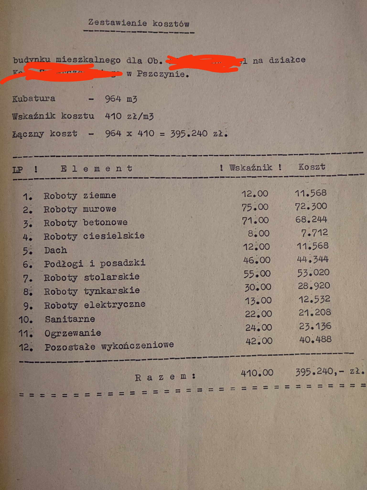

### 2022

> ‘I don’t see any big, gigantic market correction’ due to inflation, Carlyle’s David Rubenstein says

  

### 2021

Tesla Corp:

> In January 2021, we updated our investment policy to provide us with more flexibility to further diversify and maximize returns on our cash that is not required to maintain adequate operating liquidity. As part of the policy, which was duly approved by the Audit Committee of our Board of Directors, we may invest a portion of such cash in certain alternative reserve assets including digital assets, gold bullion, gold exchange-traded funds and other assets as specified in the future. Thereafter, we invested an aggregate $1.50 billion in bitcoin under this policy and may acquire and hold digital assets from time to time or long-term. Moreover, we expect to begin accepting bitcoin as a form of payment for our products in the near future, subject to applicable laws and initially on a limited basis, which we may or may not liquidate upon receipt.

https://www.sec.gov/Archives/edgar/data/1318605/000156459021004599/tsla-10k_20201231.htm

---

Na Waszą prośbę przygotowuję listę lektur, z którymi należy się zapoznać, jeżeli chce się zrozumieć marksizm. Materiał podzielę na kilka części, aby nie zarzucić Was od razu ogromem informacji.
Zacznijmy od marksizmu klasycznego.

1. "Manifest Partii Komunistycznej" z 1848 roku autorstwa Karola Marksa i Fryderyka Engelsa. Absolutna podstawa. Należy ze skupieniem przeczytać tę pracę i przeanalizować podstawę programową komunistów, tzn. realnie ocenić, do czego doprowadzi realizacja ich postulatów. Wbrew obiegowej opinii i przysłowiom typu "teoria jedno, praktyka drugie" praktyka zawsze wynika z teorii. Nigdy praktyczne skutki nie odbiegają od teoretycznych założeń. Co najwyżej trudno je przewidzieć, jeżeli plan działania zostaje przedstawiony w zawoalowany, rozwodniony sposób. Ewentualnie jeżeli nie jest się zbyt inteligentnym i wykształconym człowiekiem (XIX-wieczny proletariat i współczesny prekariat). Symboliczny "Manifest Komunistyczny" stanowi uzasadnienie rewolucyjnego terroru i przejęcia władzy przemocą poprzez zduszenie wszelkich sił reakcyjnych, czyli przeciwnych nowemu porządkowi.

2. "Rękopisy ekonomiczno-filozoficzne" z 1844 roku autorstwa Karola Marksa. Mało znane, ale niezwykle istotne dzieło tzw. młodego Marksa, w którym to filozof przedstawił swoją pierwszą wizję komunizmu pod postacią wspólnoty pierwotnej. W tekście postulował cofnięcie rozwoju cywilizacji do poziomu plemiennego, gdzie nie istnieją klasy społeczne oraz własność prywatna. Aby do tego doprowadzić, należy zniszczyć wszelkie instytucje utrzymujące człowieka w tradycyjnej kulturze i systemie kapitalistycznym, tzn. rodzinę, autorytet, Kościół, wychowanie, szkołę etc. Ze względu na mało przekonujące i odrealnione uzasadnienie Engels odrzucił tę wizję, w związku z czym w 1848 roku rewolucja komunistyczna przyjęła za swój fundament "Manifest Partii Komunistycznej", który proponował, że tak powiem, bardziej bezpośrednie rozwiązanie tej kwestii. Dopiero w 1928 roku w archiwach Socjaldemokratycznej Partii Niemiec członkowie Szkoły Frankfurckiej odnaleźli tzw. Manuskrypty Paryskie Marksa i zrozumieli, że jest to genialna koncepcja. W 1932 roku po raz pierwszy opublikowali jego zapomniane pisma, które posłużyły za źródło rewizji marksizmu w duchu antykulturowym. Uznano, że zniszczenie tradycyjnej kultury doprowadzi do degeneracji społeczeństwa i zmusi je do poparcia komunistów oferujących darmową wolność i grabież (socjalizm). Za główne narzędzie inżynierii wybrano seks jako jeden z najtrudniejszych do okiełznania ludzkich popędów: egoistyczny, dziki i trudny do utrzymania w moralnych ryzach.

3. "Pochodzenie rodziny, własności prywatnej i państwa" z 1884 roku autorstwa Fryderyka Engelsa. Książka ma udowodnić, że cały system, na który składają się rodzina, własność prywatna oraz państwo, utrzymuje kobiety oraz dzieci w patriarchalnym ucisku. Krępujące normy obyczajowe i surowe wychowanie są narzędziami dominacji mężczyzn i utrzymania statusu quo. Publikacja Engelsa stała się jednym ze źródeł zarówno rewolucji antykulturowej w łonie neomarksistów, jak również feminizmu czy też wyzwolenia się żydowskiej młodzieży w czasie tzw. Haskali, czyli tamtejszego Oświecenia (późniejszy okres, bo ruch został zapoczątkowany już w XVIII wieku). Gdyby ktoś się zastanawiał, skąd tak duża reprezentacja Żydów na lewicy, wśród socjalistów, komunistów i wywrotowców, to odpowiadam: właśnie dlatego, że komunizm oferował wyrwanie się z opresyjnego, jak na współczesne standardy, skrajnie purytańskiego modelu życia społecznego w żydowskich sztetlach.

4. "Co robić?" z 1902 roku autorstwa Włodzimierza Lenina. Przywódca bolszewickiej rewolucji w swojej pracy przedstawił koncepcję wywołania rewolucji przez partię zawodowców. Innymi słowy, za główną siłę wywrotową uznał elitarną grupę komunistów, a nie ogół proletariatu. Publikacja Lenina wywołała wiele sporów i kontrowersji. W środowisku komunistów wyłoniła się mniejszościowa grupa tzw. mienszewików, którzy opowiedzieli się za władzą zdecentralizowaną, utrzymaną w rękach rad robotniczych. Była to oczywiście wizja infantylna i wynikająca z niezrozumienia prawdziwych intencji Karola Marksa. Każda rewolucja musi zostać prędzej czy później poskromiona przez autorytarną siłę, czyli w tym przypadku kierownictwo partii wykorzystujące totalitarne metody działania do utrzymania władzy. Socjaldemokraci, którzy odrzucali przemoc na rzecz przejęcia władzy w legalnych wyborach, jak również austromarksiści, którzy chcieli nagle dokonać przewrotu przy posiadaniu większości parlamentarnej, nie rozumieli do końca Marksa. Marks wiedział, że do utrzymania komunizmu potrzebny jest aparat terroru. Rozumiał to również Lenin.

### 1996

https://en.wikipedia.org/wiki/A_Declaration_of_the_Independence_of_Cyberspace

### 1951

W Warszawie został stracony major Zygmunt Szendzielarz ps. Łupaszka. Był on dowódcą 5 Brygady Wileńskiej Armi Krajowej, która walczyła z Niemcami, oddziałami litewskimi współpracującymi z nimi i sowiecką partyzantką. Po wojnie Łupaszka został oskarżony między innymi o działanie na szkodę PRL i współpracę z zachodnim wywiadem.

  

### 1945

Na rozwiązanie Armii Krajowej

Za dywizję wołyńską, nie kwiaty i wianki -
Szubienica w Lublinie. Ojczyste Majdanki.
Za sygnał na północy, bój pod Nowogródkiem -
Długi urlop w więzieniu. Długi i ze skutkiem.

Za bój o naszą Rossę, Ostrą Bramę, Wilno -
Sucha gałąź lub zsyłka na rozpacz bezsilną.
Za dnie i noce śmierci, za lata udręki -
Taniec w kółko: raz w oczy a drugi raz w szczęki.

Za wsie spalone, bitwy, gdzie chłopska szła czeladź -
List gończy, tropicielski: dopaść i rozstrzelać!
Za mosty wysadzone z ręki robotniczej -
Węszyć gdzie kto się ukrył, psy spuścić ze smyczy.

Za wyroki na katów, za celny strzał Krysta -
Jeden wyrok: do tiurmy. Dla wszystkich. Do czysta!.
Za Warszawę, Warszawę, powstańcze zachcianki -
Specjalny odział śledczy: "przyłożyć do ścianki".

Zwinąć chorągiew z masztu. Krepą jest zasnuta
Za dywizję Rataja, Okrzei, Traugutta.
Pociąć sztandar w kawałki. Rozdać śród żołnierzy,
Na drogę, niech go wezmą. Na sercu niech leży

---

### ~1970

  

### 1940

Niemcy zwolnili z obozu koncentracyjnego Sachsenhausen 101 ze 183 podstępnie aresztowanych w ramach akcji "Sonderaktion Krakau" profesorów Uniwersytetu Jagiellońskiego i Akademii Górniczej w Krakowie. Niektórzy z nich wycieńczeni warunkami obozowymi lub z powodu znacznego
pogorszenia stanu zdrowia zmarli w różnych okresach po zwolnieniu.

  

### 1923

Organ prasowy NSDAP „Völkischer Beobachter” został przekształcony z tygodnika w dziennik.

  

### 1922

  

---

<a href="https://github.com/TomaszWaszczyk/historia.waszczyk.com/edit/master/src/content/february-2.md" target="_blank">Edytuj tę stronę dzieląc się własnymi notatkami!</a>
