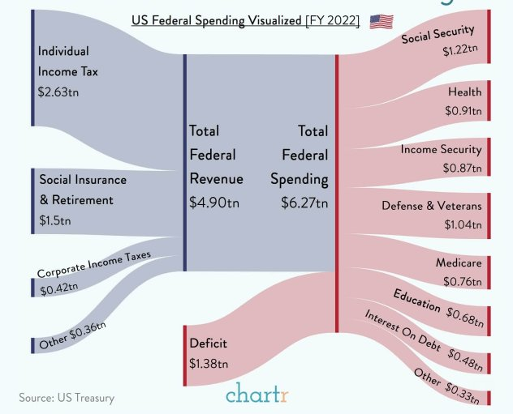
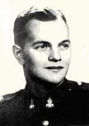
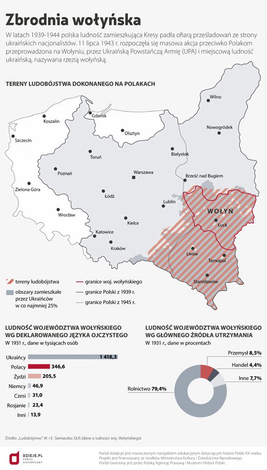

### 2022

Czy szczepionka AstraZeneca to szczepionka gorszej kategorii? - Kancelaria Premiera

<video width="640" height="480" controls>
<source src="./movies/february/astra.mp4" type="video/mp4">
Your browser does not support the video tag.
</video>

---

  

---

### 2021

Nevada bill would allow tech companies to create governments

CARSON CITY, Nev. (AP) — Planned legislation to establish new business areas in Nevada would allow technology companies to effectively form separate local governments.

Democratic Gov. Steve Sisolak announced a plan to launch so-called Innovation Zones in Nevada to jumpstart the state’s economy by attracting technology firms, Las Vegas Review-Journal reported Wednesday.

The zones would permit companies with large areas of land to form governments carrying the same authority as counties, including the ability to impose taxes, form school districts and courts and provide government services.

The measure to further economic development with the “alternative form of local government” has not yet been introduced in the Legislature.

Sisolak pitched the concept in his State of the State address delivered Jan. 19. The plan would bring in new businesses at the forefront of “groundbreaking technologies” without the use of tax abatements or other publicly funded incentive packages that previously helped Nevada attract companies like Tesla Inc.

Sisolak named Blockchains, LLC as a company that had committed to developing a “smart city” in an area east of Reno after the legislation has passed.

The draft proposal said the traditional local government model is “inadequate alone” to provide the resources to make Nevada a leader in attracting and retaining businesses and fostering economic development in emerging technologies and industries.

The Governor’s Office of Economic Development would oversee applications for the zones, which would be limited to companies working in specific business areas including blockchain, autonomous technology, the Internet of Things, robotics, artificial intelligence, wireless, biometrics and renewable resource technology.

Zone requirements would include applicants owning at least 78 square miles (202 square kilometers) of undeveloped, uninhabited land within a single county but separate from any city, town or tax increment area. Companies would have at least $250 million and plans to invest an additional $1 billion in their zones over 10 years.

The zones would initially operate with the oversight of their location counties, but would eventually take over county duties and become independent governmental bodies.

The zones would have three-member supervisor boards with the same powers as county commissioners. The businesses would maintain significant control over board membership.

The governor’s economic development office did not respond to questions about the zones Wednesday.

---

Tesla $TSLA has de-risked the acquisition of #bitcoin by public companies and accelerated the digital transformation of corporate balance sheets. Treasurers are now thinking about how to convert a non-performing asset into the best performing asset.

---

### 1953

Rada Państwa wydała dekret o "tworzeniu, obsadzaniu i znoszeniu duchownych stanowisk kościelnych"
Na mocy tego dokumentu władze komunistyczne zyskały pełne prawo i możliwość kontroli nad nominacjami kościelnymi. Dekret wprowadzony w sprzeczności z zawartym w roku 1950 poruzumieniu zawartym pomiędzy rządem, a Episkopatem Polski oraz Konstytucją z roku 1952 był jednym podobnych sobie dokumentów obowiązujących we wszystkich krajach komunistycznych Europy Wschodniej.
Dekret umożliwiał komunistom kontrolowanie i unieważnienie każdej nominacji (m.in. proboszczów) i aktu jurysdykcyjnego Kościoła. W konsekwencji władze mogły nieposłusznych reżimowi duchownych zastępować uległymi tak zwanymi "księżmi patriotami".
Dekret zmuszał również duchownych do składania ślubowania na wierność Polskiej Rzeczpospolitej Ludowej.
W artykule 6 dekretu zapisano:
"Uprawianie przez osobę piastującą duchow-
ne stanowisko kościelne działalności sprzecznej z prawemi porządkiem publicznym bądź popieranie lub osłanianie takiej działalności powoduje usunięcie tej osoby z zajmowanego stanowiska przez zwierzchni organ kościelny samoistnie lub na żądanie organów państwowych".

## 1945

Autofagia jest dobra tzn. krótkie głodówki: <https://en.wikipedia.org/wiki/Yoshinori_Ohsumi>

Wykład: <a href="https://github.com/TomaszWaszczyk/historia.waszczyk.com/blob/master/src/content/documents/february/ohsumi-lecture.pdf" target="_blank">Molecular Mechanisms of Autophagy in Yeast</a>

### 1944

W Częstochowie Gestapo zamordowało Arkadiusza Deglera (zdjęcie) podporucznika Armii Ludowej, byłego działacza Związku Walki Zbrojnej, żołnierza Armii Krajowej oddziału Wichra, szefa sztabu oddziału częstochowskiego Armii Ludowej.
Gestapowcy znaleźli go w mieszkaniu przy ulicy Garncarskiej. Pośmiertnie awansowany na porucznika i odznaczony Orderem Krzyża Grunwaldu III klasy.

  

### 1943

Uznaje się za początek rzezi na Wołyniu.

Pasywność AK, do którego dochodziły pogłoski o pogromach Polaków pozostawia spory niesmak. Armia Krajowa snuła dopiero plany o Akcji Burza, w dowództwie coraz częściej rozmawiano o wywołaniu powstania w Warszawie przeciwko okupacji niemieckiej.

Dmytro Klaczkiwski, jeden z dowódców UPA tak pisał o planach ukraińskich nacjonalistów:

"[...] Powinniśmy przeprowadzić wielką akcję likwidacji polskiego elementu. Przy odejściu wojsk niemieckich należy wykorzystać ten dogodny moment dla zlikwidowania całej ludności męskiej w wieku od 16 do 60 lat. [...] Tej walki nie możemy przegrać i za każdą cenę trzeba osłabić polskie siły. Leśne wsie oraz wioski położone obok leśnych masywów powinny zniknąć z powierzchni ziemi."

Rzeź UPA była bagatelizowana, a przecież to nie były regularne oddziały, tylko wieśniacy, którzy otrzymali na to przyzwolenie (również od samych sowietów). AK bez problemów poradziłaby sobie z tym.

W okresie od lutego 43 do lutego 45 zginęło co najmniej 60 tysięcy Polaków - tego można było uniknąć.

Zamiast oszczędzania żołnierza i amunicji na akcję burza czy samobójczą misję - życzeniowym myśleniu o odbiciu Warszawy z rąk niemieckich i dobrych zamiarach Sowietów, można było skupić się na zagrożeniach, których byliśmy w stanie przezwyciężyć. Takim była zbrodnia wołyńska.

  

### 1905

W Sosnowcu podczas rewolucji w Królestwie Polskim wojsko rosyjskie otworzyło ogień do protestujących robotników Huty Katarzyna i kilku innych sosnowieckich zakładów pracy. Zabito 40 robotników, a 105 zostało rannych.

  

---

<a href="https://github.com/TomaszWaszczyk/historia.waszczyk.com/edit/master/src/content/february-9.md" target="_blank">Edytuj tę stronę dzieląc się własnymi notatkami!</a>
