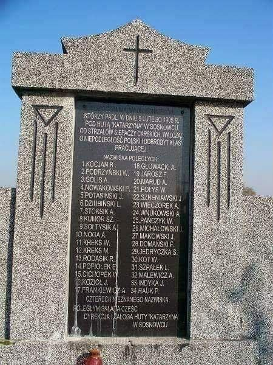

### 1953

Rada Państwa wydała dekret o "tworzeniu, obsadzaniu i znoszeniu duchownych stanowisk kościelnych"
Na mocy tego dokumentu władze komunistyczne zyskały pełne prawo i możliwość kontroli nad nominacjami kościelnymi. Dekret wprowadzony w sprzeczności z zawartym w roku 1950 poruzumieniu zawartym pomiędzy rządem, a Episkopatem Polski oraz Konstytucją z roku 1952 był jednym podobnych sobie dokumentów obowiązujących we wszystkich krajach komunistycznych Europy Wschodniej.
Dekret umożliwiał komunistom kontrolowanie i unieważnienie każdej nominacji (m.in. proboszczów) i aktu jurysdykcyjnego Kościoła. W konsekwencji władze mogły nieposłusznych reżimowi duchownych zastępować uległymi tak zwanymi "księżmi patriotami".
Dekret zmuszał również duchownych do składania ślubowania na wierność Polskiej Rzeczpospolitej Ludowej.
W artykule 6 dekretu zapisano:
"Uprawianie przez osobę piastującą duchow-
ne stanowisko kościelne działalności sprzecznej z prawemi porządkiem publicznym bądź popieranie lub osłanianie takiej działalności powoduje usunięcie tej osoby z zajmowanego stanowiska przez zwierzchni organ kościelny samoistnie lub na żądanie organów państwowych".

## 1945

Autofagia jest dobra tzn. krótkie głodówki: <https://en.wikipedia.org/wiki/Yoshinori_Ohsumi>

Wykład: <a href="https://github.com/TomaszWaszczyk/historia.waszczyk.com/blob/master/src/content/documents/february/ohsumi-lecture.pdf" target="_blank">Molecular Mechanisms of Autophagy in Yeast</a>

### 1905

W Sosnowcu podczas rewolucji w Królestwie Polskim wojsko rosyjskie otworzyło ogień do protestujących robotników Huty Katarzyna i kilku innych sosnowieckich zakładów pracy. Zabito 40 robotników, a 105 zostało rannych.

  

---

<a href="https://github.com/TomaszWaszczyk/historia.waszczyk.com/edit/master/src/content/february-9.md" target="_blank">Edytuj tę stronę dzieląc się własnymi notatkami!</a>
