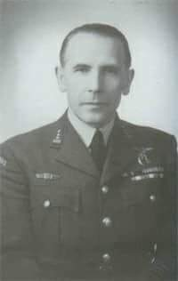
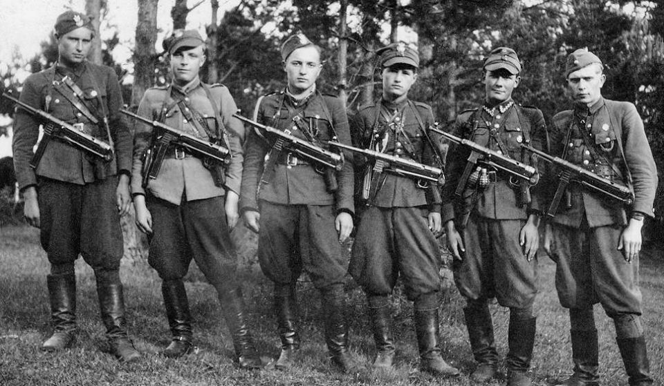
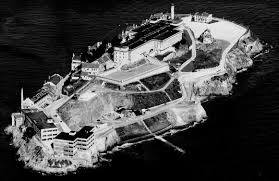
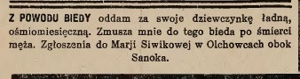
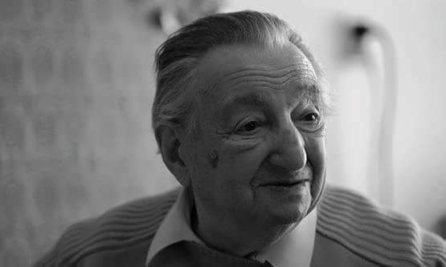
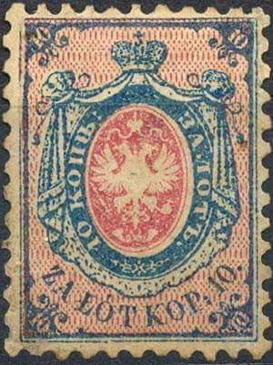
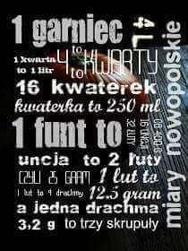

### 2023

Prawdopodobnie wchodzi w życie prawo na Ukrainie o możliwości kupowania przez osoby prawne gruntów.

### 2020

> No dobre rozpoczęcie nowego roku i dekady przypominamy, że przez najbliższe 9 lat (a właściwie nieco ponad 8) czekają nas 3 halvingi bitcoina. Roczna inflacja w bitcoinie na koniec tego dziesięciolecia będzie wynosiła około 0,45% a nagroda za blok 1,5625 BTC

---

Pod wpływem MFW Ukraina ugina się i zaczyna liberalizację handlem ziemią. Patrz rok 2023.

---

WHO

“No clear evidence of human-to-human transmission of coronavirus"

### 2017

  

### 1990

Plan Balcerowicza

### 1988

1988 władze komunistyczne zakończyły wieloletnią akcję zagłuszania Radia Wolna Europa.
Działanie to było prowadzone od roku 1952 czyli już trzy lata po uruchomieniu tej rozgłośni.
Zagłuszanie RWE prowadzono poza granicami Polski. Główne zagłuszarki o mocy dwukrotnie większej niż nadajniki RWE zainstalowano w Samarze, Nikołajewie, Leningradzie oraz Wilnie, ale również i samej Warszawie i Raszynie. Do zakłócania sygnału stosowano urządzenia produkcji polskiej, tak zwane "Szmitówki" nazwane tak od nazwiska ich konstruktora. Tak było do roku 1956. Później zagłuszanie programów nadawanych do Polski prowadzono już wyłącznie z terenu ZSRR i innych państw socjalistycznych: z Bułgarii - do kwietnia 1962, z Węgier - do marca 1963, z Rumunii - do września 1963, z Czechosłowacji - do maja 1964. Gdy w marcu 1970 Warszawa wystąpiła z ostrymi atakami pod adresem RWE z powodu wypaczonego obrazu polsko-zachodnioniemieckich rozmów rządowych, to w grudniu 1970 Polska zaczęła nadawać "programy muzyczne" (Trójkę PR) na falach RWE. Jednakże ze względu na słabe pokrycie kraju sygnałem zakłócającym trzeba było szukać innego rozwiązania technicznego. Państwowa Inspekcja Radiowa dostała wówczas polecenie sprawdzenia jakości odbioru polskich audycji Radia Moskwa w Polsce, a następnie w oparciu o wyniki polskiego nasłuchu (zleconego rozgłośniom Polskiego Radia), w Moskwie podjęto decyzję o włączeniu do zagłuszania Rozgłośni Polskiej RWE wytypowanych nadajników krótkofalowych ZSRR. Treścią zagłuszającą audycje RWE były nagrania różnych zespołów, począwszy od folklorystycznych aż po jazzowe, zrealizowane w Polskim Radiu. Fonogramy i kilka magnetofonów studyjnych Polskie Radio przekazało Międzymiastowej Stacji Telefonicznej w Warszawie przy ul. Nowogrodzkiej. Stamtąd „program muzyczny” odgrywany na magnetofonach szedł kablem do Moskwy i dalej do nadajników emitujących na Polskę.
Podobnych sprytnych modyfikacji było do roku 1988 jeszcze bardzo dużo.
Na zdjęciu demontaż zagłuszarki w Wilnie, kwiecień 1989.

### 1967

https://pl.wikipedia.org/wiki/Kapitan_%C5%BBbik

### 1952

https://pl.wikipedia.org/wiki/Pierwsza_Konferencja_Metodologiczna_Historyk%C3%B3w_Polskich

### 1949

https://en.wikipedia.org/wiki/Shannon%E2%80%93Weaver_model

### 1941

1941 roku w Londynie utworzona została placówka polskiego oficera łącznikowego przy Dowództwie Lotnictwa Bombowego RAF Bomber Command. Była ona zalążkiem polskiego Sztabu Dowództwa Lotnictwa Bombowego. Dowódcą mianowany został pułkownik pilot Stanisław Karpiński.

  

### 1944

Utworzono Armię Ludową.

Po sukcesie w bitwie pod Moskwą Józef Stalin, dyktator Związku Sowieckiego, zaczął patrzeć w przyszłość nieco bardziej optymistycznie. Wprawdzie zwycięstwo na froncie wschodnim wciąż było dalekie, jednakże punkt kulminacyjny zmagań o Moskwę Niemcy przegrali. Stalin doskonale zdawał sobie sprawę, iż z pomocą aliantów zachodnich będzie mógł ruszyć w zwycięskim marszu na zachód. Jak się później okazało, jego metą był Berlin, zdobyty przez Armię Czerwoną w maju 1945 roku. Po drodze załatwiono pewną delikatną sprawę, jaką było zainstalowanie władz na ziemiach polskich. Władz całkowicie powolnych Moskwie. Proces ten rozpoczął się już pod koniec 1941 roku, a jednym z jego etapów było sformowanie regularnej armii wspierającej poczynania polskich komunistów. W 1942 roku utworzona została Gwardia Ludowa, która po dwóch latach działalności i rozwoju została wchłonięta do Armii Ludowej, kolejnej organizacji wojskowej sprzyjającej władzom zależnym od Moskwy. W praktyce proces tworzenia Armii Ludowej oparty był na przekształceniu Gwardii Ludowej w nowy pion wojskowy, czego wyrazem było przejęcie struktur, ludzi i wyposażenia GL przez AL. Dla zachowania pozorów niezależności komuniści nie afiszowali się z faktem wykonania operacji przekształcenia, choć otoczenie związane z obozem londyńskim doskonale zdawało sobie sprawę, czyje rozkazy tak naprawdę wykonują żołnierze Armii Ludowej.

Z dniem 1 stycznia 1944 roku ogłoszono powstanie Krajowej Rady Narodowej. Organ ten miał za zadanie skupić organizacje lewicowe i komunistyczne. Był także przeciwwagą dla działającego na emigracji Rządu RP, któremu w tym czasie przewodniczył Stanisław Mikołajczyk, powiązany z przedwojennym Stronnictwem Ludowym i ruchem chłopskim. W praktyce KRN działała z ramienia Polskiej Partii Robotniczej, choć do składu samozwańczego rządu dokooptowano kilku mniej znaczących działaczy innych ugrupowań. Wśród nich znaleźli się także socjaliści, wśród których na czoło wysunął sie Edward Osóbka-Morawski z RPPS-u. Powierzono mu funkcję wiceprzewodniczącego KRN. Kierownictwo objął Bolesław Bierut. KRN jednoznacznie odciął się od Rządu Emigracyjnego, uznając ten organ za nielegalny, choć tak naprawdę jego powstanie zgodne było z prawem. Co więcej, członkowie KRN-u w dokumencie założycielskim potwierdzili utratę wschodnich rubieży II Rzeczpospolitej na rzecz ZSRR. Było to oczywiście sprzeczne z ustaleniami polskich dyplomatów emigracyjnych, choć w tym okresie ich zdanie nie miało większego znaczenia. Nie zdawali sobie bowiem sprawy z postanowień konferencji Wielkiej Trójki w Teheranie, która zakładała ustalenie polskiej granicy wschodniej na Linii Curzona. W dalszym okresie działalności KRN podporządkowała sobie Ludowe Wojsko Polskie, utworzyła Polski Komitet Wyzwolenia Narodowego, a w czerwcu 1945 roku powołała do życia Tymczasowy Rząd Jedności Narodowej. To właśnie z ramienia KRN-u powstała Armia Ludowa. Pierwsze dekrety rady: "O powołaniu i organizacji Armii Ludowej" oraz "O organizacji Dowództwa Głównego Armii Ludowej" nadawały kształt nowej sile zbrojnej w Polskim Podziemiu. Całkowita niezależność od struktur AK-owskich pozwoliła komunistom od podstaw i przy pomocy wypróbowanych na przykładzie Gwardii Ludowej metod budować armię przewidzianą jako zaplecze zbliżającej się do ziem polskich Armii Czerwonej. Dekret z 1 stycznia ustalał jej istnienie jako w pełni demokratycznych sił przewidzianych do walki z faszyzmem. W jej ramach, w wyniku szeroko zakrojonej akcji scaleniowej, udało się komunistom skupić oddziały Gwardii Ludowej, część Batalionów Chłopskich, Milicji Ludowej Robotniczej Partii Polskich Socjalistów a także część grup bojowych działających w ramach Gwardii Ludowej WRN-u. Do AL nie przyłączyły się oddziały Armii Krajowej, które znajdowały się w tym czasie na drugim biegunie polityki. Obie organizacje wielokrotnie stykały się ze sobą na różnych polach działania, niejednokrotnie podejmując aktywną współpracę przeciwko okupantowi. Zdarzały się też wypadki wzajemnej wrogości, której podłożem były rozbieżności ideologiczne i strategiczne.

Jak już wspomnieliśmy, struktury Armii Ludowej jako żywo przypominały te, które utworzono dla sprawnej organizacji Gwardii Ludowej. Dekret nr 3 uchwalony 1 stycznia 1944 roku powoływał na stanowisko naczelnego dowódcy AL gen. Michała Rolę-Żymierskiego. Szefem Sztabu Głównego został płk Franciszek Jóźwiak, który do tej pory pełnił podobne obowiązki w szeregach Gwardii Ludowej. Po pewnym czasie do Dowództwa Głównego AL dołożono osobę Jana Czechowskiego, który pełnił funkcję przedstawiciela KRN-u. Kwatera Główna podzielona została na sześć wydziałów, komórek organizacyjnych:

Oddział I Operacyjny - dowódca Grzegorz Korczyński ps. "Grzegorz"

Oddział II Informacyjny - dowódca Marian Spychalski ps. "Marek"

Oddział III Organizacyjny - dowódca Paweł Kuźnicki ps. "Wiktor"

Oddział IV Zaopatrzenia i Broni - dowódca Józef Małecki ps. "Sęk"

Oddział V Propagandy - dowódca Stanisław Nowicki ps. "Felek"

Oddział VI Bezpieczeństwa - dowódca Stanisław Kurland ps. "Korab"

Ponadto w skład Sztabu Głównego włączono jego biuro oraz służbę wydawniczą. Organizacja AL oparta była, jak już mówiliśmy, na strukturach GL. Przeprowadzono niewielką reorganizację, której wytyczne zawarte zostały w dokumentach: "Regulamin Wewnętrzny AL", "Regulamin Organizacyjny AL" oraz "Organizacja AL". W myśl ich treści obszar kraju podzielono na obwody, które z kolei dzieliły się na okręgi. Dalej wyróżniono mniejsze jednostki terenowe, odpowiadające w przybliżeniu strukturom terytorialnym kraju. Wyróżniono zatem:

1.) Obwód I Warszawski, który bezpośrednio podlegał DG AL, a w nim:

Okręg Warszawa Miasto (mjr Bolesław Kowalski ps. "Ryszard")

Okręg Warszawa Lewa Podmiejska (kpt. Paweł Wojas ps. "Roman")

Okręg Warszawa Prawa Podmiejska (kpt. Teodor Naumienko ps. "Karol")

2.) Obwód II Lubelski dowodzony kolejno przez Mieczysława Moczara, a od lipca 1944 roku przez Grzegorza Korczyńskiego), a w nim:

Okręg Lublin (por. Franciszek Woliński ps. "Franek")

Okręg Janów Lubelski (por. Tadeusz Szymański ps. "Lis")

Okręg Siedlce (por. Stanisław Laskowski ps. "Leśny")

3.) Obwód III Radomsko-Kielecki dowodzony przez Andrzeja Adryana ps. "Felek", od czerwca 1944 roku M. Moczar, a w nim:

Okręg Radom (por. Józef Jarosz ps. "Wicek")

Okręg Kielce (por. Stanisław Chruściński ps. "Stach")

Okręg Częstochowa (kpt. Bolesław Boruta ps. "Hanicz")

4.) Obwód IV Krakowski dowodzony przez Bolesława Kowalskiego ps. "Zygmunt", Franciszka Księżarczyka ps. "Michał", Bronisława Pawlika ps. "Bronek" i Stanisława Gębalę ps. "Kaleka", a w nim:

Okręg Kraków-Podhale (por. Franciszek Martyna ps. "Wilk")

Okręg Miechów (por. Stanisław Gębala ps. "Kaleka")

Okręg Rzeszów (por. Jan Urban ps. "Janek")

Okręg Jasło (por. Wojciech Kwilosz ps. "Tomek")

5.) Obwód V Śląski dowodzony przez Leona Laska ps. "Mały" i Józefa Faruga ps. "Wiktor", a w nim:

Okręg Zagłębie (por. Edward Chmielewski ps. "Mały")

Okręg Bielsko (por. Józef Faruga ps. "Granat")

Okręg Katowice (por. Wiktor Szostak ps. "Jakubowicz")

Okręg Chrzanów (por. Stanisław Wałach ps. "Zdzich")

Regulamin przewidywał także odtworzenie Obwodu VI Łódzkiego, który utworzono później zaledwie częściowo:

6.) Obwód VI Łódzki lub Płocki dowodzony przez Stefana Czerwińskiego ps. "Jerzy", a w nim:

Okręg Łódź

Okręg Poznań

Okręg Płock

Podobnie rzecz się miała z Obwodem Poznańsko-Pomorskim, który z kolei nie wszedł w skład struktur organizacyjnych AL.

Podobnie jak w wypadku Gwardii Ludowej, DG AL próbowało tworzyć kolejne jednostki na wzór hierarchii wojskowej. Dlatego też starano się organizować oddziały AL w brygady. 1. Brygada AL im. Ziemi Lubelskiej powstała na Lubelszczyźnie już w lutym 1944 roku, wchodząc w skład oddziałów Obwodu II Lubelskiego. Dowódcą brygady był kpt. Władysław Skrzypek ps. "Orzeł". Prowadził do boju swój oddział szacowany na siłę 3 batalionów do 11 kwietnia, kiedy to został zamordowany przez żołnierzy Narodowych Sił Zbrojnych. Był to odwet za zbrodniczą działalność Skrzypka, który dopuszczał się wcześniej mordów na AK-owcach oraz partyzantach NSZ-u. Bezpośrednią przyczyną likwidacji była samoobrona członka rodziny Kobylarzów, których napadli żołnierze AL pod dowództwem Skrzypka. Warto wspomnieć, iż szlak bojowy brygady prowadził przez lasy janowskie, gdzie w czerwcu 1944 roku stoczono bitwę z siłami niemieckimi. Następnie na tym samym terenie zorganizowano 2. Brygadę AL (kpt. Stępka). Dalej nowy dowódca Obwodu II G. Korczyński podjął się formowania 3. Brygady (kpt. Piątek). Polscy partyzanci uzyskali możliwość wzmocnienia swoich jednostek dzięki pomocy prowadzonej przez Polski Sztab Partyzancki, który udzielał im wsparcia w postaci zrzutów sprzętu wojskowego. PSzP zorganizowany został przy 1. Armii Ludowego Wojska Polskiego działającego u boku Armii Czerwonej na froncie wschodnim. Nie wszystkie zawiązki taktyczne AL miały pełne stany liczbowe. Liczebność oddziałów była największą bolączką ich dowódców, którzy teoretycznie w jednej brygadzie powinni mieć pond 500 ludzi. Często jednak liczby oscylowały wokół 200 partyzantów. Na Lubelszczyźnie wyglądało to stosunkowo najlepiej, dlatego też utworzono tam 4. Brygadę (mjr Rożkowski) oraz 3. Brygadę podległą PSzP (płk Satanowski). Obie składały się na zgrupowanie "Jeszcze Polska nie zginęła". Szacuje się, iż w lipcu 1944 roku na tym terenie działało 7 niepełnych brygad oraz 10 oddziałów i grup partyzanckich. Ogółem siły te liczyły 4,5 tys. żołnierzy. W tym samym okresie całość sił AL szacowana była na 10 brygad partyzanckich, 5 batalionów, 38 oddziałów i 12 grup, których liczebność wynieść miała do 8 tys. ludzi w polu. Ogółem Armia Ludowa miała do swej dyspozycji blisko 30 tys. ludzi. Uwidocznił się szybki rozwój organizacji. Warto wspomnieć, iż w międzyczasie zorganizowano chociażby 1. Brygadę AL im. Ziemi Kieleckiej (kpt. Henryk Połowniak), 1. Brygadę AL Ziemi Krakowskiej im. Bartosza Głowackiego (kpt. Józef Saturn) czy Brygadę "Grunwald" (mjr Józefa Sobiesiaka). Do szeregów AL napływali wciąż nowi ochotnicy. Część z nich przybyła zza Bugu razem z linią frontu przesuwającą się w kierunku Warszawy, część zaangażowała się ideologicznie, nie brak było i takich, którzy dostrzegali we wkraczających oddziałach sowieckich nowego okupanta, decydując się na współpracę ze strachu. Dużą rolę odgrywały oficjalne pisma wydawane przez AL m.in. "Gwardzista" przekazany w spadku przez GL, "Armia Ludowa" czy "Tygodniowy Przegląd Prasowy".

Założenia, jakimi kierowało się Dowództwo Główne AL w trakcie działania organizacji zbieżne były z polityką Sowietów, którym na rękę było funkcjonowanie silnej partyzantki antyniemieckiej na ziemiach polskich. Oczywiście, partyzantki, której mocodawcą byli komuniści i grupy lewicowe. W związku z tym Armia Czerwona i powiązane z nią siły polskie świadczyły wszelką możliwą pomoc powolnemu sobie podziemiu, organizując zrzutki broni oraz przysyłając kadry doświadczonych ludzi. Dysponując zwiększoną ilością ekwipunku, grupy bojowe Armii Ludowej coraz wydatniej przeciwdziałały terrorowi okupanta oraz destabilizowały jego zaplecze wojskowo-militarne. Sukcesy w walkach sprawiały, iż lewicowe podziemie cieszyło się coraz większym zainteresowaniem ludności, czego wyrazem były przytoczone już dane o liczebności AL. Dla przykładu powiedzieć można, iż latem 1944 roku Okręg Częstochowa pozyskał blisko 4 tys. nowych ludzi wobec 800 działających w tym rejonie na wiosnę. W związku z przesuwającym się frontem kolejne jednostki i obszary działania AL znajdowały się pod jurysdykcją Ludowego Wojska Polskiego oraz Armii Czerwonej. Dlatego też rozpoczęto proces wcielania poszczególnych oddziałów do LWP. Ponadto organizowano przy ich pomocy administrację wyzwolonych terytoriów. Byli żołnierze AL wchodzili w skład Milicji Obywatelskiej czy miejscowych organów Służby Bezpieczeństwa, które w późniejszym czasie cieszyły się wyjątkowo złą sławą. Na pierwszy ogień w podobnym procederze poszły jednostki działające na ziemi lubelskiej, a następnie kieleckiej czy krakowskiej. Oddziały włączane w skład Wojska Polskiego miały pewną suwerenność w ramach jednolitych struktur wojskowych, zachowując kształt z okresu partyzanckiej działalności. To ułatwiało ich funkcjonowanie oraz nie zmuszało do formowania nowych oddziałów. Jednocześnie tworzono nowe jednostki. W sierpniu powstała m.in. 2. Brygada AL "Świt" kpt. Maja, we wrześniu z kolei 3. Brygada AL im. J. Bema kpt. Boruty-Hanicza, 10. Brygada "Zwycięstwo" lejtn. Dońcowa czy 11. Brygada AL "Wolność" lejtn. Riaszczenko. Jak zdążyliśmy zapewne zauważyć, oficerowie radzieccy także obejmowali kluczowe stanowiska w polskich jednostkach. Formowano je po części ze zbiegłych jeńców radzieckich, jednakże obsadzanie wyższej kadry Sowietami miało też inny cel, a mianowicie skuteczniejsze podporządkowanie Polaków Armii Czerwonej. Podobny proces zauważalny jest w LWP. Działania partyzantki najgorętszy okres przeżywały jesienią 1944 roku. Polacy wzięli bowiem udział w szeregu bitew przeciwko regularnym jednostkom niemieckim, a także zaangażowali się w Powstanie Warszawskie, którego wybuch 1 sierpnia 1944 roku był największym w tej wojnie zrywem okupowanej stolicy. Reasumując wkład AL w walkę narodowowyzwoleńczą, należy powiedzieć, iż w okresie styczeń-wrzesień 1944 roku wystawiła ona do boju blisko 12 tys. żołnierzy zgrupowanych w 17 związków taktycznych oraz 63 grupy i oddziały partyzanckie. Cała organizacja pod koniec 1944 roku osiągnęła imponujący stan 60 tys. członków, jednakże wielu z nich nie zaangażowało się w walkę z bronią w ręku.

Jak już mówiliśmy, niemalże od pierwszych dni istnienia AL zaangażowała się w walkę zbrojną przeciwko niemieckiemu okupantowi. W toku trwania II wojny światowej wytyczne dotyczące militarnego oporu AL zmieniały się, jednakże główne założenia pozostały niezmienne przez cały czas funkcjonowania oddziałów związanych z KRN. 1 stycznia 1944 roku KRN uchwaliła dokument, w którym czytamy:

"Każdy, kto - niezależnie od pobudek, w sposób bezpośredni bierze udział:

a.) w akcji organizowania i dokonywania mordów bratobójczych,

b.) w akcji denuncjowania przed okupantem działaczy niepodległościowych, jak też lokali, składów, miejsc przebywania partyzantów, osób niemeldowanych itp.,

c.) w pomaganiu okupantowi w akcji niszczenia narodu polskiego przez udzielanie władzom okupacyjnym informacji o poglądach politycznych obywateli polskich, o ich działalności i aktywności społeczno-politycznej itp.,

d.) w akcji tępienia ukrywających się Żydów, oddawania ich w ręce niemieckich władz okupacyjnych lub podporządkowanych im pomocniczych organów polskich, jak też szantażowaniu i wymuszaniu świadczeń (okupów),

e.) w akcji mordowania ukrywających się jeńców wojennych lub innych osób ściganych przez okupanta, jak też oddawania ich w ręce władz okupacyjnych,

pociągnięty zostanie do odpowiedzialności i podlega surowej karze, do kary śmierci włącznie".

Jasno wskazywało to na to, iż AL-owskie podziemie zwalczać będzie przejawy wszelkiej kolaboracji, czyli współpracy z okupantem oraz działania na szkodę Polaków. Głównym jednak założeniem prowadzonej przeciwko okupantowi walki było niesienie pomocy walczącej Armii Czerwonej oraz destabilizowanie zaplecza frontowego. Odzwierciedlenie hierarchii celów, jakie wyznaczało Dowództwo Główne AL znajdziemy w końcowym raporcie działalności AL. 49,9% ogółu akcji to uderzenia w transport i łączność Niemców. Na drugim miejscu znalazły się potyczki i starcia zbrojne z oddziałami niemieckimi, co obejmowało 23,8% wszystkich akcji. Zjawiskiem charakterystycznym dla żołnierzy AL było stopniowe przesuwanie obszarów działania ze wschodu na zachód, co związane było oczywiście z przesuwającą się linią frontu wschodniego. Tereny, które obejmowali w swe posiadanie żołnierze Armii Czerwonej automatycznie przestawały być przydatne do działań partyzantki, a co za tym idzie walczące tam oddziały albo musiały zmienić miejsce stacjonowania, albo podporządkować się Sowietom. Instalowana na tych terenach władza ludowa potrzebowała nowej kadry, w tym zmobilizowanych militarnie partyzantów, którzy wchodzili w skład miejscowej administracji. W ten sposób wykorzystywano potencjał militarny i ideologiczny byłych członków Armii Ludowej. Wysiłek zbrojny organizacji rozpoczął się w pierwszych miesiącach 1944 roku. Zakończyło go wyzwolenie całości ziem polskich. Jeszcze w początkach 1945 roku AL prowadziła akcje bojowe. Znamiennym jest, iż niejednokrotnie żołnierze AL obok zwalczania okupanta podjęli się bratobójczych walk z członkami Polskiego Podziemia podległego Rządowi Emigracyjnemu. Po zakończeniu II wojny światowej wielu byłych członków AL uczestniczyło w wyniszczaniu partyzantki, która zdecydowała się opierać władzy ludowej. Prześledźmy zatem wysiłek bojowy organizacji powstałej w dniu 1 stycznia 1944 roku.

Pierwszym etapem walk było zmaksymalizowanie wysiłku na rzecz Armii Czerwonej. Wiosna 1944 roku przyniosła decydującą ofensywę Sowietów. W styczniu wydany zostaje dokument "Wytyczne dla akcji lubelskiej na luty i marzec 1944 r.", który 26 lutego zostaje opracowany w formie rozkazu DG AL. W myśl dokumentu najważniejszym celem strategicznym partyzantów stały się magistrale kolejowe biegnące przez Lubelszczyznę, co było bezpośrednim atakiem w zaplecze frontowe. Podobne rozkazy zostały wydane dla AL-owców z terenu Obwodu III. Okręg Warszawa Lewa Podmiejska także okazał się bardzo ważnym w założeniach Dowództwa Głównego AL, ponieważ to właśnie warszawska magistrala kolejowa była najmocniej eksploatowaną przez okupanta. Na tym terenie szczególnie uwidoczniło się zaangażowanie bojowe Batalionu im. "Czwartaków", o którym przeczytać możemy poniżej.

Mieczysław Wieczorek ("Armia Ludowa") podzielił okres działania AL na kilka faz. Podział ten wykorzystuje założenia taktyczne organizacji oraz zmiany pór roku. I tak historyk wyróżnił:

- okres zimowy (styczeń-kwiecień 1944)

- okres wiosenno-letni (maj-lipiec 1944)

- okres letniej i jesiennej kampanii Armii Czerwonej oraz Powstania Warszawskiego (sierpień-październik 1944)

- okres zimowej kampanii Armii Czerwonej (listopada 1944-styczeń 1945)

Okres zimowy charakteryzował się najmniejszym natężeniem walk, co spowodowane było dopiero formującymi się strukturami AL. Mimo to partyzanci przeprowadzili szereg akcji dywersyjnych oraz obronnych. Wśród działań obronnych na uwagę zasługuje fakt wzmocnienia niemieckich sił antypartyzanckich na Lubelszczyźnie, gdzie okupant budował do kwietnia 1944 roku silny pas umocnień złożony z 31 punktów oporu, 211 stanowisk bojowych oraz 241 schronów. Także na terenie okręgu Warszawa-Lewa Podmiejska Niemcy przystąpili do działań zaczepnych, niszcząc 5 stycznia grupę specjalną "Burza" liczącą 14 ludzi. 9 lutego zginęło dowództwo okręgu. Niemcy wyśledzili bowiem bazę dowództwa przy ul. Piknikowej w Pruszkowie. Bolesne straty tylko po części równoważył fakt kolejnych sukcesów AL. 3 kwietnia na linii Warszawa-Kutno wykolejono parowóz i kilka wagonów, co spowodowało całodobową przerwę w ruchu. 10 marca w Wysokiem przeprowadzono atak na posterunek policji granatowej, w wyniku którego budynek zajęto i zabito 5 funkcjonariuszy, których broń partyzanci zarekwirowali. Ten typ działalności realizował wytyczne dotyczące walki z kolaborantami oraz szczególnie gorliwymi w służbie okupanta, a także rozwiązywał problemy zaopatrzeniowe organizacji. 23 marca jeden z oddziałów dokonał śmiałego rabunku uzbrojenia z magazynu w Markach, odbierając Niemcom 200 karabinów, 10 pistoletów maszynowych oraz sporą ilość amunicji. Nie było to odosobniony przypadek napadu, ponieważ żołnierze AL często uderzali na podobne posterunki, kilkukrotnie uwalniając przetrzymywanych tam więźniów (np. 12 grudnia oddział J. Gałki ps. "Kędzior" uwolnił 160 więźniów z obozu w Byczkach). W rzeczonym okresie w samym tylko Obwodzie II łącznie wykonano 10 takich ataków. W 11 innych przypadkach celem stały się obiekty gospodarcze okupanta. Wciąż jednak największym powodzeniem cieszyły się akcje kolejowe. Apogeum osiągnęły one w drugim okresie działalności Armii Ludowej. 19 kwietnia DG AL wyznaczyło aktualne zadania na okres wiosenny, korzystając z rozwoju liczebnościowego organizacji oraz coraz lepszych warunków, w jakich walczyli ludowcy. Na polskich ziemiach działali także partyzanci radzieccy, co dawało wsparcie siłom rodzimym oraz umożliwiało szeroko zakrojoną współpracę. Szczególnie na Lubelszczyźnie osiągnięto duże natężenie wspólnych działań. "Bitwa o szyny" okazała się dobrym sposobem walki z okupantem, o czym świadczyły alarmujące raporty jednego z dygnitarzy Generalnego Gubernatorstwa Adolfa Gerteisa, który uważał: "sytuację w dystrykcie lubelskim cechują przeszkody ze strony band [...] Obecnie zdarza się przeciętnie 10-11 napadów dziennie [na linie kolejowe i urządzenia]". Od kwietnia do lipca w rejonie tym AL przeprowadziła 143 akcje wymierzonych w transport okupanta. Większość z nich polegała na wysadzeniu torów i wykolejaniu pociągów (najwięcej uderzeń na trasie Lublin-Rozwadów). Nie tylko niszczono dowóz materiałów na zapleczu wojsk niemieckich, ale i powodowano uciążliwe przerwy w operacjach zaopatrzeniowych. Okupant postanowił brutalnie rozprawić się z podziemiem, które w miarę upływu czasu dokonywało coraz śmielszych wypadów. Dlatego też od początku maja na Lubelszczyźnie trwały nieustające akcje antypartyzanckie, które zapoczątkowane zostały atakiem na Ostrów Lubelski w dniu 6 maja. Partyzanci AL zmuszeni byli do wycofania się z rejonu lasów parczewskich, przechodząc w inne rejony działania. Ewakuacja prowadzona była przez M. Moczara, jednakże nie udało się przeprowadzić jej w tajemnicy przed Niemcami, którzy szybko zorientowali się w posunięciach AL. W celu zniszczenia zgrupowania okupant użył m.in. dywizji pancernej SS "Wiking". Walki z oddziałami polskimi stoczono 10 maja pod Dąbrówką, 12 maja pod Amelinem i wreszcie pod Rąblowem 14 maja, gdzie Polacy zmuszeni byli do odpierania ataków wroga przez cały dzień (operacja Niemców o kryptonimie "Meigewitter"). W toku bitwy oddziały AL podzieliły się na dwa zgrupowania, które wyruszyły do lasów parczewskich i lasów janowskich. W związku z niepowodzeniem pierwszego uderzenia, niemieckie dowództwo przygotowało plan ofensywy opatrzonej kryptonimem "Sturmwind". Natarciem na jednostki AL dowodzić miał gen. Sigfried Haenicke, który do dyspozycji miał blisko 30 tys. żołnierzy, w tym dwie dywizje rezerwowe Wehrmachtu. Nieprzyjaciel miał dużą przewagę liczebnościową i zaopatrzeniową, ponieważ jednostki AL na Lubelszczyźnie liczyły w tym czasie 3635 żołnierzy. Walki w lasach janowskich rozgorzały jeszcze 9 czerwca, jednakże do 13 czerwca nie przybrały charakteru regularnej bitwy. Wieczorem 13 czerwca partyzanci zorganizowali się nad rzeką Branwią. Znajdowało się tam wówczas ponad 3 tys. żołnierzy, którzy wywodzili się po części z AL, Batalionów Chłopskich, a także partyzantki radzieckiej. Obok nich do walki stanął stuosobowy oddział Armii Krajowej dowodzony przez por. Bolesława Usowa ps. "Konar". Wyłoniono wspólne dowództwo i oddano je w ręce ppłk Nikołaja Prokopiuka. Walki trwały cały dzień i zwieńczone zostały bohaterską obroną Porytowego Wzgórza. Stamtąd partyzanci ewakuowali się do Puszczy Solskiej. W toku walk życie straciło, zaginęło lub zostało rannych 200 partyzantów. Niemieckie straty wyniosły 495 ludzi. Operacja "Sturmwind" zakończyła się porażką Wehrmachtu, który przystąpił teraz do operacji "Sturmwind II" - likwidacji zgrupowania w Puszczy Solskiej. 22 czerwca siły polsko-radzieckie okrążono. Wśród zamkniętych w kręgu żołnierzy znajdowało się 800 partyzantów AL i Polskiego Sztabu Partyzanckiego, którymi dowodził kpt. Ignacy Borkowski ps. "Wicek", 1000 żołnierzy AK pod dowództwem mjr Edwarda Markiewicza ps. "Kalina" i blisko 2000 partyzantów radzieckich ppłk Prokopiuka. Żołnierze AK odmówili współpracy z innymi grupami. Żołnierze AL przebili się w nocy z 22 na 23 czerwca. Następnej nocy ten sam wyczyn powiódł się Sowietom. 25 czerwca grupa AK została zniszczona przez Niemców pod Osuchami. Jeńcy zostali rozstrzelani przez siły okupanta. Siły AL straciły w bitwie blisko 200 żołnierzy. Była to największa bitwa partyzancka w dobie okupacji, która wykazała, jak wielka przepaść dzieli siły AK i AL. Nawet w obliczu śmiertelnego zagrożenia nie potrafiły się one porozumieć i współdziałać, co zakończyło się zniszczeniem zgrupowania mjr "Kaliny". Prowadzona w tym samym czasie akcja w lasach parczewskich także nie przyniosła Niemcom upragnionych rezultatów w postaci rozbicia zgrupowania polskich sił partyzanckich. Zwycięstwa AL i innych sił podziemnych umocniły partyzantów w przekonaniu, iż są wystarczająco silni, aby śmielej przeciwdziałać okupantowi. Dlatego też ponownie wzmogły się ataki dywersyjno-sabotażowe. W lipcu Niemcy ponowili ataki w lasach parczewskich. 15 lipca rozpoczęto akcję "Wirbelsturm". 17 lipca zamknięto w okrążeniu 27. Wołyńską DP AK (blisko 4 tys. ludzi) oraz zgrupowanie AL (1000 ludzi) i podobne liczebnie siły radzieckiej partyzantki. 17 lipca siłom AK udało się wymknąć z pierścienia. Pozostałe w okrążeniu jednostki zmuszone były wypełnić luki po odejściu żołnierzy AK. Od 19 lipca także i te siły wyrywały się Niemcom. Ogółem w bitwie tej AL straciła 60 żołnierzy. Lubelszczyzna była w tym czasie niemalże wyzwolona przez jednostki Armii Czerwonej, które ruszyły teraz na zachód w celu zajęcia Warszawy i innych rejonów okupowanej Polski. 1 sierpnia 1944 roku wybuchło Powstanie Warszawskie, w którym udział wzięły jednostki AL pozostające w stolicy. Sowieci dotarli do linii Wisły, przyglądając się wykrwawiającej Warszawie.

Skupiliśmy się przede wszystkim na Lubelszczyźnie. Tymczasem na innych odcinkach również trwały walki AL z okupantem. W dniach 24-26 lipca siły AL uczestniczyły w wyzwalaniu Dęblina. W Siedleckim AL-owcom udało się zniszczyć 3-kilometrowy odcinek linii telefonicznej, a pod koniec lipca niektóre grupy pomagały Sowietom zdobywać Siedlce. Na początku sierpnia AL wspierała Armię Czerwoną w walkach o Krosno czy Sanok. 13 lipca w Okręglicy powołana do życia została 1. Brygada im. Ziemi Kieleckiej. Jej dowódcą mianowano kpt. Henryka Połowniaka. Brygada otrzymała wsparcie od PSzP w postaci broni i amunicji. 28 lipca jednostka wyruszyła do Radkowic i Bronkowic, gdzie dowiedziano się o pobycie nieprzyjaciela w tym rejonie. Zorganizowana zasadzka umożliwiła zabicie 13 własowców i zdobycie 2 ckm-ów i 3 rkm-ów. 6 sierpnia na tym samym terenie powołano do życia 2. Brygadę im. Ziemi Kieleckiej. Obie jednostki wkrótce weszły w skład LWP. W trzecim kwartale 1944 roku w Kieleckim partyzanci AL przeprowadzili 120 akcji wymierzonych w transport niemiecki. Ponad 70 z nich zakończyło się wysadzeniem pociągów. Pod koniec lipca jednostki Polskiego Podziemia, w tym oddziały AL wzięły udział w wyzwalaniu terenów Pińczowa. Od 27 lipca trwała tam kontrofensywa niemiecka. Okupant zmusił AL-owców do defensywy i obrony zajętych wcześniej pozycji. Tzw. Republika Pińczowska stała się swego rodzaju punktem oporu Polskiego Podziemia. 31 lipca rozgorzały walki o opanowanie rejonu, co związane było z przybyciem wsparcia dla żołnierzy Wehrmachtu. W tym czasie w Republice Pińczowskiej przebywały czterotysięczne siły polskie, na które złożyły się 1. Brygada AL Ziemi Krakowskiej im. Głowackiego, 20. pułk AK oraz oddziały BCh. 31 lipca doszło do bitwy pod Młodzawami, w wyniku której odrzucono Niemców do Pińczowa. Następnie doszło do walk w Skalbimierzu, gdzie siły AL wyniosły 200 ludzi, AK 70 i BCh 50. 5 sierpnia Niemcy zaatakowali polskie oddziały. Grupy bojowe AK szybko uległy rozbiciu i dzięki interwencji AL udało się uratować sytuację. Kontrnatarcie wyprowadzone także przy pomocy dwóch radzieckich T-34 zakończyło się sukcesem, a Niemcy odstąpili od walki. Wcześniej przeprowadzili brutalną pacyfikację okolicy. Okupant postanowił wprowadzić do boju większe siły, angażując 6 sierpnia 24. dywizję pancerną wzmocnioną nazajutrz 13. dywizją pancerną. To zmusiło partyzantów z AK i BCh do ponownej konspiracji, a Brygadę Ziemi Krakowskiej do ryzykownego przebijania się za Nidę. Na początku września partyzanci AL zostali skierowani do miejscowych organów bezpieczeństwa. W Warszawie trwało powstanie, a tymczasem Armia Czerwona stabilizowała front nad Wisłą. Niezwykle pomocne okazały się być jednostki AL, które pomagały Sowietom w organizacji wyzwolonych rejonów. We wrześniu doszło do walk na Kielecczyźnie, gdzie hitlerowskie siły przystąpiły do antypartyzanckiej ofensywy. 12 września 3. Brygada AL im. J. Bema licząca blisko 600 ludzi stoczyła pod Ewiną całodzienny bój z dziesięciokrotnie liczebniejszym przeciwnikiem. Partyzanci bronili się z powodzeniem i wyrwali z okrążenia. W drugiej połowie miesiąca Niemcy natarli na lasy suchedniowskie, gdzie od 16-19 września rozgorzały walki 1200 żołnierzy AL z przeważającym przeciwnikiem. W nocy z 19 na 20 września AL-owcom pod dowództwem M. Moczara udało się wyrwać z pierścienia okrążenia. W dniach 29-30 września pod Gruszką oddziały mjr Henryka Połowniaka ps. "Zygmunt" odpierały uderzenie nieprzyjaciela, tracąc 100 zabitych i rannych i zadając przeciwnikowi kilkukrotnie wyższe straty. Zgrupowanie liczące 1200 żołnierzy miało w swym składzie 1. Brygadę AL im. Ziemi Kieleckiej, 2. Brygadę AL "Świt", 11. Brygadę AL "Wolność" i fragmenty 10. Brygady AL "Zwycięstwo" oraz oddziału im. Głowackiego. Po dwóch dniach walk zgrupowanie wyszło na lasy koneckie, a nieprzyjaciel nie kontynuował pościgu. Do października najbardziej zaangażowanym w walkę partyzancką rejonem była właśnie Kielecczyzna. Zrzuty dla Obwodu III umożliwiały zintensyfikowanie działań AL. Tylko w tym rejonie przeprowadzono od sierpnia 102 akcje kolejowe, a największym zaangażowaniem wykazały się 1. i 3. brygada. Wśród sukcesów wymienić należy wysadzenie 92 pociągów oraz 17 mostów kolejowych. To właśnie sukcesy AL były główną przyczyną niemieckich akcji przeciw partyzantce. Bitwa pod Gruszką nie zakończyła zmagań w Kieleckim. Na początku października doszło do zmagań w lasach siekierzyńskich, które zakończone zostały 7 dnia tego miesiąca wycofaniem się sił AL. Wkrótce dowódca okręgu wydał rozkaz o zaprzestaniu działań bojowych dużymi grupami i operowaniu w mniejszych oddziałach. W Obwodzie IV jesienią także zanotowano spadek ilości akcji bojowych. Jednakże był on mniejszy niż na innych terenach, co wiązało się z odtwarzaniem na tych terenach struktur organizacyjnych AL. Dywersja kolejowa w okolicach Krakowa objęła 16 akcji, w tym 13 w październiku. Z kolei w Obwodzie V przeprowadzono 29 podobnych uderzeń, z czego aż 17 w październiku. W listopadzie i grudniu 1944 roku działalność AL ulegała dalszemu zmarginalizowaniu ze względu na walki toczone przez Armię Czerwoną. Co ciekawe, w okręgu Warszawa-Lewa Podmiejska uwidacznia się rozrost organizacyjny AL. Liczebność oddziałów w tym rejonie stale wzrastała, co 12 grudnia pozwoliło przeprowadzić udaną akcję rozbicia obozu pracy w Byczkach i uwolnić blisko 160 więźniów. Mimo wszystko siły partyzanckie AL malały, nie przekraczając pod koniec 1944 roku 650 żołnierzy. Podczas styczniowej ofensywy Armii Czerwonej AL wystąpiła zbrojnie, udzielając pomocy sojuszniczym wojskom. Możliwości organizacji były niewielkie, jednakże przeprowadzono szereg akcji godzących w zaplecze okupanta niemieckiego. Grupy AL brały udział w wyzwalaniu niektórych miast, w tym chociażby Żyrardowa czy Płońska. Na Podhalu AL-owcy atakowali wycofujące się jednostki niemieckie, zmuszając okupanta do prowadzenia uciążliwych akcji przeciwpartyzanckich. 25 stycznia oddział "Za Wolną Ojczyznę" przeprowadził udane uderzenie na szosie między Nowym Targiem a Chabówką, niszcząc m.in. 3 samochody pancerne. Oddział im. Waryńskiego brał w tym czasie udział w wyzwalaniu Rabki. Do końca stycznia kolejne jednostki AL składały broń przed Armią Czerwoną i w dużej części wchodziły w skład Ludowego Wojska Polskiego. Wraz z wyzwoleniem okupowanych terytoriów Armia Ludowa przestała istnieć.

Decyzja o wybuchu Powstania Warszawskiego była samodzielną inicjatywą Armii Krajowej. Polskie Podziemie starało się wyzwolić stolicę jeszcze zanim wkroczą do niej jednostki radzieckie, stojące w tym czasie na prawym brzegu Wisły. Zatrzymana ofensywa Armii Czerwonej zmobilizowała Armię Krajową do podjęcia samotnego wysiłku odbicia miasta z rąk wroga. Dowództwo Główne Armii Ludowej protestowało przeciwko wybuchowi powstania, nalegając, aby moment zrywu zbrojnego odsunąć do czasu wkroczenia do Warszawy jednostek radzieckich. Nie było to jednak zbieżne z planami obozu londyńskiego oraz podległego mu podziemnego ruchu oporu. Dlatego też zdecydowano się na rozpoczęcie walk, pomimo ostrzeżeń ze strony lewicowych organizacji. 1 sierpnia 1944 rozpoczęły się walki z Niemcami. Jeszcze tego samego dnia żołnierze Armii Ludowej postanowili przyłączyć się do uderzenia zorganizowanego przez AK. Jeszcze po południu 1 sierpnia kompania dowodzona przez ppor Zbigniewa Paszkowskiego ps. "Stach" włączyła się do walk w dzielnicy Koło. Wkrótce jej szeregi poszerzyły się, co spowodowało, iż Paszkowski zreorganizował oddział, tworząc dwie kompanie pod komendą Lecha Matawowskiego ps. "Mirek" oraz Teodora Kufla ps. "Teoch". Najsilniejszą jednostką działającą w tym czasie w Warszawie z ramienia AL był Batalion Szturmowy im. "Czwartaków". Także on wszedł w skład sił polskich walczących przeciwko Niemcom. 2 sierpnia mjr Bolesław Kowalski ps. "Ryszard", który dowodził okręgiem Warszawa-Miasto wydał oficjalny rozkaz dotyczący włączenia się oddziałów AL do boju. Ogółem blisko 600 żołnierzy AL wzięło udział w walkach, podporządkowując się dowództwu Armii Krajowej i walcząc u boku AK-owskich żołnierzy, choć byli oni ideologicznym wrogiem AL. Obok kompanii Paszkowskiego na Woli walczyła 1. kompania "Czwartaków". Oddziały AL broniły skrzyżowań ulic Wolskiej z Młynarską oraz Chłodnej z Wronią. W nocy z 5 na 6 sierpnia obrońcy z AL zmuszeni byli wycofać się na Stare Miasto, tracąc w czasie walk na Woli blisko 100 poległych lub rannych. Na Starym Mieście znajdowała się w tym czasie III kompania "Czwartaków". Tam siły AL podzielono na dwa zgrupowania - Batalionem "Czwartaków" dowodził L. Kobyliński, a 3. Batalionem Henryk Woźniak ps. "Hiszpan" - które wspomagały dodatkowo wątłe siły oddelegowane ze Sztabu Głównego dowodzone przez S. Kurlanda ps. "Korab" oraz pluton szturmowy Ryszarda Suskiego ps. "Żarłok". Siły AL broniły rejonu ulic Freta-Mostowej-Bugaj-Rybaki. 26 sierpnia bomba trafiła dom przy ul. Freta 16, gdzie znajdował się sztab warszawskiego DG AL. Wszyscy zginęli. Schedę po dotychczasowym dowódcy mjr Kowalskim objął mjr Józef Małecki ps. "Sęk". Tej samej nocy część oddziałów AL wycofała się na Żoliborz, a 28 sierpnia inna część do Śródmieścia. Kilkudziesięciu żołnierzy postanowiło przedostać się do jednostek radzieckich stojących po drugiej stronie Wisły i biernie przyglądających się dramatowi Warszawy. Sformowano teraz trzy grupy, które walczyły do ostatnich dni września:

- Śródmieście - kompania por. Edwina Rozłubirskiego ps. "Gustaw" i kompania Jana Szelbuskiego ps. "Leszek", które działały do momentu kapitulacji miasta w dniu 2 października i po upadku powstania zostały rozwiązane

- Żoliborz - batalion "Kobra", batalion im. "Czwartaków" i 3. batalion, którymi dowodzili kpt. Jan Szaniawski ps. "Szwed" i por. Zenon Kliszko ps. "Zenon" walczące do 30 września. Później części żołnierzy udało się przedostać na prawy brzeg Wisły

- Czerniaków - kompania "Blaszanka" Zbigniewa Paszkowskiego ps. "Stach", która została niemalże doszczętnie zniszczona do 23 września

Armia Ludowa, choć nie została zaangażowana w tak dużym stopniu, jak siły Armii Krajowej, odegrała niepoślednią rolę w Powstaniu Warszawskim. Wielu jej żołnierzy poległo, wielu było rannych. Straty szacowane były na 500 zbitych, rannych i zaginionych.

Wśród wielu jednostek działających w ramach Armii Ludowej, jedna zasługuje na szczególną uwagę. Prawdopodobnie jest to najbardziej znany odział, który w sile batalionu służył w partyzantce. Mowa o Szturmowym Batalionie AL im. "Czwartaków", który wypromował się nie tylko wspaniałymi akcjami, ale i stał się symbolem w lewicowej propagandzie. Symbolem oporu przeciwko niemieckiej okupacji. Historia batalionu sięga 23 października 1943 roku, kiedy to został sformowany jeszcze w ramach Gwardii Ludowej. Tego dnia siedmioosobowa grupa młodych bojowców ze Związku Walki Młodych dokonała zamachu na "Bar Podlaski", gdzie zabito 16 i raniono 32 Niemców. Dowódcą w przedsięwzięciu był Lech Kobyliński ps. "Konrad". Od tego momentu datowane jest powstanie Batalionu Szturmowego im. "Czwartaków", choć tak naprawdę podwaliny pod jednostkę położono nieco wcześniej. Już na początku października dowództwo postanowiło o utworzeniu podobnej jednostki z Kobylińskim jako dowódcą. Nakazano mu sformowanie kompanii, a następnie batalionu. Zastępcą dowódcy batalionu ds. liniowych został por. Edwin Rozłubirski ps. "Gustaw", zastępcą do spraw politycznych mianowano Helenę Kozłowską ps. "Ola". Do końca roku prowadzono organizację batalionu, uzyskując cztery sekcje bojowe w grudniu. Składali się na nie najlepsi bojowcy ZWM-u przysyłani z całej Warszawy. Batalion podporządkowano bezpośrednio dowództwu Okręgu Warszawa-Miasto. Na początku 1944 roku wykształcone zostają plutony, a wiosną zaczęto używać pełnej nazwy batalionu szturmowego. Poszczególnymi plutonami dowodzili:

Pluton I - Ryszard Kazała ps. "Zygmunt"

Pluton II - Tadeusz Pietrzak ps. "Tadek"

Pluton III - Ryszard Suski ps. "Żarłok"

Prowadzono także intensywne szkolenia żołnierzy. Uwidoczniły się również wyraźne braki w wyposażeniu bojowców, co oznaczało, iż często będą zmuszeni do zdobywania ekwipunku na przeciwniku w trakcie walki. Tak też czyniono w praktyce, już w pierwszym miesiącu bojowej działalności odbierając osiem pistoletów i rewolwerów. W listopadzie żołnierze "Czwartaków" dokonują szeregu udanych akcji kolejowych, wysadzając tory kolejowe, co blokuje ważny węzeł komunikacyjny w Warszawie. 15 grudnia oddział wykoleja pociąg na trasie Warszawa-Radom. W tym samym miesiącu zanotowano też pierwsze straty. Ginie Jerzy Sawicki ps. "Gór". 22 grudnia śmierć spotyka Antoniego Szulca ps. "Antek" i Ryszarda Lenkiewicza ps. "Rysiek", którzy otoczeni przez Niemców walczą do końca. Wszyscy, mimo poczucia smutku, są jednak świadomi, iż taki jest los działacza podziemia. Mimo rosnącego ryzyka, następuje poważny wzrost liczebnościowy oddziału. Tworzy się II Kompania z Tadeuszem Pietrzakiem ps. "Tadek" na czele oraz III Kompania z Ryszardem Suskim ps. "Żarłok" w charakterze dowódcy. Dowództwo, dostrzegając bojowy potencjał oddziału, wyznacza mu coraz poważniejsze zadania, obok akcji dywersyjno-sabotażowych przeznaczając żołnierzy "Czwartaków" do ochrony spotkań KRN-u czy dowództwa AL. Coraz bardziej palący staje się problem zdobywania broni. Akcje rozbrojeniowe prowadzone na Niemcach przynoszą sukcesy, ale nie brakuje wśród nich spektakularnych klap, kiedy to żołnierze "Czwartaków" zostają zaskoczeni odsieczą niemiecką lub wpadają w pułapkę zastawioną na bojowników. Niektórzy żołnierze zostają pojmani. Podczas przesłuchań na Pawiaku ginie chociażby Adam Potocki ps. "Adam", nie wydaje jednak żadnego ze swoich kolegów. Ogółem akcja rozbrojeniowa przyniosła w okresie od 23 października 1943 roku do 1 sierpnia 1944 roku 102 pistolety lub rewolwery, 3 pistolety maszynowe oraz duże ilości amunicji. Obok tego typu uderzeń, "Czwartacy" dokonują szeregu zamachów na szczególnie wsławionych okrucieństwem funkcjonariuszy niemieckich. Akcje te przypominają operację AK opatrzoną kryptonimem "Główki". Ten typ rozprawiania się ze zbrodniczą działalnością okupanta był niezwykle skuteczny, choć pociągał za sobą krwawe represje względem warszawskiej ludności. Jego skuteczność polegała na stworzeniu przeświadczenia, iż kara za brutalność i eksterminację jest nieunikniona i może dosięgnąć każdego, co pełniło z kolei funkcję odstraszającą. Oprócz bojowej działalności Batalion Szturmowy im. "Czwartaków" rozwinął się na polu propagandy, prowadząc działalność podporządkowaną ideologii komunistycznej oraz służącą umacnianiu więzi polsko-sowieckich. Batalion wykonał pond 150 różnorodnych akcji informacyjnych, wydając szereg ulotek, odezw czy plakatów, które kolportowano na terenie Warszawy. Najważniejsze jednak były akcje sabotażowo-dywersyjne, które szczególnie godziły w przemysł wojenny okupanta. 11 marca 1944roku oddziałowi Tadeusza Pietrzaka udaje się przerwać połączenie telefoniczne łączące Berlin z jednostkami frontowymi. W czerwcu przez oddział Henryka Trocewicza ps. "Politruk" zdobyty zostaje posterunek niemieckiej policji w Zaborowie. 5 czerwca dochodzi do walki ulicznej, gdy oddział niemiecki atakuje grupę dowodzoną przez Kobylińskiego. Zabitych zostaje 5 niemieckich funkcjonariuszy. Polacy tracą zaledwie jednego rannego. Taką samą stratę poniósł podobny oddział batalionu w kilka dni później. Tym razem zabito 3 i raniono 3 Niemców. 24 czerwca II Kompania zostaje zaatakowana przez Niemców, którzy nacierają na jedną z warszawskich dzielnic. W wyniku walk zabitych zostaje 4 Niemców, kilkunastu innych jest rannych. II Kompania traci dwóch żołnierzy, a jej członkowie zmuszeni są wyjechać do Puszczy Kampinoskiej, aby uniknąć podobnych starć w przyszłości. 20 lipca rozpoczęto akcję przyjmowania zrzucanej przez Sowietów broni. W związku z tym do Pogonowa wyruszył fragment II Kompanii oraz niewielka część żołnierzy I Kompanii. Działania te komplikuje fakt przesunięcia frontu, a "Czwartacy" postanawiają wracać, mimo iż nie otrzymali broni. 28 lipca po raz pierwszy próbują przebić się do Warszawy. Siły niemieckie są jednak zbyt mocne w tym rejonie, dlatego też "Czwartacy" muszą zaniechać ponownych prób. W tym czasie trwają ostatnie przygotowania do wybuchu Powstania Warszawskiego, które rozpoczyna się 1 sierpnia 1944 roku. AL postanawia zaangażować się w walki, choć tak naprawdę była to przede wszystkim sprawa Armii Krajowej, która nie informowała AL o swoich planach wyzwolenia stolicy. "Czwartacy" także decydują się na wejście w skład walczących jednostek. Mają oni do dyspozycji 2 karabiny maszynowe, 5 pistoletów maszynowych, 120 pistoletów i rewolwerów. Dalsze uzbrojenie zdobywali już w trakcie walk, na zabijanych Niemcach. "Czwartacy" zaangażowali się w walki na Woli, Starym Mieście, na Żoliborzu i w Śródmieściu. Od pierwszych chwil powstania I Kompania toczy bój na Woli. Z kolei III Kompania walczyła na Starym Mieście. Żołnierze II Kompanii, pozostali jeszcze w Warszawie, wspomagali obie grupy. Upadek Woli przesądził o wycofaniu się I Kompanii na Stare Miasto. Tymczasem na Woli trwa bestialska eksterminacja ludności polskiej. 7 sierpnia Batalion Szturmowy łączy się na Starym Mieście. Tam trwają już zacięte walki. "Czwartakom" przydzielono rejon ulic Boleść, Mostowa i Rybaki. Obok tego dowództwo kilkukrotnie wyznacza batalionowi inne zadania. Rosną straty, ale i sukcesy. Odbity zostaje kościół NMP na Nowym Mieście, wciąż trzymają się obiekty chroniące dostęp do dzielnicy. "Czwartacy" niszczą cztery wrogie czołgi. W nocy z 27 na 28 sierpnia dowództwo wycofuje zdziesiątkowane oddziały "Czwartaków" na Żoliborz. Ewakuacją kieruje L. Kobyliński. Na miejscu pozostaje jednak część walczących, którzy do ostatnich chwil bronili Starego Miasta przed hitlerowskim naporem. Na początku września Niemcy zdobywają dzielnicę, a pozostałym przy życiu "Czwartakom" tylko w części udaje się przebić do Śródmieścia. 12 z nich ginie w jednym ze szpitali, gdzie Niemcy spalili ich żywcem. 3 września Niemcy rozpoczynają uderzenie na Śródmieście. Po dziesięciu dniach dzielnica ta zostaje odizolowana od reszty miasta. Tymczasem na Żoliborzu 14 września rozpoczyna się generalny atak niemiecki. W ostatnich dniach września, gdy kapitulacja dzielnicy jest już przesądzona, grupa kilkudziesięciu żołnierzy "Czwartaków" postanawia przebić się na drugi brzeg Wisły i połączyć z oddziałami LWP. Części żołnierzy udaje się też ukryć wśród ludności cywilnej uciekającej z miasta. 2 października podpisana zostaje kapitulacja miasta. Z przebywających na Pradze "Czwartaków" sformowany zostaje oddział spadochronowo-dywersyjny dowodzony przez mjr Mirosława Krajewskiego ps. "Piotr". Oddział ten zostaje zrzucony w okolicach Warszawy w połowie miesiąca i dociera do Andrzejowa Duranowskiego, gdzie kwateruje. Dochodzi do kilku potyczek z Niemcami. 23 stycznia 1945 roku grupa melduje się w Polskim Sztabie Partyzanckim. Jej bojowy szlak się nie kończy. Wprawdzie historia Batalionu Szturmowego im. "Czwartaków" się zakończyła, pozostali ci, którzy ów batalion tworzyli nadal walczą. W innych jednostkach, ale wciąż ci sami, bohaterscy i waleczni. Z około 400 ludzi, którzy weszli w skład oddziału, wojnę przeżyło zaledwie 103. Część z nich zmarła młodo po zakończeniu działań zbrojnych. Część włączyła się w budowanie Polski socjalistycznej.

Wkład Armii Ludowej w udział w walce przeciwko okupantowi niemieckiemu jest niepodważalny. Ilustrują to przede wszystkim statystyki działalności organizacji militarnej:

- 1550 akcji bojowych

- 774 uderzenia w transport i łączność okupanta

- 220 akcji przeciwko aparatowi terroru

- 190 uderzeń w gospodarkę i administrację

- 370 walk z siłami niemieckimi, w tym regularnymi jednostkami Whrmachtu czy SS

Z tego:

- 108 uderzeń przypadło na okręg Warszawa

- 24 uderzenia przypadły na okręg Warszawa-Lewa Podmiejska

- 53 uderzenia przypadły na okręg Warszawa-Prawa Podmiejska

- 133 uderzenia przypadły na okręg płocki

- 536 uderzeń przypadło na Obwód Lubelski

- 371 uderzeń przypadło na Obwód Radomsko-Kielecki

- 179 uderzeń przypadło na Obwód Krakowski

- 148 uderzeń przypadło na Obwód Śląsko-Dąbrowski

W swojej działalności żołnierze AL realizowali przede wszystkim założenia programowe lewicy powiązanej z Moskwą, a co za tym idzie działali na rzecz Armii Czerwonej. Wszystko to sprowadzało Armię Ludową do roli ideologicznego wroga Armii Krajowej powiązanej z obozem londyńskim. Jak zatem widzimy, ukształtowały się dwa bieguny Polskiego Podziemia, które łączył jeden szczególny cel - walka przeciwko okupantowi w celu wyzwolenia ojczyzny. Siły AL działały do momentu zajęcia przez Armię Czerwoną ziem polskich, ulegając powolnemu rozkładowi, który nie wszędzie przebiegał równomiernie. Największe zaangażowanie w walki partyzanckie uwidoczniło się w obwodzie lubelskim, gdzie siły AL przystąpiły do regularnej ofensywy przeciwko Niemcom, staczając z nimi szereg bitew. Także w okręgu warszawskim uwidoczniło się zaangażowanie bojowe AL, która nie wahała się wesprzeć Armii Krajowej podczas Powstania Warszawskiego, za co kilku żołnierzy AL gen. Tadeusz Komorowski udekorował odznaczeniami wojskowymi. Wkład AL w walkę narodowowyzwoleńczą jest zatem ogromny, choć nie można brać na serio zapewnień, iż AL miała większy udział w partyzanckiej walce niż AK, która zorganizowana była znacznie wcześniej i dokładniej. 1550 akcji bojowych świadczy jednak o dużym zaangażowaniu żołnierzy AL w dzieło niszczenia okupanta. I za to żołnierzom Armii Ludowej, niezależnie od postawy ideologicznej i źródła rozkazów, należy się chwała.

  

### 1934

Rozpoczęło działalność więzienie o zaostrzonym rygorze na wyspie Alcatraz pod San Francisco.

Na wyspie Alcatraz w zatoce San Francisco otwarte zostało jedno z najcięższych i najlepiej strzeżonych więzień w USA. Od 1850 r. właścicielem trudno dostępnej ze względu na otaczające skały wyspy była armia, która wybudowała na niej fort strzegący wejścia do zatoki. Federalny zakład penitencjarny powstał tam, dopiero gdy wyspę przejął Departament Sprawiedliwości. Więzienie mieściło jednorazowo 300 osadzonych, każdy miał osobną, zamykaną kratą celę. Wśród ponad 1,5 tys. przestępców, którzy trafił do Alcatraz, najsławniejszym był Al Capone. W ciągu 29 lat istnienia więzienia odnotowano 14 ucieczek z udziałem 34 osadzonych. Tylko dwóm udało się dotrzeć do brzegu, ale tam zostali złapani. Więzienie zostało zamknięte w 1963 r. z powodu zbyt wysokich kosztów utrzymania.

  

### 1927

  

https://en.wikipedia.org/wiki/Poverty_in_Austrian_Galicia

### 1919

1919 roku w Homlu urodził się Marek Edelman (zdjęcie)- polski lekarz kardiolog, działacz polityczny, jeden z przywódców powstania w gettcie warszawskim. W czasie okupacji był żołnierzem Żydowskiej Organizacji Bojowej. W czasie Powstania Warszawskiego walczy w podporządkowanym Armii Ludowej plutonie ŻOB na Starym Mieście. W roku 1951 ukończył studia na Akademii Medycznej w Łodzi, gdzie mieszkał prawie do końca życia. W latach 70 tych był współpracownikiem Komitetu Obrony Robotników. Był jednym z sygnatariuszy tzw "Listu 101"-protestu skierowanego do władz PRL przeciwko zmianom w konstytucji. W latach 80 tych był działaczem Solidarności. W 1983 odmówił władzom PRL udziału w Honorowym Komitecie Obchodów 40-leciaPowstania w Getcie, natomiast SB uniemożliwiła mu udział w obchodach. W roku 1988 przewodniczył Komisji ds. Mniejszości Narodowych w ramach Komitetu Obywatelskiego przy Lechu Wałęsie .
Uczestniczył w obradach podzespołu do spraw zdrowia w ramach rozmów Okrągłego Stołu. Kawaler Orderu Orła Białego (1998), doktor honoris causa Uniwersytetu Medycznego w Łodzi i Uniwersytetu Yale.
Zmarł 2 października 2009 roku w Warszawie.

  

### 1918

https://en.wikipedia.org/wiki/Hyperinflation

### 1915

https://pl.wikipedia.org/wiki/J%C3%B3zef_%C5%9Awiat%C5%82o

### 1860

W Królestwie Polskim został wprowadzony do obiegu pierwszy polski znaczek pocztowy.
Przedstawiał on herb Królewstwa Polskiego i przeznaczony był tylko do wewnętrzenego obrotu. Do zagranicznego obrotu dopuszczano go tylko w przypadku korespondencji wysyłanej do Rosji. Znaczek ten zastąpił wprowadzone do obiegu dwa lata wcześniej znaczki rosyjskie, a jego cena wynosiła 10 kopiejek.

  

### 1819

1819 roku w Królestwie Polskim zostały wprowadzone tak zwane miary nowopolskie czyli system miar, który zastąpił obowiązujące do tego czasu miary staropolskie.
Podstawowymi jednostkami miar nowopolskich były cal, ćwierć, stopa, łokieć (długość), cal geometryczny, stopa geometryczna, sążeń, pręt, sznur mierniczy (jednoski budowlane), staja i mila (drogowe), pręt kwadratowy i morga (miary powierzchni), łaszt, korzec, ćwierć i garniec (ciała sypkie), stągiew, beczka, kwarta (ciecze), cetnar, kamień, funt, uncja (handlowe).
System ten obowiązywał do roku 1849, kiedy to wprowadzono miary rosyjskie.

  

### 1659

Potop szwedzki: król Jan Kazimierz wjechał triumfalnie do odzyskanego Torunia.

Toruń miał w swej historii okresy wzlotów i upadków, podobnie jak i inne miasta. Wiele ucierpiał od naszych północnych sąsiadów zza Bałtyku. Największe zniszczenia miasto przeżyło w dobie wojen szwedzkich w latach 1626-1629, 1655-1660 i podczas wojny północnej 1700-1721.

W czasie pierwszego najazdu szwedzkiego na Polskę w 1626 r., głównym teatrem działań wojennych było ujście Wisły, przy czym wojna dosięgła też Toruń. 16 i 17 lutego 1629 r. wojska króla szwedzkiego Gustawa Adolfa pod wodzą feldmarszałka Wrangla przypuściły szturm na Toruń. Na całe szczęście atak ten zakończył się niepowodzeniem, co miasto zawdzięczało bohaterskiej postawie płk. królewskiego Gerarda Denhoffa i burmistrza Jana Preussa. Nie obeszło się jednak bez strat materialnych. Uległy zniszczeniu bramy miejskie i mury, a przedmieścia zostały spalone.

Ponownie „czarne chmury” zebrały się nad Toruniem w czasie „potopu” w 1655 r. 26 listopada znów pod miastem stanęli Szwedzi i zaczęło się regularne oblężenie. Tym razem Toruń skapitulował wobec króla Szwecji Karola X Gustawa. Stało się tak 4 grudnia 1655 r. za namową zdrajcy Hieronima Radziejowskiego, który towarzyszył Szwedom. Akt kapitulacji podpisany przez burmistrza Henryka Strobanda powodował, że miasto wypowiadało przysięgę wierności królowi polskiemu Janowi Kazimierzowi i uznawało króla szwedzkiego za nowego pana, ponadto Toruń musiał wpuścić załogę szwedzką i zapłacić kontrybucję. De facto władzę w Toruniu objął gubernator Prus Bengt Oxenstjerna i zaczął się okres okupacji, znaczony uciążliwymi rekwizycjami przez Szwedów.

Na odmianę swego losu gród Kopernika czekał do 1658 r., kiedy został odbity z rąk szwedzkich. Teraz, stroną oblegającą Toruń były oddziały polskie wspierane przez Austriaków. Było o co walczyć, jako że Toruń stanowił klucz strategiczny do kontroli nad dolnym biegiem Wisły. Pod miastem skoncentrowano siły liczące ok. 20 tys. żołnierzy, nad którymi naczelne dowództwo objął Jerzy Lubomirski, marszałek wielki i hetman polny koronny. 26 września rozpoczęło się oblężenie, które po 25 tygodniach doprowadziło załogę szwedzką do kapitulacji 22 grudnia.

1 stycznia 1659 r. wjechał triumfalnie do Torunia król Jan Kazimierz, któremu Rada Miejska musiała złożyć przysięgę wierności. Wprawdzie król udzielił Toruniowi amnestii za kolaborację ze Szwedami, ale nie szczędził mu też gorzkich słów za zdradę Rzeczypospolitej. Końcowy bilans potopu i okupacji szwedzkiej był dla miasta katastrofalny, tym bardziej, że cały czas szalała zaraza. Zniszczenia wojenne, koszty utrzymywania garnizonu szwedzkiego, rekwizycje i zwykłe rabunki doprowadziły Toruń do kryzysu gospodarczego.

Toruń w czasie wojny północnej:

Po potopie szwedzkim Toruń rozpoczął dzieło odbudowy, niestety brutalnie przerwane wybuchem kolejnej wojny – była to wojna północna 1700-1721. I znów na Toruń podobnie jak na całą Polskę spadł jak grom z nieba – najazd szwedzki, któremu przewodził król Szwecji Karol XII. Kiedy Szwedzi podeszli pod toruńską twierdzę i zaczęli intensywne bombardowanie we wrześniu 1703 r., miasto podjęło walkę i przeszło do obrony. Dopiero po prawie miesięcznej blokadzie załoga saska i mieszczaństwo Torunia skapitulowało 14 października 1703 r. Skutki tej honorowej walki były straszliwe – w wyniku bombardowań szwedzkich zapalił się ratusz i spłonęło całe wnętrze oraz zabytkowy hełm wieży. Ofiarą pożaru było też wiele kamienic w obrębie Rynku Staromiejskiego. W sumie znaczna część starówki legła w ruinie. Wszak to nie koniec nieszczęścia – liczne przemarsze obcych wojsk – szwedzkich, saskich, rosyjskich – a także polskich i ich rozboje, rabunki i gwałty dopełniały obrazu grozy. A Toruń znów był dotknięty plagą zarazy w latach 1708-1710, która następnie rozprzestrzeniła się na całe Prusy Królewskie.

Na marginesie wojny północnej warto odnotować, że w jej trakcie w październiku 1709 r. doszło w Toruniu do historycznego spotkania dwóch monarchów: króla Augusta II i cara Piotra I. Ten ostatni zakwaterował się w hotelu „Pod Trzema Koronami”. Obaj przebywali w Toruniu przez dwa tygodnie, a czas upływał im nie tylko na dyskusjach politycznych lecz i setnej zabawie oraz tęgim piciu (ponoć obydwaj mieli „mocne głowy”).

W rodzimej świadomości historycznej przechowywana jest pamięć o najeźdźcach ze wschodu lub zachodu Europy, którzy grabili nasz kraj. Rzadziej zachowujemy pamiętamy o agresorach z północy, jakimi byli Szwedzi. A ci też łupili polską ziemię, ile się tylko dało, a jej skarby wywozili do Szwecji.

### 1345

1345 roku w czasie wojny polsko -czeskiej król Polski Kazimierz III Wielki i cesarz, rzymski Ludwik IV Bawarski zawarli pakt skierowany przeciwko Luksemburgom.
Na jego mocy obaj władcy zobowiązali się do wzajemnej pomocy wojskowej w sile czterystu zbrojnych i tylu samo łuczników. Zobowiązanie ze strony polskiego władcy dotyczyło również synów cesarza, któremu Kazimierz obiecał także uderzenie na wroga swoimi siłami od strony własnego kraju. Polski król zobowiązał się również do nie zawierania sojuszu z Luksemburgami bez zgody swojego sprzymierzeńca.

### 45 r. p.n.e.

Początek biegu kalendarza juliańskiego, wprowadzonego przez Juliusza Cezara.

Kalendarz juliański to kalendarz słoneczny opracowany na życzenie Juliusza Cezara przez astronoma egipskiego Sosygenesa i wprowadzony w życie w roku 45 p.n.e. Kalendarz ten był identyczny z kalendarzem opracowanym w roku 239 p.n.e. przez Aleksandryjczyka Aristarchusa z Samos i oparty był o słoneczny rok z dwunastoma miesiącami i 365 dniami wraz z dodatkowym dniem co 4 lata.

Powodem reformy kalendarza było to, że wcześniej stosowany księżycowy kalendarz rzymski rozregulował się, w wyniku czego w 46 p.n.e. kalendarzowy grudzień wypadał we wrześniu.

Kalendarz juliański utrzymał wszystkie zewnętrzne cechy poprzedniego, księżycowo-słonecznego kalendarza rzymskiego. W wyniku reformy zmianie uległa długość poszczególnych miesięcy. Rok religijny zaczynał się w marcu, więc luty w roku religijnym był miesiącem ostatnim.

- Ianuarius (31) - Styczeń,

- Februarius (28) - Luty,

- Martius (31) - Marzec,

- Aprilis (30) - Kwiecień,

- Maius (31) - Maj,

- Iunius (30) - Czerwiec,

- Iulius (31) - Lipiec,

- Augustus (31) - Sierpień,

- September (30) = Wrzesień,

- October (31) = Październik,

- November (30) = Listopad,

- December (31) = Grudzień,

W IV w. n.e. zaczęto stosować podział miesiąca na tygodnie, które składały się z siedmiu dni:

- Lunae (poniedziałek)

- Martis (wtorek)

- Mercurii (środa)

- Iovis (czwartek)

- Veneris (piątek)

- Saturni (sobota)

- Solis (niedziela)

Średnia długość roku juliańskiego wynosi 365,25 dnia, lecz rzeczywista długość roku astronomicznego wynosi 365,2422 dnia. Kalendarz juliański opóźniał się więc o 1 dzień co 128 lat w stosunku do astronomicznego. W ten sposób do końca wieku XVI zawieruszyło się w kalendarzu juliańskim aż 10 dni. Gdyby kalendarz ten dalej obowiązywał, to w roku 10565 pierwszy dzień wiosny zbiegłby się Nowym Rokiem (1 stycznia).

  

---

<a href="https://github.com/TomaszWaszczyk/historia.waszczyk.com/edit/master/src/content/january-1.md" target="_blank">Edytuj tę stronę dzieląc się własnymi notatkami!</a>
